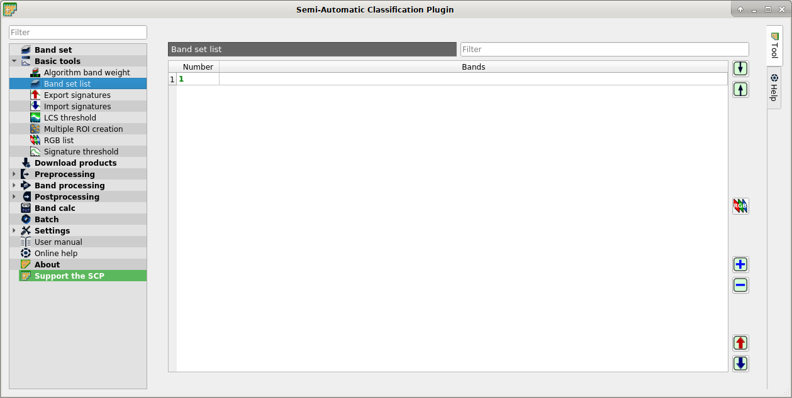

.. _band_set_list_tab:

******************************
Band set list
******************************

.. contents::
    :depth: 2
    :local:
	
.. |project_save| image:: _static/project_save.png
	:width: 20pt
	
.. |optional| image:: _static/optional.png
	:width: 20pt
	
.. |input_list| image:: _static/input_list.jpg
	:width: 20pt
	
.. |input_table| image:: _static/input_table.jpg
	:width: 20pt
	
.. |reload| image:: _static/semiautomaticclassificationplugin_reload.png
	:width: 20pt
	
.. |reset| image:: _static/semiautomaticclassificationplugin_reset.png
	:width: 20pt
	
.. |remove| image:: _static/semiautomaticclassificationplugin_remove.png
	:width: 20pt
	
.. |run| image:: _static/semiautomaticclassificationplugin_run.png
	:width: 24pt
	
.. |open_file| image:: _static/semiautomaticclassificationplugin_open_file.png
	:width: 20pt

.. |order_by_name| image:: _static/semiautomaticclassificationplugin_order_by_name.png
	:width: 20pt
	
.. |open_dir| image:: _static/semiautomaticclassificationplugin_open_dir.png
	:width: 20pt
	
.. |select_all| image:: _static/semiautomaticclassificationplugin_select_all.png
	:width: 20pt
	
.. |move_up| image:: _static/semiautomaticclassificationplugin_move_up.png
	:width: 20pt
	
.. |add_bandset| image:: _static/semiautomaticclassificationplugin_add_bandset_tool.png
	:width: 20pt
	
.. |move_down| image:: _static/semiautomaticclassificationplugin_move_down.png
	:width: 20pt

.. |import| image:: _static/semiautomaticclassificationplugin_import.png
	:width: 20pt
	
.. |export| image:: _static/semiautomaticclassificationplugin_export.png
	:width: 20pt

.. |plus| image:: _static/semiautomaticclassificationplugin_plus.png
	:width: 20pt

.. |bandset_tool| image:: _static/semiautomaticclassificationplugin_bandset_tool.png
	:width: 20pt
	
.. |close_bandset| image:: _static/close_bandset.jpg
	:width: 20pt

.. |rgb_tool| image:: _static/semiautomaticclassificationplugin_rgb_tool.png
	:width: 20pt
	
.. |add| image:: _static/semiautomaticclassificationplugin_add.png
	:width: 20pt
	
	

	
	|bandset_tool| :guilabel:`Band set list`
	
This tab allows for the management of :guilabel:`band sets` defined in :ref:`band_set_tab`.

It is possible to order or remove multiple :guilabel:`band sets` at once.
Double click the list to set the :guilabel:`active band set` (i.e. the tab selected in :ref:`band_set_definition` with bold green name).

It is also possible to export and import multiple :guilabel:`band sets` saved as file ``.scpb`` .
	
.. _band_set_list:

Band set list
^^^^^^^^^^^^^^^^^^

* |input_table| :guilabel:`Band set list`: table containing the following fields;
	* :guilabel:`Number` |project_save|: number of the :guilabel:`band set`; cannot be edited;
	* :guilabel:`Bands` |project_save|: bands of the :guilabel:`band set`; cannot be edited;

* |move_up|: move highlighted bands upward;
* |move_down|: move highlighted bands downward;
* |rgb_tool|: create a RGB :ref:`color_composite_definition` for highlighted  :guilabel:`band sets`;
* |add|: add an empty :guilabel:`band set`;
* |remove|: remove highlighted :guilabel:`band set`;
* |export|: export :guilabel:`band set list` to a file (i.e. ``.scpb``);
* |import|: import a previously saved :guilabel:`band set list` from file (i.e. ``.scpb``);

.. raw:: html

	<iframe allowfullscreen="" frameborder="0" height="360" src="http://www.youtube.com/embed/1PclAtPjyZE?rel=0" width="100%"></iframe>

http://www.youtube.com/watch?v=1PclAtPjyZE

