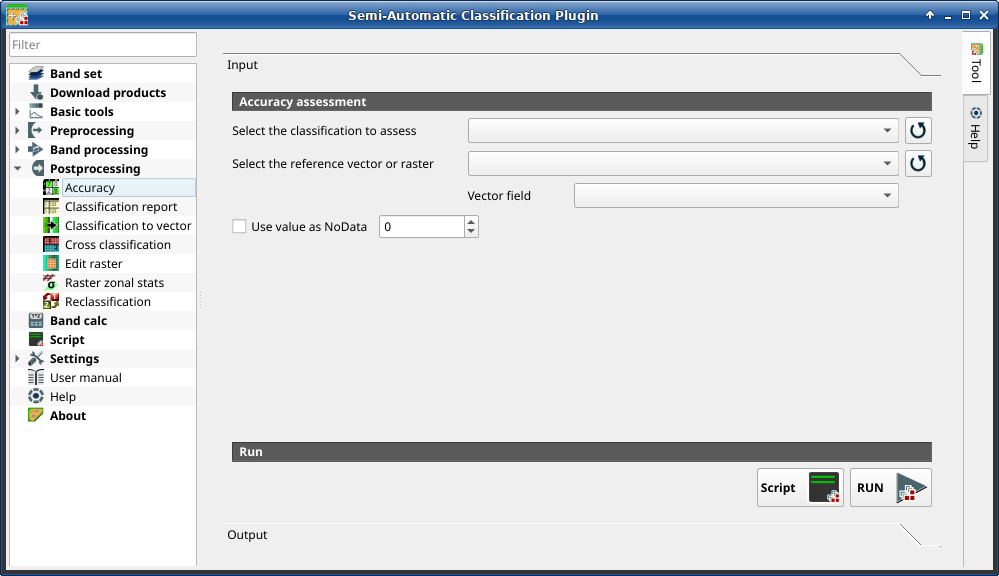

.. _accuracy_tab:

******************************
Accuracy
******************************

.. contents::
    :local:

.. |registry_save| image:: _static/registry_save.png
    :width: 20pt

.. |project_save| image:: _static/project_save.png
    :width: 20pt

.. |optional| image:: _static/optional.png
    :width: 20pt

.. |input_list| image:: _static/input_list.jpg
    :width: 20pt

.. |input_text| image:: _static/input_text.jpg
    :width: 20pt

.. |input_date| image:: _static/input_date.jpg
    :width: 20pt

.. |input_number| image:: _static/input_number.jpg
    :width: 20pt

.. |input_table| image:: _static/input_table.jpg
    :width: 20pt

.. |open_file| image:: _static/semiautomaticclassificationplugin_open_file.png
    :width: 20pt

.. |new_file| image:: _static/semiautomaticclassificationplugin_new_file.png
    :width: 20pt

.. |add| image:: _static/semiautomaticclassificationplugin_add.png
    :width: 20pt

.. |reset| image:: _static/semiautomaticclassificationplugin_reset.png
    :width: 20pt

.. |bandset_tool| image:: _static/semiautomaticclassificationplugin_bandset_tool.png
    :width: 20pt

.. |download| image:: _static/semiautomaticclassificationplugin_download_arrow.png
    :width: 20pt

.. |export| image:: _static/semiautomaticclassificationplugin_export.png
    :width: 20pt

.. |tools| image:: _static/semiautomaticclassificationplugin_roi_tool.png
    :width: 20pt

.. |preprocessing| image:: _static/semiautomaticclassificationplugin_class_tool.png
    :width: 20pt

.. |band_processing| image:: _static/semiautomaticclassificationplugin_band_processing.png
    :width: 20pt

.. |postprocessing| image:: _static/semiautomaticclassificationplugin_post_process.png
    :width: 20pt

.. |bandcalc| image:: _static/semiautomaticclassificationplugin_bandcalc_tool.png
    :width: 20pt

.. |settings| image:: _static/semiautomaticclassificationplugin_settings_tool.png
    :width: 20pt

.. |script_tool| image:: _static/semiautomaticclassificationplugin_script.png
    :width: 20pt

.. |enter| image:: _static/semiautomaticclassificationplugin_enter.png
    :width: 20pt

.. |zoom_to_ROI| image:: _static/semiautomaticclassificationplugin_zoom_to_ROI.png
    :width: 20pt

.. |check| image:: _static/semiautomaticclassificationplugin_batch_check.png
    :width: 20pt

.. |select_all| image:: _static/semiautomaticclassificationplugin_select_all.png
    :width: 20pt

.. |docks| image:: _static/semiautomaticclassificationplugin_docks.png
    :width: 20pt

.. |add_sign_tool| image:: _static/semiautomaticclassificationplugin_add_sign_tool.png
    :width: 20pt

.. |guide| image:: _static/guide.png
    :width: 20pt

.. |help| image:: _static/help.png
    :width: 20pt

.. |reload| image:: _static/semiautomaticclassificationplugin_reload.png
    :width: 20pt

.. |checkbox| image:: _static/checkbox.png
    :width: 18pt

.. |run| image:: _static/semiautomaticclassificationplugin_run.png
    :width: 24pt

.. |radiobutton| image:: _static/radiobutton.png
    :width: 18pt

.. |pointer| image:: _static/semiautomaticclassificationplugin_pointer_tool.png
    :width: 20pt

.. |threshold_tool| image:: _static/semiautomaticclassificationplugin_threshold_tool.png
    :width: 20pt

    :guilabel:`Accuracy`

This tab allows for the validation of a classification
(read :ref:`accuracy_assessment_definition` ).

Classification is compared to a reference raster or reference vector (which is
automatically converted to raster).
If a vector is selected as reference, it is possible to choose a field
describing class values.

Several statistics are calculated such as overall accuracy, user's accuracy,
producer's accuracy, and Kappa hat.
In particular, these statistics are calculated according to the area based
error matrix where each element represents the estimated area proportion of
each class.
This allows for estimating the unbiased user's accuracy and producer's
accuracy, the unbiased area of classes according to reference data, and
the standard error of area estimates.

The output is an ``error raster`` that is a ``.tif`` file showing the errors
in the map, where pixel values represent the categories of comparison (i.e.
combinations identified by the ``ErrorMatrixCode`` in the error matrix)
between the classification and reference.
Also, a text file containing the error matrix (i.e. a ``.csv`` file separated
by tab) is created with the same name defined for the ``.tif`` file.

This tool supports ``virtual raster output``; if the output file name ends
with ``.vrt`` then the output is created as virtual raster composed of as many
``.tif`` files as the number of CPU threads defined in
:ref:`system_processing`; for large rasters this can speed up the process.

.. tip::
    Information about APIs of this tool in Remotior Sensus at this
    `link <https://remotior-sensus.readthedocs.io/en/latest/remotior_sensus.tools.cross_classification.html>`_ .

.. _accuracy_input:

Accuracy
^^^^^^^^^^^^^^^^^^^^^^^^

.. list-table::
    :widths: auto
    :header-rows: 1

    * - Tool symbol and name
      - Description
    * - :guilabel:`Select the classification to assess` |input_list|
      - select a classification raster (already loaded in QGIS)
    * - |reload|
      - refresh layer list
    * - :guilabel:`Select the reference vector or raster` |input_list|
      - select a raster or a vector (already loaded in QGIS), used as
        reference layer (ground truth) for the accuracy assessment
    * - |reload|
      - refresh layer list
    * - :guilabel:`Vector field` |input_list| |optional|
      - if a vector is selected as reference, select a vector field containing
        numeric class values
    * - |checkbox| :guilabel:`Use value as  NoData` |input_number| |optional|
      - if checked, set the value of ``NoData`` pixels, ignored during the
        calculation
    * - :guilabel:`Script` |script_tool|
      - add this function to the :ref:`script_tab`
    * - :guilabel:`RUN` |run|
      - run this function
