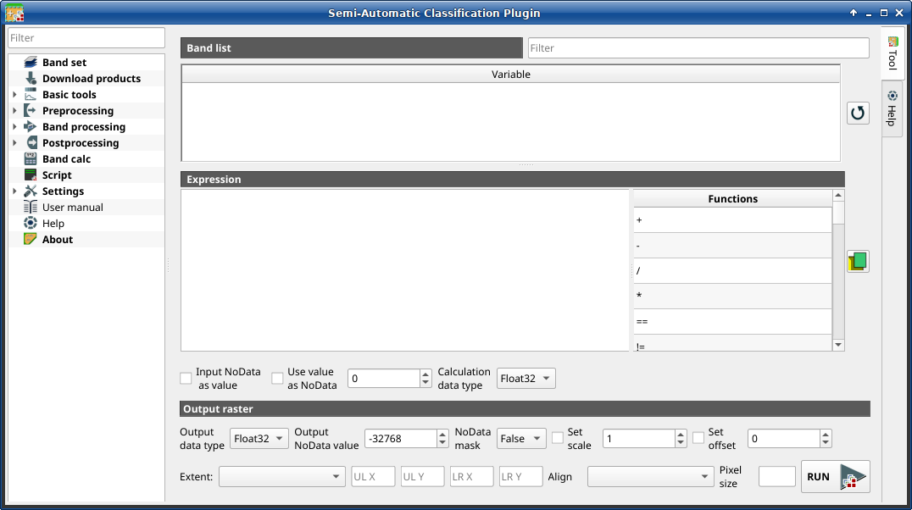

.. _band_calc_tab:

******************************
Band calc
******************************

.. contents::
    :local:

.. |registry_save| image:: _static/registry_save.png
    :width: 20pt

.. |project_save| image:: _static/project_save.png
    :width: 20pt

.. |optional| image:: _static/optional.png
    :width: 20pt

.. |input_list| image:: _static/input_list.jpg
    :width: 20pt

.. |input_text| image:: _static/input_text.jpg
    :width: 20pt

.. |input_date| image:: _static/input_date.jpg
    :width: 20pt

.. |input_number| image:: _static/input_number.jpg
    :width: 20pt

.. |input_slider| image:: _static/input_slider.jpg
    :width: 20pt

.. |input_table| image:: _static/input_table.jpg
    :width: 20pt

.. |add| image:: _static/semiautomaticclassificationplugin_add.png
    :width: 20pt

.. |checkbox| image:: _static/checkbox.png
    :width: 18pt

.. |pointer| image:: _static/semiautomaticclassificationplugin_pointer_tool.png
    :width: 20pt

.. |radiobutton| image:: _static/radiobutton.png
    :width: 18pt

.. |reload| image:: _static/semiautomaticclassificationplugin_reload.png
    :width: 20pt

.. |reset| image:: _static/semiautomaticclassificationplugin_reset.png
    :width: 20pt

.. |remove| image:: _static/semiautomaticclassificationplugin_remove.png
    :width: 20pt

.. |run| image:: _static/semiautomaticclassificationplugin_run.png
    :width: 24pt

.. |open_file| image:: _static/semiautomaticclassificationplugin_open_file.png
    :width: 20pt

.. |new_file| image:: _static/semiautomaticclassificationplugin_new_file.png
    :width: 20pt

.. |open_dir| image:: _static/semiautomaticclassificationplugin_open_dir.png
    :width: 20pt

.. |move_up| image:: _static/semiautomaticclassificationplugin_move_up.png
    :width: 20pt

.. |move_down| image:: _static/semiautomaticclassificationplugin_move_down.png
    :width: 20pt

.. |import| image:: _static/semiautomaticclassificationplugin_import.png
    :width: 20pt

.. |export| image:: _static/semiautomaticclassificationplugin_export.png
    :width: 20pt

.. |plus| image:: _static/semiautomaticclassificationplugin_plus.png
    :width: 20pt

.. |bandcalc_tool| image:: _static/semiautomaticclassificationplugin_bandcalc_tool.png
    :width: 20pt

.. |bandset_tool| image:: _static/semiautomaticclassificationplugin_bandset_tool.png
    :width: 20pt

.. |settings_tool| image:: _static/semiautomaticclassificationplugin_settings_tool.png
    :width: 20pt

    :guilabel:`Band calc`

The ``Band calc`` allows for the **raster calculation for bands** (i.e.
calculation of pixel values) using
`NumPy functions <https://numpy.org/doc/stable/reference/routines.math.html>`_.
``Band calc`` can also work with multiple expression lines to perform multiple
calculation at a time; several iteration functions are available for
:guilabel:`Band sets` allowing for performing multi-temporal calculations.

This tool supports ``virtual raster output``; if the output file name ends
with ``.vrt`` then the output is created as virtual raster composed of as many
``.tif`` files as the number of CPU threads defined in
:ref:`system_processing`; for large rasters this can speed up the process.

Raster bands must be already loaded in QGIS.
Input rasters can also be in different projection, but the output will have
the projection of the reference raster.

.. tip::
    Information about APIs of this tool in Remotior Sensus at this
    `link <https://remotior-sensus.readthedocs.io/en/latest/remotior_sensus.tools.band_calc.html>`_ .

.. _band_list2:

Band list
---------

.. list-table::
    :widths: auto
    :header-rows: 1

    * - Tool symbol and name
      - Description
    * - |input_table| :guilabel:`Band list`
      - table containing a list of single band rasters (already loaded in QGIS)
        and :ref:`input_variables` defined from :guilabel:`Band set`
    * - :guilabel:`Filter` |input_text|
      - filter the variable list
    * - |reload|
      - refresh band list

.. _expression:

Expression
----------

Enter a mathematical expression for raster bands.
In particular, NumPy functions can be used with the prefix
`np.` (e.g. ``np.log10(raster1)`` ).
For a list of NumPy functions see
`the NumPy page <https://numpy.org/doc/stable/reference/routines.math.html>`_ .

The expression can work with :guilabel:`Variable` between ``"``.
Double click on any item in the :ref:`band_list2` for adding the name thereof
to the expression.

If text color in the :guilabel:`Expression` is green, then the syntax is
correct; if text color is red, then the syntax is incorrect and it is not
possible to execute the calculation.

It is possible to enter multiple expressions separated by newlines such as
the following example::

    "raster1" + "raster2"
    "raster3" - "raster4"

The above example calculates two new rasters in the output directory with
the suffix ``_1`` (e.g. ``calc_raster_1`` ) for the first expression
and ``_2`` (e.g. ``calc_raster_2`` ) for the second expression.
Also, it is possible to define the output name using the symbol ``@``
followed by the name, such as the following example::

    "raster1" + "raster2" @calc_1
    "raster3" - "raster4" @calc_2

:ref:`input_variables` and :ref:`output_variables` can be used in the
expression.

.. list-table::
    :widths: auto
    :header-rows: 1

    * - Tool symbol and name
      - Description
    * - |checkbox| :guilabel:`Input NoData as value` |optional|
      - if checked, input ``NoData`` pixels are replaced by ``NoData`` value
        and accounted in calculation
    * - |checkbox| :guilabel:`Use value as NoData` |input_number| |optional|
      - if checked, selected value is used as ``NoData`` during calculation
    * - :guilabel:`Calculation data type`
      - select the data type used during calculation as Float32 (default),
        Int32, Int16, UInt32, UInt16, Byte; for instance, if Int32 is selected,
        input float values will be evaluated as integer
    * - |input_table| :guilabel:`Functions`
      - list of :ref:`band_calc_function` names (double click to copy one in
        the expression) such as mathematical, conditional, logical, statistics,
        indices, and custom
    * - |open_file|
      - open a text file (.txt) containing custom expressions to be listed in
        :guilabel:`Functions`

A text file can be loaded for adding expressions to the :guilabel:`Functions`.
The text must contain an expression for each line; each line must be in the
form ``expression_name; expression`` (separated by ``;``) where the
``expression_name`` is the expression name that is displayed in the
:guilabel:`Functions`.
Opening an empty text file will remove custom expressions from
the :guilabel:`Functions`.
Following an example of text content::

    NDVI; ( "#NIR#" - "#RED#" ) / ( "#NIR#" + "#RED#" ) @NDVI
    EVI; 2.5 * ( "#NIR#" - "#RED#" ) / ( "#NIR#" + 6 * "#RED#" - 7.5 * "#BLUE#" + 1) @EVI
    SR; ( "#NIR#" / "#RED#" ) @SR

.. _output_raster:

Output raster
--------------

The output raster is a .tif file, with the same spatial resolution and
projection of input rasters; if input rasters have different spatial
resolutions, then the highest resolution (i.e. minimum pixel size) is used for
output raster.

.. tip::
    If multiple lines are entered in Expression or output name are defined in
    line, a directory selection instead of a file selection is prompted for
    output.

.. list-table::
    :widths: auto
    :header-rows: 1

    * - Tool symbol and name
      - Description
    * - :guilabel:`Output data type` |input_list|
      - select the output data type as Float32 (default),
        Int32, Int16, UInt32, UInt16, Byte; it can be different from
        :guilabel:`Calculation data type`
    * - :guilabel:`Output NoData value` |input_number|
      - set the value of ``NoData`` pixels in output raster
    * - :guilabel:`NoData mask` |input_list|
      - manage NoData at pixel level; if True, then output is NoData if any
        input is NoData; if False, then output is NoData if all
        the inputs are NoData; if None, then NoData is not applied to output
    * - |checkbox| :guilabel:`Set scale` |input_number| |optional|
      - if checked, set a scale in output raster (and output values are divided
        by scale)
    * - |checkbox| :guilabel:`Set offset` |input_number| |optional|
      - if checked, set an offset in output raster (and offset is subtracted to
        output values)
    * - :guilabel:`Extent` |input_list| :guilabel:`UL X` :guilabel:`UL Y` :guilabel:`LR X` :guilabel:`LR Y`
      - set the extent of the output raster among:
            * :guilabel:`'Union'`: the extent union of input rasters
            * :guilabel:`'Map extent'`: the extent of the map currently displayed
            * :guilabel:`'Intersection'`: the extent intersection of input raster extents (i.e. minimum extent)
            * :guilabel:`'Custom'`: coordinates defined in :guilabel:`UL X` :guilabel:`UL Y` :guilabel:`LR X` :guilabel:`LR Y`
            * :guilabel:`Layer name`: the extent of the selected layer
    * - :guilabel:`Align` |input_list|
      - align the output raster to a specific :guilabel:`Layer name`
        or :guilabel:`'Default'` for automatic alignment to input rasters
    * - :guilabel:`Pixel size` |input_text|
      - set pixel size
    * - :guilabel:`RUN` |run|
      - run this function; it is disabled if the expression syntax is not
        correct

.. _input_variables:

Input variables
----------------------------

The following variables related to the :ref:`band_set_tab` are available
(please note that the character ``"`` is always required):

* :guilabel:`bandset#b` `BAND_NUMBER`: bands in the active :guilabel:`Band set`
  can be referenced directly; the following example refers to band 1 of the
  active :guilabel:`Band set`::

    "bandset#b1"

* :guilabel:`bandset` `BANDSET_NUMBER` ``b`` `BAND_NUMBER`: bands in the
  :guilabel:`Band set` can be referenced directly; the following example
  refers to band 1 of the :guilabel:`Band set` 1::

    "bandset1b1"

* :guilabel:`bandset{` `BANDSET_NUMBER_LIST` ``}b`` `BAND_NUMBER`: list of all
  the bands X of all the :guilabel:`Band sets` matching a list between curly
  brackets (e.g. {1,2,3}) or range of :guilabel:`Band sets` separated by colon
  (e.g. {1:3}) or a list of ranges of :guilabel:`Band sets` (e.g. {1:3, 5:8}),
  which is equivalent to ``[bandset1bX, bandset2bX, ..., bandsetNbX]``; this
  variable can be used in expressions that accept band lists such as the sum::

    sum("bandset{1,3}b1")

* :guilabel:`bandset#b*`: list of all the bands of active :guilabel:`Band set`,
  which is equivalent to ``[bandset#b1, bandset#b2, ..., bandset#bX]``; to be
  used in expressions that accept band lists such as the maximum value::

    max("bandset#b*")

* :guilabel:`bandset` `BANDSET_NUMBER` ``b*``: list of all the bands of
  :guilabel:`Band set` N, which is equivalent to
  ``[bandsetNb1, bandsetNb2, ..., bandsetNbX]``; to be used in expressions
  that accept band lists such as the minimum value::

    min("bandset1b*")

* :guilabel:`bandset*b` `BAND_NUMBER`: list of all the bands X of all the
  :guilabel:`Band sets`, which is equivalent to
  ``[bandset1bX, bandset2bX, ..., bandsetNbX]``; to be used in expressions that
  accept band lists such as the mean value::

    mean("bandset*b1")

* :guilabel:`bandset{` `DATE` ``}b`` `BAND_NUMBER`: list of all the bands X of
  all the :guilabel:`Band sets` matching a list of dates (format yyyy-mm-dd)
  between curly brackets (e.g. {2019-01-01,2019-07-31}) or range of dates
  separated by colon (e.g. {2019-01-01:2019-07-31}) or a list of ranges of
  dates (e.g. {2019-01-01:2019-01-31, 2019-04-01:2019-07-31}), which is
  equivalent to ``[bandset2bX, bandset5bX, ..., bandsetNbX]``;
  :guilabel:`Band sets` dates are defined in :ref:`band_set_definition`;
  this variable can be used in expressions that accept band lists such as the
  median value::

    median("bandset{2019-01-01,2019-07-31}b1")

* :guilabel:`"#BLUE#"`: the band with the center wavelength closest to
  0.475 :math:`\mu m`;
* :guilabel:`"#GREEN#"`: the band with the center wavelength closest to
  0.56 :math:`\mu m`;
* :guilabel:`"#RED#"`: the band with the center wavelength closest to
  0.65 :math:`\mu m`;
* :guilabel:`"#NIR#"`: the band with the center wavelength closest to
  0.85 :math:`\mu m`; for example::

    ( "#NIR#" - "#RED#" ) / ( "#NIR#" + "#RED#" )

.. _output_variables:

Output variables
----------------------------

**Output names** can be defined in the expression line entering the symbol
``@`` followed by the name, such as the following example::

    "raster1" * 2 @first_calculation

If the output name is defined in the expression, an output directory will be
selected after clicking the button :guilabel:`RUN`.

.. warning::
    It is recommended to avoid the use of characters # and @ in the output
    raster name.

It is possible to set the **output path** directly by defining the output name
with this structure ``@path@name``, such as::

    "raster1" * 2 @/home/user@first_calculation

The directory will be created if it does not exist.

It is possible to create a **temporary output** (saved in the temporary
directory) with ``@temp@`` followed by output name, such as::

    "raster1" * 2 @temp@first_calculation

The **output name** of calculation can be used **as input variable** for the
following calculations; for example::

    "raster1" * 2 @first_calculation
    "first_calculation" + 5 @temp@second_calculation
    "second_calculation" - "raster1" @/home/user@third_calculation

It is possible to **add the calculation result to a Band set** using the
symbol ``%`` followed by the :guilabel:`Band set` number such as::

    "raster1" @first_calculation%1

It is possible to **add the calculation result to the active Band set** using
the symbol ``%`` followed by the symbol ``#`` such as::

    "raster1" @first_calculation%#

Also, variables for output name are available:

* :guilabel:`#BANDSET#`: the name of the first band in the :ref:`band_set_tab`;
* :guilabel:`#DATE#`: the current date and time (e.g. 20161110_113846527764);

Using the symbol ``@`` followed by the variable #BANDSET# can save the raster
calculation inside the **directory containing the first band** of the active
band set, such as::

    "raster1" @#BANDSET#@first_calculation

If the output name is defined with the extension ``.vrt``, the output will be
a **virtual raster** referencing the single ``.tif`` files calculated by
parallel processing.
For instance, the following expression will calculate the raster with parallel
processing and the output will be a ``.vrt``::

    "raster1" @first_calculation.vrt

Virtual file is useful to reduce calculation time of parallel processing by
avoiding the writing of the entire output raster.

.. warning::
    A ``.vrt`` virtual file is a text file containing the reference to
    existing ``.tif`` files. Moving the ``.vrt`` virtual file or the ``.tif``
    files in different directories can make the virtual file unusable.

.. _band_calc_function:

Functions
----------------------------

.. _band_calc_conditional:

Conditional
^^^^^^^^^^^^^^^^^^^^^^^^^^^^^^^

* :guilabel:`where`: conditional expression according to the syntax
  ``where( condition , value if true, value if false)`` for example::

    where("raster1" == 1, 2, "raster1")

Parenthesis are required for multiple conditions for instance to select pixel
values between 1 and 3::

    where( ("raster1" > 1) & ("raster1" < 3), 2, "raster1")

Nested conditions can be defined such as::

    where( ("raster1" > 1) & ("raster1" < 3), 2, "raster1")

.. _band_calc_logical:

Logical
^^^^^^^^^^^^^^^^^^^^^^^^^^^^^^^

* :guilabel:`AND`: AND;
* :guilabel:`OR`: OR;
* :guilabel:`XOR`: XOR;
* :guilabel:`NOT`: NOT;

.. _band_calc_statistics:

Statistics
^^^^^^^^^^^^^^^^^^^^^^^^^^^^^^^

A band list between square brackets or :ref:`input_variables` are required
arguments.

* :guilabel:`max`: maximum; for instance::

    max(["raster1", "raster2", "raster3"])

* :guilabel:`min`: minimum; for instance::

    min(["bandset#b*"])

* :guilabel:`mean`: mean; for instance::

    mean("bandset*b1")

* :guilabel:`median`: median; for instance::

    median("bandset{2019-01-01,2019-07-31}b1")

* :guilabel:`percentile`: percentile calculation; the expression must have
  this structure ``percentile([band_list], percentile_value)``; for instance,
  the following expression calculates the 10th percentile of active band set::

    percentile("bandset#b*", 10)

* :guilabel:`std`: standard deviation; for instance::

    std("bandset{1,3}b1")

* :guilabel:`sum`: sum; for instance::

    sum("bandset{1:5}b1")

.. _band_calc_operations:

Operations
^^^^^^^^^^^^^^^^^^^^^^^^^^^^^^^

* :guilabel:`sin`: sine; for instance::

    sin("raster1")

* :guilabel:`cos`: cosine;
* :guilabel:`tan`: tangent;
* :guilabel:`asin`: inverse sine;
* :guilabel:`acos`: inverse cosine;
* :guilabel:`atan`: inverse tangent;
* :guilabel:`exp`: natural exponential;
* :guilabel:`ln`: natural logarithm;
* :guilabel:`log`: base 10 logarithm;

.. _band_calc_indices:

Indices
^^^^^^^^^^^^^^^^^^^^^^^^^^^^^^^

* :guilabel:`NDVI`: if selected, the NDVI calculation is entered in the
  :guilabel:`Expression`::

    ( "#NIR#" - "#RED#" ) / ( "#NIR#" + "#RED#" ) @ NDVI

* :guilabel:`EVI`: if selected, the EVI calculation is entered in the
  :guilabel:`Expression`::

    2.5 * ( "#NIR#" - "#RED#" ) / ( "#NIR#" + 6 * "#RED#" - 7.5 * "#BLUE#" + 1) @ EVI

* :guilabel:`NBR`: if selected, the NBR calculation is entered in the
  :guilabel:`Expression`::

    ( "#NIR#" - "#SWIR2#" ) / ( "#NIR#" + "#SWIR2#" ) @NBR

.. _band_calc_variables:

Variables
^^^^^^^^^^^^^^^^^^^^^^^^^^^^^^^

* :guilabel:`nodata`: NoData value of raster (e.g. ``nodata("raster1")``); it
  can be used as value in the expression::

    where("raster1" == nodata("raster1"), 0, "raster1")

* :guilabel:`forbandsets`: it allows for the iteration over
  :guilabel:`Band sets` defined between square brackets; a range of
  :guilabel:`Band sets` separated by colon (e.g. ``forbandsets[1:3]``) or a
  list separated by commas (e.g. ``forbandsets[1,2,3]``; ``forbandsets`` must
  be entered in the first line of expressions (not compatible with
  ``forbandsinbandset``), for instance::

    forbandsets[1:3]
    "bandset#b1" @#BANDSET#

During the iteration, the :ref:`input_variables` related to the active
:guilabel:`Band set` are replaced by the iterator, therefore the expression::

    forbandsets[1:3]
    "bandset#b1" @#BANDSET#

is equivalent to::

    "bandset1b1" @calc1
    "bandset2b1" @calc2
    "bandset3b1" @calc3

It is possible to enter a string (or a list of strings separated by comma
``,``) after the square bracket ``]`` to filter :guilabel:`Band sets` by the
name of first band in :guilabel:`Band set`; for instance, the following
expression will iterate the first 3 :guilabel:`Band sets` selecting only the
:guilabel:`Band set` whose name of the first band includes ``RT``::

    forbandsets[1,2,3]RT

Also, :guilabel:`forbandsets`: allows for the iteration over
:guilabel:`Band sets` dates (format yyyy-mm-dd, defined in
:ref:`band_set_definition`) between square brackets,
such as the following examples:

Iterating over a range of dates::

    forbandsets[2020-01-01:2020-07-31]
    "bandset#b1" @#BANDSET#

Iterating over a list of dates::

    forbandsets[2020-02-01,2020-03-11,2020-04-21]
    "bandset#b1" @#BANDSET#

Iterating over a list of ranges of dates::

    forbandsets[2010-01-01:2010-06-31, 2010-08-01:2010-08-31, 2010-10-01:2010-12-31]
    "bandset#b1" @#BANDSET#

During the iteration, the :ref:`input_variables` related to the active
:guilabel:`Band set` are replaced by the iterator.

It is possible to enter a string (or a list of strings separated by comma
``,``) after the square bracket ``]`` to filter :guilabel:`Band sets` by the
name of first band in :guilabel:`Band set`; for instance, the following
expression will iterate the :guilabel:`Band sets` in the range selecting only
the :guilabel:`Band set` whose name of the first band includes ``RT``::

    forbandsets[2020-01-01:2020-07-31]RT

* :guilabel:`forbandsinbandset`: it allows for the iteration over bands in a
  :guilabel:`Band set` or a range of :guilabel:`Band sets` between square
  brackets; ``forbandsinbandset`` must be entered in the first line of
  expressions (not compatible with ``forbandsets``); the
  variable #BAND# must be used to refer to the iterated band such as the
  following examples:

Iterating over the bands of the first :guilabel:`Band set` (note the ``"`` in
the expression)::

    forbandsinbandset[1]
    where("#BAND#" > 1, 1, 2) @#BAND#)

Iterating over all the bands of :guilabel:`Band sets` from 1 to 3::

    forbandsinbandset[1:3]
    where("#BAND#" > 1, 1, 2) @#BAND#)

* :guilabel:`#BAND#`:

* :guilabel:`#BANDSET#`: the name of the first band in the :ref:`band_set_tab`;
* :guilabel:`#DATE#`: the current date and time (e.g. 20161110_113846527764);
* :guilabel:`@`: character @;

