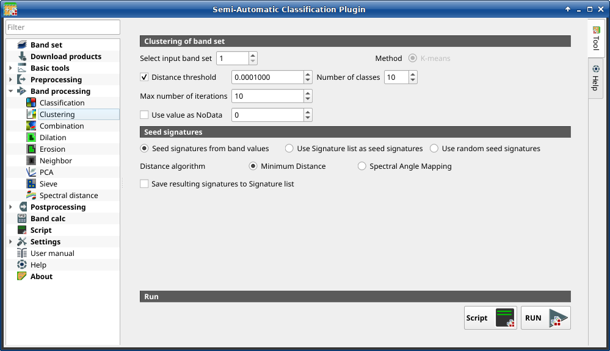

.. _band_clustering_tab:

******************************
Clustering
******************************

.. contents::
    :local:

.. |registry_save| image:: _static/registry_save.png
    :width: 20pt

.. |project_save| image:: _static/project_save.png
    :width: 20pt

.. |optional| image:: _static/optional.png
    :width: 20pt

.. |input_list| image:: _static/input_list.jpg
    :width: 20pt

.. |input_text| image:: _static/input_text.jpg
    :width: 20pt

.. |input_date| image:: _static/input_date.jpg
    :width: 20pt

.. |input_number| image:: _static/input_number.jpg
    :width: 20pt

.. |input_table| image:: _static/input_table.jpg
    :width: 20pt

.. |open_file| image:: _static/semiautomaticclassificationplugin_open_file.png
    :width: 20pt

.. |new_file| image:: _static/semiautomaticclassificationplugin_new_file.png
    :width: 20pt

.. |add| image:: _static/semiautomaticclassificationplugin_add.png
    :width: 20pt

.. |reset| image:: _static/semiautomaticclassificationplugin_reset.png
    :width: 20pt

.. |bandset_tool| image:: _static/semiautomaticclassificationplugin_bandset_tool.png
    :width: 20pt

.. |download| image:: _static/semiautomaticclassificationplugin_download_arrow.png
    :width: 20pt

.. |export| image:: _static/semiautomaticclassificationplugin_export.png
    :width: 20pt

.. |tools| image:: _static/semiautomaticclassificationplugin_roi_tool.png
    :width: 20pt

.. |preprocessing| image:: _static/semiautomaticclassificationplugin_class_tool.png
    :width: 20pt

.. |band_processing| image:: _static/semiautomaticclassificationplugin_band_processing.png
    :width: 20pt

.. |postprocessing| image:: _static/semiautomaticclassificationplugin_post_process.png
    :width: 20pt

.. |bandcalc| image:: _static/semiautomaticclassificationplugin_bandcalc_tool.png
    :width: 20pt

.. |settings| image:: _static/semiautomaticclassificationplugin_settings_tool.png
    :width: 20pt

.. |script_tool| image:: _static/semiautomaticclassificationplugin_script.png
    :width: 20pt

.. |enter| image:: _static/semiautomaticclassificationplugin_enter.png
    :width: 20pt

.. |zoom_to_ROI| image:: _static/semiautomaticclassificationplugin_zoom_to_ROI.png
    :width: 20pt

.. |check| image:: _static/semiautomaticclassificationplugin_batch_check.png
    :width: 20pt

.. |select_all| image:: _static/semiautomaticclassificationplugin_select_all.png
    :width: 20pt

.. |docks| image:: _static/semiautomaticclassificationplugin_docks.png
    :width: 20pt

.. |add_sign_tool| image:: _static/semiautomaticclassificationplugin_add_sign_tool.png
    :width: 20pt

.. |guide| image:: _static/guide.png
    :width: 20pt

.. |help| image:: _static/help.png
    :width: 20pt

.. |reload| image:: _static/semiautomaticclassificationplugin_reload.png
    :width: 20pt

.. |checkbox| image:: _static/checkbox.png
    :width: 18pt

.. |run| image:: _static/semiautomaticclassificationplugin_run.png
    :width: 24pt

.. |radiobutton| image:: _static/radiobutton.png
    :width: 18pt

.. |pointer| image:: _static/semiautomaticclassificationplugin_pointer_tool.png
    :width: 20pt

.. |threshold_tool| image:: _static/semiautomaticclassificationplugin_threshold_tool.png
    :width: 20pt

    :guilabel:`Clustering`

This tab allows for the :ref:`clustering_definition` of a :ref:`band_set_tab`.
In particular, :ref:`kmeans_definition` method is available.

The spectral signatures are saved along with the classification, and can be
saved in the :ref:`training_input`.

.. tip::
    Information about APIs of this tool in Remotior Sensus at this
    `link <https://remotior-sensus.readthedocs.io/en/latest/remotior_sensus.tools.band_clustering.html>`_ .

.. _band_clustering_input:

Clustering of band set
^^^^^^^^^^^^^^^^^^^^^^^^^^^^^^^^^^^^^^^^^^^^^^^^

.. list-table::
    :widths: auto
    :header-rows: 1

    * - Tool symbol and name
      - Description
    * - :guilabel:`Select input band set` |input_number|
      - select the input :ref:`band_set_tab`
    * - :guilabel:`Method` |radiobutton| :guilabel:`K-means`
      - select the clustering method :ref:`kmeans_definition`
    * - |checkbox| :guilabel:`Distance threshold` |input_number|
      - if checked, K-means iteration is terminated if distance is lower
        than threshold
    * - :guilabel:`Number of classes` |input_number|
      - number of desired output classes
    * - :guilabel:`Max number of iterations` |input_number|
      - maximum number of iterations if :guilabel:`Distance threshold` is
        not reached
    * - |checkbox| :guilabel:`Use value as  NoData` |input_number|
      - if checked, set the value of ``NoData`` pixels, ignored during the
        calculation

.. _seed_signatures:

Seed signatures
^^^^^^^^^^^^^^^^^^^^^^^^^^^^^^^^^^^^^^^^^^^^^^^^

.. list-table::
    :widths: auto
    :header-rows: 1

    * - Tool symbol and name
      - Description
    * - |radiobutton| :guilabel:`Seed signatures from band values`

        |radiobutton| :guilabel:`Use Signature list as seed signatures`

        |radiobutton| :guilabel:`Use random seed signatures`
      - select one options for seed signatures that start the iteration;

        the option :guilabel:`Seed signatures from band values` divides the
        spectral space of the :ref:`band_set_tab` to get spectral signatures;

        the option :guilabel:`Use Signature list as seed signatures` uses the
        spectral signatures checked in :ref:`ROI_list`; the
        option :guilabel:`Use random seed signatures` randomly selects the
        spectral signatures of pixels in the :ref:`band_set_tab`
    * - :guilabel:`Distance algorithm` |radiobutton|
        :guilabel:`Minimum Distance` |radiobutton|
        :guilabel:`Spectral Angle Mapping`
      - select :ref:`minimum_distance_algorithm` or
        :ref:`spectra_angle_mapping_algorithm` for spectral distance
        calculation
    * - |checkbox| :guilabel:`Save resulting signatures to Signature list`
      - if checked, save the resulting spectral signatures in the
        :ref:`ROI_list`
    * - :guilabel:`Script` |script_tool|
      - add this function to the :ref:`script_tab`
    * - :guilabel:`RUN` |run|
      - run this function