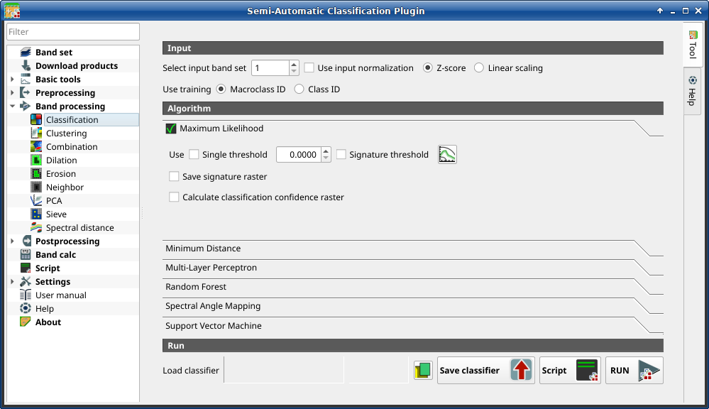
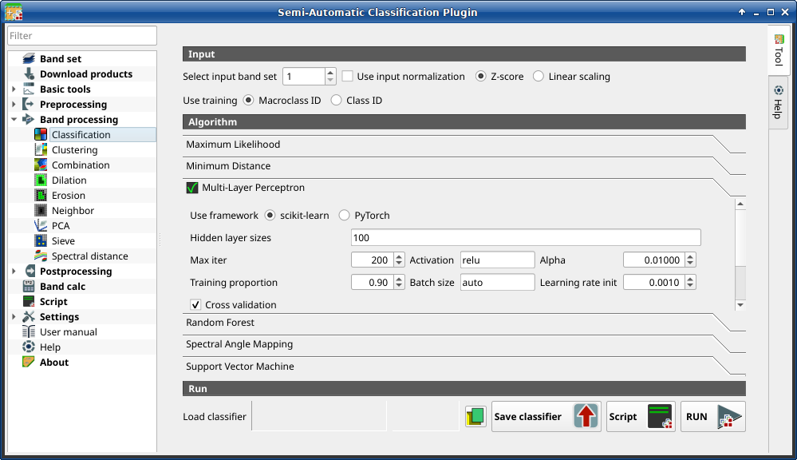
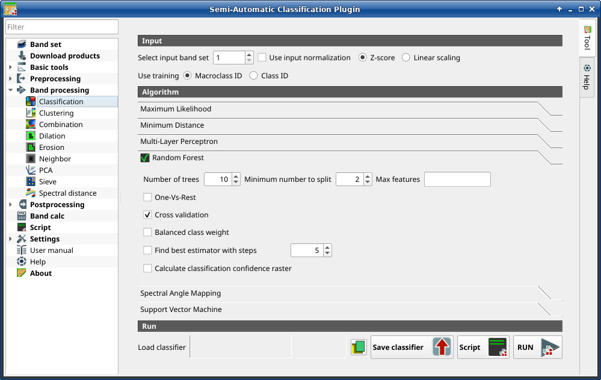
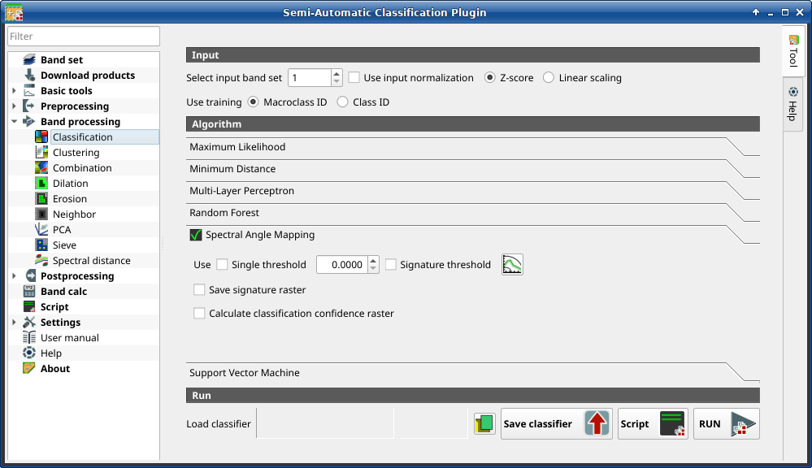
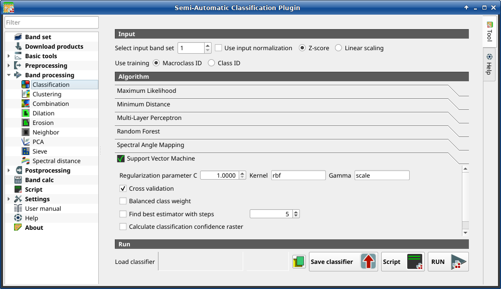

.. _classification_tab:

******************************
Classification
******************************

.. contents::
    :local:

.. |registry_save| image:: _static/registry_save.png
    :width: 20pt

.. |project_save| image:: _static/project_save.png
    :width: 20pt

.. |optional| image:: _static/optional.png
    :width: 20pt

.. |input_list| image:: _static/input_list.jpg
    :width: 20pt

.. |input_text| image:: _static/input_text.jpg
    :width: 20pt

.. |input_date| image:: _static/input_date.jpg
    :width: 20pt

.. |input_number| image:: _static/input_number.jpg
    :width: 20pt

.. |input_table| image:: _static/input_table.jpg
    :width: 20pt

.. |open_file| image:: _static/semiautomaticclassificationplugin_open_file.png
    :width: 20pt

.. |new_file| image:: _static/semiautomaticclassificationplugin_new_file.png
    :width: 20pt

.. |add| image:: _static/semiautomaticclassificationplugin_add.png
    :width: 20pt

.. |reset| image:: _static/semiautomaticclassificationplugin_reset.png
    :width: 20pt

.. |bandset_tool| image:: _static/semiautomaticclassificationplugin_bandset_tool.png
    :width: 20pt

.. |download| image:: _static/semiautomaticclassificationplugin_download_arrow.png
    :width: 20pt

.. |export| image:: _static/semiautomaticclassificationplugin_export.png
    :width: 20pt

.. |tools| image:: _static/semiautomaticclassificationplugin_roi_tool.png
    :width: 20pt

.. |preprocessing| image:: _static/semiautomaticclassificationplugin_class_tool.png
    :width: 20pt

.. |band_processing| image:: _static/semiautomaticclassificationplugin_band_processing.png
    :width: 20pt

.. |postprocessing| image:: _static/semiautomaticclassificationplugin_post_process.png
    :width: 20pt

.. |bandcalc| image:: _static/semiautomaticclassificationplugin_bandcalc_tool.png
    :width: 20pt

.. |settings| image:: _static/semiautomaticclassificationplugin_settings_tool.png
    :width: 20pt

.. |script_tool| image:: _static/semiautomaticclassificationplugin_script.png
    :width: 20pt

.. |enter| image:: _static/semiautomaticclassificationplugin_enter.png
    :width: 20pt

.. |zoom_to_ROI| image:: _static/semiautomaticclassificationplugin_zoom_to_ROI.png
    :width: 20pt

.. |check| image:: _static/semiautomaticclassificationplugin_batch_check.png
    :width: 20pt

.. |select_all| image:: _static/semiautomaticclassificationplugin_select_all.png
    :width: 20pt

.. |docks| image:: _static/semiautomaticclassificationplugin_docks.png
    :width: 20pt

.. |add_sign_tool| image:: _static/semiautomaticclassificationplugin_add_sign_tool.png
    :width: 20pt

.. |guide| image:: _static/guide.png
    :width: 20pt

.. |help| image:: _static/help.png
    :width: 20pt

.. |reload| image:: _static/semiautomaticclassificationplugin_reload.png
    :width: 20pt

.. |checkbox| image:: _static/checkbox.png
    :width: 18pt

.. |run| image:: _static/semiautomaticclassificationplugin_run.png
    :width: 24pt

.. |radiobutton| image:: _static/radiobutton.png
    :width: 18pt

.. |pointer| image:: _static/semiautomaticclassificationplugin_pointer_tool.png
    :width: 20pt

.. |threshold_tool| image:: _static/semiautomaticclassificationplugin_threshold_tool.png
    :width: 20pt

    :guilabel:`Classification`

This tab allows for the classification of the :ref:`band_set_tab` using the
spectral signatures checked in :ref:`ROI_list`.
Several classification options are set in this tab which affect the
classification process also during the :ref:`classification_preview`.
:ref:`pretrained_models_definition` are available, which require the
installation of PyTorch.

This tool allows for the selection of one the following algorithms:

* :ref:`maximum_likelihood`
* :ref:`minimum_distance`
* :ref:`multi_layer_perceptron`
* :ref:`random_forest`
* :ref:`spectral_angle_mapping`
* :ref:`support_vector_machine`
* :ref:`pretrained_models`

Also, it is possible to save and load a trained classifier.

.. tip::
    Information about APIs of this tool in Remotior Sensus at this
    `link <https://remotior-sensus.readthedocs.io/en/latest/remotior_sensus.tools.band_classification.html>`_ .

.. _classification_band_set:

Input
----------------------------

.. list-table::
    :widths: auto
    :header-rows: 1

    * - Tool symbol and name
      - Description
    * - :guilabel:`Select input band set` |input_number|
      - select the input :ref:`band_set_tab` to be classified
    * - |checkbox| :guilabel:`Use input normalization` |optional|
      - if checked, normalize the input based on the selected method
    * - |radiobutton| :guilabel:`Z-score`
      - if checked with |checkbox| :guilabel:`Use input normalized`,
        Z-score normalization of input is performed
    * - |radiobutton| :guilabel:`Linear scaling`
      - if checked with |checkbox| :guilabel:`Use input normalized`,
        Linear scaling normalization of input is performed
    * - :guilabel:`Use training` |radiobutton| :guilabel:`Macroclass ID`
      - if checked, the classification is performed using
    * - :guilabel:`Use training` |radiobutton| :guilabel:`Class ID`
        the Macroclass ID (code `MC ID` of the signature)
      - if checked, the classification is performed using the Class ID (code
        `C ID` of the signature)

.. _classification_alg:

Algorithm
----------------------------

This tool allows for the selection of the classification algorithm.
The algorithm tab includes the available parameters.

.. _maximum_likelihood:

Maximum Likelihood
======================

    :guilabel:`Maximum Likelihood`

Use the :ref:`max_likelihood_algorithm` algorithm.

.. list-table::
    :widths: auto
    :header-rows: 1

    * - Tool symbol and name
      - Description
    * - :guilabel:`Use single threshold` |input_number| |optional|
      - if checked, it allows for the definition of a classification threshold
        (applied to all the spectral signatures); pixels are unclassified
        if probability is less than threshold  value (max 100)
    * - :guilabel:`Signature threshold` |input_number| |optional|
      - if checked, thresholds :ref:`Signature_threshold_tab` are evaluated
    * - |threshold_tool|
      - open the :ref:`Signature_threshold_tab` for the definition of signature
        thresholds
    * - |checkbox| :guilabel:`Save signature raster` |optional|
      - if checked, in addition to the classification raster, for each spectral
        signature a raster is saved in the same output directory, which
        represents the distance between pixel and signature
    * - |checkbox| :guilabel:`Calculate classification confidence raster` |optional|
      - if checked, calculate classification confidence raster

.. _minimum_distance:

Minimum Distance
======================

    :guilabel:`Minimum Distance`

Use the :ref:`minimum_distance_algorithm` algorithm.

.. list-table::
    :widths: auto
    :header-rows: 1

    * - Tool symbol and name
      - Description
    * - :guilabel:`Use single threshold` |input_number| |optional|
      - if checked, it allows for the definition of a classification threshold
        (applied to all the spectral signatures); pixels are unclassified
        if distance is greater than threshold value
    * - :guilabel:`Signature threshold` |input_number| |optional|
      - if checked, thresholds :ref:`Signature_threshold_tab` are evaluated
    * - |threshold_tool|
      - open the :ref:`Signature_threshold_tab` for the definition of signature
        thresholds
    * - |checkbox| :guilabel:`Save signature raster` |optional|
      - if checked, in addition to the classification raster, for each spectral
        signature a raster is saved in the same output directory, which
        represents the distance between pixel and signature
    * - |checkbox| :guilabel:`Calculate classification confidence raster` |optional|
      - if checked, calculate classification confidence raster

.. _multi_layer_perceptron:

Multi-layer Perceptron
======================

    :guilabel:`Multi-layer Perceptron`

Use the :ref:`multi_layer_perceptron_algorithm` algorithm.

.. list-table::
    :widths: auto
    :header-rows: 1

    * - Tool symbol and name
      - Description
    * - :guilabel:`Use framework` |radiobutton| :guilabel:`scikit-learn`
      - if checked, use scikit-learn framework (read
        `this <https://remotior-sensus.readthedocs.io/en/latest/remotior_sensus.tools.band_classification.html>`_)
    * - :guilabel:`Use framework` |radiobutton| :guilabel:`PyTorch`
      - if checked, use PyTorch framework (read
        `about this <https://remotior-sensus.readthedocs.io/en/latest/remotior_sensus.tools.band_classification.html>`_)
    * - :guilabel:`Hidden layer sizes` |input_number|
      - list of values separated by comma, where each value defines the number
        of neurons in a hidden layer (e.g.: 200, 100 for two hidden layers of
        200 and 100 neurons respectively)
    * - :guilabel:`Max iter` |input_number|
      - set the maximum number of iterations
    * - :guilabel:`Activation` |input_text|
      - set the activation function (default: relu)
    * - :guilabel:`Alpha` |input_number|
      - set the weight decay (also L2 regularization term) for Adam optimizer
    * - :guilabel:`Training proportion` |input_number|
      - set the proportion of data to be used as training and the remaining
        part as test
    * - :guilabel:`Batch size` |input_text|
      - set the number of samples per batch for optimizer; if auto, the batch
        is the minimum value between 200 and the number of samples
    * - :guilabel:`Learning rate init` |input_number|
      - set initial learning rate
    * - |checkbox| :guilabel:`Cross validation` |optional|
      - if checked, perform cross validation
    * - |checkbox| :guilabel:`Find best estimator with steps` |optional|
      - if checked, find the best estimator iteratively with a number of steps
    * - |checkbox| :guilabel:`Calculate classification confidence raster` |optional|
      - if checked, calculate classification confidence raster
    * - |checkbox| :guilabel:`Pretrained model` |input_list| |optional|
      - if checked, use the selected pretrained model from the list
    * - :guilabel:`Pretrained model information`
      - information about the selected pretrained model, in particular about
        the requirements (which input bands), band normalization, and model
        source.

:guilabel:`Cross validation` is a function provided by ``scikit-learn`` to
avoid overfitting by splitting the training set into ``k`` smaller sets
(`read more <https://scikit-learn.org/stable/modules/cross_validation.html>`_ .
In particular, the function ``StratifiedKFold`` (with parameters n_splits=5,
shuffle=True) is used to create 5 sets, each one containing approximately the
same percentage of samples for each class as the complete set.
This option can potentially increase significantly the computation time.

If :guilabel:`Find best estimator with steps` is checked, the
algorithm tries to find the best estimator iteratively with the defined
number of steps (the more the steps, the slower the process will be),
by changing the algorithm parameters.

:ref:`pretrained_models_definition` can be selected to create embeddings which
are used with training input to train the classifier.
The following :ref:`pretrained_models_definition` are available for
classification:

* Swin-v2-Base model for Sentinel-2 single image.
  Requirements: Sentinel-2 bandset
  (TCI RGB (B04, B03, B02), TOA bands B05, B06, B07, B08, B11, B12).
  Normalization: TCI RGB bands divided by 255; B05, B06, B07, B08,
  B11, B12 divided by 8160 and clipped to 0-1.
  Framework: PyTorch.
  Source: Sentinel2_SwinB_SI_MS,
  pretrained by the Allen Institute for Artificial Intelligence
  (SatlasPretrain: https://satlas-pretrain.allen.ai).
  The model weights are released under the Open Data Commons
  Attribution License (ODC-BY).
  The repository code is licensed under the Apache License 2.0
  (https://huggingface.co/allenai/satlas-pretrain).
  This tool downloads the official SatlasPretrain weights
  (Bastani et al., "SatlasPretrain: A Large-Scale Dataset for Remote
  Sensing Image Understanding", ICCV 2023, arXiv:2211.15660,
  https://doi.org/10.48550/arXiv.2211.15660).
  All model weights remain the property of their respective authors.
* Swin-v2-Tiny model for Sentinel-2 single image.
  Requirements: Sentinel-2 bandset
  (TCI RGB (B04, B03, B02), TOA bands B05, B06, B07, B08, B11, B12).
  Normalization: TCI RGB bands divided by 255; B05, B06, B07, B08,
  B11, B12 divided by 8160 and clipped to 0-1.
  Framework: PyTorch.
  Source: Sentinel2_SwinT_SI_MS,
  pretrained by the Allen Institute for Artificial Intelligence
  (SatlasPretrain: https://satlas-pretrain.allen.ai).
  The model weights are released under the Open Data Commons
  Attribution License (ODC-BY).
  The repository code is licensed under the Apache License 2.0
  (https://huggingface.co/allenai/satlas-pretrain).
  This tool downloads the official SatlasPretrain weights
  (Bastani et al., "SatlasPretrain: A Large-Scale Dataset for Remote
  Sensing Image Understanding", ICCV 2023, arXiv:2211.15660,
  https://doi.org/10.48550/arXiv.2211.15660).
  All model weights remain the property of their respective authors.
* Swin-v2-Base model for Landsat 8 or Landsat 9 single image.
  Requirements: Landsat 8 or Landsat 9 bandset (Collection 2 Level-1
  bands B01, B02, B03, B04, B05, B06, B07, B08, B09, B10, B11);
  Normalization: (band - 4000)/16320 and clipped to 0-1.
  Framework: PyTorch.
  Source: Landsat_SwinB_SI,
  pretrained by the Allen Institute for Artificial Intelligence
  (SatlasPretrain: https://satlas-pretrain.allen.ai).
  The model weights are released under the Open Data Commons
  Attribution License (ODC-BY).
  The repository code is licensed under the Apache License 2.0
  (https://huggingface.co/allenai/satlas-pretrain).
  This tool downloads the official SatlasPretrain weights
  (Bastani et al., "SatlasPretrain: A Large-Scale Dataset for Remote
  Sensing Image Understanding", ICCV 2023, arXiv:2211.15660,
  https://doi.org/10.48550/arXiv.2211.15660).
  All model weights remain the property of their respective authors.

.. tip::
    The installation of PyTorch is required to run pretrained models. Please
    note that each model has specific characteristics and specific
    preprocessing of input image.

.. _random_forest:

Random Forest
======================

    :guilabel:`Random Forest`

Use the :ref:`random_forest_definition` algorithm.

.. list-table::
    :widths: auto
    :header-rows: 1

    * - Tool symbol and name
      - Description
    * - :guilabel:`Number of trees` |input_number|
      - set the number of trees
    * - :guilabel:`Minimum number to split` |input_number|
      - set the minimum number of samples required to split an internal node
    * - :guilabel:`Max features` |input_number| |optional|
      - for node splitting, if empty all features are considered; if sqrt the
        square root of all the features, if integer number the number of
        features; if float number a fraction of all the features
    * - |checkbox| :guilabel:`One-Vs-Rest` |optional|
      - if checked, perform One-Vs-Rest classification (read
        `more <https://scikit-learn.org/stable/modules/generated/sklearn.multiclass.OneVsRestClassifier.html>`_)
    * - |checkbox| :guilabel:`Cross validation` |optional|
      - if checked, perform cross validation
    * - |checkbox| :guilabel:`Balanced class weight` |optional|
      - if checked, balanced weight is computed inversely proportional to class
        frequency
    * - |checkbox| :guilabel:`Find best estimator with steps` |optional|
      - if checked, find the best estimator iteratively with a number of steps
    * - |checkbox| :guilabel:`Calculate classification confidence raster` |optional|
      - if checked, calculate classification confidence raster
    * - |checkbox| :guilabel:`Pretrained model` |input_list| |optional|
      - if checked, use the selected pretrained model from the list
    * - :guilabel:`Pretrained model information`
      - information about the selected pretrained model, in particular about
        the requirements (which input bands), band normalization, and model
        source.

:guilabel:`Cross validation` is a function provided by ``scikit-learn`` to
avoid overfitting by splitting the training set into ``k`` smaller sets
(`read more <https://scikit-learn.org/stable/modules/cross_validation.html>`_ .
In particular, the function ``StratifiedKFold`` (with parameters n_splits=5,
shuffle=True) is used to create 5 sets, each one containing approximately the
same percentage of samples for each class as the complete set.
This option can potentially increase significantly the computation time.

If :guilabel:`Find best estimator with steps` is checked, the
algorithm tries to find the best estimator iteratively with the defined
number of steps (the more the steps, the slower the process will be),
by changing the algorithm parameters.

If :guilabel:`One-Vs-Rest` is checked, the algorithm performs
`One-Vs-Rest classification <https://scikit-learn.org/stable/modules/generated/sklearn.multiclass.OneVsRestClassifier.html>`_
which basically fits one classifier per class.

If :guilabel:`Balanced class weight` is checked, the algorithm gives all
classes equal weight with a balanced weight that is computed inversely
proportional to class frequency in the training data.

:ref:`pretrained_models_definition` can be selected to create embeddings which
are used with training input to train the classifier.
The following :ref:`pretrained_models_definition` are available for
classification:

* Swin-v2-Base model for Sentinel-2 single image.
  Requirements: Sentinel-2 bandset
  (TCI RGB (B04, B03, B02), TOA bands B05, B06, B07, B08, B11, B12).
  Normalization: TCI RGB bands divided by 255; B05, B06, B07, B08,
  B11, B12 divided by 8160 and clipped to 0-1.
  Framework: PyTorch.
  Source: Sentinel2_SwinB_SI_MS,
  pretrained by the Allen Institute for Artificial Intelligence
  (SatlasPretrain: https://satlas-pretrain.allen.ai).
  The model weights are released under the Open Data Commons
  Attribution License (ODC-BY).
  The repository code is licensed under the Apache License 2.0
  (https://huggingface.co/allenai/satlas-pretrain).
  This tool downloads the official SatlasPretrain weights
  (Bastani et al., "SatlasPretrain: A Large-Scale Dataset for Remote
  Sensing Image Understanding", ICCV 2023, arXiv:2211.15660,
  https://doi.org/10.48550/arXiv.2211.15660).
  All model weights remain the property of their respective authors.
* Swin-v2-Tiny model for Sentinel-2 single image.
  Requirements: Sentinel-2 bandset
  (TCI RGB (B04, B03, B02), TOA bands B05, B06, B07, B08, B11, B12).
  Normalization: TCI RGB bands divided by 255; B05, B06, B07, B08,
  B11, B12 divided by 8160 and clipped to 0-1.
  Framework: PyTorch.
  Source: Sentinel2_SwinT_SI_MS,
  pretrained by the Allen Institute for Artificial Intelligence
  (SatlasPretrain: https://satlas-pretrain.allen.ai).
  The model weights are released under the Open Data Commons
  Attribution License (ODC-BY).
  The repository code is licensed under the Apache License 2.0
  (https://huggingface.co/allenai/satlas-pretrain).
  This tool downloads the official SatlasPretrain weights
  (Bastani et al., "SatlasPretrain: A Large-Scale Dataset for Remote
  Sensing Image Understanding", ICCV 2023, arXiv:2211.15660,
  https://doi.org/10.48550/arXiv.2211.15660).
  All model weights remain the property of their respective authors.
* Swin-v2-Base model for Landsat 8 or Landsat 9 single image.
  Requirements: Landsat 8 or Landsat 9 bandset (Collection 2 Level-1
  bands B01, B02, B03, B04, B05, B06, B07, B08, B09, B10, B11);
  Normalization: (band - 4000)/16320 and clipped to 0-1.
  Framework: PyTorch.
  Source: Landsat_SwinB_SI,
  pretrained by the Allen Institute for Artificial Intelligence
  (SatlasPretrain: https://satlas-pretrain.allen.ai).
  The model weights are released under the Open Data Commons
  Attribution License (ODC-BY).
  The repository code is licensed under the Apache License 2.0
  (https://huggingface.co/allenai/satlas-pretrain).
  This tool downloads the official SatlasPretrain weights
  (Bastani et al., "SatlasPretrain: A Large-Scale Dataset for Remote
  Sensing Image Understanding", ICCV 2023, arXiv:2211.15660,
  https://doi.org/10.48550/arXiv.2211.15660).
  All model weights remain the property of their respective authors.

.. tip::
    The installation of PyTorch is required to run pretrained models. Please
    note that each model has specific characteristics and specific
    preprocessing of input image.

.. _spectral_angle_mapping:

Spectral Angle Mapping
======================

    :guilabel:`Spectral Angle Mapping`

Use the :ref:`spectra_angle_mapping_algorithm` algorithm.

.. list-table::
    :widths: auto
    :header-rows: 1

    * - Tool symbol and name
      - Description
    * - :guilabel:`Use single threshold` |input_number| |optional|
      - if checked, it allows for the definition of a classification threshold
        (applied to all the spectral signatures); pixels are unclassified
        if spectral angle distance is greater than threshold value (max 90)
    * - :guilabel:`Signature threshold` |input_number| |optional|
      - if checked, thresholds :ref:`Signature_threshold_tab` are evaluated
    * - |threshold_tool|
      - open the :ref:`Signature_threshold_tab` for the definition of signature
        thresholds
    * - |checkbox| :guilabel:`Save signature raster` |optional|
      - if checked, in addition to the classification raster, for each spectral
        signature a raster is saved in the same output directory, which
        represents the distance between pixel and signature
    * - |checkbox| :guilabel:`Calculate classification confidence raster` |optional|
      - if checked, calculate classification confidence raster

.. _support_vector_machine:

Support Vector Machine
======================

    :guilabel:`Support Vector Machine`

Use the :ref:`support_vector_machine_definition` algorithm.

.. list-table::
    :widths: auto
    :header-rows: 1

    * - Tool symbol and name
      - Description
    * - :guilabel:`Regularization parameter C` |input_number|
      - set the regularization parameter C
    * - :guilabel:`Kernel` |input_text|
      - set the kernel (default: rbf)
    * - :guilabel:`Gamma` |input_text|
      - set the kernel coefficient gamma (default: scale)
    * - |checkbox| :guilabel:`Cross validation` |optional|
      - if checked, perform cross validation
    * - |checkbox| :guilabel:`Balanced class weight` |optional|
      - if checked, balanced weight is computed inversely proportional to class
        frequency
    * - |checkbox| :guilabel:`Find best estimator with steps` |optional|
      - if checked, find the best estimator iteratively with a number of steps
    * - |checkbox| :guilabel:`Calculate classification confidence raster` |optional|
      - if checked, calculate classification confidence raster

:guilabel:`Cross validation` is a function provided by ``scikit-learn`` to
avoid overfitting by splitting the training set into ``k`` smaller sets
(`read more <https://scikit-learn.org/stable/modules/cross_validation.html>`_ .
In particular, the function ``StratifiedKFold`` (with parameters n_splits=5,
shuffle=True) is used to create 5 sets, each one containing approximately the
same percentage of samples for each class as the complete set.
This option can potentially increase significantly the computation time.

If :guilabel:`Find best estimator with steps` is checked, the
algorithm tries to find the best estimator iteratively with the defined
number of steps (the more the steps, the slower the process will be),
by changing the algorithm parameters.

If :guilabel:`Balanced class weight` is checked, the algorithm gives all
classes equal weight with a balanced weight that is computed inversely
proportional to class frequency in the training data.

.. _pretrained_models:

Pretrained models
======================

.. figure:: _static/interface/pretrained_models_alg.png
    :align: center
    :width: 100%

    :guilabel:`Pretrained models`

Use of :ref:`pretrained_models_definition`.

.. list-table::
    :widths: auto
    :header-rows: 1

    * - Tool symbol and name
      - Description
    * - :guilabel:`Pretrained model` |input_list|
      - select a pretrained model
    * - :guilabel:`Pretrained model information`
      - information about the selected pretrained model, in particular about
        the requirements (which input bands), band normalization, and model
        source.

The following :ref:`pretrained_models_definition` are available for
classification:

* Swin-v2-Base segmentation for Sentinel-2 single image (4 bands).
  Requirements: Sentinel-2 bandset
  (TCI RGB (B04, B03, B02), TOA bands B08).
  Normalization: TCI RGB bands divided by 255; B08
  divided by 8160 and clipped to 0-1.
  Output classes: background, water, developed, tree, shrub, grass,
  crop, bare, snow, wetland, mangroves, moss.
  Source: Satlas_MS_tci-b08_epoch150,
  pretrained by DPR Team as part of the DPR Zoo Segmentation Hub
  framework (https://github.com/DPR25/dpr-zoo-segmentation-hub)
  based on SatlasPretrain models (https://satlas-pretrain.allen.ai).
  The repository code is licensed under the MIT License
  (https://huggingface.co/martinkorelic/dpr-zoo-models).
  This tool downloads the model weights (DPR Team, 2025. Made as part
  of Arnes Hackathon 2025).
  All model weights remain the property of their respective authors.
* Swin-v2-Base segmentation for Sentinel-2 single image (3 bands).
  Requirements: Sentinel-2 bandset
  (TCI RGB (B04, B03, B02)).
  Normalization: TCI RGB bands divided by 255.
  Output classes: background, water, developed, tree, shrub, grass,
  crop, bare, snow, wetland, mangroves, moss.
  Source: Satlas_RGB1_epoch70,
  pretrained by DPR Team as part of the DPR Zoo Segmentation Hub
  framework (https://github.com/DPR25/dpr-zoo-segmentation-hub)
  based on SatlasPretrain models (https://satlas-pretrain.allen.ai).
  The repository code is licensed under the MIT License
  (https://huggingface.co/martinkorelic/dpr-zoo-models).
  This tool downloads the model weights (DPR Team, 2025. Made as part
  of Arnes Hackathon 2025).
  All model weights remain the property of their respective authors.

The first time a pretrained models is selected, the weights thereof are
downloaded and saved in the plugin directory.

.. tip::
    The installation of PyTorch is required to run pretrained models. Please
    note that each model has specific characteristics and specific
    preprocessing of input image.

.. _classification_run:

Run
---------------------------------------

It is possible to run the classification, or save and load a trained
classifier.

Classification raster is a file ``.tif`` (a QGIS style file ``.qml`` is saved
along with the classification); also other outputs can be optionally calculated.
Outputs are loaded in QGIS after the calculation.

.. list-table::
    :widths: auto
    :header-rows: 1

    * - Tool symbol and name
      - Description
    * - :guilabel:`Load classifier` |open_file|
      - open an already save classifier file (.rsmo)
    * - :guilabel:`Save classifier` |export|
      - save the classifier to file (.rsmo), in order to be loaded later
    * - :guilabel:`RUN` |run|
      - run this function
