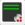
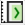
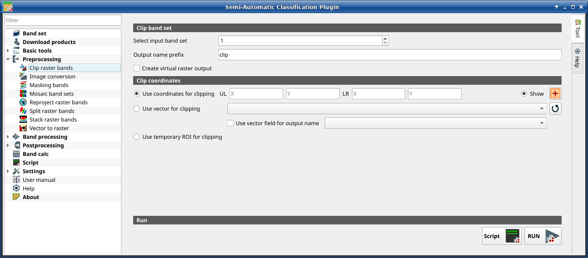

.. _clip_multiple_rasters_tab:

******************************
Clip raster bands
******************************

.. contents::
    :depth: 2
    :local:

.. |registry_save| image:: _static/registry_save.png
    :width: 20pt

.. |project_save| image:: _static/project_save.png
    :width: 20pt

.. |optional| image:: _static/optional.png
    :width: 20pt

.. |input_list| image:: _static/input_list.jpg
    :width: 20pt

.. |input_text| image:: _static/input_text.jpg
    :width: 20pt

.. |input_date| image:: _static/input_date.jpg
    :width: 20pt

.. |input_number| image:: _static/input_number.jpg
    :width: 20pt

.. |input_table| image:: _static/input_table.jpg
    :width: 20pt

.. |open_file| image:: _static/semiautomaticclassificationplugin_open_file.png
    :width: 20pt

.. |new_file| image:: _static/semiautomaticclassificationplugin_new_file.png
    :width: 20pt

.. |add| image:: _static/semiautomaticclassificationplugin_add.png
    :width: 20pt

.. |reset| image:: _static/semiautomaticclassificationplugin_reset.png
    :width: 20pt

.. |bandset_tool| image:: _static/semiautomaticclassificationplugin_bandset_tool.png
    :width: 20pt

.. |download| image:: _static/semiautomaticclassificationplugin_download_arrow.png
    :width: 20pt

.. |sign_plot| image:: _static/semiautomaticclassificationplugin_sign_tool.png
    :width: 20pt

.. |tools| image:: _static/semiautomaticclassificationplugin_roi_tool.png
    :width: 20pt

.. |preprocessing| image:: _static/semiautomaticclassificationplugin_class_tool.png
    :width: 20pt

.. |band_processing| image:: _static/semiautomaticclassificationplugin_band_processing.png
    :width: 20pt

.. |postprocessing| image:: _static/semiautomaticclassificationplugin_post_process.png
    :width: 20pt

.. |bandcalc| image:: _static/semiautomaticclassificationplugin_bandcalc_tool.png
    :width: 20pt

.. |settings| image:: _static/semiautomaticclassificationplugin_settings_tool.png
    :width: 20pt

.. |save_roi| image:: _static/semiautomaticclassificationplugin_save_roi.png
    :width: 20pt

.. |delete_signature| image:: _static/semiautomaticclassificationplugin_delete_signature.png
    :width: 20pt

.. |accuracy_tool| image:: _static/semiautomaticclassificationplugin_accuracy_tool.png
    :width: 20pt

.. |enter| image:: _static/semiautomaticclassificationplugin_enter.png
    :width: 20pt

.. |zoom_to_ROI| image:: _static/semiautomaticclassificationplugin_zoom_to_ROI.png
    :width: 20pt

.. |check| image:: _static/semiautomaticclassificationplugin_batch_check.png
    :width: 20pt

.. |select_all| image:: _static/semiautomaticclassificationplugin_select_all.png
    :width: 20pt

.. |docks| image:: _static/semiautomaticclassificationplugin_docks.png
    :width: 20pt

.. |scatter_plot| image:: _static/semiautomaticclassificationplugin_scatter_tool.png
    :width: 20pt

.. |merge_sign| image:: _static/semiautomaticclassificationplugin_merge_sign_tool.png
    :width: 20pt

.. |guide| image:: _static/guide.png
    :width: 20pt

.. |help| image:: _static/help.png
    :width: 20pt

.. |reload| image:: _static/semiautomaticclassificationplugin_reload.png
    :width: 20pt

.. |checkbox| image:: _static/checkbox.png
    :width: 18pt

.. |run| image:: _static/semiautomaticclassificationplugin_run.png
    :width: 24pt

.. |radiobutton| image:: _static/radiobutton.png
    :width: 18pt

.. |pointer| image:: _static/semiautomaticclassificationplugin_pointer_tool.png
    :width: 20pt

.. |clip_tool| image:: _static/semiautomaticclassificationplugin_clip_tool.png
    :width: 20pt

    :guilabel:`Clip multiple rasters`

This tab allows for cutting several image bands at once, using a
rectangle defined with point coordinates or a boundary defined with a vector.

.. tip::
    Information about APIs of this tool in Remotior Sensus at this
    `link <https://remotior-sensus.readthedocs.io/en/latest/remotior_sensus.tools.band_clip.html>`_ .

.. _clip_band_set:

Clip band set
^^^^^^^^^^^^^^^^^^^

.. list-table::
    :widths: auto
    :header-rows: 1

    * - Tool symbol and name
      - Description
    * - :guilabel:`Select input band set` |input_number|
      - select the input :ref:`band_set_tab` to be clipped
    * - |checkbox| :guilabel:`Use value as NoData` |input_number|
      - if checked, set the value for ``NoData`` pixels
        (e.g. pixels outside the clipped area)
    * - :guilabel:`Output name prefix` |input_text|
      - set the prefix for output file names (default is ``clip``)

.. _clip_coordinates:

Clip coordinates
^^^^^^^^^^^^^^^^

Set the Upper Left (UL) and Lower Right (LR) point coordinates of the
rectangle used for clipping; it is possible to enter the coordinates manually.
Alternatively use a vector.

.. list-table::
    :widths: auto
    :header-rows: 1

    * - Tool symbol and name
      - Description
    * - |radiobutton| :guilabel:`Use coordinates for clipping`
      - if checked, use defined coordinates for clipping bands
    * - :guilabel:`UL X` |input_number|
      - set the UL X coordinate
    * - :guilabel:`UL Y` |input_number|
      - set the UL Y coordinate
    * - :guilabel:`LR X` |input_number|
      - set the LR X coordinate
    * - :guilabel:`LR Y` |input_number|
      - set the LR Y coordinate
    * - |radiobutton| :guilabel:`Show`
      - show or hide the clip area drawn in the map
    * - |pointer|
      - define a clip area by drawing a rectangle in the map; left click to
        set the UL point and right click to set the LR point; the area is
        displayed in the map
    * - |radiobutton| :guilabel:`Use vector for clipping` |input_list|
      - if checked, use the selected vector (already loaded in QGIS) for
        clipping; UL and LR coordinates are ignored
    * - |checkbox| :guilabel:`Use vector field for output name` |input_list|
      - if checked, a vector field is selected for clipping while iterating
        through each vector polygon and the corresponding field value is added
        to the output name
    * - |radiobutton| :guilabel:`Use temporary ROI for clipping`
      - if checked, use a :ref:`temporary_ROI` for clipping; UL and LR
        coordinates are ignored
    * - |reload|
      - refresh layer list
    * - :guilabel:`Script` |script_tool|
      - add this function to the :ref:`script_tab`
    * - :guilabel:`RUN` |run|
      - run this function
