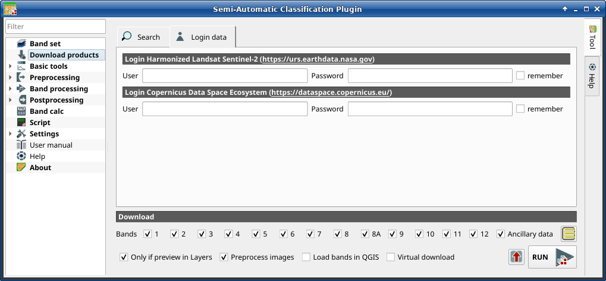

.. _download_tab:

******************************
Download products 
******************************

.. contents::
    :local:

.. |registry_save| image:: _static/registry_save.png
    :width: 20pt

.. |project_save| image:: _static/project_save.png
    :width: 20pt

.. |optional| image:: _static/optional.png
    :width: 20pt

.. |input_list| image:: _static/input_list.jpg
    :width: 20pt

.. |input_text| image:: _static/input_text.jpg
    :width: 20pt

.. |input_date| image:: _static/input_date.jpg
    :width: 20pt

.. |input_number| image:: _static/input_number.jpg
    :width: 20pt

.. |input_slider| image:: _static/input_slider.jpg
    :width: 20pt

.. |input_table| image:: _static/input_table.jpg
    :width: 20pt

.. |add| image:: _static/semiautomaticclassificationplugin_add.png
    :width: 20pt

.. |checkbox| image:: _static/checkbox.png
    :width: 18pt

.. |pointer| image:: _static/semiautomaticclassificationplugin_pointer_tool.png
    :width: 20pt

.. |radiobutton| image:: _static/radiobutton.png
    :width: 18pt

.. |reload| image:: _static/semiautomaticclassificationplugin_reload.png
    :width: 20pt

.. |reset| image:: _static/semiautomaticclassificationplugin_reset.png
    :width: 20pt

.. |remove| image:: _static/semiautomaticclassificationplugin_remove.png
    :width: 20pt

.. |run| image:: _static/semiautomaticclassificationplugin_run.png
    :width: 24pt

.. |open_file| image:: _static/semiautomaticclassificationplugin_open_file.png
    :width: 20pt

.. |new_file| image:: _static/semiautomaticclassificationplugin_new_file.png
    :width: 20pt

.. |open_dir| image:: _static/semiautomaticclassificationplugin_open_dir.png
    :width: 20pt

.. |select_all| image:: _static/semiautomaticclassificationplugin_select_all.png
    :width: 20pt

.. |move_up| image:: _static/semiautomaticclassificationplugin_move_up.png
    :width: 20pt

.. |add_bandset| image:: _static/semiautomaticclassificationplugin_add_bandset_tool.png
    :width: 20pt

.. |move_down| image:: _static/semiautomaticclassificationplugin_move_down.png
    :width: 20pt

.. |search_images| image:: _static/semiautomaticclassificationplugin_search_images.png
    :width: 20pt

.. |osm_add| image:: _static/semiautomaticclassificationplugin_osm_add.png
    :width: 20pt

.. |image_preview| image:: _static/semiautomaticclassificationplugin_download_image_preview.png
    :width: 20pt

.. |import| image:: _static/semiautomaticclassificationplugin_import.png
    :width: 20pt

.. |export| image:: _static/semiautomaticclassificationplugin_export.png
    :width: 20pt

.. |plus| image:: _static/semiautomaticclassificationplugin_plus.png
    :width: 20pt

.. |order_by_name| image:: _static/semiautomaticclassificationplugin_order_by_name.png
    :width: 20pt

.. |enter| image:: _static/semiautomaticclassificationplugin_enter.png
    :width: 20pt

.. |download| image:: _static/semiautomaticclassificationplugin_download_arrow.png
    :width: 20pt

.. |login_data| image:: _static/semiautomaticclassificationplugin_download_login.png
    :width: 20pt

.. |search_tab| image:: _static/semiautomaticclassificationplugin_download_search.png
    :width: 20pt

.. figure:: _static/interface/search_tab.png
    :align: center
    :width: 100%

    |search_tab| :guilabel:`Download products`

The tab |download| :guilabel:`Download products` includes the tools for
searching and downloading free remote sensing images.
The search and download is performed through
`Remotior Sensus <https://remotior-sensus.readthedocs.io/en/latest>`_.
Also, automatic conversion to reflectance of downloaded bands is available.

.. tip::
    Information about APIs of this tool in Remotior Sensus at this
    `link <https://remotior-sensus.readthedocs.io/en/latest/remotior_sensus.tools.download_products.html>`_ .

An internet connection is required and free registration could be required
depending on the download service.

.. _search_tab:

Search
----------------------------------------

The :guilabel:`Search` tool allows for searching and downloading:

* :guilabel:`Harmonized Landsat Sentinel-2` by NASA which are surface
  reflectance data product (generated with Landsat 8, Landsat 9, and Sentinel-2
  data acquired from 2013 to present days) with observations every two to three
  days at 30m spatial resolution (more information about the
  `project <https://www.earthdata.nasa.gov/esds/harmonized-landsat-sentinel-2>`_);
* Copernicus :guilabel:`Sentinel-2` images (Level-1C and Level-2A) acquired
  from 2015 to present days;

The download of :guilabel:`Harmonized Landsat Sentinel-2` requires
credentials defined in :ref:`login_data_tab`.

.. _search_parameters:

Search parameters
^^^^^^^^^^^^^^^^^

Define the search area by entering the coordinates (longitude and latitude) of
an ``Upper Left`` (UL) point and ``Lower Right`` (LR) point and select a
product to search.
Optional settings are date of acquisition, maximum cloud cover, number of
results (the fewer the results, the faster is the query).

The definition of a search area is required before searching the images.

.. list-table::
    :widths: auto
    :header-rows: 1

    * - Tool symbol and name
      - Description
    * - :guilabel:`UL` |input_number| |input_number|
      - set the UL longitude X (Lon) and the UL latitude Y (Lat)
    * - :guilabel:`LR` |input_number| |input_number|
      - set the LR longitude X (Lon) and the LR latitude Y (Lat)
    * - |radiobutton| :guilabel:`Show`
      - show or hide the search area in the map;
    * - |pointer|
      - define a search area by left click to set the UL point and right click
        to set the LR point; the search area is displayed in the map
    * - :guilabel:`Products` |input_list|
      - set the search product
    * - :guilabel:`Date from` |input_date|
      - set the starting date of acquisition
    * - :guilabel:`to` |input_date|
      - set the ending date of acquisition
    * - :guilabel:`Max cloud cover (%)` |input_number|
      - maximum cloud cover in the product
    * - :guilabel:`Results` |input_number|
      - maximum number of products returned by the search
    * - :guilabel:`Advanced search` |input_text|
      - some services (e.g. Sentinel-2) allows for entering search parameters;
        for instance, it is possible to enter the name of a granule (e.g. 33TTG)
    * - :guilabel:`Filter` |input_text|
      - set a filter such as the Product ID (e.g. ``LC81910312015006LGN00``);
        it is possible to enter multiple Product IDs separated by comma or
        semicolon (e.g. ``LC81910312015006LGN00, LC81910312013224LGN00`` );
        filter is applied to resulting products in the search area
    * - :guilabel:`Find` |search_images|
      - find the products in the search area; results are displayed inside the
        table in :ref:`product_list`; results are added to previous results
    * - |osm_add| Add OpenStreetMap to the map
      - this button allows for the display of OpenStreetMap tiles (
        © `OpenStreetMap <http://www.openstreetmap.org/copyright>`_
        contributors) in the QGIS map as described in
        https://wiki.openstreetmap.org/wiki/QGIS . The cartography is licensed
        as CC BY-SA (`Tile Usage Policy <http://www.openstreetmap.org/copyright>`_ )

.. tip::
    Search results (and the number thereof) depend on the defined area extent
    and the range of dates. In order to get more results, perform multiple
    searches defining smaller area extent and narrow acquisition dates (from
    and to).

.. _product_list:

Product list
^^^^^^^^^^^^^^^^^

The table :guilabel:`Product list` contains the results of the search.
Click on any item (highlight the item) to display the image preview thereof
(not all the products include image previews).
Resulting products are saved with the QGIS project.

The table includes the following fields.

.. list-table::
    :widths: auto
    :header-rows: 1

    * - product
      - image
      - product_id
      - acquisition_date
      - cloud_cover
      - zone_path
      - row
      - min_lat
      - min_lon
      - max_lat
      - max_lon
      - collection
      - size
      - preview
      - uid
    * - the product name (e.g., Sentinel-2)
      - the image name
      - the ID of the product
      - the acquisition date of the product
      - percentage of cloud cover in the product
      - the zone or WRS path depending on the product type
      - the WRS row
      - minimum latitude of the product
      - minimum longitude of the product
      - maximum latitude of the product
      - maximum longitude of the product
      - collection code
      - product size
      - URL of the product preview
      - identifier of the item

The following tools are available.

.. list-table::
    :widths: auto
    :header-rows: 1

    * - Tool symbol and name
      - Description
    * - |image_preview|
      - display preview of highlighted images in the map; preview is roughly
        georeferenced on the fly (not all the products include a preview)
    * - |remove|
      - remove highlighted images from the list
    * - |reset|
      - remove all images from the list
    * - |import|
      - import the product list from an XML file
    * - |export|
      - export the product list to an XML file

.. _download:

Download
^^^^^^^^^^^^^^^^^

Download the products in the :ref:`product_list`.
During the download it is recommended not to interact with QGIS.

Depending on the download service, it is possible to select single bands for
download.

.. list-table::
    :widths: auto
    :header-rows: 1

    * - Tool symbol and name
      - Description
    * - |checkbox| :guilabel:`Band` ``X``
      - select bands for download
    * - |checkbox| :guilabel:`Ancillary data`
      - if checked, the metadata files are selected for download
    * - |select_all|
      - select or deselect all bands
    * - |checkbox| :guilabel:`Only if preview in Layers`
      - if checked, download only those images listed in :ref:`product_list`
        which are also listed in the QGIS layer panel
    * - |checkbox| :guilabel:`Preprocess images`
      - if checked, bands are automatically converted after the download
    * - |checkbox| :guilabel:`Load bands in QGIS`
      - if checked, bands are loaded in QGIS after the download
    * - |export|
      - export the download links to a text file (.csv)
    * - :guilabel:`RUN` |run|
      - start the download process of all the products listed in :ref:`product_list`

.. _login_data_tab:

Login data
----------------------------------------

    |login_data| :guilabel:`Login data`

.. _login_earthdata:

Login Harmonized Landsat Sentinel-2
^^^^^^^^^^^^^^^^^^^^^^^^^^^^^^^^^^^^^^^^^^^^^^^^^^^^^^^^^^^^^^^^^^^^^^^

The download of Harmonized Landsat Sentinel-2 requires to login
using `EOSDIS Earthdata` credentials (https://urs.earthdata.nasa.gov)
One can register for free at https://urs.earthdata.nasa.gov/users/new .

.. list-table::
    :widths: auto
    :header-rows: 1

    * - Tool symbol and name
      - Description
    * - :guilabel:`User` |input_text| |registry_save|
      - enter the user name
    * - :guilabel:`Password` |input_text| |registry_save|
      - enter the password
    * - |checkbox| :guilabel:`remember`
      - if checked, remember user name and password locally in QGIS

.. warning::
    If |checkbox| :guilabel:`remember` is checked, the password is stored
    unencrypted in QGIS registry.
