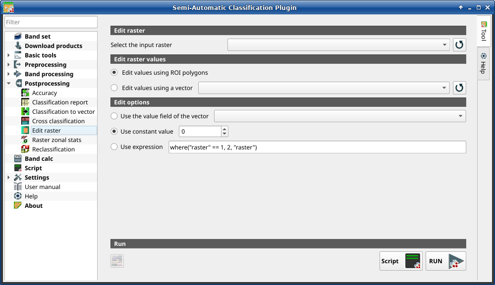

.. _edit_raster_tab:

******************************
Edit raster
******************************

.. contents::
    :local:

.. |registry_save| image:: _static/registry_save.png
    :width: 20pt

.. |project_save| image:: _static/project_save.png
    :width: 20pt

.. |optional| image:: _static/optional.png
    :width: 20pt

.. |input_list| image:: _static/input_list.jpg
    :width: 20pt

.. |input_text| image:: _static/input_text.jpg
    :width: 20pt

.. |input_date| image:: _static/input_date.jpg
    :width: 20pt

.. |input_number| image:: _static/input_number.jpg
    :width: 20pt

.. |input_table| image:: _static/input_table.jpg
    :width: 20pt

.. |open_file| image:: _static/semiautomaticclassificationplugin_open_file.png
    :width: 20pt

.. |new_file| image:: _static/semiautomaticclassificationplugin_new_file.png
    :width: 20pt

.. |add| image:: _static/semiautomaticclassificationplugin_add.png
    :width: 20pt

.. |reset| image:: _static/semiautomaticclassificationplugin_reset.png
    :width: 20pt

.. |bandset_tool| image:: _static/semiautomaticclassificationplugin_bandset_tool.png
    :width: 20pt

.. |download| image:: _static/semiautomaticclassificationplugin_download_arrow.png
    :width: 20pt

.. |export| image:: _static/semiautomaticclassificationplugin_export.png
    :width: 20pt

.. |tools| image:: _static/semiautomaticclassificationplugin_roi_tool.png
    :width: 20pt

.. |preprocessing| image:: _static/semiautomaticclassificationplugin_class_tool.png
    :width: 20pt

.. |band_processing| image:: _static/semiautomaticclassificationplugin_band_processing.png
    :width: 20pt

.. |postprocessing| image:: _static/semiautomaticclassificationplugin_post_process.png
    :width: 20pt

.. |bandcalc| image:: _static/semiautomaticclassificationplugin_bandcalc_tool.png
    :width: 20pt

.. |settings| image:: _static/semiautomaticclassificationplugin_settings_tool.png
    :width: 20pt

.. |script_tool| image:: _static/semiautomaticclassificationplugin_script.png
    :width: 20pt

.. |enter| image:: _static/semiautomaticclassificationplugin_enter.png
    :width: 20pt

.. |zoom_to_ROI| image:: _static/semiautomaticclassificationplugin_zoom_to_ROI.png
    :width: 20pt

.. |check| image:: _static/semiautomaticclassificationplugin_batch_check.png
    :width: 20pt

.. |select_all| image:: _static/semiautomaticclassificationplugin_select_all.png
    :width: 20pt

.. |docks| image:: _static/semiautomaticclassificationplugin_docks.png
    :width: 20pt

.. |undo_edit_raster| image:: _static/semiautomaticclassificationplugin_undo_edit_raster.png
    :width: 20pt

.. |guide| image:: _static/guide.png
    :width: 20pt

.. |help| image:: _static/help.png
    :width: 20pt

.. |reload| image:: _static/semiautomaticclassificationplugin_reload.png
    :width: 20pt

.. |checkbox| image:: _static/checkbox.png
    :width: 18pt

.. |run| image:: _static/semiautomaticclassificationplugin_run.png
    :width: 24pt

.. |radiobutton| image:: _static/radiobutton.png
    :width: 18pt

    :guilabel:`Edit raster`

This tab allows for the direct editing of pixel values in a raster.
Only pixels beneath ROI polygons or vector polygons are edited.

.. warning::
    The input raster is directly edited; it is recommended to create
    a **backup copy** of the input raster before using this tool in order to
    prevent data loss.

This tool can rapidly edit large rasters, especially when editing polygons are
small, because pixel values are edited directly.

.. tip::
    Information about APIs of this tool in Remotior Sensus at this
    `link <https://remotior-sensus.readthedocs.io/en/latest/remotior_sensus.tools.raster_edit.html>`_ .

.. _edit_raster_input:

Edit raster
^^^^^^^^^^^^^^^^^^^^^^^^

.. list-table::
    :widths: auto
    :header-rows: 1

    * - Tool symbol and name
      - Description
    * - :guilabel:`Select the classification` |input_list|
      - select a raster (already loaded in QGIS)
    * - |reload|
      - refresh layer list

.. _edit_raster_values:

Edit raster values
^^^^^^^^^^^^^^^^^^^^^^^^

.. list-table::
    :widths: auto
    :header-rows: 1

    * - Tool symbol and name
      - Description
    * - |radiobutton| :guilabel:`Edit values using ROI polygons`
      - if checked, raster is edited using temporary ROI polygons in the map
    * - |radiobutton| :guilabel:`Edit values using a vector` |input_list|
      - if checked, raster is edited using all the polygons of selected vector
    * - |reload|
      - refresh layer list

.. _edit_raster_options:

Edit options
^^^^^^^^^^^^^^^^^^^^^^^^

.. list-table::
    :widths: auto
    :header-rows: 1

    * - Tool symbol and name
      - Description
    * - |radiobutton| :guilabel:`Use the value field of the vector`
        |input_list|
      - if checked, raster is edited using the selected vector
        in :guilabel:`Edit values using a vector`) and the polygon values of
        selected vector field
    * - |radiobutton| :guilabel:`Use constant value` |input_number|
      - if checked, raster is edited using the selected constant value
    * - |radiobutton| :guilabel:`Use expression` |input_text|
      - if checked, raster is edited according to the entered expression;
        the expression must contain one or more ``where``;

        accepted variables
        are: ``"raster"`` representing the input raster value and ``"vector"``
        representing the vector value if selected; the following example
        expression ``where("raster" == 1, 2, "raster")`` is already entered,
        which sets 2 where ``"raster"`` equals 1, and leaves unchanged the
        values where ``"raster"`` is not equal to 1;

        this expression only edit pixels that are beneath the input vector
        polygons

.. _edit_raster_run:

Edit raster values
^^^^^^^^^^^^^^^^^^^^^^^^

.. list-table::
    :widths: auto
    :header-rows: 1

    * - Tool symbol and name
      - Description
    * - |undo_edit_raster|
      - undo last edit of raster
    * - :guilabel:`Script` |script_tool|
      - add this function to the :ref:`script_tab`
    * - :guilabel:`RUN` |run|
      - run this function
