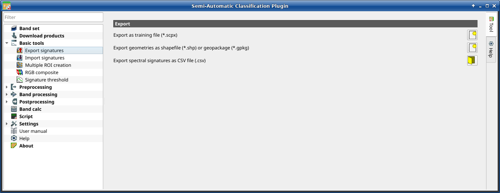

.. _export_signatures_tab:

******************************
Export signatures 
******************************

.. contents::
    :depth: 2
    :local:

.. |registry_save| image:: _static/registry_save.png
    :width: 20pt

.. |project_save| image:: _static/project_save.png
    :width: 20pt

.. |optional| image:: _static/optional.png
    :width: 20pt

.. |input_list| image:: _static/input_list.jpg
    :width: 20pt

.. |input_text| image:: _static/input_text.jpg
    :width: 20pt

.. |input_date| image:: _static/input_date.jpg
    :width: 20pt

.. |input_number| image:: _static/input_number.jpg
    :width: 20pt

.. |input_table| image:: _static/input_table.jpg
    :width: 20pt

.. |open_file| image:: _static/semiautomaticclassificationplugin_open_file.png
    :width: 20pt

.. |new_file| image:: _static/semiautomaticclassificationplugin_new_file.png
    :width: 20pt

.. |open_dir| image:: _static/semiautomaticclassificationplugin_open_dir.png
    :width: 20pt

.. |add| image:: _static/semiautomaticclassificationplugin_add.png
    :width: 20pt

.. |reset| image:: _static/semiautomaticclassificationplugin_reset.png
    :width: 20pt

.. |export_spectral_library| image:: _static/semiautomaticclassificationplugin_export_spectral_library.png
    :width: 20pt

    |export_spectral_library| :guilabel:`Export signatures`

This tool allows for exporting the signatures highlighted in the :ref:`ROI_list`.

.. list-table::
    :widths: auto
    :header-rows: 1

    * - Tool symbol and name
      - Description
    * - :guilabel:`Export as SCP file` |new_file|
      - create a new .scp file and export highlighted ROIs and spectral
        signatures as :guilabel:`SCP` file (.scpx)
    * - :guilabel:`Export as shapefile or geopackage` |new_file|
      - export highlighted ROIs (spectral signature data excluded) as a
        new shapefile (.shp) or geopackage (.gpkg)
    * - :guilabel:`Export spectral signatures as CSV file` |open_dir|
      - open a directory, and export highlighted spectral signatures as
        individual CSV files (.csv) separated by semicolon ( ; )

