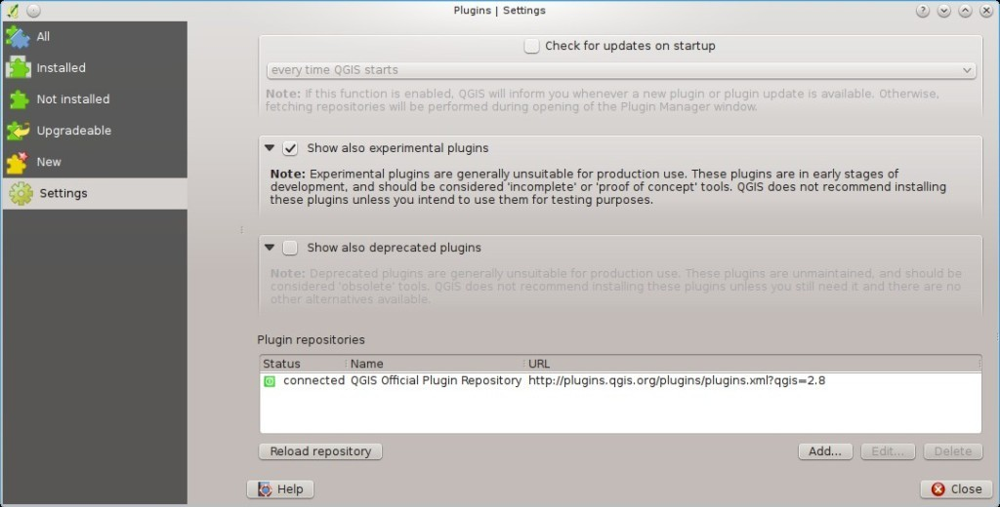
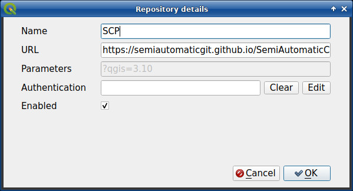
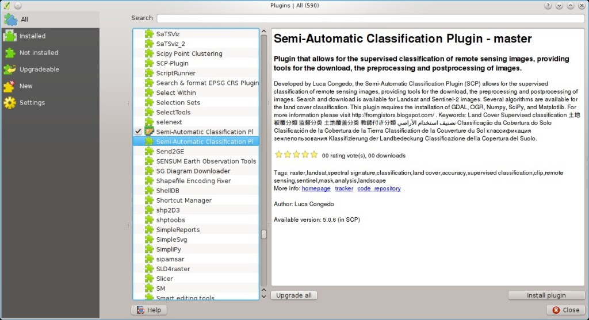
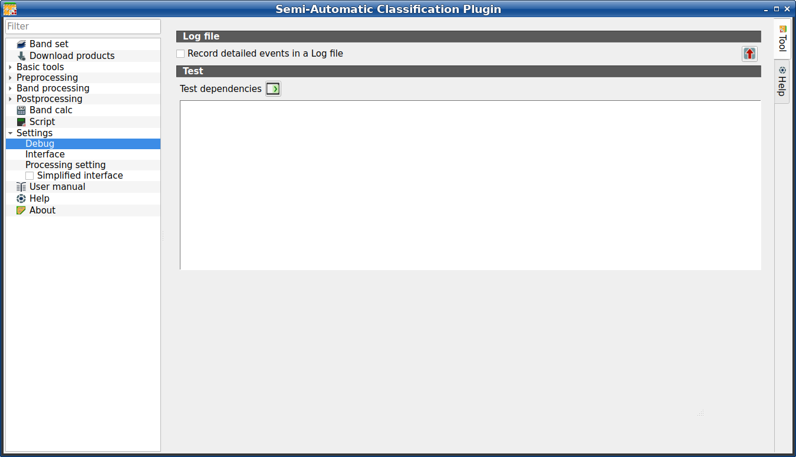
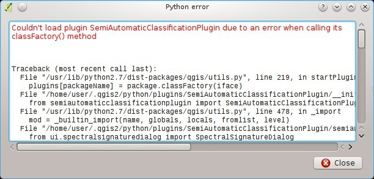

.. _FAQ:

***************************************************************
Frequently Asked Questions 
***************************************************************

.. |export| image:: _static/semiautomaticclassificationplugin_export.png
    :width: 20pt

.. |enter| image:: _static/semiautomaticclassificationplugin_enter.png
    :width: 20pt

.. |checkbox| image:: _static/checkbox.png
    :width: 18pt

If you have comments or questions please join the
`Facebook group <https://www.facebook.com/groups/SemiAutomaticClassificationPlugin>`_ .

Before asking, please check the official site
`From GIS to Remote Sensing <https://fromgistors.blogspot.com>`_ and the
following Frequently Asked Questions.

.. contents::
    :depth: 2
    :local:

.. _FAQ_plugin_installation:
 
Plugin installation
===================================================

.. _plugin_installation_1:

How to install the plugin manually?
------------------------------------------------------

The SCP can be installed manually (this can be useful when an internet
connection is not available, or the installation is required on multiple
computers), following a few steps:

#. download the SCP zip archive from
   https://github.com/semiautomaticgit/SemiAutomaticClassificationPlugin/archive/master.zip ;
#. extract the content of the archive (several files such as ``COPYING.txt``
   and folders such as ``ui``) in a new folder named
   ``SemiAutomaticClassificationPlugin`` (without ``-master``);
#. open the QGIS ``plugins`` directory (in Windows usually
   ``C:\Users\username\AppData\Roaming\QGIS\QGIS3\profiles\default\python\plugins``,
   in Linux and Mac usually ``/home/username/.local/share/QGIS/QGIS3/profiles/default/python/plugins``)
   and delete the folder ``SemiAutomaticClassificationPlugin`` if present;
#. copy the folder ``SemiAutomaticClassificationPlugin`` inside the
   QGIS ``plugins`` directory;
#. the plugin should be installed; start QGIS, open the Plugin Manager and be
   sure that ``Semi-Automatic Classification Plugin`` is checked.

.. _plugin_installation_2:

How to install the plugin from the official SCP repository?
--------------------------------------------------------------

It is possible to install the SCP using the official repository.
This repository allows for the installation of the latest version of SCP
(``master``), in some cases also before the availability thereof in the QGIS
repository.
Therefore, this can be useful if you need a fix or a new function that is still
not available in the QGIS repository.
Moreover, the ``master`` version in the SCP repository can be installed along
with the version available in the QGIS repository.

In order to install the SCP repository follow these steps:

* Run QGIS;

* From the main menu, select ``Plugins`` > ``Manage and Install Plugins``;

.. image:: _static/installation/install.jpg

* Click ``Settings`` then click the button ``Add``;

* Inside the ``Repository details`` enter:

Name::

    SCP

URL::

    https://semiautomaticgit.github.io/SemiAutomaticClassificationPlugin/repository.xml

and click ``OK``;

* After the repository update, the item
  ``Semi-Automatic Classification Plugin - master`` should be listed with the
  other plugins;

* From the menu ``All``, select the
  ``Semi-Automatic Classification Plugin - master``
  and click the button ``Install plugin``; the latest version of SCP should be
  automatically activated (ignore errors, the restart of QGIS could be
  necessary to complete the SCP installation); it is possible to deactivate
  the other SCP installed in the QGIS repository;

.. image:: _static/faq/qgis_repos_installed.jpg

.. _plugin_installation_3:

Can I use the previous version 8 of SCP?
--------------------------------------------------------------

The version 8 of SCP is no longer supported.
However, it is possible to install the previous version 8 in QGIS version 3.

.. _FAQ_pre_processing:
 
Pre processing
===================================================

.. _pre_processing_1:

Which image bands should I use for a semi-automatic classification?
-------------------------------------------------------------------------------

In general, it is preferable to avoid thermal infrared bands.
If you are using Landsat 4, 5 or 7 you should select bands: 1, 2, 3, 4, 5, 7
avoiding band 6 that is thermal infrared; for Landsat 8 you should select
bands: 2, 3, 4, 5, 6, 7.
Landsat 8 band 1 is generally avoided because it is very similar to the blue
band and it is mainly used for coastal aerosol study.
Landsat thermal infrared band is excluded from classifications because values
are mainly related to object temperature.

For Sentinel-2 images you can use bands: 2, 3, 4, 5, 6, 7, 8, 8A, 11, 12.

.. _pre_processing_2:

Which Landsat bands can be converted to reflectance by the SCP?
-------------------------------------------------------------------------------

All Landsat 1,2, and 3 MSS and Landsat 4, 5, 7, and 8 images downloaded
from http://earthexplorer.usgs.gov/ and processed with the Level 1 Product
Generation System (LPGS) can be converted to reflectance automatically by
the SCP; products generated by the LPGS have a MTL file included that is
required for the conversion.

.. _pre_processing_2B:

Can I apply the conversion to Sentinel-2 images downloaded from the web?
-------------------------------------------------------------------------------

Yes, you can convert also images downloaded from the web (actually the
conversion is recommended).
You should move all the bands (.jp2 files) and if available the .xml file
whose name contains ``MDT_SAFL1C`` in the same directory.
Then select this directory in :ref:`image_conversion`.
Images are converted to reflectance.

.. _pre_processing_2BB:

Can I apply the conversion to Sentinel-2 L2A downloaded from the web?
-------------------------------------------------------------------------------

Yes, you should move all the .jp2 files inside the same directory and rename
the files with the band number in the ending of the name (e.g. from
name_02_10m.jp2 to name_02.jp2)
Then select this directory in :ref:`image_conversion`.
Images are converted to reflectance.

.. _pre_processing_3:

Can I apply the Landsat conversion and DOS correction to clipped bands?
-------------------------------------------------------------------------------

Yes, you can clip the images before the conversion to reflectance and then
copy the MTL file (contained in the Landsat dataset) inside the directory with
the clipped bands.
If you want to apply the DOS correction (which is an image based technique)
you should convert the original Landsat bands (the entire image) and then clip
the conversion output (i.e. bands converted to reflectance).

.. _pre_processing_4:

Can I apply the DOS correction to bands with black border (i.e. with NoData value)?
------------------------------------------------------------------------------------

If you want to apply the DOS correction to an entire band which has NoData
values (the black border with value = 0) then you have to check the checkbox
``Use value as  NoData`` and set the value to 0.
This is because DOS is an image based technique, and NoData values must be
excluded from the calculation.

.. _pre_processing_5:

How to remove cloud cover from images?
-------------------------------------------------------------------------------

DOS1 correction does not remove clouds from the image.
However, Landsat 8 images include Band 9 that identifies clouds (see this
`NASA site <https://landsat.gsfc.nasa.gov/landsat-8/landsat-8-bands/>`_).
You can use this band for the creation of a mask.

.. _FAQ_processing:
 
Processing
===================================================

.. _FAQ_processing_4:

I get classification errors. How can I improve the accuracy?
-------------------------------------------------------------------------------

Several materials have similar spectral signatures (e.g. soil and built-up,
or forest and other types of dense low vegetation), which can cause
classification errors if ROIs, and spectral signatures thereof, are not
acquired correctly.
In order to improve the results, you can try to collect more ROIs over these
areas, in order to train the algorithm for these very similar areas, also,
display the spectral signatures of these areas in
:ref:`spectral_signature_plot` to assess their similarity.
You can also use a :ref:`Signature_threshold_tab` for these signatures in
order to reduce the variability thereof (only pixels very similar to the input
signatures will be classified).

.. _FAQ_processing_5:

Is it possible to use the same training input for multiple images?
-------------------------------------------------------------------------------

Yes, it is possible if all the images have the same number of bands.
However, if images are acquired in different months, land cover changes
(especially of vegetation state) will affect the spectral signature (i.e.
the same pixel has different spectral signature in different periods).
Atmospheric effects could also affect the images differently.
That could reduce classification accuracy.
Therefore, it is suggested to collect always the ROIs and spectral signatures
for every image.

.. _FAQ_processing_3:

What is the difference between classes and macroclasses?
-------------------------------------------------------------------------------

Please see :ref:`classes_definition`.

.. _FAQ_processing_1:

Can I use SCP with images from drones or aerial photographs?
-------------------------------------------------------------------------------

Yes, you can use them if they have at least 4 bands.
With less than 4 bands, semi-automatic classification algorithms are unable to
classify the land cover correctly.
Alternative classification methods exist, such as object oriented
classification, which is not implemented in SCP.

.. _FAQ_processing_2:

Why using only Landsat 8 band 10 in the estimation of surface temperature?
-------------------------------------------------------------------------------

Several methods were developed for estimating surface temperature.
The method described in the tutorial for temperature estimation requires only
one band.
Moreover, USGS recommends that users refrain from relying on Landsat 8 Band
11 data in quantitative analysis of the Thermal Infrared Sensor data (see
`Changes to Thermal Infrared Sensor (TIRS) data <http://landsat.usgs.gov/calibration_notices.php>`_
by USGS).

.. _FAQ_processing_6:

How can I speed up the processing?
-------------------------------------------------------------------------------

In order to speed up the processing you should set the available RAM and the
number of threads available in :ref:`system_processing`.
:guilabel:`Available RAM (MB)` should be half of the system RAM
(e.g. 1024MB if system has 2GB of RAM) or more if the system has a large
amount of RAM (e.g. 10240MB if system has 16GB of RAM).
:guilabel:`CPU threads` should be a value lower than the maximum number of
system threads (e.g. if the system has 4 available threads set value 3).

Also, several tools allow for selecting the output format ``.vrt`` avoiding
the time required to create a unique ``.tif`` raster (after multiprocess),
especially useful for large rasters.

.. _FAQ_processing_8:

How do I perform accuracy assessment and how to design the number of samples?
-------------------------------------------------------------------------------

Accuracy assessment is described in
`this tutorial <https://fromgistors.blogspot.com/2019/09/Accuracy-Assessment-of-Land-Cover-Classification.html>`_ .

Sample design is required to provide an adequate number of samples for
each class, as described in "Olofsson, et al., 2014. Good practices for
estimating area and assessing accuracy of land change. Remote Sensing of
Environment, 148, 42 – 57".

The number of samples (:math:`N`) should be calculated as (Olofsson, et al.,
2014):

.. math::
    N = ( \sum_{i=1}^{c} (W_i - S_i) / S_o)^2

where:

* :math:`W_i` = mapped area proportion of class i;
* :math:`S_i` = standard deviation of stratum i;
* :math:`S_o` = expected standard deviation of overall accuracy;
* :math:`c` = total number of classes;

To stratify the sample we should conjecture user’s accuracy and standard
deviations of strata (Olofsson, et al., 2014).
One can hypothesize that user’s accuracy is lower and standard deviations
:math:`S_i` is higher for classes having low area proportion, but of course
these values should be carefully evaluated.

This requires some conjectures about overall accuracy and user’s accuracy of
each class.
We should base these conjectures on previous studies.

As starting values, we could assume :math:`S_o = 0.01` and perform a rough
accuracy assessment with random samples, and eventually calculate the
:math:`S_i` to perform the sampling design.
Alternatively, one could start with Si = 0.5 for all the classes.
Basically the higher is Si, the larger is the number of samples for that class.

.. _FAQ_warnings:
 
Warnings
===================================================
.. _warning_1:

Warning [12]: The following signature will be excluded if using Maximum Likelihood. Why?
-----------------------------------------------------------------------------------------

The ROI is too small (or too homogeneous) for the
:ref:`max_likelihood_algorithm` algorithm because that ROI has a singular
covariance matrix.
You should create larger ROIs or don't use the Maximum Likelihood algorithm in
the classification process.

.. _FAQ_errors:
 
Errors
===================================================

.. _error_0:

How can I report an error?
-------------------------------------------------------------------------------

If you found an error of the Semi-Automatic Classification Plugin please follow
these steps in order to collect the required information (log file):

#. close QGIS if already open;
#. open QGIS, open the Plugin tab :ref:`settings_debug_tab` and check the
   checkbox |checkbox| :guilabel:`Records detailed events in a log file` ;

    :guilabel:`Debug`

3. click the button :guilabel:`Test dependencies` |enter| in the tab
   :ref:`settings_debug_tab` ;
#. load the data in QGIS (or open a previously saved QGIS project) and repeat
   all the steps that cause the error in the Plugin;

   * if the issue could be related to the image data, please use
     `this sample dataset <https://docs.google.com/uc?id=0BysUrKXWIDwBc1llME4yRmpjMGc&export=download>`_ ;
#. if an error message appears (like the one in the following image), copy the
   whole content of the message in a text file;

    :guilabel:`Error message`

6. open the tab :ref:`settings_debug_tab` and uncheck the checkbox
   |checkbox| :guilabel:`Records events in a log file`, then click the button
   |export| and save the **log file** (which is a text file containing
   information about the Plugin processes);
#. open the **log file** and copy the whole content of the file;
#. join the Facebook
   `group <https://www.facebook.com/groups/SemiAutomaticClassificationPlugin>`_
   , create a new post and copy the error message and the **log file** (or
   attach them).

.. _FAQ_other:
 
Various
===================================================

.. _other_0:

What can I do with the SCP?
-------------------------------

:guilabel:`SCP` allows for the **land cover classification** of remote sensing
images through :ref:`supervised_classification_definition`.
You can produce a land cover raster using one of the
:ref:`classification_algorithm_definition` available in SCP.
These algorithms require spectral signatures or ROIs as input (for definitions
please read :ref:`remote_sensing`) that define the land cover classes to be
identified in the image.

.. figure:: _static/remote_sensing/multispectral_classification.jpg
    :align: center

    :guilabel:`A multispectral image processed to produce a land cover classification`

    ``(Landsat image provided by USGS)``

:guilabel:`SCP` can work with **multispectral images** acquired by satellites,
airplanes, or drones.
Also, :guilabel:`SCP` allows for the direct search and download of free images
(see :ref:`download_tab`).
You cannot use orthophotos with less than 4 bands and LIDAR data
with SCP.

**Input image** in :guilabel:`SCP` is called :ref:`band_set_tab`, which is
used as input for the classification.
:guilabel:`SCP` provides several tools for the :ref:`pre_processing_tab` of
downloaded images, such as the conversion to reflectance and manipulation of
bands.

The :ref:`spectral_signature_plot` and :ref:`scatter_plot` allow for the
**analysis of spectral signatures and ROIs**.
Also, several :ref:`tools_tab` are available for easing the ROI creation and
editing spectral signatures.

**Raster calculation** is available through the seamless integration of the
tool :ref:`band_calc_tab` with bands in the :ref:`band_set_tab`,
calculating mathematical expressions and spectral indices.

See the :ref:`tutorials` for more information and examples.

.. _other_1:

How to contribute to SCP
-------------------------------------------------------------------------------

You can contribute to :guilabel:`SCP` by fixing and adding functionalities
(see :ref:`other_5`), or translating the user manual (see :ref:`other_4`).

.. _other_4:

How can I translate this user manual to another language?
-------------------------------------------------------------------------------

It is possible to easily translate the user manual to any language, because it
is written in reStructuredText as markup language (using Sphinx).
Therefore, your contribution is fundamental for the translation of the manual
to your language.
The following guide illustrates the main steps for the translation, which can
be performed:

* using the free online service Transifex;
* using the gettext .po files.

Before translating, please
`read this document <http://docs.qgis.org/testing/en/docs/documentation_guidelines/do_translations.html#translate-a-manual>`_
from the QGIS translation guide, which helps you understand the
reStructuredText.

**Method 1. Translation using the free online service Transifex**

This is probably the easiest way to translate the manual using an online
service.

1. Join the Semi-automatic Classification Manual project

    Go to the page
    https://www.transifex.com/semi-automatic-classification/semi-automatic-classification-plugin-manual
    and click the button ``Help translate``.
    You can sign in using your Google or Facebook account, or with a free
    registration.

2. Select your language

    Select your language and click the button ``Join team``.
    If your language is not listed, click the button ``Request language``.

3. Translation

    There are several files to be translated, which refer to the sections of
    the SCP documentation.
    To translate the SCP interface you should select the file
    ``semiautomaticclassificationplugin.ts`` .

**Method 2. Translation using the gettext .po files**

In order to use this method, you should be familiar with GitHub.
This translation method allows for the translation of the PO files locally.

1. Download the translation files

    Go to the GitHub project
    https://github.com/semiautomaticgit/SemiAutomaticClassificationManual_v4/tree/master/locale
    and download the .po files of your language (you can add your language, if
    it is not listed), or you can fork the repository.
    Every file .po is a text file that refers to a section of the User Manual.

2. Edit the translation files

    Now you can edit the .po files. It is convenient to edit those file using
    one of the following programs: for instance
    `Poedit <http://www.poedit.net/>`_
    for Windows and Mac OS X, or
    `Gtranslator <https://wiki.gnome.org/Apps/Gtranslator>`_
    for Linux or `OmegaT <http://www.omegat.org/en/download_selector/ui.php>`_
    (Java based) for Windows, Linux and Mac OS X.
    These editors allow for an easy translation of every sentence in the User
    Manual.

.. _other_5:

Where is the source code of SCP?
-------------------------------------------------------------------------------

The source code of SPC is available at the following link
https://github.com/semiautomaticgit/SemiAutomaticClassificationPlugin

.. _other_6:

How can I use the complete interface of the SCP?
-------------------------------------------------------------------------------

The :guilabel:`Complete interface` can be loaded from the settings in the
:ref:`SCP_menu`, by deselecting :guilabel:`Simplified interface` and
restarting QGIS.

.. figure:: _static/interface/scp_menu_simplified.png
    :align: center

    :guilabel:`SCP menu with activated option for the simplified interface`

From the same menu, the :guilabel:`Simplified interface` can be reactivated.
