.. _FAQ:

***************************************************************
Frequently Asked Questions 
***************************************************************

.. |br| raw:: html

  

.. |export| image:: _static/semiautomaticclassificationplugin_export.png
	:width: 20pt
	
.. |enter| image:: _static/semiautomaticclassificationplugin_enter.png
	:width: 20pt

.. |checkbox| image:: _static/checkbox.png
	:width: 18pt

If you have comments or questions please join the `Facebook group <https://www.facebook.com/groups/SemiAutomaticClassificationPlugin>`_ .

Before asking, please check the official site `From GIS to Remote Sensing <https://fromgistors.blogspot.com>`_ and the following Frequently Asked Questions.
	
.. contents::
    :depth: 2
    :local:
	
.. _FAQ_plugin_installation:
 
Plugin installation
===================================================

.. _plugin_installation_1:

How to install the plugin manually?
------------------------------------------------------
	
The SCP can be installed manually (this can be useful when an internet connection is not available, or the installation is required on multiple computers), following a few steps:

#. download the SCP zip archive from https://github.com/semiautomaticgit/SemiAutomaticClassificationPlugin/archive/master.zip ;
#. extract the content of the archive (several files such as ``COPYING.txt`` and folders such as ``ui``) in a new folder named ``SemiAutomaticClassificationPlugin`` (without ``-master``);
#. open the QGIS ``plugins`` directory (in Windows usually ``C:\Users\username\AppData\Roaming\QGIS\QGIS3\profiles\default\python\plugins``, in Linux and Mac usually ``/home/username/.local/share/QGIS/QGIS3/profiles/default/python/plugins``) and delete the folder ``SemiAutomaticClassificationPlugin`` if present;
#. copy the folder ``SemiAutomaticClassificationPlugin`` inside the QGIS ``plugins`` directory;
#. the plugin should be installed; start QGIS, open the Plugin Manager and be sure that ``Semi-Automatic Classification Plugin`` is checked.

.. _plugin_installation_2:

How to install the plugin from the official SCP repository?
--------------------------------------------------------------

It is possible to install the SCP using the official repository.
This repository allows for the installation of the latest version of SCP (``master``), in some cases also before the availability thereof in the QGIS repository.
Therefore, this can be useful if you need a fix or a new function that is still not available in the QGIS repository.
Moreover, the ``master`` version in the SCP repository can be installed along with the version available in the QGIS repository.

In order to install the SCP repository follow these steps:

* Run QGIS;

* From the main menu, select ``Plugins`` > ``Manage and Install Plugins``;

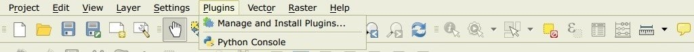

* Click ``Settings`` then click the button ``Add``;

.. image:: _static/qgis_repos_settings.jpg

* Inside the ``Repository details`` enter:

Name::

	SCP
	
	
URL::

	https://semiautomaticgit.github.io/SemiAutomaticClassificationPlugin/repository.xml 
	
and click ``OK``;

.. image:: _static/qgis_repos_add.jpg

* After the repository update, the item ``Semi-Automatic Classification Plugin - master`` should be listed with the other plugins;

.. image:: _static/qgis_repos_list.jpg

* From the menu ``All``, select the ``Semi-Automatic Classification Plugin - master`` and click the button ``Install plugin``; the latest version of SCP should be automatically activated (ignore errors, the restart of QGIS could be necessary to complete the SCP installation); it is possible to deactivate the other SCP installed in the QGIS repository;

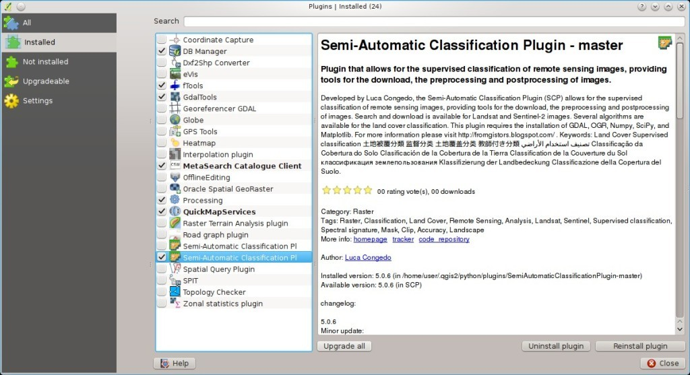

.. _FAQ_pre_processing:
 
Pre processing
===================================================

.. _pre_processing_1:

Which image bands should I use for a semi-automatic classification?
-----------------------------------------------------------------------------------------

In general, it is preferable to avoid thermal infrared bands.
If you are using Landsat 4, 5 or 7 you should select bands: 1, 2, 3, 4, 5, 7 avoiding band 6 that is thermal infrared; for Landsat 8 you should select bands: 2, 3, 4, 5, 6, 7.
Landsat 8 band 1 is generally avoided because it is very similar to the blue band and it is mainly used for coastal aerosol study.
Landsat thermal infrared band is excluded from classifications because values are mainly related to object temperature.

For Sentinel-2 images you can use bands: 2, 3, 4, 5, 6, 7, 8, 8A, 11, 12.

.. _pre_processing_2:

Which Landsat bands can be converted to reflectance by the SCP?
-----------------------------------------------------------------------------------------

All Landsat 1,2, and 3 MSS and Landsat 4, 5, 7, and 8 images downloaded from http://earthexplorer.usgs.gov/ and processed with the Level 1 Product Generation System (LPGS) can be converted to reflectance automatically by the SCP; products generated by the LPGS have a MTL file included that is required for the conversion.

.. _pre_processing_2B:

Can I apply the conversion to Sentinel-2 images download from the web?
-----------------------------------------------------------------------------------------

Yes, you can convert also images downloaded from the web (actually the conversion is recommended).
You should move all the bands (.jp2 files) and if available the .xml file whose name contains ``MDT_SAFL1C`` in the same directory.
Then select this directory in :ref:`sentinel2_conversion`.
Images are converted to reflectance.

.. _pre_processing_2C:

How are converted Sentinel-2 images that have different resolutions?
-----------------------------------------------------------------------------------------

During the conversion to reflectance, pixels of 20m bands are split in 4 pixels of 10m whose values are the same as the original 20m pixel.
The purpose of this operation is to allow for the calculation between all the bands, without changing original values.

.. _pre_processing_3:

Can I apply the Landsat conversion and DOS correction to clipped bands?
-----------------------------------------------------------------------------------------

Yes, you can clip the images before the conversion to reflectance and then copy the MTL file (contained in the Landsat dataset) inside the directory with the clipped bands. 
If you want to apply the DOS correction (which is an image based technique) you should convert the original Landsat bands (the entire image) and then clip the conversion output (i.e. bands converted to reflectance).

.. _pre_processing_4:

Can I apply the DOS correction to bands with black border (i.e. with NoData value)?
---------------------------------------------------------------------------------------------------

If you want to apply the DOS correction to an entire band which has NoData values (the black border with value = 0) then you have to check the checkbox ``Use NoData value`` and set the value to 0.
This is because DOS is an image based technique, and NoData values must be excluded from the calculation.

.. _pre_processing_5:

How to remove cloud cover from images?
-----------------------------------------------------------------------------------------

DOS1 correction does not remove clouds from the image.
However, Landsat 8 images include Band 9 that identifies clouds (see this `NASA site <http://landsat.gsfc.nasa.gov/?page_id=5377>`_).
You can use this band for the creation of a mask.

For other Landsat satellites, clouds can be masked using the approach described `this paper <http://www.planning4adaptation.eu/Docs/papers/08_NWP-DoM_for_LCC_in_Dar_using_Landsat_Imagery.pdf>`_.

Also, see the following `video-tutorial <https://youtu.be/xm9s97GPs0Y?t=7m00s>`_.

.. _pre_processing_7:

After pan-sharpening of Landsat 8 images, why NIR bands still have 30m resolution?
-----------------------------------------------------------------------------------------

Landsat 8 panchromatic band doesn't acquire in the Near Infrared (NIR) region (see :ref:`Landsat_definition`).
Therefore, the pan-sharpening process can't improve the resolution of NIR and SWIR bands (see :ref:`pan_sharpening_definition`), which appear to have 30m resolution.
However, all pan-sharpened rasters have 15m resolution to allow raster calculation.

.. _FAQ_processing:
 
Processing
===================================================

.. _FAQ_processing_4:

I get classification errors. How can I improve the accuracy?
-----------------------------------------------------------------------------------------

Several materials have similar spectral signatures (e.g. soil and built-up, or forest and other types of dense low vegetation), which can cause classification errors if ROIs, and spectral signatures thereof, are not acquired correctly.
In order to improve the results, you can try to collect more ROIs over these areas, in order to train the algorithm for these very similar areas, also, display the spectral signatures of these areas in :ref:`spectral_signature_plot` to assess their similarity.
You can also use a :ref:`Signature_threshold_tab` for these signatures in order to reduce the variability thereof (only pixels very similar to the input signatures will be classified).
The :ref:`LCS_algorithm` is also useful for classifying specific materials that can be spectrally similar to other ones.

.. _FAQ_processing_5:

Is it possible to use the same training input for multiple images?
-----------------------------------------------------------------------------------------

Yes, it is possible if all the images have the same number of bands.
However, if images are acquired in different months, land cover changes (especially of vegetation state) will affect the spectral signature (i.e. the same pixel has different spectral signature in different periods).
Atmospheric effects could also affect the images differently.
That could reduce classification accuracy.
Therefore, it is suggested to collect always the ROIs and spectral signatures for every image.

.. _FAQ_processing_3:

What is the difference between classes and macroclasses?
-----------------------------------------------------------------------------------------

Please see :ref:`classes_definition`.

.. _FAQ_processing_1:

Can I use SCP with images from drones or aerial photographs?
-----------------------------------------------------------------------------------------

Yes, you can use them if they have at least 4 bands.
With less than 4 bands, semi-automatic classification algorithms are unable to classify the land cover correctly.
Alternative classification methods exist, such as object oriented classification, which is not implemented in SCP.

.. _FAQ_processing_2:

Why using only Landsat 8 band 10 in the estimation of surface temperature?
-----------------------------------------------------------------------------------------

Several methods were developed for estimating surface temperature.
The method described in the tutorial for temperature estimation requires only one band.
Moreover, USGS recommends that users refrain from relying on Landsat 8 Band 11 data in quantitative analysis of the Thermal Infrared Sensor data (see `Changes to Thermal Infrared Sensor (TIRS) data <http://landsat.usgs.gov/calibration_notices.php>`_ by USGS).

.. _FAQ_warnings:
 
Warnings
===================================================
.. _warning_1:

Warning [12]: The following signature will be excluded if using Maximum Likelihood. Why?
-----------------------------------------------------------------------------------------

The ROI is too small (or too homogeneous) for the :ref:`max_likelihood_algorithm` algorithm because that ROI has a singular covariance matrix.
You should create larger ROIs or don't use the Maximum Likelihood algorithm in the classification process.

.. _FAQ_errors:
 
Errors
===================================================

.. _error_0:

How can I report an error?
-----------------------------------------------------------------------------------------

If you found an error of the Semi-Automatic Classification Plugin please follow these steps in order to collect the required information (log file):

#. close QGIS if already open;
#. open QGIS, open the Plugin tab :ref:`settings_debug_tab` and check the checkbox |checkbox| :guilabel:`Records events in a log file` ;

.. figure:: _static/settings_debug_tab.jpg
	:align: center
	
	:guilabel:`Debug`

3. click the button :guilabel:`Test dependencies` |enter| in the tab :ref:`settings_debug_tab` ;
#. load the data in QGIS (or open a previously saved QGIS project) and repeat all the steps that cause the error in the Plugin;
	* if the issue could be related to the image data, please use `this sample dataset <https://docs.google.com/uc?id=0BysUrKXWIDwBc1llME4yRmpjMGc&export=download>`_ ;
#. if an error message appears (like the one in the following image), copy the whole content of the message in a text file;

.. figure:: _static/python_error.jpg
	:align: center
	
	:guilabel:`Error message`
	
6. open the tab :ref:`settings_debug_tab` and uncheck the checkbox |checkbox| :guilabel:`Records events in a log file`, then click the button |export| and save the **log file** (which is a text file containing information about the Plugin processes);
#. open the **log file** and copy the whole content of the file;
#. join the Facebook `group <https://www.facebook.com/groups/661271663969035/>`_ , create a new post and copy the error message and the **log file** (or attach them).

.. _error_1:

Virtual raster creation issues. Why?
-----------------------------------------------------------------------------------------

The automatic creation of the virtual raster after Landsat conversion to reflectance is not required for the classification. Errors could happen if the output destination path contains special characters (such as accented letters) or spaces; try to rename directories (e.g. rename ``new directory`` to ``new_directory``).
If you still get the same error you can create a virtual raster manually.

.. _error_3:

Error 'Plugin is damaged. Python said: ascii'. Why?
-----------------------------------------------------------------------------------------

It could be related to a wrong installation.
Please, uninstall QGIS and install it again with administrative rights.
Then run QGIS and try to install the plugin following the :ref:`installation` guide.

Also, it could be related to the user name containing special characters.
Please try the installation creating a new user without special characters (e.g. ``user``).

.. _error_4:

Error [50] 'Internet error'. Unable to download Sentinel-2 images. Why?
-----------------------------------------------------------------------------------------

The error message usually includes some information about the issue.
First, check the user name and password.
If the account registration was recent, it could take a few days to complete the process for allowing the download from SCP.

Also, there could be an interruption of the service.
For Sentinel-2 images please check this website https://scihub.copernicus.eu/news/ for messages about the state of the service.

In case you still get the same error, please follow these steps :ref:`error_0`.

.. _error_7:

Error installing the plugin, possible missing dependencies. Why?
-----------------------------------------------------------------------------------------

The plugin requires the installation of GDAL, NumPy, SciPy and Matplotlib, which should be installed along with QGIS.
If the plugin installation fails, and you get a message about possible missing dependencies, you should try to install or update QGIS and the required dependencies.
Notice that in order to avoid this error, python dependencies should not be installed through Anaconda.

.. _FAQ_other:
 
Various
===================================================

.. _other_0:

What can I do with the SCP?
-------------------------------

:guilabel:`SCP` allows for the **land cover classification** of remote sensing images through :ref:`supervised_classification_definition`.
You can produce a land cover raster using one of the :ref:`classification_algorithm_definition` available in SCP.
These algorithms require spectral signatures or ROIs as input (for definitions please read :ref:`remote_sensing`) that define the land cover classes to be identified in the image.

.. figure:: _static/multispectral_classification.jpg
	:align: center
	
	:guilabel:`A multispectral image processed to produce a land cover classification`
	
	``(Landsat image provided by USGS)``

:guilabel:`SCP` can work with **multispectral images** acquired by satellites, airplanes, or drones.
Also, :guilabel:`SCP` allows for the direct search and download of free images (see :ref:`download_tab`).
You cannot use orthophotos with less than 4 bands, SAR data, and LIDAR data with SCP.

**Input image** in :guilabel:`SCP` is called :ref:`band_set_tab`, which is used as input for the classification.
:guilabel:`SCP` provides several tools for the :ref:`pre_processing_tab` of downloaded images, such as the conversion to reflectance and manipulation of bands.

**Classification results** can be assessed with the tools :ref:`accuracy_tab` and :ref:`classification_report_tab`.
Also, rasters can be manipulated using :ref:`post_processing_tab` tools such as :ref:`classification_vector_tab`,  :ref:`reclassification_tab`, :ref:`edit_raster_tab` directly, :ref:`classification_sieve_tab`, :ref:`classification_erosion_tab`, and :ref:`classification_dilation_tab`.

The :ref:`spectral_signature_plot` and :ref:`scatter_plot` allow for the **analysis of spectral signatures and ROIs**.
Also, several :ref:`tools_tab` are available for easing the ROI creation and editing spectral signatures.

**Raster calculation** is available through the seamless integration of the tool :ref:`band_calc_tab` with bands in the :ref:`band_set_tab`, calculating mathematical expressions and spectral indices.
Also, an output raster can be calculated based on :ref:`decision_rules`.

The tool :ref:`batch_tab` allows for the automatic execution of several :guilabel:`SCP` functions using a scripting interface.

See the :ref:`tutorials` for more information and examples.

.. _other_1:

How to contribute to SCP
-----------------------------------------------------------------------------------------

You can contribute to :guilabel:`SCP` by fixing and adding functionalities (see :ref:`other_5`), or translating the user manual (see :ref:`other_4`).

Also, you can donate to this project at the following link https://fromgistors.blogspot.com/p/donations.html .

.. _other_2:

Free and valuable resources about remote sensing and GIS
-----------------------------------------------------------------------------------------

The following links are valuable resources:

	* `The Landsat 8 Data Users Handbook by USGS <https://www.usgs.gov/land-resources/nli/landsat/landsat-8-data-users-handbook>`_;
	* `The Landsat 7 Science Data Users Handbook by NASA <https://www.usgs.gov/land-resources/nli/landsat/landsat-7-data-users-handbook>`_;
	* `Webinar: Fundamentals of Remote Sensing by NASA <https://arset.gsfc.nasa.gov/webinars/fundamentals-remote-sensing>`_.
	* `Webinar: NASA Remote Sensing for Land Management by NASA <https://arset.gsfc.nasa.gov/land/webinars/land-management14>`_.
	* `Webinar: Creating and Using Normalized Difference Vegetation Index (NDVI) from Satellite Imagery by NASA <https://arset.gsfc.nasa.gov/land/webinars/advancedNDVI>`_.
	* `Webinar: Remote Sensing of Forest Cover and Change Assessment for Carbon Monitoring by NASA <https://arset.gsfc.nasa.gov/land/webinars/carbon-monitoring-2016>`_.
	* `Webinar: Introduction to Remote Sensing for Conservation Management by NASA <https://arset.gsfc.nasa.gov/land/webinars/intro-conservation15>`_.

.. _other_3:

Other tutorials about SCP, also in languages other than English
-----------------------------------------------------------------------------------------

There are several tutorials about :guilabel:`SCP` on the internet.
Following an incomplete list of these resources (please note that these resources could use older versions of SCP):

	* `English: Webinar by NASA ARSET about Land Cover Classification with Satellite Imagery <https://arset.gsfc.nasa.gov/land/webinars/advanced-land-classification>`_;
	* `English: Recommended Practice by UN-SPIDER about Burn Severity Mapping Burn Severity with QGIS <http://www.un-spider.org/node/10955>`_;
	* `English: Using the SCP QGIS plugin to download and process Sentinel 2 imagery <https://www.youtube.com/watch?v=77BEF7txk4s>`_;
	* `French: Télédétection des feux de forêts <https://www.geonov.fr/exemples/teledetection-feux-de-forets/>`_;
	* `German: 2015 Jakob Erfassung von Landnutzungsveränderungen mit FOSS Image Processing Tools <https://www.youtube.com/watch?v=vIsHFvLS5_Q>`_;
	* `Indonesian: Koreksi Radiometrik Menggunakan QGIS:Semi Automatic Classification <https://rosegislabs.com/2017/02/28/koreksi-radiometrik-menggunakan-qgissemi-automatic-classification-part-1/>`_;
	* `Italian: Classificazione e Mosaico di Varie Immagini Landsat <https://fromgistors.blogspot.com/2015/09/tutorial-classificazione-mosaico-landsat.html>`_;
	* `Korean: QGIS Semi-Automatic Classification Plugin <http://blog.daum.net/geoscience/715>`_;
	* `Portuguese: Workshop de Deteção Remota e Processamento Digital de Imagem com o QGIS e o Semi-Automatic Classification Plugin <https://pt.slideshare.net/PedroNGV/workshop-de-deteo-remota-e-processamento-digital-de-imagem-com-o-qgis-e-o-semiautomatic-classification-plugin>`_;
	* `Portuguese: Classificacao supervisionada de imagens Sentinel-2 com QGIS e SCP <https://www.youtube.com/watch?v=t5D6JT7adYY>`_;
	* `Portuguese: Avaliação do erro de uma imagem de satélite usando o QGIS e o SCP <https://www.youtube.com/watch?v=k1yjcJPb1WI>`_;
	* `Portuguese: Conversão Sentinel-2 para refletância com QGIS SCP <https://www.youtube.com/watch?v=m3XFvvVrU24>`_;
	* `Portuguese: Criar composições coloridas no QGIS com SCP <https://www.youtube.com/watch?v=LWvDEE1Evxg>`_;
	* `Portuguese: Corte de imagem Sentinel-2 usand QGIS e SCP <https://www.youtube.com/watch?v=8UHey-bQJGs>`_;
	* `Portuguese: Deteção Remota Com O QGIS <http://qgis.pt/blog/2016/12/14/detecao-remota-com-o-qgis/>`_;
	* `Russian: Опыт классификации космоснимка Sentinel- 2a с помощью Semi-Automatic Classification Plugin в QGIS <http://gis-lab.info/qa/qgis-sacp-sentinel2a.html>`_;
	* `Spanish: Descarga de imágenes de satélite desde servidores públicos <https://www.youtube.com/watch?v=OxGbZo6Go5g>`_;
	* `Swedish: Landsat 8 och fjärranalys med QGIS <https://geosupportsystem.wordpress.com/2015/04/02/landsat-8-och-fjarranalys-med-qgis/>`_;
	* `Ukrainian: Основи дешифрування плагіном Semi-Automatic Classification 5.0 <https://www.youtube.com/watch?v=kwI4RhYr8Rc>`_;
	* `Ukrainian: Використання Гіс Qgis Для Отримання Та Обробки Космічних Знімків Євген Василенко <https://www.youtube.com/watch?v=O1nyOqMdIiQ>`_;

.. _other_4:

How can I translate this user manual to another language?
-----------------------------------------------------------------------------------------

It is possible to easily translate the user manual to any language, because it is written in reStructuredText as markup language (using Sphinx).
Therefore, your contribution is fundamental for the translation of the manual to your language.
The following guide illustrates the main steps for the translation, which can be performed:

* using the free online service Transifex;
* using the gettext .po files.

Before translating, please `read this document <http://docs.qgis.org/testing/en/docs/documentation_guidelines/do_translations.html#translate-a-manual>`_ from the QGIS translation guide, which helps you understand the reStructuredText.

**Method 1. Translation using the free online service Transifex**

This is probably the easiest way to translate the manual using an online service.

1. Join the Semi-automatic Classification Manual project
	
	Go to the page https://www.transifex.com/semi-automatic-classification/semi-automatic-classification-plugin-manual and click the button ``Help translate``.
	You can sign in using your Google or Facebook account, or with a free registration.
	
2. Select your language
	
	Select your language and click the button ``Join team``.
	If your language is not listed, click the button ``Request language``.

3. Translation

	There are several files to be translated, which refer to the sections of the SCP documentation.
	To translate the SCP interface you should select the file ``semiautomaticclassificationplugin.ts`` . 
	
**Method 2. Translation using the gettext .po files**

In order to use this method, you should be familiar with GitHub. This translation method allows for the translation of the PO files locally.

1. Download the translation files

	Go to the GitHub project https://github.com/semiautomaticgit/SemiAutomaticClassificationManual_v4/tree/master/locale and download the .po files of your language (you can add your language, if it is not listed), or you can fork the repository. 
	Every file .po is a text file that refers to a section of the User Manual.
	
2. Edit the translation files

	Now you can edit the .po files. It is convenient to edit those file using one of the following programs: for instance `Poedit <http://www.poedit.net/>`_ for Windows and Mac OS X, or `Gtranslator <https://wiki.gnome.org/Apps/Gtranslator>`_ for Linux or `OmegaT <http://www.omegat.org/en/download_selector/ui.php>`_ (Java based) for Windows, Linux and Mac OS X.
	These editors allow for an easy translation of every sentence in the User Manual.

.. _other_5:

Where is the source code of SCP?
-----------------------------------------------------------------------------------------

You can find the source code of SPC is at the following link 
https://github.com/semiautomaticgit/SemiAutomaticClassificationPlugin

.. _other_6:

How to install QGIS using OSGeo4W?
-----------------------------------------------------------------------------------------

To install QGIS, first download the `OSGeo4W installer x86 <http://download.osgeo.org/osgeo4w/osgeo4w-setup-x86.exe>`_ or `OSGeo4W installer x64 <http://download.osgeo.org/osgeo4w/osgeo4w-setup-x86_64.exe>`_ according to your operating system.

Then start the installer and select ``Advanced Install``.

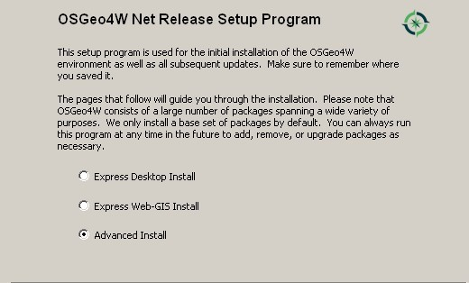

Check ``Install from Internet`` and click ``Next``.

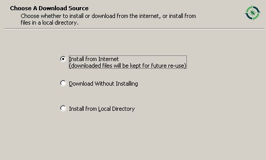

Select the installation directory and click ``Next``.

.. image:: _static/osgeo/3.jpg

Select the local package directory and click ``Next``.

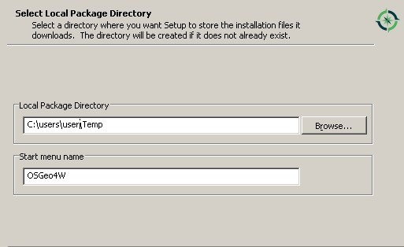

Select ``Direct connection`` (or select an internet connection option) and click ``Next``.

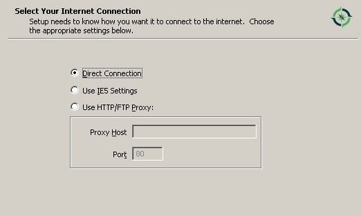

Select the first download site and click ``Next``.

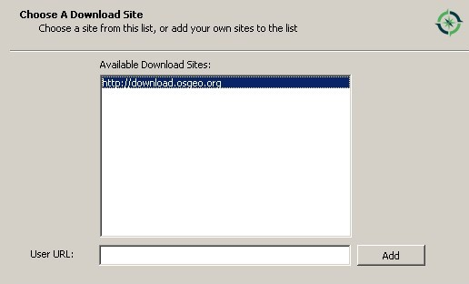

In the package list select ``qgis-dev`` (in category ``Desktop``) until QGIS3 is released.

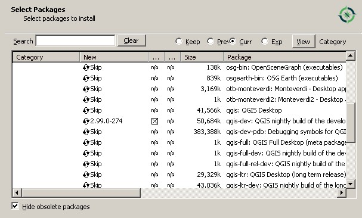

In the package list select ``python3-matplotlib`` (in category ``Libs``).

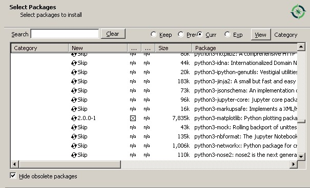

In the package list select ``python3-numpy`` (in category ``Libs``).

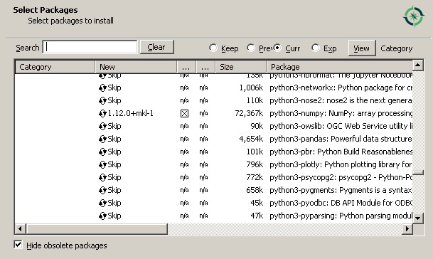

In the package list select ``python3-scipy`` (in category ``Libs``) and click ``Next``.

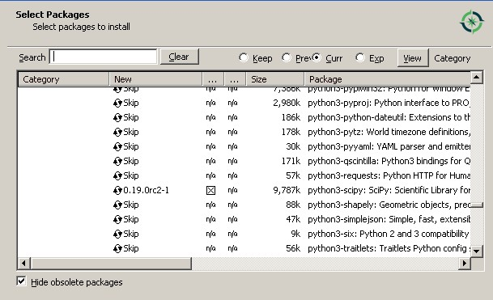

Click ``Next`` to install also other dependencies.

.. image:: _static/osgeo/11.jpg

After the download, QGIS should be installed with all the required dependencies for SCP.
