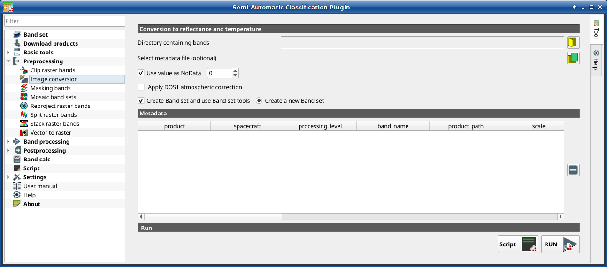

.. _image_conversion_tab:

******************************
Image conversion
******************************

.. contents::
    :depth: 2
    :local:

.. |registry_save| image:: _static/registry_save.png
    :width: 20pt

.. |project_save| image:: _static/project_save.png
    :width: 20pt

.. |optional| image:: _static/optional.png
    :width: 20pt

.. |input_list| image:: _static/input_list.jpg
    :width: 20pt

.. |input_text| image:: _static/input_text.jpg
    :width: 20pt

.. |input_date| image:: _static/input_date.jpg
    :width: 20pt

.. |input_number| image:: _static/input_number.jpg
    :width: 20pt

.. |input_table| image:: _static/input_table.jpg
    :width: 20pt

.. |open_file| image:: _static/semiautomaticclassificationplugin_open_file.png
    :width: 20pt

.. |new_file| image:: _static/semiautomaticclassificationplugin_new_file.png
    :width: 20pt

.. |open_dir| image:: _static/semiautomaticclassificationplugin_open_dir.png
    :width: 20pt

.. |remove| image:: _static/semiautomaticclassificationplugin_remove.png
    :width: 20pt

.. |add| image:: _static/semiautomaticclassificationplugin_add.png
    :width: 20pt

.. |reset| image:: _static/semiautomaticclassificationplugin_reset.png
    :width: 20pt

.. |bandset_tool| image:: _static/semiautomaticclassificationplugin_bandset_tool.png
    :width: 20pt

.. |download| image:: _static/semiautomaticclassificationplugin_download_arrow.png
    :width: 20pt

.. |sign_plot| image:: _static/semiautomaticclassificationplugin_sign_tool.png
    :width: 20pt

.. |tools| image:: _static/semiautomaticclassificationplugin_roi_tool.png
    :width: 20pt

.. |preprocessing| image:: _static/semiautomaticclassificationplugin_class_tool.png
    :width: 20pt

.. |band_processing| image:: _static/semiautomaticclassificationplugin_band_processing.png
    :width: 20pt

.. |postprocessing| image:: _static/semiautomaticclassificationplugin_post_process.png
    :width: 20pt

.. |bandcalc| image:: _static/semiautomaticclassificationplugin_bandcalc_tool.png
    :width: 20pt

.. |settings| image:: _static/semiautomaticclassificationplugin_settings_tool.png
    :width: 20pt

.. |script_tool| image:: _static/semiautomaticclassificationplugin_script.png
    :width: 20pt

.. |enter| image:: _static/semiautomaticclassificationplugin_enter.png
    :width: 20pt

.. |zoom_to_ROI| image:: _static/semiautomaticclassificationplugin_zoom_to_ROI.png
    :width: 20pt

.. |check| image:: _static/semiautomaticclassificationplugin_batch_check.png
    :width: 20pt

.. |select_all| image:: _static/semiautomaticclassificationplugin_select_all.png
    :width: 20pt

.. |docks| image:: _static/semiautomaticclassificationplugin_docks.png
    :width: 20pt

.. |add_sign_tool| image:: _static/semiautomaticclassificationplugin_add_sign_tool.png
    :width: 20pt

.. |scatter_plot| image:: _static/semiautomaticclassificationplugin_scatter_tool.png
    :width: 20pt

.. |merge_sign| image:: _static/semiautomaticclassificationplugin_merge_sign_tool.png
    :width: 20pt

.. |guide| image:: _static/guide.png
    :width: 20pt

.. |help| image:: _static/help.png
    :width: 20pt

.. |reload| image:: _static/semiautomaticclassificationplugin_reload.png
    :width: 20pt

.. |checkbox| image:: _static/checkbox.png
    :width: 18pt

.. |run| image:: _static/semiautomaticclassificationplugin_run.png
    :width: 24pt

.. |radiobutton| image:: _static/radiobutton.png
    :width: 18pt

    :guilabel:`Image conversion`

This tool allows for the conversion of several products to reflectance.
Depending on the processing level of the source product, the conversion can be
to the physical measure of Top Of Atmosphere reflectance (TOA), or the
application of a simple atmospheric correction using the DOS1 method (Dark
Object Subtraction 1), which is an image-based technique (for more information
about conversion to TOA and DOS1 correction,
see :ref:`conversion_to_reflectance`).
In case the source product is already provided as surface reflectance level,
the rescaling factors are applied to convert the DN to decimal values.

The following products can be processed:

* **Sentinel-2** images Level-1C;
* **Sentinel-2** images Level-2A;
* **Landsat 1, 2, 3 MSS, 4, 5, 7, 8, 9** images Collection 2 Level-2;
* **Harmonized Landsat Sentinel-2**.

.. tip::
    Information about APIs of this tool in Remotior Sensus at this
    `link <https://remotior-sensus.readthedocs.io/en/latest/remotior_sensus.tools.preprocess_products.html>`_ .

.. _image_conversion:

Image conversion
^^^^^^^^^^^^^^^^^^^^^^^^^^^^^^^^^^^^^^^^^^^^^^^^^^^^^^^^^^^^^^^^

Once the input is selected, available bands are listed in the metadata table.

.. list-table::
    :widths: auto
    :header-rows: 1

    * - Tool symbol and name
      - Description
    * - :guilabel:`Directory containing bands` |open_dir|
      - open a directory containing product bands; names of bands
        must end with the corresponding number; if the metadata file is
        included in this directory then :ref:`image_metadata` is
        automatically filled
    * - :guilabel:`Select metadata file` |open_file| |optional|
      - select the metadata file if not included in the
        :guilabel:`Directory containing bands`; for Sentinel-2, the metadata
        file is a .xml file whose name contains ``MTD_MSIL1C``.
    * - |checkbox| :guilabel:`Use value as  NoData` |input_number|
      - if checked, pixels having ``NoData`` value are not counted during
        conversion and the DOS1 calculation of DNmin; it is useful when image
        has a black border (usually pixel value = 0)
    * - |checkbox| :guilabel:`Apply DOS1 atmospheric correction`
      - if checked, the :ref:`DOS1_correction` is applied to all the bands
    * - |checkbox| :guilabel:`Create Band set and use Band set tools`
      - if checked, bands are added to the active :guilabel:`Band set` after
        the conversion; also, the :guilabel:`Band set` is processed according
        to the tools checked in the :ref:`band_set_tab`
    * - |radiobutton| :guilabel:`Add bands in a new Band set`
      - if checked, bands are added to a new empty :guilabel:`Band set` after
        the conversion

.. tip::
    For the best spectral precision one should download Surface Reflectance
    products (e.g., for Sentinel-2 the Level-2A Products).

.. warning::
    For Sentinel-2 L2A images downloaded as .zip file, all the .jp2 files must
    be moved inside the same directory and renamed according to the band number
    in the ending (e.g. from name_02_10m.jp2 to name_02.jp2).

.. _image_metadata:

Metadata
^^^^^^^^^^^^^^^^^

:guilabel:`Metadata` are required for the process to identify the product.
If the :guilabel:`Metadata` file is not inside the input directory, one can
define the file path in :guilabel:`Select metadata file`.
In the :guilabel:`Metadata`, all the bands found in are listed.

The table :guilabel:`Metadata` contains the following fields.

.. list-table::
    :widths: auto
    :header-rows: 1

    * - product
      - spacecraft
      - processing_level
      - band_name
      - product_path
      - scale
      - offset
      - nodata
      - date
      - k1
      - k2
      - band_number
      - e_sun
      - earth_sun_distance
    * - product name (e.g., Sentinel-2)
      - spacecraft name (e.g., Sentinel-2)
      - processing level of the product (e.g., Level-2)
      - name of the band
      - path of the band
      - scale of the band
      - offset of the band
      - nodata value of the band
      - date of acquisition of the product
      - k1 parameter for Landsat thermal conversion
      - k2 parameter for Landsat thermal conversion
      - band number
      - solar irradiance of band
      - Earth-Sun distance

It is possible to remove bands from the table, to exclude these bands from
the conversion.

.. list-table::
    :widths: auto
    :header-rows: 1

    * - Tool symbol and name
      - Description
    * - |remove|
      -  remove highlighted bands from the table :guilabel:`Metadata`

Bands having different spatial resolution are not resampled at this stage.
However, when using these bands in a classification process, all the bands
are resampled on the fly to the highest spatial resolution with nearest
neighbor.

.. list-table::
    :widths: auto
    :header-rows: 1

    * - Tool symbol and name
      - Description
    * - :guilabel:`Script` |script_tool|
      - add this function to the :ref:`script_tab`
    * - :guilabel:`RUN` |run|
      - run this function

.. tip::
    To reduce file size, output files are saved as data type UInt16 with scale
    0.0001, which are interpreted as Float32 type by GDAL.
