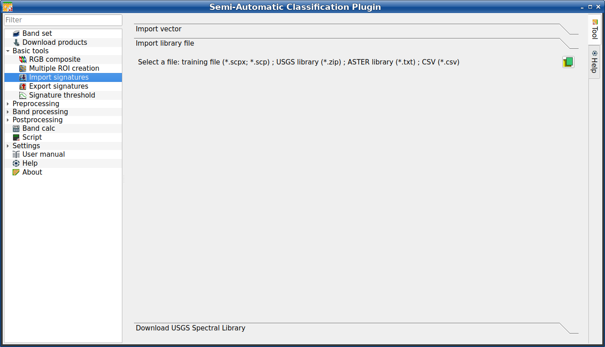
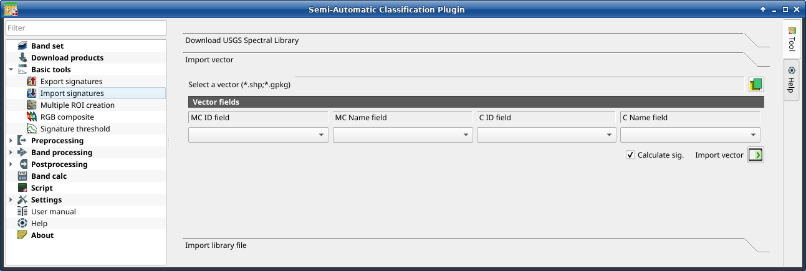
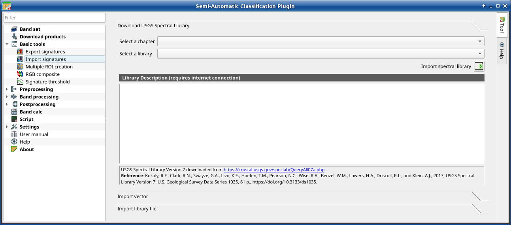

.. _import_signatures_tab:

******************************
Import signatures 
******************************

.. contents::
    :depth: 2
    :local:

.. |registry_save| image:: _static/registry_save.png
    :width: 20pt

.. |project_save| image:: _static/project_save.png
    :width: 20pt

.. |optional| image:: _static/optional.png
    :width: 20pt

.. |input_list| image:: _static/input_list.jpg
    :width: 20pt

.. |input_text| image:: _static/input_text.jpg
    :width: 20pt

.. |input_date| image:: _static/input_date.jpg
    :width: 20pt

.. |input_number| image:: _static/input_number.jpg
    :width: 20pt

.. |input_table| image:: _static/input_table.jpg
    :width: 20pt

.. |open_file| image:: _static/semiautomaticclassificationplugin_open_file.png
    :width: 20pt

.. |new_file| image:: _static/semiautomaticclassificationplugin_new_file.png
    :width: 20pt

.. |add| image:: _static/semiautomaticclassificationplugin_add.png
    :width: 20pt

.. |reset| image:: _static/semiautomaticclassificationplugin_reset.png
    :width: 20pt

.. |checkbox| image:: _static/checkbox.png
    :width: 18pt

.. |enter| image:: _static/semiautomaticclassificationplugin_enter.png
    :width: 20pt

.. |import_spectral_library| image:: _static/semiautomaticclassificationplugin_import_spectral_library.png
    :width: 20pt

The tab |import_spectral_library| :guilabel:`Import signatures` allows for
importing spectral signatures from various sources.

.. _import_library_file_tab:

Import library file
^^^^^^^^^^^^^^^^^^^^^^^^^^^^^^^^

    :guilabel:`Import library file`

This tool allows for importing spectral signatures from various sources:
a previously saved :ref:`training_input` (``.scpx`` file); a USGS Spectral
Library (``.asc`` file); a previously exported ``.csv`` file.
In case of USGS Spectral Library, the library is automatically sampled
according to the image band wavelengths defined in the :ref:`band_set_tab`,
and added to the :ref:`ROI_list`;

.. list-table::
    :widths: auto
    :header-rows: 1

    * - Tool symbol and name
      - Description
    * - :guilabel:`Select a file` |open_file|
      - open a file to be imported in the :ref:`training_input`

.. _import_shapefile_tab:

Import vector
^^^^^^^^^^^^^^^^^^^^^^^^^^^^^^^^

    :guilabel:`Import vector`

This tool allows for importing a vector (shapefile or geopackage), selecting
the corresponding fields of the :ref:`training_input`.

.. list-table::
    :widths: auto
    :header-rows: 1

    * - Tool symbol and name
      - Description
    * - :guilabel:`Select a vector` |open_file|
      - open a vector
    * - :guilabel:`MC ID field` |input_list|
      - select the vector field corresponding to MC ID
    * - :guilabel:`MC Name field` |input_list|
      - select the vector field corresponding to MC Name
    * - :guilabel:`C ID field` |input_list|
      - select the vector field corresponding to C ID
    * - :guilabel:`C Name field` |input_list|
      - select the vector field corresponding to C Name
    * - |checkbox| :guilabel:`Calculate sig.`
      - if checked, the spectral signature is calculated while the ROI is saved
        to :ref:`training_input`
    * - :guilabel:`Import vector` |enter|
      - import all the vector polygons as ROIs in the :ref:`training_input`

.. _USGS_spec_library_tab:

Download USGS Spectral Library
^^^^^^^^^^^^^^^^^^^^^^^^^^^^^^^^

    :guilabel:`Download USGS Spectral Library`

The tab :guilabel:`Download USGS Spectral Library` allows for the download of
the `USGS spectral library <http://speclab.cr.usgs.gov/spectral-lib.html>`_
(Clark, R.N., Swayze, G.A., Wise, R., Livo, E., Hoefen, T., Kokaly, R., Sutley,
S.J., 2007, USGS digital spectral library splib06a: U.S. Geological Survey,
Digital Data Series 231).

The libraries are grouped in chapters including Minerals, Mixtures, Coatings,
Volatiles, Man-Made, Plants, Vegetation Communities, Mixtures with Vegetation,
and Microorganisms.

An internet connection is required.

.. list-table::
    :widths: auto
    :header-rows: 1

    * - Tool symbol and name
      - Description
    * - :guilabel:`Select a chapter` |input_list|
      - select one of the library chapters; after the selection, chapter
        libraries are shown in :guilabel:`Select a library`
    * - :guilabel:`Select a library` |input_list|
      - select one of the libraries; the library description is displayed in
        the frame :guilabel:`Library description`
    * - :guilabel:`Import spectral library` |enter|
      - download the library and add the sampled spectral signature to
        the :ref:`ROI_list` using the parameters defined for class and
        macroclass; the library is automatically sampled according to the image
        band wavelengths defined in the :guilabel:`active band set`
        in :ref:`band_set_tab`, and added to the :ref:`ROI_list`

.. tip::
    Spectral libraries downloaded from the ``USGS Spectral Library`` can be
    used with Minimum Distance or Spectral Angle Mapping algorithms, but not
    Maximum Likelihood because this algorithm needs the covariance matrix that
    is not included in the spectral libraries.
