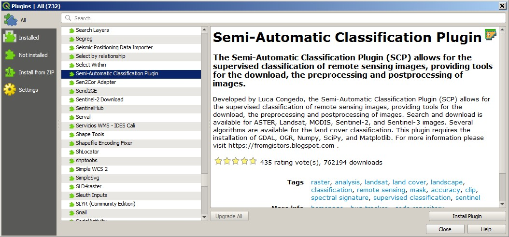
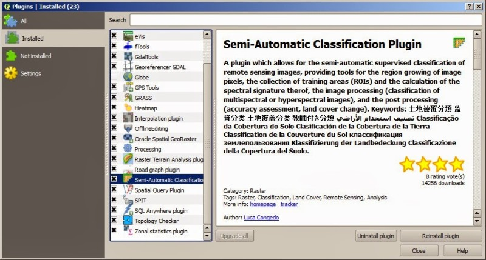
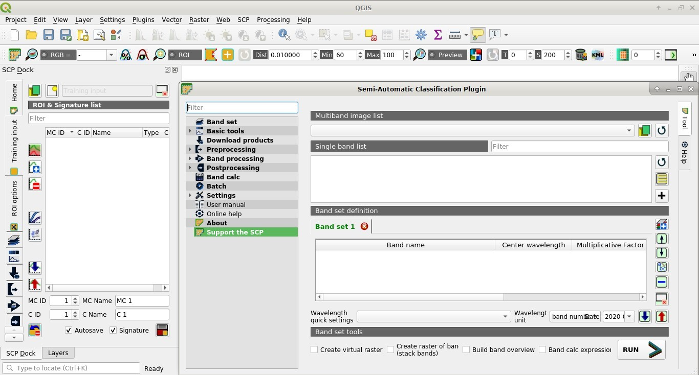
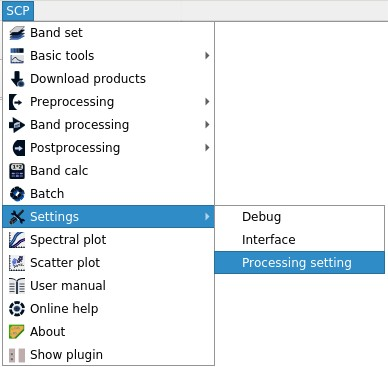
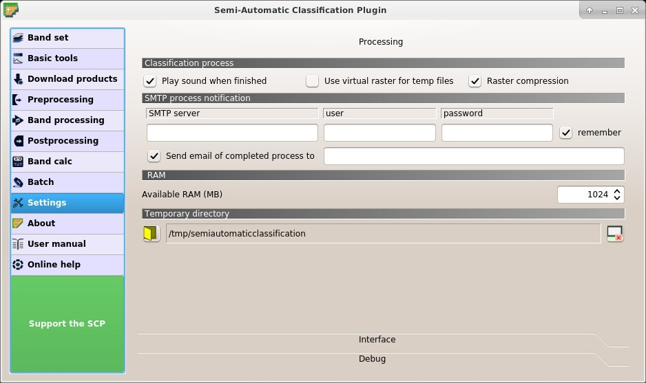

.. _installation_debian:

****************************
Installation in Debian Linux
****************************

.. |br| raw:: html

	 

.. _QGIS_installation_debian:
 
QGIS download and installation
------------------------------------------
	
* Open a terminal and type::

	sudo apt-get update

* Press Enter and type the user password;

* Type in a terminal::

	sudo apt-get install qgis python3-matplotlib python3-scipy

* Press Enter and wait until the software is downloaded and installed.

Now, QGIS is installed.

.. _plugin_installation_debian:
 
Semi-Automatic Classification Plugin installation
---------------------------------------------------

* Run QGIS;

* From the main menu, select ``Plugins`` > ``Manage and Install Plugins``;

* From the menu ``All``, select the Semi-Automatic Classification Plugin and click the button ``Install plugin``;

	**TIP**: in case of issues or an offline installation is required see :ref:`plugin_installation_1` and :ref:`plugin_installation_2`.

* The SCP should be automatically activated; however, be sure that the Semi-Automatic Classification Plugin is checked in the menu ``Installed`` (the restart of QGIS could be necessary to complete the SCP installation);

.. _plugin_configuration_debian:

Configuration of the plugin
---------------------------

Now, the Semi-Automatic Classification Plugin is installed and a dock and a toolbar should be added to QGIS.
Also, a SCP menu is available in the Menu Bar of QGIS. 
It is possible to move the toolbar and the dock according to your needs, as in the following image.
	

The configuration of available RAM is recommended in order to reduce the processing time. 
From the :ref:`SCP_menu` select |settings_tool| ``Settings > Processing`` .

In the :ref:`settings_tab`, set the ``Available RAM (MB)`` to a value that should be half of the system RAM. For instance, if your system has 2GB of RAM, set the value to 1024MB.

.. |settings_tool| image:: _static/semiautomaticclassificationplugin_settings_tool.png
	:width: 20pt
	
