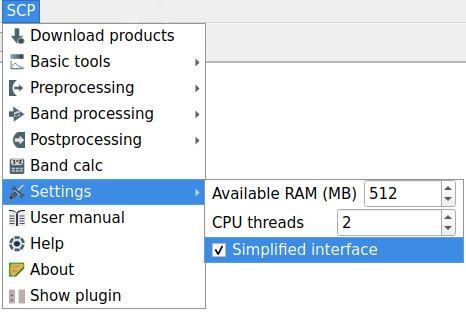

.. _installation_mac:

***********************
macOS
***********************

.. _QGIS_installation_mac:
 
QGIS download and installation
------------------------------

* Download the latest QGIS version from
  `here <https://www.qgis.org/download/#mac>`_ ;

* Execute the QGIS installer with administrative rights, accepting the default
  configuration.

Now, QGIS is installed.

.. image:: _static/installation/QGIS.jpg

.. _installation_dependencies_mac:

Installation of required dependencies
-------------------------------------------------

The Semi-Automatic Classification Plugin requires Remotior Sensus, GDAL, NumPy
and SciPy for the main functionalities.
Optionally, scikit-learn and PyTorch are required for machine learning and
additional functionalities.

The Semi-Automatic Classification Plugin can automatically download and
install Remotior Sensus.
Therefore, it is recommended install the dependencies that are not included in
the QGIS installation.

* Close QGIS;

* Open the terminal (administrative rights may be required);

* Type the following command (you may need to adapt the path
  `/Applications/QGIS.app` to the actual QGIS installation directory):

.. code-block:: bash

    /Applications/QGIS.app/Contents/MacOS/bin/pip3 install scikit-learn scipy torch torchvision --index-url https://download.pytorch.org/whl/cpu

or in case you installed QGIS LTR:

.. code-block:: bash

    /Applications/QGIS-LTR.app/Contents/MacOS/bin/pip3 install scikit-learn scipy torch torchvision --index-url https://download.pytorch.org/whl/cpu

.. tip::
    If the system has GPU support please refer to the PyTorch
    documentation for installation  https://pytorch.org/get-started/locally/

.. _plugin_installation_mac:

Semi-Automatic Classification Plugin installation
---------------------------------------------------

* Run QGIS;

* From the main menu, select ``Plugins`` > ``Manage and Install Plugins``;

.. image:: _static/installation/install.jpg

* From the menu ``All``, select the Semi-Automatic Classification Plugin and
  click the button ``Install plugin``;

.. image:: _static/installation/plugins.jpg

* The SCP should be automatically activated; however, be sure that the
  Semi-Automatic Classification Plugin is checked in the menu ``Installed``
  (the restart of QGIS could be necessary to complete the SCP installation);

.. image:: _static/installation/plugins_installed.jpg

.. _plugin_configuration_mac:

Configuration of the plugin
---------------------------

Now, the Semi-Automatic Classification Plugin is installed.

A :guilabel:`Simplified interface` is loaded after the first installation of
the plugin.
It is especially designed for new users in order to ease the classification
process, from the definition of input images to executing the classification
algorithm.
Also, a SCP menu is available in the Menu Bar of QGIS.
It is possible to move the dock according to your needs,
as in the following image.

.. image:: _static/installation/SemiAutomaticClassificationPlugin.jpg

.. |settings_tool| image:: _static/semiautomaticclassificationplugin_settings_tool.png
    :width: 20pt

The configuration of available RAM is recommended in order to reduce
the processing time.
From the :ref:`SCP_menu` select |settings_tool| ``Settings`` .

In the :ref:`settings_tab`, set the ``Available RAM (MB)`` to a value that
should be half of the system RAM.
For instance, if your system has 4GB of RAM, set the value to 2048MB.

The :guilabel:`Complete interface` can be loaded from the settings in the
:ref:`SCP_menu`, by deselecting :guilabel:`Simplified interface` and
restarting QGIS.
