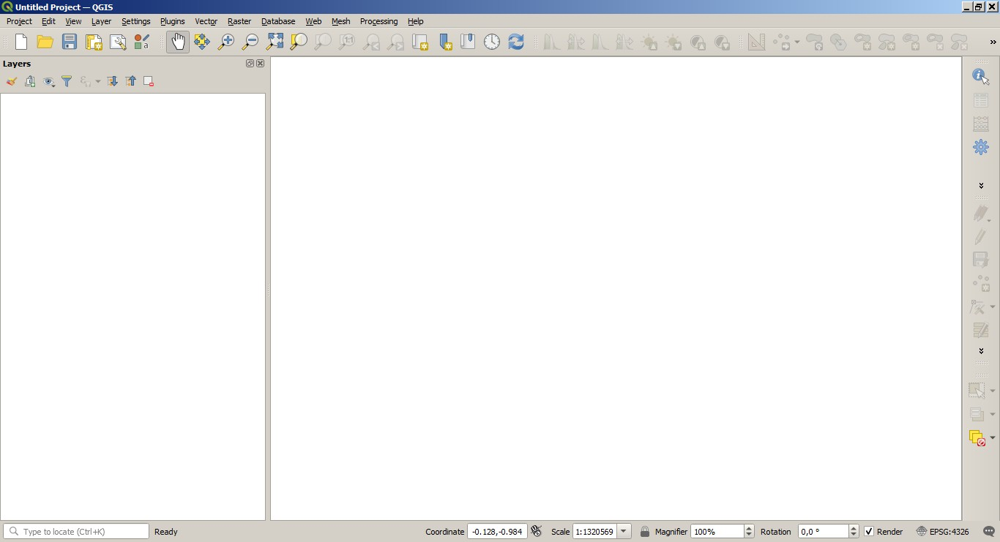
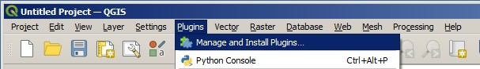
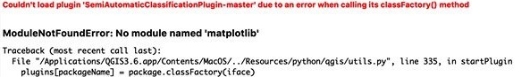

.. _installation_mac:

***********************
Installation in Mac OS
***********************

.. |br| raw:: html

	 

.. _QGIS_installation_mac:
 
QGIS download and installation
------------------------------
	
* Visit the website `KyngChaos <https://www.kyngchaos.com/software/qgis/>`_ and download the latest QGIS disk image (including Python and GDAL). QGIS 3.16 is recommended at the moment.

	**WARNING**: it is recommended to install only one versions of QGIS; for a clean QGIS installation, uninstall any previous version of QGIS and remove all the related directories.
	
* Follow the Readme instructions and clean up any previous path settings. Python must be installed prior to GDAL and QGIS.

Now, QGIS is installed.

.. _plugin_installation_mac:
 
Semi-Automatic Classification Plugin installation
--------------------------------------------------

* Run QGIS;

* From the main menu, select ``Plugins`` > ``Manage and Install Plugins``;

* From the menu ``All``, select the Semi-Automatic Classification Plugin and click the button ``Install plugin``;

	**TIP**: in case of issues or an offline installation is required see :ref:`plugin_installation_1` and :ref:`plugin_installation_2`.
	
.. image:: _static/plugins.jpg

* The SCP should be automatically activated; however, be sure that the Semi-Automatic Classification Plugin is checked in the menu ``Installed`` (the restart of QGIS could be necessary to complete the SCP installation);

.. image:: _static/plugins_installed.jpg

.. _plugin_configuration_mac:

Configuration of the plugin
---------------------------

Now, the Semi-Automatic Classification Plugin is installed and a dock and a toolbar should be added to QGIS.
Also, a SCP menu is available in the Menu Bar of QGIS. 
It is possible to move the toolbar and the dock according to your needs, as in the following image.
	
.. image:: _static/SemiAutomaticClassificationPlugin.jpg

The configuration of available RAM is recommended in order to reduce the processing time. 
From the :ref:`SCP_menu` select |settings_tool| ``Settings > Processing`` .

.. image:: _static/settings_processing.jpg

In the :ref:`settings_tab`, set the ``Available RAM (MB)`` to a value that should be half of the system RAM. For instance, if your system has 2GB of RAM, set the value to 1024MB.

.. |settings_tool| image:: _static/semiautomaticclassificationplugin_settings_tool.png
	:width: 20pt
	
.. image:: _static/settings_processing_tab.png

.. _plugin_issues_mac:

Installation issues
---------------------------

In case of missing dependencies, you could get error messages such as the following example with matplotlib:

A solution is to follow these steps as described in `this GIS Stackexchange post <https://gis.stackexchange.com/questions/366848/scp-plugin-for-qgis-3-10-on-mac>`_ :

* Download and install Python from https://www.python.org/downloads/mac-osx/ selecting the macOS 64-bit installer;

* Download and install the complete GDAL installer from https://www.kyngchaos.com/software/frameworks/ ;

	**TIP**: In case of warnings about malicious software go to the ``Apple menu`` > ``System Preferences`` > ``Security & Privacy`` > ``General Tab`` > ``Allow Anyway`` ; Python should be in ``Library`` > ``Frameworks`` > ``Python.framework`` ; GDAL should be in ``Library`` > ``Application Support`` > ``GDAL``

* Open QGIS, go to ``Settings`` > ``Options`` > ``System`` > ``Environment`` and enable ``Use Custom Variables`` ;

* Select ``Prepend``, under ``variable`` enter ``PATH``, under ``value`` enter the path to GDAL ``/Library/Frameworks/GDAL.framework/Programs:/Library/Frameworks/Python.framework/Versions/3.8/bin:`` ;

	**TIP**: In case of GDAL was installed through Macports, the path to GDAL should be ``/opt/local/bin/:``

* Restart QGIS.

