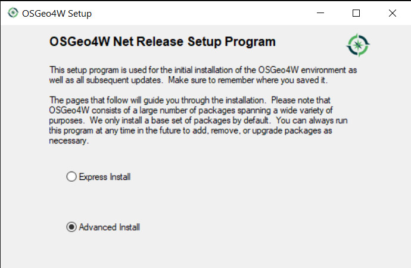
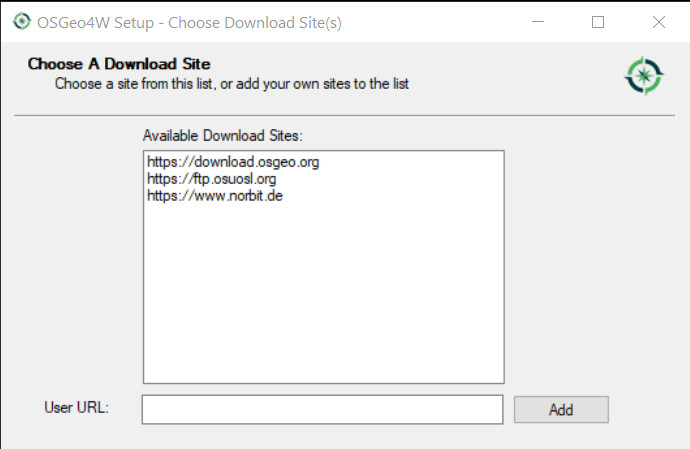
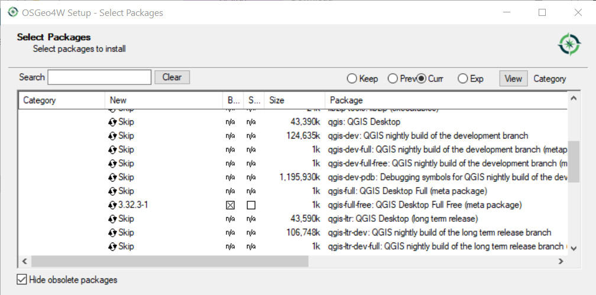
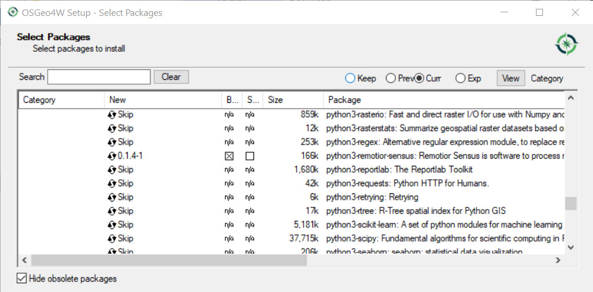
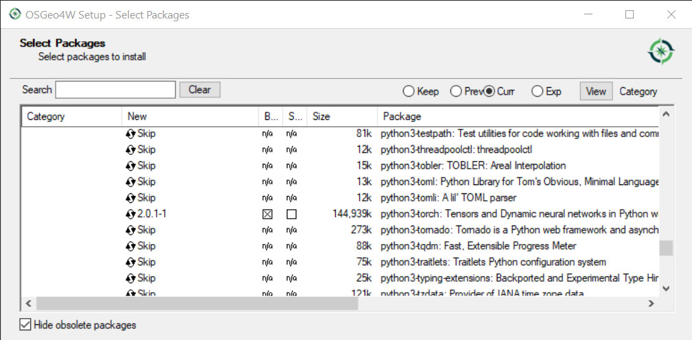
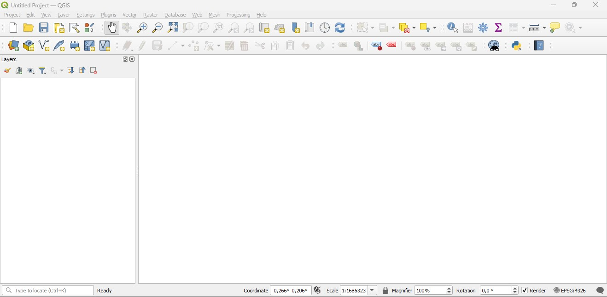
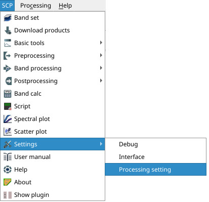
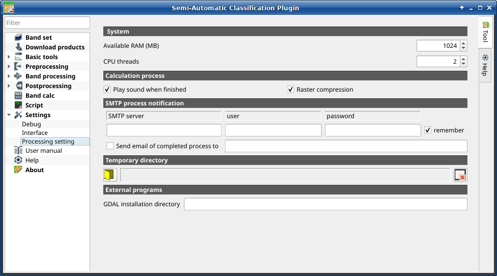
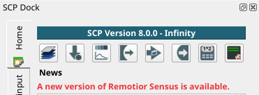
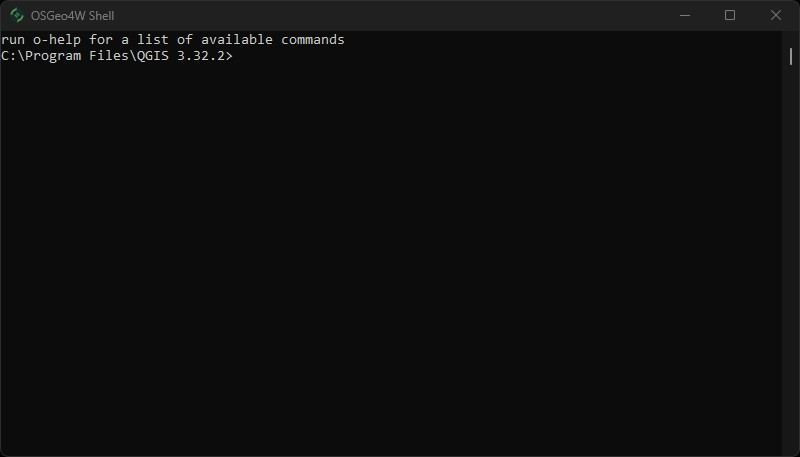

.. _network_installation_win64:

******************************************
Network installation in Windows 64 bit
******************************************

.. _QGIS_network_installation_win64bit:
 
QGIS download and installation
------------------------------------------

* Download the latest QGIS version 64 bit using the OSGeo4W network installer
  `from here <https://download.osgeo.org/osgeo4w/v2/osgeo4w-setup.exe>`_ ;

* Execute the QGIS installer with administrative rights and select
  ``Advanced Install``;

* Select ``Install from Internet``; proceed selecting the default installation
  directory and the preferred network configuration;

The Semi-Automatic Classification Plugin requires Remotior Sensus, GDAL, NumPy
and SciPy for most functionalities.
Optionally, scikit-learn and PyTorch are required for machine learning.

* In the menu ``Select packages`` select
  ``All > Desktop > qgis-full-free``; also select
  ``All > Libs > python3-remotior-sensus``,
  ``All > Libs > python3-scikit-learn`` and ``All > Libs > python3-torch``;

.. image:: _static/installation/osgeo_packages_3.jpg

* Click ``Next`` and accept to install the required dependencies;

.. image:: _static/installation/osgeo_dependencies.jpg

The download of the programs will start, and QGIS will be installed along with
the required dependencies.

.. _plugin_installation_win64bit_network:
 
Semi-Automatic Classification Plugin installation
---------------------------------------------------

* Run QGIS;

* From the main menu, select ``Plugins`` > ``Manage and Install Plugins``;

.. image:: _static/installation/install.jpg

* From the menu ``All``, select the Semi-Automatic Classification Plugin and
  click the button ``Install plugin``;

.. image:: _static/installation/plugins.jpg

* The SCP should be automatically activated; however, be sure that the
  Semi-Automatic Classification Plugin is checked in the menu ``Installed``
  (the restart of QGIS could be necessary to complete the SCP installation);

.. image:: _static/installation/plugins_installed.jpg

.. _plugin_configuration_win64bit_network:

Configuration of the plugin
---------------------------

Now, the Semi-Automatic Classification Plugin is installed and a dock and
a toolbar should be added to QGIS.
Also, a SCP menu is available in the Menu Bar of QGIS. 
It is possible to move the toolbar and the dock according to your needs,
as in the following image.

.. image:: _static/installation/SemiAutomaticClassificationPlugin.jpg

.. |settings_tool| image:: _static/semiautomaticclassificationplugin_settings_tool.png
    :width: 20pt

The configuration of available RAM is recommended in order to reduce
the processing time.
From the :ref:`SCP_menu` select |settings_tool| ``Settings > Processing`` .

In the :ref:`settings_tab`, set the ``Available RAM (MB)`` to a value that
should be half of the system RAM.
For instance, if your system has 2GB of RAM, set the value to 1024MB.

.. _installation_update_win64bit_network:

Update of required dependencies
-------------------------------------------------

The dependency Remotior Sensus is frequently updated.
The Semi-Automatic Classification Plugin can check automatically if a new
version is available, and display a message in the :ref:`scp_dock`.

It is recommended to close QGIS and update Remotior Sensus following the same
installation steps described in :ref:`QGIS_network_installation_win64bit`.

In case the library Remotior Sensus is outdated, it is possible to open the
OSGeo4W Shell (administrative rights may be required):

and run the following command:

.. code-block:: shell

    pip3 install --upgrade remotior-sensus
