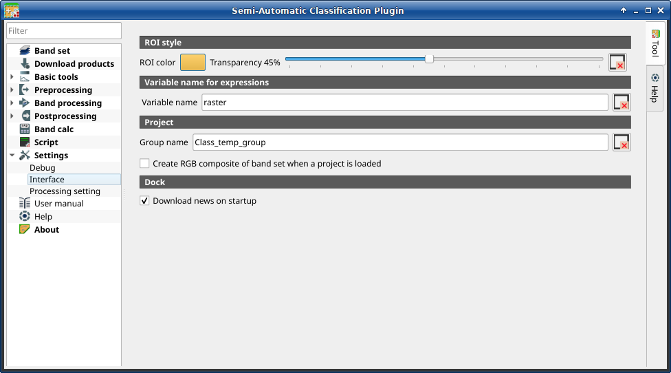

.. _settings_interface_tab:

******************************
Interface (complete interface)
******************************

.. contents::
    :depth: 2
    :local:

.. |registry_save| image:: _static/registry_save.png
    :width: 20pt

.. |project_save| image:: _static/project_save.png
    :width: 20pt

.. |optional| image:: _static/optional.png
    :width: 20pt

.. |input_list| image:: _static/input_list.jpg
    :width: 20pt

.. |input_text| image:: _static/input_text.jpg
    :width: 20pt

.. |input_slider| image:: _static/input_slider.jpg
    :width: 20pt

.. |checkbox| image:: _static/checkbox.png
    :width: 18pt

.. |reset| image:: _static/semiautomaticclassificationplugin_reset.png
    :width: 20pt

.. |export| image:: _static/semiautomaticclassificationplugin_export.png
    :width: 20pt

.. |input_number| image:: _static/input_number.jpg
    :width: 20pt

.. |enter| image:: _static/semiautomaticclassificationplugin_enter.png
    :width: 20pt

.. |open_dir| image:: _static/semiautomaticclassificationplugin_open_dir.png
    :width: 20pt

    :guilabel:`Interface`

This tab includes a few advanced settings of the :guilabel:`SCP` interface.
It is loaded only if the :guilabel:`Simplified interface` is not enabled.

.. _roi_style:

ROI style
^^^^^^^^^^^^^^^^^^

Change ROI color and transparency for a better visualization of temporary
ROIs on the map.

.. list-table::
    :widths: auto
    :header-rows: 1

    * - Tool symbol and name
      - Description
    * - :guilabel:`ROI color` |registry_save|
      - button for changing ROI color
    * - :guilabel:`Transparency` |input_slider| |registry_save|
      - change ROI transparency
    * - |reset|
      - reset ROI color and transparency to default

.. _variable_name:

Variable name for expressions
^^^^^^^^^^^^^^^^^^^^^^^^^^^^^^^^^^^^^^^^^^^^^^^^^^^^^^^^^

Set the variable name used in expressions of the :ref:`reclassification_tab`.

.. list-table::
    :widths: auto
    :header-rows: 1

    * - Tool symbol and name
      - Description
    * - :guilabel:`Variable name` |input_text| |registry_save|
      - set variable name (default is ``raster``)
    * - |reset|
      - reset variable name to default

.. _group_name:

Temporary group name
^^^^^^^^^^^^^^^^^^^^^^^^^^^^^^^^^^^^^^^^^^^^^^^^^^^^^^^^^

.. list-table::
    :widths: auto
    :header-rows: 1

    * - Tool symbol and name
      - Description
    * - :guilabel:`Group name` |input_text| |registry_save|
      - set group name (default is ``Class_temp_group``)
    * - |reset|
      - reset group name to default
    * - |checkbox| :guilabel:`Create RGB composite of band set when a project is loaded` |registry_save|
      - if checked, a RGB composite of active band set is added to the map
        when a project is loaded

.. _dock_settings:

Dock
^^^^^^^^^^^^^^^^^^^^^^^^^^^^^^^^^^^^^^^^^^^^^^^^^^^^^^^^^

.. list-table::
    :widths: auto
    :header-rows: 1

    * - Tool symbol and name
      - Description
    * - |checkbox| :guilabel:`Download news on startup` |registry_save|
      - if checked, news about the :guilabel:`SCP` and related services are
        downloaded on startup and displayed in :guilabel:`Dock`;
        also, it checks for updates of
        `Remotior Sensus <https://remotior-sensus.readthedocs.io/en/latest>`_
