.. _main_interface_window:

******************************
Main Interface Window
******************************

.. |br| raw:: html

  

The Main Interface Window is composed of several tabs described in detail in the following paragraphs.
Tabs can be selected through the menu at the left side.

.. contents::
    :depth: 2
    :local:

.. |registry_save| image:: _static/registry_save.png
	:width: 20pt
	
.. |project_save| image:: _static/project_save.png
	:width: 20pt
	
.. |optional| image:: _static/optional.png
	:width: 20pt
	
.. |input_list| image:: _static/input_list.jpg
	:width: 20pt
	
.. |input_text| image:: _static/input_text.jpg
	:width: 20pt
	
.. |input_date| image:: _static/input_date.jpg
	:width: 20pt
	
.. |input_number| image:: _static/input_number.jpg
	:width: 20pt
	
.. |input_slider| image:: _static/input_slider.jpg
	:width: 20pt
	
.. |input_table| image:: _static/input_table.jpg
	:width: 20pt
	
.. |add| image:: _static/semiautomaticclassificationplugin_add.png
	:width: 20pt
	
.. |checkbox| image:: _static/checkbox.png
	:width: 18pt
	
.. |pointer| image:: _static/semiautomaticclassificationplugin_pointer_tool.png
	:width: 20pt
	
.. |radiobutton| image:: _static/radiobutton.png
	:width: 18pt
	
.. |reload| image:: _static/semiautomaticclassificationplugin_reload.png
	:width: 20pt
	
.. |reset| image:: _static/semiautomaticclassificationplugin_reset.png
	:width: 20pt
	
.. |remove| image:: _static/semiautomaticclassificationplugin_remove.png
	:width: 20pt
	
.. |run| image:: _static/semiautomaticclassificationplugin_run.png
	:width: 24pt
	
.. |open_file| image:: _static/semiautomaticclassificationplugin_open_file.png
	:width: 20pt
	
.. |new_file| image:: _static/semiautomaticclassificationplugin_new_file.png
	:width: 20pt
	
.. |open_dir| image:: _static/semiautomaticclassificationplugin_open_dir.png
	:width: 20pt
	
.. |select_all| image:: _static/semiautomaticclassificationplugin_select_all.png
	:width: 20pt
	
.. |move_up| image:: _static/semiautomaticclassificationplugin_move_up.png
	:width: 20pt
	
.. |add_bandset| image:: _static/semiautomaticclassificationplugin_add_bandset_tool.png
	:width: 20pt
	
.. |move_down| image:: _static/semiautomaticclassificationplugin_move_down.png
	:width: 20pt
	
.. |search_images| image:: _static/semiautomaticclassificationplugin_search_images.png
	:width: 20pt

.. |osm_add| image:: _static/semiautomaticclassificationplugin_osm_add.png
	:width: 20pt

.. |image_preview| image:: _static/semiautomaticclassificationplugin_download_image_preview.png
	:width: 20pt

.. |import| image:: _static/semiautomaticclassificationplugin_import.png
	:width: 20pt
	
.. |export| image:: _static/semiautomaticclassificationplugin_export.png
	:width: 20pt

.. |plus| image:: _static/semiautomaticclassificationplugin_plus.png
	:width: 20pt

.. |order_by_name| image:: _static/semiautomaticclassificationplugin_order_by_name.png
	:width: 20pt

.. |image_overview| image:: _static/semiautomaticclassificationplugin_download_image_overview.png
	:width: 20pt
	
.. |enter| image:: _static/semiautomaticclassificationplugin_enter.png
	:width: 20pt

.. |download| image:: _static/semiautomaticclassificationplugin_download_arrow.png
	:width: 20pt
	
.. |login_data| image:: _static/semiautomaticclassificationplugin_download_login.png
	:width: 20pt
	
.. |search_tab| image:: _static/semiautomaticclassificationplugin_download_search.png
	:width: 20pt

.. |download_options_tab| image:: _static/semiautomaticclassificationplugin_download_options.png
	:width: 20pt

.. |tools| image:: _static/semiautomaticclassificationplugin_roi_tool.png
	:width: 20pt
	
.. |roi_multiple| image:: _static/semiautomaticclassificationplugin_roi_multiple.png
	:width: 20pt

.. |import_spectral_library| image:: _static/semiautomaticclassificationplugin_import_spectral_library.png
	:width: 20pt
	
.. |export_spectral_library| image:: _static/semiautomaticclassificationplugin_export_spectral_library.png
	:width: 20pt
	
.. |weight_tool| image:: _static/semiautomaticclassificationplugin_weight_tool.png
	:width: 20pt
	
.. |LCS_threshold_ROI_tool| image:: _static/semiautomaticclassificationplugin_LCS_threshold_ROI_tool.png
	:width: 20pt
	
.. |threshold_tool| image:: _static/semiautomaticclassificationplugin_threshold_tool.png
	:width: 20pt
	
.. |LCS_threshold| image:: _static/semiautomaticclassificationplugin_LCS_threshold_tool.png
	:width: 20pt
	
.. |LCS_threshold_set_tool| image:: _static/semiautomaticclassificationplugin_LCS_threshold_set_tool.png
	:width: 20pt
	
.. |sign_plot| image:: _static/semiautomaticclassificationplugin_sign_tool.png
	:width: 20pt
	

	
.. |preprocessing| image:: _static/semiautomaticclassificationplugin_class_tool.png
	:width: 20pt
	
.. |band_processing| image:: _static/semiautomaticclassificationplugin_band_processing.png
	:width: 20pt
	
.. |band_combination| image:: _static/semiautomaticclassificationplugin_band_combination_tool.png
	:width: 20pt
	
.. |landsat_tool| image:: _static/semiautomaticclassificationplugin_landsat8_tool.png
	:width: 20pt
	
.. |sentinel2_tool| image:: _static/semiautomaticclassificationplugin_sentinel_tool.png
	:width: 20pt
	
.. |sentinel3_tool| image:: _static/semiautomaticclassificationplugin_sentinel3_tool.png
	:width: 20pt
	
.. |aster_tool| image:: _static/semiautomaticclassificationplugin_aster_tool.png
	:width: 20pt
	

	
.. |split_raster| image:: _static/semiautomaticclassificationplugin_split_raster.png
	:width: 20pt
	
.. |stack_raster| image:: _static/semiautomaticclassificationplugin_stack_raster.png
	:width: 20pt
	
.. |mosaic_tool| image:: _static/semiautomaticclassificationplugin_mosaic_tool.png
	:width: 20pt
	
.. |cloud_masking_tool| image:: _static/semiautomaticclassificationplugin_cloud_masking_tool.png
	:width: 20pt
	
.. |clip_tool| image:: _static/semiautomaticclassificationplugin_clip_tool.png
	:width: 20pt
	
.. |pca_tool| image:: _static/semiautomaticclassificationplugin_pca_tool.png
	:width: 20pt
	
.. |vector_to_raster_tool| image:: _static/semiautomaticclassificationplugin_vector_to_raster_tool.png
	:width: 20pt
	
.. |post_process| image:: _static/semiautomaticclassificationplugin_post_process.png
	:width: 20pt
	
.. |accuracy_tool| image:: _static/semiautomaticclassificationplugin_accuracy_tool.png
	:width: 20pt
	
.. |land_cover_change| image:: _static/semiautomaticclassificationplugin_land_cover_change.png
	:width: 20pt
	
.. |report_tool| image:: _static/semiautomaticclassificationplugin_report_tool.png
	:width: 20pt

.. |cross_classification| image:: _static/semiautomaticclassificationplugin_cross_classification.png
	:width: 20pt

.. |spectral_distance| image:: _static/semiautomaticclassificationplugin_spectral_distance.png
	:width: 20pt

.. |clustering| image:: _static/semiautomaticclassificationplugin_kmeans_tool.png
	:width: 20pt

.. |class_to_vector_tool| image:: _static/semiautomaticclassificationplugin_class_to_vector_tool.png
	:width: 20pt

.. |class_signature| image:: _static/semiautomaticclassificationplugin_class_signature_tool.png
	:width: 20pt

.. |reclassification_tool| image:: _static/semiautomaticclassificationplugin_reclassification_tool.png
	:width: 20pt

.. |edit_raster| image:: _static/semiautomaticclassificationplugin_edit_raster.png
	:width: 20pt

.. |undo_edit_raster| image:: _static/semiautomaticclassificationplugin_undo_edit_raster.png
	:width: 20pt

.. |classification_sieve| image:: _static/semiautomaticclassificationplugin_classification_sieve.png
	:width: 20pt

.. |classification_erosion| image:: _static/semiautomaticclassificationplugin_classification_erosion.png
	:width: 20pt

.. |classification_dilation| image:: _static/semiautomaticclassificationplugin_classification_dilation.png
	:width: 20pt

.. |bandcalc_tool| image:: _static/semiautomaticclassificationplugin_bandcalc_tool.png
	:width: 20pt
	
.. |batch_tool| image:: _static/semiautomaticclassificationplugin_batch.png
	:width: 20pt

.. |bandset_tool| image:: _static/semiautomaticclassificationplugin_bandset_tool.png
	:width: 20pt
	
.. |settings_tool| image:: _static/semiautomaticclassificationplugin_settings_tool.png
	:width: 20pt

.. _band_set_tab:
 
Band set
============

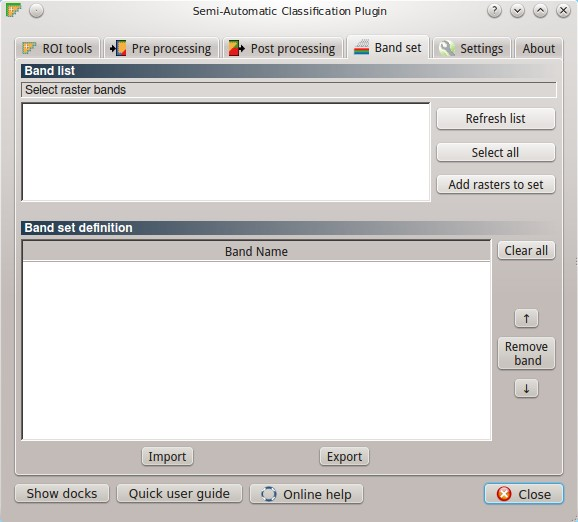
	
	|bandset_tool| :guilabel:`Band set`
	
Image input in :guilabel:`SCP` is named :guilabel:`band set`.
This tab allows for the definition of one or more :guilabel:`band sets` used as input for classification and other tools.

:guilabel:`Band sets` are identified by numbers.
The :guilabel:`active band set` (i.e. the tab selected in :ref:`band_set_definition` with bold green name) is used as input for the tools in :ref:`SCP_dock` and :ref:`working_toolbar`.
Other :guilabel:`SCP` tools allow for the selection of :guilabel:`band set` numbers.

The :guilabel:`Band set` definition is saved with the QGIS project.

.. _input_image:
 
Multiband image list
----------------------------------------

This section allows for the selection of a multiband raster.
If selected, raster bands are listed in the :guilabel:`active band set`.
	
* |input_list| : select the input image from a list of multispectral images loaded in QGIS;
* |open_file|: open one or more raster files that are added to the :guilabel:`active band set` and loaded in QGIS;
* |reload|: refresh layer list;
	
.. _band_list:

Single band list
-------------------

List of single band rasters already loaded in QGIS.
It is possible to select one or more bands to be added to the :guilabel:`active band set`.

* |reload|: refresh list of raster bands loaded in QGIS;
* |select_all|: select all raster bands;
* |plus|: add selected rasters to the :guilabel:`active band set`.

.. _band_set_definition:

Band set definition
---------------------

Definition of bands composing the :guilabel:`band sets` .
The :guilabel:`active band set` is the tab selected with bold green name.
It is possible to add new :guilabel:`band sets` clicking the following button:

* |add_bandset|: add a new empty :guilabel:`band set`;

Click the |close_bandset| in the tab to remove the corresponding :guilabel:`band set`.
:guilabel:`Band sets` can be reordered dragging the tabs.

The :guilabel:`Center wavelength` of bands should be defined in order to use several functions of :guilabel:`SCP`.
If the :guilabel:`Center wavelength` of bands is not defined, the band number is used and some :guilabel:`SCP` tools will be disabled.

It is possible to define a multiplicative rescaling factor and additive rescaling factor for each band (for instance using the values in Landsat metadata), which are used on the fly (i.e. ``pixel value = original pixel value * multiplicative rescaling factor + additive rescaling factor``) during the processing.

Every :guilabel:`band set` is defined with the following table:

* |input_table| :guilabel:`Band set #`: table containing the following fields;
	* :guilabel:`Band name` |project_save|: name of the band; name cannot be edited;
	* :guilabel:`Center wavelength` |project_save|: center of the wavelength of the band;
	* :guilabel:`Multiplicative Factor` |project_save|: multiplicative rescaling factor;
	* :guilabel:`Additive Factor` |project_save|: additive rescaling factor;
	* :guilabel:`Wavelength unit` |project_save|: wavelength unit;
	* :guilabel:`Image name` |project_save|: image name for multiband rasters;

* |move_up|: move highlighted bands upward;
* |move_down|: move highlighted bands downward;
* |order_by_name| : sort automatically bands by name, giving priority to the ending numbers of name;
* |remove|: remove highlighted bands from the :guilabel:`active band set`;
* |reset|: clear all bands from :guilabel:`active band set`;
	
* :guilabel:`Quick wavelength settings` |input_list| |optional|: rapid definition of band center wavelength for the following satellite sensors:
	* ASTER;
	* GeoEye-1;
	* Landsat 8 OLI;
	* Landsat 7 ETM+;
	* Landsat 5 TM;
	* Landsat 4 TM;
	* Landsat 1, 2, and 3 MSS;
	* MODIS;
	* Pleiades;
	* QuickBird;
	* RapidEye;
	* Sentinel-2;
	* Sentinel-3;
	* SPOT 4;
	* SPOT 5;
	* SPOT 6;
	* WorldView-2 and WorldView-3;

* :guilabel:`Wavelength unit` |input_list| |project_save|: select the wavelength unit among:
	* :guilabel:`Band number`: no unit, only band number;
	* :math:`\mu m`: micrometres;
	* :guilabel:`nm`: nanometres;
	
* |import|: import a previously saved :guilabel:`active band set` from file;
* |export|: export the :guilabel:`active band set` to a file;

.. raw:: html

	<iframe allowfullscreen="" frameborder="0" height="360" src="http://www.youtube.com/embed/1PclAtPjyZE?rel=0" width="100%"></iframe>

http://www.youtube.com/watch?v=1PclAtPjyZE

.. _band_set_tools:

Band set tools
-------------------

It is possible to perform several processes directly on :guilabel:`active band set`.

* |checkbox| :guilabel:`Create virtual raster of band set`: if checked, create a virtual raster of bands;
* |checkbox| :guilabel:`Create raster of band set (stack bands)`: if checked, stack all the bands and create a unique .tif raster;
* |checkbox| :guilabel:`Build band overviews`: if checked, build raster overviews (i.e. pyramids) for improving display performance; overview files are created in the same directory as bands;
* |checkbox| :guilabel:`Band calc expression`: if checked, calculate the :ref:`expression` entered in :ref:`band_calc_tab`; it is recommended the use of :guilabel:`Band set` variables in the expression (e.g. ``bandset#b1`` );
* :guilabel:`RUN` |run|: choose the output destination and start the process; 

.. _tools_tab:
 
Basic tools 
==============

The tab |tools| ``Basic tools`` includes several tools for manipulating input data.

.. _RGB_list_tab:

RGB list
-------------------------

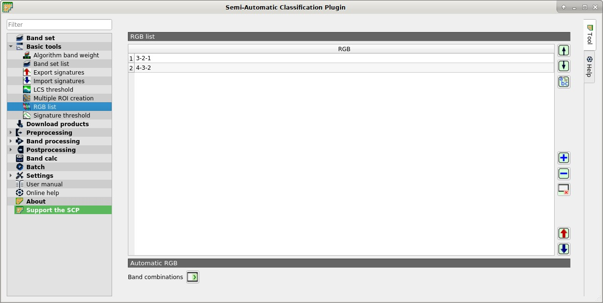
	
	|rgb_tool| :guilabel:`RGB list`
	
This tab allows for managing the RGB :ref:`color_composite_definition` used in the list :guilabel:`RGB=` of the :ref:`image_control`.

.. _RGB_list_table:

RGB list
^^^^^^^^^^^^^^^^^^^^^^^
		
* |input_table| :guilabel:`RGB list`: table containing the following fields;
	* :guilabel:`RGB`: RGB combination; this field can be manually edited;

* |move_up|: move highlighted RGB combination upward;
* |move_down|: move highlighted RGB combination downward;
* |order_by_name| : automatically sort RGB combinations by name;
* |add|: add a row to the table;
* |remove|: remove highlighted rows from the table;
* |reset|: clear all RGB combinations from :guilabel:`RGB list`;
* |export|: export the :guilabel:`RGB list` to a file (i.e. ``.csv``);
* |import|: import a previously saved :guilabel:`RGB list` from file (i.e. ``.csv``);

.. _automatic_RGB_list:

Automatic RGB
^^^^^^^^^^^^^^^^^^^^^^^
	
* :guilabel:`Band combinations` |enter|: add the combinations of all bands (i.e. permutation) to the :ref:`RGB_list_table` (e.g. 1-2-3, 1-2-4, ..., 3-2-1);

.. _Algorithm_band_weight_tab:

Algorithm band weight
-------------------------

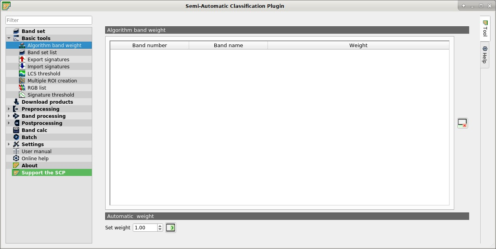
	
	|weight_tool| :guilabel:`Algorithm band weight`

This tab allows for the definition of band weights that are useful for improving the spectral separability of materials at certain wavelengths (bands).
During the classification process, band values and spectral signature values are multiplied by the corresponding band weights, thus modifying the spectral distances.
A tab is displayed for every :ref:`band_set_tab`.

.. _band_weight:

Band weight
^^^^^^^^^^^^^^^^^
		
* |input_table| :guilabel:`Band weight`: table containing the following fields;
	* :guilabel:`Band number` : number of the band in the :guilabel:`Band set`;
	* :guilabel:`Band name` : name of the band;
	* :guilabel:`Weight` : weight of the band; this value can be edited;

.. _automatic_weight:

Automatic weight
^^^^^^^^^^^^^^^^^
	
* |reset|: reset all band weights to 1;
* :guilabel:`Set weight` |input_number| |enter|: set the defined value as weight for all the highlighted bands in the table; 
	
.. _multiple_rois_tab:

Multiple ROI Creation 
--------------------------------------

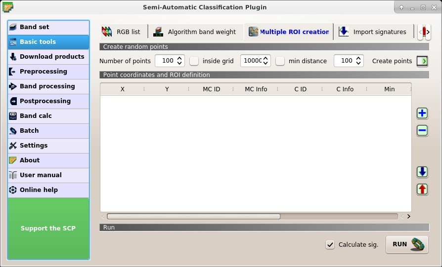
	
	|roi_multiple| :guilabel:`Multiple ROI Creation`

This tab allows for the automatic creation of ROIs, useful for the rapid classification of multi-temporal images, or for accuracy assessment.
Given a list of point coordinates and ROI options, this tool performs the region growing of ROIs.
Created ROIs are automatically saved to the :ref:`training_input`.
The :guilabel:`active band set` in :ref:`band_set_tab` is used for calculations.

.. _create_random_points:

Create random points
^^^^^^^^^^^^^^^^^^^^^^^^^^^^^^^^^^^^

* :guilabel:`Number of points` |input_number|: set a number of points that will be created when :guilabel:`Create points` |enter| is clicked;
* |checkbox| :guilabel:`inside grid` |input_number|: if checked, the :guilabel:`band set` area is divided in cells where the size thereof is defined in the combobox (image unit, usually meters); points defined in ``Number of random points`` are created randomly within each cell;
* |checkbox| :guilabel:`min distance` |input_number|: if checked, random points have a minimum distance defined in the combobox (image unit, usually meters); setting a minimum distance can result in fewer points than the number defined in :guilabel:`Number of points`;
* :guilabel:`Create points` |enter|: create random points inside the :guilabel:`band set` area;
* |checkbox| :guilabel:`stratified for the values` |input_text| of the first band of the band set :guilabel:`min distance` |input_number|: if checked, create random points inside the values defined in the expression calculated for the first band of the defined band set; the expression must include the variable ``raster`` ; multiple expressions can be entered separated by semicolon ( ; ) but the total number of stratified points is the same as the defined :guilabel:`Number of points`; 

.. _point_coordinates:

Point coordinates and ROI definition
^^^^^^^^^^^^^^^^^^^^^^^^^^^^^^^^^^^^^^^

* |input_table| :guilabel:`Point coordinates and ROI definition`: table containing the following fields;
	* :guilabel:`X` : point X coordinate (float);
	* :guilabel:`Y` : point Y coordinate (float);
	* :guilabel:`MC ID`: ROI Macroclass ID (int);
	* :guilabel:`MC Info`: ROI Macroclass information (text);
	* :guilabel:`C ID`: ROI Class ID (int);
	* :guilabel:`C Info`: ROI Class information (text);
	* :guilabel:`Min` : the minimum area of a ROI (in pixel unit);
	* :guilabel:`Max` : the maximum width of a ROI (in pixel unit);
	* :guilabel:`Dist` : the interval which defines the maximum spectral distance between the seed pixel and the surrounding pixels (in radiometry unit);
	* :guilabel:`Rapid ROI band` : if a band number is defined, ROI is created only using the selected band, similarly to :guilabel:`Rapid ROI band` in :ref:`ROI_list` ;

* |add|: add a new row to the table; all the table fields must be filled for the ROI creation;
* |remove|: delete the highlighted rows from the table;
* |import|: import a point list from text file or a point shapefile to the table; in case of text file, every line must contain values separated by tabs of ``X``, ``Y``, ``MC ID``, ``MC Info``, ``Class ID``, ``C Info``, ``Min``, ``Max``, ``Dist``, and optionally the ``Rapid ROI band``; in case of shapefile, only point coordinates are imported;
* |export|: export the point list to text file;

.. _run_tool_1:

Run
^^^^^^^^^^^^^^^^^^^^^^^^^^^^^^^^^^^^^^^

* |checkbox| :guilabel:`Calculate sig.`: if checked, the spectral signature is calculated while the ROI is saved to :ref:`training_input`;
* :guilabel:`RUN` |run|: start the ROI creation process for all the points and save ROIs to the :ref:`training_input`;

.. _import_signatures_tab:

Import signatures 
-----------------

The tab |import_spectral_library| :guilabel:`Import signatures` allows for importing spectral signatures from various sources.

.. _import_library_file_tab:

Import library file
^^^^^^^^^^^^^^^^^^^^^^^^^^^^^^^^

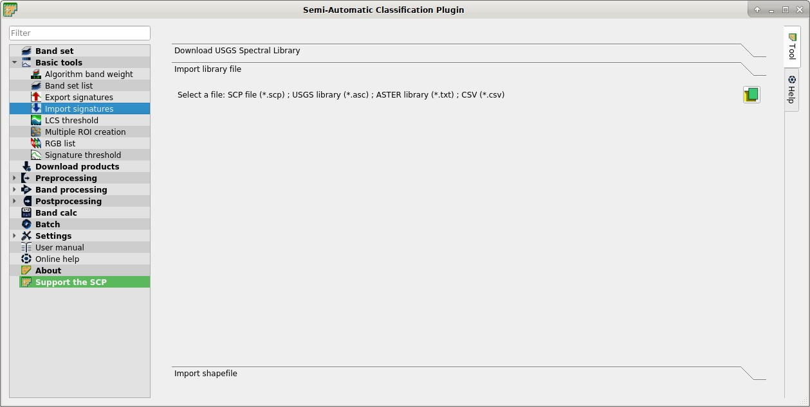
	
	:guilabel:`Import library file`

This tool allows for importing spectral signatures from various sources: a previously saved :ref:`training_input` (.scp file); a USGS Spectral Library (.asc file); a previously exported CSV file.
In case of USGS Spectral Library, the library is automatically sampled according to the image band wavelengths defined in the :ref:`band_set_tab`, and added to the :ref:`ROI_list`;
	
* :guilabel:`Select a file` |open_file|: open a file to be imported in the :ref:`training_input`;
	
.. _import_shapefile_tab:

Import shapefile
^^^^^^^^^^^^^^^^^^^^^^^^^^^^^^^^

.. figure:: _static/import_shapefile.jpg
	:align: center
	:width: 500pt
	
	:guilabel:`Import shapefile`

This tool allows for importing a shapefile, selecting the corresponding fields of the :ref:`training_input`.

* :guilabel:`Select a shapefile` |open_file|: open a shapefile; 
* :guilabel:`MC ID field` |input_list|: select the shapefile field corresponding to MC ID;
* :guilabel:`MC Info field` |input_list|: select the shapefile field corresponding to MC Info;
* :guilabel:`C ID field` |input_list|: select the shapefile field corresponding to C ID;
* :guilabel:`C Info field` |input_list|: select the shapefile field corresponding to C Info;
* |checkbox| :guilabel:`Calculate sig.`: if checked, the spectral signature is calculated while the ROI is saved to :ref:`training_input`;
* :guilabel:`Import shapefile` |enter|: import all the shapefile polygons as ROIs in the :ref:`training_input`;

.. _USGS_spec_library_tab:

Download USGS Spectral Library
^^^^^^^^^^^^^^^^^^^^^^^^^^^^^^^^

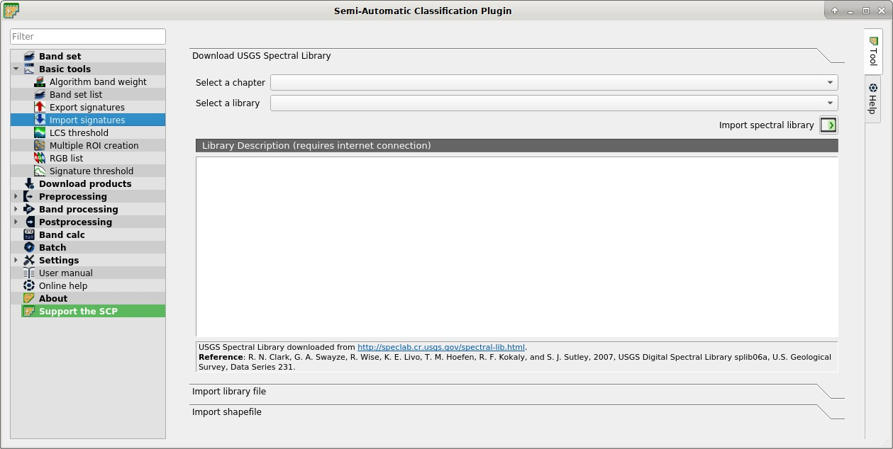
	
	:guilabel:`Download USGS Spectral Library`

The tab :guilabel:`Download USGS Spectral Library` allows for the download of the `USGS spectral library <http://speclab.cr.usgs.gov/spectral-lib.html>`_ (Clark, R.N., Swayze, G.A., Wise, R., Livo, E., Hoefen, T., Kokaly, R., Sutley, S.J., 2007, USGS digital spectral library splib06a: U.S. Geological Survey, Digital Data Series 231).

The libraries are grouped in chapters including Minerals, Mixtures, Coatings, Volatiles, Man-Made, Plants, Vegetation Communities, Mixtures with Vegetation, and Microorganisms.
An internet connection is required.

* :guilabel:`Select a chapter` |input_list|: select one of the library chapters; after the selection, chapter libraries are shown in :guilabel:`Select a library`;
* :guilabel:`Select a library` |input_list|: select one of the libraries; the library description is displayed in the frame :guilabel:`Library description`;
* :guilabel:`Import spectral library` |enter|: download the library and add the sampled spectral signature to the :ref:`ROI_list` using the parameters defined for class and macroclass; the library is automatically sampled according to the image band wavelengths defined in the :guilabel:`active band set` in :ref:`band_set_tab`, and added to the :ref:`ROI_list`;

	**Tip**: Spectral libraries downloaded from the ``USGS Spectral Library`` can be used with Minimum Distance or Spectral Angle Mapping algorithms, but not Maximum Likelihood because this algorithm needs the covariance matrix that is not included in the spectral libraries.
	
.. _export_signatures_tab:

Export signatures 
-----------------

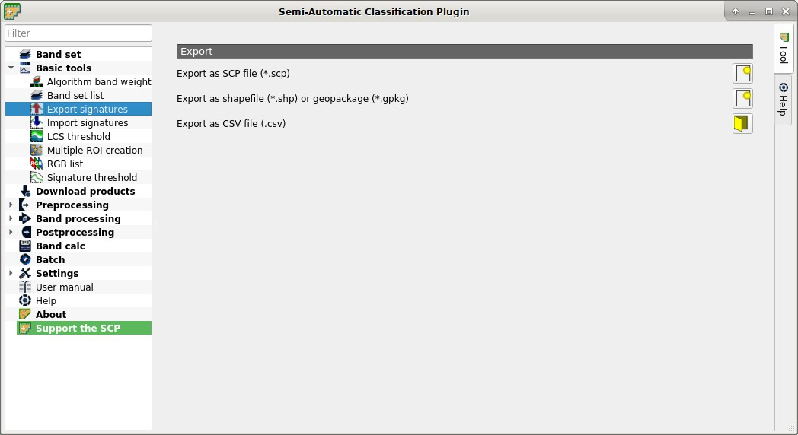
	
	|export_spectral_library| :guilabel:`Export signatures`

This tool allows for exporting the signatures highlighted in the :ref:`ROI_list`.

* :guilabel:`Export as SCP file` |new_file|: create a new .scp file and export highlighted ROIs and spectral signatures as :guilabel:`SCP` file (* .scp);
* :guilabel:`Export as shapefile` |new_file|: export highlighted ROIs (spectral signature data excluded) as a new shapefile (* .shp);
* :guilabel:`Export as CSV file` |open_dir|: open a directory, and export highlighted spectral signatures as individual CSV files (* .csv) separated by semicolon ( ; );
	
.. _Signature_threshold_tab:

Signature threshold
-------------------------

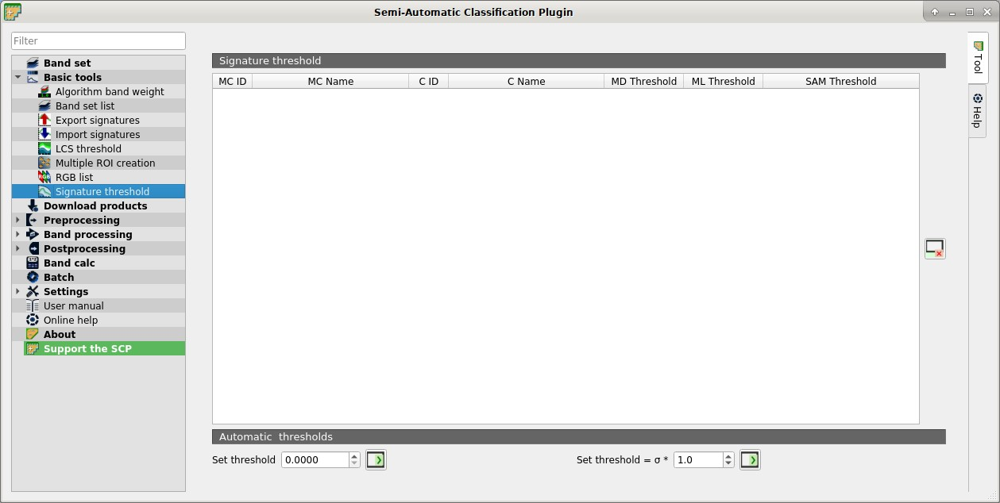
	
	|threshold_tool| :guilabel:`Signature threshold`

This tab allows for the definition of a classification threshold for each spectral signature.
All the signatures contained in the :ref:`training_input` are listed.
Thresholds defined in this tool are applied to classification only if :guilabel:`Threshold` value in :ref:`classification_alg` is 0.

This is useful for improving the classification results, especially when spectral signatures are similar.
Thresholds of signatures are saved in the :ref:`training_input`.

If threshold is 0 then no threshold is applied and all the image pixels are classified.
Depending on the selected :ref:`classification_alg` the threshold value is evaluated differently:

* for Minimum Distance, pixels are unclassified if distance is greater than threshold value;
* for Maximum Likelihood, pixels are unclassified if probability is less than threshold  value (max 100);
* for Spectral Angle Mapping, pixels are unclassified if spectral angle distance is greater than threshold value (max 90).
	
.. _signature_threshold:

Signature threshold
^^^^^^^^^^^^^^^^^^^^^^^
		
* |input_table| :guilabel:`Signature threshold`: table containing the following fields;
	* :guilabel:`MC ID`: signature Macroclass ID;
	* :guilabel:`MC Info`: signature Macroclass Information;
	* :guilabel:`C ID`: signature Class ID;
	* :guilabel:`C Info`: signature Class Information;
	* :guilabel:`MD Threshold`: Minimum Distance threshold; this value can be edited;
	* :guilabel:`ML Threshold`: Maximum Likelihood threshold; this value can be edited;
	* :guilabel:`SAM Threshold`: Spectral Angle Mapping threshold; this value can be edited;

* |reset|: reset all signatures thresholds to 0 (i.e. no threshold used);

.. _automatic_thresholds:

Automatic thresholds
^^^^^^^^^^^^^^^^^^^^^^^

* :guilabel:`Set threshold` |input_number| |enter|: set the defined value as threshold for all the highlighted signatures in the table;
* :guilabel:`Set threshold = σ *` |input_number| |enter|: for all the highlighted signatures, set an automatic threshold calculated as the distance (or angle) between mean signature and (mean signature + (σ * v)), where σ is the standard deviation and v is the defined value; currently works for Minimum Distance and Spectral Angle Mapping;

.. _LCS_threshold:

LCS threshold
-------------------------

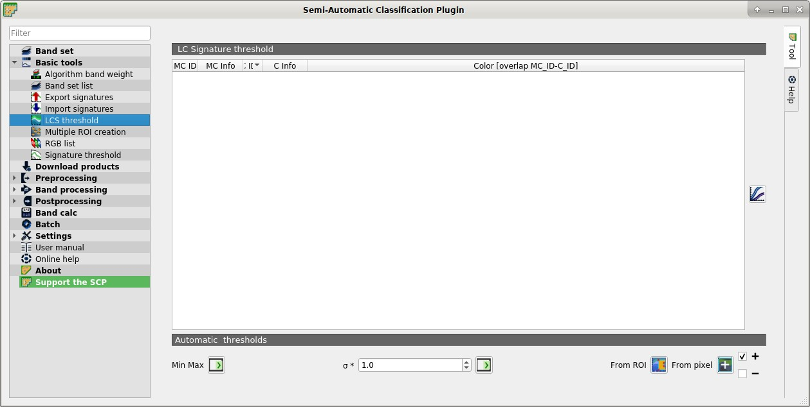
	
	|LCS_threshold| :guilabel:`LCS threshold`
	
This tab allows for setting the signature thresholds used by :ref:`LCS_algorithm`.
All the signatures contained in the :ref:`training_input` are listed; also, signature thresholds are saved in the :ref:`training_input`.

Overlapping signatures (belonging to different classes or macroclasses) are highlighted in orange in the table :guilabel:`LC Signature threshold`; the overlapping check is performed considering :guilabel:`MC ID` or :guilabel:`C ID` according to the setting :guilabel:`Use` |checkbox| :guilabel:`MC ID` |checkbox| :guilabel:`C ID` in :ref:`classification_alg`.
Overlapping signatures sharing the same :guilabel:`ID` are not highlighted.

.. _LC_signature_threshold:

LC Signature threshold
^^^^^^^^^^^^^^^^^^^^^^^
		
* |input_table| :guilabel:`LC Signature threshold`: table containing the following fields;
	* :guilabel:`MC ID`: signature Macroclass ID;
	* :guilabel:`MC Info`: signature Macroclass Information;
	* :guilabel:`C ID`: signature Class ID;
	* :guilabel:`C Info`: signature Class Information;
	* :guilabel:`Color [overlap MC_ID-C_ID]`: signature color; also, the combination :guilabel:`MC ID`-:guilabel:`C ID` is displayed in case of overlap with other signatures (see :ref:`LCS_algorithm`);
	* :guilabel:`Min B` ``X``: minimum value of band ``X``; this value can be edited;
	* :guilabel:`Max B` ``X``: maximum value of band ``X``; this value can be edited;

* |sign_plot|: show the ROI spectral signature in the :ref:`spectral_signature_plot`; spectral signature is calculated from the :ref:`band_set_tab`;

.. _LC_automatic_thresholds:

Automatic thresholds
^^^^^^^^^^^^^^^^^^^^^^^

Set thresholds automatically for highlighted signatures in the table :guilabel:`LC Signature threshold`; if no signature is highlighted, then the threshold is applied to all the signatures.

* :guilabel:`Min Max` |enter|: set the threshold based on the minimum and maximum of each band;
* :guilabel:`σ *` |input_number| |enter|: set an automatic threshold calculated as (band value + (σ * v)), where σ is the standard deviation of each band and v is the defined value;
* :guilabel:`From ROI` |LCS_threshold_ROI_tool|: set the threshold using the temporary ROI pixel values, according to the following checkboxes:
	* |checkbox| **+**: if checked, signature threshold is extended to include pixel signature;
	* |checkbox| **–**: if checked, signature threshold is reduced to exclude pixel signature;
* :guilabel:`From pixel` |LCS_threshold_set_tool|: set the threshold by clicking on a pixel, according to the following checkboxes:
	* |checkbox| **+**: if checked, signature threshold is extended to include pixel signature;
	* |checkbox| **–**: if checked, signature threshold is reduced to exclude pixel signature;

.. _download_tab:
 
Download products 
================================

The tab |download| :guilabel:`Download products` includes the tools for searching and downloading free remote sensing images.
Also, automatic conversion to reflectance of downloaded bands is available.
	
An internet connection is required and free registration could be required depending on the download service.

This tool allows for searching and downloading:

* :ref:`Landsat_definition` images (from 1 MSS to 8 OLI) acquired from the 80s to present days;
* :ref:`Sentinel2_definition` images (Level-1C and Level-2A) acquired from 2015 to present days;
* :ref:`Sentinel3_definition` images (OLCI  Level-1B OL_1_EFR) acquired from 2016 to present days;
* :ref:`ASTER_definition` images (Level 1T) acquired from 2000 to present days;
* :ref:`MODIS_definition` images (MOD09GQ, MYD09GQ, MOD09GA, MYD09GA, MOD09Q1, MYD09Q1, MOD09A1, MYD09A1) acquired from 2000 to present days;

For Landsat, ASTER, and MODIS the search is performed through the `CMR Search API <https://cmr.earthdata.nasa.gov/search/site/search_api_docs.html>`_ developed by NASA.
Landsat images are freely available through the services: `EarthExplorer <http://earthexplorer.usgs.gov/>`_ , `Google Earth Engine <https://earthengine.google.com/datasets/>`_ , and the `Amazon Web Services (AWS) <http://aws.amazon.com/public-data-sets/landsat/>`_ (only for Landsat 8).
The ASTER L1T and MODIS products are retrieved from the online Data Pool, courtesy of the NASA Land Processes Distributed Active Archive Center (LP DAAC), USGS/Earth Resources Observation and Science (EROS) Center, Sioux Falls, South Dakota, https://lpdaac.usgs.gov/data_access/data_pool.

For Sentinel-2 and Sentinel-3 the search is performed through the `Copernicus Open Access Hub <https://scihub.copernicus.eu/>`_ (using the `Data Hub API <https://scihub.copernicus.eu/userguide/5APIsAndBatchScripting>`_ ); images are mainly downloaded from the `Amazon S3 AWS <http://sentinel-pds.s3-website.eu-central-1.amazonaws.com>`_ if available.

This tool attempts to download images first from `Amazon Web Services` and `Google Earth Engine` ; only if images are not available, the download is performed through the services that require to login.

.. _login_data_tab:

Login data
----------------------------------------

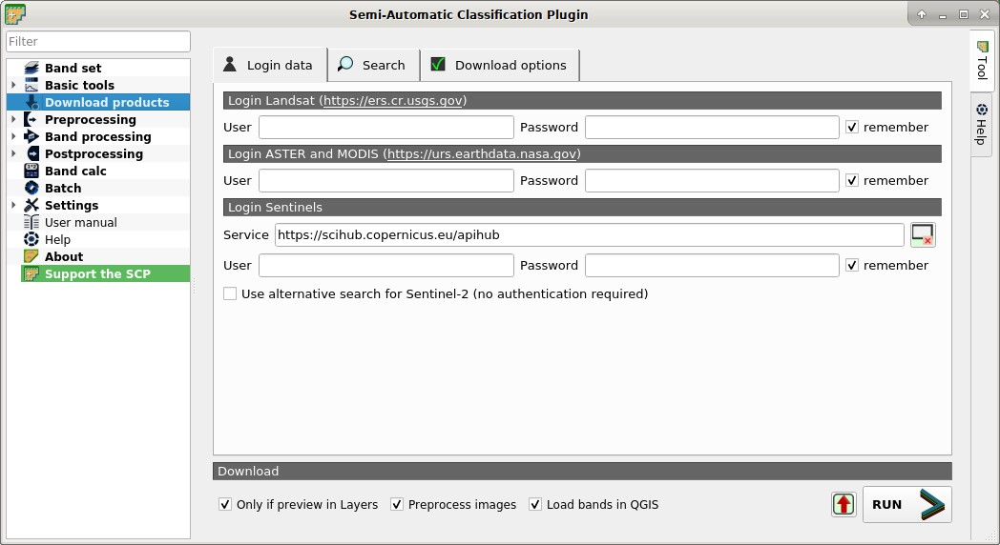
	
	|login_data| :guilabel:`Login data`

.. _login_usgs:

Login https://ers.cr.usgs.gov
^^^^^^^^^^^^^^^^^^^^^^^^^^^^^^^^^^^^^^^^^^^^^^^^^^^

For Landsat images `USGS EROS` credentials (https://ers.cr.usgs.gov) are required for downloads from `EarthExplorer <http://earthexplorer.usgs.gov/>`_ .
Login using your `USGS EROS` credentials or register for free at https://ers.cr.usgs.gov/register .

* :guilabel:`User` |input_text| |registry_save|: enter the user name;
* :guilabel:`Password` |input_text| |registry_save|: enter the password;
* |checkbox| :guilabel:`remember`: remember user name and password in QGIS;

.. _login_earthdata:

Login https://urs.earthdata.nasa.gov 
^^^^^^^^^^^^^^^^^^^^^^^^^^^^^^^^^^^^^^^^^^^^^^^^^^^
 
For ASTER and MODIS images `EOSDIS Earthdata` credentials (https://urs.earthdata.nasa.gov ) are required for download.
Login using your `EOSDIS Earthdata` credentials or register for free at https://urs.earthdata.nasa.gov/users/new .
Before downloading ASTER and MODIS images, you must approve LP DAAC Data Pool clicking the following link https://urs.earthdata.nasa.gov/approve_app?client_id=ijpRZvb9qeKCK5ctsn75Tg
	
* :guilabel:`User` |input_text| |registry_save|: enter the user name;
* :guilabel:`Password` |input_text| |registry_save|: enter the password;
* |checkbox| :guilabel:`remember`: remember user name and password in QGIS;

.. _login_Sentinel:

Login Sentinels
^^^^^^^^^^^^^^^^^^^^^^^^^^^^^^^^^^^^^^^^^^^^^^^^^^^

In order to access to Sentinel data a free registration is required at https://scihub.copernicus.eu/userguide/1SelfRegistration (other services may require different registrations).
After the registration, enter the user name and password for accessing data.
	
* :guilabel:`Service` |input_text| |registry_save|: enter the service URL (default is https://scihub.copernicus.eu/apihub); other mirror services that share the same infrastructure can be used (such as https://scihub.copernicus.eu/dhus , https://finhub.nsdc.fmi.fi , https://data.sentinel.zamg.ac.at);
* |reset|: reset the default service;
* :guilabel:`User` |input_text| |registry_save|: enter the user name;
* :guilabel:`Password` |input_text| |registry_save|: enter the password;
* |checkbox| :guilabel:`remember`: remember user name and password in QGIS;

.. _search_tab:

Search
----------------------------------------

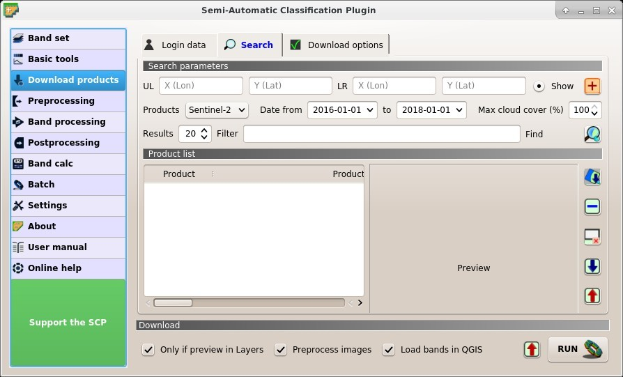
	
	|search_tab| :guilabel:`Search`

.. _search_parameters:

Search parameters
^^^^^^^^^^^^^^^^^
	
Define the search area by entering the coordinates (longitude and latitude) of an ``Upper Left`` (UL) point and ``Lower Right`` (LR) point and select a product to search.
Optional settings are date of acquisition, maximum cloud cover, number of results (the less the results, the faster is the query).

The definition of a search area is required before searching the images.

* :guilabel:`UL` |input_number| |input_number|: set the UL longitude X (Lon) and the UL latitude Y (Lat);
* :guilabel:`LR` |input_number| |input_number|: set the LR longitude X (Lon) and the LR latitude Y (Lat);
* |radiobutton| :guilabel:`Show`: show or hide the search area in the map;
* |pointer|: define a search area by left click to set the UL point and right click to set the LR point; the search area is displayed in the map;
* :guilabel:`Products` |input_list|: set the search product;
* :guilabel:`Date from` |input_date|: set the starting date of acquisition;
* :guilabel:`to` |input_date|: set the ending date of acquisition;
* :guilabel:`Max cloud cover (%)` |input_number|: maximum cloud cover in the product;
* :guilabel:`Results` |input_number|: maximum number of products returned by the search;
* :guilabel:`Filter` |input_text|: set a filter such as the Product ID (e.g. ``LC81910312015006LGN00``); it is possible to enter multiple Product IDs separated by comma or semicolon (e.g. ``LC81910312015006LGN00, LC81910312013224LGN00`` ); filter is applied to resulting products in the search area;
* :guilabel:`Find` |search_images|: find the products in the search area; results are displayed inside the table in :ref:`product_list`; results are added to previous results;
* |osm_add| Add OpenStreetMap to the map: this button allows for the display of OpenStreetMap tiles (© `OpenStreetMap <http://www.openstreetmap.org/copyright>`_ contributors) in the QGIS map as described in https://wiki.openstreetmap.org/wiki/QGIS . The cartography is licensed as CC BY-SA (`Tile Usage Policy <http://www.openstreetmap.org/copyright>`_ );

	**Tip**: Search results (and the number thereof) depend on the defined area extent and the range of dates. In order to get more results, perform multiple searches defining smaller area extent and narrow acquisition dates (from and to).
	
.. _product_list:

Product list
^^^^^^^^^^^^^^^^^

The table :guilabel:`Product list` contains the results of the search.
Click on any item (highlight) to display the image preview thereof.
Results are saved with the QGIS project.

* |input_table| :guilabel:`Product list` |project_save|: found products are displayed in this table, which includes the following fields;
	* :guilabel:`Product`: the product name;
	* :guilabel:`ProductID`: the product ID;
	* :guilabel:`AcquisitionDate`: date of acquisition of product;
	* :guilabel:`CloudCover`: percentage of cloud cover in the product;
	* :guilabel:`Zone/Path`: the zone or WRS path depending on the product type;
	* :guilabel:`Row/DayNightFlag`: the WRS row or acquisition flag(day or night) depending on the product type;
	* :guilabel:`min_lat`: minimum latitude of the product;
	* :guilabel:`min_lon`: minimum longitude of the product;
	* :guilabel:`max_lat`: maximum latitude of the product;
	* :guilabel:`max_lon`: maximum longitude of the product;
	* :guilabel:`Collection/Size`: collection code or size depending on the product type;
	* :guilabel:`Preview`: URL of the product preview;
	* :guilabel:`Collection/ID`: collection or image ID depending on the product type;
	* :guilabel:`Collection/Image`: collection or image ID depending on the product type;
	
* |image_preview|: display preview of highlighted images in the map; preview is roughly georeferenced on the fly;
* |remove|: remove highlighted images from the list;
* |reset|: remove all images from the list;
* |import|: import the product list from a text file (i.e. ``.txt``);
* |export|: export the product list to a text file (i.e. ``.txt``);

.. _download:

Download
^^^^^^^^^^^^^^^^^

Download the products in the :ref:`product_list`.
During the download it is recommended not to interact with QGIS.

* |checkbox| :guilabel:`Only if preview in Layers`: if checked, download only those images listed in :ref:`product_list` which are also listed in the QGIS layer panel;
* |checkbox| :guilabel:`Preprocess images`: if checked, bands are automatically converted after the download, according to the settings defined in :ref:`landsat_tab`;
* |checkbox| :guilabel:`Load bands in QGIS`: if checked, bands are loaded in QGIS after the download;
* |export|: export the download links to a text file;
* :guilabel:`RUN` |run|: start the download process of all the products listed in :ref:`product_list`;

.. _download_options:

Download options
----------------------------------------

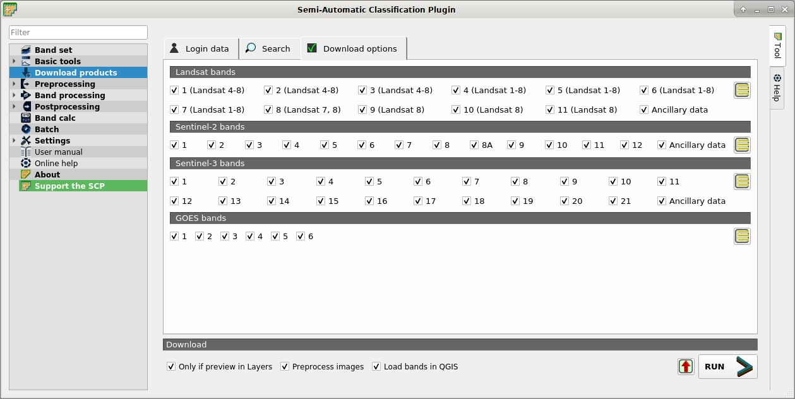
	
	|download_options_tab| :guilabel:`Download options`
		
This tab allows for the selection of single bands for Landsat, Sentinel-2, and Sentinel-3 images.
Depending on the download service, single band download could be unavailable.

* |checkbox| :guilabel:`Band` ``X``: select bands for download;
* |checkbox| :guilabel:`Ancillary data`: if checked, the metadata files are selected for download;
* |select_all|: select or deselect all bands;

.. _pre_processing_tab:
 
Preprocessing
==================

The tab |preprocessing| :guilabel:`Preprocessing` provides several tools for data manipulation which are useful before the actual classification process.

.. _landsat_tab:
 
Landsat
-----------

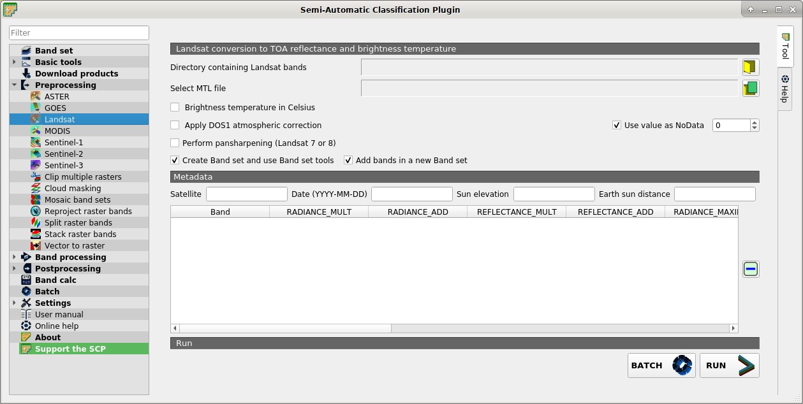
	
	|landsat_tool| :guilabel:`Landsat`
	
This tab allows for the conversion of **Landsat 1, 2, and 3 MSS** and **Landsat 4, 5, 7, and 8** images from DN (i.e. Digital Numbers) to the physical measure of Top Of Atmosphere reflectance (TOA), or the application of a simple atmospheric correction using the DOS1 method (Dark Object Subtraction 1), which is an image-based technique (for more information about the Landsat conversion to TOA and DOS1 correction, see :ref:`conversion_to_reflectance`).
Pan-sharpening is also available; for more information read :ref:`pan_sharpening_definition`.

Once the input is selected, available bands are listed in the metadata table.

	**WARNING**: For the best spectral precision you should download the Landsat Level-2 Data Products (Surface Reflectance) from https://earthexplorer.usgs.gov .

.. _landsat_conversion:

Landsat conversion to TOA reflectance and brightness temperature
^^^^^^^^^^^^^^^^^^^^^^^^^^^^^^^^^^^^^^^^^^^^^^^^^^^^^^^^^^^^^^^^

* :guilabel:`Directory containing Landsat bands` |open_dir|: open a directory containing Landsat bands; names of Landsat bands must end with the corresponding number; if the metadata file is included in this directory then :ref:`landsat_metadata` are automatically filled;
* :guilabel:`Select MTL file` |open_file| |optional|: if the metadata file is not included in the :guilabel:`Directory containing Landsat bands`, select the path of the metadata file in order to fill the :ref:`landsat_metadata` automatically;
* |checkbox| :guilabel:`Brightness temperature in Celsius`: if checked, convert brightness temperature to Celsius (if a Landsat thermal band is listed in :ref:`landsat_metadata`); if unchecked temperature is in Kelvin;
* |checkbox| :guilabel:`Apply DOS1 atmospheric correction`: if checked, the :ref:`DOS1_correction` is applied to all the bands (thermal bands excluded);
* |checkbox| :guilabel:`only to blue and green bands`: if checked (with :guilabel:`Apply DOS1 atmospheric correction` also checked), the :ref:`DOS1_correction` is applied only to blue and green bands;
* |checkbox| :guilabel:`Use NoData value (image has black border)` |input_number|: if checked, pixels having ``NoData`` value are not counted during conversion and the DOS1 calculation of DNmin; it is useful when image has a black border (usually pixel value = 0);
* |checkbox| :guilabel:`Perform pan-sharpening`: if checked, a Brovey Transform is applied for the :ref:`pan_sharpening_definition` of Landsat bands;
* |checkbox| :guilabel:`Create Band set and use Band set tools`: if checked, the :guilabel:`Band set` is created after the conversion; also, the :guilabel:`Band set` is processed according to the tools checked in the :ref:`band_set_tab`;

.. _landsat_metadata:

Metadata
^^^^^^^^^^^^^^^^^

All the bands found in the :guilabel:`Directory containing Landsat bands` are listed in the table :guilabel:`Metadata`.
If the Landsat metadata file (a .txt or .met file with the suffix MTL) is provided, then :guilabel:`Metadata` are automatically filled.
For information about :guilabel:`Metadata` fields read `this page <http://landsat.usgs.gov/Landsat8_Using_Product.php>`_  and `this one <http://landsat.usgs.gov/how_is_radiance_calculated.php>`_ .

* :guilabel:`Satellite` |input_text|: satellite name (e.g. Landsat8);
* :guilabel:`Date` |input_text|: date acquired (e.g. 2013-04-15);
* :guilabel:`Sun elevation` |input_number|: Sun elevation in degrees;
* :guilabel:`Earth sun distance` |input_number|: Earth Sun distance in astronomical units (automatically calculated if :guilabel:`Date` is filled;
* |remove|: remove highlighted bands from the table :guilabel:`Metadata`;

* |input_table| :guilabel:`Metadata`: table containing the following fields;
	* :guilabel:`Band`: band name;
	* :guilabel:`RADIANCE_MULT`: multiplicative rescaling factor;
	* :guilabel:`RADIANCE_ADD`: additive rescaling factor;
	* :guilabel:`REFLECTANCE_MULT`: multiplicative rescaling factor;
	* :guilabel:`REFLECTANCE_ADD`: additive rescaling factor;
	* :guilabel:`RADIANCE_MAXIMUM`: radiance maximum;
	* :guilabel:`REFLECTANCE_MAXIMUM`: reflectance maximum;
	* :guilabel:`K1_CONSTANT`: thermal conversion constant;
	* :guilabel:`K2_CONSTANT`: thermal conversion constant;
	* :guilabel:`LMAX`: spectral radiance that is scaled to QCALMAX;
	* :guilabel:`LMIN`: spectral radiance that is scaled to QCALMIN;
	* :guilabel:`QCALMAX`: minimum quantized calibrated pixel value;
	* :guilabel:`QCALMIN`: maximum quantized calibrated pixel value;

.. _run_tool_2:

Run
^^^^^^^^^^^^^^^^^^^^^^^^^^^^^^^^^^^^^^^

* :guilabel:`RUN` |run|: select an output directory and start the conversion process; only bands listed in the table :guilabel:`Metadata` are converted; converted bands are saved in the output directory with the prefix ``RT_`` and automatically loaded in QGIS;

.. _sentinel2_tab:
 
Sentinel-2
-----------

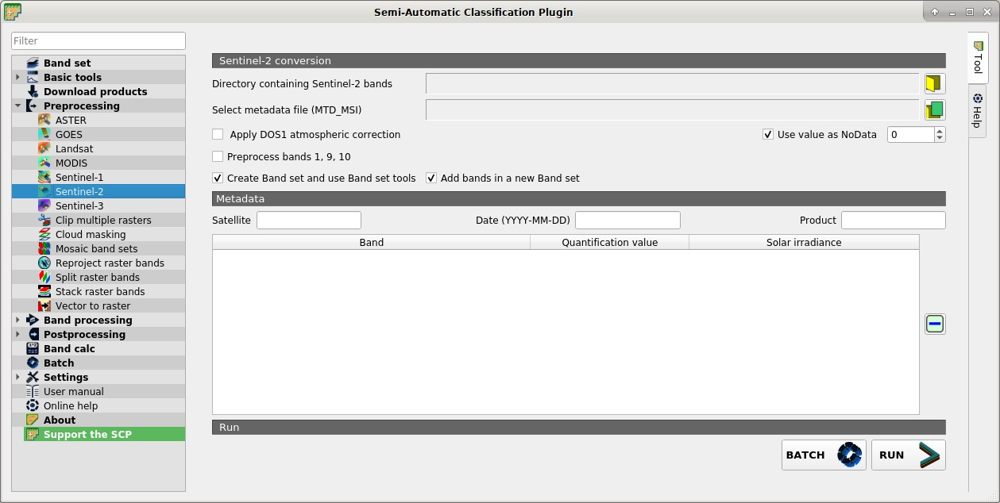
	
	|sentinel2_tool|  :guilabel:`Sentinel-2`
	
This tab allows for the conversion of **Sentinel-2** images Level-1C to the physical measure of Top Of Atmosphere reflectance (TOA), or the application of a simple atmospheric correction using the DOS1 method (Dark Object Subtraction 1), which is an image-based technique (for more information about conversion to TOA and DOS1 correction, see :ref:`conversion_to_reflectance`).
This tool can also convert **Sentinel-2** images Level-2A from DN to reflectance values.

Once the input is selected, available bands are listed in the metadata table.
Bands with 20m spatial resolution are resampled to 10m resolution without changing the original pixel value (i.e. one 20m pixel is divided in four 10m pixels with the same value).

	**WARNING**: For the best spectral precision you should download the Sentinel-2 Level-2A Products (Surface Reflectance) or use the official SNAP tool for atmospheric correction (see http://step.esa.int).

.. _sentinel2_conversion:

Sentinel-2 conversion
^^^^^^^^^^^^^^^^^^^^^^^^^^^^^^^^^^^^^^^^^^^^^^^^^^^^^^^^^^^^^^^^

* :guilabel:`Directory containing Sentinel-2 bands` |open_dir|: open a directory containing Sentinel-2 bands; names of Sentinel-2 bands must end with the corresponding number; if the metadata file is included in this directory then :ref:`sentinel2_metadata` are automatically filled;
* :guilabel:`Select metadata file` |open_file| |optional|: select the metadata file which is a .xml file whose name contains ``MTD_MSIL1C``);
* |checkbox| :guilabel:`Apply DOS1 atmospheric correction`: if checked, the :ref:`DOS1_correction` is applied to all the bands;
* |checkbox| :guilabel:`only to blue and green bands`: if checked (with :guilabel:`Apply DOS1 atmospheric correction` also checked), the :ref:`DOS1_correction` is applied only to blue and green bands;
* |checkbox| :guilabel:`Use NoData value (image has black border)` |input_number|: if checked, pixels having ``NoData`` value are not counted during conversion and the DOS1 calculation of DNmin; it is useful when image has a black border (usually pixel value = 0);
* |checkbox| :guilabel:`Create Band set and use Band set tools`: if checked, the active :guilabel:`Band set` is created after the conversion; also, the :guilabel:`Band set` is processed according to the tools checked in the :ref:`band_set_tab`;
* |checkbox| :guilabel:`Add bands in a new Band set`: if checked, bands are added to a new empty :guilabel:`Band set`;

.. _sentinel2_metadata:

Metadata
^^^^^^^^^^^^^^^^^

All the bands found in the :guilabel:`Directory containing Sentinel-2 bands` are listed in the table :guilabel:`Metadata`.
If the Sentinel-2 metadata file (a .xml file whose name contains ``MTD_MSIL1C``) is provided, then :guilabel:`Metadata` are automatically filled.
For information about :guilabel:`Metadata` fields read `this informative page <https://sentinel.esa.int/web/sentinel/user-guides/sentinel-2-msi/data-formats>`_ .

* :guilabel:`Satellite` |input_text|: satellite name (e.g. Sentinel-2A);
* |remove|: remove highlighted bands from the table :guilabel:`Metadata`;

* |input_table| :guilabel:`Metadata`: table containing the following fields;
	* :guilabel:`Band`: band name;
	* :guilabel:`Quantification value`: value for conversion to TOA reflectance;
	* :guilabel:`Solar irradiance`: solar irradiance of band;

.. _run_tool_3:

Run
^^^^^^^^^^^^^^^^^^^^^^^^^^^^^^^^^^^^^^^

* :guilabel:`RUN` |run|: select an output directory and start the conversion process; only bands listed in the table :guilabel:`Metadata` are converted; converted bands are saved in the output directory with the prefix ``RT_`` and automatically loaded in QGIS;
	
.. _sentinel3_tab:
 
Sentinel-3
-----------

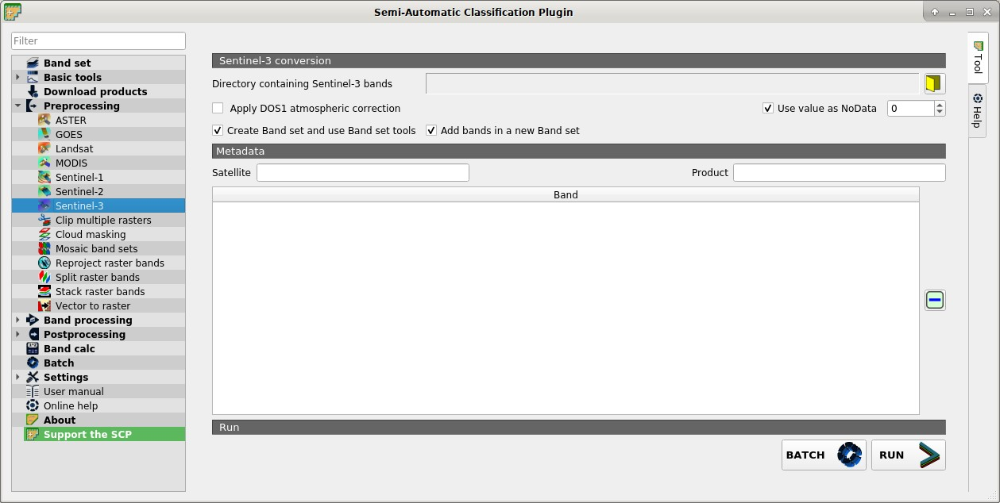
	
	|sentinel3_tool|  :guilabel:`Sentinel-3`
	
This tab allows for the conversion of **Sentinel-3** images (OL_1_EFR) to the physical measure of Top Of Atmosphere reflectance (TOA), or the application of a simple atmospheric correction using the DOS1 method (Dark Object Subtraction 1), which is an image-based technique (for more information about conversion to TOA and DOS1 correction, see :ref:`conversion_to_reflectance`).
The following ancillary data are required for conversion: ``instrument_data.nc`` , ``geo_coordinates.nc`` , ``tie_geometries.nc`` .

Once the input is selected, available bands are listed in the metadata table.

	**WARNING**: Sentinel-3 bands are reprojected to WGS 84 coordinate system using a sample of pixels from the file geo_coordinates.nc . For the best precision you should use the official SNAP tool (see http://step.esa.int).
	
.. _sentinel3_conversion:

Sentinel-3 conversion
^^^^^^^^^^^^^^^^^^^^^^^^^^^^^^^^^^^^^^^^^^^^^^^^^^^^^^^^^^^^^^^^

* :guilabel:`Directory containing Sentinel-3 bands` |open_dir|: open a directory containing Sentinel-3 bands; names of Sentinel-2 bands must end with the corresponding number; ancillary data required for conversion must be in the same directory;
* |checkbox| :guilabel:`Apply DOS1 atmospheric correction`: if checked, the :ref:`DOS1_correction` is applied to all the bands;
* |checkbox| :guilabel:`only to blue and green bands`: if checked (with :guilabel:`Apply DOS1 atmospheric correction` also checked), the :ref:`DOS1_correction` is applied only to blue and green bands;
* |checkbox| :guilabel:`Use NoData value (image has black border)` |input_number|: if checked, pixels having ``NoData`` value are not counted during conversion and the DOS1 calculation of DNmin; it is useful when image has a black border (usually pixel value = 0);
* |checkbox| :guilabel:`Create Band set and use Band set tools`: if checked, the :guilabel:`Band set` is created after the conversion; also, the :guilabel:`Band set` is processed according to the tools checked in the :ref:`band_set_tab`;

.. _sentinel3_metadata:

Metadata
^^^^^^^^^^^^^^^^^

All the bands found in the :guilabel:`Directory containing Sentinel-3 bands` are listed in the table :guilabel:`Metadata`.

* :guilabel:`Satellite` |input_text|: satellite name (e.g. Sentinel-3A);
* :guilabel:`Product` |input_text|: product name (e.g. OLCI);
* |remove|: remove highlighted bands from the table :guilabel:`Metadata`;

* |input_table| :guilabel:`Metadata`: table containing the following fields;
	* :guilabel:`Band`: band name;

.. _run_tool_S3:

Run
^^^^^^^^^^^^^^^^^^^^^^^^^^^^^^^^^^^^^^^

* :guilabel:`RUN` |run|: select an output directory and start the conversion process; only bands listed in the table :guilabel:`Metadata` are converted; converted bands are saved in the output directory with the prefix ``RT_`` and automatically loaded in QGIS;
	
.. _aster_tab:
 
ASTER
-----------

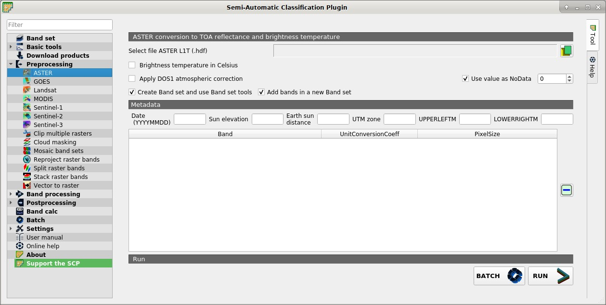
	
	|aster_tool|  :guilabel:`ASTER`
	
This tab allows for the conversion of **ASTER L1T** images to the physical measure of Top Of Atmosphere reflectance (TOA), or the application of a simple atmospheric correction using the DOS1 method (Dark Object Subtraction 1), which is an image-based technique (for more information about conversion to TOA and DOS1 correction, see :ref:`conversion_to_reflectance`).

Once the input is selected, available bands are listed in the metadata table.

.. _aster_conversion:

ASTER conversion
^^^^^^^^^^^^^^^^^^^^^^^^^^^^^^^^^^^^^^^^^^^^^^^^^^^^^^^^^^^^^^^^

* :guilabel:`Select file ASTER L1T` |open_file|: select an ASTER image (file .hdf);
* |checkbox| :guilabel:`Apply DOS1 atmospheric correction`: if checked, the :ref:`DOS1_correction` is applied to all the bands;
* |checkbox| :guilabel:`only to green band`: if checked (with :guilabel:`Apply DOS1 atmospheric correction` also checked), the :ref:`DOS1_correction` is applied only to green band;
* |checkbox| :guilabel:`Use NoData value (image has black border)` |input_number|: if checked, pixels having ``NoData`` value are not counted during conversion and the DOS1 calculation of DNmin; it is useful when image has a black border (usually pixel value = 0);
* |checkbox| :guilabel:`Create Band set and use Band set tools`: if checked, the :guilabel:`Band set` is created after the conversion; also, the :guilabel:`Band set` is processed according to the tools checked in the :ref:`band_set_tab`;

.. _aster_metadata:

Metadata
^^^^^^^^^^^^^^^^^

All the bands found in the :guilabel:`Select file ASTER L1T` are listed in the table :guilabel:`Metadata`.
For information about :guilabel:`Metadata` fields visit `the ASTER page <https://lpdaac.usgs.gov/dataset_discovery/aster>`_ .

* :guilabel:`Date` |input_text|: date acquired (e.g. 20130415);
* :guilabel:`Sun elevation` |input_number|: Sun elevation in degrees;
* :guilabel:`Earth sun distance` |input_number|: Earth Sun distance in astronomical units (automatically calculated if :guilabel:`Date` is filled;
* :guilabel:`UTM zone` |input_text|: UTM zone code of the image;
* :guilabel:`UPPERLEFTM` |input_text|: coordinates of the upper left corner of the image;
* |remove|: remove highlighted bands from the table :guilabel:`Metadata`;

* |input_table| :guilabel:`Metadata`: table containing the following fields;
	* :guilabel:`Band`: band name;
	* :guilabel:`UnitConversionCoeff`: value for radiance conversion;
	* :guilabel:`PixelSize`: solar irradiance of band;

.. _run_tool_4:

Run
^^^^^^^^^^^^^^^^^^^^^^^^^^^^^^^^^^^^^^^

* :guilabel:`RUN` |run|: select an output directory and start the conversion process; only bands listed in the table :guilabel:`Metadata` are converted; converted bands are saved in the output directory with the prefix ``RT_`` and automatically loaded in QGIS;
	
.. _modis_tab:
 
MODIS
-----------

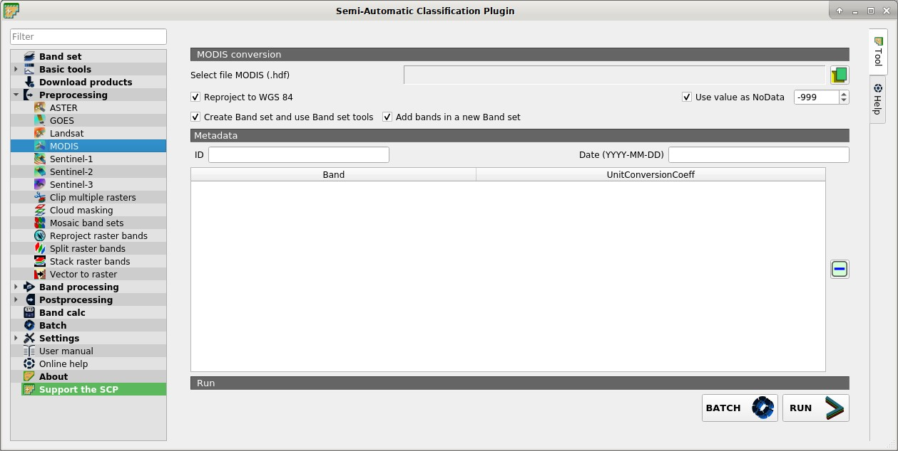
	
	|modis_tool|  :guilabel:`MODIS`
	
This tab allows for the conversion of **MODIS** images to .tif format, and the reprojection to WGS 84.

Once the input is selected, available bands are listed in the metadata table.

.. _modis_conversion:

MODIS conversion
^^^^^^^^^^^^^^^^^^^^^^^^^^^^^^^^^^^^^^^^^^^^^^^^^^^^^^^^^^^^^^^^

* :guilabel:`Select file MODIS` |open_file|: select a MODIS image (file .hdf);
* |checkbox| :guilabel:`Reproject to WGS 84`: if checked, reproject bands to WGS 84, required for use in :guilabel:`SCP`;
* |checkbox| :guilabel:`Use NoData value (image has black border)` |input_number|: if checked, pixels having ``NoData`` value are not counted during conversion and the DOS1 calculation of DNmin; it is useful when image has a black border (usually pixel value = 0);
* |checkbox| :guilabel:`Create Band set and use Band set tools`: if checked, the :guilabel:`Band set` is created after the conversion; also, the :guilabel:`Band set` is processed according to the tools checked in the :ref:`band_set_tab`;

.. _modis_metadata:

Metadata
^^^^^^^^^^^^^^^^^

All the bands found in the :guilabel:`Select file MODIS` are listed in the table :guilabel:`Metadata`.
For information about :guilabel:`Metadata` fields visit `the MODIS page <https://lpdaac.usgs.gov/dataset_discovery/modis>`_ .

* :guilabel:`ID` |input_text|: ID of the image;
* |remove|: remove highlighted bands from the table :guilabel:`Metadata`;

* |input_table| :guilabel:`Metadata`: table containing the following fields;
	* :guilabel:`Band`: band name;
	* :guilabel:`UnitConversionCoeff`: value for conversion;

.. _run_tool_4_2:

Run
^^^^^^^^^^^^^^^^^^^^^^^^^^^^^^^^^^^^^^^

* :guilabel:`RUN` |run|: select an output directory and start the conversion process; only bands listed in the table :guilabel:`Metadata` are converted; converted bands are saved in the output directory with the prefix ``RT_`` and automatically loaded in QGIS;
	
.. _vector_to_raster_tab:

Vector to raster
-------------------------

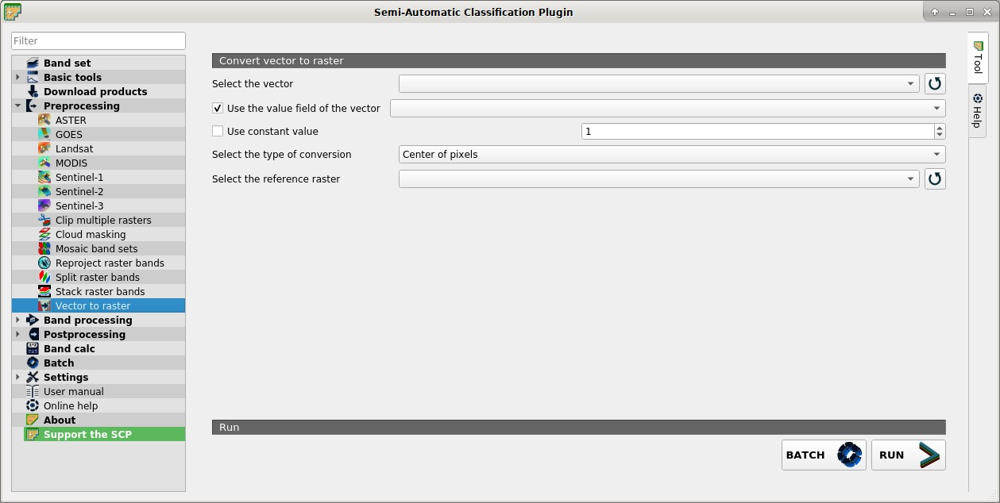
	
	|vector_to_raster_tool| :guilabel:`Vector to raster`

This tab allows for the conversion of a vector to raster format.

* :guilabel:`Select the vector` |input_list|: select a vector already loaded in QGIS;
* |reload|: refresh layer list;
* |checkbox| :guilabel:`Use the value field of the vector` |input_list|: if checked, the selected field is used as attribute for the conversion; pixels of the output raster have the same values as the vector attribute;
* |checkbox| :guilabel:`Use constant value` |input_number|: if checked, the polygons are converted to raster using the selected constant value;
* :guilabel:`Select the type of conversion` |input_list|: select the type of conversion between :guilabel:`Center of pixels` and :guilabel:`All pixels touched`:
	* :guilabel:`Center of pixels`: during the conversion, vector is compared to the reference raster; output raster pixels are attributed to a polygon if pixel center is within that polygon;
	* :guilabel:`All pixels touched`: during the conversion, vector is compared to the reference raster; output raster pixels are attributed to a polygon if pixel touches that polygon;
* :guilabel:`Select the reference raster` |input_list|: select a reference raster; pixels of the output raster have the same size and alignment as the reference raster;
* |reload|: refresh layer list;

.. _run_tool_8:

Run
^^^^^^^^^^^^^^^^^^^^^^^^^^^^^^^^^^^^^^^

* :guilabel:`RUN` |run|: choose the output destination and start the conversion to raster;

.. _clip_multiple_rasters_tab:

Clip multiple rasters
-------------------------

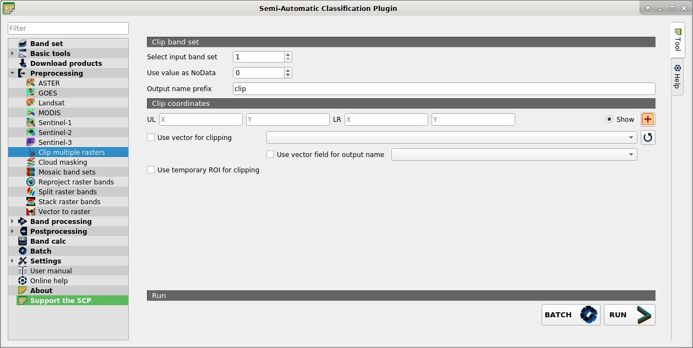
	
	|clip_tool| :guilabel:`Clip multiple rasters`

This tab allows for cutting several image bands at once, using a rectangle defined with point coordinates or a boundary defined with a vector.

.. _raster_list:

Raster list
^^^^^^^^^^^

* |reload|: refresh layer list;
* |select_all|: select all the rasters;

.. _clip_coordinates:

Clip coordinates
^^^^^^^^^^^^^^^^

Set the Upper Left (UL) and Lower Right (LR) point coordinates of the rectangle used for clipping; it is possible to enter the coordinates manually.
Alternatively use a vector.

* :guilabel:`UL X` |input_number|: set the UL X coordinate;
* :guilabel:`UL Y` |input_number|: set the UL Y coordinate;
* :guilabel:`LR X` |input_number|: set the LR X coordinate;
* :guilabel:`LR Y` |input_number|: set the LR Y coordinate;
* |radiobutton| :guilabel:`Show`: show or hide the clip area drawn in the map;
* |pointer|: define a clip area by drawing a rectangle in the map; left click to set the UL point and right click to set the LR point; the area is displayed in the map;
* |checkbox| :guilabel:`Use vector for clipping` |input_list|: if checked, use the selected vector (already loaded in QGIS) for clipping; UL and LR coordinates are ignored;
* |checkbox| :guilabel:`Use vector field for output name` |input_list|: if checked, a vector field is selected for clipping while iterating through each vector polygon and the corresponding field value is added to the output name;
* |checkbox| :guilabel:`Use temporary ROI for clipping`: if checked, use a temporary ROI (see :ref:`ROI_list`) for clipping; UL and LR coordinates are ignored;
* |reload|: refresh layer list;
* |checkbox| :guilabel:`NoData value` |input_number|: if checked, set the value for ``NoData`` pixels (e.g. pixels outside the clipped area);
* :guilabel:`Output name prefix` |input_text|: set the prefix for output file names (default is ``clip``);

.. _run_tool_5:

Run
^^^^^^^^^^^^^^^^^^^^^^^^^^^^^^^^^^^^^^^

* :guilabel:`RUN` |run|: choose an output destination and clip selected rasters; only rasters selected in the :ref:`raster_list` are clipped and automatically loaded in QGIS;

.. _split_raster_tab:

Split raster bands
-------------------------

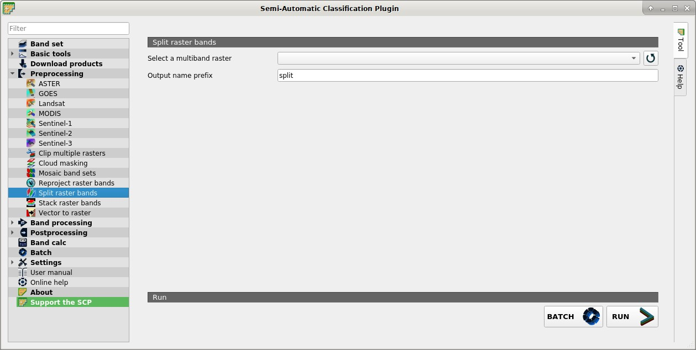
	
	|split_raster| :guilabel:`Split raster bands`

Split a multiband raster to single bands.

.. _raster_input:

Raster input
^^^^^^^^^^^^^^^^

* :guilabel:`Select a multiband raster` |input_list|: select a multiband raster already loaded in QGIS;
* |reload|: refresh layer list;
* :guilabel:`Output name prefix` |input_text|: set the prefix for output file names (default is ``split``);

.. _run_tool_6:

Run
^^^^^^^^^^^^^^^^^^^^^^^^^^^^^^^^^^^^^^^

* :guilabel:`RUN` |run|: choose the output destination and split selected raster; output bands are automatically loaded in QGIS;

.. _stack_raster_tab:

Stack raster bands
-------------------------

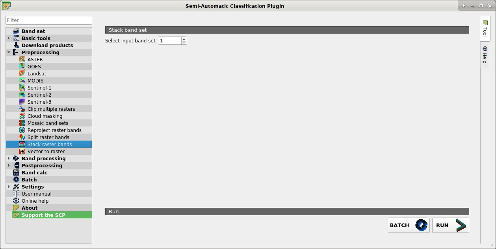
	
	|stack_raster| :guilabel:`Stack raster bands`

Stack raster bands into a single file.

.. _raster_list_stack:

Raster list
^^^^^^^^^^^

* |reload|: refresh layer list;
* |select_all|: select all the rasters;

.. _run_tool_6_1:

Run
^^^^^^^^^^^^^^^^^^^^^^^^^^^^^^^^^^^^^^^

* :guilabel:`RUN` |run|: choose the output destination and stack selected rasters; output is automatically loaded in QGIS;

.. _mosaic_bandsets_tab:

Mosaic band sets
-------------------------

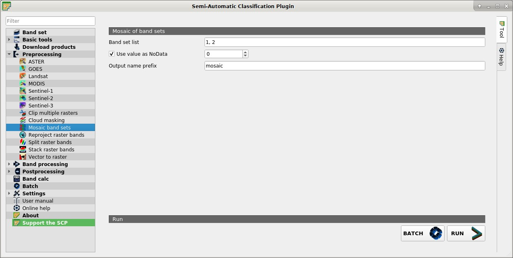
	
	|mosaic_tool| :guilabel:`Mosaic band sets`

This tool allows for the mosaic of band sets, merging the corresponding bands of two or more band sets defined in the :ref:`band_set_tab`. 
An output band is created for every corresponding set of bands in the band sets.

``NoData`` values of one band set are replaced by the values of the other band sets.

.. _mosaic_of_bandsets:

Mosaic of band sets
^^^^^^^^^^^^^^^^^^^^^^

* :guilabel:`Band set list` |input_text|: list if band sets defined in the :ref:`band_set_tab`; in case of overlapping images, the pixel values of the first band set in the list are assigned. 
* |checkbox| :guilabel:`Use NoData value` |input_number|: if checked, set the value of ``NoData`` pixels, ignored during the calculation;
* :guilabel:`Output name prefix` |input_text|: set the prefix for output file names (default is ``mosaic``);

.. _run_tool_6_2:

Run
^^^^^^^^^^^^^^^^^^^^^^^^^^^^^^^^^^^^^^^

* :guilabel:`RUN` |run|: select an output directory and start the mosaic process;

.. _cloud_masking_tab:

Cloud masking
-------------------------

.. figure:: _static/cloud_masking_tab.jpg
	:align: center
	:width: 500pt
	
	|cloud_masking_tool| :guilabel:`Cloud masking`

This tool allows for cloud masking, based on the values of a raster mask, creating an output masked band for each band of the :ref:`band_set_tab`.
``NoData`` is set in all the bands of the :ref:`band_set_tab` for pixels corresponding to clouds.

.. _mask_of_bandsets:

Mask of band set
^^^^^^^^^^^^^^^^^^^^^^

* :guilabel:`Select input band set` |input_number|: select the input :ref:`band_set_tab` to be masked;
* :guilabel:`Select the classification` |input_list|: select a classification raster (already loaded in QGIS) which contains a cloud class;
* |reload|: refresh layer list;
* :guilabel:`Mask class values` |input_text|: set the class values to be masked; class values must be separated by ``,`` and ``-`` can be used to define a range of values (e.g. ``1, 3-5, 8`` will select classes 1, 3, 4, 5, 8); if the text is red then the expression contains errors;
* |checkbox| :guilabel:`Use buffer of pixel size` |input_number|: if checked, a buffer is created for masked area, corresponding to the defined number of pixels; this can be useful to dilate masked area in case the mask doesn't cover the thinner border of clouds;
* :guilabel:`NoData value`: set the value of ``NoData`` pixels, corresponding to clouds;
* :guilabel:`Output name prefix` |input_text|: set the prefix for output file names (default is ``mask``);

.. _run_tool_6_3:

Run
^^^^^^^^^^^^^^^^^^^^^^^^^^^^^^^^^^^^^^^

* :guilabel:`RUN` |run|: select an output directory and start the mask process;

.. _band_processing_tab:
 
Band processing
===================

The tab |band_processing| :guilabel:`Band processing` provides several functions that can be applied to the :ref:`band_set_tab`.

.. _band_combination_tab:

Band combination
-------------------------

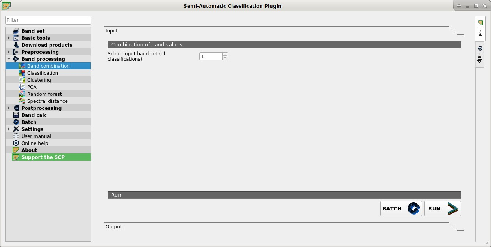
	
	|band_combination| :guilabel:`Band combination`

This tab allows for the combination of bands loaded in a :ref:`band_set_tab`.
This tool is intended for combining classifications in order to get a raster where each value corresponds to a combination of class values.
A combination raster is produced as output and the area of each combination is reported in an text file. 

.. _band_combination_input:

Combination of band values
^^^^^^^^^^^^^^^^^^^^^^^^^^^^^^^^^^^^^^^^^^^^^^^^

* :guilabel:`Select input band set (of classifications)` |input_number|: select the input :ref:`band_set_tab`;

.. _run_tool_band_combination:

Run
^^^^^^^^^^^^^^^^^^^^^^^^^^^^^^^^^^^^^^^

* :guilabel:`RUN` |run|: choose the output destination and start the calculation; also, the details about the combinations are displayed in the tab :guilabel:`Output` and saved in a .txt file in the output directory;

.. _pca_tab:

PCA
-------------------------

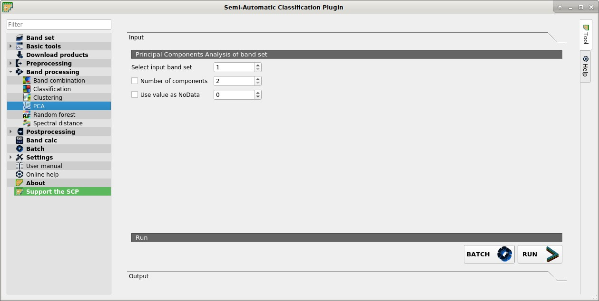
	
	|pca_tool| :guilabel:`PCA`

This tab allows for the PCA (:ref:`principal_component_analysis`) of bands loaded in the :guilabel:`Band set`.

.. _pca_input:

Principal Component Analysis of Band set
^^^^^^^^^^^^^^^^^^^^^^^^^^^^^^^^^^^^^^^^^^^^^^^^

* :guilabel:`Select input band set` |input_number|: select the input :ref:`band_set_tab`;
* |checkbox| :guilabel:`Number of components` |input_number|: if checked, set the number of calculated components; if unchecked, all the components are calculated;
* |checkbox| :guilabel:`Use NoData value` |input_number|: if checked, set the value of ``NoData`` pixels, ignored during the calculation;

.. _run_tool_7:

Run
^^^^^^^^^^^^^^^^^^^^^^^^^^^^^^^^^^^^^^^

* :guilabel:`RUN` |run|: select an output directory and start the calculation process; principal components are calculated and saved as raster files; also, the details about the PCA are displayed in the tab :guilabel:`Output` and saved in a .txt file in the output directory;

.. _clustering_tab:

Clustering
-------------------------

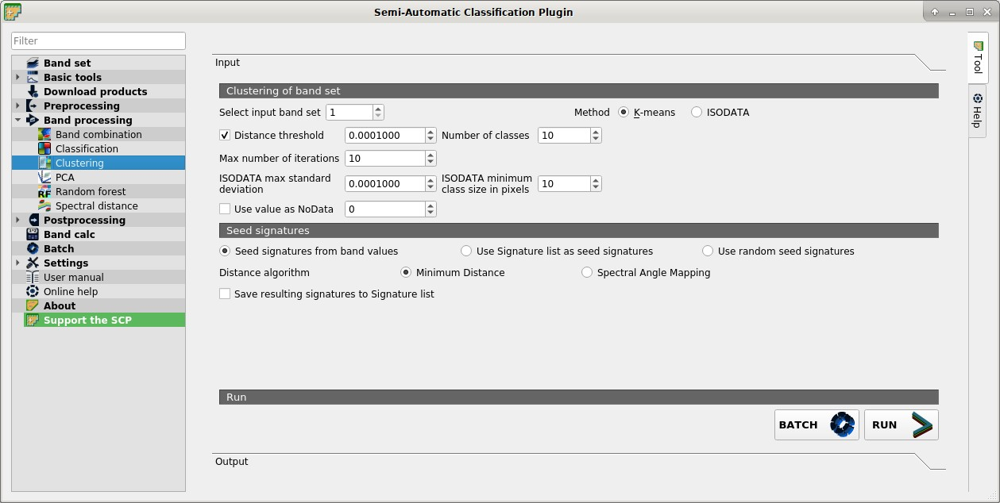
	
	|clustering| :guilabel:`Clustering`

This tab allows for the :ref:`clustering_definition` of a :ref:`band_set_tab`.
In particular, :ref:`kmeans_definition` and :ref:`isodata_definition` methods are available.

.. _clustering_input:

Clustering of band set
^^^^^^^^^^^^^^^^^^^^^^^^^^^^^^^^^^^^^^^^^^^^^^^^

* :guilabel:`Select input band set` |input_number|: select the input :ref:`band_set_tab`;
* :guilabel:`Method` |radiobutton| :guilabel:`K-means` |radiobutton| :guilabel:`ISODATA`: select the clustering method :ref:`kmeans_definition` or :ref:`isodata_definition`;
* |checkbox| :guilabel:`Distance threshold` |input_number|: if checked, for K-means: iteration is terminated if distance is lower than threshold; for ISODATA: signatures are merged if distance is greater than threshold;
* :guilabel:`Number of classes` |input_number|: number of desired output classes;
* :guilabel:`Max number of iterations` |input_number|: maximum number of iterations if :guilabel:`Distance threshold` is not reached;
* :guilabel:`ISODATA max standard deviation` |input_number|: maximum standard deviation considered for splitting a class, for :guilabel:`ISODATA` algorithm only;
* :guilabel:`ISODATA minimum class size in pixels` |input_number|: desired minimum class size in pixels, for :guilabel:`ISODATA` algorithm only;
* |checkbox| :guilabel:`Use NoData value` |input_number|: if checked, set the value of ``NoData`` pixels, ignored during the calculation;

.. _seed_signatures:

Seed signatures
^^^^^^^^^^^^^^^^^^^^^^^^^^^^^^^^^^^^^^^^^^^^^^^^

* |radiobutton| :guilabel:`Seed signatures from band values` |radiobutton| :guilabel:`Use Signature list as seed signatures` |radiobutton| :guilabel:`Use random seed signatures`: select one options for seed signatures that start the iteration; the option :guilabel:`Seed signatures from band values` divides the spectral space of the :ref:`band_set_tab` to get spectral signatures; the option :guilabel:`Use Signature list as seed signatures` uses the spectral signatures checked in :ref:`ROI_list`; the option :guilabel:`Use random seed signatures` randomly selects the spectral signatures of pixels in the :ref:`band_set_tab`;
* :guilabel:`Distance algorithm` |radiobutton| :guilabel:`Minimum Distance` |radiobutton| :guilabel:`Spectral Angle Mapping`: select :ref:`minimum_distance_algorithm` or * :ref:`spectra_angle_mapping_algorithm` for spectral distance calculation;
* |checkbox| :guilabel:`Save resulting signatures to Signature list`: if checked, save the resulting spectral signatures in the :ref:`ROI_list`;

.. _run_tool_clustering:

Run
^^^^^^^^^^^^^^^^^^^^^^^^^^^^^^^^^^^^^^^

* :guilabel:`RUN` |run|: choose the output destination and start the calculation;

.. _spectral_distance_tab:

Spectral distance
-------------------------

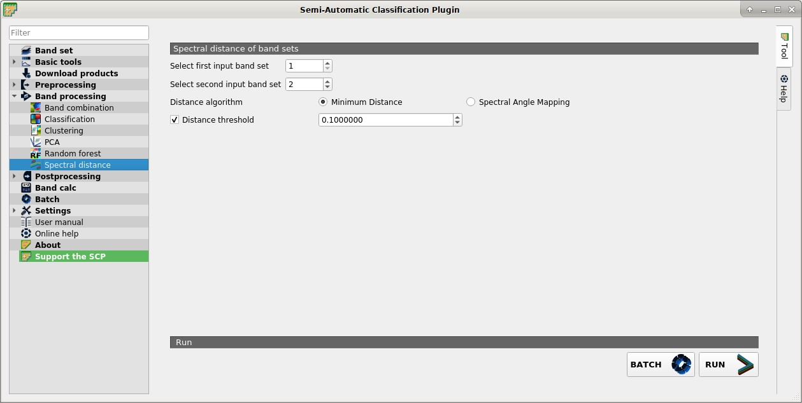
	
	|spectral_distance| :guilabel:`Spectral distance`

This tab allows for calculating the spectral distance between every corresponding pixel of two :guilabel:`band sets`.
The output is a raster containing the spectral distance of each pixel.
Optionally, a threshold can be defined for creating a binary raster of values below and above the threshold.

.. _spectral_distance_input:

Spectral distance of band sets
^^^^^^^^^^^^^^^^^^^^^^^^^^^^^^^^^^^^^^^^^^^^^^^^

* :guilabel:`Select first input band set` |input_number|: select the first input :ref:`band_set_tab`;
* :guilabel:`Select second input band set` |input_number|: select the second input :ref:`band_set_tab`;
* :guilabel:`Distance algorithm` |radiobutton| :guilabel:`Minimum Distance` |radiobutton| :guilabel:`Spectral Angle Mapping`: select :ref:`minimum_distance_algorithm` or * :ref:`spectra_angle_mapping_algorithm` for spectral distance calculation;
* |checkbox| :guilabel:`Distance threshold` |input_number|: if checked, a binary raster of values below and above the threshold is created;

.. _run_tool_spectral_distance:

Run
^^^^^^^^^^^^^^^^^^^^^^^^^^^^^^^^^^^^^^^

* :guilabel:`RUN` |run|: choose the output destination and start the calculation;

.. _post_processing_tab:
 
Postprocessing
===================

The tab |post_process| :guilabel:`Postprocessing` provides several functions that can be applied to the classification output.

.. _accuracy_tab:
 
Accuracy
------------

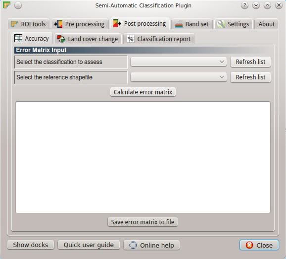
	
	|accuracy_tool| :guilabel:`Accuracy`
	
This tab allows for the validation of a classification (read :ref:`accuracy_assessment_definition` ).
Classification is compared to a reference raster or reference vector (which is automatically converted to raster).
If a vector is selected as reference, it is possible to choose a field describing class values.

Several statistics are calculated such as overall accuracy, user's accuracy, producer's accuracy, and Kappa hat.
In particular, these statistics are calculated according to the area based error matrix where each element represents the estimated area proportion of each class.
This allows for estimating the unbiased user's accuracy and producer's accuracy, the unbiased area of classes according to reference data, and the standard error of area estimates.

The output is an ``error raster`` that is a ``.tif`` file showing the errors in the map, where pixel values represent the categories of comparison (i.e. combinations identified by the ``ErrorMatrixCode`` in the error matrix) between the classification and reference.
Also, a text file containing the error matrix (i.e. a ``.csv`` file separated by tab) is created with the same name defined for the ``.tif`` file.

.. _error_matrix_input:

Input
^^^^^^^^^^^^^^^^^^

* :guilabel:`Select the classification to assess` |input_list|: select a classification raster (already loaded in QGIS);
* |reload|: refresh layer list;
* :guilabel:`Select the reference vector or raster` |input_list|: select a raster or a vector (already loaded in QGIS), used as reference layer (ground truth) for the accuracy assessment;
* |reload|: refresh layer list;
* :guilabel:`Vector field` |input_list|: if a vector is selected as reference, select a vector field containing numeric class values;

.. _run_tool_9:

Run
^^^^^^^^^^^^^^^^^^^^^^^^^^^^^^^^^^^^^^^

* :guilabel:`RUN` |run|: choose the output destination and start the calculation; the error matrix is displayed in the tab :guilabel:`Output` and the ``error raster`` is loaded in QGIS;
	
.. _land_cover_change_tab:

Land cover change 
---------------------

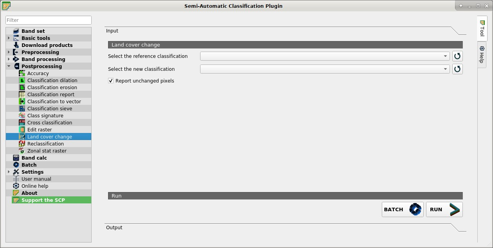
	
	|land_cover_change| :guilabel:`Land cover change`
	
The tab ``Land cover change`` allows for the comparison between two classifications in order to assess land cover changes.
Output is a ``land cover change raster`` (i.e. a file .tif showing the changes in the map, where each pixel represents a category of comparison (i.e. combinations) between the two classifications, which is the ``ChangeCode`` in the land cover change statistics) and a text file containing the land cover change statistics (i.e. a file .csv separated by tab, with the same name defined for the .tif file).

.. _classification_input:

Input
^^^^^^^^^^^^^^^^^^^^

* :guilabel:`Select the reference classification` |input_list|: select a reference classification raster (already loaded in QGIS);
* |reload|: refresh layer list;
* :guilabel:`Select the new classification` |input_list|: select a new classification raster (already loaded in QGIS), to be compared with the reference classification;
* |reload|: refresh layer list;
* |checkbox| :guilabel:`Report unchanged pixels`: if checked, report also unchanged pixels (having the same value in both classifications);

.. _run_tool_10:

Run
^^^^^^^^^^^^^^^^^^^^^^^^^^^^^^^^^^^^^^^

* :guilabel:`RUN` |run|: choose the output destination and start the calculation; the land cover change statistics are displayed in the tab :guilabel:`Output` (and saved in a text file) and the ``land cover change raster`` is loaded in QGIS;

.. _classification_report_tab:

Classification report
-------------------------

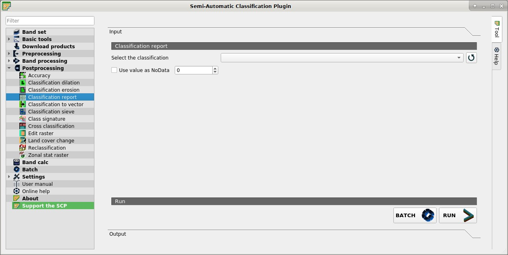
	
	|report_tool| :guilabel:`Classification report`
	
This tab allows for the calculation of class statistics such as number of pixels, percentage and area (area unit is defined from the image itself).

.. _classification_input2:

Input
^^^^^^^^^^^^^^^^^^^^

* :guilabel:`Select the classification` |input_list|: select a classification raster (already loaded in QGIS);
* |reload|: refresh layer list;
* |checkbox| :guilabel:`Use NoData value` |input_number|: if checked, ``NoData`` value will be excluded from the report;

.. _run_tool_11:

Run
^^^^^^^^^^^^^^^^^^^^^^^^^^^^^^^^^^^^^^^

* :guilabel:`RUN` |run|: choose the output destination and start the calculation; the report is saved in a text file and displayed in the tab :guilabel:`Output`;

.. _cross_classification_tab:

Cross classification
-------------------------

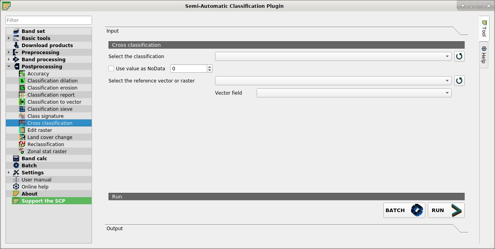
	
	|cross_classification| :guilabel:`Cross classification`
	

This tab allows for the calculation of a cross classification raster and matrix. 
Classification is compared to a reference raster or reference vector (which is automatically converted to raster).
This is useful for calculating the area for every combination between reference classes and classification values.
If a vector is selected as reference, it is possible to choose a field describing class values.

The output is a ``cross raster`` that is a ``.tif`` file where pixel values represent the categories of comparison (i.e. combinations identified by the ``CrossMatrixCode``) between the classification and reference.
Also, a text file containing the cross matrix (i.e. a ``.csv`` file separated by tab) is created with the same name defined for the ``.tif`` file.

.. _cross_matrix_input:

Input
^^^^^^^^^^^^^^^^^^

* :guilabel:`Select the classification` |input_list|: select a classification raster (already loaded in QGIS);
* |reload|: refresh layer list;
* |checkbox| :guilabel:`Use NoData value` |input_number|: if checked, ``NoData`` value will be excluded from the calculation;
* :guilabel:`Select the reference vector or raster` |input_list|: select a raster or a vector (already loaded in QGIS), used as reference layer;
* |reload|: refresh layer list;
* :guilabel:`Vector field` |input_list|: if a vector is selected as reference, select a vector field containing numeric class values;

.. _run_tool_18:

Run
^^^^^^^^^^^^^^^^^^^^^^^^^^^^^^^^^^^^^^^

* :guilabel:`RUN` |run|: choose the output destination and start the calculation; the cross matrix is displayed in the tab :guilabel:`Output` and the ``cross raster`` is loaded in QGIS;

.. _class_signature_tab:

Class signature
-------------------------

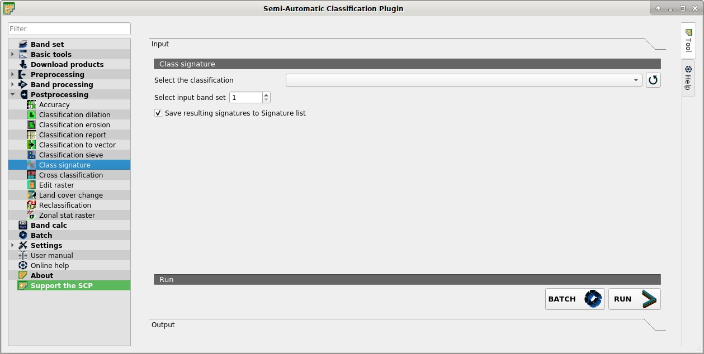
	
	|class_signature| :guilabel:`Class signature`
	
This tab allows for the calculation of the mean spectral signature of each class in a classification using a :ref:`band_set_tab`.

* :guilabel:`Select the classification` |input_list|: select a classification raster (already loaded in QGIS);
* |reload|: refresh layer list;
* :guilabel:`Select input band set` |input_number|: select the input :ref:`band_set_tab` for spectral signature calculation;
* |checkbox| :guilabel:`Save resulting signatures to Signature list`: if checked, save the resulting spectral signatures to :ref:`ROI_list`;

.. _run_tool_class_signature:

Run
^^^^^^^^^^^^^^^^^^^^^^^^^^^^^^^^^^^^^^^

* :guilabel:`RUN` |run|: choose the output destination and start the conversion;

.. _classification_vector_tab:

Classification to vector 
-------------------------

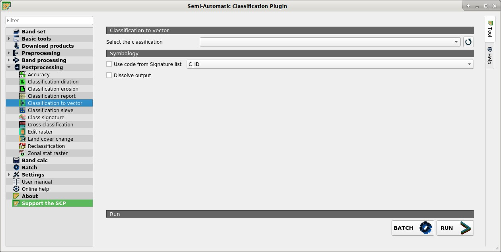
	
	|class_to_vector_tool| :guilabel:`Classification to vector`
	
This tab allows for the conversion of a classification raster to vector shapefile.

* :guilabel:`Select the classification` |input_list|: select a classification raster (already loaded in QGIS);
* |reload|: refresh layer list;

.. _rastertovector_symbology:

Symbology
^^^^^^^^^^^^^^^^^^^^

* |checkbox| :guilabel:`Use code from Signature list` |input_list|: if checked, color and class information are defined from :ref:`ROI_list`:
	* ``MC ID``: use the ID of macroclasses;
	* ``C ID``: use the ID of classes;
	
.. _run_tool_12:

Run
^^^^^^^^^^^^^^^^^^^^^^^^^^^^^^^^^^^^^^^

* :guilabel:`RUN` |run|: choose the output destination and start the conversion;

.. _reclassification_tab:

Reclassification 
-------------------------

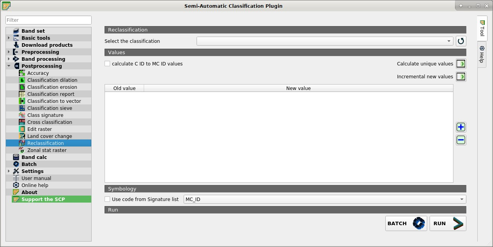
	
	|reclassification_tool| :guilabel:`Reclassification`
		
This tab allows for the reclassification (i.e. assigning a new class code to raster pixels).
In particular, it eases the conversion from C ID to MC ID values.

* :guilabel:`Select the classification` |input_list|: select a classification raster (already loaded in QGIS);
* |reload|: refresh layer list;

.. _reclass_values:

Values
^^^^^^^^^^^^^^^^^^^^^^^^^^^^^^^^^^^^^^^

* |checkbox| :guilabel:`calculate C ID to MC ID values`: if checked, the reclassification table is filled according to the :ref:`ROI_list` when :guilabel:`Calculate unique values` |enter| is clicked;
* :guilabel:`Calculate unique values` |enter|: calculate unique values in the classification and fill the reclassification table;

* |input_table| :guilabel:`Values`: table containing the following fields;
	* :guilabel:`Old value`: set the expression defining old values to be reclassified; ``Old value`` can be a value or an expressions defined using the variable name ``raster`` (custom names can be defined in :ref:`variable_name` ), following Python operators (e.g. ``raster > 3`` select all pixels having value > 3 ; ``raster > 5 | raster < 2`` select all pixels having value > 5 or < 2 ; ``raster >= 2 & raster <= 5`` select all pixel values between 2 and 5);
	* :guilabel:`New value`: set the new value for the old values defined in ``Old value``;

* |add|: add a row to the table;
* |remove|: remove highlighted rows from the table;

.. _reclass_symbology:

Symbology
^^^^^^^^^^^^^^^^^^^^^^^^^^^^^^^^^^^^^^^

* |checkbox| :guilabel:`Use code from Signature list` |input_list|: if checked, color and class information are defined from :ref:`ROI_list`:
	* ``MC ID``: use the ID of macroclasses;
	* ``C ID``: use the ID of classes;

.. _run_tool_13:

Run
^^^^^^^^^^^^^^^^^^^^^^^^^^^^^^^^^^^^^^^

* :guilabel:`RUN` |run|: choose the output destination and start the calculation; reclassified raster is loaded in QGIS;

.. _edit_raster_tab:

Edit raster
-------------------------

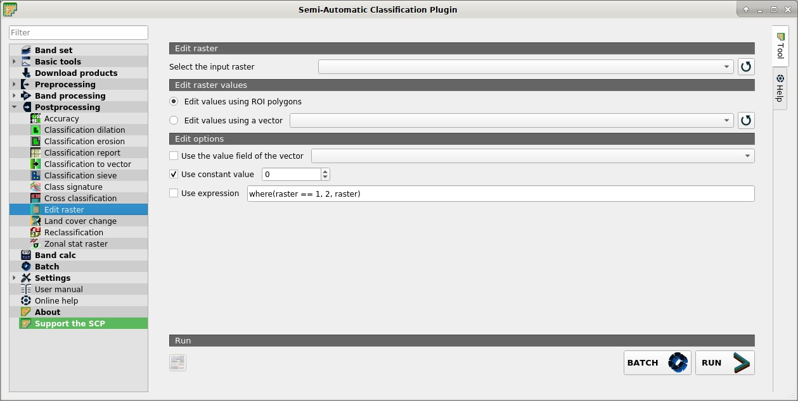
	
	|edit_raster| :guilabel:`Edit raster`
		
This tab allows for the direct editing of pixel values in a raster.
Only pixels beneath ROI polygons or vector polygons are edited.

	**Attention**: the input raster is directly edited; it is recommended to create a **backup copy** of the input raster before using this tool in order to prevent data loss.

This tool can rapidly edit large rasters, especially when editing polygons are small, because pixel values are edited directly.
In addition, the :ref:`toolbar_edit_raster` is available for easing the raster editing using multiple values.
	
* :guilabel:`Select the input raster` |input_list|: select a raster (already loaded in QGIS);
* |reload|: refresh layer list;

.. _edit_input:

Edit raster values
^^^^^^^^^^^^^^^^^^^^

* |radiobutton| :guilabel:`Edit values using ROI polygons`: if checked, raster is edited using temporary ROI polygons in the map;
* |radiobutton| :guilabel:`Edit values using a vector` |input_list|: if checked, raster is edited using all the polygons of selected vector;
* |reload|: refresh layer list;

.. _edit_options:

Edit options
^^^^^^^^^^^^^^^^^^^^

* |checkbox| :guilabel:`Use the value field of the vector` |input_list|: if checked, raster is edited using the selected vector (in :guilabel:`Edit values using a vector`) and the polygon values of selected vector field;
* |checkbox| :guilabel:`Use constant value` |input_number|: if checked, raster is edited using the selected constant value;
* |checkbox| :guilabel:`Use expression` |input_text|: if checked, raster is edited according to the entered expression; the expression must contain one or more ``where``; accepted variable are ``raster`` representing the input raster value and ``vector`` representing the vector value if selected; the following example expression ``where(raster == 1, 2, raster)`` is already entered, which sets 2 where ``raster`` equals 1, and leaves unchanged the values where ``raster`` is not equal to 1;

.. _run_tool_14:

Run
^^^^^^^^^^^^^^^^^^^^^^^^^^^^^^^^^^^^^^^

* |undo_edit_raster|: undo the last raster edit (available only when using ROI polygons);
* :guilabel:`RUN` |run|: edit the raster;

.. _classification_sieve_tab:

Classification sieve
-------------------------

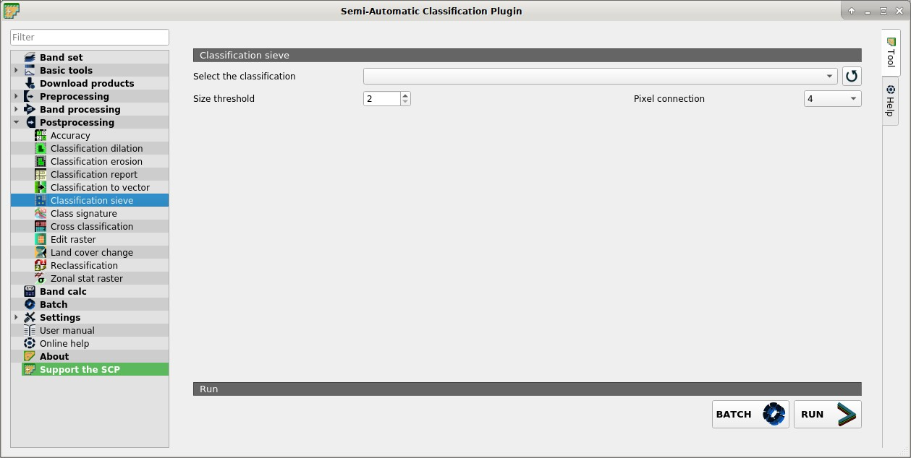
	
	|classification_sieve| :guilabel:`Classification sieve`
		
This tab allows for the replacement of isolated pixel values with the value of the largest neighbour patch (based on `GDAL Sieve <http://www.gdal.org/gdal_sieve.html>`_ ).
It is useful for removing small patches from a classification.

* :guilabel:`Select the classification` |input_list|: select a raster (already loaded in QGIS);
* |reload|: refresh layer list;
* :guilabel:`Size threshold` |input_number|: size of the patch to be replaced (in pixel unit); all patches smaller the the selected number of pixels will be replaced by the value of the largest neighbour patch;
* :guilabel:`Pixel connection` |input_list|: select the type of pixel connection:
	* :guilabel:`4`: in a 3x3 window, diagonal pixels are not considered connected;
	* :guilabel:`8`: in a 3x3 window, diagonal pixels are considered connected;

.. _run_tool_15:

Run
^^^^^^^^^^^^^^^^^^^^^^^^^^^^^^^^^^^^^^^

* :guilabel:`RUN` |run|: choose the output destination and start the calculation; 

.. _classification_erosion_tab:

Classification erosion
-------------------------

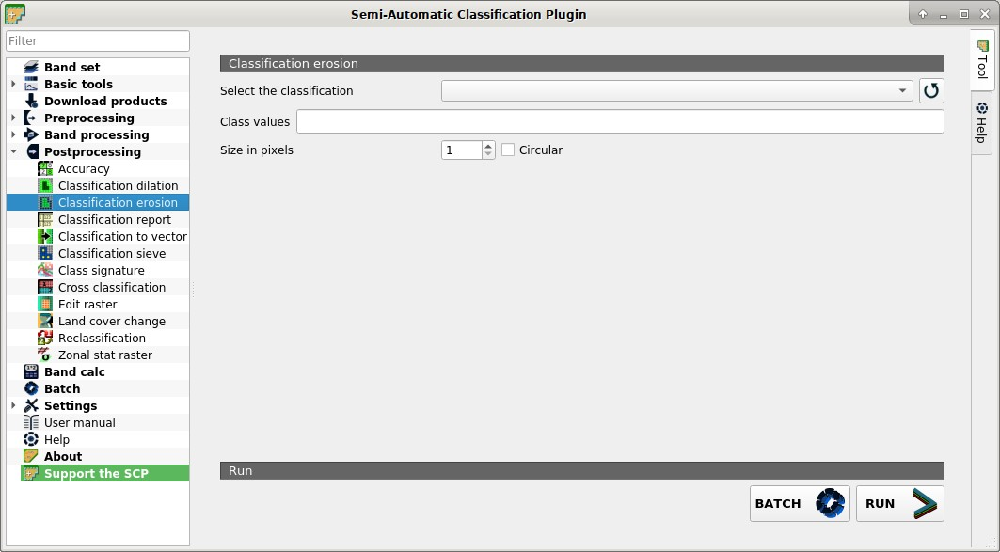
	
	|classification_erosion| :guilabel:`Classification erosion`
		
This tab allows for removing the border of a class patch (erosion), defining the class values to be eroded and the number of pixels from the border.
It is useful for classification refinement.

* :guilabel:`Select the classification` |input_list|: select a raster (already loaded in QGIS);
* |reload|: refresh layer list;
* :guilabel:`Class values` |input_text|: set the class values to be eroded; class values must be separated by ``,`` and ``-`` can be used to define a range of values (e.g. ``1, 3-5, 8`` will select classes 1, 3, 4, 5, 8); if the text is red then the expression contains errors;
* :guilabel:`Size in pixels` |input_number|: number of pixels to be eroded from the border;
* :guilabel:`Pixel connection` |input_list|: select the type of pixel connection:
	* :guilabel:`4`: in a 3x3 window, diagonal pixels are not considered connected;
	* :guilabel:`8`: in a 3x3 window, diagonal pixels are considered connected;

	
	
.. _run_tool_16:

Run
^^^^^^^^^^^^^^^^^^^^^^^^^^^^^^^^^^^^^^^

* :guilabel:`RUN` |run|: choose the output destination and start the calculation; 

.. _classification_dilation_tab:

Classification dilation
-------------------------

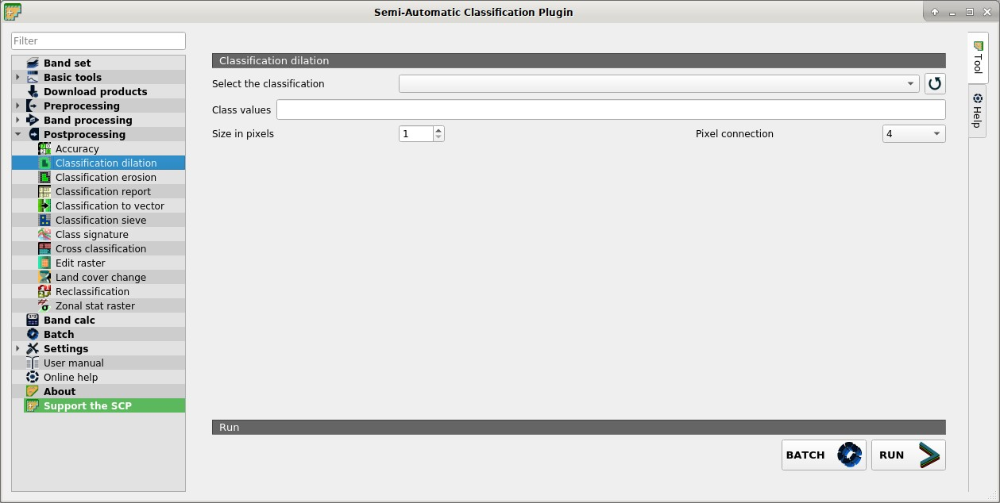
	
	|classification_dilation| :guilabel:`Classification dilation`
		
This tab allows for dilating the border of a class patch, defining the class values to be dilated and the number of pixels from the border.
It is useful for classification refinement.

* :guilabel:`Select the classification` |input_list|: select a raster (already loaded in QGIS);
* |reload|: refresh layer list;
* :guilabel:`Class values` |input_text|: set the class values to be dilated; class values must be separated by ``,`` and ``-`` can be used to define a range of values (e.g. ``1, 3-5, 8`` will select classes 1, 3, 4, 5, 8); if the text is red then the expression contains errors;
* :guilabel:`Size in pixels` |input_number|: number of pixels to be dilated from the border;
* :guilabel:`Pixel connection` |input_list|: select the type of pixel connection:
	* :guilabel:`4`: in a 3x3 window, diagonal pixels are not considered connected;
	* :guilabel:`8`: in a 3x3 window, diagonal pixels are considered connected;

.. _run_tool_17:

Run
^^^^^^^^^^^^^^^^^^^^^^^^^^^^^^^^^^^^^^^

* :guilabel:`RUN` |run|: choose the output destination and start the calculation; 

.. _band_calc_tab:
 
Band calc
=============

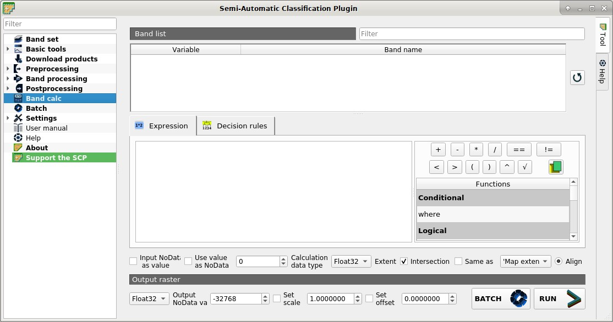
	
	|bandcalc_tool| :guilabel:`Band calc`
		
The ``Band calc`` allows for the **raster calculation for bands** (i.e. calculation of pixel values) using `NumPy functions <http://docs.scipy.org/doc/numpy/reference/routines.math.html>`_ .
Raster bands must be already loaded in QGIS.
Input rasters must be in the same projection.

In addition, it is possible to calculate a raster using **decision rules**. 

.. _band_list2:

Band list
---------

* |input_table| :guilabel:`Band list`: table containing a list of single band rasters (already loaded in QGIS);
	* :guilabel:`Variable`: variable name defined automatically for every band (e.g. raster1, raster2);
	* :guilabel:`Band name`: band name (i.e. the layer name in QGIS);
	
* |reload|: refresh image list;

.. _expression:

Expression
----------

Enter a mathematical expression for raster bands.
In particular, NumPy functions can be used with the prefix `np.` (e.g. ``np.log10(raster1)`` ).
For a list of NumPy functions see `the NumPy page <http://docs.scipy.org/doc/numpy/reference/routines.math.html>`_ .

The expression can work with both :guilabel:`Variable` and :guilabel:`Band name` (between double quotes).
Also, bands in the :ref:`band_set_tab` can be referenced directly; for example ``bandset#b1`` refers to band 1 of the :guilabel:`Band set`.
Double click on any item in the :ref:`band_list2` for adding its name to the expression.
In addition, the following variables related to :ref:`band_set_tab` the are available:

* :guilabel:`"#BLUE#"`: the band with the center wavelength closest to 0.475 :math:`\mu m`;
* :guilabel:`"#GREEN#"`: the band with the center wavelength closest to 0.56 :math:`\mu m`;
* :guilabel:`"#RED#"`: the band with the center wavelength closest to 0.65 :math:`\mu m`;
* :guilabel:`"#NIR#"`: the band with the center wavelength closest to 0.85 :math:`\mu m`;

Variables for output name are available:

* :guilabel:`#BANDSET#`: the name of the first band in the :ref:`band_set_tab`;
* :guilabel:`#DATE#`: the current date and time (e.g. 20161110_113846527764);

If text in the :guilabel:`Expression` is green, then the syntax is correct; if text is red, then the syntax is incorrect and it is not possible to execute the calculation.

It is possible to enter multiple expressions separated by newlines such as the following example:

	``"raster1" + "raster2"``
	
	``"raster3" - "raster4"``

The above example calculates two new rasters in the output directory with the suffix ``_1`` (e.g. ``calc_raster_1`` ) for the first expression and ``_2`` (e.g. ``calc_raster_2`` ) for the second expression.
Also, it is possible to define the output name using the symbol ``@`` followed by the name, such as the following example:

	``"raster1" + "raster2" @ calc_1``
	
	``"raster3" - "raster4" @ calc_2``
	
The following buttons are available:

* :guilabel:`+`: plus;
* :guilabel:`-`: minus;
* :guilabel:`*`: product;
* :guilabel:`/`: ratio;
* :guilabel:`^`: power;
* :guilabel:`V`: square-root;
* :guilabel:`(`: open parenthesis;
* :guilabel:`)`: close parenthesis;
* :guilabel:`>`: greater then;
* :guilabel:`<`: less then;
* :guilabel:`ln`: natural logarithm;
* :guilabel:`π`: pi;
* :guilabel:`==`: equal;
* :guilabel:`!=`: not equal;
* :guilabel:`sin`: sine;
* :guilabel:`asin`: inverse sine;
* :guilabel:`cos`: cosine;
* :guilabel:`acos`: inverse cosine;
* :guilabel:`tan`: tangent;
* :guilabel:`atan`: inverse tangent;
* :guilabel:`where`: conditional expression according to the syntax ``where( condition , value if true, value if false)`` (e.g. ``where("raster1" == 1, 2, "raster1")``);
* :guilabel:`exp`: natural exponential;
* :guilabel:`nodata`: NoData value of raster (e.g. ``nodata("raster1")``); it can be used as value in the expression (e.g. ``where("raster1" == nodata("raster1"), 0, "raster1")``);

.. _index_calculation:

Index calculation
----------------------------

:guilabel:`Index calculation` allows for entering a spectral index expression (see :ref:`spectral_indices_definition`).

* :guilabel:`Index calculation` |input_list|: list of spectral indices:
	* :guilabel:`NDVI`: if selected, the NDVI calculation is entered in the :guilabel:`Expression` ( ``(( "#NIR#" - "#RED#") / ( "#NIR#" + "#RED#") @ NDVI)`` );
	* :guilabel:`EVI`: if selected, the EVI calculation is entered in the :guilabel:`Expression` ( ``2.5 * ( "#NIR#" - "#RED#" ) / ( "#NIR#" + 6 * "#RED#" - 7.5 * "#BLUE#" + 1) @ EVI`` );
* |open_file|: open a text file (.txt) containing custom expressions to be listed in :guilabel:`Index calculation`; the text file must contain an expression for each line; each line must be in the form ``expression_name; expression`` (separated by ``;``) where the ``expression_name`` is the expression name that is displayed in the :guilabel:`Index calculation`; if you open an empty text file, the default values are restored; following an example of text content::

	NDVI; ( "#NIR#" - "#RED#" ) / ( "#NIR#" + "#RED#" ) @NDVI
	EVI; 2.5 * ( "#NIR#" - "#RED#" ) / ( "#NIR#" + 6 * "#RED#" - 7.5 * "#BLUE#" + 1) @EVI
	SR; ( "#NIR#" / "#RED#" ) @SR

.. _decision_rules:

Decision rules
----------------------------

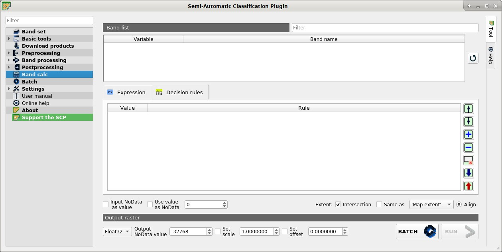
	
:guilabel:`Decision rules` allows for the calculation of an output raster based on rules.
Rules are conditional statements based on other rasters; if the :guilabel:`Rule` is true, the corresponding :guilabel:`Value` is assigned to the output pixel.

Rules are verified from the first to the last row in the table; if the first :guilabel:`Rule` is false, the next :guilabel:`Rule` is verified for that pixel, until the last rule.
If multiple rules are true for a certain pixel, the value of the first :guilabel:`Rule` is assigned to that pixel.
The ``NoData`` value is assigned to those pixels where no :guilabel:`Rule` is true.

* |input_table| :guilabel:`Decision rules`: table containing the following fields;
	* :guilabel:`Value`: the value assigned to pixels if the :guilabel:`Rule` is true;
	* :guilabel:`Rule`: the rule to be verified (e.g. ``"raster1" > 0``); multiple conditional statements can be entered separated by ``;`` (e.g. ``"raster1" > 0; "raster2" < 1`` which means to set the :guilabel:`Value` where ``raster1`` > 0 and ``raster2`` < 1);

* |move_up|: move highlighted rule up;
* |move_down|: move highlighted rule down;
* |add|: add a new row to the table;
* |remove|: delete the highlighted rows from the table;
* |reset|: clear the table;
* |export|: export the rules to a text file that can be imported later;
* |import|: import rules from a text file;
	
.. _output_raster:

Output raster
--------------

The output raster is a .tif file, with the same spatial resolution and projection of input rasters; if input rasters have different spatial resolutions, then the highest resolution (i.e. minimum pixel size) is used for output raster.

* |checkbox| :guilabel:`Use NoData value` |input_number|: if checked, set the value of ``NoData`` pixels in output raster;
* Extent: if the following options are unchecked, the output raster extent will include the extents of all input rasters;
	* |checkbox| :guilabel:`Intersection`: if checked, the extent of output raster equals the intersection of input raster extents (i.e. minimum extent);
	* |checkbox| :guilabel:`Same as` |input_list|: if checked, the extent of output raster equals the extent of :guilabel:`"Map extent"` (the extent of the map currently displayed) or a selected layer;
* |radiobutton| :guilabel:`Align`: if checked, and |checkbox| :guilabel:`Same as` is checked selecting a raster, the calculation is performed using the same extent and pixel alignment of selected raster;
* :guilabel:`RUN` |run|: if ``Expression`` is active and text is green, choose the output destination and start the calculation based on ``Expression``; if ``Decision rules`` is active and text is green, choose the output destination and start the calculation based on ``Decision rules``;

.. _batch_tab:
 
Batch
=============

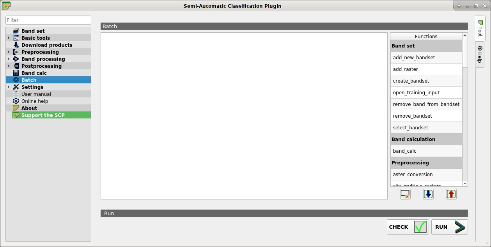
	
	|batch_tool| :guilabel:`Batch`
		
This tab allows for the automatic execution (batch) of several :guilabel:`SCP` functions using a scripting interface.

.. _batch_tools:

Batch
-------------------

Enter a batch expression; each function must be in a new line.
Functions have the following structure:

	``function name``; ``function options``
	
Each function has options, identified by a name, with the following structure:

	``option name``: ``option argument``
	
Options must be separated by the character ``;`` .
Each function option represents an option in the corresponding interface of :guilabel:`SCP`; option arguments of type text must be between the character ``'`` ; in case of checkboxes, the value 1 represents checked, while the value 0 represents unchecked.
A new line beginning with ``#`` can be used for commenting.

According to the function, some of the options are mandatory while other options can be omitted from the expression. Option names that contain ``path`` require the full path to a file.
Some options require multiple arguments such as lists; lists must be separated by ``,`` .

If the expression contains errors, the text is red.
An expression check label is displayed with a brief description of the error.

* |reset|: clear the expression;
* |export|: export the batch expression to a file;
* |import|: import a previously saved batch expression from file;

A table :guilabel:`Functions` is displayed at the right side; double click to insert a function in the expression; the following functions are available with the corresponding options:
	* :ref:`accuracy_tab`: calculate accuracy (``accuracy;classification_file_path : '';reference_file_path : '';shapefile_field_name : '';output_raster_path : ''``);
	* :ref:`aster_tab`: ASTER conversion (``aster_conversion;input_raster_path : '';celsius_temperature : 0;apply_dos1 : 0;use_nodata : 1;nodata_value : 0;create_bandset : 1;output_dir : ''``);
	* :ref:`band_calc_tab`: band calculation (``band_calc;expression : '';output_raster_path : '';extent_same_as_raster_name : '';extent_intersection : 1;set_nodata : 0;nodata_value : 0``);
	* :ref:`band_combination_tab`: band combination (``band_combination;band_set : 1;output_raster_path : ''``);
	* :ref:`class_signature_tab`: class signature (``class_signature;input_raster_path : '';band_set : 1;save_signatures : 1;output_text_path : ''``);
	* :ref:`classification_output`: perform classification (``classification;use_macroclass : 0;algorithm_name  : 'Minimum Distance';use_lcs : 0;use_lcs_algorithm : 0;use_lcs_only_overlap : 0;apply_mask : 0;mask_file_path : '';vector_output : 0;classification_report : 0;save_algorithm_files : 0;output_classification_path : ''``);
	* :ref:`classification_dilation_tab`: dilation of a classification (``classification_dilation;input_raster_path : '';class_values : '';size_in_pixels : 1;pixel_connection : 4;output_raster_path : ''``);
	* :ref:`classification_erosion_tab`: erosion of a classification (``classification_erosion;input_raster_path : '';class_values : '';size_in_pixels : 1;pixel_connection : 4;output_raster_path : ''``);
	* :ref:`classification_report_tab`: report of a classification (``classification_report;input_raster_path : '';use_nodata : 0;nodata_value : 0;output_report_path : ''``);
	* :ref:`classification_sieve_tab`: classification sieve(``classification_sieve;input_raster_path : '';size_threshold : 2;pixel_connection : 4;output_raster_path : ''``);
	* :ref:`classification_vector_tab`: convert classification to vector (``classification_to_vector;input_raster_path : '';use_signature_list_code : 1;code_field : 'C_ID';output_vector_path : ''``);
	* :ref:`clip_multiple_rasters_tab`: clip multiple rasters (``clip_multiple_rasters;input_raster_path : '';output_dir : '';use_shapefile : 0;shapefile_path : '';ul_x : '';ul_y : '';lr_x : '';lr_y : '';nodata_value : 0;output_name_prefix : 'clip'``);
	* :ref:`cloud_masking_tab`: cloud masking (``cloud_masking;band_set : 1;input_raster_path : '';class_values : '';use_buffer : 1;size_in_pixels : 1;nodata_value : 0;output_name_prefix : 'mask';output_dir : ''``);
	* :ref:`clustering_tab`: clustering (``clustering;band_set : 1;clustering_method : 1;use_distance_threshold : 1;threshold_value : 0.0001;number_of_classes : 10;max_iterations : 10;isodata_max_std_dev : 0.0001;isodata_min_class_size : 10;use_nodata : 0;nodata_value : 0;seed_signatures : 1;distance_algorithm : 1;save_signatures : 0;output_raster_path : ''``);
	* :ref:`cross_classification_tab`: cross classification (``cross_classification;classification_file_path : '';use_nodata : 0;nodata_value : 0;reference_file_path : '';shapefile_field_name : '';output_raster_path : ''``);
	* :ref:`edit_raster_tab`: edit raster values using a shapefile); (``edit_raster_using_shapefile;input_raster_path : '';input_vector_path : '';vector_field_name : '';constant_value : 0;expression :  'where(raster == 1, 2, raster)'``);
	* :ref:`land_cover_change_tab`: calculate land cover change (``land_cover_change;reference_raster_path : '';new_raster_path : '';output_raster_path : ''``);
	* :ref:`landsat_tab`: Landsat conversion (``landsat_conversion;input_dir : '';mtl_file_path : '';celsius_temperature : 0;apply_dos1 : 0;use_nodata : 1;nodata_value : 0;pansharpening : 0;create_bandset : 1;output_dir : ''``);
	* :ref:`modis_tab`: MODIS conversion (``modis_conversion;input_raster_path : '';reproject_wgs84 : 1;use_nodata : 1;nodata_value : -999;create_bandset : 1;output_dir : ''``);
	* :ref:`pca_tab`: Principal Component Analysis (``pca;use_number_of_components : 0, number_of_components : 2;use_nodata : 1;nodata_value : 0;output_dir : ''``);
	* :ref:`reclassification_tab`: raster reclassification (``reclassification;input_raster_path : '';value_list : 'oldVal-newVal;oldVal-newVal';use_signature_list_code : 1;code_field : 'MC_ID';output_raster_path : ''``);
	* :ref:`sentinel2_tab`: Sentinel-2 conversion (``sentinel2_conversion;input_dir : '';mtd_safl1c_file_path : '';apply_dos1 : 0;use_nodata : 1;nodata_value : 0;create_bandset : 1;output_dir : ''``);
	* :ref:`sentinel3_tab`: Sentinel-3 conversion (``sentinel3_conversion;input_dir : '';apply_dos1 : 0;dos1_only_blue_green : 1;use_nodata : 1;nodata_value : 0;create_bandset : 1;output_dir : '';band_set : 1``);
	* :ref:`spectral_distance_tab`: spectral distance of band sets (``spectral_distance;first_band_set : 1;second_band_set : 2;distance_algorithm  : 1;use_distance_threshold : 1;threshold_value : 0.1;output_dir : ''``);
	* :ref:`split_raster_tab`: split raster to single bands (``split_raster_bands;input_raster_path : '';output_dir : '';output_name_prefix : 'split'``);
	* :ref:`stack_raster_tab`: stack rasters into a single file (``stack_raster_bands;input_raster_path : '';output_raster_path : ''``);
	* :ref:`vector_to_raster_tab`: convert vector to raster (``vector_to_raster;vector_file_path : '';use_value_field : 1;vector_field_name : '';constant_value : 1;reference_raster_path : '';type_of_conversion : 'Center of pixels';output_raster_path : ''``);

	
In addition, the following functions are available:
	* :guilabel:`Add a new band set`: add a new empty band set (``add_new_bandset;``);
	* :guilabel:`Add raster to QGIS`: add a raster to QGIS (``add_raster;input_raster_path : '';input_raster_name : ''``);
	* :guilabel:`Create band set`: create a :guilabel:`Band set` assigning bands (``create_bandset;raster_path_list : '';center_wavelength : '';wavelength_unit : 1;multiplicative_factor : '';additive_factor : ''``);
	* :guilabel:`Open training input`: open a training input file (``open_training_input;training_file_path : ''``);
	* :guilabel:`Remove band set`: remove a band set by the number thereof (``remove_bandset;band_set : 1``);
	* :guilabel:`Select band set`: select a band set (:guilabel:`active band set`) by the number thereof (``select_bandset;band_set : 1``);
	* :guilabel:`Set working directory`: set a working directory (argument is the path to a directory) (``!working_dir!;''``);
	

If a working directory is defined, ``!working_dir!`` can be entered in other functions where a path is required (e.g. ``add_raster;input_raster_path : '!working_dir!/raster1.tif';input_raster_name : 'raster1.tif'``);
An example of batch expression is::

	!working_dir!; '/home/user/Desktop/temp/'
	add_raster;input_raster_path : '!working_dir!/raster1.tif';input_raster_name : 'raster1.tif'
	band_calc;expression : 'where("raster1.tif" > 1, 1,0)';output_raster_path : '!working_dir!/calc1.tif';set_nodata : 1;nodata_value : 0
	band_calc;expression : '"raster1.tif" * "calc1.tif"';output_raster_path : '!working_dir!/calc2.tif';extent_intersection : 0
	
.. _batch_run:

Run
-------------------

* :guilabel:`RUN` |run|: if text in the batch expression is green, start the batch processes; 

.. _settings_tab:
 
Settings
============
	
The tab |settings_tool| :guilabel:`Settings` allows for the customization of :guilabel:`SCP`.

.. _settings_processing_tab:

Processing
-------------------------

.. figure:: _static/settings_processing_tab.jpg
	:align: center
	:width: 500pt
	
	:guilabel:`Processing`
	
.. _classification_process:

Classification process
^^^^^^^^^^^^^^^^^^^^^^^^^

* |checkbox| :guilabel:`Play sound when finished` |registry_save|: if checked, play a sound when the classification process is completed;
* |checkbox| :guilabel:`Use virtual rasters for temp files` |registry_save|: if checked, create virtual rasters for certain temporary files, instead of creating real rasters; it is useful for reducing disk space usage during calculations;
* |checkbox| :guilabel:`Raster compression` |registry_save|: if checked, a lossless compression (DEFLATE or PACKBITS) is applied to raster outputs in order to save disk space; it is recommended to check this option, however compressed files are sometimes larger than files without compression;

.. _smtp_notification:

SMTP process notification
^^^^^^^^^^^^^^^^^^^^^^^^^^^^^^^^^^^^

* :guilabel:`SMTP server` |input_text| |registry_save|: the SMTP server to login for sending a notification email when all the :guilabel:`SCP` processes are finished (a notification is sent also in case of error, but not in case of crash);
* :guilabel:`user` |input_text| |registry_save|: the SMTP server user;
* :guilabel:`password` |input_text| |registry_save|: the SMTP server password;
* :guilabel:`Send email of completed process to` |input_text| |registry_save|: a list of addresses (separated by comma) to send the notification email to;

.. _ram:

RAM
^^^^^^^^^^^^^^^^^^

* :guilabel:`Available RAM (MB)` |input_number| |registry_save|: set the available RAM (in MB) that is used during the processes in order to improve the :guilabel:`SCP` performance; this value should be half of the system RAM (e.g. 1024MB if system has 2GB of RAM); in case of errors, set a value lower than 512MB;

.. raw:: html

	<iframe allowfullscreen="" frameborder="0" height="360" src="http://www.youtube.com/embed/KDI3ud9L6UY?rel=0" width="100%"></iframe>

http://www.youtube.com/watch?v=KDI3ud9L6UY

.. _temporary_directory:

Temporary directory
^^^^^^^^^^^^^^^^^^^^^^

* |open_dir| |registry_save|: select a new temporary directory where temporary files are saved during processing; the path to the current temporary directory is displayed; default is a system temporary directory;
* |reset|: reset to default temporary directory;

.. _settings_interface_tab:

Interface
-------------------------

Customization of the interface.

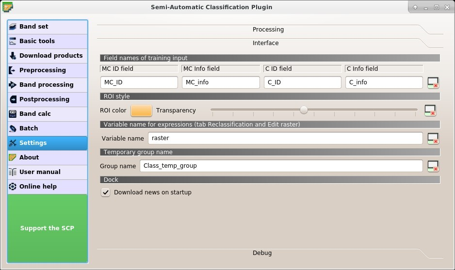
	
	:guilabel:`Interface`

.. _field_names_training_shapefile:

Field names of training input
^^^^^^^^^^^^^^^^^^^^^^^^^^^^^^^^^^^^

Set the names of fields in the :ref:`training_input` .
Changing field names should usually be avoided.

* :guilabel:`MC ID field` |input_text| |registry_save|: name of the Macroclass ID field (default is ``MC_ID``);
* :guilabel:`MC Info field` |input_text| |registry_save|: name of the Macroclass Information field (default is ``MC_info``);
* :guilabel:`C ID field` |input_text| |registry_save|: name of the Class ID field (default is ``C_ID``);
* :guilabel:`C Info field` |input_text| |registry_save|: name of the Class Information field (default is ``C_info``);
* |reset|: reset field names to default;
	
.. _roi_style:

ROI style
^^^^^^^^^^^^^^^^^^

Change ROI color and transparency for a better visualization of temporary ROIs on the map.

* :guilabel:`ROI color` |registry_save|: button for changing ROI color;
* :guilabel:`Transparency` |input_slider| |registry_save|: change ROI transparency;
* |reset|: reset ROI color and transparency to default;

.. _variable_name:

Variable name for expressions
^^^^^^^^^^^^^^^^^^^^^^^^^^^^^^^^^^^^^^^^^^^^^^^^^^^^^^^^^

Set the variable name used in expressions of the :ref:`reclassification_tab` and  :ref:`edit_raster_tab` .

* :guilabel:`Variable name` |input_text| |registry_save|: set variable name (default is ``raster``);
* |reset|: reset variable name to default;

.. _group_name:

Temporary group name
^^^^^^^^^^^^^^^^^^^^^^^^^^^^^^^^^^^^^^^^^^^^^^^^^^^^^^^^^

Set the temporary group name in QGIS Layers used for temporary layers .

* :guilabel:`Group name` |input_text| |registry_save|: set group name (default is ``Class_temp_group``);
* |reset|: reset group name to default;

.. _dock_settings:

Dock
^^^^^^^^^^^^^^^^^^^^^^^^^^^^^^^^^^^^^^^^^^^^^^^^^^^^^^^^^

* |checkbox| :guilabel:`Download news on startup`: if checked, news about the :guilabel:`SCP` and related services are downloaded on startup and displayed in :guilabel:`Dock`;

.. _settings_debug_tab:

Debug
-------------------------

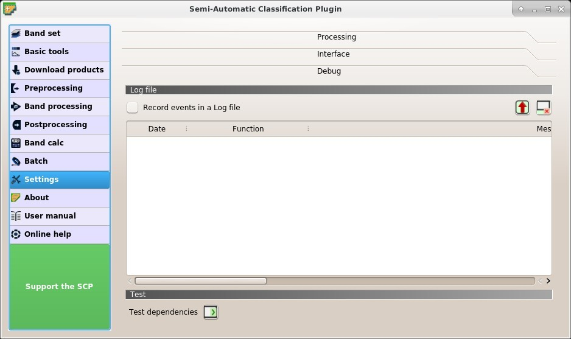
	
	:guilabel:`Debug`

Debugging utilities for the creation of a Log file (i.e. recording of :guilabel:`SCP` activities for reporting issues) and testing :guilabel:`SCP` dependencies.

.. raw:: html

	<iframe allowfullscreen="" frameborder="0" height="360" src="http://www.youtube.com/embed/So04gNzDC9Y?rel=0" width="100%"></iframe>

http://www.youtube.com/watch?v=So04gNzDC9Y

If you found a plugin error, please read :ref:`error_0` .

.. _log_file:

Log file
^^^^^^^^^^^^^^^^^^

* |checkbox| :guilabel:`Records events in a log file` |registry_save|: if checked, start recording events in a Log file;
* |export|: export the Log file (i.e. a .txt file);
* |reset|: clear the content of Log file;

.. _test_dependencies:

Test
^^^^^^^^^^^^^^^^^^

* :guilabel:`Test dependencies` |enter|: test :guilabel:`SCP` dependencies (GDAL, GDAL subprocess, NumPy, SciPy, Matplotlib, Internet connection); results are displayed in a window;
