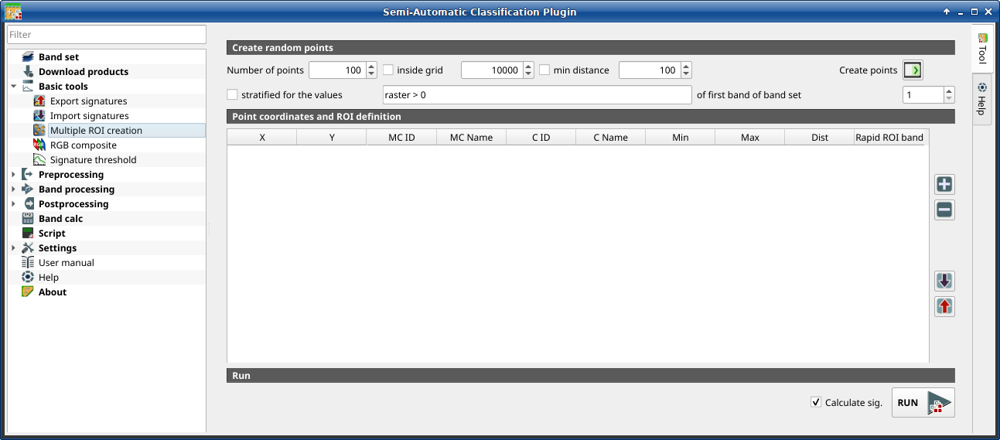

.. _multiple_rois_tab:

******************************
Multiple ROI Creation 
******************************

.. contents::
    :depth: 2
    :local:

.. |registry_save| image:: _static/registry_save.png
    :width: 20pt

.. |project_save| image:: _static/project_save.png
    :width: 20pt

.. |optional| image:: _static/optional.png
    :width: 20pt

.. |input_list| image:: _static/input_list.jpg
    :width: 20pt

.. |input_text| image:: _static/input_text.jpg
    :width: 20pt

.. |input_date| image:: _static/input_date.jpg
    :width: 20pt

.. |input_number| image:: _static/input_number.jpg
    :width: 20pt

.. |input_table| image:: _static/input_table.jpg
    :width: 20pt

.. |open_file| image:: _static/semiautomaticclassificationplugin_open_file.png
    :width: 20pt

.. |new_file| image:: _static/semiautomaticclassificationplugin_new_file.png
    :width: 20pt

.. |add| image:: _static/semiautomaticclassificationplugin_add.png
    :width: 20pt

.. |reset| image:: _static/semiautomaticclassificationplugin_reset.png
    :width: 20pt

.. |checkbox| image:: _static/checkbox.png
    :width: 18pt

.. |enter| image:: _static/semiautomaticclassificationplugin_enter.png
    :width: 20pt

.. |roi_multiple| image:: _static/semiautomaticclassificationplugin_roi_multiple.png
    :width: 20pt

.. |remove| image:: _static/semiautomaticclassificationplugin_remove.png
    :width: 20pt

.. |import| image:: _static/semiautomaticclassificationplugin_import.png
    :width: 20pt

.. |export| image:: _static/semiautomaticclassificationplugin_export.png
    :width: 20pt

.. |run| image:: _static/semiautomaticclassificationplugin_run.png
    :width: 24pt

    |roi_multiple| :guilabel:`Multiple ROI Creation`

This tab allows for the automatic creation of ROIs, useful for the rapid
classification of multi-temporal images, or for accuracy assessment.
Given a list of point coordinates and ROI options, this tool performs the
region growing of ROIs.
Created ROIs are automatically saved to the :ref:`training_input`.
The :guilabel:`active band set` in :ref:`band_set_tab` is used for calculations.

.. _create_random_points:

Create random points
^^^^^^^^^^^^^^^^^^^^^^^^^^^^^^^^^^^^

.. list-table::
    :widths: auto
    :header-rows: 1

    * - Tool symbol and name
      - Description
    * - :guilabel:`Number of points` |input_number|
      - set a number of points that will be created when
        :guilabel:`Create points` |enter| is clicked
    * - |checkbox| :guilabel:`inside grid` |input_number|
      - if checked, the :guilabel:`band set` area is divided in cells where the
        size thereof is defined in the combobox (image unit, usually meters);
        points defined in ``Number of random points`` are created randomly
        within each cell
    * - |checkbox| :guilabel:`min distance` |input_number|
      - if checked, random points have a minimum distance defined in the
        combobox (image unit, usually meters); setting a minimum distance can
        result in fewer points than the number defined
        in :guilabel:`Number of points`
    * - :guilabel:`Create points` |enter|
      - create random points inside the :guilabel:`band set` area
    * - |checkbox| :guilabel:`stratified for the values` |input_text|
      - if checked, create random points inside the values defined in the
        expression calculated for the first band of the defined band set; the
        expression must include the variable ``raster`` ; multiple expressions
        can be entered separated by semicolon ( ; ) but the total number of
        stratified points is the same as the
        defined :guilabel:`Number of points`
    * - :guilabel:`of the first band of band set` |input_number|
      - defines the :guilabel:`band set` in
        |checkbox| :guilabel:`stratified for the values`

.. _point_coordinates:

Point coordinates and ROI definition
^^^^^^^^^^^^^^^^^^^^^^^^^^^^^^^^^^^^^^^

The table :guilabel:`Point coordinates and ROI definition` contains the
following fields.

.. list-table::
    :widths: auto
    :header-rows: 1

    * - X
      - Y
      - MC ID
      - MC Name
      - C ID
      - C Name
      - Min
      - Max
      - Dist
      - Rapid ROI band
    * - point X coordinate (float)
      - point Y coordinate (float)
      - ROI Macroclass ID (int)
      - ROI Macroclass Name (text)
      - ROI Class ID (int)
      - ROI Class Name (text)
      - the minimum area of a ROI (in pixel unit)
      - the maximum width of a ROI (in pixel unit)
      - the interval which defines the maximum spectral distance between the
        seed pixel and the surrounding pixels (in radiometry unit)
      - if a band number is defined, ROI is created only using the selected
        band, similarly to :guilabel:`Rapid ROI band` in :ref:`ROI_list`

The following tools are available.

.. list-table::
    :widths: auto
    :header-rows: 1

    * - Tool symbol and name
      - Description
    * - |add|
      - add a new row to the table; all the table fields must be filled for
        the ROI creation
    * - |remove|
      - delete the highlighted rows from the table
    * - |import|
      - import a point list from text file or a point shapefile to the table;
        in case of text file, every line must contain values separated by
        tabs of ``X``, ``Y``, ``MC ID``, ``MC Name``, ``Class ID``, ``C Name``,
        ``Min``, ``Max``, ``Dist``, and optionally the ``Rapid ROI band``;
        in case of shapefile, only point coordinates are imported
    * - |export|
      - export the point list to text file
    * - |checkbox| :guilabel:`Calculate sig.`
      - if checked, the spectral signature is calculated while the ROI is
        saved to :ref:`training_input`
    * - :guilabel:`RUN` |run|
      - start the ROI creation process for all the
        points and save ROIs to the :ref:`training_input`
