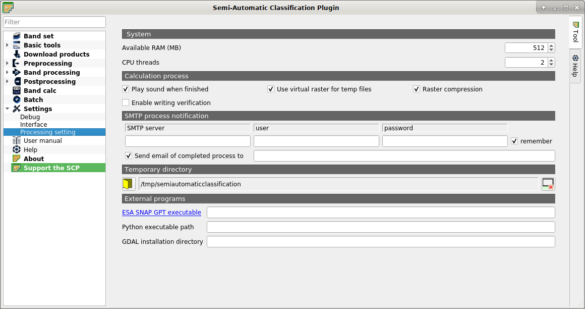

.. _settings_processing_tab:

******************************
Processing
******************************

.. contents::
    :depth: 2
    :local:
	
.. |registry_save| image:: _static/registry_save.png
	:width: 20pt
	
.. |project_save| image:: _static/project_save.png
	:width: 20pt
	
.. |optional| image:: _static/optional.png
	:width: 20pt
	
.. |input_list| image:: _static/input_list.jpg
	:width: 20pt
	
.. |input_text| image:: _static/input_text.jpg
	:width: 20pt
	
.. |checkbox| image:: _static/checkbox.png
	:width: 18pt
	
.. |reset| image:: _static/semiautomaticclassificationplugin_reset.png
	:width: 20pt
	
.. |input_number| image:: _static/input_number.jpg
	:width: 20pt
	
.. |open_dir| image:: _static/semiautomaticclassificationplugin_open_dir.png
	:width: 20pt

	
	:guilabel:`Processing`
	
.. _system_processing:

System
^^^^^^^^^^^^^^^^^^^^^^^^^

* :guilabel:`Available RAM (MB)` |input_number| |registry_save|: set the available RAM (in MB) that is used during the processes in order to improve the :guilabel:`SCP` performance; this value should be half of the system RAM (e.g. 1024MB if system has 2GB of RAM); in case of errors, set a value lower than 512MB;
* :guilabel:`CPU threads` |input_number| |registry_save|: set the number of threads available for processing; it is recommended to set a value lower than the maximum number of system threads (e.g. if the system has 4 available threads set value 3);

.. raw:: html

	<iframe allowfullscreen="" frameborder="0" height="360" src="http://www.youtube.com/embed/KDI3ud9L6UY?rel=0" width="100%"></iframe>

http://www.youtube.com/watch?v=KDI3ud9L6UY

.. _classification_process:

Classification process
^^^^^^^^^^^^^^^^^^^^^^^^^

* |checkbox| :guilabel:`Play sound when finished` |registry_save|: if checked, play a sound when the classification process is completed;
* |checkbox| :guilabel:`Use virtual rasters for temp files` |registry_save|: if checked, create virtual rasters for certain temporary files, instead of creating real rasters; it is useful for reducing disk space usage during calculations;
* |checkbox| :guilabel:`Raster compression` |registry_save|: if checked, a lossless compression (DEFLATE or PACKBITS) is applied to raster outputs in order to save disk space; it is recommended to check this option, however compressed files are sometimes larger than files without compression;
* |checkbox| :guilabel:`Enable writing verification` |registry_save|: if checked, the output raster is compared to output calculation in order to avoid writing errors; it can slow the process;

.. _smtp_notification:

SMTP process notification
^^^^^^^^^^^^^^^^^^^^^^^^^^^^^^^^^^^^

* :guilabel:`SMTP server` |input_text| |registry_save|: the SMTP server to login for sending a notification email when all the :guilabel:`SCP` processes are finished (a notification is sent also in case of error, but not in case of crash);
* :guilabel:`user` |input_text| |registry_save|: the SMTP server user;
* :guilabel:`password` |input_text| |registry_save|: the SMTP server password;
* :guilabel:`Send email of completed process to` |input_text| |registry_save|: a list of addresses (separated by comma) to send the notification email to;

.. _external_programs:

External programs
^^^^^^^^^^^^^^^^^^

Some SCP tools require external programs to perform the processing.

* :guilabel:`ESA SNAP GPT executable` |input_text| |registry_save| |optional|: enter the path to the SNAP gpt executable; usually ``C:/snap/bin/gpt.exe`` for Windows, ``/Applications/snap/bin/gpt`` for Mac, and ``/usr/local/snap/bin/gpt`` for Linux; for the installation of ESA SNAP, please visit this page http://step.esa.int/main/download/snap-download/ ;
* :guilabel:`Python executable path` |input_text| |registry_save| |optional|: enter the path to the Python 3 executable (e.g. ``/usr/local/bin/python3``); should be used only in case of issues with multiprocessing;
* :guilabel:`Python modules path` |input_text| |registry_save| |optional|: enter the path to Python modules (e.g. /Applications/QGIS.app/Contents/MacOS/lib/python3.8/site-packages); multiple paths can be entered separated by ``;`` ; QGIS should be restarted;
* :guilabel:`GDAL installation directory` |input_text| |registry_save| |optional|: enter the path to the GDAL directory containing tools such as gdal_translate and gdalwarp (e.g. ``/usr/bin``); should be used only in case of issues with GDAL processing;

.. _temporary_directory:

Temporary directory
^^^^^^^^^^^^^^^^^^^^^^

* |open_dir| |registry_save|: select a new temporary directory where temporary files are saved during processing; the path to the current temporary directory is displayed; default is a system temporary directory;
* |reset|: reset to default temporary directory;