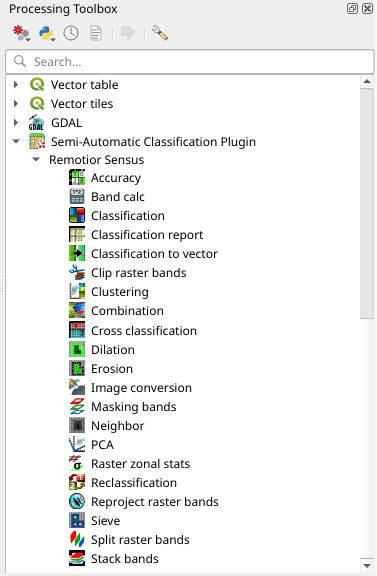

.. _qgis_processing:

******************************
Integration in QGIS Processing
******************************

Several :guilabel:`SCP` tools can be accessed
from the QGIS Processing Toolbox, and can be used to create models.
The tools are available in the menu
:guilabel:`Semi-Automatic Classification Plugin`.

    :guilabel:`Integration in QGIS Processing Toolbox`
