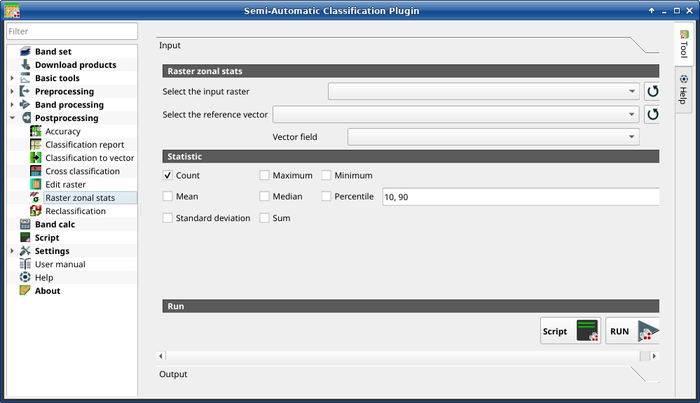

.. _raster_zonal_stats_tab:

******************************************
Raster zonal stats (complete interface)
******************************************

.. contents::
    :local:

.. |registry_save| image:: _static/registry_save.png
    :width: 20pt

.. |project_save| image:: _static/project_save.png
    :width: 20pt

.. |optional| image:: _static/optional.png
    :width: 20pt

.. |input_list| image:: _static/input_list.jpg
    :width: 20pt

.. |input_text| image:: _static/input_text.jpg
    :width: 20pt

.. |input_date| image:: _static/input_date.jpg
    :width: 20pt

.. |input_number| image:: _static/input_number.jpg
    :width: 20pt

.. |input_table| image:: _static/input_table.jpg
    :width: 20pt

.. |open_file| image:: _static/semiautomaticclassificationplugin_open_file.png
    :width: 20pt

.. |new_file| image:: _static/semiautomaticclassificationplugin_new_file.png
    :width: 20pt

.. |add| image:: _static/semiautomaticclassificationplugin_add.png
    :width: 20pt

.. |reset| image:: _static/semiautomaticclassificationplugin_reset.png
    :width: 20pt

.. |bandset_tool| image:: _static/semiautomaticclassificationplugin_bandset_tool.png
    :width: 20pt

.. |download| image:: _static/semiautomaticclassificationplugin_download_arrow.png
    :width: 20pt

.. |export| image:: _static/semiautomaticclassificationplugin_export.png
    :width: 20pt

.. |tools| image:: _static/semiautomaticclassificationplugin_roi_tool.png
    :width: 20pt

.. |preprocessing| image:: _static/semiautomaticclassificationplugin_class_tool.png
    :width: 20pt

.. |band_processing| image:: _static/semiautomaticclassificationplugin_band_processing.png
    :width: 20pt

.. |postprocessing| image:: _static/semiautomaticclassificationplugin_post_process.png
    :width: 20pt

.. |bandcalc| image:: _static/semiautomaticclassificationplugin_bandcalc_tool.png
    :width: 20pt

.. |settings| image:: _static/semiautomaticclassificationplugin_settings_tool.png
    :width: 20pt

.. |script_tool| image:: _static/semiautomaticclassificationplugin_script.png
    :width: 20pt

.. |enter| image:: _static/semiautomaticclassificationplugin_enter.png
    :width: 20pt

.. |zoom_to_ROI| image:: _static/semiautomaticclassificationplugin_zoom_to_ROI.png
    :width: 20pt

.. |check| image:: _static/semiautomaticclassificationplugin_batch_check.png
    :width: 20pt

.. |select_all| image:: _static/semiautomaticclassificationplugin_select_all.png
    :width: 20pt

.. |docks| image:: _static/semiautomaticclassificationplugin_docks.png
    :width: 20pt

.. |add_sign_tool| image:: _static/semiautomaticclassificationplugin_add_sign_tool.png
    :width: 20pt

.. |guide| image:: _static/guide.png
    :width: 20pt

.. |help| image:: _static/help.png
    :width: 20pt

.. |reload| image:: _static/semiautomaticclassificationplugin_reload.png
    :width: 20pt

.. |checkbox| image:: _static/checkbox.png
    :width: 18pt

.. |run| image:: _static/semiautomaticclassificationplugin_run.png
    :width: 24pt

.. |radiobutton| image:: _static/radiobutton.png
    :width: 18pt

.. |remove| image:: _static/semiautomaticclassificationplugin_remove.png
    :width: 20pt

.. |import| image:: _static/semiautomaticclassificationplugin_import.png
    :width: 20pt

.. |threshold_tool| image:: _static/semiautomaticclassificationplugin_threshold_tool.png
    :width: 20pt

    :guilabel:`Raster zonal stats`

This tab allows for calculating the statistics related to an input raster for
every unique value of a reference vector.
For example, if a vector file contains a numeric field ``zone``, this tool
allows for calculating the mean value (for each zone) of input raster pixels.
It is loaded only if the :guilabel:`Simplified interface` is not enabled.

.. tip::
    Information about APIs of this tool in Remotior Sensus at this
    `link <https://remotior-sensus.readthedocs.io/en/latest/remotior_sensus.tools.raster_zonal_stats.html>`_ .

.. _zonal_stat_raster:

Raster zonal stat
^^^^^^^^^^^^^^^^^^^^^^^^^^^^^^^^^^^^^^^

.. list-table::
    :widths: auto
    :header-rows: 1

    * - Tool symbol and name
      - Description
    * - :guilabel:`Select the input raster` |input_list|
      - select a raster (already loaded in QGIS)
    * - |reload|
      - refresh layer list
    * - :guilabel:`Select the reference vector or raster` |input_list|
      - select a raster or a vector (already loaded in QGIS), used as
        reference layer for zones
    * - |reload|
      - refresh layer list
    * - :guilabel:`Vector field` |input_list|
      - if a vector is selected as reference, select a vector field containing
        numeric values

.. _zonal_stat_statistic:

Statistic
^^^^^^^^^^^^^^^^^^^^^^^^^^^^^^^^^^^^^^^

.. list-table::
    :widths: auto
    :header-rows: 1

    * - Tool symbol and name
      - Description
    * - |checkbox| :guilabel:`Count` |optional|
      - if checked, calculate Count statistic
    * - |checkbox| :guilabel:`Maximum` |optional|
      - if checked, calculate Maximum statistic
    * - |checkbox| :guilabel:`Minimum` |optional|
      - if checked, calculate Minimum statistic
    * - |checkbox| :guilabel:`Mean` |optional|
      - if checked, calculate Mean statistic
    * - |checkbox| :guilabel:`Median` |optional|
      - if checked, calculate Median statistic
    * - |checkbox| :guilabel:`Percentile` |optional| |input_text|
      - if checked, calculate Percentile statistic; multimple percentile
        values can be entered separated by comma in the input text
    * - |checkbox| :guilabel:`Standard deviation` |optional|
      - if checked, calculate Standard deviation statistic
    * - |checkbox| :guilabel:`Sum` |optional|
      - if checked, calculate Sum statistic

.. _zonal_stat_run:

Run
^^^^^^^^^^^^^^^^^^^^^^^^^^^^^^^^^^^^^^^

.. list-table::
    :widths: auto
    :header-rows: 1

    * - Tool symbol and name
      - Description
    * - :guilabel:`Script` |script_tool|
      - add this function to the :ref:`script_tab`
    * - :guilabel:`RUN` |run|
      - run this function
