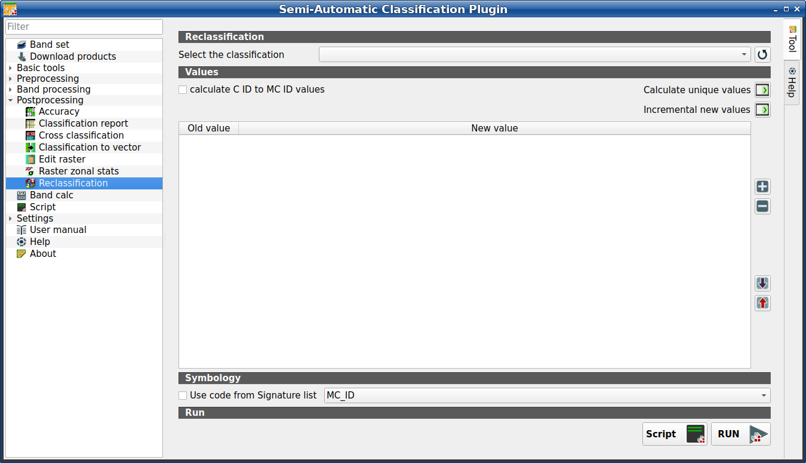

.. _reclassification_tab:

******************************
Reclassification
******************************

.. contents::
    :local:

.. |registry_save| image:: _static/registry_save.png
    :width: 20pt

.. |project_save| image:: _static/project_save.png
    :width: 20pt

.. |optional| image:: _static/optional.png
    :width: 20pt

.. |input_list| image:: _static/input_list.jpg
    :width: 20pt

.. |input_text| image:: _static/input_text.jpg
    :width: 20pt

.. |input_date| image:: _static/input_date.jpg
    :width: 20pt

.. |input_number| image:: _static/input_number.jpg
    :width: 20pt

.. |input_table| image:: _static/input_table.jpg
    :width: 20pt

.. |open_file| image:: _static/semiautomaticclassificationplugin_open_file.png
    :width: 20pt

.. |new_file| image:: _static/semiautomaticclassificationplugin_new_file.png
    :width: 20pt

.. |add| image:: _static/semiautomaticclassificationplugin_add.png
    :width: 20pt

.. |reset| image:: _static/semiautomaticclassificationplugin_reset.png
    :width: 20pt

.. |bandset_tool| image:: _static/semiautomaticclassificationplugin_bandset_tool.png
    :width: 20pt

.. |download| image:: _static/semiautomaticclassificationplugin_download_arrow.png
    :width: 20pt

.. |export| image:: _static/semiautomaticclassificationplugin_export.png
    :width: 20pt

.. |tools| image:: _static/semiautomaticclassificationplugin_roi_tool.png
    :width: 20pt

.. |preprocessing| image:: _static/semiautomaticclassificationplugin_class_tool.png
    :width: 20pt

.. |band_processing| image:: _static/semiautomaticclassificationplugin_band_processing.png
    :width: 20pt

.. |postprocessing| image:: _static/semiautomaticclassificationplugin_post_process.png
    :width: 20pt

.. |bandcalc| image:: _static/semiautomaticclassificationplugin_bandcalc_tool.png
    :width: 20pt

.. |settings| image:: _static/semiautomaticclassificationplugin_settings_tool.png
    :width: 20pt

.. |script_tool| image:: _static/semiautomaticclassificationplugin_script.png
    :width: 20pt

.. |enter| image:: _static/semiautomaticclassificationplugin_enter.png
    :width: 20pt

.. |zoom_to_ROI| image:: _static/semiautomaticclassificationplugin_zoom_to_ROI.png
    :width: 20pt

.. |check| image:: _static/semiautomaticclassificationplugin_batch_check.png
    :width: 20pt

.. |select_all| image:: _static/semiautomaticclassificationplugin_select_all.png
    :width: 20pt

.. |docks| image:: _static/semiautomaticclassificationplugin_docks.png
    :width: 20pt

.. |add_sign_tool| image:: _static/semiautomaticclassificationplugin_add_sign_tool.png
    :width: 20pt

.. |guide| image:: _static/guide.png
    :width: 20pt

.. |help| image:: _static/help.png
    :width: 20pt

.. |reload| image:: _static/semiautomaticclassificationplugin_reload.png
    :width: 20pt

.. |checkbox| image:: _static/checkbox.png
    :width: 18pt

.. |run| image:: _static/semiautomaticclassificationplugin_run.png
    :width: 24pt

.. |radiobutton| image:: _static/radiobutton.png
    :width: 18pt

.. |remove| image:: _static/semiautomaticclassificationplugin_remove.png
    :width: 20pt

.. |import| image:: _static/semiautomaticclassificationplugin_import.png
    :width: 20pt

.. |threshold_tool| image:: _static/semiautomaticclassificationplugin_threshold_tool.png
    :width: 20pt

    :guilabel:`Reclassification`

This tab allows for the reclassification (i.e. assigning a new class code to
raster pixels).
In particular, it eases the conversion from C ID to MC ID values.

This tool supports ``virtual raster output``; if the output file name ends
with ``.vrt`` then the output is created as virtual raster composed of as many
``.tif`` files as the number of CPU threads defined in
:ref:`system_processing`; for large rasters this can speed up the process.

.. tip::
    Information about APIs of this tool in Remotior Sensus at this
    `link <https://remotior-sensus.readthedocs.io/en/latest/remotior_sensus.tools.raster_reclassification.html>`_ .

.. _reclassification_input:

Cross classification
^^^^^^^^^^^^^^^^^^^^^^^^

.. list-table::
    :widths: auto
    :header-rows: 1

    * - Tool symbol and name
      - Description
    * - :guilabel:`Select the classification` |input_list|
      - select a classification raster (already loaded in QGIS)
    * - |reload|
      - refresh layer list

.. _reclass_values:

Values
^^^^^^^^^^^^^^^^^^^^^^^^^^^^^^^^^^^^^^^

.. list-table::
    :widths: auto
    :header-rows: 1

    * - Tool symbol and name
      - Description
    * - |checkbox| :guilabel:`calculate C ID to MC ID values`
      - if checked, the reclassification table is filled according to the
        :ref:`ROI_list` when :guilabel:`Calculate unique values` |enter| is
        clicked
    * - :guilabel:`Calculate unique values` |enter|
      - calculate unique values in the classification and fill the
        reclassification table
    * - :guilabel:`Incremental new values` |enter|
      - calculate a new incremental value (e.g. 1, 2, 3, ...) for every old
        value and fill the reclassification table
    * - |add|
      - add a row to the table
    * - |remove|
      - remove highlighted rows from the table
    * - |import|
      - import rules from a text file .csv  separated by comma having the
        following structure ``Old_value,New_value`` (where Old_value cam be
        also an expression and New_value is an integer value) for instance::
        raster < 1,1
        (raster > 1) & (raster < 3),2
        raster < 3,3
    * - |export|
      - export the reclassification table to a text file (.csv) that can be
        imported later

The reclassification table is structured with the following fields.

.. list-table::
    :widths: auto
    :header-rows: 1

    * - Old value
      - New value
    * - value or expression defining old values to be reclassified
      - integer value for the corresponding ``Old value``

``Old value`` can be a value or an expressions defined using the variable name
``raster`` (custom names can be defined in :ref:`variable_name` ),
following Python operators (e.g.:

* ``raster > 3`` select all pixels having value > 3 ;
* ``(raster > 5) | (raster < 2)`` select all pixels having value > 5 or < 2 ;
* ``(raster >= 2) & (raster <= 5)`` select all pixel values between 2 and 5.

.. _reclass_symbology:

Symbology
^^^^^^^^^^^^^^^^^^^^^^^^^^^^^^^^^^^^^^^

.. list-table::
    :widths: auto
    :header-rows: 1

    * - Tool symbol and name
      - Description
    * - |checkbox| :guilabel:`Use code from Signature list` |input_list|
      - if checked, color and class information are defined from :ref:`ROI_list`:
            * ``MC ID``: use the ID of macroclasses
            * ``C ID``: use the ID of classes

.. _reclass_run:

Run
^^^^^^^^^^^^^^^^^^^^^^^^^^^^^^^^^^^^^^^

.. list-table::
    :widths: auto
    :header-rows: 1

    * - Tool symbol and name
      - Description
    * - :guilabel:`Script` |script_tool|
      - add this function to the :ref:`script_tab`
    * - :guilabel:`RUN` |run|
      - run this function
