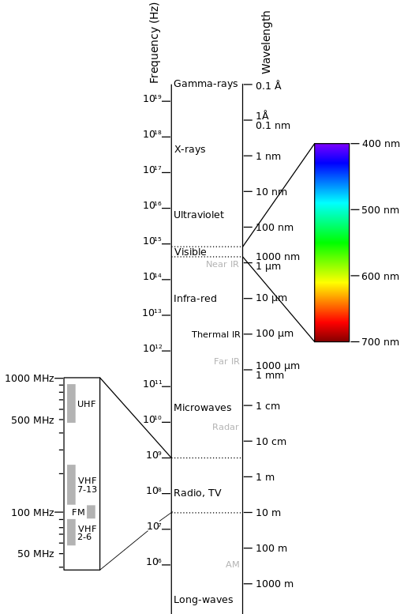
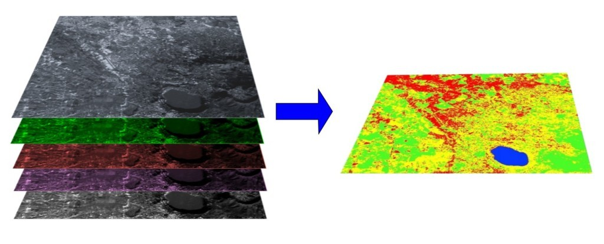
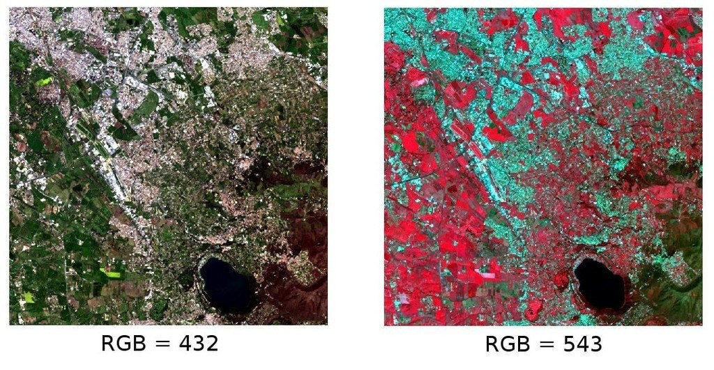
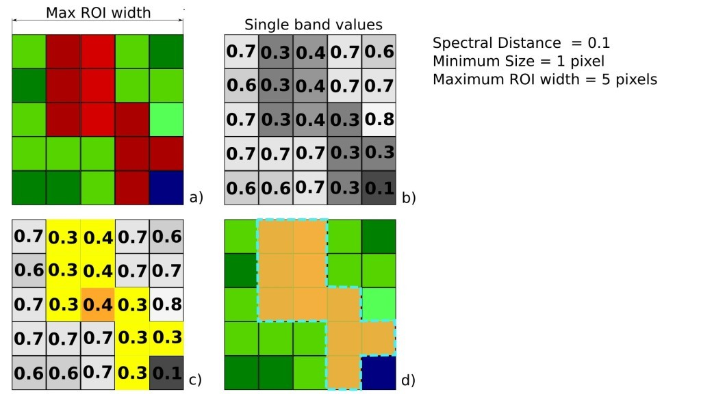
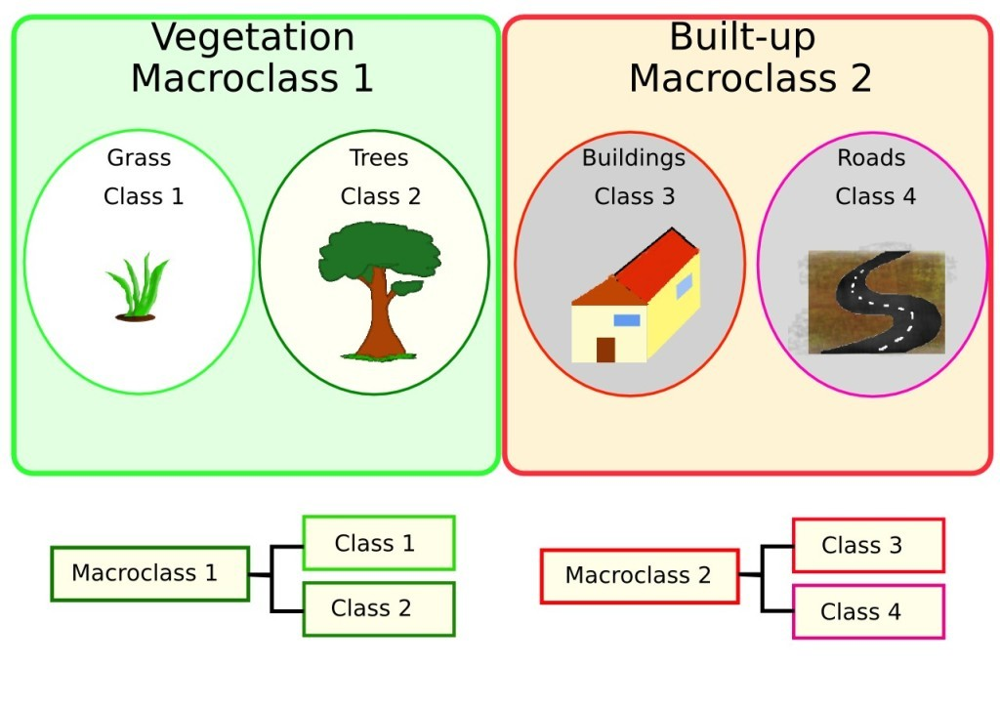
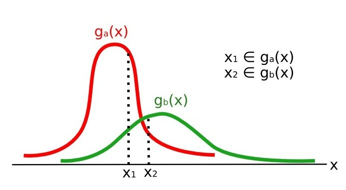
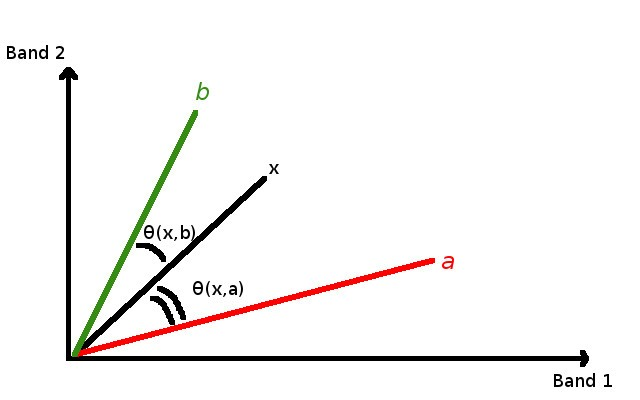
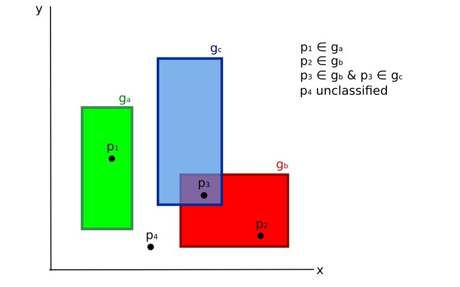
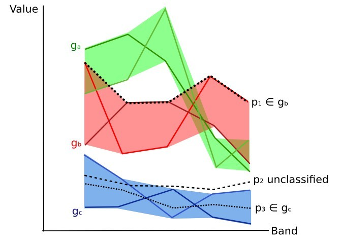
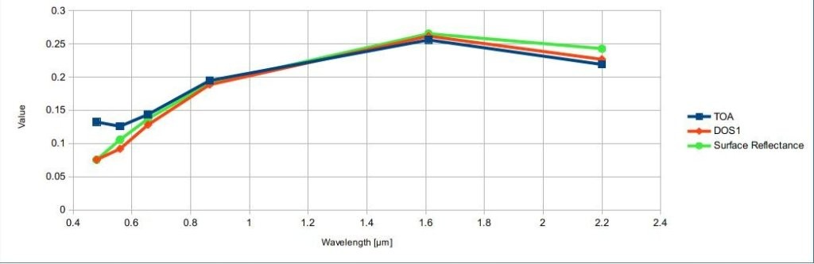

.. _remote_sensing:

************************************
Brief Introduction to Remote Sensing
************************************

.. |br| raw:: html

  
  
  
.. contents::
    :depth: 2
    :local:
	
.. _basic_definitions:
 
Basic Definitions
=================

This chapter provides basic definitions about GIS and remote sensing.
For other useful resources see :ref:`other_2`.

.. _GIS_definition:

GIS definition
-------------------------

There are several definitions of **GIS** (Geographic Information Systems), which is not simply a program. In general, GIS are systems that allow for the use of geographic information (data have spatial coordinates). In particular, GIS allow for the view, query, calculation and analysis of spatial data, which are mainly distinguished in raster or vector data structures. Vector is made of objects that can be points, lines or polygons, and each object can have one ore more attribute values; a raster is a grid (or image) where each cell has an attribute value (Fisher and Unwin, 2005).
Several GIS applications use raster images that are derived from remote sensing.

.. _Remote_Sensing_definition:

Remote Sensing definition
-------------------------

A general definition of **Remote Sensing** is "the science and technology by which the characteristics of objects of interest can be identified, measured or analyzed the characteristics without direct contact" (JARS, 1993).

Usually, remote sensing is the measurement of the energy that is emanated from the Earth’s surface. If the source of the measured energy is the sun, then it is called **passive remote sensing**, and the result of this measurement can be a digital image (Richards and Jia, 2006). If the measured energy is not emitted by the Sun but from the sensor platform then it is defined as **active remote sensing**, such as radar sensors which work in the microwave range (Richards and Jia, 2006).

The **electromagnetic spectrum** is "the system that classifies, according to wavelength, all energy (from short cosmic to long radio) that moves, harmonically, at the constant velocity of light" (NASA, 2013). Passive sensors measure energy from the optical regions of the electromagnetic spectrum: visible, near infrared (i.e. IR), short-wave IR, and thermal IR (see Figure :ref:`figEM`).

.. _figEM:

	
	:guilabel:`Electromagnetic-Spectrum`
	
	``by Victor Blacus (SVG version of File:Electromagnetic-Spectrum.png)``
	
	``[CC-BY-SA-3.0 (http://creativecommons.org/licenses/by-sa/3.0)]``
	
	``via Wikimedia Commons``
	
	``http://commons.wikimedia.org/wiki/File%3AElectromagnetic-Spectrum.svg``
	
|br|

The interaction between solar energy and materials depends on the wavelength; solar energy goes from the Sun to the Earth and then to the sensor. Along this path, **solar energy** is (NASA, 2013):

* **Transmitted** - The energy passes through with a change in velocity as determined by the index of refraction for the two media in question.

* **Absorbed** - The energy is given up to the object through electron or molecular reactions.

* **Reflected** - The energy is returned unchanged with the angle of incidence equal to the angle of reflection. Reflectance is the ratio of reflected energy to that incident on a body. The wavelength reflected (not absorbed) determines the color of an object.

* **Scattered** - The direction of energy propagation is randomly changed. Rayleigh and Mie scatter are the two most important types of scatter in the atmosphere.

* **Emitted** - Actually, the energy is first absorbed, then re-emitted, usually at longer wavelengths. The object heats up.

.. _Sensors_definition:

Sensors
-------------------------

**Sensors** can be on board of airplanes or on board of satellites, measuring the electromagnetic radiation at specific ranges (usually called bands). As a result, the measures are quantized and converted into a digital image, where each picture elements (i.e. pixel) has a discrete value in units of Digital Number (DN) (NASA, 2013). The resulting images have different characteristics (resolutions) depending on the sensor.
There are several kinds of **resolutions**:

* **Spatial resolution**, usually measured in pixel size, "is the resolving power of an instrument needed for the discrimination of features and is based on detector size, focal length, and sensor altitude" (NASA, 2013); spatial resolution is also referred to as geometric resolution or IFOV;

* **Spectral resolution**, is the number and location in the electromagnetic spectrum (defined by two wavelengths) of the spectral bands (NASA, 2013) in multispectral sensors, for each band corresponds an image;

* **Radiometric resolution**, usually measured in bits (binary digits), is the range of available brightness values, which in the image correspond to the maximum range of DNs; for example an image with 8 bit resolution has 256 levels of brightness (Richards and Jia, 2006);

* For satellites sensors, there is also the **temporal resolution**, which is the time required for revisiting the same area of the Earth (NASA, 2013).

.. _radiance_reflectance_definition:

Radiance and Reflectance
-------------------------

Sensors measure the **radiance**, which corresponds to the brightness in a given direction toward the sensor; it useful to define also the **reflectance** as the ratio of reflected versus total power energy.

.. _spectral_signature_definition:

Spectral Signature
-------------------------

The **spectral signature** is the reflectance as a function of wavelength  (see Figure :ref:`figSR`); each material has a unique signature, therefore it can be used for material classification (NASA, 2013).

.. _figSR:

.. figure:: _static/Spectral_Reflectance_NASA.jpg
	:align: center
	
	:guilabel:`Spectral Reflectance Curves of Four Different Targets`
	
	``(from NASA, 2013)``
	

.. _Land_cover_definition:

Land Cover
-------------------------

**Land cover** is the material at the ground, such as soil, vegetation, water, asphalt, etc. (Fisher and Unwin, 2005).
Depending on the sensor resolutions, the number and kind of land cover classes that can be identified in the image can vary significantly.

.. _multispectral_satellites:
 
Multispectral satellites
==========================

There are several satellites with different characteristics that acquire multispectral images of earth surface.
The following satellites are particularly useful for land cover monitoring because images are provided for free and can be downloaded directly from :guilabel:`SCP`; data have been acquired for the past few decades and the archive is continously growing with recent images.

.. _Landsat_definition:

Landsat Satellites
-------------------------

**Landsat** is a set of multispectral satellites developed by the NASA (National Aeronautics and Space Administration of USA), since the early 1970’s.

Landsat images are very used for environmental research. The resolutions of Landsat 4 and Landsat 5 sensors are reported in the following table (from http://landsat.usgs.gov/band_designations_landsat_satellites.php); also, Landsat temporal resolution is 16 days (NASA, 2013).

	:guilabel:`Landsat 4 and Landsat 5 Bands`
	
+-------------------------------------+--------------------------+------------------------+
| Landsat 4, Landsat 5 Bands          | Wavelength [micrometers] |  Resolution [meters]   |
+=====================================+==========================+========================+
| Band 1 - Blue                       | 0.45 - 0.52              |  30                    |
+-------------------------------------+--------------------------+------------------------+
| Band 2 - Green                      | 0.52 - 0.60              |  30                    |
+-------------------------------------+--------------------------+------------------------+
| Band 3 - Red                        | 0.63 - 0.69              |  30                    |
+-------------------------------------+--------------------------+------------------------+
| Band 4 - Near Infrared (NIR)        | 0.76 - 0.90              |  30                    |
+-------------------------------------+--------------------------+------------------------+
| Band 5 - SWIR                       | 1.55 - 1.75              |  30                    |
+-------------------------------------+--------------------------+------------------------+
| Band 6 - Thermal Infrared           | 10.40 - 12.50            |  120 (resampled to 30) |
+-------------------------------------+--------------------------+------------------------+
| Band 7 - SWIR                       | 2.08 - 2.35              |  30                    |
+-------------------------------------+--------------------------+------------------------+

The resolutions of Landsat 7 sensor are reported in the following table (from http://landsat.usgs.gov/band_designations_landsat_satellites.php); also, Landsat temporal resolution is 16 days (NASA, 2013).

	:guilabel:`Landsat 7 Bands`
	
+-------------------------------------+--------------------------+------------------------+
| Landsat 7 Bands                     | Wavelength [micrometers] |  Resolution [meters]   |
+=====================================+==========================+========================+
| Band 1 - Blue                       | 0.45 - 0.52              |  30                    |
+-------------------------------------+--------------------------+------------------------+
| Band 2 - Green                      | 0.52 - 0.60              |  30                    |
+-------------------------------------+--------------------------+------------------------+
| Band 3 - Red                        | 0.63 - 0.69              |  30                    |
+-------------------------------------+--------------------------+------------------------+
| Band 4 - Near Infrared (NIR)        | 0.77 - 0.90              |  30                    |
+-------------------------------------+--------------------------+------------------------+
| Band 5 - SWIR                       | 1.57 - 1.75              |  30                    |
+-------------------------------------+--------------------------+------------------------+
| Band 6 - Thermal Infrared           | 10.40 - 12.50            |  60 (resampled to 30)  |
+-------------------------------------+--------------------------+------------------------+
| Band 7 - SWIR                       | 2.09 - 2.35              |  30                    |
+-------------------------------------+--------------------------+------------------------+
| Band 8 - Panchromatic               | 0.52 - 0.90              |  15                    |
+-------------------------------------+--------------------------+------------------------+

The resolutions of Landsat 8 sensor are reported in the following table (from http://landsat.usgs.gov/band_designations_landsat_satellites.php); also, Landsat temporal resolution is 16 days (NASA, 2013).

	:guilabel:`Landsat 8 Bands`
	
+-------------------------------------+--------------------------+------------------------+
| Landsat 8 Bands                     | Wavelength [micrometers] |  Resolution [meters]   |
+=====================================+==========================+========================+
| Band 1 - Coastal aerosol            | 0.43 - 0.45              |  30                    |
+-------------------------------------+--------------------------+------------------------+
| Band 2 - Blue                       | 0.45 - 0.51              |  30                    |
+-------------------------------------+--------------------------+------------------------+
| Band 3 - Green                      |  0.53 - 0.59             |  30                    |
+-------------------------------------+--------------------------+------------------------+
| Band 4 - Red                        | 0.64 - 0.67              |  30                    |
+-------------------------------------+--------------------------+------------------------+
| Band 5 - Near Infrared (NIR)        | 0.85 - 0.88              |  30                    |
+-------------------------------------+--------------------------+------------------------+
| Band 6 - SWIR 1                     | 1.57 - 1.65              |  30                    |
+-------------------------------------+--------------------------+------------------------+
| Band 7 - SWIR 2                     | 2.11 - 2.29              |  30                    |
+-------------------------------------+--------------------------+------------------------+
| Band 8 - Panchromatic               | 0.50 - 0.68              |  15                    |
+-------------------------------------+--------------------------+------------------------+
| Band 9 - Cirrus                     | 1.36 - 1.38              |  30                    |
+-------------------------------------+--------------------------+------------------------+
| Band 10 - Thermal Infrared (TIRS) 1 | 10.60 - 11.19            |  100 (resampled to 30) |
+-------------------------------------+--------------------------+------------------------+
| Band 11 - Thermal Infrared (TIRS) 2 | 11.50 - 12.51            |  100 (resampled to 30) |
+-------------------------------------+--------------------------+------------------------+

A vast archive of images is freely available from the `U.S. Geological Survey <http://www.usgs.gov/>`_ . For more information about how to freely download Landsat images read `this  <https://fromgistors.blogspot.com/2014/11/landsat-images-overview-of-worldwide.html>`_ .

Images are identified with the paths and rows of the WRS (`Worldwide Reference System for Landsat <http://landsat.gsfc.nasa.gov/?p=3231>`_ ).

.. _Sentinel2_definition:

Sentinel-2 Satellite
-------------------------

**Sentinel-2** is a multispectral satellite developed by the European Space Agency (ESA) in the frame of `Copernicus <http://copernicus.eu/>`_ land monitoring services.
Sentinel-2 acquires 13 spectral bands with the spatial resolution of 10m, 20m and 60m depending on the band, as illustrated in the following table (ESA, 2015).

	:guilabel:`Sentinel-2 Bands`
	
+-------------------------------------+-------------------------------------+------------------------+
| Sentinel-2 Bands                    | Central Wavelength  [micrometers]   |  Resolution [meters]   |
+=====================================+=====================================+========================+
| Band 1 - Coastal aerosol            | 0.443                               |  60                    |
+-------------------------------------+-------------------------------------+------------------------+
| Band 2 - Blue                       | 0.490                               |  10                    |
+-------------------------------------+-------------------------------------+------------------------+
| Band 3 - Green                      |  0.560                              |  10                    |
+-------------------------------------+-------------------------------------+------------------------+
| Band 4 - Red                        | 0.665                               |  10                    |
+-------------------------------------+-------------------------------------+------------------------+
| Band 5 - Vegetation Red Edge        | 0.705                               |  20                    |
+-------------------------------------+-------------------------------------+------------------------+
| Band 6 - Vegetation Red Edge        | 0.740                               |  20                    |
+-------------------------------------+-------------------------------------+------------------------+
| Band 7 - Vegetation Red Edge        | 0.783                               |  20                    |
+-------------------------------------+-------------------------------------+------------------------+
| Band 8 - NIR                        | 0.842                               |  10                    |
+-------------------------------------+-------------------------------------+------------------------+
| Band 8A - Vegetation Red Edge       | 0.865                               |  20                    |
+-------------------------------------+-------------------------------------+------------------------+
| Band 9 - Water vapour               | 0.945                               |  60                    |
+-------------------------------------+-------------------------------------+------------------------+
| Band 10 - SWIR - Cirrus             | 1.375                               |  60                    |
+-------------------------------------+-------------------------------------+------------------------+
| Band 11 - SWIR                      | 1.610                               |  20                    |
+-------------------------------------+-------------------------------------+------------------------+
| Band 12 - SWIR                      | 2.190                               |  20                    |
+-------------------------------------+-------------------------------------+------------------------+

Sentinel-2 images are freely available from the ESA website https://scihub.copernicus.eu.

.. _Sentinel3_definition:

Sentinel-3 Satellite
-------------------------

**Sentinel-3** is a satellite developed by the European Space Agency (ESA) in the frame of `Copernicus <http://copernicus.eu/>`_ land monitoring services.
It carries several instruments, in particular the Ocean and Land Colour Instrument (OLCI) is a push-broom imaging spectrometer acquiring 21 bands in the range 0.4-1.02 μm with a swath width of 1,270km and 300m spatial resolution (ESA, 2013).
The revisit time is about 2 days.

	:guilabel:`Sentinel-3 Bands`
	
+-------------------------------------+-------------------------------------+
| Sentinel-3 Bands                    | Central Wavelength  [micrometers]   |
+=====================================+=====================================+
| Oa1	                              | 0.400                               |
+-------------------------------------+-------------------------------------+
| Oa2	                              | 0.4125                              |
+-------------------------------------+-------------------------------------+
| Oa3	                              | 0.4425                              |
+-------------------------------------+-------------------------------------+
| Oa4	                              | 0.490                               |
+-------------------------------------+-------------------------------------+
| Oa5	                              | 0.510                               |
+-------------------------------------+-------------------------------------+
| Oa6	                              | 0.560                               |
+-------------------------------------+-------------------------------------+
| Oa7                                 | 0.620                               |
+-------------------------------------+-------------------------------------+
| Oa8	                              | 0.665                               |
+-------------------------------------+-------------------------------------+
| Oa9	                              | 0.67375                             |
+-------------------------------------+-------------------------------------+
| Oa10                                | 0.68125                             |
+-------------------------------------+-------------------------------------+
| Oa11	                              | 0.70875                             |
+-------------------------------------+-------------------------------------+
| Oa12	                              | 0.75375                             |
+-------------------------------------+-------------------------------------+
| Oa13	                              | 0.76125                             |
+-------------------------------------+-------------------------------------+
| Oa14	                              | 0.764375                            |
+-------------------------------------+-------------------------------------+
| Oa15	                              | 0.7675                              |
+-------------------------------------+-------------------------------------+
| Oa16	                              | 0.77875                             |
+-------------------------------------+-------------------------------------+
| Oa17	                              | 0.865                               |
+-------------------------------------+-------------------------------------+
| Oa18	                              | 0.885                               |
+-------------------------------------+-------------------------------------+
| Oa19	                              | 0.900                               |
+-------------------------------------+-------------------------------------+
| Oa20	                              | 0.940                               |
+-------------------------------------+-------------------------------------+
| Oa21	                              | 1.020                               |
+-------------------------------------+-------------------------------------+

.. _ASTER_definition:

ASTER Satellite
-------------------------

The **ASTER** (Advanced Spaceborne Thermal Emission and Reflection Radiometer) satellite was launched in 1999 by a collaboration between the Japanese Ministry of International Trade and Industry (MITI) and the NASA.
ASTER has 14 bands whose spatial resolution varies with wavelength: 15m in the visible and near-infrared, 30m in the short wave infrared, and 90m in the thermal infrared (USGS, 2015).
ASTER bands are illustrated in the following table (due to a sensor failure **SWIR data acquired since April 1, 2008 is not available** ).
An additional band 3B (backwardlooking near-infrared) provides stereo coverage.

	:guilabel:`ASTER Bands`
	
+-------------------------------------+--------------------------+------------------------+
| ASTER Bands                         | Wavelength [micrometers] |  Resolution [meters]   |
+=====================================+==========================+========================+
| Band 1 - Green                      | 0.52 - 0.60              |  15                    |
+-------------------------------------+--------------------------+------------------------+
| Band 2 - Red                        | 0.63 - 0.69              |  15                    |
+-------------------------------------+--------------------------+------------------------+
| Band 3N - Near Infrared (NIR)       | 0.78 - 0.86              |  15                    |
+-------------------------------------+--------------------------+------------------------+
| Band 4 - SWIR 1                     | 1.60 - 1.70              |  30                    |
+-------------------------------------+--------------------------+------------------------+
| Band 5 - SWIR 2                     | 2.145 - 2.185            |  30                    |
+-------------------------------------+--------------------------+------------------------+
| Band 6 - SWIR 3                     | 2.185 - 2.225            |  30                    |
+-------------------------------------+--------------------------+------------------------+
| Band 7 - SWIR 4                     | 2.235 - 2.285            |  30                    |
+-------------------------------------+--------------------------+------------------------+
| Band 8 - SWIR 5                     | 2.295 - 2.365            |  30                    |
+-------------------------------------+--------------------------+------------------------+
| Band 9 - SWIR 6                     | 2.360 - 2.430            |  30                    |
+-------------------------------------+--------------------------+------------------------+
| Band 10 - TIR 1                     | 8.125 - 8.475            |  90                    |
+-------------------------------------+--------------------------+------------------------+
| Band 11 - TIR 2                     | 8.475 - 8.825            |  90                    |
+-------------------------------------+--------------------------+------------------------+
| Band 12 - TIR 3                     | 8.925 - 9.275            |  90                    |
+-------------------------------------+--------------------------+------------------------+
| Band 13 - TIR 4                     | 10.25 - 10.95            |  90                    |
+-------------------------------------+--------------------------+------------------------+
| Band 14 - TIR 5                     | 10.95 - 11.65            |  90                    |
+-------------------------------------+--------------------------+------------------------+

.. _MODIS_definition:

MODIS Products
-------------------------

The **MODIS** (Moderate Resolution Imaging Spectroradiometer) is an instrument operating on the Terra and Aqua satellites launched by NASA in 1999 and 2002 respectively.
Its temporal resolutions allows for viewing the entire Earth surface every one to two days, with a swath width of 2,330km.
Its sensors measure 36 spectral bands at three spatial resolutions: 250m, 500m, and 1,000m (see https://lpdaac.usgs.gov/dataset_discovery/modis).

Several products are available, such as surface reflectance and vegetation indices.
In this manual we are considering the surface reflectance bands available at 250m and 500m spatial resolution (Vermote, Roger, & Ray, 2015).

	:guilabel:`MODIS Bands`
	
+-------------------------------------+--------------------------+------------------------+
| MODIS Bands                         | Wavelength [micrometers] |  Resolution [meters]   |
+=====================================+==========================+========================+
| Band 1 - Red                        | 0.62 - 0.67              |  250 - 500             |
+-------------------------------------+--------------------------+------------------------+
| Band 2 - Near Infrared (NIR)        | 0.841 - 0.876            |  250 - 500             |
+-------------------------------------+--------------------------+------------------------+
| Band 3 - Blue                       | 0.459 - 0.479            |  500                   |
+-------------------------------------+--------------------------+------------------------+
| Band 4 - Green                      | 0.545 - 0.565            |  500                   |
+-------------------------------------+--------------------------+------------------------+
| Band 5 - SWIR 1                     | 1.230 - 1.250            |  500                   |
+-------------------------------------+--------------------------+------------------------+
| Band 6 - SWIR 2                     | 1.628 - 1.652            |  500                   |
+-------------------------------------+--------------------------+------------------------+
| Band 7 - SWIR 3                     | 2.105 - 2.155            |  500                   |
+-------------------------------------+--------------------------+------------------------+

The following products (Version 6, see https://lpdaac.usgs.gov/dataset_discovery/modis/modis_products_table) are available for download (Vermote, Roger, & Ray, 2015):

* MOD09GQ: daily reflectance at 250m spatial resolution from Terra MODIS;

* MYD09GQ: daily reflectance at 250m spatial resolution from Aqua MODIS;

* MOD09GA: daily reflectance at 500m spatial resolution from Terra MODIS;

* MYD09GA: daily reflectance at 500m spatial resolution from Aqua MODIS;

* MOD09Q1: reflectance at 250m spatial resolution, which is a composite of MOD09GQ (each pixel contains the best possible observation during an 8-day period);

* MYD09Q1: reflectance at 250m spatial resolution, which is a composite of MYD09GQ (each pixel contains the best possible observation during an 8-day period);

* MOD09A1: reflectance at 250m spatial resolution, which is a composite of MOD09GA (each pixel contains the best possible observation during an 8-day period);

* MYD09A1: reflectance at 250m spatial resolution, which is a composite of MYD09GA (each pixel contains the best possible observation during an 8-day period);

.. _land_cover_classification_definition:
 
Land Cover Classification
=====================================
	
This chapter provides basic definitions about land cover classifications.
	
.. _supervised_classification_definition:

Supervised Classification
-------------------------

A **semi-automatic classification** (also supervised classification) is an image processing technique that allows for the identification of materials in an image, according to their spectral signatures. There are several kinds of classification algorithms, but the general purpose is to produce a thematic map of the land cover.

Image processing and GIS spatial analyses require specific software such as the Semi-Automatic Classification Plugin for QGIS.

	
	:guilabel:`A multispectral image processed to produce a land cover classification`
	
	``(Landsat image provided by USGS)``
	
.. _color_composite_definition:

Color Composite
-------------------------

Often, a combination is created of three individual monochrome images, in which each is assigned a given color; this is defined **color composite** and is useful for photo interpretation (NASA, 2013). Color composites are usually expressed as:

*"R G B = Br Bg Bb"*

where:

* R stands for Red;

* G stands for Green;

* B stands for Blue;

* Br is the band number associated to the Red color;

* Bg is the band number associated to the Green color;

* Bb is the band number associated to the Blue color.

The following Figure :ref:`figCC` shows a color composite "R G B = 4 3 2" of a Landsat 8 image (for Landsat 7 the same color composite is R G B = 3 2 1; for Sentinel-2 is R G B = 4 3 2) and a color composite "R G B = 5 4 3" (for Landsat 7 the same color composite is R G B = 4 3 2; for Sentinel-2 is R G B = 8 4 3). The composite "R G B = 5 4 3" is useful for the interpretation of the image because vegetation pixels appear red (healthy vegetation reflects a large part of the incident light in the near-infrared wavelength, resulting in higher reflectance values for band 5, thus higher values for the associated color red).

.. _figCC:

	
	:guilabel:`Color composite of a Landsat 8 image`
	
	``Data available from the U.S. Geological Survey``

.. _ROI_definition:

Training Areas
-------------------------

Usually, supervised classifications require the user to select one or more Regions of Interest (ROIs, also Training Areas) for each land cover class identified in the image.
**ROIs** are polygons drawn over homogeneous areas of the image that overlay pixels belonging to the same land cover class.
	
.. _region_growing_algorithm:

Region Growing Algorithm
^^^^^^^^^^^^^^^^^^^^^^^^^

The Region Growing Algorithm allows to select pixels similar to a seed one, considering the **spectral similarity** (i.e. spectral distance) of adjacent pixels.
In :guilabel:`SCP` the Region Growing Algorithm is available for the training area creation. 
The parameter **distance** is related to the similarity of pixel values (the lower the value, the more similar are selected pixels) to the seed one (i.e. selected clicking on a pixel).
An additional parameter is the **maximum width**, which is the side length of a square, centred at the seed pixel, which inscribes the training area (if all the pixels had the same value, the training area would be this square).
The **minimum size** is used a constraint (for every single band), selecting at least the pixels that are more similar to the seed one until the number of selected pixels equals the minimum size.

In figure :ref:`figRegionGrowing_example` the central pixel is used as seed (image a) for the region growing of one band (image b) with the parameter spectral distance = 0.1; similar pixels are selected to create the training area (image c and image d).

.. _figRegionGrowing_example:

	
	:guilabel:`Region growing example`

.. _classes_definition:

Classes and Macroclasses
-------------------------

Land cover classes are identified with an arbitrary ID code (i.e. Identifier).
:guilabel:`SCP` allows for the definition of **Macroclass ID** (i.e. MC ID) and **Class ID** (i.e. C ID), which are the identification codes of land cover classes.
A **Macroclass** is a group of ROIs having different Class ID, which is useful when one needs to classify materials that have different spectral signatures in the same land cover class.
For instance, one can identify grass (e.g. ``ID class = 1`` and ``Macroclass ID = 1`` ) and trees (e.g. ``ID class = 2`` and ``Macroclass ID = 1`` ) as vegetation class (e.g. ``Macroclass ID = 1`` ).
Multiple Class IDs can be assigned to the same Macroclass ID, but the same Class ID cannot be assigned to multiple Macroclass IDs, as shown in the following table.

	:guilabel:`Example of Macroclasses`
	
+-----------------------------+--------------------------+------------------------+------------------------+
| Macroclass name             | Macroclass ID            |  Class name            |  Class ID              |
+=============================+==========================+========================+========================+
| Vegetation                  |  1                       |  Grass                 |  1                     |
+-----------------------------+--------------------------+------------------------+------------------------+
| Vegetation                  |  1                       |  Trees                 |  2                     |
+-----------------------------+--------------------------+------------------------+------------------------+
| Built-up                    |  2                       |  Buildings             |  3                     |
+-----------------------------+--------------------------+------------------------+------------------------+
| Built-up                    |  2                       |  Roads                 |  4                     |
+-----------------------------+--------------------------+------------------------+------------------------+

Therefore, Classes are subsets of a Macroclass as illustrated in Figure :ref:`figMC_example`.

.. _figMC_example:

	
	:guilabel:`Macroclass example`
	
If the use of Macroclass is not required for the study purpose, then the same Macroclass ID can be defined for all the ROIs (e.g. Macroclass ID = 1) and Macroclass values are ignored in the classification process.
	
.. _classification_algorithm_definition:

Classification Algorithms
----------------------------

The **spectral signatures** (spectral characteristics) of reference land cover classes are calculated considering the values of pixels under each ROI having the same Class ID (or Macroclass ID).
Therefore, the classification algorithm classifies the whole image by comparing the spectral characteristics of each pixel to the spectral characteristics of reference land cover classes.
:guilabel:`SCP` implements the following classification algorithms.
 
.. _minimum_distance_algorithm:

Minimum Distance
^^^^^^^^^^^^^^^^^^^^^^^^^

Minimum Distance algorithm calculates the Euclidean distance :math:`d(x, y)` between spectral signatures of image pixels and training spectral signatures, according to the following equation:

.. math::
	d(x, y) = \sqrt{ \sum_{i=1}^{n} (x_i - y_i)^2}
	
where:

* :math:`x` = spectral signature vector of an image pixel;
* :math:`y` = spectral signature vector of a training area;
* :math:`n` = number of image bands.
	
Therefore, the distance is calculated for every pixel in the image, assigning the class of the spectral signature that is closer, according to the following discriminant function (adapted from Richards and Jia, 2006):

.. math::
	x \in C_k \iff d(x, y_k) < d(x, y_j) \forall k \neq j
	
where:

* :math:`C_k` = land cover class :math:`k`;
* :math:`y_k` = spectral signature of class :math:`k`;
* :math:`y_j` = spectral signature of class :math:`j`.

It is possible to define a threshold :math:`T_i` in order to exclude pixels below this value from the classification:

.. math::
	x \in C_k \iff d(x, y_k) < d(x, y_j) \forall k \neq j
	
	and

	d(x, y_k) < T_i

.. _max_likelihood_algorithm:

Maximum Likelihood
^^^^^^^^^^^^^^^^^^^^^^^^^

Maximum Likelihood algorithm calculates the probability distributions for the classes, related to Bayes’ theorem, estimating if a pixel belongs to a  land cover class.
In particular, the probability distributions for the classes are assumed the of form of multivariate normal models (Richards & Jia, 2006).
In order to use this algorithm, a sufficient number of pixels is required for each training area allowing for the calculation of the covariance matrix.
The discriminant function, described by Richards and Jia (2006), is calculated for every pixel as:

.. math::
	g_k(x) = \ln p(C_k) - \frac{1}{2} \ln | \Sigma_{k} | - \frac{1}{2} (x - y_k)^t \Sigma_{k}^{-1} (x - y_k) 
	
where:

* :math:`C_k` = land cover class :math:`k`;
* :math:`x` = spectral signature vector of a image pixel;
* :math:`p(C_k)` = probability that the correct class is :math:`C_k`;
* :math:`| \Sigma_{k} |` = determinant of the covariance matrix of the data in class :math:`C_k`;
* :math:`\Sigma_{k}^{-1}` = inverse of the covariance matrix;
* :math:`y_k` = spectral signature vector of class :math:`k`.

Therefore:

.. math::
	x \in C_k \iff g_k(x) > g_j(x) \forall k \neq j

.. _figML_example:

	
	:guilabel:`Maximum Likelihood example`
	
In addition, it is possible to define a threshold to the discriminant function in order to exclude pixels below this value from the classification.
Considering a threshold :math:`T_i` the classification condition becomes:

.. math::
	x \in C_k \iff g_k(x) > g_j(x) \forall k \neq j
	
	and

	g_k(x) > T_i

Maximum likelihood is one of the most common supervised classifications, however the classification process can be slower than :ref:`minimum_distance_algorithm`.	

.. _spectra_angle_mapping_algorithm:

Spectral Angle Mapping
^^^^^^^^^^^^^^^^^^^^^^^^^

The Spectral Angle Mapping calculates the spectral angle between spectral signatures of image pixels and training spectral signatures.
The spectral angle :math:`\theta` is defined as (Kruse et al., 1993):

.. math::
	\theta(x, y) = \cos^{-1} \left( \frac{ \sum_{i=1}^{n} x_i y_i } { \left( \sum_{i=1}^{n} x_i^2 \right)^\frac{1}{2} * \left( \sum_{i=1}^{n} y_i^2 \right)^\frac{1}{2} } \right)

Where:

* :math:`x` = spectral signature vector of an image pixel;
* :math:`y` = spectral signature vector of a training area;
* :math:`n` = number of image bands.

Therefore a pixel belongs to the class having the lowest angle, that is:

.. math::
	x \in C_k \iff \theta(x, y_k) < \theta(x, y_j) \forall k \neq j
	
where:

* :math:`C_k` = land cover class :math:`k`;
* :math:`y_k` = spectral signature of class :math:`k`;
* :math:`y_j` = spectral signature of class :math:`j`.

.. _figSAM_example:

	
	:guilabel:`Spectral Angle Mapping example`
	
In order to exclude pixels below this value from the classification it is possible to define a threshold :math:`T_i`:

.. math::
	x \in C_k \iff \theta(x, y_k) < \theta(x, y_j) \forall k \neq j
	
	and

	\theta(x, y_k) < T_i
	
Spectral Angle Mapping is largely used, especially with hyperspectral data.

.. _parallelepiped_classification:

Parallelepiped Classification
^^^^^^^^^^^^^^^^^^^^^^^^^^^^^^^^^^^^^^^

Parallelepiped classification is an algorithm that considers a range of values for each band, forming a multidimensional parallelepiped that defines a land cover class.
A pixel is classified if the values thereof are inside a parallelepiped.
One of the major drawbacks is that pixels whose signatures lie in the overlapping area of two or more parallelepipeds cannot be classified (Richards and Jia, 2006).
	
.. _LCS_algorithm:

Land Cover Signature Classification 
^^^^^^^^^^^^^^^^^^^^^^^^^^^^^^^^^^^^^^^

:guilabel:`Land Cover Signature Classification` is available in :guilabel:`SCP` (see :ref:`LCS_classification`).
This classification allows for the definition of spectral thresholds for each training input signature (a minimum value and a maximum value for each band).
The thresholds of each training input signature define a spectral region belonging to a certain land cover class.

Spectral signatures of image pixels are compared to the training spectral signatures; a pixel belongs to ``class X`` if pixel spectral signature is completely contained in the spectral region defined by ``class X``.
In case of pixels falling inside overlapping regions or outside any spectral region, it is possible to use additional classification algorithms (i.e. :ref:`minimum_distance_algorithm`, :ref:`max_likelihood_algorithm`, :ref:`spectra_angle_mapping_algorithm`) considering the spectral characteristics of the original input signature.

In the following image, a scheme illustrates the :guilabel:`Land Cover Signature Classification` for a simple case of two spectral bands :math:`x` and :math:`y`.
User defined spectral regions define three classes (:math:`g_a`, :math:`g_b`, and :math:`g_c`).
Point :math:`p_1` belongs to class :math:`g_a` and point :math:`p_2` belongs to class :math:`g_b`.
However, point :math:`p_3` is inside the spectral regions of both classes :math:`g_b` and :math:`g_c` (overlapping regions); in this case, point :math:`p_3` will be unclassified or classified according to an additional classification algorithm.
Point :math:`p_4` is outside any spectral region, therefore it will be unclassified or classified according to an additional classification algorithm.
Given that point :math:`p_4` belongs to class :math:`g_c`, the spectral region thereof could be extended to include point :math:`p_4` .

.. _figLCS:

	
	:guilabel:`Land cover signature classification`
	
This is similar to :ref:`parallelepiped_classification`, with the exception that spectral regions are defined by user, and can be assigned independently for the upper and lower bounds.
One can imagine spectral regions as the set of all the spectral signatures of pixels belonging to one class.

In figure :ref:`figLCS_plot` the spectral ranges of three classes (:math:`g_a`, :math:`g_b`, and :math:`g_c`) are displayed; the colored lines inside the ranges (i.e. semi-transparent area) represent the spectral signatures of pixels that defined the upper and lower bounds of the respective ranges.
Pixel :math:`p_1` (dotted line) belongs to class :math:`g_b` because the spectral signature thereof is completely inside the range of class :math:`g_b` (in the upper limit); pixel :math:`p_2` (dashed line) is unclassified because the spectral signature does not fall completely inside any range; pixel :math:`p_3` (dotted line) belongs to class :math:`g_a`.

.. _figLCS_plot:

	
	:guilabel:`Plot of spectral ranges`
	
It is worth noticing that these spectral thresholds can be applied to any spectral signature, regardless of spectral characteristics thereof; this function can be very useful for separating similar spectral signatures that differ only in one band, defining thresholds that include or exclude specific signatures.
In fact, classes are  correctly separated if the spectral ranges thereof are not overlapping at least in one band.
Of course, even if spectral regions are overlapping, chances are that no pixel will fall inside the overlapping region and be misclassified; which is the upper (or lower) bound of a range do not imply the existence, in the image, of any spectral signature having the maximum (or minimum) range values for all the bands (for instance pixel :math:`p_1` of figure :ref:`figLCS_plot` could not exist).

One of the main benefit of the :guilabel:`Land Cover Signature Classification` is that it is possible to select pixels and and include the signature thereof in a spectral range; therefore, the classification should be the direct representation of the class expected for every spectral signature.
This is very suitable for the classification of a single land cover class (defined by specific spectral thresholds), and leave unclassified the rest of the image that is of no interest for the purpose of the classification.

.. _algorithm_raster:

Algorithm raster 
^^^^^^^^^^^^^^^^^^^^^^^^^^^^^^^^^^^^^^^

An algorithm raster represents the "distance" (according to the definition of the classification algorithm) of an image pixel to a specific spectral signature.

In general, an algorithm raster is produced for every spectral signature used as training input.
The value of every pixel is the result of the algorithm calculation for a specific spectral signature.
Therefore, a pixel belongs to ``class X`` if the value of the algorithm raster corresponding to ``class X`` is the lowest in case of :ref:`minimum_distance_algorithm` or :ref:`spectra_angle_mapping_algorithm` (or highest in case of :ref:`max_likelihood_algorithm`).

Given a classification, a combination of algorithm rasters can be produced, in order to create a raster with the lowest "distances" (i.e. pixels have the value of the algorithm raster corresponding to the class they belong in the classification).
Therefore, this raster can be useful to identify pixels that require the collection of more similar spectral signatures (see :ref:`classification_preview`).
 
.. _spectral_distance_definition:

Spectral Distance 
-----------------------------------
 
It is useful to evaluate the spectral distance (or separability) between training signatures or pixels, in order to assess if different classes that are too similar could cause classification errors.
The :guilabel:`SCP` implements the following algorithms for assessing similarity of spectral signatures.

.. _Jeffries_Matusita_distance:

Jeffries-Matusita Distance
^^^^^^^^^^^^^^^^^^^^^^^^^^^

Jeffries-Matusita Distance calculates the separability of a pair of probability distributions.
This can be particularly meaningful for evaluating the results of :ref:`max_likelihood_algorithm` classifications.

The Jeffries-Matusita Distance :math:`J_{xy}` is calculated as (Richards and Jia, 2006):

.. math::
	J_{xy} = 2 \left( 1 - e^{-B} \right)
	
where:

.. math::
	B = \frac{1}{8} (x - y)^t \left( \frac{\Sigma_{x} + \Sigma_{y}}{2} \right)^{-1} (x - y)  + \frac{1}{2} \ln \left(  \frac{ | \frac{ \Sigma_{x} + \Sigma_{y}}{2} | }{ | \Sigma_{x} |^{\frac{1}{2}} | \Sigma_{y} |^{\frac{1}{2}} } \right)
	
where:

* :math:`x` = first spectral signature vector;
* :math:`y` = second spectral signature vector;
* :math:`\Sigma_{x}` = covariance matrix of sample :math:`x`;
* :math:`\Sigma_{y}` = covariance matrix of sample :math:`y`;

The Jeffries-Matusita Distance is asymptotic to 2 when signatures are completely different, and tends to 0 when signatures are identical.

.. _spectral_angle:

Spectral Angle
^^^^^^^^^^^^^^^^^^^^^^^^^

The Spectral Angle is the most appropriate for assessing the :ref:`spectra_angle_mapping_algorithm` algorithm.
The spectral angle :math:`\theta` is defined as (Kruse et al., 1993):

.. math::
	\theta(x, y) = \cos^{-1} \left( \frac{ \sum_{i=1}^{n} x_i y_i } { \left( \sum_{i=1}^{n} x_i^2 \right)^\frac{1}{2} * \left( \sum_{i=1}^{n} y_i^2 \right)^\frac{1}{2} } \right)

Where:

* :math:`x` = spectral signature vector of an image pixel;
* :math:`y` = spectral signature vector of a training area;
* :math:`n` = number of image bands.

Spectral angle goes from 0 when signatures are identical to 90 when signatures are completely different.

.. _euclidean_distance:

Euclidean Distance
^^^^^^^^^^^^^^^^^^^^^^^^^
	
The Euclidean Distance is particularly useful for the evaluating the result of :ref:`minimum_distance_algorithm` classifications.
In fact, the distance is defined as:

.. math::
	d(x, y) = \sqrt{ \sum_{i=1}^{n} (x_i - y_i)^2}
	
where:

* :math:`x` = first spectral signature vector;
* :math:`y` = second spectral signature vector;
* :math:`n` = number of image bands.

The Euclidean Distance is 0 when signatures are identical and tends to increase according to the spectral distance of signatures.

.. _Bray_Curtis_similarity:

Bray-Curtis Similarity
^^^^^^^^^^^^^^^^^^^^^^^^^
	
The Bray-Curtis Similarity is a statistic used for assessing the relationship between two samples (`read this <http://en.wikipedia.org/wiki/Bray%E2%80%93Curtis_dissimilarity>`_).
It is useful in general for assessing the similarity of spectral signatures, and Bray-Curtis Similarity :math:`S(x, y)` is calculated as:

.. math::
	S(x, y) = 100 - \left( \frac{\sum_{i=1}^{n} | (x_i - y_i) |}{\sum_{i=1}^{n} x_i + \sum_{i=1}^{n} y_i} \right) * 100

where:

* :math:`x` = first spectral signature vector;
* :math:`y` = second spectral signature vector;
* :math:`n` = number of image bands.

The Bray-Curtis similarity is calculated as percentage and ranges from 0 when signatures are completely different to 100 when spectral signatures are identical.
	
.. _classification_result_definition:

Classification Result
-------------------------

The result of the classification process is a raster (see an example of Landsat classification in Figure :ref:`figLC`), where pixel values correspond to class IDs and each color represent a land cover class.
	
.. _figLC:

.. figure:: _static/Landsat_classification.jpg
	:align: center
	
	:guilabel:`Landsat classification`
	
	``Data available from the U.S. Geological Survey``
	
A certain amount of errors can occur in the land cover classification (i.e. pixels assigned to a wrong land cover class), due to spectral similarity of classes, or wrong class definition during the ROI collection.

.. _accuracy_assessment_definition:

Accuracy Assessment
-------------------------

After the classification process, it is useful to assess the accuracy of land cover classification, in order to identify and measure map errors. 
Usually, **accuracy assessment** is performed with the calculation of an error matrix, which is a table that compares map information with reference data (i.e. ground truth data) for a number of sample areas (Congalton and Green, 2009).

The following table is a scheme of error matrix, where k is the number of classes identified in the land cover classification, and n is the total number of collected sample units. The items in the major diagonal (aii) are the number of samples correctly identified, while the other items are classification error.

	:guilabel:`Scheme of Error Matrix`
	
+-----------------+--------------------------+------------------------+------------------------+------------------------+-----------------+
|                 |   Ground truth 1         |   Ground truth 2       |  …                     |   Ground truth k       |  Total          |
+=================+==========================+========================+========================+========================+=================+
| **Class 1**     |   :math:`a_{11}`         |   :math:`a_{12}`       |  …                     |   :math:`a_{1k}`       |  :math:`a_{1+}` |
+-----------------+--------------------------+------------------------+------------------------+------------------------+-----------------+
| **Class 2**     |   :math:`a_{21}`         |   :math:`a_{22}`       |  …                     |   :math:`a_{2k}`       |   :math:`a_{2+}`|
+-----------------+--------------------------+------------------------+------------------------+------------------------+-----------------+
| …               |   …                      |   …                    |  …                     |   …                    |   …             |
+-----------------+--------------------------+------------------------+------------------------+------------------------+-----------------+
| **Class k**     |   :math:`a_{k1}`         |   :math:`a_{k2}`       |  …                     |   :math:`a_{kk}`       |   :math:`a_{k+}`|
+-----------------+--------------------------+------------------------+------------------------+------------------------+-----------------+
| **Total**       |   :math:`a_{+1}`         |   :math:`a_{+2}`       |  …                     |   :math:`a_{+k}`       |   :math:`n`     |
+-----------------+--------------------------+------------------------+------------------------+------------------------+-----------------+

Therefore, it is possible to calculate the overall accuracy as the ratio between the number of samples that are correctly classified (the sum of the major diagonal), and the total number of sample units n (Congalton and Green, 2009).

The overall accuracy (also expressed in percentage) is defined as:

.. math::
	O =  \sum_{i=1}^{k} a_{ii} / n

Ther user's accuracy for each class is defined as the ratio (also expressed in percentage) between correct samples and the row total:

.. math::
	U_i =  a_{ii} / a_{i+}

The commission error :math:`CE_i = 1 - U_i` corresponds to pixels classified as class :math:`i` that actually belong to a different class.

The producer's accuracy for each class is calculated as the ratio (also expressed in percentage) between correct samples and the column total:

.. math::
	P_i =  a_{ii} / a_{+i}
	
The omission error :math:`OE_i = 1 - P_i` corresponds to pixels actually belonging to class :math:`i` that were classified erroneously as a different class.

User's accuracy is 
It is recommended to calculate the area based error matrix (Olofsson, et al., 2014) where each element represents the estimated area proportion of each class.
This allows for estimating the unbiased user's accuracy and producer's accuracy, the unbiased area of classes according to reference data, and the standard error of area estimates.

For further information, the following documentation is freely available: `Landsat 7 Science Data User's Handbook <http://landsathandbook.gsfc.nasa.gov>`_, `Remote Sensing Note <http://www.jars1974.net/pdf/rsnote_e.html>`_ , or `Wikipedia <http://en.wikipedia.org/wiki/Remote_sensing>`_.

.. _image_processing_definition:
 
Image processing
=====================================
	
Remote sensing images can be processed in various ways in order to obtain classification, indices, or other derived information that can be useful for land cover characterization.
	
.. _principal_component_analysis:

Principal Component Analysis
-------------------------------

Principal Component Analysis (PCA) is a method for reducing the dimensions of measured variables (bands) to the principal components (JARS, 1993).

Th principal component transformation provides a new set of bands (principal components) having the following characteristic: principal components are uncorrelated; each component has variance less than the previous component.
Therefore, this is an efficient method for extracting information and data compression (Ready and Wintz, 1973).

Given an image with N spectral bands, the principal components are obtained by matrix calculation (Ready and Wintz, 1973; Richards and Jia, 2006):

.. math::
	Y = D^t X

where:

* :math:`Y` = vector of principal components
* :math:`D` = matrix of eigenvectors of the covariance matrix :math:`C_x` in X space
* :math:`t` denotes vector transpose

And :math:`X` is calculated as:

.. math::
	X = P - M
	
* :math:`P` = vector of spectral values associated with each pixel
* :math:`M` = vector of the mean associated with each band

Thus, the mean of :math:`X` associated with each band is 0.
:math:`D` is formed by the eigenvectors (of the covariance matrix :math:`C_x`) ordered as the eigenvalues from maximum to minimum, in order to have the maximum variance in the first component.
This way, the principal components are uncorrelated and each component has variance less than the previous component(Ready and Wintz, 1973).

Usually the first two components contain more than the 90% of the variance.
For example, the first principal components can be displayed in a :ref:`color_composite_definition` for highlighting :ref:`Land_cover_definition` classes, or used as input for :ref:`supervised_classification_definition`.

.. _pan_sharpening_definition:

Pan-sharpening
-------------------------

Pan-sharpening is the combination of the spectral information of multispectral bands (MS), which have lower spatial resolution (for Landsat bands, spatial resolution is 30m), with the spatial resolution of a panchromatic band (PAN), which for Landsat 7 and 8 it is 15m.
The result is a multispectral image with the spatial resolution of the panchromatic band (e.g. 15m).
In :guilabel:`SCP`, a Brovey Transform is applied, where the pan-sharpened values of each multispectral band are calculated as (Johnson, Tateishi and Hoan, 2012):

.. math::
	MSpan = MS * PAN / I

where :math:`I` is Intensity, which is a function of multispectral bands.

The following weights for I are defined, basing on several tests performed using the :guilabel:`SCP`. For Landsat 8, Intensity is calculated as:

.. math::
	I = (0.42 * Blue + 0.98 * Green + 0.6 *  Red ) / 2

For Landsat 7, Intensity is calculated as:

.. math::
	I = (0.42 * Blue + 0.98 * Green + 0.6 * Red + NIR) / 3

.. _figPanSharpening:

.. figure:: _static/pan_sharpening_comparison.jpg
	:align: center
	
	:guilabel:`Example of pan-sharpening of a Landsat 8 image. Left, original multispectral bands (30m); right, pan-sharpened bands (15m)`
	
	``Data available from the U.S. Geological Survey``

.. _spectral_indices_definition:

Spectral Indices
-------------------------

Spectral indices are operations between spectral bands that are useful for extracting information such as vegetation cover (JARS, 1993).
One of the most popular spectral indices is the **Normalized Difference Vegetation Index** (NDVI), defined as (JARS, 1993):

.. math::
	NDVI = ( NIR - Red ) / ( NIR + Red )

NDVI values range from -1 to 1.
Dense and healthy vegetation show higher values, while non-vegetated areas show low NDVI values.

Another index is the **Enhanced Vegetation Index** (EVI) which attempts to account for atmospheric effects such as path radiance calculating the difference between the blue and the red bands (Didan,et al., 2015).
EVI is defined as:

.. math::
	EVI = G ( NIR - Red ) / ( NIR + C_1 Red - C_2 Blue + L)

where: :math:`G` is a scaling factor, :math:`C_1` and :math:`C_2` are coefficients for the atmospheric effects, and :math:`L` is a factor for accounting the differential NIR and Red radiant transfer through the canopy.
Typical coefficient values are: :math:`G = 2.5`, :math:`L = 1`, :math:`C_1 = 6`, :math:`C_2 = 7.5` (Didan,et al., 2015).
	
	
.. _clustering_definition:

Clustering
----------------------------

Clustering is the grouping of pixels based on spectral similarity (e.g. :ref:`euclidean_distance` or :ref:`spectral_angle`)  calculated for a multispectral image (Richards and Jia, 2006).

Clustering can be used for unsupervised classification or for the automatic selection of spectral signatures.
It is worth noticing that, while :ref:`supervised_classification_definition` produces a classification whith the classes identified during the trainining process, the classes produced by clustering (i.e. clusters) have no definition and consequently the user must assign a land cover label to each class.

The main advantage of clustering resides in automation.
Of course, clusters do not necessarily represent a particular land cover type and additional processing could be required for producing an accurate classification.

There are several types of clustering, mainly based on iterative methods; the following are the algorithms provided in :guilabel:`SCP`.

.. _kmeans_definition:

K-means
^^^^^^^^^^^^^^^^^^^^^^^^^
	
The K-means method is based on the calculation of the average spectral signature of clusters (Wikipedia, 2017; JARS, 1993).

At first, the user defines the number of clusters expected in the image, which correspond to as many spectral signatures (i.e. seeds).
Starting spectral signatures can be selected in various ways (e.g. randomly, provided by the user, calculated automatically from image values).

During the first iteration clusters are produced calculating the pixel spectral distance with initial spectral signatures.
The algorithms  :ref:`euclidean_distance` or :ref:`spectral_angle` can be used for distance calculation.
Pixels are assigned according to the most similar spectral signature, therefore producing clusters.

Then, the average spectral signature is calculated for each cluster of pixels, resulting in the spectral signatures that will be used in the following iteration.

This process continues iteratively producing clusters and mean spectral signatures, until one of the following condition is verified:

* the spectral distance between the spectral signatures produced in this iteration with the corresponding ones produced in the previous iteration is lower than a certain threshold;
* the maximum number of iterations is reached.

After the last iteration, a raster of clusters is produced using the spectral signatures derived from the last iteration.

.. _isodata_definition:

ISODATA
^^^^^^^^^^^^^^^^^^^^^^^^^

The ISODATA (Iterative Self-Organizing Data Analysis Technique) method is similar to K-means but with the additional steps of merging clusters having similar spectral signatures and splitting clusters having too high varability (i.e. standard deviation) of spectral signatures (Ball & Hall, 1965).
Following, the :guilabel:`SCP` implementation of ISODATA is described.

At first, the user defines the number of clusters expected in the image, which correspond to as many spectral signatures (i.e. seeds).
Starting spectral signatures can be selected in various ways (e.g. randomly, provided by the user, calculated automatically from image values).
Initial parameteres provided by user are:

* :math:`C` = number of desired clusters
* :math:`N_{min}` = minimum number of pixels for a cluster
* :math:`\sigma_{t}` = maximum standard deviation threshold for splitting
* :math:`D_{t}` = distance threshold for merging

During the first iteration clusters are produced calculating the :ref:`euclidean_distance` of pixels with initial spectral signatures.
Pixels are assigned according to the most similar spectral signature, therefore producing clusters.

Therefore, the following parameters are calculated:

* :math:`N_{i}` = number of pixels of cluster :math:`i`
* :math:`S_{i}` = average spectral signature of cluster :math:`i`
* :math:`AVERAGEDIST_{i}` = average distance of cluster :math:`i` with the seed spectral signature
* :math:`AVERAGEDISTANCE` = overall average distance of all clusters
* :math:`\sigma_{ij}` = standard deviation of cluster :math:`i` in band :math:`j`
* :math:`\sigma max_{i}` = maximum standard deviation of cluster :math:`i` (i.e. :math:`max( \sigma_{ij} )`)
* :math:`k_{i}` = band where :math:`\sigma max_{i}` occurred
* :math:`Sk_{i}` = value of :math:`S_{i}` at band :math:`k_{i}`
* :math:`P` = number of clusters

Then, for each cluster :math:`i`, if :math:`N_{i}` < :math:`N_{min}` , then the cluster :math:`i` is discarded.

If :math:`P` <= :math:`C` then try to split clusters.
For each cluster :math:`i`:

* If :math:`\sigma max_{i}` > :math:`\sigma_{t}` :

	* If ((:math:`AVERAGEDIST_{i}` >  :math:`AVERAGEDISTANCE`) AND (:math:`N_{i}` > (2 * :math:`N_{min}` + 2) )) OR (:math:`C` > 2 * :math:`P`):

		* create a new spectral signature :math:`S_{p + 1}` = :math:`S_{i}`
		* in :math:`S_{i}` set the value :math:`Sk_{i}` = :math:`Sk_{i}` + :math:`\sigma max_{i}`
		* in :math:`S_{p + 1}` set the value :math:`Sk_{p + 1}` = :math:`Sk_{i}` - :math:`\sigma max_{i}`
		* :math:`P` = :math:`P` + 1
		* start a new iteration

If :math:`P` > (2 * :math:`C`) then try to merge clusters.

* For each combination :math:`xy` of spectrals signatures calculate :math:`D_{xy}` = :ref:`euclidean_distance` of spectral signatures :math:`S_{x}` and :math:`S_{y}` .
* If the minimum :math:`D_{xy}` is greater than :math:`D_{t}`:

	* `S_{i}` = (:math:`N_{i}` * `S_{i}` + :math:`N_{j}` * `S_{j}`)/(:math:`N_{i}` + :math:`N_{j}`)
	* discard `S_{j}`
	* :math:`P` = :math:`P` - 1
	* start a new iteration

After the last iteration, a raster of clusters is produced using the spectral signatures derived from the last iteration.
The number of clusters can vary according to the processes of splitting and merging.

|br|

.. _conversion_to_reflectance:

Image conversion to reflectance
=======================================================================

This chapter provides information about the conversion to reflectance implemented in :guilabel:`SCP`.

.. _radiance_conversion:

Radiance at the Sensor's Aperture
----------------------------------

**Radiance** is the "flux of energy (primarily irradiant or incident energy) per solid angle leaving a unit surface area in a given direction", "Radiance is what is measured at the sensor and is somewhat dependent on reflectance" (NASA, 2011, p. 47).

Images such as Landsat or Sentinel-2 are composed of several bands and a metadata file which contains information required for the conversion to reflectance.

Landsat images are provided in radiance, scaled prior to output.
for Landsat images **Spectral Radiance at the sensor's aperture** (:math:`L_{\lambda}`, measured in [watts/(meter squared * ster * :math:`\mu m`)]) is given by (https://landsat.usgs.gov/Landsat8_Using_Product.php):

.. math::

	L_{\lambda} = M_{L} * Q_{cal} + A_{L}

where:

* :math:`M_{L}` = Band-specific multiplicative rescaling factor from Landsat metadata (RADIANCE_MULT_BAND_x, where x is the band number)
* :math:`A_{L}` = Band-specific additive rescaling factor from Landsat metadata (RADIANCE_ADD_BAND_x, where x is the band number)
* :math:`Q_{cal}` = Quantized and calibrated standard product pixel values (DN)

Sentinel-2 images (Level-1C) are already provided in :ref:`TOA_conversion`, scaled prior to output (ESA, 2015).

.. _TOA_conversion:

Top Of Atmosphere (TOA) Reflectance
-----------------------------------

Images in radiance can be converted to Top Of Atmosphere (TOA) Reflectance (combined surface and atmospheric reflectance) in order to reduce the in between-scene variability through a normalization for solar irradiance.
This TOA reflectance (:math:`\rho_{p}`), which is the unitless ratio of reflected versus total power energy (NASA, 2011), is calculated by: 

.. math::
	\rho_{p} = (\pi * L_{\lambda} * d^{2} )/ (ESUN_{\lambda} * cos\theta_{s})

where:

* :math:`L_{\lambda}` = Spectral radiance at the sensor's aperture (at-satellite radiance)
* :math:`d` = Earth-Sun distance in astronomical units (provided with Landsat 8 metadata file, and an excel file is available from http://landsathandbook.gsfc.nasa.gov/excel_docs/d.xls)
* :math:`ESUN_{\lambda}` = Mean solar exo-atmospheric irradiances
* :math:`\theta_{s}` = Solar zenith angle in degrees, which is equal to :math:`\theta_{s}` = 90° - :math:`\theta_{e}` where :math:`\theta_{e}` is the Sun elevation

It is worth pointing out that Landsat 8 images are provided with band-specific rescaling factors that allow for the direct conversion from DN to TOA reflectance.

Sentinel-2 images are already provided in scaled TOA reflectance, which can be converted to TOA reflectance with a simple calculation using the Quantification Value provided in the metadata (see https://sentinel.esa.int/documents/247904/349490/S2_MSI_Product_Specification.pdf).

Sentinel-3 images are already provided in scaled TOA radiance.
Conversion to reflectance is performed applying the coefficients ``scale_factor`` and ``add_offset`` provided in the metadata of each band.
The ancillary raster ``tie_geometries.nc`` provides the value of sun zenith angle and the ancillary raster ``instrument_data`` provides information about the solar flux for each band, which are used for the conversion to reflectance with the correction for sun angle.
In addition, the georeferencing of the bands is performed using the ancillary raster ``geo_coordinates.nc`` which provides coordinates of every pixel.
	
.. _Surface_conversion:

Surface Reflectance
-----------------------------------

The effects of the atmosphere (i.e. a disturbance on the reflectance that varies with the wavelength) should be considered in order to measure the reflectance at the ground.

As described by Moran et al. (1992), the **land surface reflectance** (:math:`\rho`) is:

.. math::

	\rho = [\pi * (L_{\lambda} - L_{p}) * d^{2}]/ [T_{v} * ( (ESUN_{\lambda} * cos\theta_{s} * T_{z} ) + E_{down} )]

where:

* :math:`L_{p}` is the path radiance
* :math:`T_{v}` is the atmospheric transmittance in the viewing direction
* :math:`T_{z}` is the atmospheric transmittance in the illumination direction
* :math:`E_{down}` is the downwelling diffuse irradiance

Therefore, we need several atmospheric measurements in order to calculate :math:`\rho` (physically-based corrections). Alternatively, it is possible to use **image-based techniques** for the calculation of these parameters, without in-situ measurements during image acquisition.
It is worth mentioning that **Landsat Surface Reflectance High Level Data Products** for Landsat 8 are available (for more information read http://landsat.usgs.gov/CDR_LSR.php). 

.. _DOS1_correction:

DOS1 Correction
-----------------------------------

The **Dark Object Subtraction** (DOS) is a family of image-based atmospheric corrections.
Chavez (1996) explains that "the basic assumption is that within the image some pixels are in complete shadow and their radiances received at the satellite are due to atmospheric scattering (path radiance). This assumption is combined with the fact that very few targets on the Earth's surface are absolute black, so an assumed one-percent minimum reflectance is better than zero percent”. It is worth pointing out that the accuracy of image-based techniques is generally lower than physically-based corrections, but they are very useful when no atmospheric measurements are available as they can improve the estimation of land surface reflectance.
The **path radiance** is given by (Sobrino, et al., 2004):

.. math::
	L_{p} = L_{min} - L_{DO1\%}

where:

* :math:`L_{min}` = "radiance that corresponds to a digital count value for which the sum of all the pixels with digital counts lower or equal to this value is equal to the 0.01% of all the pixels from the image considered” (Sobrino, et al., 2004, p. 437), therefore the radiance obtained with that digital count value (:math:`DN_{min}`)
* :math:`L_{DO1\%}` = radiance of Dark Object, assumed to have a reflectance value of 0.01

In particular for Landsat images:

.. math::

	L_{min} = M_{L} * DN_{min} + A_{L}

Sentinel-2 images are converted to radiance prior to DOS1 calculation.

The **radiance of Dark Object** is given by (Sobrino, et al., 2004):

.. math::

	L_{DO1\%} = 0.01 * [(ESUN_{\lambda} * cos\theta_{s} * T_{z} ) + E_{down}] * T_{v} / (\pi * d^{2})

Therefore the **path radiance** is:

.. math::

	L_{p} = M_{L} * DN_{min} + A_{L} - 0.01* [(ESUN_{\lambda} * cos\theta_{s} * T_{z} ) + E_{down}] * T_{v} / (\pi * d^{2})

There are several DOS techniques (e.g. DOS1, DOS2, DOS3, DOS4), based on different assumption about :math:`T_{v}`, :math:`T_{z}` , and :math:`E_{down}` .
The simplest technique is the **DOS1**, where the following assumptions are made (Moran et al., 1992):

* :math:`T_{v}` = 1
* :math:`T_{z}` = 1
* :math:`E_{down}` = 0

Therefore the **path radiance** is:

.. math::

	L_{p} = M_{L} * DN_{min} + A_{L} - 0.01 * ESUN_{\lambda} * cos\theta_{s} / (\pi * d^{2})

And the resulting **land surface reflectance** is given by:

.. math::

	\rho = [\pi * (L_{\lambda} - L_{p}) * d^{2}]/ (ESUN_{\lambda} * cos\theta_{s}) 

ESUN [W /(m2 * :math:`\mu m`)] values for Landsat sensors are provided in the following table.
			

	:guilabel:`ESUN values for Landsat bands`
	
+-------+-------------------+-----------------+-----------------+---------------+-----------------+-------------------+
| Band  |  Landsat 1 MSS*   |  Landsat 2 MSS* | Landsat 3 MSS*  | Landsat 4 TM* |  Landsat 5 TM*  | Landsat 7 ETM+**  |
+=======+===================+=================+=================+===============+=================+===================+
| 1     |                   |                 |                 |   1983        |    1983         | 1970              |
+-------+-------------------+-----------------+-----------------+---------------+-----------------+-------------------+
| 2     |                   |                 |                 |   1795        |    1796         | 1842              |
+-------+-------------------+-----------------+-----------------+---------------+-----------------+-------------------+
| 3     |                   |                 |                 |   1539        |    1536         | 1547              |
+-------+-------------------+-----------------+-----------------+---------------+-----------------+-------------------+
| 4     |   1823            |    1829         | 1839            |   1028        |    1031         | 1044              |
+-------+-------------------+-----------------+-----------------+---------------+-----------------+-------------------+
| 5     |   1559            |    1539         | 1555            |   219.8       |    220          | 225.7             |
+-------+-------------------+-----------------+-----------------+---------------+-----------------+-------------------+
| 6     |   1276            |    1268         | 1291            |               |                 |                   |
+-------+-------------------+-----------------+-----------------+---------------+-----------------+-------------------+
| 7     |   880.1           |    886.6        | 887.9           |   83.49       |    83.44        | 82.06             |
+-------+-------------------+-----------------+-----------------+---------------+-----------------+-------------------+
| 8     |                   |                 |                 |               |                 | 1369              |
+-------+-------------------+-----------------+-----------------+---------------+-----------------+-------------------+

\* from Chander, Markham, & Helder (2009)

** from http://landsathandbook.gsfc.nasa.gov/data_prod/prog_sect11_3.html

|br|

For **Landsat 8**, :math:`ESUN` can be calculated as (from http://grass.osgeo.org/grass65/manuals/i.landsat.toar.html):

.. math::

	ESUN = (\pi * d^{2}) * RADIANCE\_MAXIMUM / REFLECTANCE\_MAXIMUM

where RADIANCE_MAXIMUM and REFLECTANCE_MAXIMUM are provided by image metadata.

ESUN [W /(m2 * :math:`\mu m`)] values for **Sentinel-2** sensor (provided in image metadata) are illustrated in the following table.

	:guilabel:`ESUN values for Sentinel-2 bands`
	
+-------+---------------+
| Band  |  Sentinel-2   |
+=======+===============+
| 1     |   1913.57     |
+-------+---------------+
| 2     |   1941.63     |
+-------+---------------+
| 3     |   1822.61     |
+-------+---------------+
| 4     |   1512.79     |
+-------+---------------+
| 5     |   1425.56     |
+-------+---------------+
| 6     |   1288.32     |
+-------+---------------+
| 7     |   1163.19     |
+-------+---------------+
| 8     |   1036.39     |
+-------+---------------+
| 8A    |   955.19      |
+-------+---------------+
| 9     |   813.04      |
+-------+---------------+
| 10    |   367.15      |
+-------+---------------+
| 11    |   245.59      |
+-------+---------------+
| 12    |   85.25       |
+-------+---------------+

ESUN [W /(m2 * :math:`\mu m`)] values for **ASTER** sensor are illustrated in the following table (from Finn, et al., 2012).

	:guilabel:`ESUN values for ASTER bands`
	
+-------+---------------+
| Band  |  ASTER        |
+=======+===============+
| 1     |   1848        |
+-------+---------------+
| 2     |   1549        |
+-------+---------------+
| 3     |   1114        |
+-------+---------------+
| 4     |   225.4       |
+-------+---------------+
| 5     |   86.63       |
+-------+---------------+
| 6     |   81.85       |
+-------+---------------+
| 7     |   74.85       |
+-------+---------------+
| 8     |   66.49       |
+-------+---------------+
| 9     |   59.85       |
+-------+---------------+

|br|

An example of comparison of to TOA reflectance, DOS1 corrected reflectance and the Landsat Surface Reflectance High Level Data Products (ground truth) is provided in Figure :ref:`figRefl`.

.. _figRefl:

	
	:guilabel:`Spectral signatures of a built-up pixel`

	``Comparison of TOA reflectance, DOS1 corrected reflectance and Landsat Surface Reflectance High Level Data Products``

|br|

.. _conversion_to_temperature:

Conversion to Temperature
=================================================

This chapter provides the basic information about the conversion to **At-Satellite Brightness Temperature** implemented in :guilabel:`SCP` and the estimation of **Land Surface Temperature**.

.. _landsat_conversion_to_temperature:

Conversion to At-Satellite Brightness Temperature
----------------------------------------------------------------------

For thermal bands, the conversion of DN to At-Satellite Brightness Temperature is given by (from https://landsat.usgs.gov/Landsat8_Using_Product.php):

.. math::

	T_{B} = K_{2} / ln[(K_{1} / L_{\lambda}) + 1]

where:

* :math:`K_{1}` = Band-specific thermal conversion constant (in watts/meter squared * ster * :math:`\mu m`)
* :math:`K_{2}` = Band-specific thermal conversion constant (in kelvin)

and :math:`L_{\lambda}` is the Spectral Radiance at the sensor's aperture, measured in watts/(meter squared * ster * :math:`\mu m`).

The :math:`K_{1}` and :math:`K_{2}` constants for Landsat sensors are provided in the following table.

	:guilabel:`Thermal Conversion Constants for Landsat`
	
+------------------------+-------------------+-----------------+---------------------+
| Constant               |  Landsat 4*       |    Landsat 5*   | Landsat 7**         |
+========================+===================+=================+=====================+
| :math:`K_{1}`          |   671.62          |    607.76       | 666.09              |
+------------------------+-------------------+-----------------+---------------------+
| :math:`K_{2}`          |   1284.30         |    1260.56      | 1282.71             |
+------------------------+-------------------+-----------------+---------------------+

\* from Chander & Markham (2003)

** from NASA (2011)

|br|

For **Landsat 8**, the :math:`K_{1}` and :math:`K_{2}` values are provided in the image metadata file.

|br|

:math:`K_{1}` and :math:`K_{2}` are calculated as (Jimenez-Munoz & Sobrino, 2010): 

.. math::
	K_{1} = c_{1} / \lambda^{5}

.. math::
	K_{2} = c_{2} / \lambda

where (Mohr, Newell, & Taylor, 2015):

* :math:`c_{1}` = first radiation constant = :math:`1.191 * 10^{-16}  W  m^{2}  sr^{-1}`
* :math:`c_{2}` = second radiation constant = :math:`1.4388 * 10^{-2}  m  K`

Therefore, for ASTER bands :math:`K_{1}` and :math:`K_{2}` are provided in the following table.

	:guilabel:`Thermal Conversion Constants for ASTER`
	
+----------------------+-------------------------+------------------------+------------------------+------------------------+------------------------+
| Constant             |  Band 10                |   Band 11              | Band 12                | Band 13                | Band 14                |
+======================+=========================+========================+========================+========================+========================+
| :math:`K_{1}`        | :math:`3.024 * 10^{3}`  | :math:`2.460 * 10^{3}` | :math:`1.909 * 10^{3}` | :math:`8.900 * 10^{2}` | :math:`6.464 * 10^{2}` |
+----------------------+-------------------------+------------------------+------------------------+------------------------+------------------------+
| :math:`K_{2}`        | :math:`1.733 * 10^{3}`  | :math:`1.663 * 10^{3}` | :math:`1.581 * 10^{3}` | :math:`1.357 * 10^{3}` | :math:`1.273 * 10^{3}` |
+----------------------+-------------------------+------------------------+------------------------+------------------------+------------------------+

.. _conversion_to_surface_temperature:

Estimation of Land Surface Temperature
------------------------------------------

Several studies have described the estimation of Land Surface Temperature.
Land Surface Temperature can be calculated from At-Satellite Brightness Temperature :math:`T_{B}` as (Weng, et al. 2004):

.. math::
	T = T_{B} / [ 1 +  (\lambda * T_{B} / c_{2}) * ln(e) ]

where:

* :math:`\lambda` = wavelength of emitted radiance
* :math:`c_{2} = h * c / s = 1.4388 * 10^{-2}` m K
* :math:`h` = Planck’s constant = :math:`6.626 * 10^{-34}`  J s
* :math:`s` = Boltzmann constant = :math:`1.38 * 10^{-23}` J/K
* :math:`c` = velocity of light = :math:`2.998 * 10^{8}` m/s

The values of :math:`\lambda` for the thermal bands of Landsat and ASTER satellites can be calculated from the tables in :ref:`Landsat_definition` and :ref:`ASTER_definition`.

Several studies used NDVI for the estimation of land surface emissivity (Sobrino, et al., 2004); other studies used a land cover classification for the definition of the land surface emissivity of each class (Weng, et al. 2004).
For instance, the emissivity (:math:`e`) values of various land cover types are provided in the following table (from Mallick, et al. 2012).

	:guilabel:`Emissivity values`
	
+-----------------------------+--------------------------+
| Land surface                | Emissivity e             |
+=============================+==========================+
| Soil                        |  0.928                   |
+-----------------------------+--------------------------+
| Grass                       |  0.982                   |
+-----------------------------+--------------------------+
| Asphalt                     |  0.942                   |
+-----------------------------+--------------------------+
| Concrete                    |  0.937                   |
+-----------------------------+--------------------------+

|br|

.. _remote_sensing_references:

References
=======================================================================

* Ball, G. H. & Hall, D. J., 1965. ISODATA. A novel method of data analysis and pattern classification. Menlo Park: Stanford Research Institute.

* Chander, G. & Markham, B., 2003. Revised Landsat-5 TM radiometric calibration procedures and postcalibration dynamic ranges Geoscience and Remote Sensing, IEEE Transactions on, 41, 2674 - 2677

* Chavez, P. S., 1996. Image-Based Atmospheric Corrections - Revisited and Improved Photogrammetric Engineering and Remote Sensing, [Falls Church, Va.] American Society of Photogrammetry, 62, 1025-1036

* Congalton, R. and Green, K., 2009. Assessing the Accuracy of Remotely Sensed Data: Principles and Practices. Boca Raton, FL: CRC Press

* Didan, K.; Barreto Munoz, A.; Solano, R. & Huete, A., 2015. MODIS Vegetation Index User’s Guide. Collection 6, NASA

* ESA, 2015. Sentinel-2 User Handbook. Available at https://sentinels.copernicus.eu/documents/247904/685211/Sentinel-2_User_Handbook

* ESA, 2013. Sentinel-3 User Handbook. Available at https://sentinels.copernicus.eu/documents/247904/685236/Sentinel-3_User_Handbook

* Finn, M.P., Reed, M.D, and Yamamoto, K.H., 2012. A Straight Forward Guide for Processing Radiance and Reflectance for EO-1 ALI, Landsat 5 TM, Landsat 7 ETM+, and ASTER. Unpublished Report from USGS/Center of Excellence for Geospatial Information Science, 8 p, http://cegis.usgs.gov/soil_moisture/pdf/A%20Straight%20Forward%20guide%20for%20Processing%20Radiance%20and%20Reflectance_V_24Jul12.pdf

* Fisher, P. F. and Unwin, D. J., eds., 2005. Representing GIS. Chichester, England: John Wiley & Sons

* JARS, 1993. Remote Sensing Note. Japan Association on Remote Sensing. Available at http://www.jars1974.net/pdf/rsnote_e.html

* Jimenez-Munoz, J. C. & Sobrino, J. A., 2010. A Single-Channel Algorithm for Land-Surface Temperature Retrieval From ASTER Data IEEE Geoscience and Remote Sensing Letters, 7, 176-179

* Johnson, B. A., Tateishi, R. and Hoan, N. T., 2012. Satellite Image Pansharpening Using a Hybrid Approach for Object-Based Image Analysis ISPRS International Journal of Geo-Information, 1, 228. Available at  http://www.mdpi.com/2220-9964/1/3/228)

* Kruse, F. A., et al., 1993. The Spectral Image Processing System (SIPS) - Interactive Visualization and Analysis of Imaging spectrometer. Data Remote Sensing of Environment

* Mallick, J.; Singh, C. K.; Shashtri, S.; Rahman, A. & Mukherjee, S., 2012. Land surface emissivity retrieval based on moisture index from LANDSAT TM satellite data over heterogeneous surfaces of Delhi city International Journal of Applied Earth Observation and Geoinformation, 19, 348 - 358

* Mohr, P. J.; Newell, D. B. & Taylor, B. N., 2015. CODATA Recommended Values of the Fundamental Physical Constants: 2014 National Institute of Standards and Technology, Committee on Data for Science and Technology

* Moran, M.; Jackson, R.; Slater, P. & Teillet, P., 1992. Evaluation of simplified procedures for retrieval of land surface reflectance factors from satellite sensor output Remote Sensing of Environment, 41, 169-184

* NASA, 2011. Landsat 7 Science Data Users Handbook Landsat Project Science Office at NASA's Goddard Space Flight Center in Greenbelt, 186 http://landsathandbook.gsfc.nasa.gov/pdfs/Landsat7_Handbook.pdf

* NASA, 2013. Landsat 7 Science Data User's Handbook. Available at http://landsathandbook.gsfc.nasa.gov

* Olofsson, P.; Foody, G. M.; Herold, M.; Stehman, S. V.; Woodcock, C. E. & Wulder, M. A., 2014. Good practices for estimating area and assessing accuracy of land change. Remote Sensing of Environment, 148, 42 – 57

* Ready, P. and Wintz, P., 1973. Information Extraction, SNR Improvement, and Data Compression in Multispectral Imagery. IEEE Transactions on Communications, 21, 1123-1131

* Richards, J. A. and Jia, X., 2006. Remote Sensing Digital Image Analysis: An Introduction. Berlin, Germany: Springer

* Sobrino, J.; Jiménez-Muñoz, J. C. & Paolini, L., 2004. Land surface temperature retrieval from LANDSAT TM 5 Remote Sensing of Environment, Elsevier, 90, 434-440

* USGS, 2015. Advanced Spaceborne Thermal Emission and Reflection Radiometer (ASTER) Level 1 Precision Terrain Corrected Registered At-Sensor Radiance Product (AST_L1T). AST_L1T Product User’s Guide. USGS EROS Data Center.

* Vermote, E. F.; Roger, J. C. & Ray, J. P., 2015. MODIS Surface Reflectance User’s Guide. Collection 6, NASA

* Weng, Q.; Lu, D. & Schubring, J., 2004. Estimation of land surface temperature–vegetation abundance relationship for urban heat island studies. Remote Sensing of Environment, Elsevier Science Inc., Box 882 New York NY 10159 USA, 89, 467-483

* Wikipedia, 2017. k-means clustering. Available at https://en.wikipedia.org/wiki/K-means_clustering
