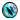
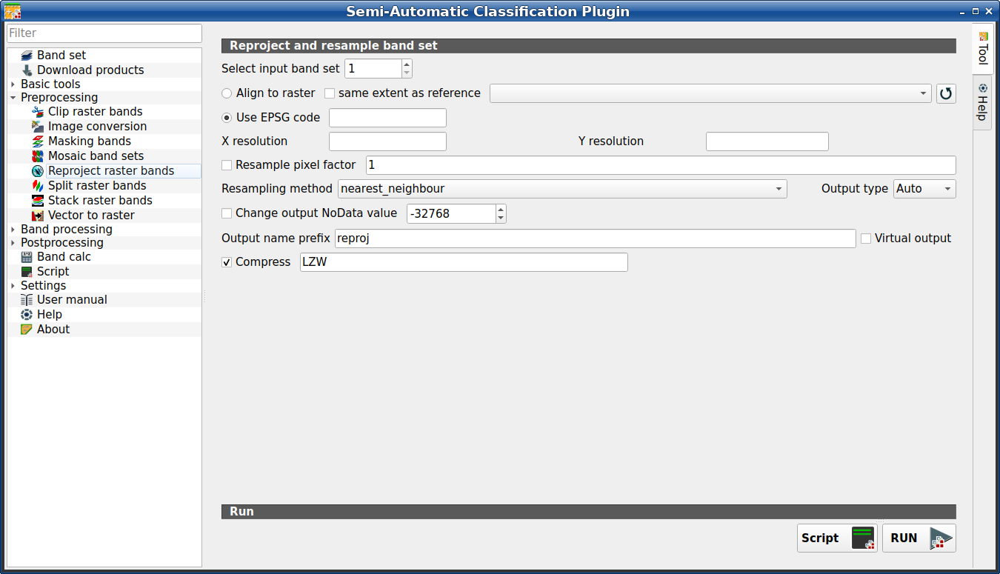

.. _reproject_raster_bands_tab:

******************************
Reproject raster bands
******************************

.. contents::
    :depth: 2
    :local:

.. |registry_save| image:: _static/registry_save.png
    :width: 20pt

.. |project_save| image:: _static/project_save.png
    :width: 20pt

.. |optional| image:: _static/optional.png
    :width: 20pt

.. |input_list| image:: _static/input_list.jpg
    :width: 20pt

.. |input_text| image:: _static/input_text.jpg
    :width: 20pt

.. |input_date| image:: _static/input_date.jpg
    :width: 20pt

.. |input_number| image:: _static/input_number.jpg
    :width: 20pt

.. |input_table| image:: _static/input_table.jpg
    :width: 20pt

.. |open_file| image:: _static/semiautomaticclassificationplugin_open_file.png
    :width: 20pt

.. |new_file| image:: _static/semiautomaticclassificationplugin_new_file.png
    :width: 20pt

.. |open_dir| image:: _static/semiautomaticclassificationplugin_open_dir.png
    :width: 20pt

.. |remove| image:: _static/semiautomaticclassificationplugin_remove.png
    :width: 20pt

.. |add| image:: _static/semiautomaticclassificationplugin_add.png
    :width: 20pt

.. |reset| image:: _static/semiautomaticclassificationplugin_reset.png
    :width: 20pt

.. |bandset_tool| image:: _static/semiautomaticclassificationplugin_bandset_tool.png
    :width: 20pt

.. |download| image:: _static/semiautomaticclassificationplugin_download_arrow.png
    :width: 20pt

.. |sign_plot| image:: _static/semiautomaticclassificationplugin_sign_tool.png
    :width: 20pt

.. |tools| image:: _static/semiautomaticclassificationplugin_roi_tool.png
    :width: 20pt

.. |preprocessing| image:: _static/semiautomaticclassificationplugin_class_tool.png
    :width: 20pt

.. |band_processing| image:: _static/semiautomaticclassificationplugin_band_processing.png
    :width: 20pt

.. |postprocessing| image:: _static/semiautomaticclassificationplugin_post_process.png
    :width: 20pt

.. |bandcalc| image:: _static/semiautomaticclassificationplugin_bandcalc_tool.png
    :width: 20pt

.. |settings| image:: _static/semiautomaticclassificationplugin_settings_tool.png
    :width: 20pt

.. |script_tool| image:: _static/semiautomaticclassificationplugin_script.png
    :width: 20pt

.. |save_roi| image:: _static/semiautomaticclassificationplugin_save_roi.png
    :width: 20pt

.. |delete_signature| image:: _static/semiautomaticclassificationplugin_delete_signature.png
    :width: 20pt

.. |accuracy_tool| image:: _static/semiautomaticclassificationplugin_accuracy_tool.png
    :width: 20pt

.. |enter| image:: _static/semiautomaticclassificationplugin_enter.png
    :width: 20pt

.. |zoom_to_ROI| image:: _static/semiautomaticclassificationplugin_zoom_to_ROI.png
    :width: 20pt

.. |check| image:: _static/semiautomaticclassificationplugin_batch_check.png
    :width: 20pt

.. |select_all| image:: _static/semiautomaticclassificationplugin_select_all.png
    :width: 20pt

.. |docks| image:: _static/semiautomaticclassificationplugin_docks.png
    :width: 20pt

.. |add_sign_tool| image:: _static/semiautomaticclassificationplugin_add_sign_tool.png
    :width: 20pt

.. |scatter_plot| image:: _static/semiautomaticclassificationplugin_scatter_tool.png
    :width: 20pt

.. |merge_sign| image:: _static/semiautomaticclassificationplugin_merge_sign_tool.png
    :width: 20pt

.. |guide| image:: _static/guide.png
    :width: 20pt

.. |help| image:: _static/help.png
    :width: 20pt

.. |reload| image:: _static/semiautomaticclassificationplugin_reload.png
    :width: 20pt

.. |checkbox| image:: _static/checkbox.png
    :width: 18pt

.. |run| image:: _static/semiautomaticclassificationplugin_run.png
    :width: 24pt

.. |radiobutton| image:: _static/radiobutton.png
    :width: 18pt

    :guilabel:`Reproject raster bands`

This tab allows for reprojecting bands in a :ref:`band_set_tab` and perform
other raster operations.

.. tip::
    Information about APIs of this tool in Remotior Sensus at this
    `link <https://remotior-sensus.readthedocs.io/en/latest/remotior_sensus.tools.band_resample.html>`_ .

.. _reproject_input:

Reproject raster bands
^^^^^^^^^^^^^^^^^^^^^^^^^^^^^^^^^^^^^^

.. list-table::
    :widths: auto
    :header-rows: 1

    * - Tool symbol and name
      - Description
    * - :guilabel:`Select input band set` |input_number|
      - select the input :ref:`band_set_tab` to be reprojected
    * - |radiobutton| :guilabel:`Align to raster` |input_list| |optional|
      - if checked, use the same coordinate reference system and pixel size as
        the selected reference
    * - |checkbox| :guilabel:`same extent as reference` |input_list| |optional|
      - if checked, the output extent will be the same as the reference
    * - |reload|
      - refresh layer list
    * - |checkbox| :guilabel:`Use EPSG code` |input_text| |optional|
      - if checked, use the EPSG code for defining the output coordinate
        reference system
    * - :guilabel:`X resolution` |input_text| |optional|
      - set X pixel resolution
    * - :guilabel:`Y resolution` |input_text| |optional|
      - set Y pixel resolution
    * - |checkbox| :guilabel:`Resample pixel factor` |input_text| |optional|
      - if checked, new pixel size will be the original size times this factor
    * - :guilabel:`Resampling method` |input_list|
      - select the resampling method; options are: ``nearest_neighbour``,
        ``average``, ``sum``, ``maximum``, ``minimum``, ``mode``, ``median``,
        ``first_quartile``, ``third_quartile``
    * - :guilabel:`Output type` |input_list|
      - select the output raster type; options are: ``Auto`` (same as input),
        ``Float32``, ``Int32``, ``UInt32``, ``Int16``, ``UInt16``, ``Byte``
    * - |checkbox| :guilabel:`Change output NoData value` |input_number|
      - if checked, set a new value for ``NoData`` pixels
    * - :guilabel:`Output name prefix` |input_text|
      - set the prefix for output file names (default is ``reproj``)
    * - :guilabel:`Compress` |input_text|
      - if checked, set the compression method (e.g., LZW, DEFLATE)
    * - :guilabel:`Script` |script_tool|
      - add this function to the :ref:`script_tab`
    * - :guilabel:`RUN` |run|
      - run this function