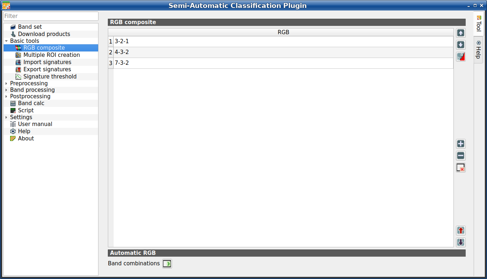

.. _RGB_list_tab:

**********************************
RGB composite (complete interface)
**********************************

.. contents::
    :depth: 2
    :local:

.. |project_save| image:: _static/project_save.png
    :width: 20pt

.. |optional| image:: _static/optional.png
    :width: 20pt

.. |checkbox| image:: _static/checkbox.png
    :width: 18pt

.. |input_list| image:: _static/input_list.jpg
    :width: 20pt

.. |input_table| image:: _static/input_table.jpg
    :width: 20pt

.. |reload| image:: _static/semiautomaticclassificationplugin_reload.png
    :width: 20pt

.. |reset| image:: _static/semiautomaticclassificationplugin_reset.png
    :width: 20pt

.. |remove| image:: _static/semiautomaticclassificationplugin_remove.png
    :width: 20pt

.. |run| image:: _static/semiautomaticclassificationplugin_run.png
    :width: 24pt

.. |open_file| image:: _static/semiautomaticclassificationplugin_open_file.png
    :width: 20pt

.. |order_by_name| image:: _static/semiautomaticclassificationplugin_order_by_name.png
    :width: 20pt

.. |open_dir| image:: _static/semiautomaticclassificationplugin_open_dir.png
    :width: 20pt

.. |select_all| image:: _static/semiautomaticclassificationplugin_select_all.png
    :width: 20pt

.. |move_up| image:: _static/semiautomaticclassificationplugin_move_up.png
    :width: 20pt

.. |add_bandset| image:: _static/semiautomaticclassificationplugin_add_bandset_tool.png
    :width: 20pt

.. |move_down| image:: _static/semiautomaticclassificationplugin_move_down.png
    :width: 20pt

.. |import| image:: _static/semiautomaticclassificationplugin_import.png
    :width: 20pt

.. |export| image:: _static/semiautomaticclassificationplugin_export.png
    :width: 20pt

.. |plus| image:: _static/semiautomaticclassificationplugin_plus.png
    :width: 20pt

.. |bandset_tool| image:: _static/semiautomaticclassificationplugin_bandset_tool.png
    :width: 20pt

.. |input_text| image:: _static/input_text.jpg
    :width: 20pt

.. |input_date| image:: _static/input_date.jpg
    :width: 20pt

.. |enter| image:: _static/semiautomaticclassificationplugin_enter.png
    :width: 20pt

.. |add| image:: _static/semiautomaticclassificationplugin_add.png
    :width: 20pt

.. |rgb_tool| image:: _static/semiautomaticclassificationplugin_rgb_tool.png
    :width: 20pt

    |rgb_tool| :guilabel:`RGB composite`

This tab allows for managing the RGB :ref:`color_composite_definition` used in
the list :guilabel:`RGB=` of the :ref:`image_control`.
It is loaded only if the :guilabel:`Simplified interface` is not enabled.

.. _RGB_list_table:

RGB composite
^^^^^^^^^^^^^^^^^^^^^^^

The table :guilabel:`RGB composite` contains the field :guilabel:`RGB` that
allows for entering an RGB combination.

.. list-table::
    :widths: auto
    :header-rows: 1

    * - Tool symbol and name
      - Description
    * - |move_up|
      - move highlighted RGB combination upward
    * - |move_down|
      - move highlighted RGB combination downward
    * - |order_by_name|
      - automatically sort RGB combinations by name
    * - |add|
      - add a row to the table
    * - |remove|
      - remove highlighted rows from the table
    * - |reset|
      - clear all RGB combinations from :guilabel:`RGB list`
    * - |export|
      - export the :guilabel:`RGB list` to a file (i.e. ``.csv``)
    * - |import|
      - import a previously saved :guilabel:`RGB list` from file
        (i.e. ``.csv``)

.. _automatic_RGB_list:

Automatic RGB
^^^^^^^^^^^^^^^^^^^^^^^

.. list-table::
    :widths: auto
    :header-rows: 1

    * - Tool symbol and name
      - Description
    * - :guilabel:`Band combinations` |enter|
      - add the combinations of all bands (i.e. permutation) to the
        :ref:`RGB_list_table` (e.g. 1-2-3, 1-2-4, ..., 3-2-1)

