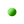
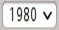
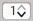
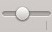
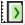
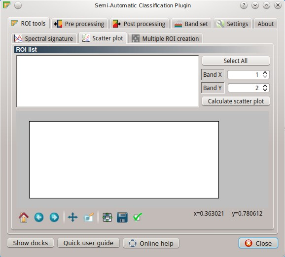
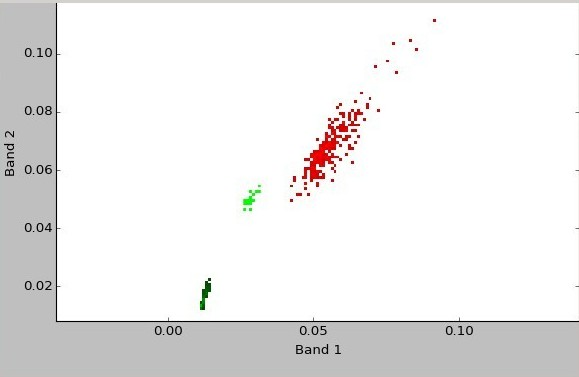

.. _scatter_plot:

******************************
Scatter Plot
******************************

.. |br| raw:: html

  

	

	

	
.. |input_list| image:: _static/input_list.jpg
	:width: 20pt
	

	

	

	

	
.. |input_table| image:: _static/input_table.jpg
	:width: 20pt
	
.. |checkbox| image:: _static/checkbox.png
	:width: 18pt
	
.. |enter| image:: _static/semiautomaticclassificationplugin_enter.png
	:width: 20pt

.. |remove| image:: _static/semiautomaticclassificationplugin_remove.png
	:width: 20pt
	
.. |fit_plot| image:: _static/semiautomaticclassificationplugin_fit_plot.png
	:width: 20pt
	

	
.. |scatter_raster_temp_ROI| image:: _static/semiautomaticclassificationplugin_scatter_raster_temp_ROI.png
	:width: 20pt
	
.. |scatter_raster_display| image:: _static/semiautomaticclassificationplugin_scatter_raster_display.png
	:width: 20pt
	
.. |scatter_raster_image| image:: _static/semiautomaticclassificationplugin_scatter_raster_image.png
	:width: 20pt
	
.. |scatter_edit_polygon| image:: _static/semiautomaticclassificationplugin_scatter_edit_polygon.png
	:width: 20pt
	
.. |scatter_reset_polygon| image:: _static/semiautomaticclassificationplugin_scatter_reset_polygon.png
	:width: 20pt
	

	
.. |scatter_show_raster| image:: _static/semiautomaticclassificationplugin_scatter_show_raster.png
	:width: 20pt
	
The window :guilabel:`Scatter plot` displays pixel values for two raster bands as points in the 2D space.
Scatter plots are useful for assessing ROI separability between two bands.

	
	:guilabel:`Scatter Plot`

The functions are described in detail in the following paragraphs.

.. _scatter_list:

Scatter list
----------------

* |input_table| :guilabel:`Scatter list`:
	* :guilabel:`S`: checkbox field; if checked, the spectral signature is displayed in the plot;
	* :guilabel:`MC ID`: signature Macroclass ID;
	* :guilabel:`MC Info`: signature Macroclass Information;
	* :guilabel:`C ID`: signature Class ID;
	* :guilabel:`C Info`: signature Class Information;
	* :guilabel:`Color`: color field; double click to select a color for the plot;
* :guilabel:`Band X` |input_number|: X band of the plot;
* :guilabel:`Band Y` |input_number|: Y band of the plot;
* |checkbox| :guilabel:`Precision` |input_list|: use custom precision for calculation (precision should be selected according to pixel values):
	* 4 = :math:`10^{-4}`
	* 3 = :math:`10^{-3}`
	* 2 = :math:`10^{-2}`
	* 1 = :math:`10^{-1}`
	* 0 = 1
	* -1 = 10
	* -2 = :math:`10^{2}`
	* -3 = :math:`10^{3}`
* :guilabel:`Calculate` |enter|: calculate the scatter plot for the ROIs checked in the list;
* |remove|: remove highlighted signatures from this list;
* |scatter_raster_temp_ROI|: add a temporary scatter plot to the list (as ``MC Info = tempScatter``) and start the plot calculation of the last temporary ROI (see :ref:`working_toolbar`);
* |scatter_raster_display|: add a temporary scatter plot to the list (as ``MC Info = tempScatter``) and start the plot calculation of pixels in current display extent;
* |scatter_raster_image|: add a temporary scatter plot to the list (as ``MC Info = tempScatter``) and start the plot calculation of the entire image;

	**WARNING**: Using a precision value that is too high can result in slow calculation or failure.

.. _scatter_raster:

Scatter raster
^^^^^^^^^^^^^^^^^^^^^^^^^

This tool allows for the drawing of selection polygons inside the scatter plot; these selection polygons are used for creating a :guilabel:`Scatter raster` that is a temporary raster classified according to the intersection of scatter plots and drawn polygons.

Pixels of the :guilabel:`active band set` are classified, according to scatter plot bands, if pixel values are in the range of intersection between scatter plots and selection polygons (polygons should not overlap).
The value assigned to the :guilabel:`Scatter raster` pixels is the sequential number of selection polygon; also the raster color is derived from the selection polygon.

After the creation of a new :guilabel:`Scatter raster`, old rasters are placed in QGIS Layers inside a layer group named ``Class_temp_group`` (custom name can be defined in  :ref:`group_name`) and are deleted when the QGIS session is closed.

* |scatter_edit_polygon|: activate the cursor for interactively drawing a polygon in the plot; left click on the plot to define the vertices and right click to define the last vertex closing the polygon;
* :guilabel:`color`: select the color of polygon (which is used also in the :guilabel:`Scatter raster`);
* |scatter_reset_polygon|: remove all the selection polygons from the plot;
* |scatter_show_raster|: calculate the :guilabel:`Scatter raster` and display it in the map;
* |save_plot|: calculate the spectral signature of the :guilabel:`Scatter raster` (considering all the classified pixels) using the :guilabel:`active band set`, and save the signature to the :ref:`ROI_list`;
* :guilabel:`Extent` |input_list|: extent of the :guilabel:`Scatter raster`; available options are:
	* :guilabel:`Same as display`: extent is the same as map display;
	* :guilabel:`Same as image`: extent is the same as the whole image;

.. _scatter_plot_1:

Plot
^^^^^^^^^^^^^^^^^^^^^^^^^

**Left click** and hold inside the plot to **move** the view of the plot.
Use the **mouse wheel** to **zoom in and out** the view of the plot.
**Right click** and hold inside the plot to **zoom in a specific area** of the plot.
	
* :guilabel:`Colormap` |input_list| |enter|: select a colormap that is applied to highlighted scatter plots in the list when |enter| is clicked; if no scatter plot is highlighted then the colormap is applied to all the scatter plots;
* |fit_plot|: automatically fit the plot to data;
* |save_plot_image|: save the plot image to file (available formats are ``.jpg``, ``.png``, and ``.pdf``);
* :guilabel:`x y`: display x y coordinates of mouse cursor inside the plot;

|br|
	

	
	:guilabel:`Example Scatter Plot`
