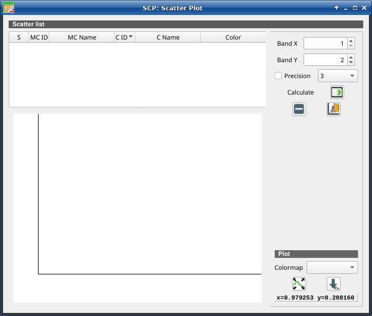
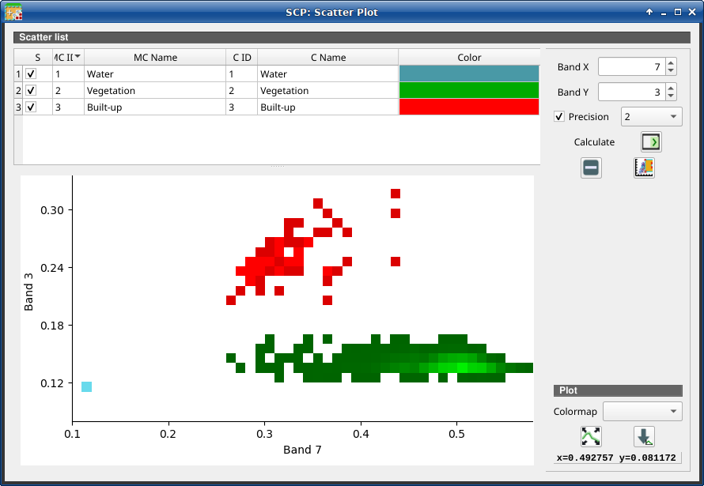

.. _scatter_plot:

******************************
Scatter Plot
******************************

.. |registry_save| image:: _static/registry_save.png
    :width: 20pt

.. |project_save| image:: _static/project_save.png
    :width: 20pt

.. |optional| image:: _static/optional.png
    :width: 20pt

.. |input_list| image:: _static/input_list.jpg
    :width: 20pt

.. |input_text| image:: _static/input_text.jpg
    :width: 20pt

.. |input_date| image:: _static/input_date.jpg
    :width: 20pt

.. |input_number| image:: _static/input_number.jpg
    :width: 20pt

.. |input_slider| image:: _static/input_slider.jpg
    :width: 20pt

.. |input_table| image:: _static/input_table.jpg
    :width: 20pt

.. |checkbox| image:: _static/checkbox.png
    :width: 18pt

.. |enter| image:: _static/semiautomaticclassificationplugin_enter.png
    :width: 20pt

.. |remove| image:: _static/semiautomaticclassificationplugin_remove.png
    :width: 20pt

.. |fit_plot| image:: _static/semiautomaticclassificationplugin_fit_plot.png
    :width: 20pt

.. |save_plot_image| image:: _static/semiautomaticclassificationplugin_save_plot_image.png
    :width: 20pt

.. |scatter_raster_temp_ROI| image:: _static/semiautomaticclassificationplugin_scatter_raster_temp_ROI.png
    :width: 20pt

.. |save_plot| image:: _static/semiautomaticclassificationplugin_save_plot.png
    :width: 20pt

The window :guilabel:`Scatter plot` displays pixel values for two raster bands
as points in the 2D space.
Scatter plots are useful for assessing ROI separability between two bands.

    :guilabel:`Scatter Plot`

The functions are described in detail in the following paragraphs.

.. _scatter_list:

Scatter list
----------------

The :guilabel:`Scatter list` is a table that includes the spectral signatures
added from the :ref:`SCP_dock`.

.. list-table::
    :widths: auto
    :header-rows: 1

    * -  S
      -  MC ID
      -  MC Name
      -  C ID
      -  C Name
      -  Color
    * - checkbox field; if checked, the spectral signature is displayed in the
        plot
      - signature Macroclass ID
      - signature Macroclass Name
      - signature Class ID
      - signature Class Name
      - signature color

The following tools are available.

.. list-table::
    :widths: auto
    :header-rows: 1

    * - Tool symbol and name
      - Description
    * - :guilabel:`Band X` |input_number|
      - X band of the plot
    * - :guilabel:`Band Y` |input_number|
      - Y band of the plot
    * - |remove|
      - remove highlighted signatures from this list
    * - |save_plot|
      - add highlighted spectral signatures to :ref:`ROI_list`
    * - |checkbox| :guilabel:`Precision` |input_list|
      - use custom precision for calculation (precision should be selected
        according significant digits):
        * 4 = :math:`10^{-4}`
        * 3 = :math:`10^{-3}`
        * 2 = :math:`10^{-2}`
        * 1 = :math:`10^{-1}`
        * 0 = 1
        * -1 = 10
        * -2 = :math:`10^{2}`
        * -3 = :math:`10^{3}`
    * - :guilabel:`Calculate` |enter|:
      - calculate the scatter plot for the ROIs checked in the list
    * - |remove|
      - remove highlighted signatures from this list
    * - |scatter_raster_temp_ROI|
      - add a temporary scatter plot to the list (as ``MC Name = tempScatter``)
        and start the plot calculation of the last temporary ROI (see
        :ref:`working_toolbar`)

.. warning::
    Using a precision value that is too high can result in slow calculation or
    failure.

.. _scatter_plot_1:

Plot
^^^^^^^^^^^^^^^^^^^^^^^^^

**Left click** and hold inside the plot to **move** the view of the plot.
Use the **mouse wheel** to **zoom in and out** the view of the plot.
**Right click** and hold inside the plot to **zoom in a specific area** of the
plot.

.. list-table::
    :widths: auto
    :header-rows: 1

    * - Tool symbol and name
      - Description
    * - :guilabel:`Colormap` |input_list| |enter|
      - select a colormap that is applied to highlighted scatter plots in the
        list when |enter| is clicked; if no scatter plot is highlighted then
        the colormap is applied to all the scatter plots
    * - |fit_plot|
      - automatically fit the plot to data
    * - |save_plot_image|
      - save the plot image to file (available formats are ``.jpg``, ``.png``,
        and ``.pdf``)
    * - :guilabel:`x y`
      - display x y coordinates of mouse cursor inside the plot

    :guilabel:`Example Scatter Plot`
