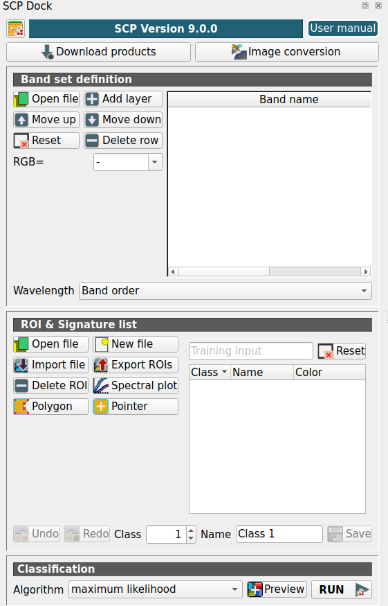
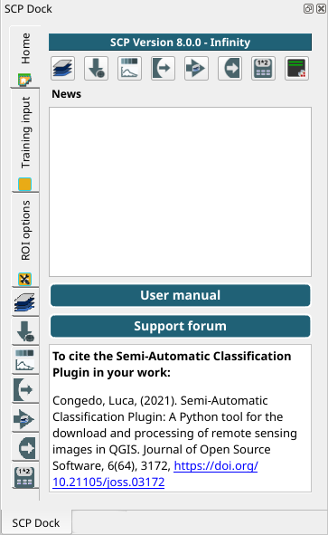
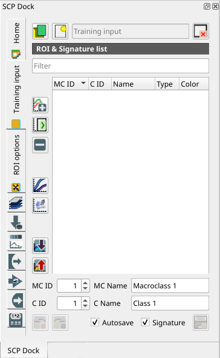
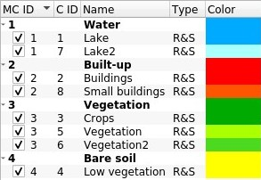
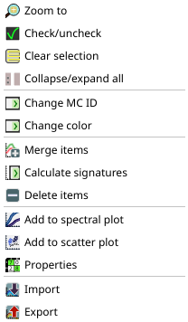
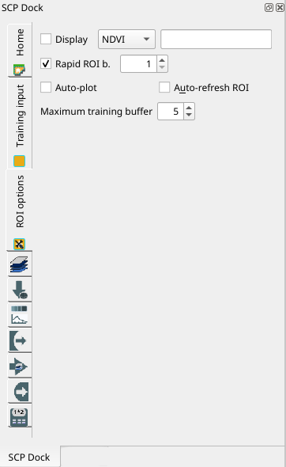

.. _SCP_dock:

*******************
SCP dock
*******************

.. |registry_save| image:: _static/registry_save.png
    :width: 20pt

.. |project_save| image:: _static/project_save.png
    :width: 20pt

.. |optional| image:: _static/optional.png
    :width: 20pt

.. |input_list| image:: _static/input_list.jpg
    :width: 20pt

.. |input_text| image:: _static/input_text.jpg
    :width: 20pt

.. |input_date| image:: _static/input_date.jpg
    :width: 20pt

.. |input_number| image:: _static/input_number.jpg
    :width: 20pt

.. |input_table| image:: _static/input_table.jpg
    :width: 20pt

.. |open_file| image:: _static/semiautomaticclassificationplugin_open_file.png
    :width: 20pt

.. |new_file| image:: _static/semiautomaticclassificationplugin_new_file.png
    :width: 20pt

.. |add| image:: _static/semiautomaticclassificationplugin_add.png
    :width: 20pt

.. |reset| image:: _static/semiautomaticclassificationplugin_reset.png
    :width: 20pt

.. |bandset_tool| image:: _static/semiautomaticclassificationplugin_bandset_tool.png
    :width: 20pt

.. |download| image:: _static/semiautomaticclassificationplugin_download_arrow.png
    :width: 20pt

.. |sign_plot| image:: _static/semiautomaticclassificationplugin_sign_tool.png
    :width: 20pt

.. |tools| image:: _static/semiautomaticclassificationplugin_roi_tool.png
    :width: 20pt

.. |preprocessing| image:: _static/semiautomaticclassificationplugin_class_tool.png
    :width: 20pt

.. |band_processing| image:: _static/semiautomaticclassificationplugin_band_processing.png
    :width: 20pt

.. |postprocessing| image:: _static/semiautomaticclassificationplugin_post_process.png
    :width: 20pt

.. |bandcalc| image:: _static/semiautomaticclassificationplugin_bandcalc_tool.png
    :width: 20pt

.. |settings| image:: _static/semiautomaticclassificationplugin_settings_tool.png
    :width: 20pt

.. |script_tool| image:: _static/semiautomaticclassificationplugin_script.png
    :width: 20pt

.. |save_roi| image:: _static/semiautomaticclassificationplugin_save_roi.png
    :width: 20pt

.. |delete_signature| image:: _static/semiautomaticclassificationplugin_delete_signature.png
    :width: 20pt

.. |accuracy_tool| image:: _static/semiautomaticclassificationplugin_accuracy_tool.png
    :width: 20pt

.. |enter| image:: _static/semiautomaticclassificationplugin_enter.png
    :width: 20pt

.. |zoom_to_ROI| image:: _static/semiautomaticclassificationplugin_zoom_to_ROI.png
    :width: 20pt

.. |check| image:: _static/semiautomaticclassificationplugin_batch_check.png
    :width: 20pt

.. |select_all| image:: _static/semiautomaticclassificationplugin_select_all.png
    :width: 20pt

.. |docks| image:: _static/semiautomaticclassificationplugin_docks.png
    :width: 20pt

.. |add_sign_tool| image:: _static/semiautomaticclassificationplugin_add_sign_tool.png
    :width: 20pt

.. |scatter_plot| image:: _static/semiautomaticclassificationplugin_scatter_tool.png
    :width: 20pt

.. |merge_sign| image:: _static/semiautomaticclassificationplugin_merge_sign_tool.png
    :width: 20pt

.. |guide| image:: _static/guide.png
    :width: 20pt

.. |help| image:: _static/help.png
    :width: 20pt

.. |reload| image:: _static/semiautomaticclassificationplugin_reload.png
    :width: 20pt

.. |checkbox| image:: _static/checkbox.png
    :width: 18pt

.. |import_spectral_library| image:: _static/semiautomaticclassificationplugin_import_spectral_library.png
    :width: 20pt

.. |export_spectral_library| image:: _static/semiautomaticclassificationplugin_export_spectral_library.png
    :width: 20pt

.. |undo_save_roi| image:: _static/semiautomaticclassificationplugin_undo_save_roi.png
    :width: 20pt

.. |radiobutton| image:: _static/radiobutton.png
    :width: 18pt

.. |zoom_to_preview| image:: _static/semiautomaticclassificationplugin_zoom_to_preview.png
    :width: 20pt

.. |preview| image:: _static/semiautomaticclassificationplugin_preview.png
    :width: 20pt

.. |preview_redo| image:: _static/semiautomaticclassificationplugin_preview_redo.png
    :width: 20pt

.. |manual_ROI| image:: _static/semiautomaticclassificationplugin_manual_ROI.png
    :width: 20pt

.. |roi_single| image:: _static/semiautomaticclassificationplugin_roi_single.png
    :width: 20pt

.. |move_up| image:: _static/semiautomaticclassificationplugin_move_up.png
    :width: 20pt

.. |move_down| image:: _static/semiautomaticclassificationplugin_move_down.png
    :width: 20pt

.. |plus| image:: _static/semiautomaticclassificationplugin_plus.png
    :width: 20pt

.. |remove| image:: _static/semiautomaticclassificationplugin_remove.png
    :width: 20pt

.. |run| image:: _static/semiautomaticclassificationplugin_run.png
    :width: 24pt

.. _simplified_interface:

Simplified SCP dock
================================

    :guilabel:`Simplified SCP dock`

A :guilabel:`Simplified interface` is loaded after the first installation of
the plugin.
It is especially designed for new users in order to ease the classification
process, from the definition of input images to executing the classification
algorithm.

.. tip::
    The :guilabel:`Complete interface` can be loaded from the settings in the
    :ref:`SCP_menu`, by deselecting :guilabel:`Simplified interface` and
    restarting QGIS.

.. figure:: _static/interface/scp_menu_simplified.png
    :align: center

    :guilabel:`SCP menu with activated option for the simplified interface`

The :guilabel:`SCP` includes tools for downloading and preprocessing satellite
images.
The interface includes buttons for opening the following tools:

.. list-table::
    :widths: auto
    :header-rows: 1

    * - |download| :guilabel:`Download products`
      - open the tab :ref:`download_tab`
    * - |preprocessing| :guilabel:`Image conversion`
      - open the tab :ref:`pre_processing_tab`

.. _SCP_dock_bandset:

Band set definition
----------------------------------------

Image input in :guilabel:`SCP` is named :guilabel:`band set`,
and it is saved with the QGIS project.
It is recommended to load single band raster in a :guilabel:`Band set`.

The section :guilabel:`Band set definition` includes the following tools:

.. list-table::
    :widths: auto
    :header-rows: 1

    * - Tool symbol and name
      - Description
    * - |open_file| :guilabel:`Open file`
      - open file explorer and add raster files (preferably single band raster)
        to the :guilabel:`band set`
    * - |plus| :guilabel:`Add layer`
      - open a window to select single band rasters already loaded in QGIS and
        add them to the :guilabel:`band set`
    * - |move_up| :guilabel:`Move up`
      - move highlighted bands upward
    * - |move_down| :guilabel:`Move down`
      - move highlighted bands downward
    * - |reset| :guilabel:`Reset`
      - clear all bands from :guilabel:`band set`
    * - |remove| :guilabel:`Delete row`
      - remove highlighted bands from the :guilabel:`band set`
    * - |radiobutton| :guilabel:`RGB=` |input_list| |project_save|
      - select a :ref:`color_composite_definition` that is applied to
        the :ref:`band_set_tab` and displayed in the map; new color composites
        can be entered typing the band numbers separated by ``-``
        (e.g., RGB = 4-3-2); use the button |radiobutton| to show/hide
        the :guilabel:`band set` in the map
    * - :guilabel:`Wavelength` |input_list|
      - rapid definition of band center wavelength for the following satellite
        sensors such as Band order (integer values), Landsat 8 OLI, Sentinel-2

.. tip::
    The :guilabel:`Band set` is also called :guilabel:`active band set`.
    The :guilabel:`Complete interface` allows for the creation of multiple
    :guilabel:`band sets` that can be used in other tools.

.. _SCP_dock_rois:

ROI & Signature list
----------------------------------------

ROIs are polygons used for the definition of the samples of land cover
classes that are used by the classification algorithms. The :guilabel:`SCP`
manages the ROIs by creating a file named :ref:`training_input`.

The :ref:`training_input` stores the ROI
polygons and spectral signatures; depending on the algorithm, the training
could be performed using ROI polygons (e.g., :ref:`random_forest_definition`)
or spectral signatures (e.g., :ref:`spectra_angle_mapping_algorithm`).
The :ref:`training_input` is displayed in QGIS as vector file.

.. warning::
    In order to avoid data loss, do not edit the
    vector :guilabel:`Training input` using the QGIS tools. Use only the tools
    of :guilabel:`SCP` for managing the :guilabel:`Training input`.

:guilabel:`SCP` allows for the creation of :guilabel:`temporary ROI polygons`
using a region growing algorithm or drawn manually with the tools provided in
the :ref:`working_toolbar`.
These are :guilabel:`temporary ROI polygons` because the ROI creation is an
interactive process, and one can refine the geometry according to
photointerpreation.
Then, one can save :guilabel:`temporary ROI polygons` in the
:ref:`training_input` which is the actual input for classifications.

The :ref:`training_input` is composed of a vector part that stores the
geometries and a spectral signature part, which are managed by :guilabel:`SCP`.
A temporary layer is added to QGIS but the actual file is saved and modified
during the editing in :guilabel:`SCP`.

The section :guilabel:`ROI & Signature list` includes the following tools:

.. list-table::
    :widths: auto
    :header-rows: 1

    * - Tool symbol and name
      - Description
    * - |open_file| :guilabel:`Open file`
      - open a training input file; ROIs and spectral signatures are loaded
        in :ref:`ROI_list`; the vector part of the training input is loaded
        in QGIS
    * - |new_file| :guilabel:`New file`
      - create an empty training input file (``.scpx``); the vector part of the
        training input is loaded in QGIS; also a backup file is created (a
        file ``.scpx.backup`` in the same directory as the file ``.scpx``) when
        the QGIS project is saved; to use the backup file simply rename it
        deleting the ending ``.backup`` extension and open it as training input
    * - :guilabel:`Training input` |input_text| |project_save|
      - it displays the path to the training input file
    * - |reset| :guilabel:`Reset`
      - remove the training input
    * - |import_spectral_library| :guilabel:`Import file`
      - open the tab :ref:`import_signatures_tab`
    * - |export_spectral_library| :guilabel:`Export ROIs`
      - open the tab :ref:`export_signatures_tab` and export highlighted items
    * - |delete_signature| :guilabel:`Delete ROI`
      - delete highlighted ROIs
    * - |sign_plot| :guilabel:`Spectral plot`
      - show the ROI spectral signature in the :ref:`spectral_signature_plot`;
        spectral signature is calculated from the :ref:`band_set_tab`
    * - |manual_ROI| :guilabel:`Spectral plot`
      - activate the pointer to create a :guilabel:`temporary ROI` by drawing
        a polygon in the map; left click on the map to define the ROI vertices
        and right click to define the last vertex closing the polygon
    * - |roi_single| :guilabel:`Pointer`
      - activate the pointer to create a :guilabel:`temporary ROI` using the
        region growing algorithm; left click on the map for creating the ROI
    * - |undo_save_roi|
      - undo of ROI creation from the :ref:`training_input`; it is possible to
        undo a maximum of 10 actions
    * - |redo_save_roi|
      - redo ROI creation in the :ref:`training_input`
    * - :guilabel:`Class` |input_number| |project_save|
      - ROI class identifier
    * - :guilabel:`Name` |input_text| |project_save|
      - ROI class name
    * - |save_roi| :guilabel:`Save`
      - save the temporary ROI to the :ref:`training_input` using the defined
        classes and macroclasses; ROI is displayed in the :ref:`ROI_list`

The tree list :guilabel:`ROI & Signature list` has the following fields:

* :guilabel:`Class`: Class value used for classification;
  it can be edited with a single click
* :guilabel:`Name`: Class Name; it can be edited with a single click
* :guilabel:`Color`: Class color; double click to select a color for the class
  that is used in the classification

.. _SCP_dock_classification:

Classification
----------------------------------------

In :guilabel:`SCP`, land cover classes (and ROIs) are defined with a system of
:guilabel:`Classes`.
Each :guilabel:`Class` is identified by a value and a :guilabel:`Name`,
but only the :guilabel:`Class` value is used for the classification process.

The classification can be performed for the entire image
(see :ref:`classification_alg`) or for a part of it creating
a :ref:`classification_preview`.

The section :guilabel:`Classification` includes the following tools:

.. list-table::
    :widths: auto
    :header-rows: 1

    * - Tool symbol and name
      - Description
    * - :guilabel:`Algorithm` |input_list|
      - select a classification algorithm (additional parameters can be
        defined in :ref:`classification_tab`)
    * - |preview|
      - activate the pointer for the creation of
        a :ref:`classification_preview`; left click the map to start the
        classification process and display the classification preview
    * - :guilabel:`RUN` |run|
      - select an output and run the classification

This tool allows for the selection of one the following classification
algorithms:

* :ref:`maximum_likelihood`
* :ref:`minimum_distance`
* :ref:`multi_layer_perceptron`
* :ref:`random_forest`
* :ref:`spectral_angle_mapping`
* :ref:`support_vector_machine`

.. _complete_interface:

Complete interface
================================

The :guilabel:`Complete interface` is designed for experienced users, and
provides access to all the tools offered by the :guilabel:`SCP`.
The :guilabel:`Complete interface` can be loaded from the settings in the
:ref:`SCP_menu`.

The :ref:`training_input` is composed of a vector part that stores the
geometries and a spectral signature part, which are managed by :guilabel:`SCP`.
A temporary layer is added to QGIS but the actual file is saved and modified
during the editing in :guilabel:`SCP`.

In :guilabel:`SCP`, land cover classes (and ROIs) are defined with a system of
:guilabel:`Classes` (:guilabel:`Class ID`) and :guilabel:`Macroclasses`
(:guilabel:`Macroclass ID`) (see :ref:`classes_definition`) that are used for
the classification process; each :guilabel:`Macroclass ID` is related to a
:guilabel:`Macroclass Information` (e.g. macroclass name) and each
:guilabel:`Class ID` is related to a :guilabel:`Class Information`
(e.g. class name), but only :guilabel:`Macroclass ID` and :guilabel:`Class ID`
are used for the classification process.

The use of the :guilabel:`Macroclass ID` or :guilabel:`Class ID` for
classifications is defined with the option :guilabel:`Use MC ID or C ID`
in the :ref:`classification_alg`.
Using :guilabel:`Macroclass ID` instead of :guilabel:`Class ID` is useful
to group materials that belong to the same land cover class but have spectral
signatures that are distant enough to be considered as different materials
(e.g., different types of vegetation).

Spectral signatures of classes are calculated from the ROIs or can be imported
from other sources (see :ref:`import_signatures_tab`).
It is worth pointing out that classification is always based on spectral
signatures.

.. _SCP_home:
 
Home
----------------------------------------

    :guilabel:`Home`

The left side of :guilabel:`SCP dock` contains buttons for accessing the main
functions of :guilabel:`SCP`.
The tab :guilabel:`Home` contains the buttons for accessing the main
functions of :guilabel:`SCP`:

.. list-table::
    :widths: auto

    * - |bandset_tool|
      - :ref:`band_set_tab`
    * - |tools|
      - :ref:`tools_tab`
    * - |download|
      - :ref:`download_tab`
    * - |preprocessing|
      - :ref:`pre_processing_tab`
    * - |band_processing|
      - :ref:`band_processing_tab`
    * - |postprocessing|
      - :ref:`post_processing_tab`
    * - |bandcalc|
      - :ref:`band_calc_tab`
    * - |script_tool|
      - :ref:`script_tab`

.. _SCP_news:
 
SCP news
^^^^^^^^^^^^^^^^^^^^^^^^

This section displays news about the :guilabel:`SCP` and related services.
News are downloaded on startup (internet connection required).
It can be enabled or disabled in the settings :ref:`settings_tab`.

.. _training_input:
 
Training input
----------------------------------------

    :guilabel:`Training input`

This tool allows for the creation of the training input file (``.scpx`` )
required for storing ROIs and spectral signatures.
The training input file is created according to the characteristics of the
:guilabel:`active band set` defined in :ref:`band_set_tab`.
A new training input file should be created for every :guilabel:`band set`,
unless the :guilabel:`band sets` have the same spectral characteristics and
coordinate reference system.

.. list-table::
    :widths: auto
    :header-rows: 1

    * - Tool symbol and name
      - Description
    * - |open_file|
      - open a training input file; ROIs and spectral signatures are loaded
        in :ref:`ROI_list`; the vector part of the training input is loaded in
        QGIS
    * - |new_file|
      - create an empty training input file (``.scpx``); the vector part of the
        training input is loaded in QGIS; also a backup file is created (a
        file ``.scpx.backup`` in the same directory as the file ``.scpx``) when
        the QGIS project is saved; to use the backup file simply rename it
        deleting the ending ``.backup`` extension and open it as training input
    * - :guilabel:`Training input` |input_text| |project_save|
      - it displays the path to the training input file
    * - |reset|
      - remove the training input

The training input is displayed in QGIS as vector file.
ROIs and spectral signatures are displayed in the :ref:`ROI_list`.

.. warning::
    In order to avoid data loss, do not edit the
    vector :guilabel:`Training input` using the QGIS tools. Use only the tools
    of :guilabel:`SCP` for managing the :guilabel:`Training input`.

.. _ROI_list:
 
ROI & Signature list
^^^^^^^^^^^^^^^^^^^^^^^^

The tab :guilabel:`ROI & Signature list` displays the ROI polygons and
spectral signatures contained in the training input file.
The tab :guilabel:`ROI & Signature list` is structured as tree list,
where every ROI is grouped in the corresponding Macroclass.

A filter for names can be defined in :guilabel:`Filter` |input_text|.

The tree list :guilabel:`ROI & Signature list` has the following fields:

* :guilabel:`MC ID`: Macroclass ID is the root of corresponding ROIs and
  signatures; it can be edited with a single click; if the ID of a spectral
  signature is set 0, then pixels belonging to this signature are labelled as
  unclassified; every listed ROIs or signatures has a selection checkbox (only
  the spectral signatures checked in this list are used for the classification
  process);
* :guilabel:`C ID`: Class ID; it can be edited with a single click;
* :guilabel:`Name`: Macroclass and Class Name; it can be edited with a single
  click;
* :guilabel:`Type`: type of the item:
    * :guilabel:`R` = only ROI polygon;
    * :guilabel:`S` = only spectral signature;
    * :guilabel:`R&S` = both ROI and spectral signature;
* :guilabel:`Color`: C ID color; double click to select a color for the class
  that is used in the classification;

Changes in the :guilabel:`ROI & Signature list` are applied to the
file :ref:`training_input` only when the QGIS project is saved
(but there is also the option |checkbox| :guilabel:`Autosave`).
ROIs can be edited, deleted and merged from this list.

    :guilabel:`ROI & Signature list example`

.. tip::
    According to :ref:`classification_alg`, classifications performed
    using :guilabel:`C ID` have the colors defined for classes in
    the :ref:`ROI_list`; classifications performed using :guilabel:`MC ID` have
    the colors defined for the macroclasses.

If an item is a ROI polygon, double click the item to zoom to that ROI
in the map.
Items in the list can be highlighted with the mouse left click.

.. tip::
    ROIs and spectral signatures can be imported from other sources
    (see :ref:`import_signatures_tab`) and exported
    (see :ref:`export_signatures_tab`).

The following tools are available:

.. list-table::
    :widths: auto
    :header-rows: 1

    * - Tool symbol and name
      - Description
    * - |merge_sign|
      - merge highlighted spectral signatures or ROIs obtaining a new signature
        calculated as the average of signature values for each band (covariance
        matrix is excluded)
    * - |add_sign_tool|
      - calculate spectral signatures of highlighted ROIs using
        the :guilabel:`active band set` in :ref:`band_set_tab`
    * - |delete_signature|
      - delete highlighted ROIs and signatures
    * - |sign_plot|
      - show the ROI spectral signature in the :ref:`spectral_signature_plot`;
        spectral signature is calculated from the :ref:`band_set_tab`
    * - |scatter_plot|
      - add highlighted ROIs to the :ref:`scatter_plot`
    * - |import_spectral_library|
      - open the tab :ref:`import_signatures_tab`
    * - |export_spectral_library|
      - open the tab :ref:`export_signatures_tab` and export highlighted items

:guilabel:`ROI & Signature list` is complementary to
the :ref:`working_toolbar` and it allows for saving ROIs to
the :ref:`training_input` defining classes and macroclasses.
A :ref:`band_set_tab` must be defined before the ROI creation, and ROI
polygons must be inside the area of the :guilabel:`Band set`.

.. list-table::
    :widths: auto
    :header-rows: 1

    * - Tool symbol and name
      - Description
    * - :guilabel:`MC ID` |input_number| |project_save|
      - ROI Macroclass ID
    * - :guilabel:`MC Name` |input_text| |project_save|
      - ROI Macroclass Name
    * - :guilabel:`C ID` |input_number| |project_save|
      - ROI Class ID
    * - :guilabel:`C Name` |input_text| |project_save|
      - ROI Class Name
    * - |undo_save_roi|
      - undo of ROI creation from the :ref:`training_input`; it is possible to
        undo a maximum of 10 actions
    * - |redo_save_roi|
      - redo ROI creation in the :ref:`training_input`
    * - |checkbox| :guilabel:`Autosave` |project_save|
      - if checked, automatically save the :guilabel:`ROI & Signature list` to
        the :ref:`training_input` every time a ROI is saved
    * - |checkbox| :guilabel:`Signature` |project_save|
      - if checked, while saving a ROI, the spectral signature thereof is
        calculated (from :ref:`band_set_tab` pixels under ROI polygon) and
        saved to :ref:`training_input` (calculation time depends on the band
        number of the :guilabel:`active band set` in :ref:`band_set_tab`)
    * - |save_roi|
      - save the temporary ROI to the :ref:`training_input` using the defined
        classes and macroclasses; ROI is displayed in the :ref:`ROI_list`

.. _ROI_list_menu:

Right click menu
^^^^^^^^^^^^^^^^^^^^^^^^

    :guilabel:`Right click menu`

A right click on :ref:`ROI_list` allows for opening a menu containing several
functions to manage ROIs and spectral signatures.

.. list-table::
    :widths: auto
    :header-rows: 1

    * - Tool symbol and name
      - Description
    * - |zoom_to_ROI| :guilabel:`Zoom to`
      - zoom to highlighted items (if ROI polygons) in the map
    * - |check| :guilabel:`Check/uncheck`
      - check or uncheck highlighted items
    * - |select_all| :guilabel:`Clear selection`
      - clear selection of highlighted items
    * - |docks| :guilabel:`Collapse/expand all`
      - collapse or expand all macroclasses
    * - |enter| :guilabel:`Change MC ID`
      - edit the macroclass of highlighted items (using the
        value :guilabel:`MC ID` |input_number| displayed in :ref:`ROI_list`);
        if a macroclass is selected, the function is performed to all the
        included items
    * - |enter| :guilabel:`Change color`
      - select a color for the highlighted items; if a macroclass is selected,
        the function is performed to all the included items
    * - |merge_sign| :guilabel:`Merge items`
      - merge highlighted spectral signatures or ROIs obtaining a new signature
        calculated as the average of signature values for each band (covariance
        matrix is excluded); if a macroclass is selected, the function is
        performed to all the included items
    * - |add_sign_tool| :guilabel:`Calculate signatures`
      - calculate spectral signatures of highlighted ROIs using
        the :guilabel:`active band set` in :ref:`band_set_tab`; if a macroclass
        is selected, the function is performed to all the included items
    * - |delete_signature| :guilabel:`Delete items`
      - delete highlighted ROIs and signatures; if a macroclass is selected,
        the function is performed to all the included items;
    * - |sign_plot| :guilabel:`Add to spectral plot`
      - show the ROI spectral signature in the :ref:`spectral_signature_plot`;
        spectral signature is calculated from the :ref:`band_set_tab`; if a
        macroclass is selected, the function is performed to all the included
        items
    * - |scatter_plot| :guilabel:`Add to scatter plot`
      - add highlighted ROIs to the :ref:`scatter_plot`; if a macroclass is
        selected, the function is performed to all the included items
    * - |accuracy_tool| :guilabel:`Properties`
      - show the properties of highlighted items;
    * - |import_spectral_library| :guilabel:`Import`
      - open the tab :ref:`import_signatures_tab`
    * - |export_spectral_library| :guilabel:`Export`
      - open the tab :ref:`export_signatures_tab` and export highlighted items

.. _roi_options_tab:

ROI options
----------------------------------------

    :guilabel:`ROI options`

:guilabel:`ROI options` are useful for displaying pixel values or
improving the creation of ROIs.

.. list-table::
    :widths: auto
    :header-rows: 1

    * - Tool symbol and name
      - Description
    * - |checkbox| :guilabel:`Display` |input_list| |project_save|
      - if the ROI creation pointer is active (see :ref:`working_toolbar`),
        the pixel value of selected vegetation index is  displayed on the map;
        vegetation indices available in the combo box are: NDVI (Normalized
        Difference Vegetation Index); EVI (Enhanced Vegetation Index);
        Custom (use the custom expression defined in the following line)
    * - |input_text| |project_save|
      - set a custom expression; expression is based on
        the :guilabel:`Band set` and bands such as band 1 is referred to as
        "b1", band 2 as "b2" and so on; also reference to band names such as
        "#NIR#" or "#RED#" can be used
    * - |checkbox| :guilabel:`Rapid ROI b.` |input_number|
      - if checked, temporary ROI is created with region growing using only
        one :ref:`band_set_tab` band (i.e.region growing is rapider); the band
        is defined by the :guilabel:`Band set` number; if unchecked, ROI is the
        result of the intersection between ROIs calculated on every band (i.e.
        region growing is slower, but ROI is spectrally homogeneous in every
        band)
    * - |checkbox| :guilabel:`Auto-plot`
      - calculate automatically the temporary ROI spectral signature and
        display it in the :ref:`spectral_signature_plot` (``MC Name`` of this
        spectral signature is set ``tempo_ROI``)
    * - |checkbox| :guilabel:`Auto-refresh ROI`
      - calculate automatically a new temporary ROI
        while :guilabel:`Region growing parameters` in
        the :ref:`working_toolbar` are being changed
    * - :guilabel:`Maximum training buffer` |input_number|
      - defines the maximum number of action for undo and redo ROIs; the higher
        is the number, the more is the required memory
