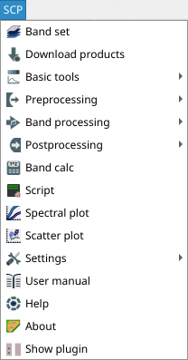

.. _SCP_menu:

******************************
SCP menu
******************************

.. |band_set| image:: _static/semiautomaticclassificationplugin_bandset_tool.png
    :width: 20pt

.. |download| image:: _static/semiautomaticclassificationplugin_download_arrow.png
    :width: 20pt

.. |tools| image:: _static/semiautomaticclassificationplugin_roi_tool.png
    :width: 20pt

.. |preprocessing| image:: _static/semiautomaticclassificationplugin_class_tool.png
    :width: 20pt

.. |band_processing| image:: _static/semiautomaticclassificationplugin_band_processing.png
    :width: 20pt

.. |postprocessing| image:: _static/semiautomaticclassificationplugin_post_process.png
    :width: 20pt

.. |sign_plot| image:: _static/semiautomaticclassificationplugin_sign_tool.png
    :width: 20pt

.. |scatter_plot| image:: _static/semiautomaticclassificationplugin_scatter_tool.png
    :width: 20pt

.. |bandcalc| image:: _static/semiautomaticclassificationplugin_bandcalc_tool.png
    :width: 20pt

.. |settings| image:: _static/semiautomaticclassificationplugin_settings_tool.png
    :width: 20pt

.. |script_tool| image:: _static/semiautomaticclassificationplugin_script.png
    :width: 20pt

.. |guide| image:: _static/guide.png
    :width: 20pt

.. |help| image:: _static/help.png
    :width: 20pt

.. |docks| image:: _static/semiautomaticclassificationplugin_docks.png
    :width: 20pt

The :guilabel:`SCP menu` allows for the selection of the functions of
the :ref:`main_interface_window`.
If the :guilabel:`Simplified interface` is active,
the :guilabel:`SCP simplified menu` is displayed.

.. figure:: _static/interface/scp_menu_simplified.png
    :align: center

    :guilabel:`SCP simplified menu`

If the :guilabel:`Simplified interface` is not active,
the complete :guilabel:`SCP complete menu` is displayed.
The :guilabel:`SCP complete menu` includes all the functions available in
:guilabel:`SCP`.

    :guilabel:`SCP complete menu`

.. _scp_simplified_menu:

SCP simplified menu
===================================================

.. list-table::
    :widths: auto

    * - |download|
      - :ref:`download_tab`
    * - |tools|
      - :ref:`tools_tab`
    * - |preprocessing|
      - :ref:`pre_processing_tab`
    * - |band_processing|
      - :ref:`band_processing_tab`
    * - |postprocessing|
      - :ref:`post_processing_tab`
    * - |bandcalc|
      - :ref:`band_calc_tab`
    * - |settings|
      - display the settings
    * - |guide|
      - :guilabel:`User manual`: open the online user manual in a web browser
    * - |help|
      - :guilabel:`Online help`: open
        the `Online help <https://fromgistors.blogspot.com/p/online-help.html>`_
        in a web browser; also, a
        `Facebook group <https://www.facebook.com/groups/SemiAutomaticClassificationPlugin/>`_
        is available for sharing information and asking for help about SCP
    * - :guilabel:`About`
      - Information about the plugin
    * - |docks|
      - :guilabel:`Show plugin`: show all the SCP toolbars and dock if
        previously hidden

.. _scp_complete_menu:

SCP complete menu
===================================================

.. list-table::
    :widths: auto

    * - |band_set|
      - :ref:`band_set_tab`
    * - |download|
      - :ref:`download_tab`
    * - |tools|
      - :ref:`tools_tab`
    * - |preprocessing|
      - :ref:`pre_processing_tab`
    * - |band_processing|
      - :ref:`band_processing_tab`
    * - |postprocessing|
      - :ref:`post_processing_tab`
    * - |bandcalc|
      - :ref:`band_calc_tab`
    * - |script_tool|
      - :ref:`script_tab`
    * - |settings|
      - :ref:`settings_tab`
    * - |sign_plot|
      - :ref:`spectral_signature_plot`
    * - |scatter_plot|
      - :ref:`scatter_plot`
    * - |guide|
      - :guilabel:`User manual`: open the online user manual in a web browser
    * - |help|
      - :guilabel:`Online help`: open
        the `Online help <https://fromgistors.blogspot.com/p/online-help.html>`_
        in a web browser; also, a
        `Facebook group <https://www.facebook.com/groups/SemiAutomaticClassificationPlugin/>`_
        is available for sharing information and asking for help about SCP
    * - :guilabel:`About`
      - Information about the plugin
    * - |docks|
      - :guilabel:`Show plugin`: show all the SCP toolbars and dock if
        previously hidden
