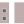
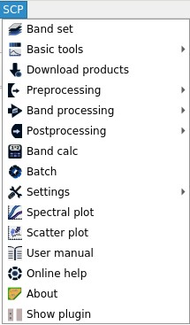

.. _SCP_menu:

******************************
SCP menu
******************************

.. |br| raw:: html

  
	
.. |band_set| image:: _static/semiautomaticclassificationplugin_bandset_tool.png
	:width: 20pt

.. |download| image:: _static/semiautomaticclassificationplugin_download_arrow.png
	:width: 20pt
	
.. |sign_plot| image:: _static/semiautomaticclassificationplugin_sign_tool.png
	:width: 20pt

.. |scatter_plot| image:: _static/semiautomaticclassificationplugin_scatter_tool.png
	:width: 20pt

.. |tools| image:: _static/semiautomaticclassificationplugin_roi_tool.png
	:width: 20pt
	
.. |preprocessing| image:: _static/semiautomaticclassificationplugin_class_tool.png
	:width: 20pt
	
.. |postprocessing| image:: _static/semiautomaticclassificationplugin_post_process.png
	:width: 20pt
			
.. |bandcalc| image:: _static/semiautomaticclassificationplugin_bandcalc_tool.png
	:width: 20pt
		
.. |settings| image:: _static/semiautomaticclassificationplugin_settings_tool.png
	:width: 20pt
		
.. |batch_tool| image:: _static/semiautomaticclassificationplugin_batch.png
	:width: 20pt
	
.. |guide| image:: _static/guide.png
	:width: 20pt
				
.. |help| image:: _static/help.png
	:width: 20pt
	

	 

	
	:guilabel:`SCP menu`
		
The :guilabel:`SCP menu` allows for the selection of the main functions of the :ref:`main_interface_window`, the :ref:`spectral_signature_plot`, and the :ref:`scatter_plot`.

* |band_set| :ref:`band_set_tab`;
* |download| :ref:`download_tab`;
* |tools| :ref:`tools_tab`;
* |preprocessing| :ref:`pre_processing_tab`;
* |postprocessing| :ref:`post_processing_tab`;
* |bandcalc| :ref:`band_calc_tab`;
* |sign_plot| :ref:`spectral_signature_plot`;
* |scatter_plot| :ref:`scatter_plot`;
* |batch_tool| :ref:`batch_tab`;
* |settings| :ref:`settings_tab`;
* |guide| :guilabel:`User manual`: open the online user manual in a web browser;
* |help| :guilabel:`Online help`: open the `Online help <https://fromgistors.blogspot.com/p/online-help.html>`_ in a web browser; also, a `Facebook group <https://www.facebook.com/groups/SemiAutomaticClassificationPlugin/>`_ is available for sharing information and asking for help about SCP;
* |docks| :guilabel:`Show plugin`: show all the SCP toolbars and dock if previously hidden;
