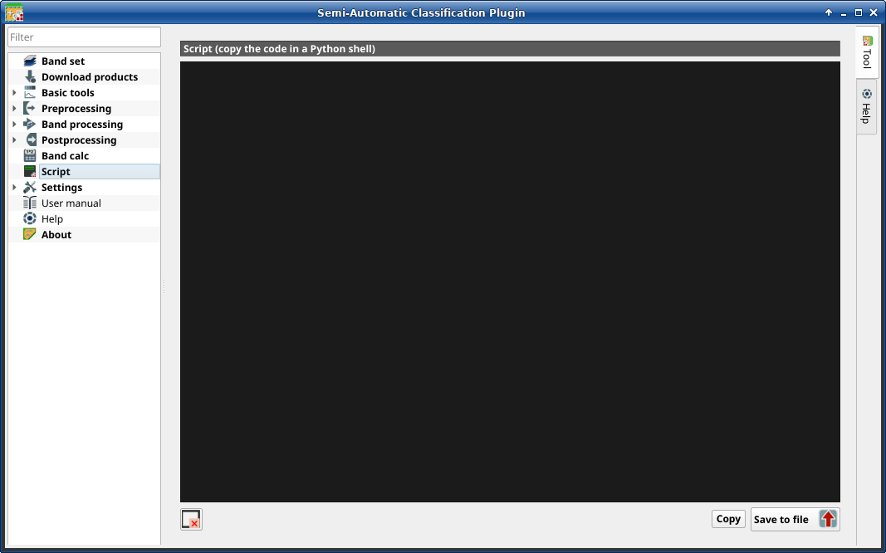

.. _script_tab:

******************************
Script
******************************

.. contents::
    :local:

.. |registry_save| image:: _static/registry_save.png
    :width: 20pt

.. |project_save| image:: _static/project_save.png
    :width: 20pt

.. |optional| image:: _static/optional.png
    :width: 20pt

.. |input_list| image:: _static/input_list.jpg
    :width: 20pt

.. |input_text| image:: _static/input_text.jpg
    :width: 20pt

.. |input_date| image:: _static/input_date.jpg
    :width: 20pt

.. |input_number| image:: _static/input_number.jpg
    :width: 20pt

.. |input_table| image:: _static/input_table.jpg
    :width: 20pt

.. |open_file| image:: _static/semiautomaticclassificationplugin_open_file.png
    :width: 20pt

.. |new_file| image:: _static/semiautomaticclassificationplugin_new_file.png
    :width: 20pt

.. |add| image:: _static/semiautomaticclassificationplugin_add.png
    :width: 20pt

.. |reset| image:: _static/semiautomaticclassificationplugin_reset.png
    :width: 20pt

.. |export| image:: _static/semiautomaticclassificationplugin_export.png
    :width: 20pt

    :guilabel:`Script`

This tab displays the output of the :guilabel:`Script` buttons that are
available in several tools, which ease the creation of Python scripts
using `Remotior Sensus <https://remotior-sensus.readthedocs.io/en/latest>`_.

It is possible to edit or copy the Python code and run it in a Python shell.
New code is appended to the existing one, when using the :guilabel:`Script`
buttons.

.. _script_tools:

Script
-------------------

.. list-table::
    :widths: auto
    :header-rows: 1

    * - Tool symbol and name
      - Description
    * - |reset|
      - clear the content of the script
    * - :guilabel:`Copy`
      - copy the content of the script to the clipboard
    * - :guilabel:`Save to file` |export|
      - save the script to file ``.py``
