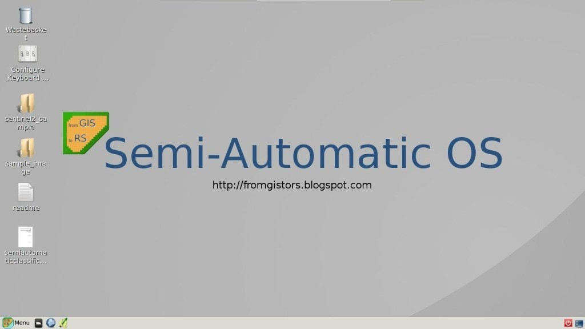
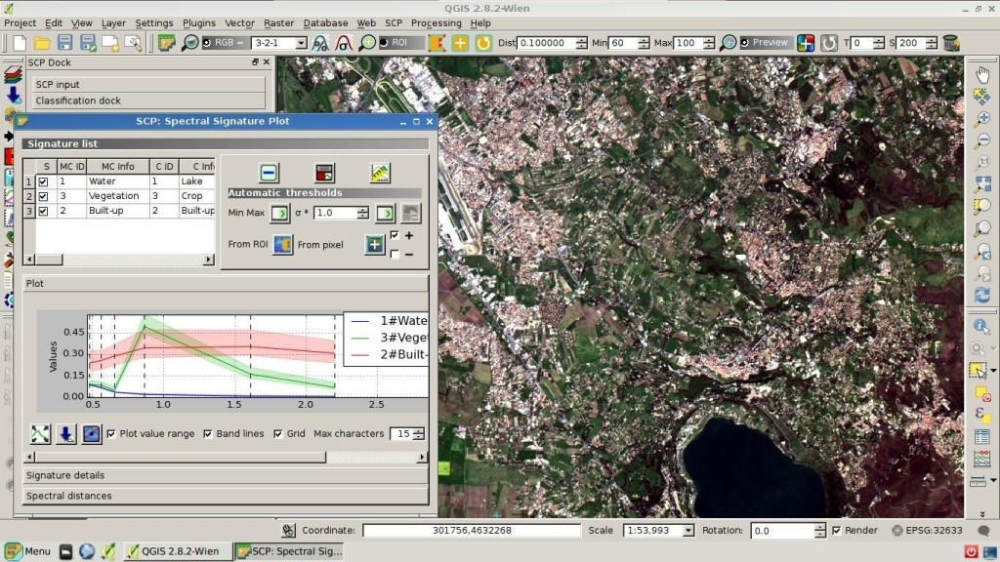

.. _semi-automatic_OS:

*******************
Semi-Automatic OS
*******************

.. |br| raw:: html

  

 

To be updated.
 
The Semi-Automatic OS is a lightweight virtual machine for the land cover classification of remote sensing images.
It includes the Semi-Automatic Classification Plugin (SCP) for QGIS, already configured along with all the required dependencies.

	
	:guilabel:`Semi-Automatic OS desktop`
	
The Semi-Automatic OS is based on `Debian <https://www.debian.org/>`_ , and it is designed to require very little hardware resources.
It uses `LXQT <https://lxqt.org/>`_ as main desktop environment.
This virtual machine can be useful for testing the Semi-Automatic Classification Plugin, or when the installation of the required programs in the host system is problematic.
|br|
The Semi-Automatic OS is available as 64 bit virtual machine that can be run in the open source VirtualBox, or any other virtualization program.
The following is a guide for the installation of the Semi-Automatic OS in the open source program of virtualization VirtualBox.

.. _installation_in_VirtualBox:
 
Installation in VirtualBox
=================================================================

	#. Download `VirtualBox <https://www.virtualbox.org/wiki/Downloads>`_ open source software (select a proper version depending on your OS) and install it; at the end of the installation restart the system;
	
	#. Download the Semi-Automatic OS virtual machine from `here <https://sourceforge.net/projects/semi-automatic-os/files/latest/download>`_ ;
	
	#. Extract the virtual machine content in a directory; the file is compressed in 7z format (if needed, download the open source extraction software from http://www.7-zip.org/);
	
	#. Run VirtualBox and create a new Debian virtual machine;
	
		#. Click the New button;
		
		#. Type a name for the virtual machine (for instance Semi-Automatic OS); select Linux and Debian (32 or 64 bit) as Type and Version respectively; click Next;
		
			.. image:: _static/v1.jpg
		
		#. Set the memory size; the more is the better, but this parameter should not exceed a half of the host system RAM (for instance if the host system has 1 GB of RAM, type 512 MB); click Next;
		
			.. image:: _static/v2.jpg
			
		#. In the Hard drive settings select Use an existing virtual hard drive file and select the downloaded file SemiAutomaticOS.vmdk; click Create;
	
			.. image:: _static/v3.jpg
	
	#. Start the Semi-Automatic OS by clicking the Start button;
	
	#. It is recommended to install the virtualbox-guest-utils in the virtual machine, from the Menu > Preferences > Synaptic Package Manager; it allows for a better integration of the Semi-Automatic OS in the host system, such as: the resize of the system window, or the folder sharing.
		
|br|
The Semi-Automatic OS includes a sample dataset of a Landsat image (available from the U.S. Geological Survey) that is the input for the first basic tutorial of the user manual.

|br|

``Semi-Automatic OS is free software: you can redistribute it and/or modify it under the terms of the GNU General Public License as published by the Free Software Foundation, version 3 of the License.
Semi-Automatic OS is distributed in the hope that it will be useful, but WITHOUT ANY WARRANTY; without even the implied warranty of MERCHANTABILITY or FITNESS FOR A PARTICULAR PURPOSE.
See the GNU General Public License for more details. See http://www.gnu.org/licenses/.``