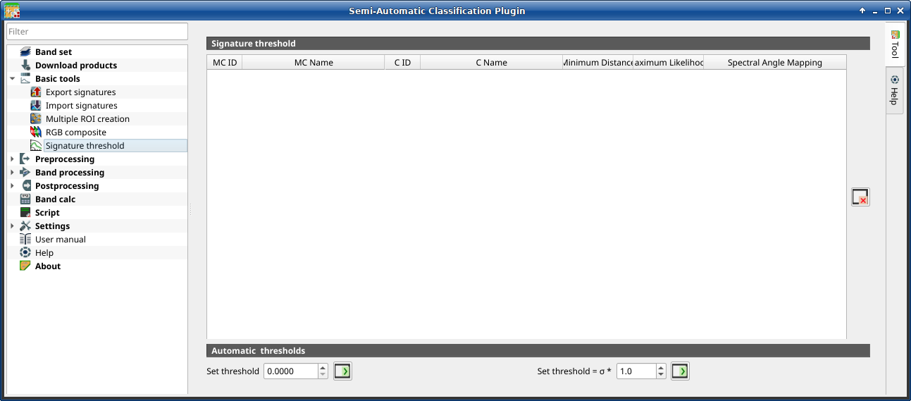

.. _Signature_threshold_tab:

******************************
Signature threshold
******************************

.. contents::
    :depth: 2
    :local:

.. |project_save| image:: _static/project_save.png
    :width: 20pt

.. |optional| image:: _static/optional.png
    :width: 20pt

.. |checkbox| image:: _static/checkbox.png
    :width: 18pt

.. |input_list| image:: _static/input_list.jpg
    :width: 20pt

.. |input_table| image:: _static/input_table.jpg
    :width: 20pt

.. |reload| image:: _static/semiautomaticclassificationplugin_reload.png
    :width: 20pt

.. |reset| image:: _static/semiautomaticclassificationplugin_reset.png
    :width: 20pt

.. |remove| image:: _static/semiautomaticclassificationplugin_remove.png
    :width: 20pt

.. |run| image:: _static/semiautomaticclassificationplugin_run.png
    :width: 24pt

.. |open_file| image:: _static/semiautomaticclassificationplugin_open_file.png
    :width: 20pt

.. |order_by_name| image:: _static/semiautomaticclassificationplugin_order_by_name.png
    :width: 20pt

.. |open_dir| image:: _static/semiautomaticclassificationplugin_open_dir.png
    :width: 20pt

.. |select_all| image:: _static/semiautomaticclassificationplugin_select_all.png
    :width: 20pt

.. |move_up| image:: _static/semiautomaticclassificationplugin_move_up.png
    :width: 20pt

.. |add_bandset| image:: _static/semiautomaticclassificationplugin_add_bandset_tool.png
    :width: 20pt

.. |move_down| image:: _static/semiautomaticclassificationplugin_move_down.png
    :width: 20pt

.. |import| image:: _static/semiautomaticclassificationplugin_import.png
    :width: 20pt

.. |export| image:: _static/semiautomaticclassificationplugin_export.png
    :width: 20pt

.. |plus| image:: _static/semiautomaticclassificationplugin_plus.png
    :width: 20pt

.. |bandset_tool| image:: _static/semiautomaticclassificationplugin_bandset_tool.png
    :width: 20pt

.. |input_text| image:: _static/input_text.jpg
    :width: 20pt

.. |input_date| image:: _static/input_date.jpg
    :width: 20pt

.. |enter| image:: _static/semiautomaticclassificationplugin_enter.png
    :width: 20pt

.. |add| image:: _static/semiautomaticclassificationplugin_add.png
    :width: 20pt

.. |rgb_tool| image:: _static/semiautomaticclassificationplugin_rgb_tool.png
    :width: 20pt

.. |input_number| image:: _static/input_number.jpg
    :width: 20pt

.. |threshold_tool| image:: _static/semiautomaticclassificationplugin_threshold_tool.png
    :width: 20pt

    |threshold_tool| :guilabel:`Signature threshold`

This tab allows for the definition of a classification threshold (only for
Minimum Distance, Maximum Likelihood, and Spectral Angle Mapping algorithms)
for each spectral signature.
All the signatures contained in the :ref:`training_input` are listed.
Thresholds defined in this tool are applied to classification only
if :guilabel:`Threshold` value in :ref:`classification_alg` is 0.

This is useful for improving the classification results, especially when
spectral signatures are similar.
Thresholds of signatures are saved in the :ref:`training_input`.

If threshold is 0 then no threshold is applied and all the image pixels are
classified.
Depending on the selected :ref:`classification_alg` the threshold value is
evaluated differently:

* for Minimum Distance, pixels are unclassified if distance is greater than
  threshold value;
* for Maximum Likelihood, pixels are unclassified if probability is less than
  threshold  value (max 100);
* for Spectral Angle Mapping, pixels are unclassified if spectral angle
  distance is greater than threshold value (max 90).

.. _signature_threshold:

Signature threshold
^^^^^^^^^^^^^^^^^^^^^^^

The table :guilabel:`Signature threshold` contains the following fields.

.. list-table::
    :widths: auto
    :header-rows: 1

    * - MC ID
      - MC Name
      - C ID
      - C Name
      - MD Threshold
      - ML Threshold
      - SAM Threshold
    * - signature Macroclass ID
      - signature Macroclass Name
      - signature Class ID
      - signature Class Name
      - Minimum Distance threshold; this value can be edited
      - Maximum Likelihood threshold; this value can be edited
      - Spectral Angle Mapping threshold; this value can be edited

* |reset|: reset all signatures thresholds to 0 (i.e. no threshold used);

.. _automatic_thresholds:

Automatic thresholds
^^^^^^^^^^^^^^^^^^^^^^^

.. list-table::
    :widths: auto
    :header-rows: 1

    * - Tool symbol and name
      - Description
    * - :guilabel:`Set threshold` |input_number| |enter|
      - set the defined value as threshold for all the highlighted signatures
        in the table
    * - :guilabel:`Set threshold = σ *` |input_number| |enter|
      - for all the highlighted signatures, set an automatic threshold
        calculated as the distance (or angle) between mean signature and
        (mean signature + (σ * v)), where σ is the standard deviation and v is
        the defined value; currently works for Minimum Distance and Spectral
        Angle Mapping
