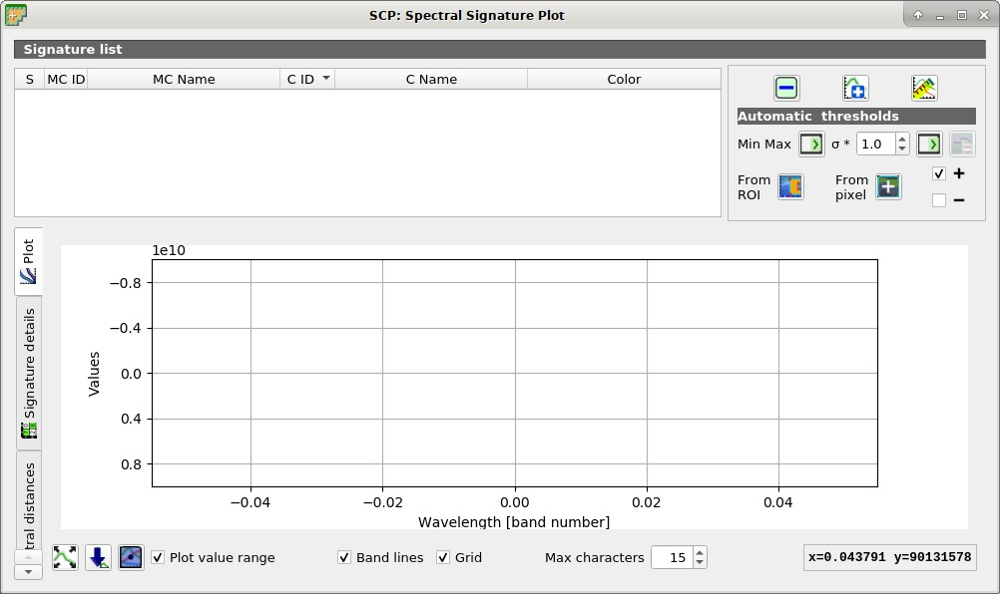
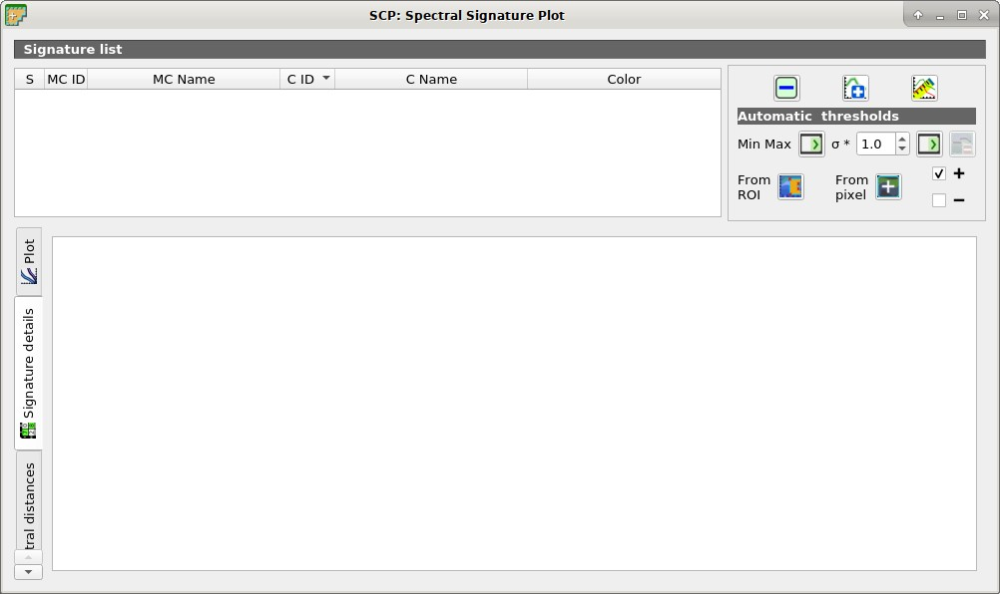
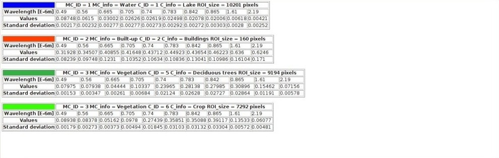
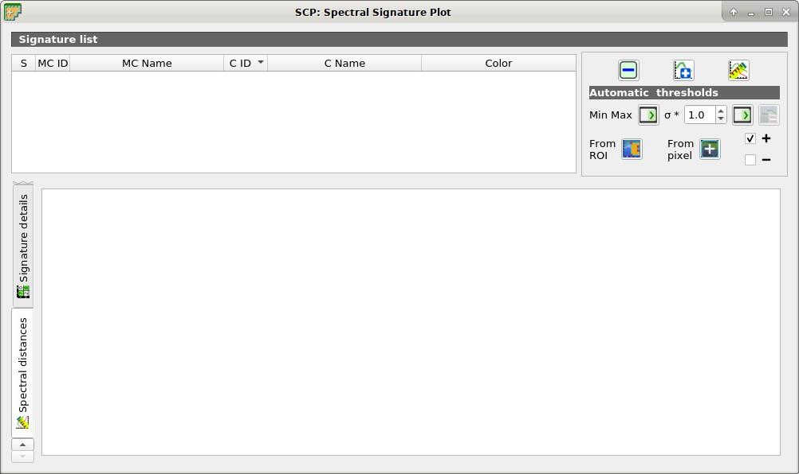
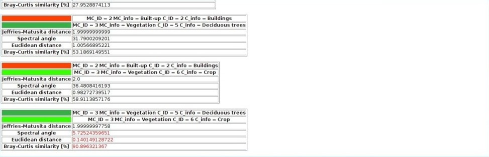

.. _spectral_signature_plot:

******************************
Spectral Signature Plot
******************************

.. |br| raw:: html

  

.. |registry_save| image:: _static/registry_save.png
	:width: 20pt
	
.. |project_save| image:: _static/project_save.png
	:width: 20pt
	
.. |optional| image:: _static/optional.png
	:width: 20pt
	
.. |input_list| image:: _static/input_list.jpg
	:width: 20pt
	
.. |input_text| image:: _static/input_text.jpg
	:width: 20pt
	
.. |input_date| image:: _static/input_date.jpg
	:width: 20pt
	
.. |input_number| image:: _static/input_number.jpg
	:width: 20pt
	
.. |input_slider| image:: _static/input_slider.jpg
	:width: 20pt
	
.. |input_table| image:: _static/input_table.jpg
	:width: 20pt
	
.. |checkbox| image:: _static/checkbox.png
	:width: 18pt
	
.. |enter| image:: _static/semiautomaticclassificationplugin_enter.png
	:width: 20pt

.. |remove| image:: _static/semiautomaticclassificationplugin_remove.png
	:width: 20pt
	
.. |LCS_threshold_set_tool| image:: _static/semiautomaticclassificationplugin_LCS_threshold_set_tool.png
	:width: 20pt
	
.. |calculate_spectral_distances| image:: _static/semiautomaticclassificationplugin_calculate_spectral_distances.png
	:width: 20pt
	
.. |fit_plot| image:: _static/semiautomaticclassificationplugin_fit_plot.png
	:width: 20pt
	
.. |sign_edit_range| image:: _static/semiautomaticclassificationplugin_sign_edit_range.png
	:width: 20pt
	
.. |save_plot_image| image:: _static/semiautomaticclassificationplugin_save_plot_image.png
	:width: 20pt
	
.. |save_plot| image:: _static/semiautomaticclassificationplugin_save_plot.png
	:width: 20pt
	
.. |LCS_threshold_ROI_tool| image:: _static/semiautomaticclassificationplugin_LCS_threshold_ROI_tool.png
	:width: 20pt
	
.. |undo_lcs_threshold| image:: _static/semiautomaticclassificationplugin_undo_lcs_threshold.png
	:width: 20pt
	
The window :guilabel:`Spectral Signature Plot` includes several functions for displaying spectral signature values as a function of wavelength (defined in the :ref:`band_set_tab`).
Signatures can be added to the ``Spectral Signature Plot`` through the :ref:`SCP_dock`.

The window :guilabel:`Spectral Signature Plot` includes also some functions useful for the definition of value ranges used by the :ref:`LCS_algorithm` (see :ref:`LCS_threshold`).

Overlapping signatures (belonging to different classes or macroclasses) are highlighted in orange in the table :ref:`signature_list_plot`; the overlapping check is performed considering :guilabel:`MC ID` or :guilabel:`C ID` according to the setting :guilabel:`Use` |checkbox| :guilabel:`MC ID` |checkbox| :guilabel:`C ID` in :ref:`classification_alg`.
Overlapping signatures sharing the same :guilabel:`ID` are not highlighted.

	
	:guilabel:`Spectral Signature Plot`

.. _signature_list_plot:

Plot Signature list
----------------------

* |input_table| :guilabel:`Signature list`:
	* :guilabel:`S`: checkbox field; if checked, the spectral signature is displayed in the plot;
	* :guilabel:`MC ID`: signature Macroclass ID;
	* :guilabel:`MC Info`: signature Macroclass Information;
	* :guilabel:`C ID`: signature Class ID;
	* :guilabel:`C Info`: signature Class Information;
	* :guilabel:`Color [overlap MC_ID-C_ID]`: signature color; also, the combination :guilabel:`MC ID`-:guilabel:`C ID` is displayed in case of overlap with other signatures (see :ref:`LCS_algorithm`);
	* :guilabel:`Min B` ``X``: minimum value of band ``X``; this value can be edited;
	* :guilabel:`Max B` ``X``: maximum value of band ``X``; this value can be edited;
* |remove|: remove highlighted signatures from this list;
* |save_plot|: add highlighted spectral signatures to :ref:`ROI_list`;
* |calculate_spectral_distances|: calculate the spectral distances of spectral signatures displayed in the plot; distances are reported in the tab :ref:`spectral_distances`;

.. _plot_automatic_thresholds:

Automatic thresholds
^^^^^^^^^^^^^^^^^^^^^^^

Set thresholds automatically for highlighted signatures in the table :ref:`signature_list_plot`; if no signature is highlighted, then the threshold is applied to all the signatures.

* :guilabel:`Min Max` |enter|: set the threshold based on the minimum and maximum of each band;
* :guilabel:`σ *` |input_number| |enter|: set an automatic threshold calculated as (band value + (σ * v)), where σ is the standard deviation of each band and v is the defined value;
* |undo_lcs_threshold|: undo the last automatic thresholds;
* :guilabel:`From ROI` |LCS_threshold_ROI_tool|: set the threshold using the temporary ROI pixel values, according to the following checkboxes:
	* |checkbox| **+**: if checked, signature threshold is extended to include pixel signature;
	* |checkbox| **–**: if checked, signature threshold is reduced to exclude pixel signature;
* :guilabel:`From pixel` |LCS_threshold_set_tool|: set the threshold by clicking on a pixel, according to the following checkboxes:
	* |checkbox| **+**: if checked, signature threshold is extended to include pixel signature;
	* |checkbox| **–**: if checked, signature threshold is reduced to exclude pixel signature;
	
.. _signature_plot:

Plot
^^^^^^^^^^^^^^^^^^^^^^^^^

**Left click** and hold inside the plot to **move** the view of the plot.
Use the **mouse wheel** to **zoom in and out** the view of the plot.
**Right click** and hold inside the plot to **zoom in a specific area** of the plot.
Legend inside the plot can be moved using the mouse.
	
Plot commands:

* |fit_plot|: automatically fit the plot to data;
* |save_plot_image|: save the plot image to file (available formats are ``.jpg``, ``.png``, and ``.pdf``);
* |sign_edit_range|: activate the cursor for interactively changing the value range of highlighted signatures in the plot; click the plot to set the minimum or maximum value of a band (also for several signatures simultaneously); cursor is deactivated when moving outside the plot area;
* |checkbox| :guilabel:`Plot value range`: if checked, plot the value range for each signature (semi-transparent area);
* |checkbox| :guilabel:`Band lines`: if checked, display a vertical line for each band (center wavelength);
* |checkbox| :guilabel:`Grid`: if checked, display a grid;
* :guilabel:`Max characters` |input_number|: set the maximum length of text in the legend;
* :guilabel:`x y`: display x y coordinates of mouse cursor inside the plot;

|br|

.. figure:: _static/example_plot.jpg
	:align: center
	:width: 500pt

	:guilabel:`Spectral Signature: Example of spectral signature plot`
	
.. _signature_details:

Signature details
^^^^^^^^^^^^^^^^^^^^^^^^^

	
	:guilabel:`Spectral Signature: Signature details`

Display the details about spectral signatures (i.e. Wavelength, Values, and Standard deviation).
In case of signatures calculated from ROIs, the ROI size (number of pixels) is also displayed.

	:guilabel:`Spectral Signature: Example of signature details`
		
.. _spectral_distances:

Spectral distances
^^^^^^^^^^^^^^^^^^^^^^^^^

	
	:guilabel:`Spectral Signature: Spectral distances`

Display spectral distances of signatures (see :ref:`signature_list_plot`), which are useful for assessing ROI separability (see :ref:`spectral_distance_definition`).

The following spectral distances are calculated :
	* :ref:`Jeffries_Matusita_distance`: range [0 = identical, 2 = different]; useful in particular for :ref:`max_likelihood_algorithm` classifications;
	* :ref:`spectral_angle`: range [0 = identical, 90 = different]; useful in particular for :ref:`spectra_angle_mapping_algorithm` classifications;
	* :ref:`euclidean_distance`: useful in particular for :ref:`minimum_distance_algorithm` classifications;
	* :ref:`Bray_Curtis_similarity`: range [0 = different, 100 = identical]; useful in general;
	
Values are displayed in red if signatures are particularly similar.
	

	
	:guilabel:`Spectral Signature: Example of spectral distances`
