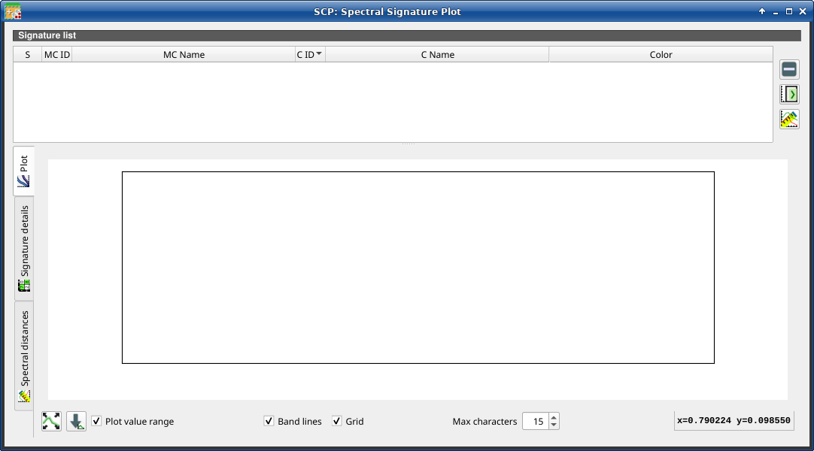
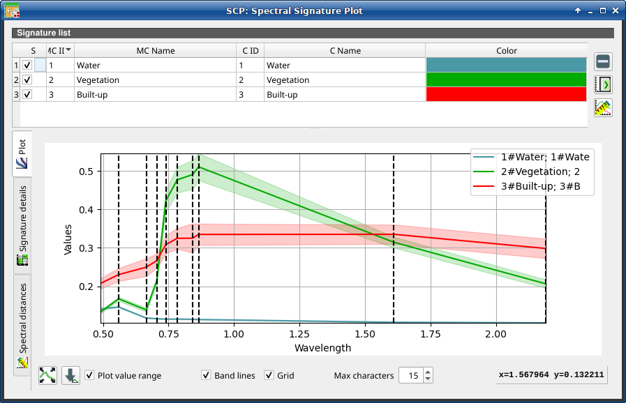
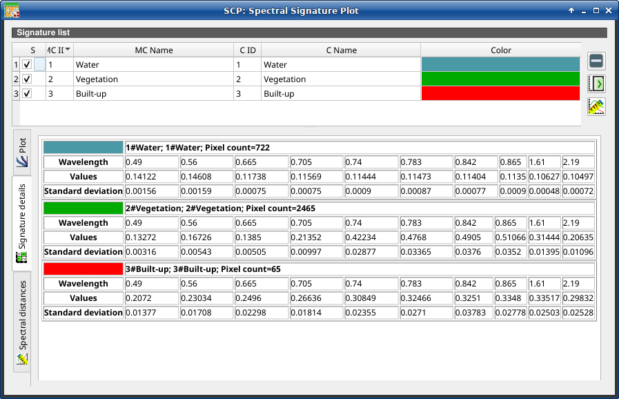

.. _spectral_signature_plot:

******************************
Spectral Signature Plot
******************************

.. |registry_save| image:: _static/registry_save.png
    :width: 20pt

.. |project_save| image:: _static/project_save.png
    :width: 20pt

.. |optional| image:: _static/optional.png
    :width: 20pt

.. |input_list| image:: _static/input_list.jpg
    :width: 20pt

.. |input_text| image:: _static/input_text.jpg
    :width: 20pt

.. |input_date| image:: _static/input_date.jpg
    :width: 20pt

.. |input_number| image:: _static/input_number.jpg
    :width: 20pt

.. |input_slider| image:: _static/input_slider.jpg
    :width: 20pt

.. |input_table| image:: _static/input_table.jpg
    :width: 20pt

.. |checkbox| image:: _static/checkbox.png
    :width: 18pt

.. |enter| image:: _static/semiautomaticclassificationplugin_enter.png
    :width: 20pt

.. |remove| image:: _static/semiautomaticclassificationplugin_remove.png
    :width: 20pt

.. |calculate_spectral_distances| image:: _static/semiautomaticclassificationplugin_calculate_spectral_distances.png
    :width: 20pt

.. |fit_plot| image:: _static/semiautomaticclassificationplugin_fit_plot.png
    :width: 20pt

.. |save_plot_image| image:: _static/semiautomaticclassificationplugin_save_plot_image.png
    :width: 20pt

.. |save_plot| image:: _static/semiautomaticclassificationplugin_save_plot.png
    :width: 20pt

The window :guilabel:`Spectral Signature Plot` includes several functions for
displaying spectral signature values as a function of wavelength
(defined in the :ref:`band_set_tab`).
Signatures can be added to the ``Spectral Signature Plot`` through
the :ref:`SCP_dock`.

Overlapping signatures (belonging to different classes or macroclasses) are
highlighted in orange in the table :ref:`signature_list_plot`;
the overlapping check is performed considering :guilabel:`MC ID` or
:guilabel:`C ID` according to the setting :guilabel:`Use` |checkbox|
:guilabel:`MC ID` |checkbox| :guilabel:`C ID` in :ref:`classification_tab`.
Overlapping signatures sharing the same :guilabel:`ID` are not highlighted.

    :guilabel:`Spectral Signature Plot`

.. _signature_list_plot:

Signature list
----------------------

The :guilabel:`Signature list` is a table that includes the spectral signatures
added from the :ref:`SCP_dock`.

.. list-table::
    :widths: auto
    :header-rows: 1

    * -  S
      -  MC ID
      -  MC Name
      -  C ID
      -  C Name
      -  Color
    * - checkbox field; if checked, the spectral signature is displayed in the
        plot
      - signature Macroclass ID
      - signature Macroclass Name
      - signature Class ID
      - signature Class Name
      - signature color; also, the combination
        :guilabel:`MC ID`-:guilabel:`C ID` is displayed in case of overlap
        with other signatures

The following tools are available.

.. list-table::
    :widths: auto
    :header-rows: 1

    * - Tool symbol and name
      - Description
    * - |remove|
      - remove highlighted signatures from this list
    * - |save_plot|
      - add highlighted spectral signatures to :ref:`ROI_list`
    * - |calculate_spectral_distances|
      - calculate the spectral distances of spectral signatures displayed in
        the plot; distances are reported in the tab :ref:`spectral_distances`

.. _signature_plot:

Plot
^^^^^^^^^^^^^^^^^^^^^^^^^

**Left click** and hold inside the plot to **move** the view of the plot.
Use the **mouse wheel** to **zoom in and out** the view of the plot.
**Right click** and hold inside the plot to **zoom in a specific area** of
the plot.
Legend inside the plot can be moved using the mouse.

The following tools are available.

.. list-table::
    :widths: auto
    :header-rows: 1

    * - Tool symbol and name
      - Description
    * - |fit_plot|
      - automatically fit the plot to data
    * - |save_plot_image|
      - save the plot image to file (available formats are ``.jpg``, ``.png``,
        and ``.pdf``)
    * - |checkbox| :guilabel:`Plot value range`
      - if checked, plot the value range for each signature with a
        semi-transparent area
    * - |checkbox| :guilabel:`Band lines`
      - if checked, display a vertical line for each band (center wavelength)
    * - |checkbox| :guilabel:`Grid`
      - if checked, display a grid
    * - :guilabel:`Max characters` |input_number|
      - set the maximum length of text in the legend
    * - :guilabel:`x y`
      - display x y coordinates of mouse cursor inside the plot

    :guilabel:`Spectral Signature: Example of plot`

.. _signature_details:

Signature details
^^^^^^^^^^^^^^^^^^^^^^^^^

Display the details about spectral signatures (i.e. Wavelength, Values, and
Standard deviation).
In case of signatures calculated from ROIs, the ROI size (number of pixels) is
also displayed.

    :guilabel:`Spectral Signature: Example of signature details`

.. _spectral_distances:

Spectral distances
^^^^^^^^^^^^^^^^^^^^^^^^^

Display spectral distances of signatures (see :ref:`signature_list_plot`),
which are useful for assessing ROI separability (see
:ref:`spectral_distance_definition`).

The following spectral distances are calculated :
    * :ref:`spectral_angle`: range [0 = identical, 90 = different];
      useful in particular for :ref:`spectra_angle_mapping_algorithm`
      classifications
    * :ref:`euclidean_distance`: useful in particular for
      :ref:`minimum_distance_algorithm` classifications
    * :ref:`Bray_Curtis_similarity`: range [0 = different, 100 = identical];
      useful in general

Values are displayed in red if signatures are particularly similar.

.. figure:: _static/interface/example_distance.png
    :align: center
    :width: 100%

    :guilabel:`Spectral Signature: Example of spectral distances`
