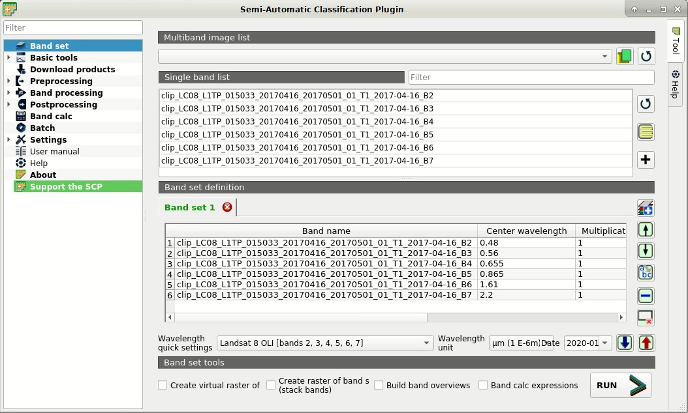
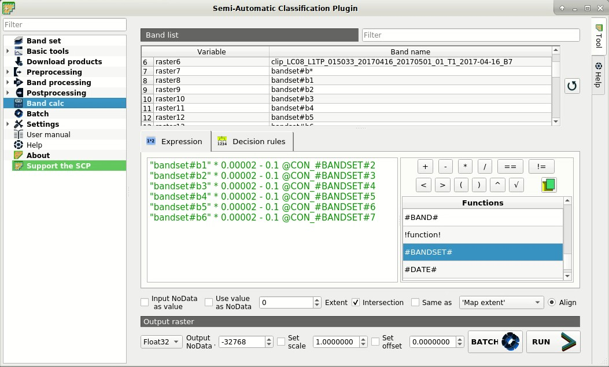
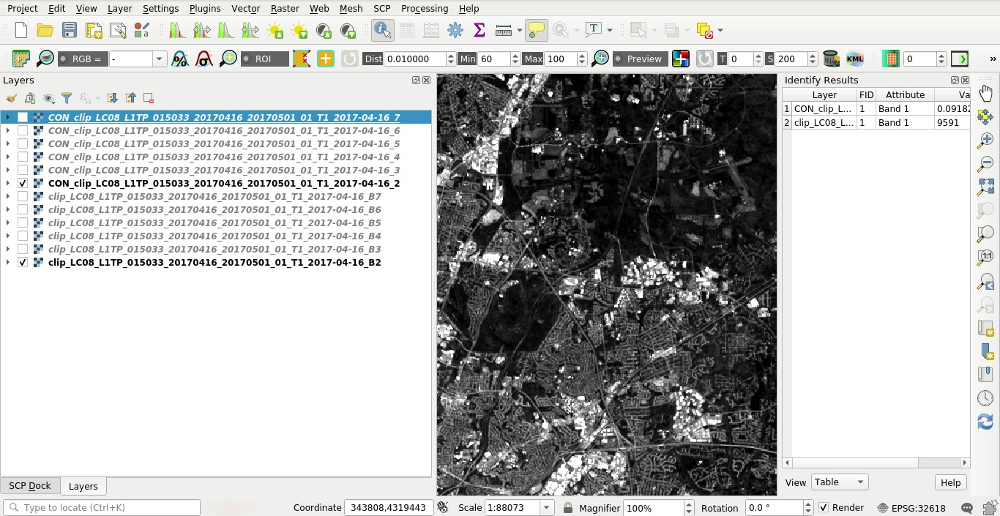
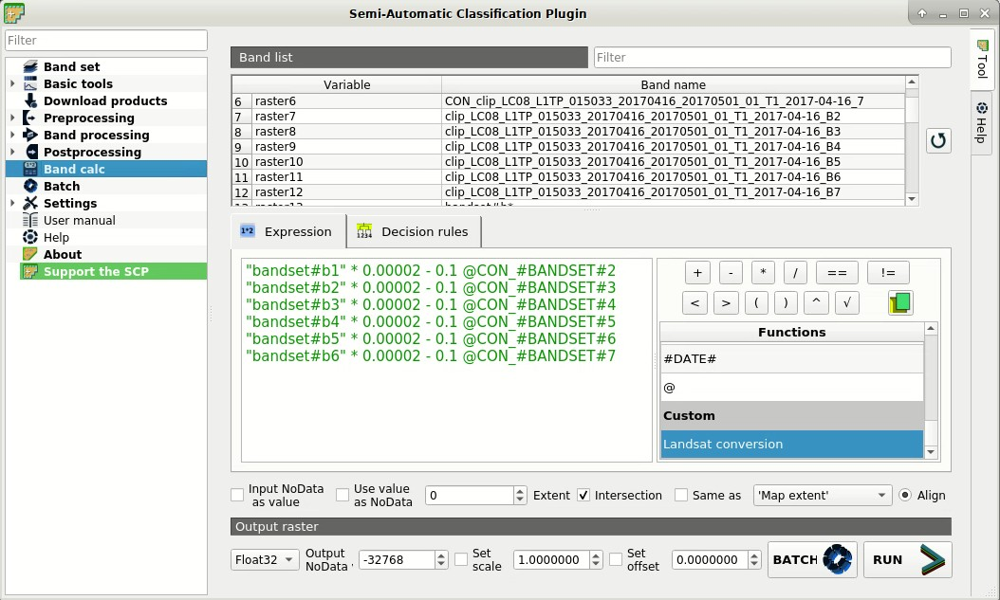
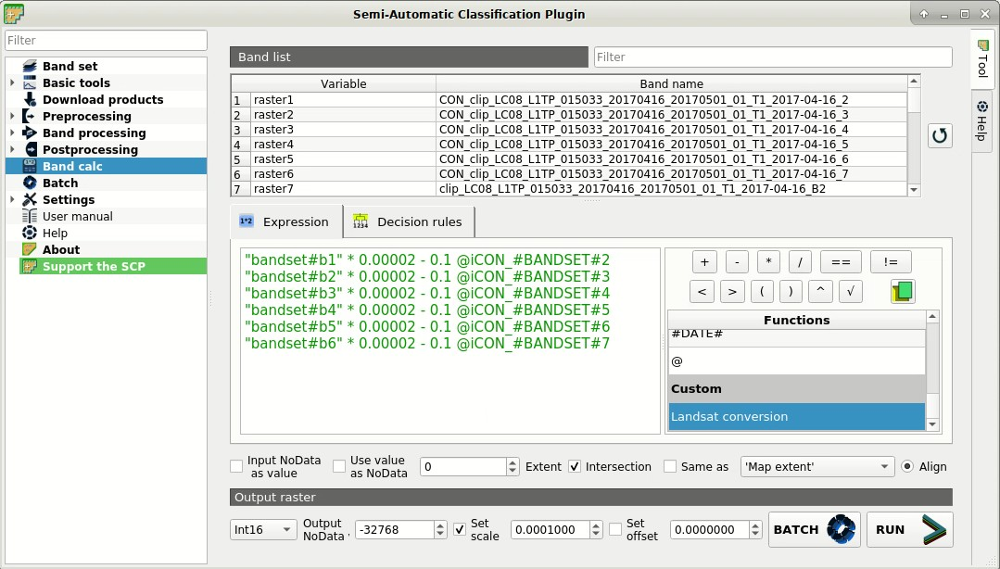
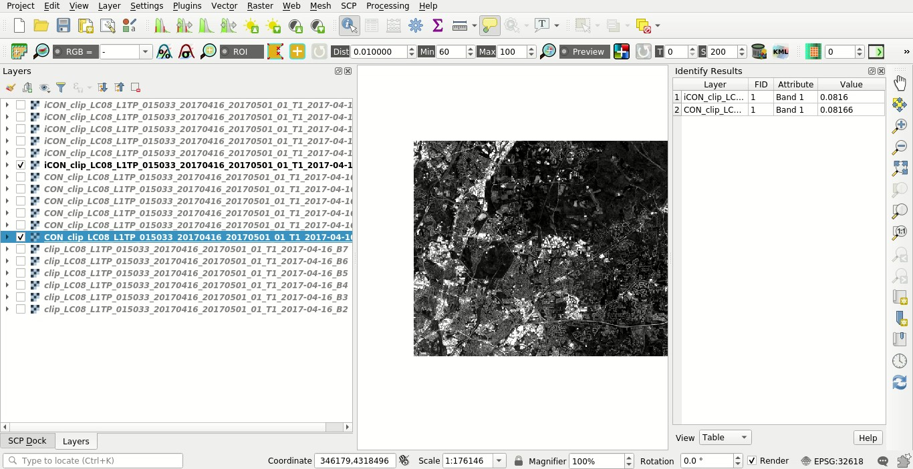

.. _thematic_tutorial_image_conversion:

***************************************************************
Tutorial: Image Conversion to Reflectance
***************************************************************

.. |br| raw:: html

  

.. |add| image:: _static/semiautomaticclassificationplugin_add.png
	:width: 20pt
	
.. |checkbox| image:: _static/checkbox.png
	:width: 18pt
	
.. |pointer| image:: _static/semiautomaticclassificationplugin_pointer_tool.png
	:width: 20pt
	
.. |radiobutton| image:: _static/radiobutton.png
	:width: 18pt
	
.. |reload| image:: _static/semiautomaticclassificationplugin_reload.png
	:width: 20pt
	
.. |reset| image:: _static/semiautomaticclassificationplugin_reset.png
	:width: 20pt
	
.. |remove| image:: _static/semiautomaticclassificationplugin_remove.png
	:width: 20pt
	
.. |run| image:: _static/semiautomaticclassificationplugin_run.png
	:width: 24pt
	
.. |input_number| image:: _static/input_number.jpg
	:width: 20pt
	
.. |input_list| image:: _static/input_list.jpg
	:width: 20pt
	
.. |open_file| image:: _static/semiautomaticclassificationplugin_open_file.png
	:width: 20pt
	
.. |new_file| image:: _static/semiautomaticclassificationplugin_new_file.png
	:width: 20pt
	
.. |open_dir| image:: _static/semiautomaticclassificationplugin_open_dir.png
	:width: 20pt
	
.. |select_all| image:: _static/semiautomaticclassificationplugin_select_all.png
	:width: 20pt
	
.. |move_up| image:: _static/semiautomaticclassificationplugin_move_up.png
	:width: 20pt
	
.. |move_down| image:: _static/semiautomaticclassificationplugin_move_down.png
	:width: 20pt
	
.. |search_images| image:: _static/semiautomaticclassificationplugin_search_images.png
	:width: 20pt

.. |image_preview| image:: _static/semiautomaticclassificationplugin_download_image_preview.png
	:width: 20pt

.. |import| image:: _static/semiautomaticclassificationplugin_import.png
	:width: 20pt
	
.. |export| image:: _static/semiautomaticclassificationplugin_export.png
	:width: 20pt

.. |plus| image:: _static/semiautomaticclassificationplugin_plus.png
	:width: 20pt

.. |order_by_name| image:: _static/semiautomaticclassificationplugin_order_by_name.png
	:width: 20pt

.. |image_overview| image:: _static/semiautomaticclassificationplugin_download_image_overview.png
	:width: 20pt
	
.. |enter| image:: _static/semiautomaticclassificationplugin_enter.png
	:width: 20pt

.. |download| image:: _static/semiautomaticclassificationplugin_download_arrow.png
	:width: 20pt
	
.. |landsat_download| image:: _static/semiautomaticclassificationplugin_landsat8_download_tool.png
	:width: 20pt

.. |sentinel_download| image:: _static/semiautomaticclassificationplugin_sentinel_download_tool.png
	:width: 20pt
	
.. |tools| image:: _static/semiautomaticclassificationplugin_roi_tool.png
	:width: 20pt
	
.. |roi_multiple| image:: _static/semiautomaticclassificationplugin_roi_multiple.png
	:width: 20pt

.. |import_spectral_library| image:: _static/semiautomaticclassificationplugin_import_spectral_library.png
	:width: 20pt
	
.. |export_spectral_library| image:: _static/semiautomaticclassificationplugin_export_spectral_library.png
	:width: 20pt
	
.. |weight_tool| image:: _static/semiautomaticclassificationplugin_weight_tool.png
	:width: 20pt
	
.. |threshold_tool| image:: _static/semiautomaticclassificationplugin_threshold_tool.png
	:width: 20pt
	
.. |LCS_threshold| image:: _static/semiautomaticclassificationplugin_LCS_threshold_tool.png
	:width: 20pt
	
.. |LCS_threshold_set_tool| image:: _static/semiautomaticclassificationplugin_LCS_threshold_set_tool.png
	:width: 20pt
	
.. |preprocessing| image:: _static/semiautomaticclassificationplugin_class_tool.png
	:width: 20pt
	
.. |processing| image:: _static/semiautomaticclassificationplugin_band_processing.png
	:width: 20pt
	
.. |landsat_tool| image:: _static/semiautomaticclassificationplugin_landsat8_tool.png
	:width: 20pt
	
.. |sentinel2_tool| image:: _static/semiautomaticclassificationplugin_sentinel_tool.png
	:width: 20pt
	
.. |aster_tool| image:: _static/semiautomaticclassificationplugin_aster_tool.png
	:width: 20pt
	
.. |split_raster| image:: _static/semiautomaticclassificationplugin_split_raster.png
	:width: 20pt
	
.. |clip_tool| image:: _static/semiautomaticclassificationplugin_clip_tool.png
	:width: 20pt
	
.. |pca_tool| image:: _static/semiautomaticclassificationplugin_pca_tool.png
	:width: 20pt
	
.. |vector_to_raster_tool| image:: _static/semiautomaticclassificationplugin_vector_to_raster_tool.png
	:width: 20pt
	
.. |post_process| image:: _static/semiautomaticclassificationplugin_post_process.png
	:width: 20pt
	
.. |accuracy_tool| image:: _static/semiautomaticclassificationplugin_accuracy_tool.png
	:width: 20pt
	
.. |land_cover_change| image:: _static/semiautomaticclassificationplugin_land_cover_change.png
	:width: 20pt
	
.. |report_tool| image:: _static/semiautomaticclassificationplugin_report_tool.png
	:width: 20pt

.. |class_to_vector_tool| image:: _static/semiautomaticclassificationplugin_class_to_vector_tool.png
	:width: 20pt

.. |reclassification_tool| image:: _static/semiautomaticclassificationplugin_reclassification_tool.png
	:width: 20pt

.. |edit_raster| image:: _static/semiautomaticclassificationplugin_edit_raster.png
	:width: 20pt

.. |undo_edit_raster| image:: _static/semiautomaticclassificationplugin_undo_edit_raster.png
	:width: 20pt

.. |classification_sieve| image:: _static/semiautomaticclassificationplugin_classification_sieve.png
	:width: 20pt

.. |classification_erosion| image:: _static/semiautomaticclassificationplugin_classification_erosion.png
	:width: 20pt

.. |classification_dilation| image:: _static/semiautomaticclassificationplugin_classification_dilation.png
	:width: 20pt

.. |bandcalc_tool| image:: _static/semiautomaticclassificationplugin_bandcalc_tool.png
	:width: 20pt
	
.. |batch_tool| image:: _static/semiautomaticclassificationplugin_batch.png
	:width: 20pt

.. |bandset_tool| image:: _static/semiautomaticclassificationplugin_bandset_tool.png
	:width: 20pt
	
.. |settings_tool| image:: _static/semiautomaticclassificationplugin_settings_tool.png
	:width: 20pt
	
.. |manual_ROI| image:: _static/semiautomaticclassificationplugin_manual_ROI.png
	:width: 20pt

.. |save_roi| image:: _static/semiautomaticclassificationplugin_save_roi.png
	:width: 20pt
	
.. |roi_single| image:: _static/semiautomaticclassificationplugin_roi_single.png
	:width: 20pt
	
.. |roi_redo| image:: _static/semiautomaticclassificationplugin_roi_redo.png
	:width: 20pt

.. |preview| image:: _static/semiautomaticclassificationplugin_preview.png
	:width: 20pt
	
.. |preview_redo| image:: _static/semiautomaticclassificationplugin_preview_redo.png
	:width: 20pt
	
.. |delete_signature| image:: _static/semiautomaticclassificationplugin_delete_signature.png
	:width: 20pt

.. |sign_plot| image:: _static/semiautomaticclassificationplugin_sign_tool.png
	:width: 20pt

.. |cumulative_stretch| image:: _static/semiautomaticclassificationplugin_bandset_cumulative_stretch_tool.png
	:width: 20pt

.. |std_dev_stretch| image:: _static/semiautomaticclassificationplugin_bandset_std_dev_stretch_tool.png
	:width: 20pt

.. |calculate_spectral_distances| image:: _static/semiautomaticclassificationplugin_calculate_spectral_distances.png
	:width: 20pt
	
.. |remove_temp| image:: _static/semiautomaticclassificationplugin_remove_temp.png
	:width: 20pt
	
.. |osm_add| image:: _static/semiautomaticclassificationplugin_osm_add.png
	:width: 20pt

.. contents::
    :depth: 2
    :local:
	

This tutorial is about the image conversion to :ref:`radiance_conversion` or to :ref:`TOA_conversion`.
It is assumed that one has the basic knowledge of :guilabel:`SCP` and :ref:`tutorials`.

:guilabel:`SCP` includes several tool for preprocessing images such as Landsat, Sentinel-2, Sentinel-3.
Using satellite images from various sources could require the preprocessing and radiometric correction.

Usually, remote sensing images are delivered as calibrated Digital Numbers (DN), and the conversion to radiance or reflectance can be performed through parameters that are provided with the image.

This tutorials aims to describe how to perform the conversion to TOA reflectance of remote sensing images.
The calculation can be performed for all the bands at once in :ref:`band_calc_tab`, knowing the required parameters. 

Following the video of this tutorial.

.. raw:: html

	<iframe allowfullscreen="" frameborder="0" height="360" src="http://www.youtube.com/embed/ts5VXnmoIiY?rel=0" width="100%"></iframe>

http://www.youtube.com/watch?v=ts5VXnmoIiY

.. _tutorial_image_conversion_input_data:

Input Data
-------------------------

In this tutorial, we are going to use a subset of a :ref:`Landsat_definition` image (data available from the U.S. Geological Survey).
You can download the sample image from `this archive (about 4 MB) <https://docs.google.com/uc?id=18CXceeQrjxQoM5Z80kvlvdTI4SmVBDZn>`_ that includes bands 2, 3, 4, 5, 6, and 7.

We'll pretend that Landsat tool is not included in the preprocessing tools of :guilabel:`SCP`, but use the :ref:`band_calc_tab` to perform the calculations for all the bands at once.
The same tutorial could be applied to different satellite images, knowing the equations and factors required for the image conversion to reflectance.

Start QGIS and the :guilabel:`SCP`.

Open the tab :ref:`band_set_tab` clicking the button |bandset_tool| in the :ref:`SCP_menu` or the :ref:`SCP_dock`.
Click the button |open_file| and open the directory containing the input bands and select all the ``.tif`` files.
The selected bands will be added to the :guilabel:`active band set`.

In the table :guilabel:`Band set definition` order the band names in ascending order (click |order_by_name| to sort bands by name automatically).
Finally, select :guilabel:`Landsat 8 OLI` from the list :guilabel:`Wavelength quick settings`, in order to set automatically the :guilabel:`Center wavelength` of each band and the :guilabel:`Wavelength unit` (required for spectral signature calculation).
If the satellite image wasn't listed in :guilabel:`Wavelength quick settings` it is possible to enter manually the :guilabel:`Center wavelength`.

	
	:guilabel:`Band set`
	
	
.. _tutorial_image_conversion_band_calc:

Conversion to reflectance
------------------------------------------------------

Usually, image providers describe the equations required for converting the DN to reflectance (or radiance) values.
For Landsat 8 images **TOA planetary reflectance** (:math:`\rho_{\lambda}`) is given by (https://www.usgs.gov/core-science-systems/nli/landsat/using-usgs-landsat-level-1-data-product):

.. math::

	\rho_{\lambda} = M_{p} * Q_{cal} + A_{p}

where:

* :math:`M_{p}` = Band-specific multiplicative rescaling factor from Landsat metadata (REFLECTANCE_MULT_BAND_x, where x is the band number)
* :math:`A_{p}` = Band-specific additive rescaling factor from Landsat metadata (REFLECTANCE_ADD_BAND_x, where x is the band number)
* :math:`Q_{cal}` = Quantized and calibrated standard product pixel values (DN)

A similar equation is available for the conversion to :ref:`radiance_conversion`.

	**TIP** : the conversion performed by :guilabel:`SCP` also includes a correction for solar angle, please read :ref:`TOA_conversion`.

Now, we need to open the metadata file ``LC08_L1TP_015033_20170416_20170501_01_T1_MTL.txt`` (the matadata file name could vary for other images) using a text editor and take note of the REFLECTANCE_MULT_BAND_x and REFLECTANCE_ADD_BAND_x values for each band (bands 2, 3, 4, 5, 6, 7).
In this case the values are:

+-------------------------------------+-------------------------------------+------------------------+------------------------+
| Landsat Bands                       | REFLECTANCE_MULT_BAND               | REFLECTANCE_ADD_BAND   | Band number in Band Set|
+=====================================+=====================================+========================+========================+
| Band 2                              | 0.00002                             |  -0.1                  |  1                     |
+-------------------------------------+-------------------------------------+------------------------+------------------------+
| Band 3                              | 0.00002                             |  -0.1                  |  2                     |
+-------------------------------------+-------------------------------------+------------------------+------------------------+
| Band 4                              | 0.00002                             |  -0.1                  |  3                     |
+-------------------------------------+-------------------------------------+------------------------+------------------------+
| Band 5                              | 0.00002                             |  -0.1                  |  4                     |
+-------------------------------------+-------------------------------------+------------------------+------------------------+
| Band 6                              | 0.00002                             |  -0.1                  |  5                     |
+-------------------------------------+-------------------------------------+------------------------+------------------------+
| Band 7                              | 0.00002                             |  -0.1                  |  6                     |
+-------------------------------------+-------------------------------------+------------------------+------------------------+

Therefore, we can write the expressions to be used in the :ref:`band_calc_tab`.
We can write the expressions using the :ref:`input_variables` referred to the band number in active :guilabel:`Band set` (i.e. :guilabel:`bandset#b` `BAND_NUMBER`), thus we can use the same expressions later for other images of the same satellite.
For instance, the following variable refers to band 1 of the active :guilabel:`Band set`::

	"bandset#b1"

Therefore, the equation :math:`\rho_{\lambda} = M_{p} * Q_{cal} + A_{p}` becomes the following expression for the first band::

	"bandset#b1" * 0.00002 - 0.1 

We also use the :ref:`output_variables` in order to set automatically the output names of each calculation.
The variable :guilabel:`#BANDSET#` allows for using the name (without the ending number) of the first band in the :guilabel:`Band set`.

Output names can be defined in the expression line entering the symbol ``@`` followed by the name, so the previous expression for band 1 becomes::

	"bandset#b1" * 0.00002 - 0.1 @CON_#BANDSET#2
	
In the above expression, the output name will have the prefix ``CON_`` followed by the original image name and the original band number (i.e. 2).

We can write the expressions for all the bands (in this case it is simple because the multiplicative and additive rescaling factors are the same for each band)::

	"bandset#b1" * 0.00002 - 0.1 @CON_#BANDSET#2
	"bandset#b2" * 0.00002 - 0.1 @CON_#BANDSET#3
	"bandset#b3" * 0.00002 - 0.1 @CON_#BANDSET#4
	"bandset#b4" * 0.00002 - 0.1 @CON_#BANDSET#5
	"bandset#b5" * 0.00002 - 0.1 @CON_#BANDSET#6
	"bandset#b6" * 0.00002 - 0.1 @CON_#BANDSET#7
	
We can now enter all the above expressions in :ref:`band_calc_tab` and click the button :guilabel:`RUN` |run| to select a directory where bands are saved and start the calculations.

	
	:guilabel:`Band calc`

After the process, all the converted images are added to the map, as you can see with the file name ``CON_ + original image name + band number`` .

	
	:guilabel:`Converted bands`
	
	
Well done!
We have converted to reflectance all the bands of remote sensing image that could be used for performing a land cover classification.

.. _tutorial_image_conversion_save_expressions:

Save the expressions in Band Calc (optional)
------------------------------------------------------

We can save the expressions in the list of :ref:`band_calc_function` for a rapid use.
This requires the creation of a text file containing the expressions.
The structure of the text file must be in the form ``expression_name; expression`` (separated by ``;``) where the ``expression_name`` is the name that is displayed in the list :guilabel:`Functions` (for instance ``Landsat conversion``).

Because we have multiple expressions, we must put every expression in the same line and separate by `` `` such as::

	Landsat conversion; "bandset#b1" * 0.00002 - 0.1 @CON_#BANDSET#2  "bandset#b2" * 0.00002 - 0.1 @CON_#BANDSET#3  "bandset#b3" * 0.00002 - 0.1 @CON_#BANDSET#4  "bandset#b4" * 0.00002 - 0.1 @CON_#BANDSET#5  "bandset#b5" * 0.00002 - 0.1 @CON_#BANDSET#6  "bandset#b6" * 0.00002 - 0.1 @CON_#BANDSET#7

First, we open a text editor and paste the above string.
After saving the text file (.txt), in :ref:`band_calc_tab` click the button |open_file| and select the saved text file containing the function.
The item ``Landsat conversion`` will be listed under **Custom**.
Double clicking this item will add the expressions to the calculation. 

	
	:guilabel:`Function added to Band Calc`
	
The same expressions could be used for converting other images having the same multiplicative and additive rescaling factors.
Of course, in case of different satellites we should adapt the expressions to the specific factors and equations provided with the images.
We could also create more complicated expressions, for instance adding the calculation of spectral indices such as NDVI.
This will be described in other tutorials.

.. _tutorial_image_conversion_scale_output:

Scale the output to reduce file size (optional)
------------------------------------------------------

The results of the previously calculated bands were saved as float values (i.e. Float32) and as you can see pixel values have several decimal places.
If we would like to reduce file size, we can reduce the decimal precision by reducing the bits of data type.
For instance, the precision provided by 4 decimal places could be sufficient in several cases.
 
We can use the ``scale`` option in :ref:`band_calc_tab` to create a raster which is scaled and evaluated as float by software (the decimal places depend on the scale factor).
The data type Int16 can store values from −32,768 to 32,767, therefore dividing pixel values by 10,000 we could get a range with 4 decimal places from −3.2768 to 3.2767 , which is coherent to the value range of reflectance (i.e. from 0 to 1) or other spectral indices.

In :ref:`band_calc_tab` under ``Output raster`` select :guilabel:`Int16` , check |checkbox| :guilabel:`Set scale` |input_number| and enter 0.0001 .
This means that original raster values will be divided by 0.0001 and saved as 16bit integer.
When the raster is read by software, pixels will be multiplied on the fly by 0.0001 obtaining the value with 4 decimal places.

	
	:guilabel:`Scale factor in Band Calc`
	
The rasters of data type Int16 defined with decimal scale value will be interpreted as Float32 by software.
For example, a pixel value 0.596812 is first divided by 0.0001 , converted to integer, and stored as 5968.
When the raster is processed by software, pixel value is multiplied on the fly by 0.0001 obtaining the value 0.5968 .

Now we can perform the same calculations described in :ref:`tutorial_image_conversion_band_calc` obtaining rasters of about half the file size of the previous ones, and of course reduced decimal precision.

	
	:guilabel:`Scaled rasters`
	
Other calculations with :ref:`band_calc_tab` will described in the next few tutorials.