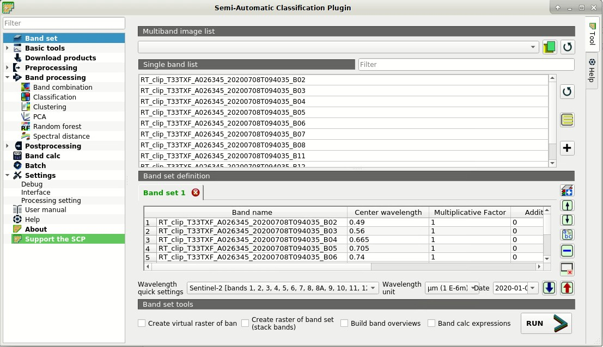
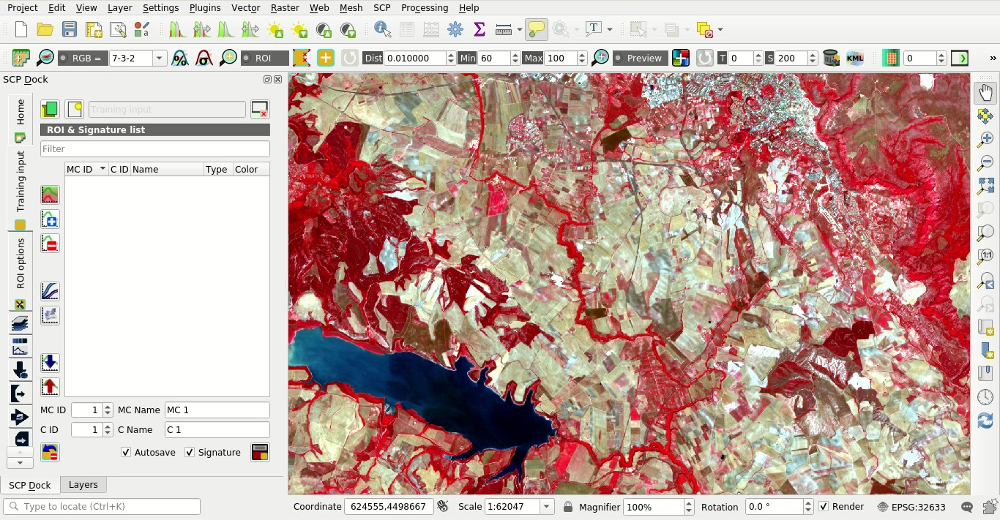
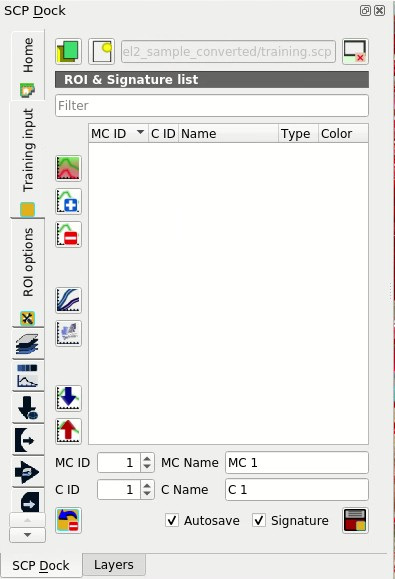
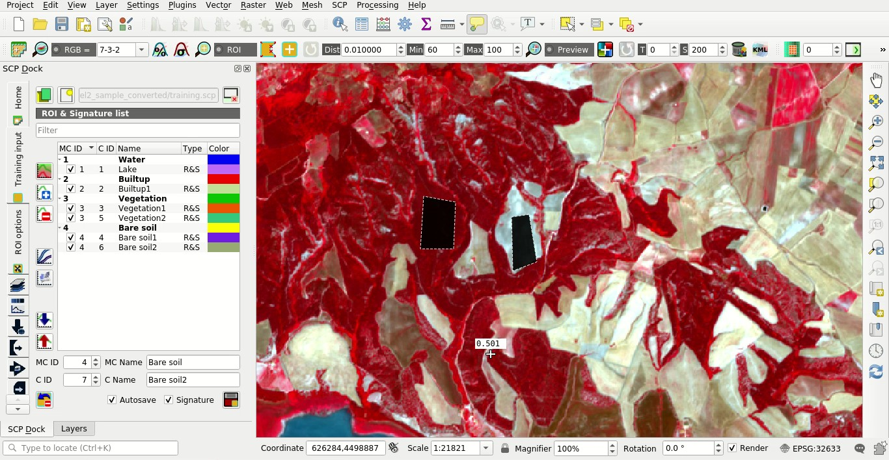
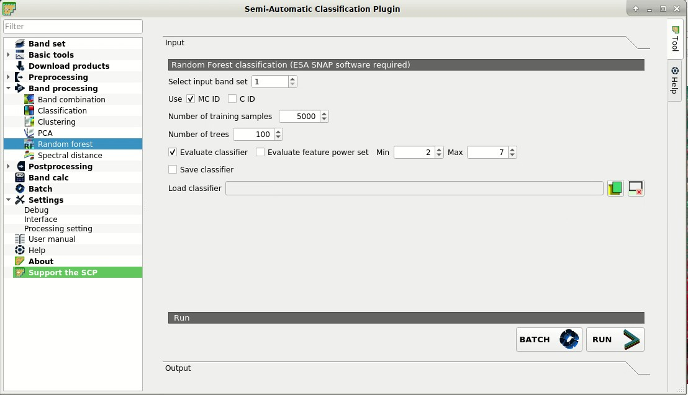
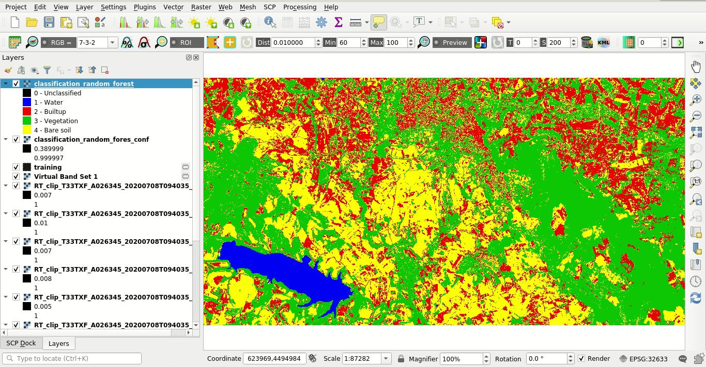
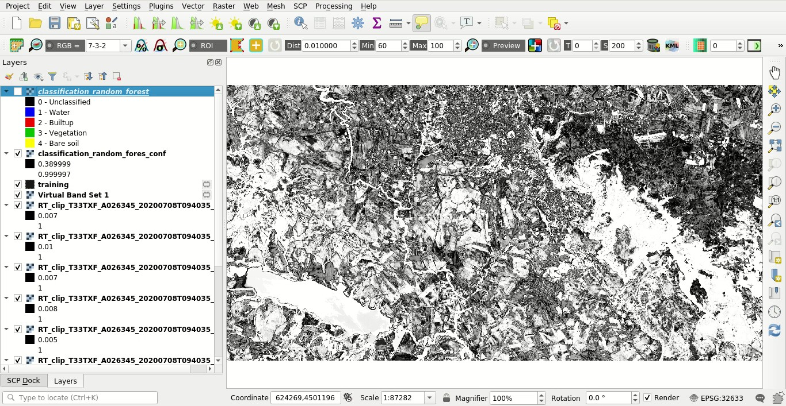
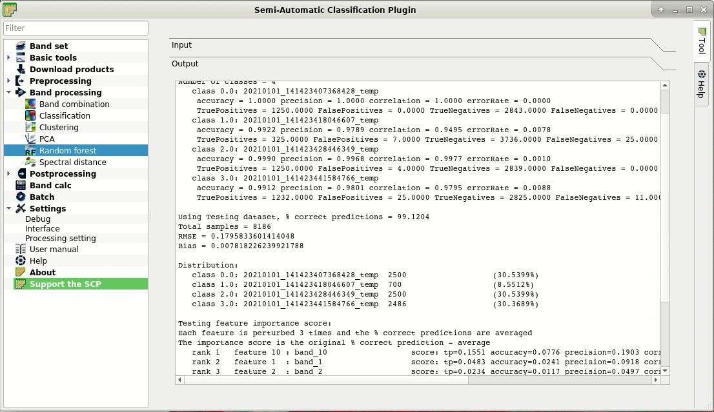

.. _thematic_tutorial_random_forest:

***************************************************************
Tutorial: Random Forest Classification
***************************************************************

.. |br| raw:: html

  

.. |add| image:: _static/semiautomaticclassificationplugin_add.png
	:width: 20pt
	
.. |checkbox| image:: _static/checkbox.png
	:width: 18pt
	
.. |pointer| image:: _static/semiautomaticclassificationplugin_pointer_tool.png
	:width: 20pt
	
.. |radiobutton| image:: _static/radiobutton.png
	:width: 18pt
	
.. |reload| image:: _static/semiautomaticclassificationplugin_reload.png
	:width: 20pt
	
.. |reset| image:: _static/semiautomaticclassificationplugin_reset.png
	:width: 20pt
	
.. |remove| image:: _static/semiautomaticclassificationplugin_remove.png
	:width: 20pt
	
.. |run| image:: _static/semiautomaticclassificationplugin_run.png
	:width: 24pt
	
.. |input_number| image:: _static/input_number.jpg
	:width: 20pt
	
.. |input_list| image:: _static/input_list.jpg
	:width: 20pt
	
.. |open_file| image:: _static/semiautomaticclassificationplugin_open_file.png
	:width: 20pt
	
.. |new_file| image:: _static/semiautomaticclassificationplugin_new_file.png
	:width: 20pt
	
.. |open_dir| image:: _static/semiautomaticclassificationplugin_open_dir.png
	:width: 20pt
	
.. |select_all| image:: _static/semiautomaticclassificationplugin_select_all.png
	:width: 20pt
	
.. |move_up| image:: _static/semiautomaticclassificationplugin_move_up.png
	:width: 20pt
	
.. |move_down| image:: _static/semiautomaticclassificationplugin_move_down.png
	:width: 20pt
	
.. |search_images| image:: _static/semiautomaticclassificationplugin_search_images.png
	:width: 20pt

.. |image_preview| image:: _static/semiautomaticclassificationplugin_download_image_preview.png
	:width: 20pt

.. |import| image:: _static/semiautomaticclassificationplugin_import.png
	:width: 20pt
	
.. |export| image:: _static/semiautomaticclassificationplugin_export.png
	:width: 20pt

.. |plus| image:: _static/semiautomaticclassificationplugin_plus.png
	:width: 20pt

.. |order_by_name| image:: _static/semiautomaticclassificationplugin_order_by_name.png
	:width: 20pt

.. |image_overview| image:: _static/semiautomaticclassificationplugin_download_image_overview.png
	:width: 20pt
	
.. |enter| image:: _static/semiautomaticclassificationplugin_enter.png
	:width: 20pt

.. |download| image:: _static/semiautomaticclassificationplugin_download_arrow.png
	:width: 20pt
	
.. |landsat_download| image:: _static/semiautomaticclassificationplugin_landsat8_download_tool.png
	:width: 20pt

.. |sentinel_download| image:: _static/semiautomaticclassificationplugin_sentinel_download_tool.png
	:width: 20pt
	
.. |tools| image:: _static/semiautomaticclassificationplugin_roi_tool.png
	:width: 20pt
	
.. |roi_multiple| image:: _static/semiautomaticclassificationplugin_roi_multiple.png
	:width: 20pt

.. |import_spectral_library| image:: _static/semiautomaticclassificationplugin_import_spectral_library.png
	:width: 20pt
	
.. |export_spectral_library| image:: _static/semiautomaticclassificationplugin_export_spectral_library.png
	:width: 20pt
	
.. |weight_tool| image:: _static/semiautomaticclassificationplugin_weight_tool.png
	:width: 20pt
	
.. |threshold_tool| image:: _static/semiautomaticclassificationplugin_threshold_tool.png
	:width: 20pt
	
.. |LCS_threshold| image:: _static/semiautomaticclassificationplugin_LCS_threshold_tool.png
	:width: 20pt
	
.. |LCS_threshold_set_tool| image:: _static/semiautomaticclassificationplugin_LCS_threshold_set_tool.png
	:width: 20pt
	
.. |preprocessing| image:: _static/semiautomaticclassificationplugin_class_tool.png
	:width: 20pt
	
.. |processing| image:: _static/semiautomaticclassificationplugin_band_processing.png
	:width: 20pt
	
.. |landsat_tool| image:: _static/semiautomaticclassificationplugin_landsat8_tool.png
	:width: 20pt
	
.. |sentinel2_tool| image:: _static/semiautomaticclassificationplugin_sentinel_tool.png
	:width: 20pt
	
.. |aster_tool| image:: _static/semiautomaticclassificationplugin_aster_tool.png
	:width: 20pt
	
.. |split_raster| image:: _static/semiautomaticclassificationplugin_split_raster.png
	:width: 20pt
	
.. |clip_tool| image:: _static/semiautomaticclassificationplugin_clip_tool.png
	:width: 20pt
	
.. |pca_tool| image:: _static/semiautomaticclassificationplugin_pca_tool.png
	:width: 20pt
	
.. |vector_to_raster_tool| image:: _static/semiautomaticclassificationplugin_vector_to_raster_tool.png
	:width: 20pt
	
.. |post_process| image:: _static/semiautomaticclassificationplugin_post_process.png
	:width: 20pt
	
.. |accuracy_tool| image:: _static/semiautomaticclassificationplugin_accuracy_tool.png
	:width: 20pt
	
.. |land_cover_change| image:: _static/semiautomaticclassificationplugin_land_cover_change.png
	:width: 20pt
	
.. |report_tool| image:: _static/semiautomaticclassificationplugin_report_tool.png
	:width: 20pt

.. |class_to_vector_tool| image:: _static/semiautomaticclassificationplugin_class_to_vector_tool.png
	:width: 20pt

.. |reclassification_tool| image:: _static/semiautomaticclassificationplugin_reclassification_tool.png
	:width: 20pt

.. |edit_raster| image:: _static/semiautomaticclassificationplugin_edit_raster.png
	:width: 20pt

.. |undo_edit_raster| image:: _static/semiautomaticclassificationplugin_undo_edit_raster.png
	:width: 20pt

.. |classification_sieve| image:: _static/semiautomaticclassificationplugin_classification_sieve.png
	:width: 20pt

.. |classification_erosion| image:: _static/semiautomaticclassificationplugin_classification_erosion.png
	:width: 20pt

.. |classification_dilation| image:: _static/semiautomaticclassificationplugin_classification_dilation.png
	:width: 20pt

.. |bandcalc_tool| image:: _static/semiautomaticclassificationplugin_bandcalc_tool.png
	:width: 20pt
	
.. |batch_tool| image:: _static/semiautomaticclassificationplugin_batch.png
	:width: 20pt

.. |bandset_tool| image:: _static/semiautomaticclassificationplugin_bandset_tool.png
	:width: 20pt
	
.. |settings_tool| image:: _static/semiautomaticclassificationplugin_settings_tool.png
	:width: 20pt
	
.. |manual_ROI| image:: _static/semiautomaticclassificationplugin_manual_ROI.png
	:width: 20pt

.. |save_roi| image:: _static/semiautomaticclassificationplugin_save_roi.png
	:width: 20pt
	
.. |roi_single| image:: _static/semiautomaticclassificationplugin_roi_single.png
	:width: 20pt
	
.. |roi_redo| image:: _static/semiautomaticclassificationplugin_roi_redo.png
	:width: 20pt

.. |preview| image:: _static/semiautomaticclassificationplugin_preview.png
	:width: 20pt
	
.. |preview_redo| image:: _static/semiautomaticclassificationplugin_preview_redo.png
	:width: 20pt
	
.. |delete_signature| image:: _static/semiautomaticclassificationplugin_delete_signature.png
	:width: 20pt

.. |sign_plot| image:: _static/semiautomaticclassificationplugin_sign_tool.png
	:width: 20pt

.. |cumulative_stretch| image:: _static/semiautomaticclassificationplugin_bandset_cumulative_stretch_tool.png
	:width: 20pt

.. |std_dev_stretch| image:: _static/semiautomaticclassificationplugin_bandset_std_dev_stretch_tool.png
	:width: 20pt

.. |calculate_spectral_distances| image:: _static/semiautomaticclassificationplugin_calculate_spectral_distances.png
	:width: 20pt
	
.. |remove_temp| image:: _static/semiautomaticclassificationplugin_remove_temp.png
	:width: 20pt
	
.. |osm_add| image:: _static/semiautomaticclassificationplugin_osm_add.png
	:width: 20pt

.. contents::
    :depth: 2
    :local:
	

This tutorial is about the :ref:`random_forest_definition` classification.
It is assumed that one has the basic knowledge of :guilabel:`SCP` and :ref:`tutorials`.

Random Forest is a particular machine learning technique, based on the iterative and random creation of decision trees (i.e. a set of rules and conditions that define a class).

	**WARNING**: `ESA SNAP <http://step.esa.int/main/download/snap-download>`_ is required. The :guilabel:`ESA SNAP GPT executable` must be defined in :ref:`external_programs` settings.

The purpose of the classification is to identify the following land cover classes:

#. Water;
#. Built-up;
#. Vegetation;
#. Soil.

Following the video of this tutorial.

.. raw:: html

	<iframe allowfullscreen="" frameborder="0" height="360" src="http://www.youtube.com/embed/FtHsGlLiNaw?rel=0" width="100%"></iframe>

http://www.youtube.com/watch?v=FtHsGlLiNaw

.. _tutorial_rf_input_data:

Input Data
-------------------------

Any raster data can be used with Random Forest.
In this tutorial, we are going to use a subset of a :ref:`Sentinel2_definition` image (`Copernicus <http://copernicus.eu/>`_ land monitoring services), already converted to reflectance, and use the bands illustrated in the following table.

+-------------------------------------+-------------------------------------+------------------------+
| Sentinel-2 Bands                    | Central Wavelength  [micrometers]   |  Resolution [meters]   |
+=====================================+=====================================+========================+
| Band 2 - Blue                       | 0.490                               |  10                    |
+-------------------------------------+-------------------------------------+------------------------+
| Band 3 - Green                      |  0.560                              |  10                    |
+-------------------------------------+-------------------------------------+------------------------+
| Band 4 - Red                        | 0.665                               |  10                    |
+-------------------------------------+-------------------------------------+------------------------+
| Band 5 - Vegetation Red Edge        | 0.705                               |  20                    |
+-------------------------------------+-------------------------------------+------------------------+
| Band 6 - Vegetation Red Edge        | 0.740                               |  20                    |
+-------------------------------------+-------------------------------------+------------------------+
| Band 7 - Vegetation Red Edge        | 0.783                               |  20                    |
+-------------------------------------+-------------------------------------+------------------------+
| Band 8 - NIR                        | 0.842                               |  10                    |
+-------------------------------------+-------------------------------------+------------------------+
| Band 8A - Vegetation Red Edge       | 0.865                               |  20                    |
+-------------------------------------+-------------------------------------+------------------------+
| Band 11 - SWIR                      | 1.610                               |  20                    |
+-------------------------------------+-------------------------------------+------------------------+
| Band 12 - SWIR                      | 2.190                               |  20                    |
+-------------------------------------+-------------------------------------+------------------------+

You can download the image from `this archive <https://docs.google.com/uc?id=1BFhnlLWy7a6aTFsfT2S_wl4-2nv30k02>`_ (about 20 MB, © Copernicus Sentinel data 2020 downloaded from https://scihub.copernicus.eu/), and then unzip the downloaded file.
The downloaded product is already converted to reflectance and no preprocessing is required in this case.

Start QGIS and the :guilabel:`SCP`.

Open the tab :ref:`band_set_tab` clicking the button |bandset_tool| in the :ref:`SCP_menu` or the :ref:`SCP_dock`.
Click the button |open_file| and open the directory containing the input bands and select all the ``.tif`` files.
The selected bands will be added to the :guilabel:`active band set`.

In the table :guilabel:`Band set definition` order the band names in ascending order (click |order_by_name| to sort bands by name automatically).
Finally, select :guilabel:`Sentinel-2` from the list :guilabel:`Wavelength quick settings`, in order to set automatically the :guilabel:`Center wavelength` of each band and the :guilabel:`Wavelength unit` (required for spectral signature calculation).

	
	:guilabel:`Band set`
	
We can display a :ref:`color_composite_definition` of bands: Near-Infrared, Red, and Green: in the :ref:`working_toolbar`, click the list :guilabel:`RGB=` and select the item ``7-3-2`` (corresponding to the band numbers in :ref:`band_set_tab`).
You can see that image colors in the map change according to the selected bands, and vegetation is highlighted in red (if the item ``3-2-1`` was selected, natural colors would be displayed).
This color composite will be useful later for ROI creation.

	
	:guilabel:`Color composite RGB=7-3-2`
	
Now we need to create the :ref:`training_input` in order to collect :ref:`ROI_definition` (ROIs).

In the :ref:`SCP_dock` select the tab :ref:`training_input` and click the button |new_file| to create the :guilabel:`Training input` (define a name such as ``training.scp``).
The path of the file is displayed and a vector is added to QGIS layers with the same name as the :guilabel:`Training input` (in order to prevent data loss, you should not edit this layer using QGIS functions).

	
	:guilabel:`Definition of Training input in SCP`

	
.. _tutorial_rf_rois:

Create the ROIs
------------------------------------------------------

ROIs must be created by manually drawing a polygon.
You could also import polygons from a vector file using this tool :ref:`import_shapefile_tab`.

	**WARNING**: because of compatibility with software SNAP only ROIs defined manually with a polygon will be used for classification; region growing ROIs and spectral signatures will not be used as training input.
	
We are going to create ROIs defining the :ref:`classes_definition`. 
Each ROI is identified by a Class ID (i.e. C ID), and each ROI is assigned to a land cover class through a Macroclass ID (i.e. MC ID).
Thus, we are going to create several ROIs for each macroclass (setting the same :guilabel:`MC ID`, but assigning a different :guilabel:`C ID` to every ROI).
We are going to use the Macroclass IDs defined in the following table.
	
	:guilabel:`Macroclasses`
	
+-----------------------------+--------------------------+
| Macroclass name             | Macroclass ID            |
+=============================+==========================+
| Water                       |  1                       |
+-----------------------------+--------------------------+
| Built-up                    |  2                       |
+-----------------------------+--------------------------+
| Vegetation                  |  3                       |
+-----------------------------+--------------------------+
| Soil                        |  4                       |
+-----------------------------+--------------------------+

Create a few ROIs and save them in the :ref:`training_input`.

	
	:guilabel:`Created ROIs`
	

Please note that classification previews are not available with Random Forest.
	
.. _tutorial_rf_random_forest:

Random Forest Classification
----------------------------------------------------------

The :ref:`random_forest_tab` tool allows for classifying a :ref:`band_set_tab` using the ROI polygons in the :ref:`training_input`.

Open the tab :ref:`random_forest_tab` clicking the button |processing| in the :ref:`SCP_menu` or the :ref:`SCP_dock`.
In :guilabel:`Select input band set` |input_number| we set 1 because we are going to classify the first :guilabel:`Band set`.

Check :guilabel:`Use` |checkbox| :guilabel:`MC ID` in order to use the Macroclass ID code of ROIs.

In :guilabel:`Number of training samples` enter 5000 as the number of training data (pixels) randomly used to traing the model.
You can increase this number if the ROI polygons are very large and cover more than 5000 pixels.

In :guilabel:`Number of trees` enter 100 as the number of decision trees (a higher number allows for more accurate models, but it also increases the calculation time).
Also check |checkbox| :guilabel:`Evaluate classifier` to report the evaluation of the classifier at the end of the process.
You can ignore the option :guilabel:`Evaluate feature power set`.

	**TIP** : You can save the classifier for later use, for instance classifying a different input band set, by checking |checkbox| :guilabel:`Save classifier`, and later select :guilabel:`Load classifier` |open_file| to open the previously saved classifier; when loading a saved classifier no training input is required and the processing time is reduced.

	
	:guilabel:`Random Forest tool`
	
Now click the button :guilabel:`RUN` |run| and define the path of the classification output.
	

	
	:guilabel:`Random Forest classification`
	

Also, a confidence raster is created which assess the reliability (from 0 minimum to 1 maximum) of the model at pixel levels.

We can see several classification errors especially in pixels with low confidence values.
If pixels have low confidence values, we need to create new ROIs for these pixels. 

	
	:guilabel:`Random Forest confidence`
	

The evaluation report allows for assessing the performance of the model (not the accuracy of the whole classification).
We can also read the feature importance score, which is the importance of single bands in the :guilabel:`Band set definition`.
For instance, we could try to remove the bands with the lowest score to reduce the computation time and obtaining similar results.
	

	
	:guilabel:`Random Forest evaluation`
	
Well done!
We have performed a Random Forest classification of a remote sensing image.
