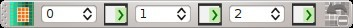

.. _toolbar_edit_raster:

******************************
SCP Edit Toolbar
******************************

.. |br| raw:: html

  
	
.. |input_number| image:: _static/input_number.jpg
	:width: 20pt

.. |enter| image:: _static/semiautomaticclassificationplugin_enter.png
	:width: 20pt

.. |edit_raster| image:: _static/semiautomaticclassificationplugin_edit_raster.png
	:width: 20pt

.. |undo_edit_raster| image:: _static/semiautomaticclassificationplugin_undo_edit_raster.png
	:width: 20pt
	

	
	:guilabel:`SCP Tools`
		
The :guilabel:`SCP Edit Toolbar` allows for the direct editing of pixel values in the input raster defined in :ref:`edit_raster_tab` using ROI polygons.
Only pixels beneath ROI polygons are edited.

* |edit_raster|: open the tool :guilabel:`SCP Edit Toolbar` for selecting the input raster;
* |input_number| |enter|: edit the raster using the selected constant value;
* |input_number| |enter|: edit the raster using the selected constant value;
* |input_number| |enter|: edit the raster using the selected constant value;
* |undo_edit_raster|: undo the last raster edit (available only when using ROI polygons);