.. _basic_tutorial_1:

***************************************************************
Tutorial 1
***************************************************************

.. |br| raw:: html

  

.. |add| image:: _static/semiautomaticclassificationplugin_add.png
	:width: 20pt
	
.. |checkbox| image:: _static/checkbox.png
	:width: 18pt
	
.. |pointer| image:: _static/semiautomaticclassificationplugin_pointer_tool.png
	:width: 20pt
	
.. |radiobutton| image:: _static/radiobutton.png
	:width: 18pt
	
.. |reload| image:: _static/semiautomaticclassificationplugin_reload.png
	:width: 20pt
	
.. |reset| image:: _static/semiautomaticclassificationplugin_reset.png
	:width: 20pt
	
.. |remove| image:: _static/semiautomaticclassificationplugin_remove.png
	:width: 20pt
	
.. |run| image:: _static/semiautomaticclassificationplugin_run.png
	:width: 24pt
	
.. |input_list| image:: _static/input_list.jpg
	:width: 20pt
	
.. |open_file| image:: _static/semiautomaticclassificationplugin_open_file.png
	:width: 20pt
	
.. |new_file| image:: _static/semiautomaticclassificationplugin_new_file.png
	:width: 20pt
	
.. |open_dir| image:: _static/semiautomaticclassificationplugin_open_dir.png
	:width: 20pt
	
.. |select_all| image:: _static/semiautomaticclassificationplugin_select_all.png
	:width: 20pt
	
.. |move_up| image:: _static/semiautomaticclassificationplugin_move_up.png
	:width: 20pt
	
.. |move_down| image:: _static/semiautomaticclassificationplugin_move_down.png
	:width: 20pt
	
.. |search_images| image:: _static/semiautomaticclassificationplugin_search_images.png
	:width: 20pt

.. |image_preview| image:: _static/semiautomaticclassificationplugin_download_image_preview.png
	:width: 20pt

.. |import| image:: _static/semiautomaticclassificationplugin_import.png
	:width: 20pt
	
.. |export| image:: _static/semiautomaticclassificationplugin_export.png
	:width: 20pt

.. |plus| image:: _static/semiautomaticclassificationplugin_plus.png
	:width: 20pt

.. |order_by_name| image:: _static/semiautomaticclassificationplugin_order_by_name.png
	:width: 20pt

.. |image_overview| image:: _static/semiautomaticclassificationplugin_download_image_overview.png
	:width: 20pt
	
.. |enter| image:: _static/semiautomaticclassificationplugin_enter.png
	:width: 20pt

.. |download| image:: _static/semiautomaticclassificationplugin_download_arrow.png
	:width: 20pt
	
.. |landsat_download| image:: _static/semiautomaticclassificationplugin_landsat8_download_tool.png
	:width: 20pt

.. |sentinel_download| image:: _static/semiautomaticclassificationplugin_sentinel_download_tool.png
	:width: 20pt
	
.. |tools| image:: _static/semiautomaticclassificationplugin_roi_tool.png
	:width: 20pt
	
.. |roi_multiple| image:: _static/semiautomaticclassificationplugin_roi_multiple.png
	:width: 20pt

.. |import_spectral_library| image:: _static/semiautomaticclassificationplugin_import_spectral_library.png
	:width: 20pt
	
.. |export_spectral_library| image:: _static/semiautomaticclassificationplugin_export_spectral_library.png
	:width: 20pt
	
.. |weight_tool| image:: _static/semiautomaticclassificationplugin_weight_tool.png
	:width: 20pt
	
.. |threshold_tool| image:: _static/semiautomaticclassificationplugin_threshold_tool.png
	:width: 20pt
	
.. |LCS_threshold| image:: _static/semiautomaticclassificationplugin_LCS_threshold_tool.png
	:width: 20pt
	
.. |LCS_threshold_set_tool| image:: _static/semiautomaticclassificationplugin_LCS_threshold_set_tool.png
	:width: 20pt
	
.. |preprocessing| image:: _static/semiautomaticclassificationplugin_class_tool.png
	:width: 20pt
	
.. |landsat_tool| image:: _static/semiautomaticclassificationplugin_landsat8_tool.png
	:width: 20pt
	
.. |sentinel2_tool| image:: _static/semiautomaticclassificationplugin_sentinel_tool.png
	:width: 20pt
	
.. |aster_tool| image:: _static/semiautomaticclassificationplugin_aster_tool.png
	:width: 20pt
	
.. |split_raster| image:: _static/semiautomaticclassificationplugin_split_raster.png
	:width: 20pt
	
.. |clip_tool| image:: _static/semiautomaticclassificationplugin_clip_tool.png
	:width: 20pt
	
.. |pca_tool| image:: _static/semiautomaticclassificationplugin_pca_tool.png
	:width: 20pt
	
.. |vector_to_raster_tool| image:: _static/semiautomaticclassificationplugin_vector_to_raster_tool.png
	:width: 20pt
	
.. |post_process| image:: _static/semiautomaticclassificationplugin_post_process.png
	:width: 20pt
	
.. |accuracy_tool| image:: _static/semiautomaticclassificationplugin_accuracy_tool.png
	:width: 20pt
	
.. |land_cover_change| image:: _static/semiautomaticclassificationplugin_land_cover_change.png
	:width: 20pt
	
.. |report_tool| image:: _static/semiautomaticclassificationplugin_report_tool.png
	:width: 20pt

.. |class_to_vector_tool| image:: _static/semiautomaticclassificationplugin_class_to_vector_tool.png
	:width: 20pt

.. |reclassification_tool| image:: _static/semiautomaticclassificationplugin_reclassification_tool.png
	:width: 20pt

.. |edit_raster| image:: _static/semiautomaticclassificationplugin_edit_raster.png
	:width: 20pt

.. |undo_edit_raster| image:: _static/semiautomaticclassificationplugin_undo_edit_raster.png
	:width: 20pt

.. |classification_sieve| image:: _static/semiautomaticclassificationplugin_classification_sieve.png
	:width: 20pt

.. |classification_erosion| image:: _static/semiautomaticclassificationplugin_classification_erosion.png
	:width: 20pt

.. |classification_dilation| image:: _static/semiautomaticclassificationplugin_classification_dilation.png
	:width: 20pt

.. |bandcalc_tool| image:: _static/semiautomaticclassificationplugin_bandcalc_tool.png
	:width: 20pt
	
.. |batch_tool| image:: _static/semiautomaticclassificationplugin_batch.png
	:width: 20pt

.. |bandset_tool| image:: _static/semiautomaticclassificationplugin_bandset_tool.png
	:width: 20pt
	
.. |settings_tool| image:: _static/semiautomaticclassificationplugin_settings_tool.png
	:width: 20pt
	
.. |manual_ROI| image:: _static/semiautomaticclassificationplugin_manual_ROI.png
	:width: 20pt

.. |save_roi| image:: _static/semiautomaticclassificationplugin_save_roi.png
	:width: 20pt
	
.. |roi_single| image:: _static/semiautomaticclassificationplugin_roi_single.png
	:width: 20pt
	
.. |roi_redo| image:: _static/semiautomaticclassificationplugin_roi_redo.png
	:width: 20pt

.. |preview| image:: _static/semiautomaticclassificationplugin_preview.png
	:width: 20pt
	
.. |preview_redo| image:: _static/semiautomaticclassificationplugin_preview_redo.png
	:width: 20pt
	
.. |delete_signature| image:: _static/semiautomaticclassificationplugin_delete_signature.png
	:width: 20pt

.. |sign_plot| image:: _static/semiautomaticclassificationplugin_sign_tool.png
	:width: 20pt

.. |cumulative_stretch| image:: _static/semiautomaticclassificationplugin_bandset_cumulative_stretch_tool.png
	:width: 20pt

.. |std_dev_stretch| image:: _static/semiautomaticclassificationplugin_bandset_std_dev_stretch_tool.png
	:width: 20pt

.. |calculate_spectral_distances| image:: _static/semiautomaticclassificationplugin_calculate_spectral_distances.png
	:width: 20pt
	
.. |remove_temp| image:: _static/semiautomaticclassificationplugin_remove_temp.png
	:width: 20pt

The following is a basic tutorial about the land cover classification using the Semi-Automatic Classification Plugin (:guilabel:`SCP`).
It is assumed that you have a basic knowledge of QGIS.

.. contents::
    :depth: 2
    :local:
	

.. _tutorial_1:
 
Tutorial 1: Your First Land Cover Classification
===================================================

This is a basic tutorial about the use of :guilabel:`SCP` for the classification of a multispectral image.
It is recommended to read the :ref:`remote_sensing` before this tutorial.

The purpose of the classification is to identify the following land cover classes:

#. Water;
#. Built-up;
#. Vegetation;
#. Bare soil.

The study area of this tutorial is Greenbelt (Maryland, USA) which is the site of NASA’s Goddard Space Flight Center (the institution that will lead the development of the future Landsat 9 flight segment).

Following the video of this tutorial.

.. raw:: html

	<iframe allowfullscreen="" frameborder="0" height="360" src="http://www.youtube.com/embed/fUZgYxgDjsk?rel=0" width="100%"></iframe>

http://www.youtube.com/watch?v=fUZgYxgDjsk

.. _tutorial_1_data_download:

Download the Data
-------------------------

We are going to download a :ref:`Landsat_definition` image (data available from the U.S. Geological Survey) and use the following bands:

#. Blue;
#. Green;
#. Red;
#. Near-Infrared;
#. Short Wavelength Infrared 1;
#. Short Wavelength Infrared 2.

	**TIP** : In case you have a slow connection you can download an image subset from `this archive <https://docs.google.com/uc?id=18CXceeQrjxQoM5Z80kvlvdTI4SmVBDZn>`_ (about 5 MB, data available from the U.S. Geological Survey), unzip the downloaded file, and skip to :ref:`tutorial_1_conversion`.

Start QGIS and the :guilabel:`SCP`.
Open the tab :ref:`download_tab` clicking the button |download| in the :ref:`SCP_home`, or in the :ref:`SCP_menu`,

We are searching a specific image acquired on 16 April 2017 because it is cloud free.
In :ref:`search_parameters` enter the point coordinates:

* :guilabel:`UL`: -77 / 39
* :guilabel:`LR`: -76.9 / 38.9

	**TIP** : In general it is possible to define the area coordinates clicking the button |pointer| , then left click in the map for the UL point and right click in the map for the LR point.
	
Select :guilabel:`L8 OLI/TIRS` from the :guilabel:`Products` |input_list| and set:

* :guilabel:`Date from`: 2017-04-16
* :guilabel:`to`: 2017-04-16

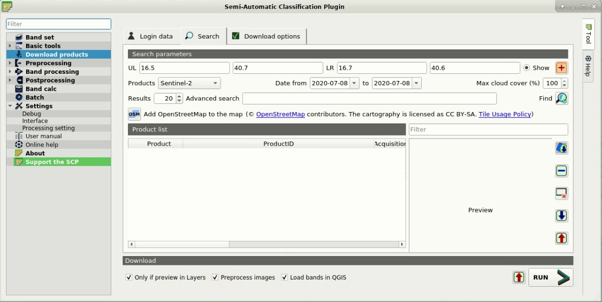
	
	:guilabel:`Search products`
	
Now click the button :guilabel:`Find` |search_images| and after a few seconds the image will be listed in the :ref:`product_list`.
Click the item in the table to display a preview that is useful for assessing the quality of the image and the cloud cover.

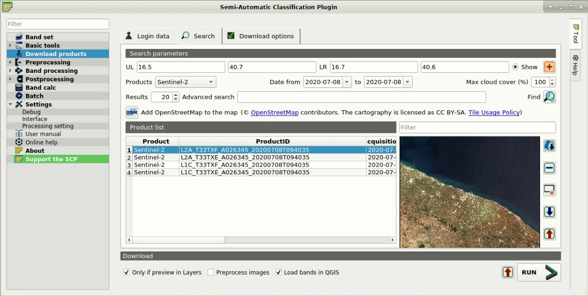
	
	:guilabel:`Search result`
	
Now click the button |image_preview| to load the preview in the map.

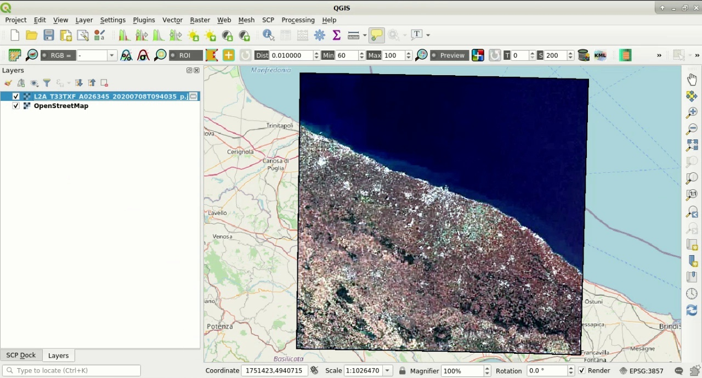
	
	:guilabel:`Image preview`
	

We can also select the bands to be downloaded according to our purpose.
In particular, select the tab :ref:`download_options` and check only the Landsat bands (that will be used in this tutorial): 2, 3, 4, 5, 6, 7, and the ancillary data.

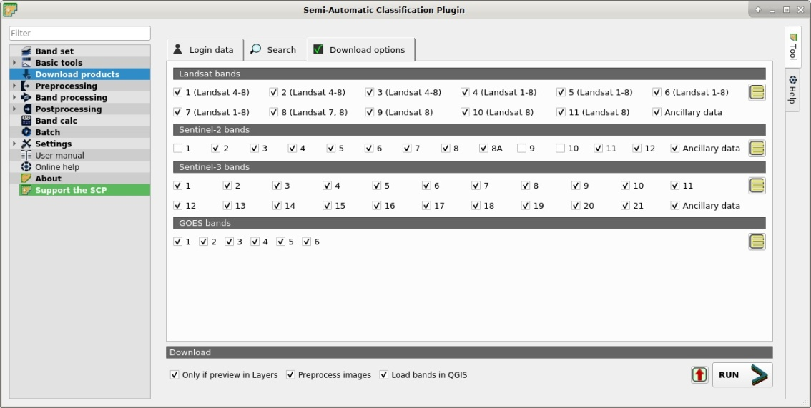
	
	:guilabel:`Download options`
	
For the purpose of this tutorial, uncheck the option |checkbox| :guilabel:`Preprocess images` (you should usually leave this checked) because we are going to preprocess the image in :ref:`tutorial_1_conversion`. 
To start the image download, click the button :guilabel:`RUN` |run| and select a directory where bands are saved.
The download could last a few minutes according to your internet connection speed.
The download progress is displayed in a bar.

	**TIP** : The option |checkbox| :guilabel:`Only if preview in Layers` allows for downloading only images in the result table which are loaded as previews in the map. If this option is unchecked, all the products in the list are downloaded.

After the download, all the bands are automatically loaded in the map.

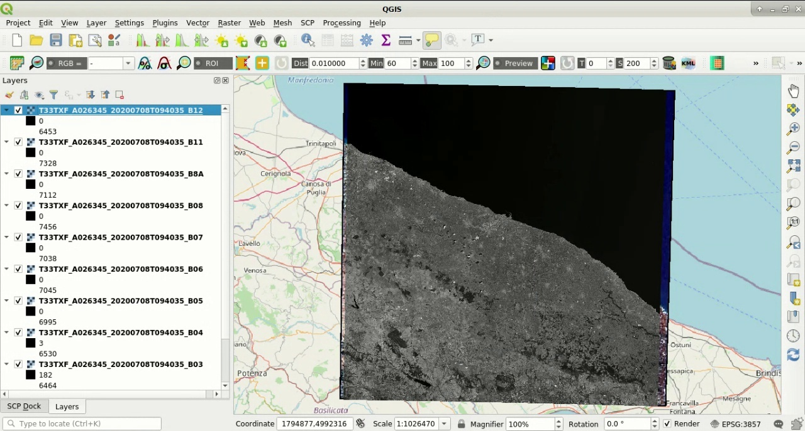
	
	:guilabel:`Download of Landsat bands`

.. _tutorial_1_clip_data:

Clip the Data
---------------------------------

For for limiting the study area (and reducing the processing time) we can clip the image.

First, we need to define a :guilabel:`Band set` containing the bands to be clipped.
Open the tab :ref:`band_set_tab` clicking the button |bandset_tool| in the :ref:`SCP_menu` or the :ref:`SCP_dock`.

Click the button |reload| to refresh the layer list, and select the bands: 2, 3, 4, 5, 6, and 7; then click |plus| to add selected rasters to the :guilabel:`Band set 1`.

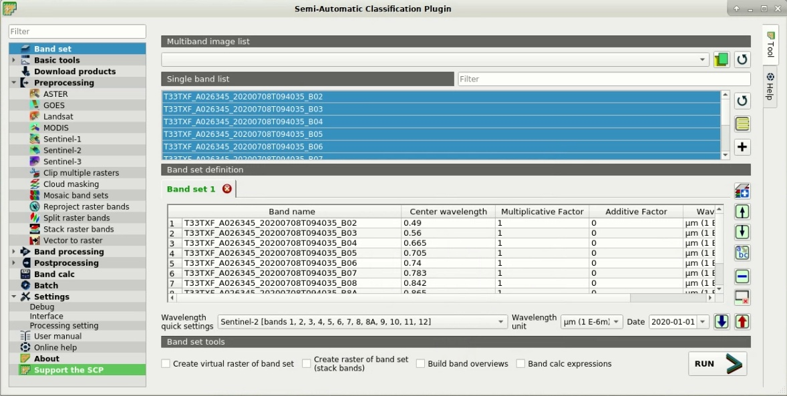
	
	:guilabel:`Band set for clipping`
	
In :ref:`pre_processing_tab` open the tab :ref:`clip_multiple_rasters_tab`.
We are going to clip the :guilabel:`Band set 1` which contains Landsat bands.

Click the button |pointer| and select an area such as the following image (left click in the map for the UL point and right click in the map for the LR point), or enter the following values:

* :guilabel:`UL`: 330015 / 4324995
* :guilabel:`LR`: 349995 / 4309995

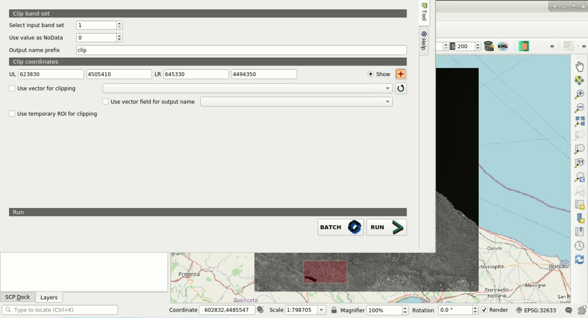
	
	:guilabel:`Clip area`
	
Click the button :guilabel:`RUN` |run| and select a directory where clipped bands are saved.
New files will be created with the file name prefix defined in :guilabel:`Output name prefix`.
When the process is completed, clipped rasters are loaded and displayed.

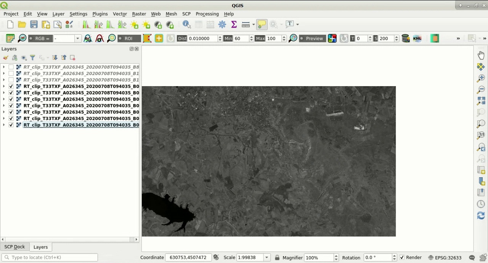
	
	:guilabel:`Clipped bands`

.. _tutorial_1_conversion:

Convert Data to Surface Reflectance
------------------------------------------------------

Conversion to reflectance (see :ref:`radiance_reflectance_definition`) can be performed automatically.
The metadata file (a .txt file whose name contains ``MTL``) downloaded with the images contains the required information for the conversion.
Read :ref:`conversion_to_reflectance` for information about the :ref:`TOA_conversion` and :ref:`Surface_conversion`.

In order to convert bands to reflectance, open the :ref:`pre_processing_tab` clicking the button |preprocessing| in the :ref:`SCP_menu` or the :ref:`SCP_dock`, and select the tab :ref:`landsat_tab`.

Click the button :guilabel:`Directory containing Landsat bands` |open_dir| and select the directory of clipped Landsat bands.
The list of bands is automatically loaded in the table :ref:`landsat_metadata`.

Click the button :guilabel:`Select MTL file` |open_file| and select the metadata file ``LC08_L1TP_015033_20170416_20170501_01_T1_MTL.txt`` from the directory of downloaded Landsat images.
Metadata information is added to the table :ref:`landsat_metadata`. 

In order to calculate :ref:`Surface_conversion` we are going to apply the :ref:`DOS1_correction`; therefore, enable the option |checkbox| :guilabel:`Apply DOS1 atmospheric correction`.

	**TIP** : In general, it is recommended to perform the DOS1 atmospheric correction for the entire image (before clipping the image) in order to improve the calculation of parameters based on the image.

For the purpose of this tutorial, uncheck the option |checkbox| :guilabel:`Create Band set and use Band set tools` because we are going to define this in the following step :ref:`tutorial_1_band_set`.

In order to start the conversion process, click the button :guilabel:`RUN` |run| and select the directory where converted bands are saved.
	
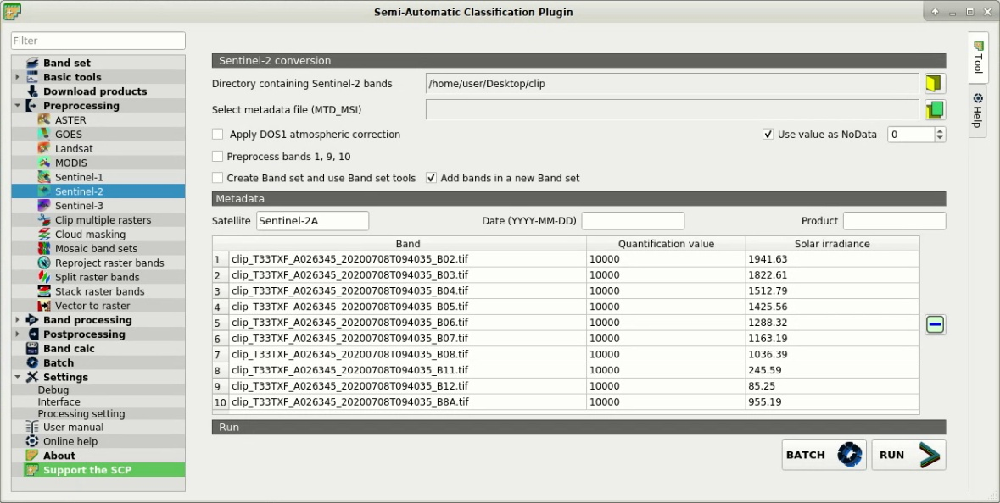
	
	:guilabel:`Landsat 8 conversion to reflectance`
	
After a few minutes, converted bands are loaded and displayed (file name beginning with ``RT_``).
If |checkbox| :guilabel:`Play sound when finished` is checked in :ref:`classification_process` settings, a sound is played when the process is finished.

We can remove all the bands loaded in QGIS layers except the ones whose name begin with ``RT_``.

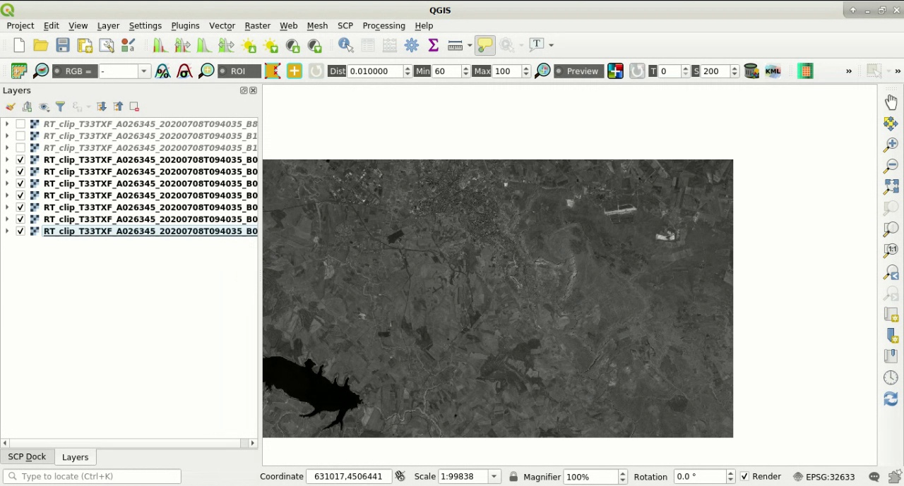
	
	:guilabel:`Converted Landsat 8 bands`
	
	
.. _tutorial_1_band_set:

Define the Band set and create the Training Input File
----------------------------------------------------------

Now we need to define the :guilabel:`Band set` which is the input image for :guilabel:`SCP`.
Open the tab :ref:`band_set_tab` clicking the button |bandset_tool| in the :ref:`SCP_menu` or the :ref:`SCP_dock`.

In :guilabel:`Band set definition` click the button |reset| to clear all the bands from :guilabel:`active band set` created during the previous steps.

Click the button |reload| to refresh the layer list, and select all the converted bands; then click |plus| to add selected rasters to the :guilabel:`Band set`.

In the table :guilabel:`Band set definition` order the band names in ascending order (click |order_by_name| to sort bands by name automatically).
Finally, select :guilabel:`Landsat 8 OLI` from the list :guilabel:`Quick wavelength settings`, in order to set automatically the :guilabel:`Center wavelength` of each band and the :guilabel:`Wavelength unit` (required for spectral signature calculation).

.. figure:: _static/tutorial_1/tutorial_1_band_set_1.jpg
	:align: center
	:width: 600pt
	
	:guilabel:`Definition of a band set`
	
We can display a :ref:`color_composite_definition` of bands: Near-Infrared, Red, and Green: in the :ref:`working_toolbar`, click the list :guilabel:`RGB=` and select the item ``4-3-2`` (corresponding to the band numbers in :ref:`band_set_tab`).
You can see that image colors in the map change according to the selected bands, and vegetation is highlighted in red (if the item ``3-2-1`` was selected, natural colors would be displayed).

	**TIP** : If a :ref:`band_set_tab` is defined, a temporary virtual raster (named ``Virtual Band Set 1``) is created automatically, which allows for the display of :ref:`color_composite_definition`. In order to speed up the visualization, you can show only the virtual raster and hide all the layers in the QGIS Layers.

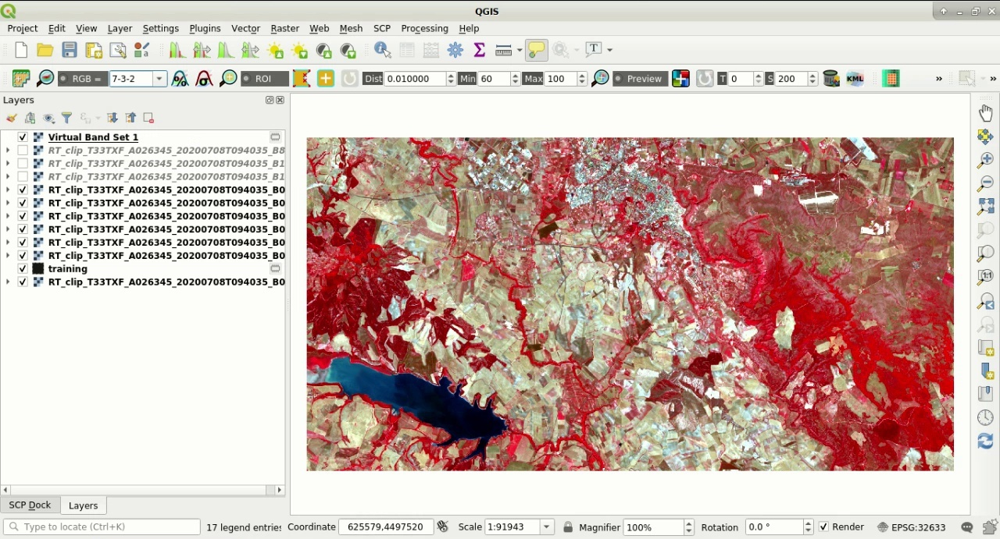
	
	:guilabel:`Color composite RGB=4-3-2`
	
	
Now we need to create the :ref:`training_input` in order to collect :ref:`ROI_definition` (ROIs) and calculate the :ref:`spectral_signature_definition` thereof (which are used in classification).

In the :ref:`SCP_dock` select the tab :ref:`training_input` and click the button |new_file| to create the :guilabel:`Training input` (define a name such as ``training.scp``).
The path of the file is displayed and a vector is added to QGIS layers with the same name as the :guilabel:`Training input` (in order to prevent data loss, you should not edit this layer using QGIS functions).

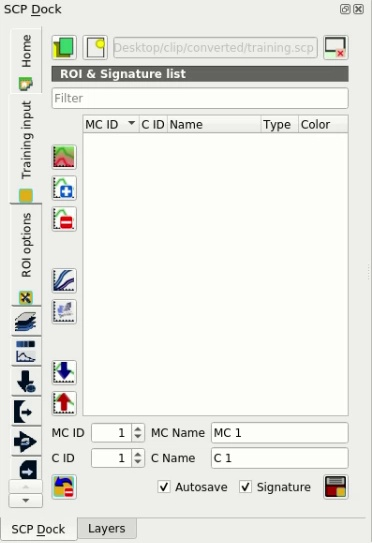
	
	:guilabel:`Definition of Training input in SCP`

.. _tutorial_1_3:

Create the ROIs
------------------------------------------------------

We are going to create ROIs defining the :ref:`classes_definition`. 
Each ROI is identified by a Class ID (i.e. C ID), and each ROI is assigned to a land cover class through a Macroclass ID (i.e. MC ID).

Macroclasses are composed of several materials having different spectral signatures; in order to achieve good classification results we should separate spectral signatures of different materials, even if belonging to the same macroclass.
Thus, we are going to create several ROIs for each macroclass (setting the same :guilabel:`MC ID`, but assigning a different :guilabel:`C ID` to every ROI).

We are going to used the Macroclass IDs defined in the following table.
	
	:guilabel:`Macroclasses`
	
+-----------------------------+--------------------------+
| Macroclass name             | Macroclass ID            |
+=============================+==========================+
| Water                       |  1                       |
+-----------------------------+--------------------------+
| Built-up                    |  2                       |
+-----------------------------+--------------------------+
| Vegetation                  |  3                       |
+-----------------------------+--------------------------+
| Bare soil (low vegetation)  |  4                       |
+-----------------------------+--------------------------+

ROIs can be created by manually drawing a polygon or with an automatic region growing algorithm.

Zoom in the map over the dark area in the upper right corner of the image which is a water body.
In order to create manually a ROI inside the dark area, click the button |manual_ROI| in the :ref:`working_toolbar`.
Left click on the map to define the ROI vertices and right click to define the last vertex closing the polygon.
An orange semi-transparent polygon is displayed over the image, which is a temporary polygon (i.e. it is not saved in the :guilabel:`Training input`).

	**TIP** : You can draw temporary polygons (the previous one will be overridden) until the shape covers the intended area.

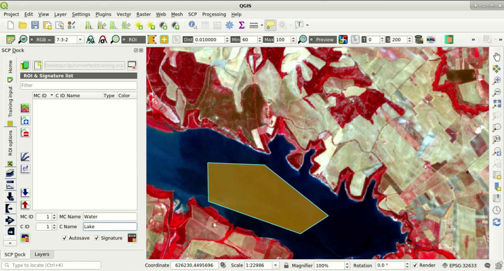
	
	:guilabel:`A temporary ROI created manually`
	
If the shape of the temporary polygon is good we can save it to the :guilabel:`Training input`.

Open the :ref:`training_input` to define the :ref:`classes_definition` .
In the :ref:`ROI_list` set :guilabel:`MC ID` = 1 and :guilabel:`MC Info` = ``Water``; also set :guilabel:`C ID` = 1 and :guilabel:`C Info` = ``Lake``.
Now click |save_roi| to save the ROI in the :guilabel:`Training input`.

After a few seconds, the ROI is listed in the :ref:`ROI_list` and the spectral signature is calculated (because |checkbox| :guilabel:`Signature` was checked).

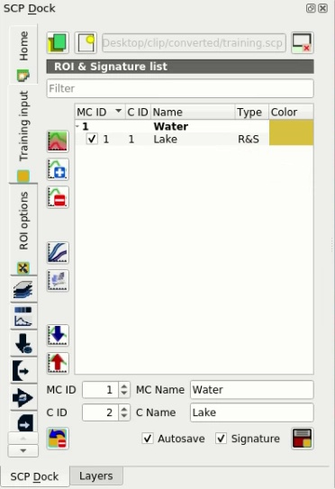
	
	:guilabel:`The ROI saved in the Training input`
	
As you can see, the :guilabel:`C ID` in :ref:`ROI_list` is automatically increased by 1.
Saved ROI is displayed as a dark polygon in the map and the temporary ROI is removed.
Also, in the :ref:`ROI_list` you can notice that the :guilabel:`Type` is :guilabel:`B`, meaning that the ROI spectral signature was calculated and saved in the :guilabel:`Training input`.

You can also see in the tab :ref:`macroclasses_tab` that the first macroclass has been added to the table :guilabel:`Macroclasses` .

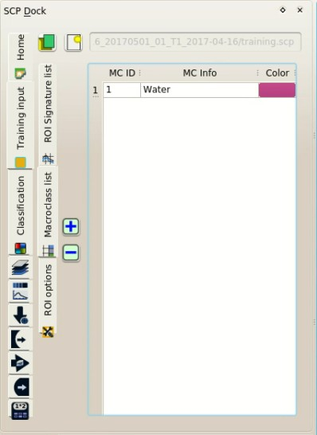
	
	:guilabel:`Macroclasses`
	

Now we are going to create a second ROI for the built-up class using the automatic region growing algorithm.
Zoom in the lower region of the image.
In :ref:`working_toolbar` set the :guilabel:`Dist` value to 0.08 .
Click the button |roi_single| in the :ref:`working_toolbar` and click over the purple area of the map.
After a while the orange semi-transparent polygon is displayed over the image.

	**TIP** : :guilabel:`Dist` value should be set according to the range of pixel values; in general, increasing this value creates larger ROIs.

.. figure:: _static/tutorial_1/tutorial_1_rois_5.jpg
	:align: center
	:width: 600pt
	
	:guilabel:`A temporary ROI created with the automatic region growing algorithm`
	
In the :ref:`ROI_list` set :guilabel:`MC ID` = 2 and :guilabel:`MC Info` = ``Built-up`` ; also set :guilabel:`C ID` = 2 (it should be already set) and :guilabel:`C Info` = ``Buildings``.

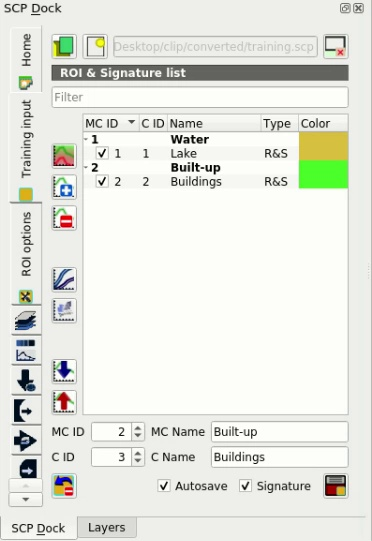
	
	:guilabel:`The ROI saved in the Training input`
		
Again, the :guilabel:`C ID` in :ref:`ROI_list` is automatically increased by 1.

After clicking the button |roi_single| in the :ref:`working_toolbar` you should notice that the cursor in the map displays a value changing over the image.
This is the NDVI value of the pixel beneath the cursor (NDVI is displayed because the function |checkbox| :guilabel:`Display` is checked in :ref:`training_input`).
The NDVI value can be useful for identifying spectrally pure pixels, in fact vegetation has higher NDVI values than soil.

For instance, move the mouse over a vegetation area and left click to create a ROI when you see a local maximum value.
This way, the created ROI and the spectral signature thereof will be particularly representative of healthy vegetation.

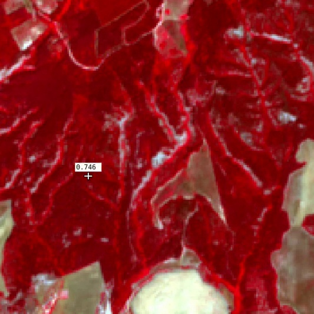
	
	:guilabel:`NDVI value of vegetation pixel displayed in the map. Color composite RGB = 4-3-2`
	

Create a ROI for the class ``Vegetation`` (red pixels in color composite ``RGB=4-3-2``) and a ROI for the class ``Bare soil (low vegetation)`` (green pixels in color composite ``RGB=4-3-2``) following the same steps described previously.
The following images show a few examples of these classes identified in the map.

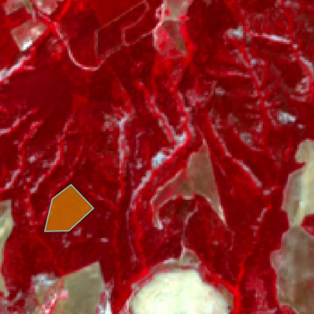
	
	:guilabel:`Vegetation. Color composite RGB = 4-3-2`
	
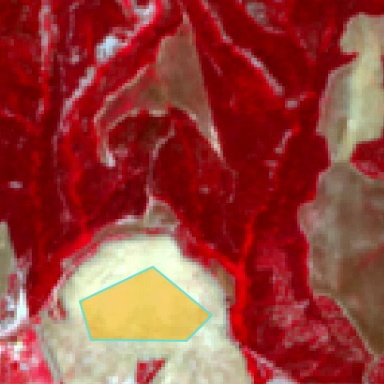
	
	:guilabel:`Bare soil (low vegetation). Color composite RGB = 4-3-2`

.. _tutorial_1_signatures:

Assess the Spectral Signatures
------------------------------------------------------
	
Spectral signatures are used by :ref:`classification_algorithm_definition` for labelling image pixels.
Different materials may have similar spectral signatures (especially considering multispectral images) such as built-up and soil.
If spectral signatures used for classification are too similar, pixels could be misclassified because the algorithm is unable to discriminate correctly those signatures.
Thus, it is useful to assess the :ref:`spectral_distance_definition` of signatures to find similar spectral signatures that must be removed.
Of course the concept of distance vary according to the algorithm used for classification.

One can simply assess spectral signature similarity by displaying a signature plot.
In order to display the signature plot, in the :ref:`ROI_list` highlight two or more spectral signatures (with click in the table), then click the button |sign_plot|.
The :ref:`spectral_signature_plot` is displayed in a new window.
Move and zoom inside the :ref:`signature_plot` to see if signatures are similar (i.e. very close).
Double click the color in the :ref:`signature_list_plot` to change the line color in the plot.

We can see in the following figure a signature plot of different materials. 

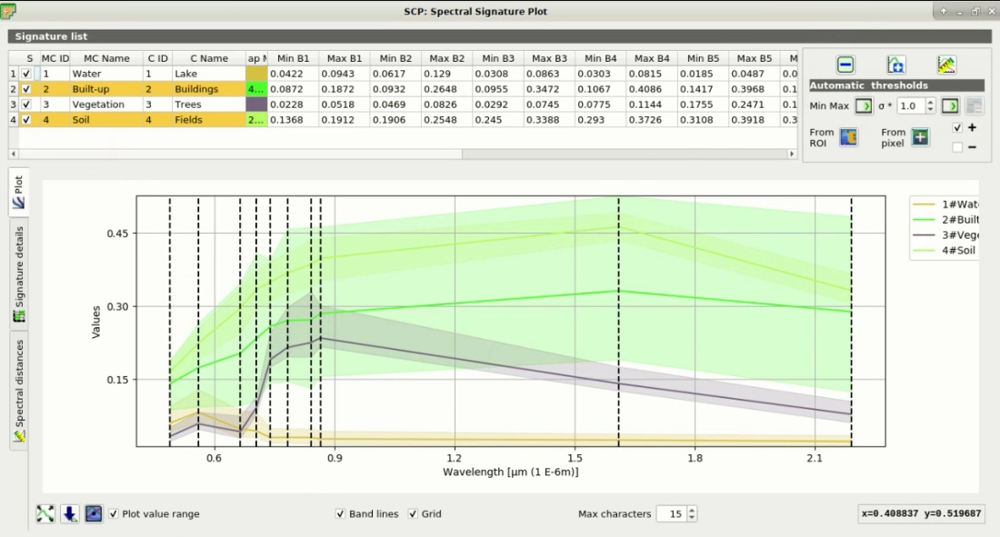
	
	:guilabel:`Spectral plot`
	
In the plot we can see the line of each signature (with the color defined in the :ref:`ROI_list`), and the spectral range (minimum and maximum) of each band (i.e. the semi-transparent area colored like the signature line).
The larger is the semi-transparent area of a signature, the higher is the standard deviation, and therefore the heterogeneity of pixels that composed that signature.
Spectral similarity between spectral signatures is highlighted in orange in the :ref:`signature_list_plot`.

Additionally, we can calculate the spectral distances of signatures (for more information see :ref:`spectral_distance_definition`).
Highlight two or more spectral signatures with click in the table :ref:`signature_list_plot`, then click the button |calculate_spectral_distances|; distances will be calculated for each pair of signatures.
Now open the tab :ref:`spectral_distances`; we can notice that similarity between signatures vary according to considered algorithm.

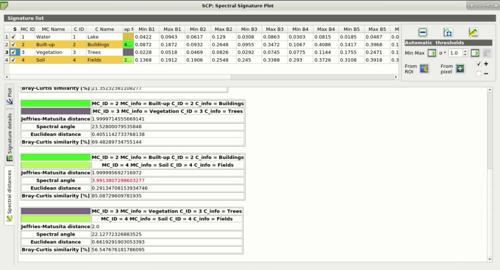
	
	:guilabel:`Spectral distances`
	
For instance, two signatures can be very similar for :ref:`spectra_angle_mapping_algorithm` (very low :ref:`spectral_angle`), but quite distant for the :ref:`max_likelihood_algorithm` (:ref:`Jeffries_Matusita_distance` value near 2).
The similarity of signatures is affected by the similarity of materials (in relation to the number of spectral bands available); also, the way we create ROIs influences the signatures.

Spectral signature values, standard deviation and other details such as the number of ROI pixels are displayed in the :ref:`signature_details`.

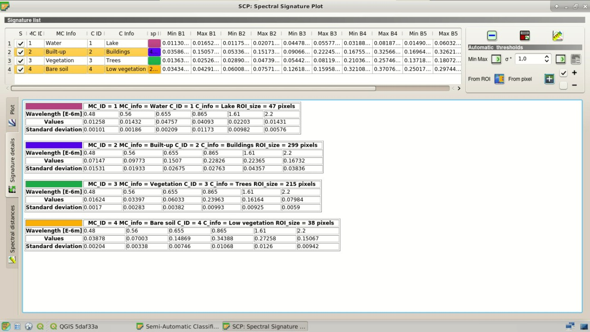
	
	:guilabel:`Spectral signature values`

**We need to create several ROIs (i.e. spectral signatures) for each macroclass** (repeating the steps in :ref:`tutorial_1_3`), assigning a unique C ID to each spectral signature, and assess the spectral distance thereof in order to avoid the overlap of spectral signatures belonging to different macroclasses.

In the list :guilabel:`RGB=` of the :ref:`working_toolbar` type ``3-4-6`` (you can also use the tool :ref:`RGB_list_tab`).
Using this color composite, urban areas are purple and vegetation is green.
You can notice that this color composite ``RGB = 3-4-6`` highlights roads more than natural color (``RGB = 3-2-1``).

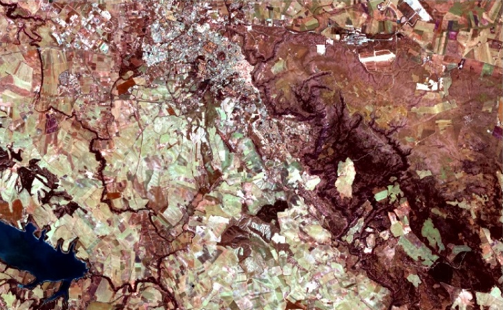
	
	:guilabel:`Color composite RGB = 3-4-6`
	
The following examples display a few RGB color composites of Landsat images.

	**TIP** : Change frequently the :ref:`color_composite_definition` in order to clearly identify the materials at the ground; use the mouse wheel on the list :guilabel:`RGB=` of the :ref:`working_toolbar` for changing the color composite rapidly; also use the buttons |cumulative_stretch| and |std_dev_stretch| for better displaying the :guilabel:`Input image` (i.e. image stretching).

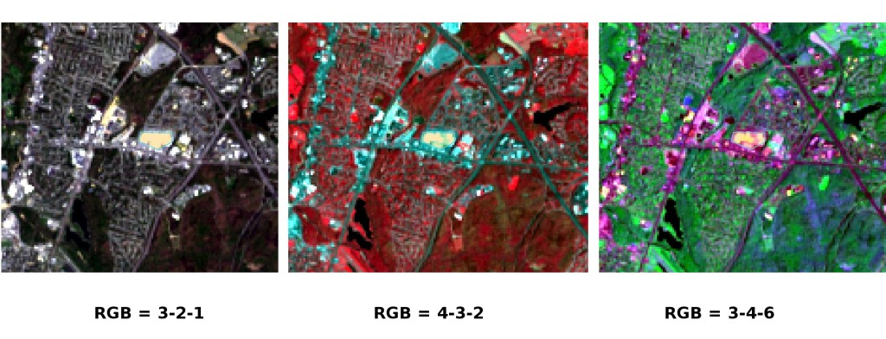
	
	:guilabel:`Built-up ROI: large buildings`
	
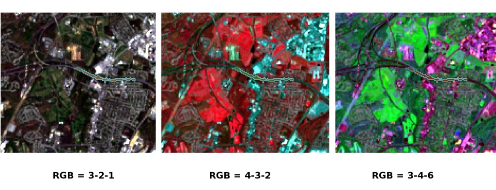
	
	:guilabel:`Built-up ROI: road`
	
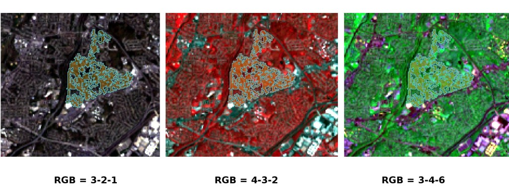
	
	:guilabel:`Built-up ROI: buildings, narrow roads`
	
	
.. figure:: _static/tutorial_1/tutorial_1_3_13.jpg
	:align: center
	:width: 600pt
	
	:guilabel:`Vegetation ROI: deciduous trees`
	
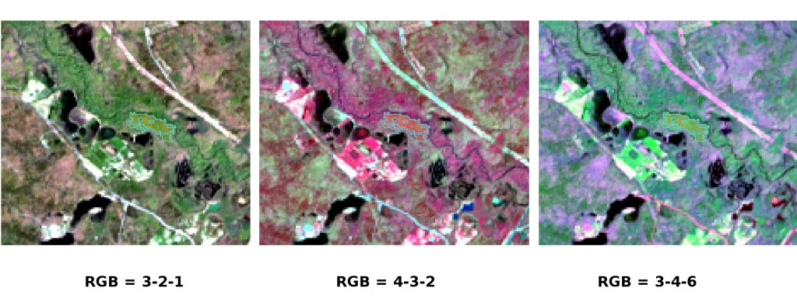
	
	:guilabel:`Vegetation ROI: riparian vegetation`
		
It is worth mentioning that you can show or hide the temporary ROI clicking the button |radiobutton| :guilabel:`ROI` in :ref:`working_toolbar`.

	**TIP** : Install the plugin `QuickMapServices <http://plugins.qgis.org/plugins/quick_map_services/>`_ in QGIS, and add a map (e.g. `OpenStreetMap <http://www.openstreetmap.org>`_) in order to facilitate the identification of ROIs using high resolution data.

.. _tutorial_1_4:

Create a Classification Preview
------------------------------------------------------

The classification process is based on collected ROIs (and spectral signatures thereof).
It is useful to create a :ref:`classification_preview` in order to assess the results (influenced by spectral signatures) before the final classification.
In case the results are not good, we can collect more ROIs to better classify land cover.

Before running a classification (or a preview), set the color of land cover classes that will be displayed in the classification raster.
In the :ref:`ROI_list`, double click the color (in the column :guilabel:`Color`) of each ROI to choose a representative color of each class.
	
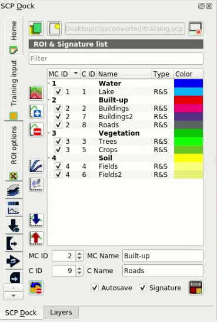
	
	:guilabel:`Definition of class colors`
	
Also, we need to set the color for macroclasses in table :ref:`macroclasses_tab`.
	
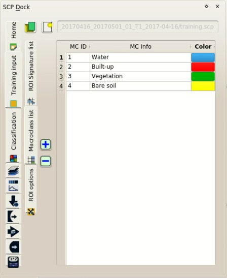
	
	:guilabel:`Definition of macroclass colors`
	
Now we need to select the classification algorithm.
In this tutorial we are going to use the :ref:`max_likelihood_algorithm`.

Open the :ref:`classification_dock` to set the use of classes or macroclasses.
Check :guilabel:`Use` |checkbox| :guilabel:`C ID` and in :ref:`classification_alg` select the :guilabel:`Maximum Likelihood`.

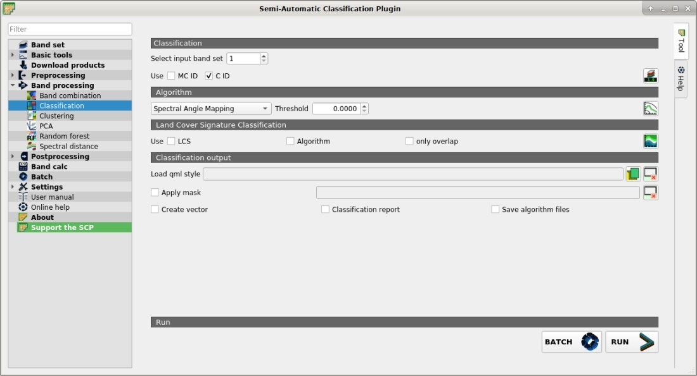
	
	:guilabel:`Setting the algorithm and using C ID`
	

In :ref:`classification_preview` set :guilabel:`Size` = 300; click the button |preview| and then left click a point of the image in the map.
The classification process should be rapid, and the result is a classified square centered in clicked point.

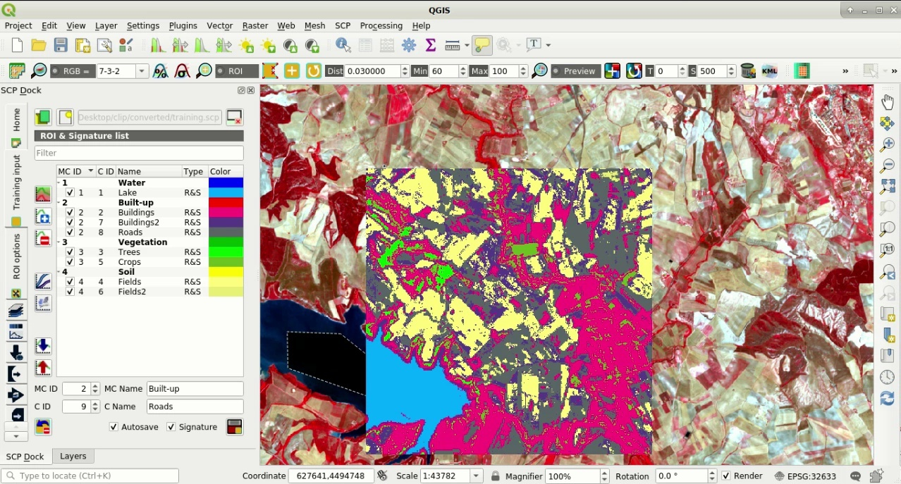
	
	:guilabel:`Classification preview displayed over the image using C ID`
	
Previews are temporary rasters (deleted after QGIS is closed) placed in a group named :guilabel:`Class_temp_group` in the QGIS panel Layers.
Now in :ref:`classification_dock` check :guilabel:`Use` |checkbox| :guilabel:`MC ID` and click the button |preview_redo| in :ref:`classification_preview`.

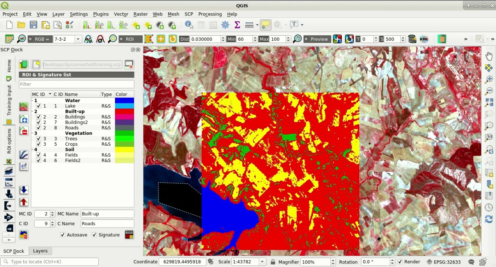
	
	:guilabel:`Classification preview displayed over the image using MC ID`
	

We can see that now there are only 4 colors representing the macroclasses.
	
	**TIP** : When loading a previously saved QGIS project, a message could ask to handle missing layers, which are temporary layers that SCP creates during each session and are deleted afterwards; you can click :guilabel:`Cancel` and ignore these layers; also, you can delete these temporary layers clicking the button |remove_temp| in :ref:`working_toolbar`.

In general, it is good to perform a classification preview every time a ROI (or a spectral signature) is added to the :ref:`ROI_list`. Therefore, the phases :ref:`tutorial_1_3` and :ref:`tutorial_1_4` should be iterative and concurrent processes.

.. _tutorial_1_class:

Create the Classification Output
------------------------------------------------------

Assuming that the results of classification previews were good (i.e. pixels are assigned to the correct class defined in the :ref:`ROI_list`), we can perform the actual land cover classification of the whole image.

In :ref:`classification_dock` check :guilabel:`Use` |checkbox| :guilabel:`MC ID`.
In the :ref:`classification_output` click the button |run| and define the path of the classification output, which is a raster file (.tif).
If |checkbox| :guilabel:`Play sound when finished` is checked in :ref:`classification_process` settings, a sound is played when the process is finished.

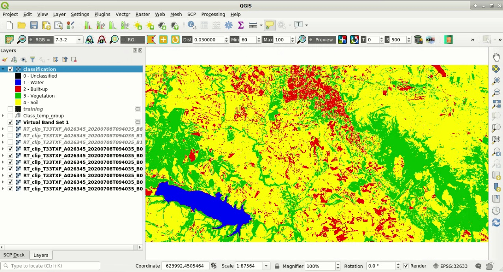
	
	:guilabel:`Result of the land cover classification`
	
**Well done!**
You have just performed your first land cover classification.

However, you can see that there are several classification errors, because the number of ROIs (spectral signatures) is insufficient.

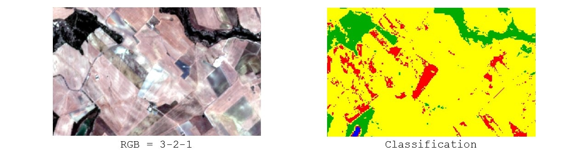
	
	:guilabel:`Example of error: Water bodies classified as Built-up`
	
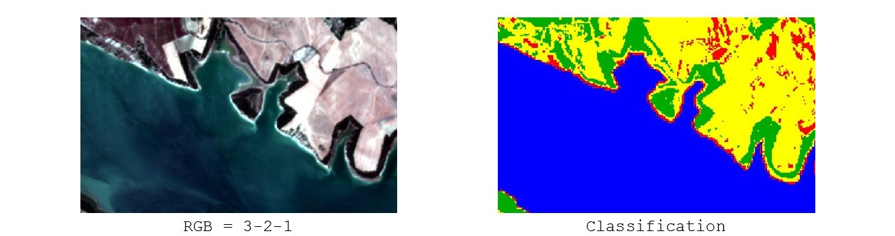
	
	:guilabel:`Example of error: Built-up classified as vegetation`
	
We can improve the classification using some of the tools that will be described in other tutorials.
