.. _basic_tutorial_1:

***************************************************************
Tutorial 1
***************************************************************

.. |checkbox| image:: _static/checkbox.png
    :width: 18pt

.. |pointer| image:: _static/semiautomaticclassificationplugin_pointer_tool.png
    :width: 20pt

.. |run| image:: _static/semiautomaticclassificationplugin_run.png
    :width: 24pt

.. |open_file| image:: _static/semiautomaticclassificationplugin_open_file.png
    :width: 20pt

.. |new_file| image:: _static/semiautomaticclassificationplugin_new_file.png
    :width: 20pt

.. |import_spectral_library| image:: _static/semiautomaticclassificationplugin_import_spectral_library.png
    :width: 20pt

.. |bandset_tool| image:: _static/semiautomaticclassificationplugin_bandset_tool.png
    :width: 20pt

.. |manual_ROI| image:: _static/semiautomaticclassificationplugin_manual_ROI.png
    :width: 20pt

.. |save_roi| image:: _static/semiautomaticclassificationplugin_save_roi.png
    :width: 20pt

.. |roi_single| image:: _static/semiautomaticclassificationplugin_roi_single.png
    :width: 20pt

.. |preview| image:: _static/semiautomaticclassificationplugin_preview.png
    :width: 20pt

.. |preview_redo| image:: _static/semiautomaticclassificationplugin_preview_redo.png
    :width: 20pt

.. |delete_signature| image:: _static/semiautomaticclassificationplugin_delete_signature.png
    :width: 20pt

.. |sign_plot| image:: _static/semiautomaticclassificationplugin_sign_tool.png
    :width: 20pt

The following is a basic tutorial about the land cover classification using
the Semi-Automatic Classification Plugin (:guilabel:`SCP`).
It is assumed that you have a basic knowledge of QGIS.
Following the video of the tutorial.

https://www.youtube.com/watch?v=7SZDCFXjIbA

.. raw:: html

    <iframe allowfullscreen="" frameborder="0" height="360" src="https://www.youtube.com/embed/7SZDCFXjIbA?rel=0" width="100%"></iframe>

.. contents::
    :depth: 2
    :local:

.. _tutorial_1:
 
Tutorial 1: Basic Land Cover Classification
===================================================

This is a basic tutorial about the use of :guilabel:`SCP` for the
classification of a multispectral image.
It is recommended to read the :ref:`remote_sensing` before following
this tutorial.

The purpose of the classification is to identify the following land cover
classes:

#. Water;
#. Built-up;
#. Vegetation;
#. Soil.

The basic steps are:

#. the definition of input data (image bands) in a :ref:`band_set_tab`;
#. the creation of a :ref:`training_input` to collect training areas to train
   the classification algorith;
#. the :ref:`classification_tab` of input data.

.. _tutorial_1_data_download:

Download the Data
-------------------------

Other tutorials will show how to search and download satellite images within
:guilabel:`SCP`.
In this tutorial we are going to use a :ref:`Sentinel2_definition` image,
already converted to reflectance and clipped to the study area, downloading a
``.zip`` file (which contains modified Copernicus Sentinel data 2023).

The study area of this tutorial covers part of the Lake Garda in the Northern
Italy.
Download the ``.zip`` file from this
`link <https://docs.google.com/uc?id=1cWerxZeBY4TJmctKwsvXkfa3No37Pr9a>`_
and extract the directory containing the image bands.

.. _tutorial_1_band_set:

Define the Band set and create the Training Input File
----------------------------------------------------------

We are going to use a subset of :ref:`Sentinel2_definition` image (`Copernicus
<http://copernicus.eu/>`_ land monitoring services) and use the
bands illustrated in the following table.

+-------------------------------------+-------------------------------------+------------------------+
| Sentinel-2 Bands                    | Central Wavelength  [micrometers]   |  Resolution [meters]   |
+=====================================+=====================================+========================+
| Band 2 - Blue                       | 0.490                               |  10                    |
+-------------------------------------+-------------------------------------+------------------------+
| Band 3 - Green                      |  0.560                              |  10                    |
+-------------------------------------+-------------------------------------+------------------------+
| Band 4 - Red                        | 0.665                               |  10                    |
+-------------------------------------+-------------------------------------+------------------------+
| Band 5 - Vegetation Red Edge        | 0.705                               |  20                    |
+-------------------------------------+-------------------------------------+------------------------+
| Band 6 - Vegetation Red Edge        | 0.740                               |  20                    |
+-------------------------------------+-------------------------------------+------------------------+
| Band 7 - Vegetation Red Edge        | 0.783                               |  20                    |
+-------------------------------------+-------------------------------------+------------------------+
| Band 8 - NIR                        | 0.842                               |  10                    |
+-------------------------------------+-------------------------------------+------------------------+
| Band 8A - Vegetation Red Edge       | 0.865                               |  20                    |
+-------------------------------------+-------------------------------------+------------------------+
| Band 11 - SWIR                      | 1.610                               |  20                    |
+-------------------------------------+-------------------------------------+------------------------+
| Band 12 - SWIR                      | 2.190                               |  20                    |
+-------------------------------------+-------------------------------------+------------------------+

First, we need to define the :guilabel:`Band set` which is the input image for
:guilabel:`SCP` classification.
Open the tab :ref:`band_set_tab` clicking the button |bandset_tool| in the
:ref:`SCP_menu` or the :ref:`SCP_dock`.

Click the button |open_file| to select the ``.tif`` files from the
extracted directory to the :guilabel:`Band set` tab.

.. tip::
    It is possible to define multiple :guilabel:`Band sets`.
    It is also possible to add to a :guilabel:`Band set` bands that are already
    loaded in QGIS. Each :guilabel:`Band set` definition is saved with the
    QGIS project.

In the table :guilabel:`Band set definition`, we need to order the band names
in ascending order and assign the center wavelength to each bands (required 
for spectral signature calculation).
We can do this in one step by selecting :guilabel:`Sentinel-2` in the 
:guilabel:`Wavelength` list of the :ref:`band_quick_settings`.

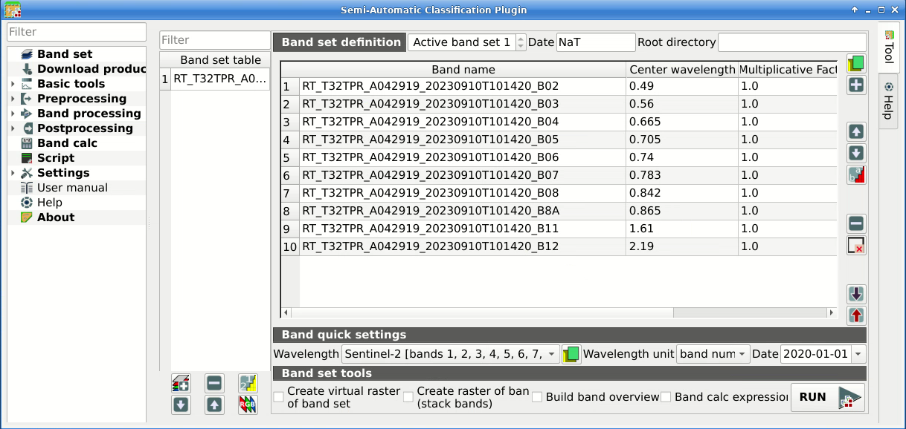

    :guilabel:`Definition of a band set`

We can display a :ref:`color_composite_definition` of bands:
Near-Infrared, Red, and Green.

.. tip::
    If a :ref:`band_set_tab` is defined, a temporary virtual raster (named
    ``Virtual Band Set 1``) is created automatically, which allows for the
    display of a :ref:`color_composite_definition`.

In the :ref:`working_toolbar`, click the list :guilabel:`RGB=` and select the
item ``7-3-2`` (corresponding to the band numbers in :ref:`band_set_tab`).
You can see that ``Virtual Band Set 1`` is added to QGIS Layers as multiband
image, and the displayed bands correspond to the selected color composite.

Because we selected Near-Infrared, Red, and Green bands, in the map,
vegetation is highlighted in red.
Selecting the color composite ``3-2-1``, natural colors would be displayed.

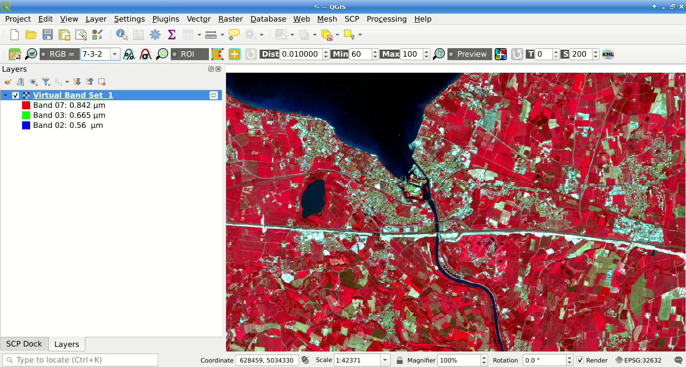

    :guilabel:`Color composite RGB=7-3-2`

After :ref:`band_set_tab` creation, we need to create a :ref:`training_input`
file in order to collect :ref:`ROI_definition` (ROIs) and calculate the
:ref:`spectral_signature_definition` thereof (which are
required to train the classification algorithm).

In the :ref:`SCP_dock` select the tab :ref:`training_input` and click the
button |new_file| to create the :guilabel:`Training input` (define a name such
as ``training.scpx``).

.. tip::
    A :guilabel:`Training input` is a ``.scpx`` file which stores the
    geometries and the spectral signatures. Once it is created, it is
    configured with the wavelength properties of the corresponding
    :guilabel:`Band set`.
    To use a :guilabel:`Training input` create with a different
    :guilabel:`Band set`, one should create a new :guilabel:`Training input`,
    and then import the existing :guilabel:`Training input` with
    |import_spectral_library| :ref:`import_library_file_tab` .

The path of the file is displayed and a vector is added to QGIS layers with the
same name as the :guilabel:`Training input`.

.. warning::
    In order to prevent data loss, one should not edit the
    :guilabel:`Training input` using QGIS vector tools.

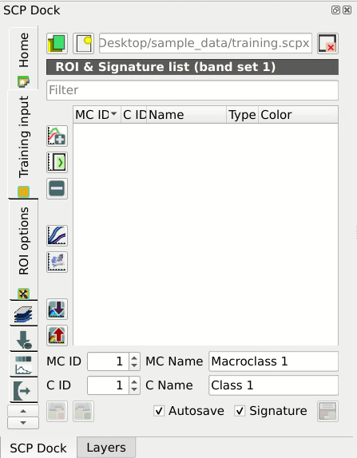

    :guilabel:`Definition of Training input in SCP`

.. _tutorial_1_rois:

Create the ROIs
------------------------------------------------------

We are going to create ROIs defining the :ref:`classes_definition`. 
Each ROI is identified by a Class ID (i.e. C ID), and each ROI is assigned to
a land cover class through a Macroclass ID (i.e. MC ID).

Macroclasses are composed of several materials having different spectral
signatures; in order to achieve good classification results we should separate
spectral signatures of different materials, even if belonging to the same
macroclass.
Thus, we are going to create several ROIs for each macroclass (setting the same
:guilabel:`MC ID`, but assigning a different :guilabel:`C ID` to every ROI).

We are going to use the Macroclass IDs defined in the following table.

+-----------------------------+--------------------------+
| Macroclass name             | Macroclass ID            |
+=============================+==========================+
| Water                       |  1                       |
+-----------------------------+--------------------------+
| Built-up                    |  2                       |
+-----------------------------+--------------------------+
| Vegetation                  |  3                       |
+-----------------------------+--------------------------+
| Soil                        |  4                       |
+-----------------------------+--------------------------+

.. tip::
    ROIs can be created by manually drawing a polygon or with an automatic
    region growing algorithm.

In the map zoom over the dark blue area in the upper left corner of the image
which is a water body.
To manually create a ROI inside the dark area, click the button |manual_ROI|
in the :ref:`working_toolbar`.
Left click on the map to define the ROI vertices and right click to define the
last vertex closing the polygon.
An orange semi-transparent polygon is displayed over the image, which is a
temporary polygon (i.e., it is not saved in the :ref:`training_input`).

.. tip::
    You can draw temporary polygons (the previous one will be overridden)
    until the shape covers the intended area.

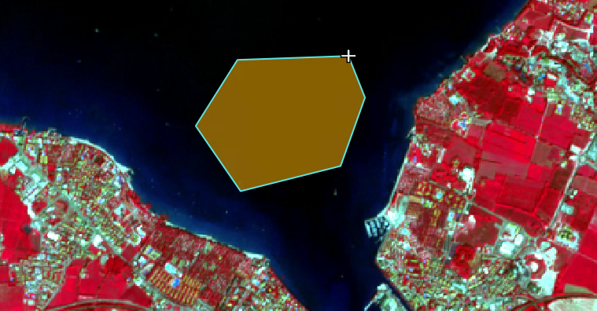

    :guilabel:`A temporary ROI created manually`

If the shape of the temporary polygon sufficiently covers the water area,
we can save it to the :ref:`training_input`.

Open the :ref:`training_input` to define the :ref:`classes_definition` .
In the :ref:`ROI_list` set :guilabel:`MC ID` = 1 and :guilabel:`MC Name` =
``Water``; also set :guilabel:`C ID` = 1 and :guilabel:`C Name` = ``Lake``.
Now click |save_roi| to save the ROI in the :guilabel:`Training input`.

After a few seconds, the ROI is listed in the :ref:`ROI_list` and the
spectral signature is calculated (because |checkbox| :guilabel:`Signature`
is checked).

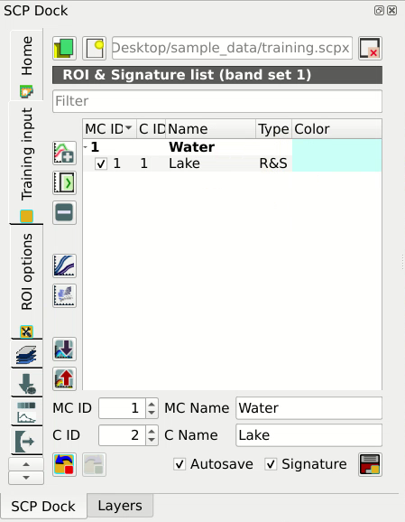

    :guilabel:`The ROI saved in the Training input`

As you can see, the :guilabel:`C ID` in :ref:`ROI_list` is automatically
increased by 1.
Saved ROI is displayed as a dark polygon in the map and the temporary ROI is
removed.
Also, in the :ref:`ROI_list` you can notice that the :guilabel:`Type` is
:guilabel:`R&S` (i.e., ROI and spectral signature), meaning that the ROI
spectral signature was calculated and saved in the :guilabel:`Training input`.

Now we are going to create a second ROI for the built-up class using the
automatic region growing algorithm.
Zoom near the center of the image.
In :ref:`working_toolbar` set the :guilabel:`Dist` value to 0.03 .
Click the button |roi_single| in the :ref:`working_toolbar` and click over the 
light blue area of the map.
After a while the orange semi-transparent polygon is displayed over the image.

.. tip::
    :guilabel:`Dist` value should be set according to the range of pixel
    values; in general, increasing this value creates larger ROIs.

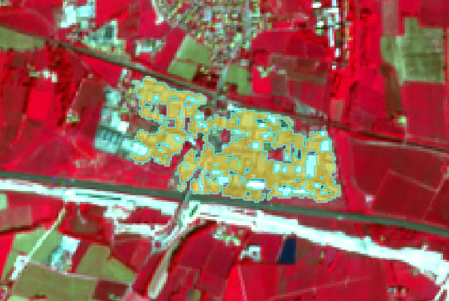

    :guilabel:`A temporary ROI created with the automatic region growing algorithm`

In the :ref:`ROI_list` set :guilabel:`MC ID` = 2 and :guilabel:`MC Name` = 
``Built-up`` ; also set :guilabel:`C ID` = 2 (it should be already set) and 
:guilabel:`C Name` = ``Buildings``.

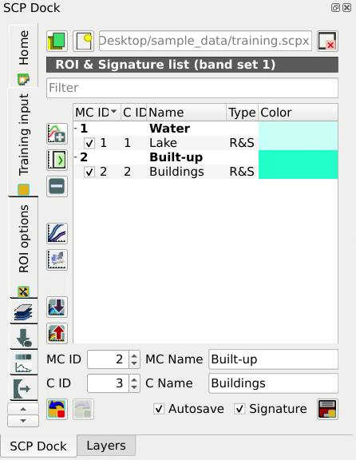

    :guilabel:`The ROI saved in the Training input`

Again, the :guilabel:`C ID` in :ref:`ROI_list` is automatically increased by 1.

Create a ROI for the class ``Vegetation`` (red pixels in color composite
``RGB=7-3-2``) and a ROI for the class ``Soil (bare soil or low vegetation)``
(yellow pixels in color composite ``RGB=7-3-2``) following the same steps
described previously.
The following images show a few examples of these classes identified in the
map.

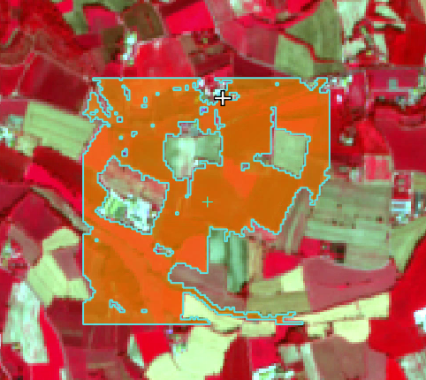

    :guilabel:`Vegetation. Color composite RGB = 7-3-2`

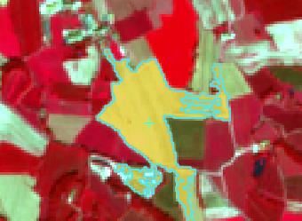

    :guilabel:`Soil. Color composite RGB = 7-3-2`

.. tip::
    It is possible to display the :guilabel:`Spectral signatures` of created
    ROIs in the |sign_plot| :ref:`spectral_signature_plot`.

.. _tutorial_1_classification_preview:

Create a Classification Preview
------------------------------------------------------

The classification process is based on collected ROIs (and spectral signatures
thereof).
It is useful to create a :ref:`classification_preview` in order to assess the
results (influenced by spectral signatures) before the final classification.
In case the results are not good, we can collect additional ROIs to better
classify land cover.

Before running a classification (or a preview), set the color of land cover
classes that will be displayed in the classification raster.
In the :ref:`ROI_list`, double click the color (in the column
:guilabel:`Color`) of each ROI to choose a representative color of each class.
Also, we need to set the color for macroclasses in :ref:`ROI_list`.

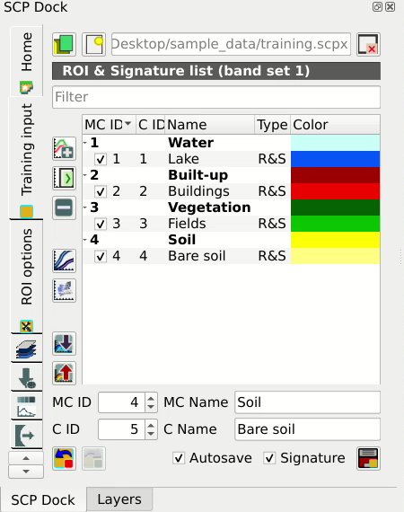

    :guilabel:`Definition of class colors`

Now we need to select the classification algorithm.
In this tutorial we are going to use the :ref:`max_likelihood_algorithm`.

Open the tool :ref:`classification_tab` to set the use of classes or
macroclasses.
Check :guilabel:`Use` |checkbox| :guilabel:`Class ID` and in
:ref:`classification_alg` select the :guilabel:`Maximum Likelihood`.
The :guilabel:`input band set` is 1 because it is the number of the band set
containing the image (bands) that we want to classify.

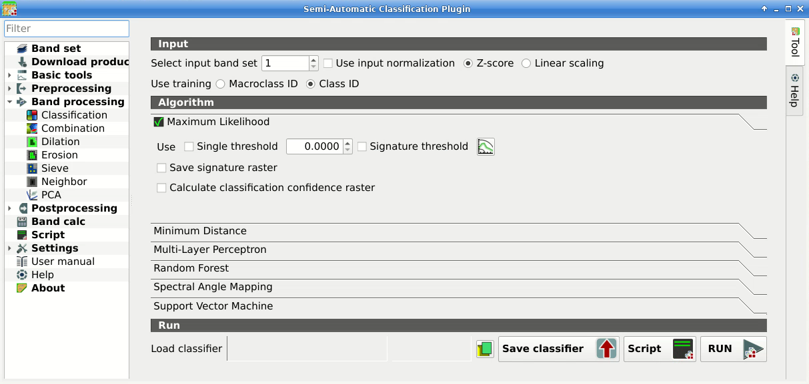

    :guilabel:`Setting the algorithm and using C ID`

In :ref:`classification_preview` set :guilabel:`Size` = 300; click the button
|preview| and then left click a point of the image in the map.
The classification process should be rapid, and the result is a classified
square centered in the clicked coordinates.

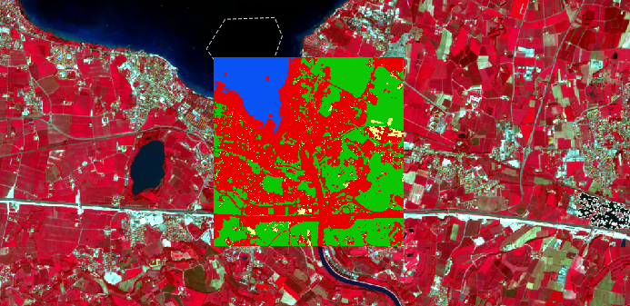

    :guilabel:`Classification preview displayed over the image using C ID`

Previews are temporary rasters (deleted after QGIS is closed) placed in a
group named :guilabel:`Class_temp_group` in the QGIS panel ``Layers``.
Now in :ref:`classification_tab` check :guilabel:`Use` |checkbox|
:guilabel:`MC ID` and click the button |preview_redo| in
:ref:`classification_preview`.
The preview now represents the colors defined for macroclass.

.. figure:: _static/tutorial_1/tutorial_1_preview_4.png
    :align: center
    :width: 100%

    :guilabel:`Classification preview displayed over the image using MC ID`

.. tip::
    It is useful to perform a classification preview every time a ROI (or a
    spectral signature) is added to the :ref:`ROI_list`, in order to assess the
    contribution thereof to the classification; if the ROI causes errors, it
    can be removed from the :guilabel:`Training input` with the button
    |delete_signature|.

.. _tutorial_1_classification:

Create the Classification Output
------------------------------------------------------

Assuming that the results of classification previews show a good agreement
with the image (i.e. pixels are assigned to the correct class defined in the
:ref:`ROI_list`), we can perform the actual land cover classification of the
whole image.

In :ref:`classification_tab` check
:guilabel:`Use` |checkbox| :guilabel:`Macroclass ID`.
Click the button :ref:`classification_run` |run| and define the
path of the classification output, which is a raster file (.tif).

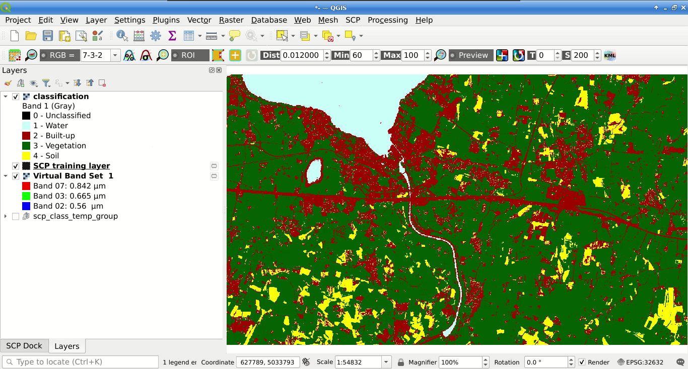

    :guilabel:`Result of the land cover classification`

.. tip::
    If |checkbox| :guilabel:`Play sound when finished` is checked in
    :ref:`calculation_process` settings, a sound is played when the process
    is finished.

**Well done!**
You have just performed your first land cover classification.

However, you can see that there are several classification errors, because the
number of ROIs (spectral signatures) is insufficient.

.. figure:: _static/tutorial_1/tutorial_1_class_2.png
    :align: center
    :width: 100%

    :guilabel:`Example of error: Soil classified as Built-up`

In other tutorials we are going to learn about the download and preprocessing
of bands, the classification algorithms, and the postprocessing of
classifications.
