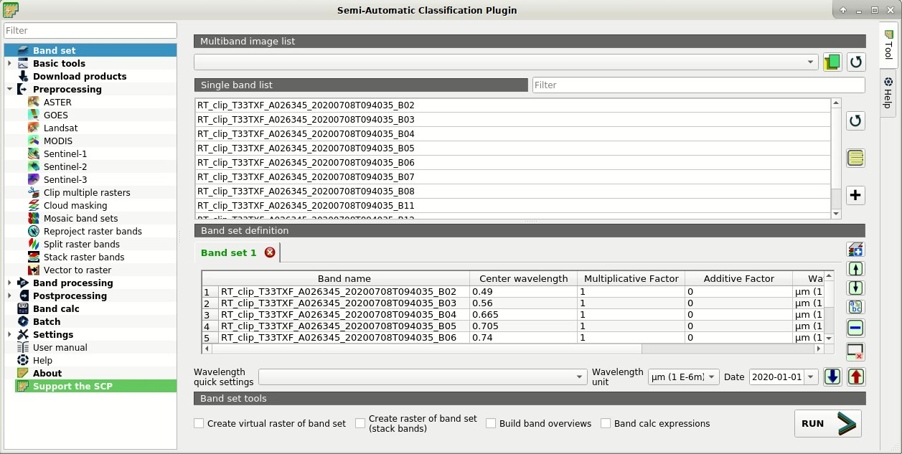
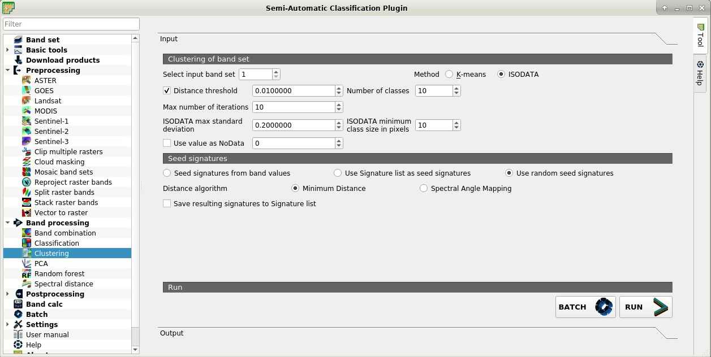
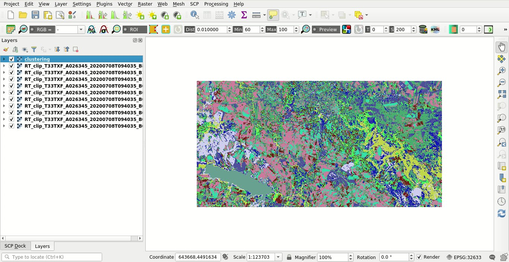
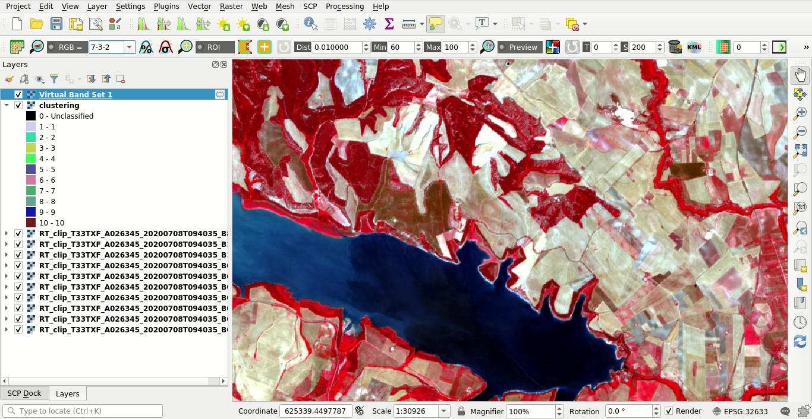
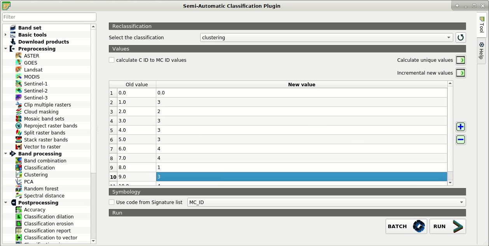
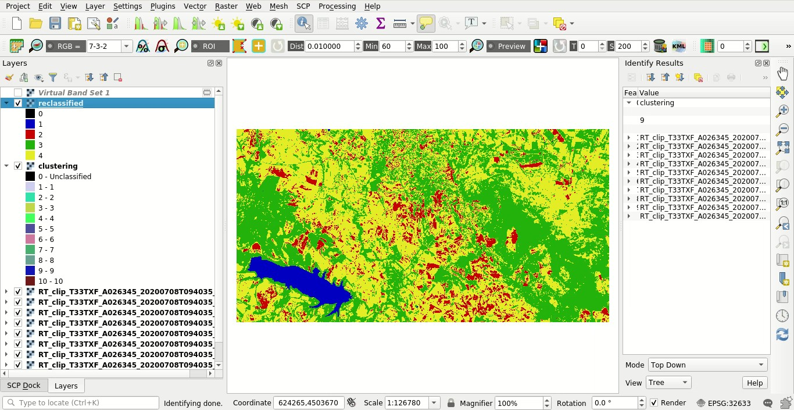
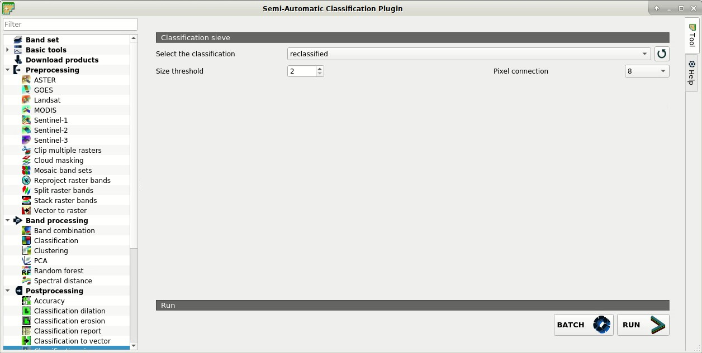
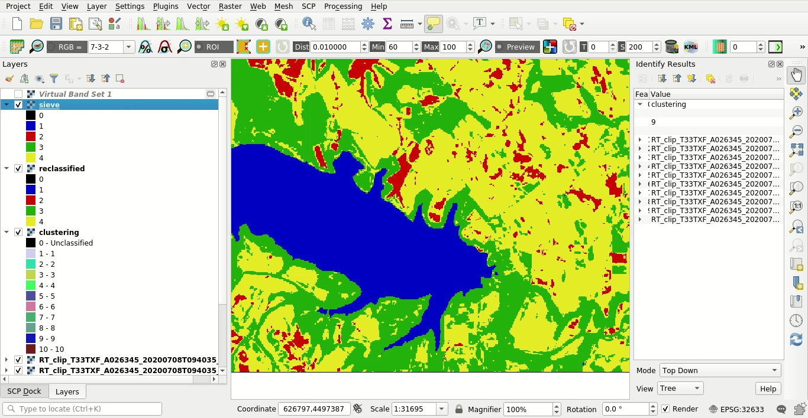

.. _basic_tutorial_2:

***************************************************************
Tutorial 2
***************************************************************

.. |br| raw:: html

  

.. |add| image:: _static/semiautomaticclassificationplugin_add.png
	:width: 20pt
	
.. |checkbox| image:: _static/checkbox.png
	:width: 18pt
	
.. |pointer| image:: _static/semiautomaticclassificationplugin_pointer_tool.png
	:width: 20pt
	
.. |radiobutton| image:: _static/radiobutton.png
	:width: 18pt
	
.. |reload| image:: _static/semiautomaticclassificationplugin_reload.png
	:width: 20pt
	
.. |reset| image:: _static/semiautomaticclassificationplugin_reset.png
	:width: 20pt
	
.. |remove| image:: _static/semiautomaticclassificationplugin_remove.png
	:width: 20pt
	
.. |run| image:: _static/semiautomaticclassificationplugin_run.png
	:width: 24pt
	
.. |input_number| image:: _static/input_number.jpg
	:width: 20pt
	
.. |input_list| image:: _static/input_list.jpg
	:width: 20pt
	
.. |open_file| image:: _static/semiautomaticclassificationplugin_open_file.png
	:width: 20pt
	
.. |new_file| image:: _static/semiautomaticclassificationplugin_new_file.png
	:width: 20pt
	
.. |open_dir| image:: _static/semiautomaticclassificationplugin_open_dir.png
	:width: 20pt
	
.. |select_all| image:: _static/semiautomaticclassificationplugin_select_all.png
	:width: 20pt
	
.. |move_up| image:: _static/semiautomaticclassificationplugin_move_up.png
	:width: 20pt
	
.. |move_down| image:: _static/semiautomaticclassificationplugin_move_down.png
	:width: 20pt
	
.. |search_images| image:: _static/semiautomaticclassificationplugin_search_images.png
	:width: 20pt

.. |image_preview| image:: _static/semiautomaticclassificationplugin_download_image_preview.png
	:width: 20pt

.. |import| image:: _static/semiautomaticclassificationplugin_import.png
	:width: 20pt
	
.. |export| image:: _static/semiautomaticclassificationplugin_export.png
	:width: 20pt

.. |plus| image:: _static/semiautomaticclassificationplugin_plus.png
	:width: 20pt

.. |order_by_name| image:: _static/semiautomaticclassificationplugin_order_by_name.png
	:width: 20pt

.. |image_overview| image:: _static/semiautomaticclassificationplugin_download_image_overview.png
	:width: 20pt
	
.. |enter| image:: _static/semiautomaticclassificationplugin_enter.png
	:width: 20pt

.. |download| image:: _static/semiautomaticclassificationplugin_download_arrow.png
	:width: 20pt
	
.. |landsat_download| image:: _static/semiautomaticclassificationplugin_landsat8_download_tool.png
	:width: 20pt

.. |sentinel_download| image:: _static/semiautomaticclassificationplugin_sentinel_download_tool.png
	:width: 20pt
	
.. |tools| image:: _static/semiautomaticclassificationplugin_roi_tool.png
	:width: 20pt
	
.. |roi_multiple| image:: _static/semiautomaticclassificationplugin_roi_multiple.png
	:width: 20pt

.. |import_spectral_library| image:: _static/semiautomaticclassificationplugin_import_spectral_library.png
	:width: 20pt
	
.. |export_spectral_library| image:: _static/semiautomaticclassificationplugin_export_spectral_library.png
	:width: 20pt
	
.. |weight_tool| image:: _static/semiautomaticclassificationplugin_weight_tool.png
	:width: 20pt
	
.. |threshold_tool| image:: _static/semiautomaticclassificationplugin_threshold_tool.png
	:width: 20pt
	
.. |LCS_threshold| image:: _static/semiautomaticclassificationplugin_LCS_threshold_tool.png
	:width: 20pt
	
.. |LCS_threshold_set_tool| image:: _static/semiautomaticclassificationplugin_LCS_threshold_set_tool.png
	:width: 20pt
	
.. |preprocessing| image:: _static/semiautomaticclassificationplugin_class_tool.png
	:width: 20pt
	
.. |processing| image:: _static/semiautomaticclassificationplugin_band_processing.png
	:width: 20pt
	
.. |landsat_tool| image:: _static/semiautomaticclassificationplugin_landsat8_tool.png
	:width: 20pt
	
.. |sentinel2_tool| image:: _static/semiautomaticclassificationplugin_sentinel_tool.png
	:width: 20pt
	
.. |aster_tool| image:: _static/semiautomaticclassificationplugin_aster_tool.png
	:width: 20pt
	
.. |split_raster| image:: _static/semiautomaticclassificationplugin_split_raster.png
	:width: 20pt
	
.. |clip_tool| image:: _static/semiautomaticclassificationplugin_clip_tool.png
	:width: 20pt
	
.. |pca_tool| image:: _static/semiautomaticclassificationplugin_pca_tool.png
	:width: 20pt
	
.. |vector_to_raster_tool| image:: _static/semiautomaticclassificationplugin_vector_to_raster_tool.png
	:width: 20pt
	
.. |post_process| image:: _static/semiautomaticclassificationplugin_post_process.png
	:width: 20pt
	
.. |accuracy_tool| image:: _static/semiautomaticclassificationplugin_accuracy_tool.png
	:width: 20pt
	
.. |land_cover_change| image:: _static/semiautomaticclassificationplugin_land_cover_change.png
	:width: 20pt
	
.. |report_tool| image:: _static/semiautomaticclassificationplugin_report_tool.png
	:width: 20pt

.. |class_to_vector_tool| image:: _static/semiautomaticclassificationplugin_class_to_vector_tool.png
	:width: 20pt

.. |reclassification_tool| image:: _static/semiautomaticclassificationplugin_reclassification_tool.png
	:width: 20pt

.. |edit_raster| image:: _static/semiautomaticclassificationplugin_edit_raster.png
	:width: 20pt

.. |undo_edit_raster| image:: _static/semiautomaticclassificationplugin_undo_edit_raster.png
	:width: 20pt

.. |classification_sieve| image:: _static/semiautomaticclassificationplugin_classification_sieve.png
	:width: 20pt

.. |classification_erosion| image:: _static/semiautomaticclassificationplugin_classification_erosion.png
	:width: 20pt

.. |classification_dilation| image:: _static/semiautomaticclassificationplugin_classification_dilation.png
	:width: 20pt

.. |bandcalc_tool| image:: _static/semiautomaticclassificationplugin_bandcalc_tool.png
	:width: 20pt
	
.. |batch_tool| image:: _static/semiautomaticclassificationplugin_batch.png
	:width: 20pt

.. |bandset_tool| image:: _static/semiautomaticclassificationplugin_bandset_tool.png
	:width: 20pt
	
.. |settings_tool| image:: _static/semiautomaticclassificationplugin_settings_tool.png
	:width: 20pt
	
.. |manual_ROI| image:: _static/semiautomaticclassificationplugin_manual_ROI.png
	:width: 20pt

.. |save_roi| image:: _static/semiautomaticclassificationplugin_save_roi.png
	:width: 20pt
	
.. |roi_single| image:: _static/semiautomaticclassificationplugin_roi_single.png
	:width: 20pt
	
.. |roi_redo| image:: _static/semiautomaticclassificationplugin_roi_redo.png
	:width: 20pt

.. |preview| image:: _static/semiautomaticclassificationplugin_preview.png
	:width: 20pt
	
.. |preview_redo| image:: _static/semiautomaticclassificationplugin_preview_redo.png
	:width: 20pt
	
.. |delete_signature| image:: _static/semiautomaticclassificationplugin_delete_signature.png
	:width: 20pt

.. |sign_plot| image:: _static/semiautomaticclassificationplugin_sign_tool.png
	:width: 20pt

.. |cumulative_stretch| image:: _static/semiautomaticclassificationplugin_bandset_cumulative_stretch_tool.png
	:width: 20pt

.. |std_dev_stretch| image:: _static/semiautomaticclassificationplugin_bandset_std_dev_stretch_tool.png
	:width: 20pt

.. |calculate_spectral_distances| image:: _static/semiautomaticclassificationplugin_calculate_spectral_distances.png
	:width: 20pt
	
.. |remove_temp| image:: _static/semiautomaticclassificationplugin_remove_temp.png
	:width: 20pt
	
.. |osm_add| image:: _static/semiautomaticclassificationplugin_osm_add.png
	:width: 20pt

The following is a basic tutorial about the Semi-Automatic Classification Plugin (:guilabel:`SCP`).
It is assumed that you have a basic knowledge of QGIS.

.. contents::
    :depth: 2
    :local:
	

.. _tutorial_2:
 
Tutorial 2: Unsupervised Classification
===================================================

This is a basic tutorial about the use of :guilabel:`SCP` for the unsupervised classification of a multispectral image.
It is recommended to read the :ref:`remote_sensing` before this tutorial, and in particular the part :ref:`clustering_definition`.

Clustering can be used for unsupervised classification, which means that no training input is required, producing classes (i.e. clusters) that have no definition and consequently the user must assign a land cover label to each class.

The purpose of the classification is to identify the land cover classes with the corresponding ID codes defined in the following table.
	
	:guilabel:`Classes`
	
+-----------------------------+--------------------------+
| Class name                  | Class ID                 |
+=============================+==========================+
| Water                       |  1                       |
+-----------------------------+--------------------------+
| Built-up                    |  2                       |
+-----------------------------+--------------------------+
| Vegetation                  |  3                       |
+-----------------------------+--------------------------+
| Soil                        |  4                       |
+-----------------------------+--------------------------+

Following the video of this tutorial.

.. raw:: html

	<iframe allowfullscreen="" frameborder="0" height="360" src="http://www.youtube.com/embed/kRPNjNvrLPU?rel=0" width="100%"></iframe>

http://www.youtube.com/watch?v=kRPNjNvrLPU

.. _tutorial_2_input_data:

Input Data
-------------------------

Any multispectral image can be used for unsupervised classification.
In this tutorial, we are going to use a subset of a :ref:`Sentinel2_definition` image (`Copernicus <http://copernicus.eu/>`_ land monitoring services) and use the bands illustrated in the following table.
You can download the image from `this archive <https://docs.google.com/uc?id=1cph9rCQ1oiWgRGusgRkjUWwLW3JEwqUK>`_ (about 30 MB, © Copernicus Sentinel data 2020 downloaded from https://scihub.copernicus.eu/), and then unzip the downloaded file.

+-------------------------------------+-------------------------------------+------------------------+
| Sentinel-2 Bands                    | Central Wavelength  [micrometers]   |  Resolution [meters]   |
+=====================================+=====================================+========================+
| Band 2 - Blue                       | 0.490                               |  10                    |
+-------------------------------------+-------------------------------------+------------------------+
| Band 3 - Green                      |  0.560                              |  10                    |
+-------------------------------------+-------------------------------------+------------------------+
| Band 4 - Red                        | 0.665                               |  10                    |
+-------------------------------------+-------------------------------------+------------------------+
| Band 5 - Vegetation Red Edge        | 0.705                               |  20                    |
+-------------------------------------+-------------------------------------+------------------------+
| Band 6 - Vegetation Red Edge        | 0.740                               |  20                    |
+-------------------------------------+-------------------------------------+------------------------+
| Band 7 - Vegetation Red Edge        | 0.783                               |  20                    |
+-------------------------------------+-------------------------------------+------------------------+
| Band 8 - NIR                        | 0.842                               |  10                    |
+-------------------------------------+-------------------------------------+------------------------+
| Band 8A - Vegetation Red Edge       | 0.865                               |  20                    |
+-------------------------------------+-------------------------------------+------------------------+
| Band 11 - SWIR                      | 1.610                               |  20                    |
+-------------------------------------+-------------------------------------+------------------------+
| Band 12 - SWIR                      | 2.190                               |  20                    |
+-------------------------------------+-------------------------------------+------------------------+

Start QGIS and the :guilabel:`SCP`.

The downloaded product is a Sentinel-2 Level 2A image, which is already atmospherically corrected (Level 1C images require atmospherical correction as described in :ref:`conversion_to_reflectance`).
Nevertheless, preprocessing is required to convert pixel values to a decimal value of reflectance.

Conversion to reflectance (see :ref:`radiance_reflectance_definition`) can be performed automatically.
In order to convert bands to reflectance, open the :ref:`pre_processing_tab` clicking the button |preprocessing| in the :ref:`SCP_menu` or the :ref:`SCP_dock`, and select the tab :ref:`sentinel2_tab`.

Click the button :guilabel:`Directory containing Sentinel-2 bands` |open_dir| and select the directory of Sentinel-2 bands.
The list of bands is automatically loaded in the table :ref:`sentinel2_metadata`.

You can ignore :guilabel:`Select metadata file` because this conversion doesn't require additional information.

Check the option |checkbox| :guilabel:`Create Band set and use Band set tools` in order to create automatically the input :guilabel:`Band set` that will be used for clustering.

To start the conversion process, click the button :guilabel:`RUN` |run| and select the directory where converted bands are saved.
After a few minutes, converted bands are loaded and displayed (file name beginning with ``RT_``).

.. figure:: _static/tutorial_2/tutorial_2_conversion.jpg
	:align: center
	:width: 600pt
	
	:guilabel:`Converted bands`
	
	
Open the tab :ref:`band_set_tab` clicking the button |bandset_tool| in the :ref:`SCP_menu` or the :ref:`SCP_dock`.
The bands are already listed in the first :guilabel:`Band set`.

	
	:guilabel:`Band set`
	

.. _tutorial_2_clustering:

Clustering
----------------------------------------------------------

Clustering requires the user to define the number of clusters (i.e. classes) expected in the image, which correspond to as many spectral signatures (i.e. seeds).
During the first iteration clusters are produced calculating the pixel spectral distance with initial spectral signatures.
Pixels are assigned according to the most similar spectral signature, therefore producing clusters.
In this tutorial we are going to perform clustering using the ISODATA algorithm, which includes steps for merging clusters having similar spectral signatures and splitting clusters having too high variability.
We are going to select randomly the starting spectral signatures and use the algorithm  :ref:`euclidean_distance` for distance calculation.

Open the tab :ref:`clustering_tab` clicking the button |processing| in the :ref:`SCP_menu` or the :ref:`SCP_dock`.
In :guilabel:`Select input band set` |input_number| we set 1 because we are going to classify the first :guilabel:`Band set`.

In :guilabel:`Method` check :guilabel:`ISODATA`.
In |checkbox| :guilabel:`Distance threshold` set 0.01, which is the distance required for merging clusters.

In :guilabel:`Number of classes` set 10; we set a number higher than the land cover classes defined at the beginning of this tutorial because we try to account for spectral variability of classes.
In :guilabel:`Max number of iterations` set 10; in general, the more the iterations the better the result.

In :guilabel:`ISODATA max standard deviation` we set the maximum standard deviation considered for splitting a class; we can set the value 0.2 here.  
In :guilabel:`ISODATA minimum class size in pixels` we can set 10.

We check the option :guilabel:`Use random seed signatures` to randomly selects the spectral signatures of seed pixels from :guilabel:`Band set`.
Now click the button :guilabel:`RUN` |run| and define the path of the classification output.
	

	
	:guilabel:`Clustering tool`
	

After the process, the result is displayed in the map.
The result of the unsupervised classification is a raster having values that don't correspond to the class IDs defined at the beginning of this tutorial.
The number of classes can vary depending on the various iterations.

	
	:guilabel:`Result of clustering`
	
The mean spectral signature of output classes is displayed in the panel.
We could also save these spectral signatures in a previously created :ref:`training_input` if we wanted to use these in other supervised classifications.

.. _tutorial_2_reclassification:

Reclassification of the output
------------------------------------------------------

We must identify the correspondence between raster classes and the land cover class IDs defined at the beginning of this tutorial.

We can perform this task through photointerpretation.
We can display a :ref:`color_composite_definition` of bands: Near-Infrared, Red, and Green: in the :ref:`working_toolbar`, click the list :guilabel:`RGB=` and select the item ``7-3-2`` (corresponding to the band numbers in :ref:`band_set_tab`).
You can see that image colors in the map change according to the selected bands, and vegetation is highlighted in red (if the item ``3-2-1`` was selected, natural colors would be displayed).

	
	:guilabel:`Color composite RGB=7-3-2`

	
We should take note of the corresponding values, similarly to the following table as example.
Please note that you should define different values according to the result of your classification output.

+-----------------------------+--------------------------+--------------------------+
| Class name                  | Cluster ID               | New class ID             |
+=============================+==========================+==========================+
| Vegetation                  |  1                       |  3                       |
+-----------------------------+--------------------------+--------------------------+
| Built-up                    |  2                       |  2                       |
+-----------------------------+--------------------------+--------------------------+
| Vegetation                  |  3                       |  3                       |
+-----------------------------+--------------------------+--------------------------+
| Vegetation                  |  4                       |  3                       |
+-----------------------------+--------------------------+--------------------------+
| Vegetation                  |  5                       |  3                       |
+-----------------------------+--------------------------+--------------------------+
| Soil                        |  6                       |  4                       |
+-----------------------------+--------------------------+--------------------------+
| Soil                        |  7                       |  4                       |
+-----------------------------+--------------------------+--------------------------+
| Water                       |  8                       |  1                       |
+-----------------------------+--------------------------+--------------------------+
| Vegetation                  |  9                       |  3                       |
+-----------------------------+--------------------------+--------------------------+
| Soil                        |  10                      |  4                       |
+-----------------------------+--------------------------+--------------------------+

Now we can reclassify the output raster according to out classification system.

Open the tool :ref:`reclassification_tab` clicking the button |post_process| in the :ref:`SCP_menu` or the :ref:`SCP_dock`.
Click :guilabel:`Calculate unique values` |enter| to automatically calculate unique values in the classification and fill the reclassification table.
In :guilabel:`New value` set the corresponding New class ID.

	
	:guilabel:`Reclassification`

When the table is complete, click the button :guilabel:`RUN` |run| and define the path of the classification output.
After the process, the raster is added to the map.
We can define a symbology according to our classes.

	
	:guilabel:`Reclassified raster`

Of course, the result of an unsupervised classification can have many classification errors.
In this example, several pixels of soil have been classified as built-up.
For reducing those errors we could repeat the clustering step increasing the :guilabel:`Number of classes`, reducing the value :guilabel:`ISODATA max standard deviation`, and increasing the value :guilabel:`Distance threshold`.

.. _tutorial_2_refinement:

Refinement of the output
------------------------------------------------------

The classification could contain small patches of pixels that we would like to remove from the classification result.

We can use the tool :ref:`classification_sieve_tab` to remove small patches of isolated pixel replacing them with the value of the largest neighbour patch.
Open the tool :ref:`classification_sieve_tab` clicking the button |post_process| in the :ref:`SCP_menu` or the :ref:`SCP_dock`.

In :guilabel:`Select the classification` |input_list| select the raster reclassified in the previous step (click |reload| to refresh the layer list if the classification is not listed).
In :guilabel:`Size threshold` enter 2 to set the maximum size of the patch to be replaced (in pixel unit); all patches smaller than the selected number of pixels will be replaced by the value of the largest neighbour patch.
Setting the value 2 we are going to remove isolated single pixels.

	
	:guilabel:`Sieve tool`
	
In :guilabel:`Pixel connection` |input_list|: select :guilabel:`8` as the type of pixel connection in a 3x3 window (i.e. diagonal pixels are considered connected).
Now click the button :guilabel:`RUN` |run| and define the path of the classification output.
After the process, the raster is added to the map.
We should see that single pixels have been replaced by the largest neighbour patch, resulting in a cleaner classification.

	
	:guilabel:`Refined classification`

Well done!
We have performed an unsupervised classification of a remote sensing image.
We can improve the classification using some of the tools that will be described in other tutorials.
