.. _basic_tutorial_2:

***************************************************************
Tutorial 2
***************************************************************

.. |br| raw:: html

  

	

	
.. |pointer| image:: _static/semiautomaticclassificationplugin_pointer_tool.png
	:width: 20pt
	

	
.. |reload| image:: _static/semiautomaticclassificationplugin_reload.png
	:width: 20pt
	

	

	

	

	
.. |open_file| image:: _static/semiautomaticclassificationplugin_open_file.png
	:width: 20pt
	
.. |new_file| image:: _static/semiautomaticclassificationplugin_new_file.png
	:width: 20pt
	
.. |open_dir| image:: _static/semiautomaticclassificationplugin_open_dir.png
	:width: 20pt
	
.. |select_all| image:: _static/semiautomaticclassificationplugin_select_all.png
	:width: 20pt
	

	

	

	
.. |search_images| image:: _static/semiautomaticclassificationplugin_search_images.png
	:width: 20pt

.. |image_preview| image:: _static/semiautomaticclassificationplugin_download_image_preview.png
	:width: 20pt

	

.. |image_overview| image:: _static/semiautomaticclassificationplugin_download_image_overview.png
	:width: 20pt
	
.. |enter| image:: _static/semiautomaticclassificationplugin_enter.png
	:width: 20pt

	
.. |landsat_download| image:: _static/semiautomaticclassificationplugin_landsat8_download_tool.png
	:width: 20pt

.. |sentinel_download| image:: _static/semiautomaticclassificationplugin_sentinel_download_tool.png
	:width: 20pt
	

	
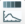
	
.. |roi_multiple| image:: _static/semiautomaticclassificationplugin_roi_multiple.png
	:width: 20pt

	

	
.. |weight_tool| image:: _static/semiautomaticclassificationplugin_weight_tool.png
	:width: 20pt
	
.. |threshold_tool| image:: _static/semiautomaticclassificationplugin_threshold_tool.png
	:width: 20pt
	
.. |LCS_threshold| image:: _static/semiautomaticclassificationplugin_LCS_threshold_tool.png
	:width: 20pt
	
.. |LCS_threshold_set_tool| image:: _static/semiautomaticclassificationplugin_LCS_threshold_set_tool.png
	:width: 20pt
	

	
.. |landsat_tool| image:: _static/semiautomaticclassificationplugin_landsat8_tool.png
	:width: 20pt
	
.. |sentinel2_tool| image:: _static/semiautomaticclassificationplugin_sentinel_tool.png
	:width: 20pt
	
.. |aster_tool| image:: _static/semiautomaticclassificationplugin_aster_tool.png
	:width: 20pt
	
.. |split_raster| image:: _static/semiautomaticclassificationplugin_split_raster.png
	:width: 20pt
	
.. |clip_tool| image:: _static/semiautomaticclassificationplugin_clip_tool.png
	:width: 20pt
	
.. |pca_tool| image:: _static/semiautomaticclassificationplugin_pca_tool.png
	:width: 20pt
	
.. |vector_to_raster_tool| image:: _static/semiautomaticclassificationplugin_vector_to_raster_tool.png
	:width: 20pt
	

	
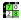
	
.. |land_cover_change| image:: _static/semiautomaticclassificationplugin_land_cover_change.png
	:width: 20pt
	
.. |report_tool| image:: _static/semiautomaticclassificationplugin_report_tool.png
	:width: 20pt

.. |class_to_vector_tool| image:: _static/semiautomaticclassificationplugin_class_to_vector_tool.png
	:width: 20pt

.. |reclassification_tool| image:: _static/semiautomaticclassificationplugin_reclassification_tool.png
	:width: 20pt

.. |edit_raster| image:: _static/semiautomaticclassificationplugin_edit_raster.png
	:width: 20pt

.. |classification_sieve| image:: _static/semiautomaticclassificationplugin_classification_sieve.png
	:width: 20pt

.. |classification_erosion| image:: _static/semiautomaticclassificationplugin_classification_erosion.png
	:width: 20pt

.. |classification_dilation| image:: _static/semiautomaticclassificationplugin_classification_dilation.png
	:width: 20pt

	
.. |batch_tool| image:: _static/semiautomaticclassificationplugin_batch.png
	:width: 20pt

	

	
.. |manual_ROI| image:: _static/semiautomaticclassificationplugin_manual_ROI.png
	:width: 20pt

	
.. |roi_single| image:: _static/semiautomaticclassificationplugin_roi_single.png
	:width: 20pt
	
.. |roi_redo| image:: _static/semiautomaticclassificationplugin_roi_redo.png
	:width: 20pt

.. |preview| image:: _static/semiautomaticclassificationplugin_preview.png
	:width: 20pt
	
.. |preview_redo| image:: _static/semiautomaticclassificationplugin_preview_redo.png
	:width: 20pt
	

.. |sign_plot| image:: _static/semiautomaticclassificationplugin_sign_tool.png
	:width: 20pt

.. |cumulative_stretch| image:: _static/semiautomaticclassificationplugin_bandset_cumulative_stretch_tool.png
	:width: 20pt

.. |std_dev_stretch| image:: _static/semiautomaticclassificationplugin_bandset_std_dev_stretch_tool.png
	:width: 20pt

.. |calculate_spectral_distances| image:: _static/semiautomaticclassificationplugin_calculate_spectral_distances.png
	:width: 20pt
	
.. |remove_temp| image:: _static/semiautomaticclassificationplugin_remove_temp.png
	:width: 20pt

The following is a tutorial about the functions of the Semi-Automatic Classification Plugin (:guilabel:`SCP`).
It is assumed that you have a basic knowledge of QGIS.

.. contents::
    :depth: 2
    :local:
	

.. _tutorial_2:
 
Tutorial 2: Cloud Masking, Image Mosaic, and Land Cover Change Location
============================================================================

This tutorial is about the use of :guilabel:`SCP` for the assessment of land cover change of a multispectral image.
It is recommended to complete the :ref:`tutorial_1` before this tutorial.

The purpose of this tutorial is to locate land cover change over one year (between 2017 and 2018), using free Sentinel-2 images.

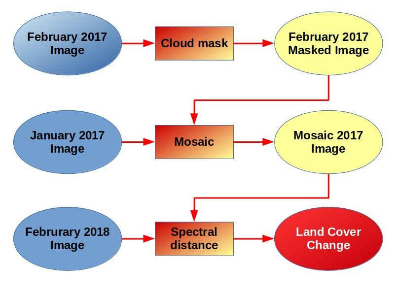
	
	:guilabel:`Workflow`
	
Following the video of this tutorial.

.. raw:: html

	<iframe allowfullscreen="" frameborder="0" height="360" src="http://www.youtube.com/embed/xm9s97GPs0Y?rel=0" width="100%"></iframe>

http://www.youtube.com/watch?v=xm9s97GPs0Y

.. _tutorial_2_data_download:

Download the Data
-------------------------

We are going to download a :ref:`Sentinel2_definition` image (`Copernicus <http://copernicus.eu/>`_ land monitoring services) and use the bands illustrated in the following table.

+-------------------------------------+-------------------------------------+------------------------+
| Sentinel-2 Bands                    | Central Wavelength  [micrometers]   |  Resolution [meters]   |
+=====================================+=====================================+========================+
| Band 2 - Blue                       | 0.490                               |  10                    |
+-------------------------------------+-------------------------------------+------------------------+
| Band 3 - Green                      |  0.560                              |  10                    |
+-------------------------------------+-------------------------------------+------------------------+
| Band 4 - Red                        | 0.665                               |  10                    |
+-------------------------------------+-------------------------------------+------------------------+
| Band 5 - Vegetation Red Edge        | 0.705                               |  20                    |
+-------------------------------------+-------------------------------------+------------------------+
| Band 6 - Vegetation Red Edge        | 0.740                               |  20                    |
+-------------------------------------+-------------------------------------+------------------------+
| Band 7 - Vegetation Red Edge        | 0.783                               |  20                    |
+-------------------------------------+-------------------------------------+------------------------+
| Band 8 - NIR                        | 0.842                               |  10                    |
+-------------------------------------+-------------------------------------+------------------------+
| Band 8A - Vegetation Red Edge       | 0.865                               |  20                    |
+-------------------------------------+-------------------------------------+------------------------+
| Band 11 - SWIR                      | 1.610                               |  20                    |
+-------------------------------------+-------------------------------------+------------------------+
| Band 12 - SWIR                      | 2.190                               |  20                    |
+-------------------------------------+-------------------------------------+------------------------+

Start QGIS and the :guilabel:`SCP` .
Open the tab :ref:`download_tab` clicking the button |download| in the :ref:`SCP_home`, or in the :ref:`SCP_menu`.
In the tab :ref:`download_tab` click the button |osm_add| to display the OpenStreetMap tiles (© `OpenStreetMap <http://www.openstreetmap.org/copyright>`_ contributors) in the QGIS map, licensed as CC BY-SA (`Tile Usage Policy <http://www.openstreetmap.org/copyright>`_ ).

In general it is possible to define the area coordinates clicking the button |pointer| , then left click in the map for the UL point and right click in the map for the LR point.
In this tutorial the study area is Rome (Italy), therefore click in the map to define the search area, or alternatively, enter these point coordinates in :ref:`search_parameters`:

* :guilabel:`UL`: 12.4 / 41.9
* :guilabel:`LR`: 12.5 / 41.8

	
The purpose of this tutorial is to map the land cover change between 2017 and 2018, therefore we need to download at least two images.
Because of cloud cover, we are going to download an additional image for 2016, which will be used to replace pixels covered by clouds in the first image.
We are searching for three images (tile 33TTG) acquired on:

* 01 January 2017
* 10 February 2017
* 10 February 2018

Therefore, we need to perform three searches.
Select :guilabel:`Sentinel-2` from the :guilabel:`Products` |input_list| and set:

* :guilabel:`Date from`: 2017-01-01
* :guilabel:`to`: 2017-01-01

In this case, enter ``L1C_T33TTG`` in :guilabel:`Filter` to filter the results only for the tile 33TTG.

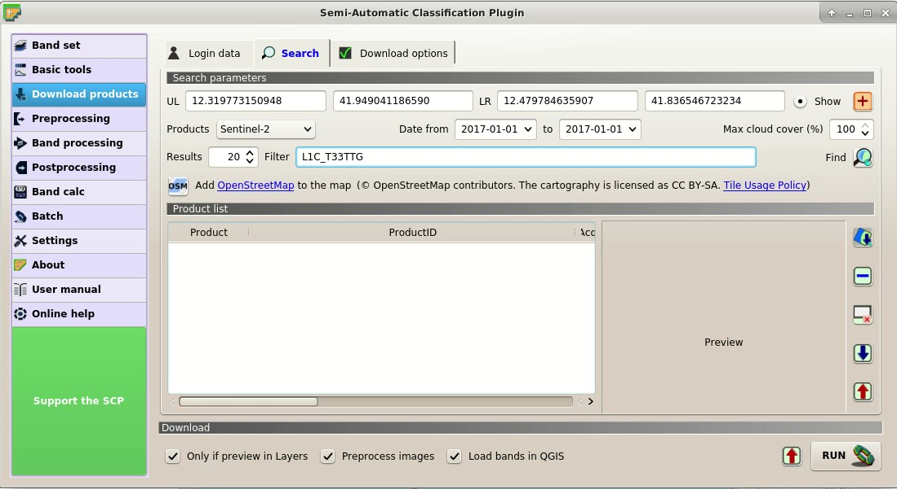
	
	:guilabel:`Search products`
	
Now click the button :guilabel:`Find` |search_images| and after a few seconds the image will be listed in the :ref:`product_list`.
Click the item in the table to display a preview that is useful for assessing the quality of the image and the cloud cover.

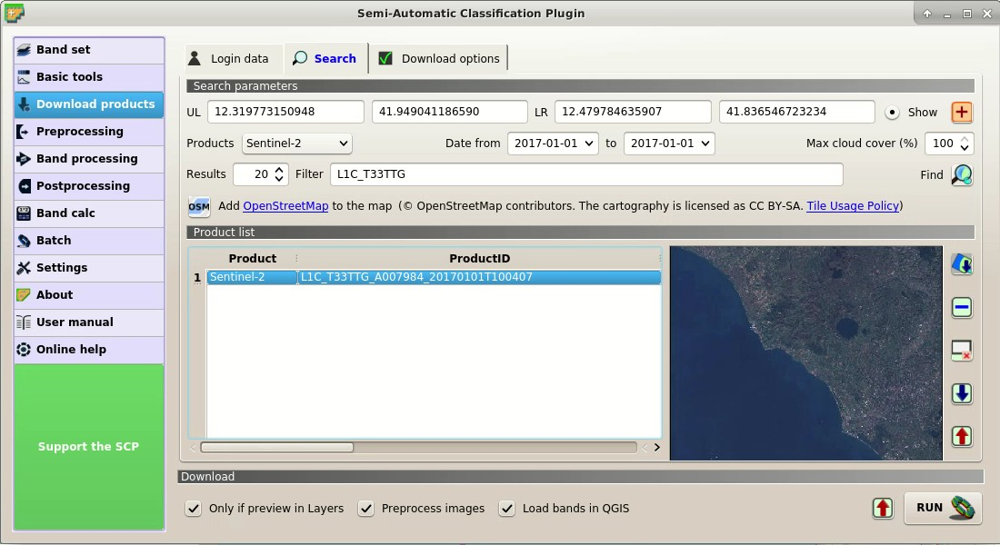
	
	:guilabel:`Search result`
	
Repeat the date definition and the search also for the 2017-02-10 image.
You can notice that there are a few clouds over the area, therefore we are going to mosaic this image with the one acquired on 2017-01-01.

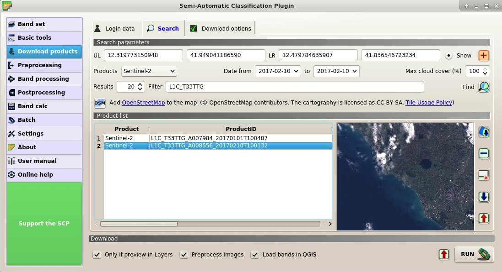
	
	:guilabel:`Search result of second image`
	
Finally, repeat the search for the 2018-02-10 image.

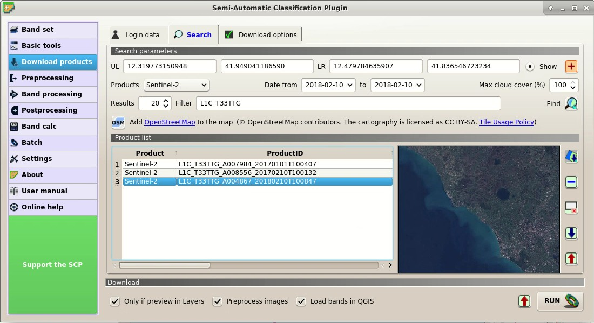
	
	:guilabel:`Search results`
	
	
We can also select the bands to be downloaded according to our purpose.
In particular, select the tab :ref:`download_options` and check only the Sentinel-2 bands that will be used in this tutorial and the ancillary data.

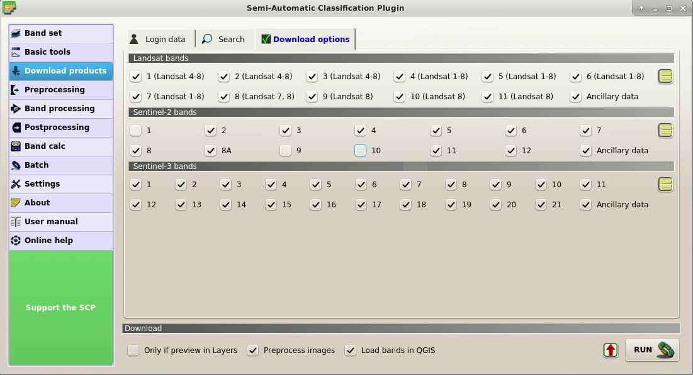
	
	:guilabel:`Download options`
	
For the purpose of this tutorial, uncheck the option |checkbox| :guilabel:`Only if preview in Layers` because we want to download and preprocess all the images listed in the table.

Before starting the download we need to set the preprocessing options in the tab :ref:`sentinel2_tab` for preforming the :ref:`DOS1_correction`.
Check the options |checkbox| :guilabel:`Apply DOS1 atmospheric correction` and |checkbox| :guilabel:`Add bands in a new Band set` to automatically create a :guilabel:`Band set` for each image.

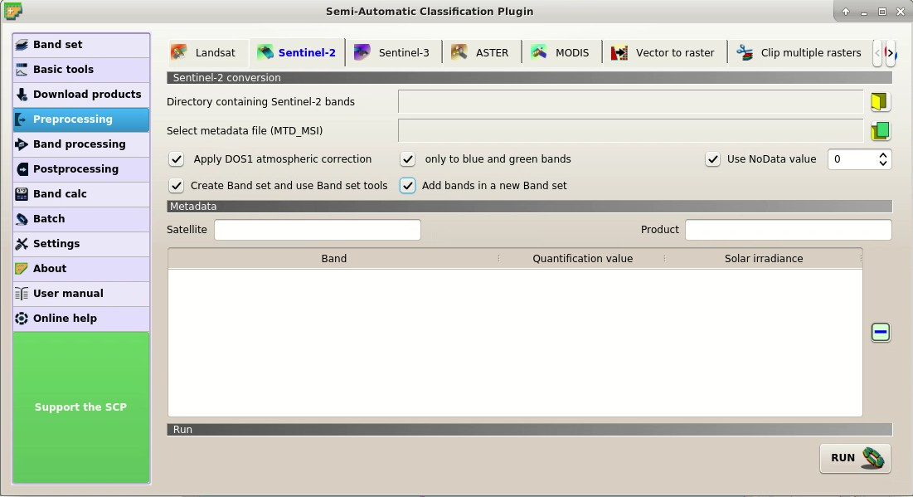
	
	:guilabel:`Preprocessing options`
	
To start the image download, in the tab :ref:`download_tab` click the button :guilabel:`RUN` |run| and select a directory where bands are saved (a new directory will be created for each image).
The download could last a few minutes according to your internet connection speed.
The download progress is displayed in a bar.

After the download, all the bands of all the Sentinel-2 images (© Copernicus Sentinel data 2018) are automatically loaded in the map.
We can also display the RGB color composite of the :guilabel:`Band sets` clicking the list :guilabel:`RGB=` in the :ref:`working_toolbar`, and selecting the item ``3-2-1``.

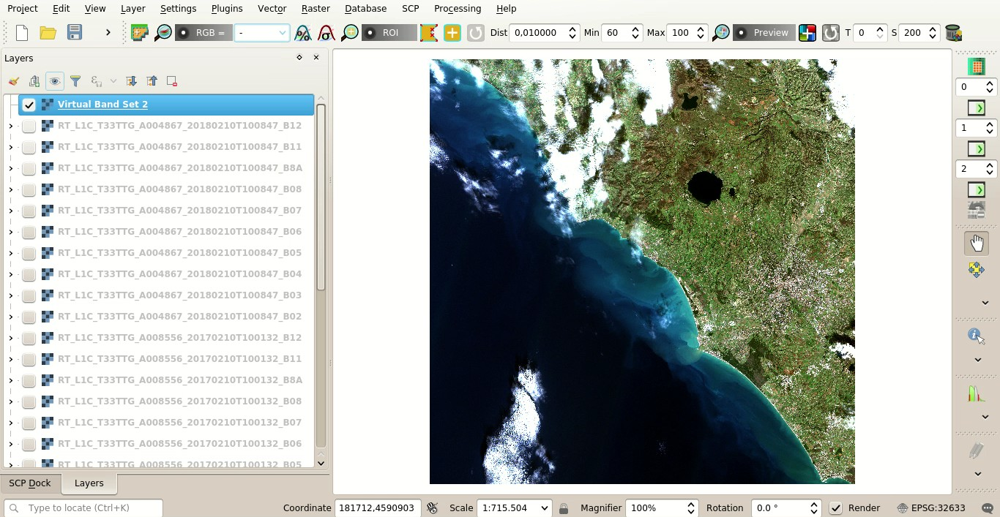
	
	:guilabel:`Download of Sentinel-2 bands`
	
.. _tutorial_2_cloud_mask:

Create the cloud cover mask
---------------------------------

Before the land cover change assessment, we need to remove cloud cover pixels in the image acquired on 2017-02-10.
Of course we could perform the same process for all the other images.

In QGIS, load the file ``MSK_CLOUDS_B00.gml`` that should be inside the directory ``L1C_T33TTG_A008556_20170210T100132_2017-02-10`` .
This vector file represents most of the cloud cover in the image.
In QGIS Layers Panel, left click the vector ``MSK_CLOUDS_B00 MaskFeature`` and select ``Export > Save Feature as`` to save this gml file to shapefile (e.g. ``clouds.shp``).

We can convert this vector file to raster using the tab :ref:`vector_to_raster_tab`.

Click the button |reload| to refresh the layer list, and select the vector ``clouds``. 
Check the |checkbox| :guilabel:`Use constant value` to set the raster value 1 for clouds.
Also, in :guilabel:`Select the reference raster` select the name of a band.
This will create a raster with the same size and aligned to the Sentinel-2 image.
Finally click the button :guilabel:`RUN` |run| to create the mask.

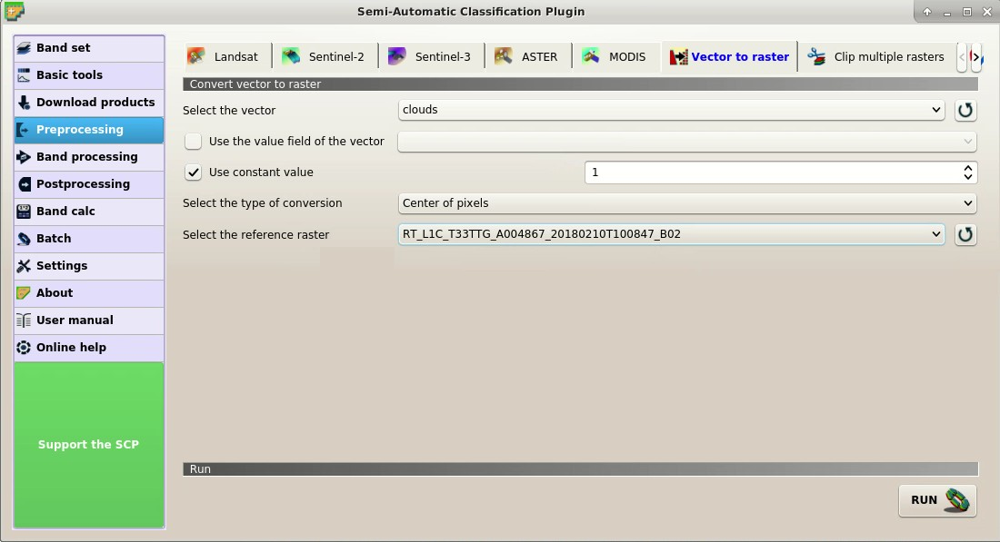
	
	:guilabel:`Vector to raster mask`

We could also improve the mask by manually editing the pixel of the raster using the tool :ref:`edit_raster_tab` or creating a semi-automatic classification of clouds.

.. _tutorial_2_mask:

Mask clouds in the Sentinel-2 image
------------------------------------------------------

We are going to mask all the pixels covered by clouds in all the bands composing the :guilabel:`Band set` of the image acquired on 2017-02-10.

In the tab :ref:`cloud_masking_tab`, set the number of the 2017-02-10 :guilabel:`Band set` in :guilabel:`Select input band set`.
In :guilabel:`Select the classification` we select the mask created at the previous step.
Enter 1 in :guilabel:`Mask class values`.
Finally, uncheck |checkbox| :guilabel:`Use buffer of pixel size` to speed up the masking process.

Now click the button :guilabel:`RUN` |run| to select the output directory and start the masking process.

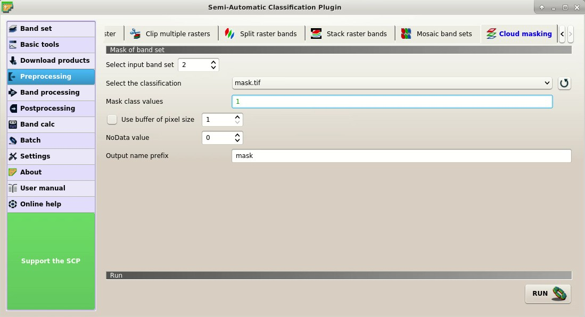
	
	:guilabel:`Mask clouds`
	

.. _tutorial_2_mosaic:

Mosaic the Sentinel-2 images
------------------------------------------------------

We are going to mosaic the 2017 images in order to create a cloud free image to be used for land cover change.

We use the image acquired on 2017-01-01 to fill the gaps in the 2017-02-10 image.
In the tab :ref:`band_set_tab`, add a new :guilabel:`Band set` with the button |add_bandset| and add the masked bands.

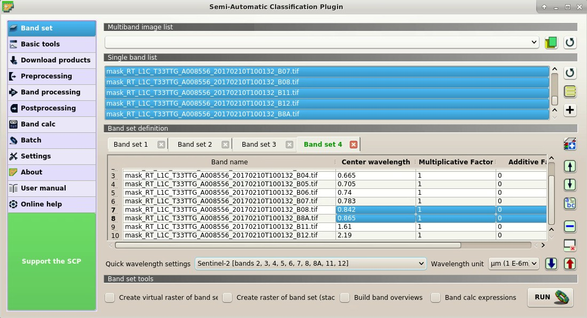
	
	:guilabel:`New Band set`
	
Now we can mosaic the 2017 images.

In the tab :ref:`mosaic_of_bandsets`, in the :guilabel:`Band set list` enter the number of the 2017-02-10 masked :guilabel:`Band set`, followed by comma, followed by the number of the 2017-01-01 :guilabel:`Band set`.
Now click the button :guilabel:`RUN` |run| to select the output directory and start the masking process.
	
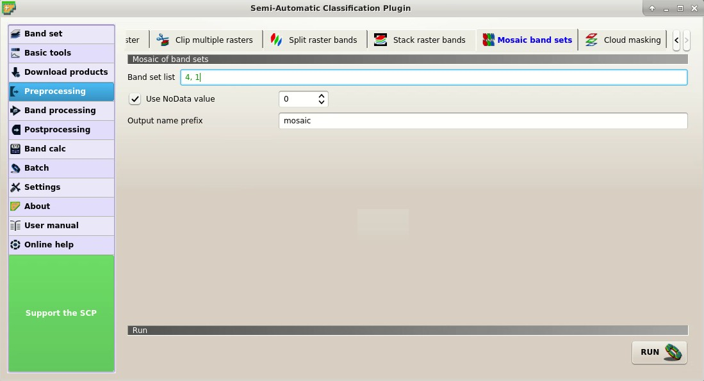
	
	:guilabel:`Mosaic Band sets`
	
We could have used more than 2 :guilabel:`Band sets`.
The process automatically mosaic the corresponding bands of the input :guilabel:`Band sets` filling the NoData gaps of the first :guilabel:`Band set` with the pixels of the following :guilabel:`Band sets`.
The mosaic bands are automatically added to the map.

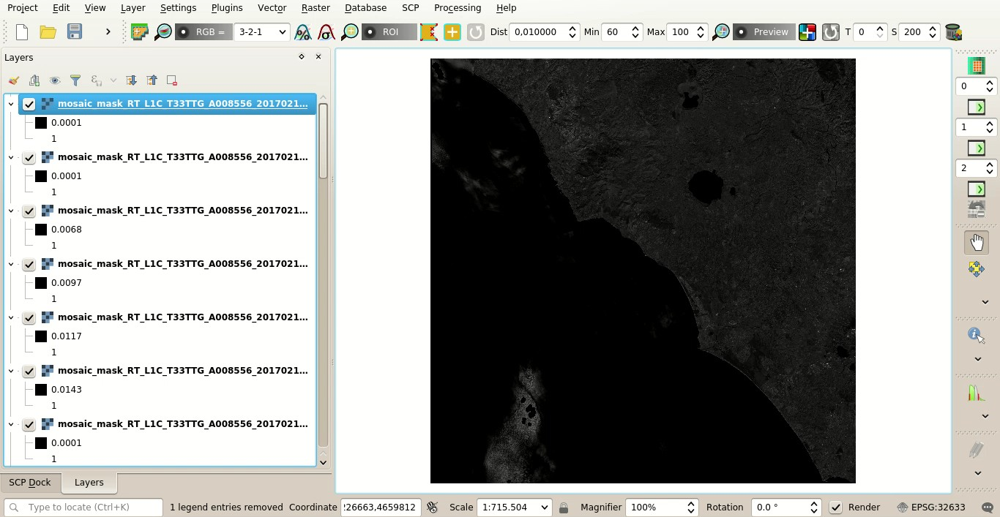
	
	:guilabel:`Mosaic of 2017 images`
	
.. _tutorial_2_land_cover_change:

Land cover change
----------------------------------------------------------

We are going to automatically locate the land cover change between the image mosaic of 2017 and the 2018 image.

:guilabel:`SCP` includes a tool that allows for calculating the spectral distance between every corresponding pixel of two :guilabel:`Band sets`, and creating a raster of changes through a spectral distance threshold.

In the tab :ref:`band_set_tab`, add a new :guilabel:`Band set` with the button |add_bandset| and add the mosaic bands.

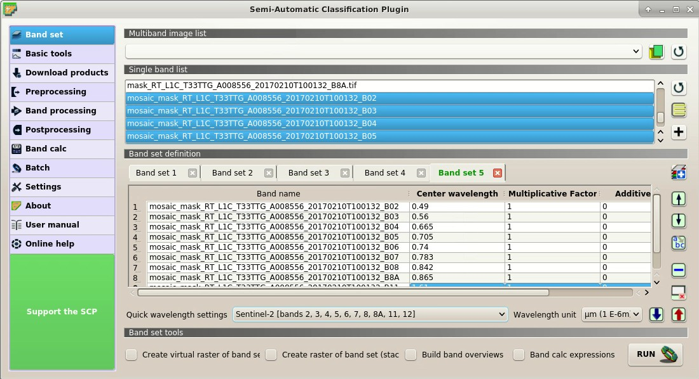
	
	:guilabel:`New Band set`
	
In the tab :ref:`spectral_distance_tab`, set the number of the 2017 mosaic :guilabel:`Band set` in :guilabel:`Select first input band set`, and set the number of the 2018 :guilabel:`Band set` in :guilabel:`Select second input band set`.
In :guilabel:`Distance algorithm` check the |radiobutton| :guilabel:`Spectral Angle Mapping`.
Check the |checkbox| :guilabel:`Distance threshold` and set the value 10 that is the threshold used for creating the raster of changes.

Now click the button :guilabel:`RUN` |run| to select the output directory and start the masking process.

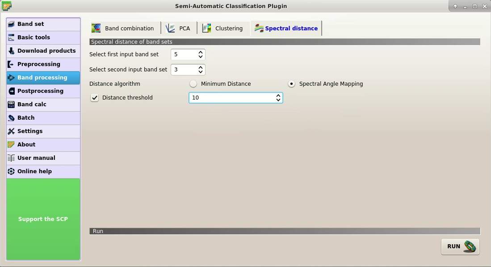
	
	:guilabel:`Spectral distance`
	
After a while, the spectral distance raster and the raster of changes are added to the map
	
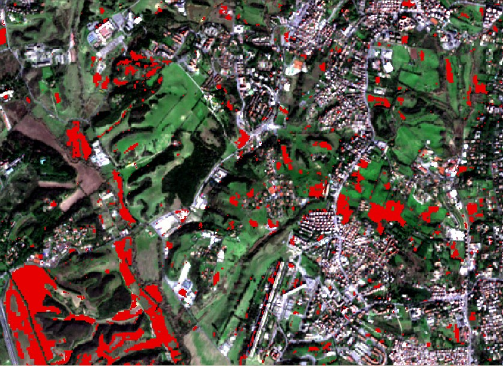
	
	:guilabel:`Raster of changes`
	
This is an automatic method for locating land cover changes.
We can see that most land cover changes are due to crop variations.

For instance, this method could be useful to assess vegetation burnt area or forest logging.
We could set a different threshold value for increasing or reducing the number of pixels identified as changes.

Of course, in order to identify the type of land cover change we should identify the land cover classes of the images through photo-interpretation or with semi-automatic classification.

