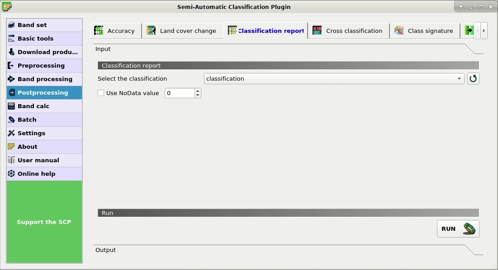
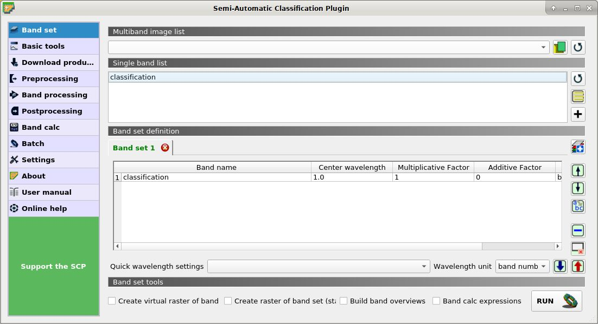
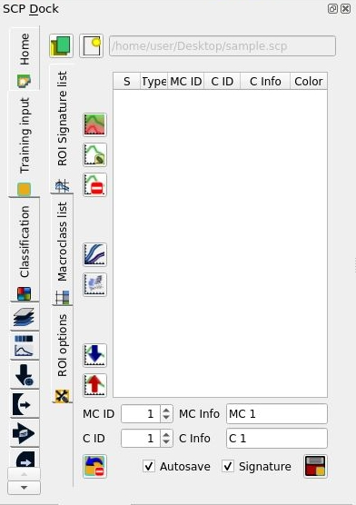
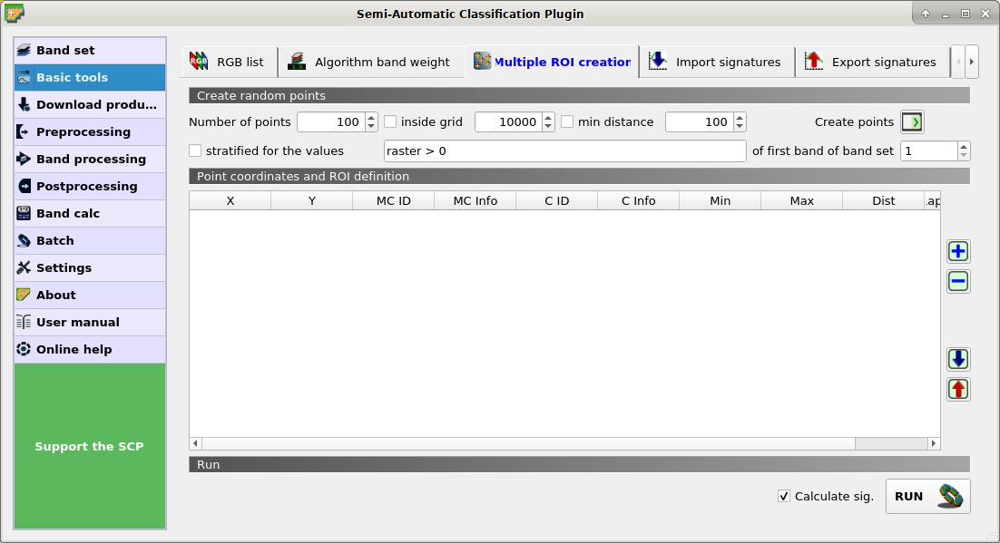
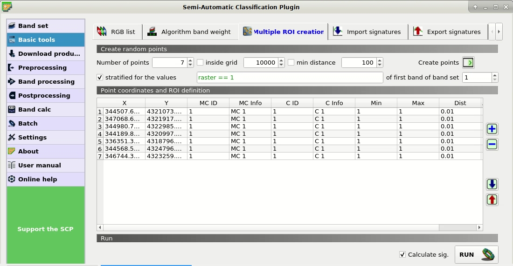
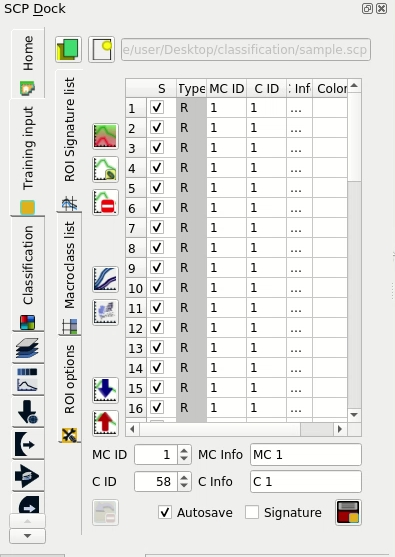
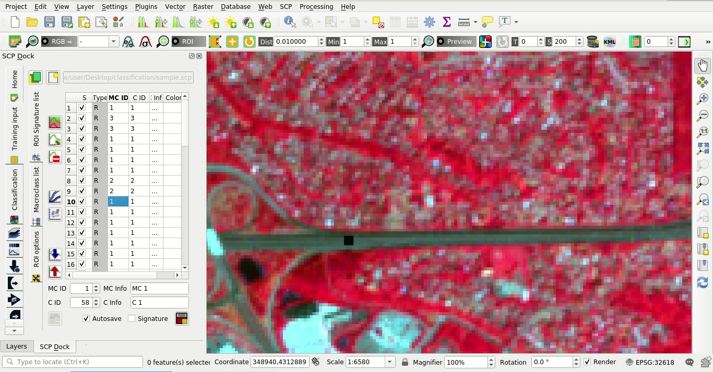
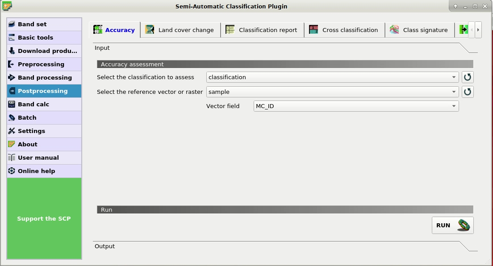
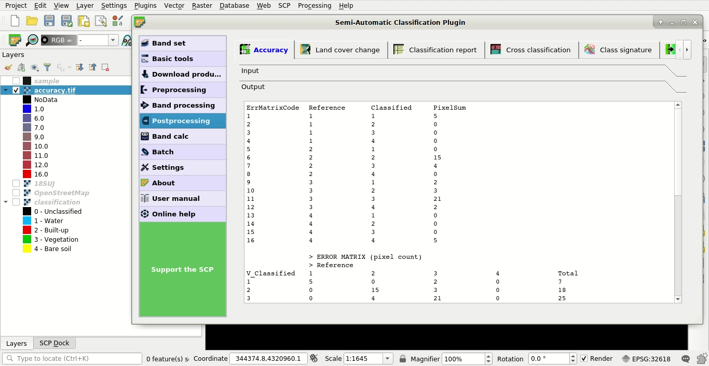

.. _advanced_tutorial_3:

***************************************************************
Tutorial 3
***************************************************************

.. |br| raw:: html

  

.. |add| image:: _static/semiautomaticclassificationplugin_add.png
	:width: 20pt
	
.. |checkbox| image:: _static/checkbox.png
	:width: 18pt
	
.. |pointer| image:: _static/semiautomaticclassificationplugin_pointer_tool.png
	:width: 20pt
	
.. |radiobutton| image:: _static/radiobutton.png
	:width: 18pt
	
.. |reload| image:: _static/semiautomaticclassificationplugin_reload.png
	:width: 20pt
	
.. |reset| image:: _static/semiautomaticclassificationplugin_reset.png
	:width: 20pt
	
.. |remove| image:: _static/semiautomaticclassificationplugin_remove.png
	:width: 20pt
	
.. |run| image:: _static/semiautomaticclassificationplugin_run.png
	:width: 24pt
	
.. |input_list| image:: _static/input_list.jpg
	:width: 20pt
	
.. |open_file| image:: _static/semiautomaticclassificationplugin_open_file.png
	:width: 20pt
	
.. |new_file| image:: _static/semiautomaticclassificationplugin_new_file.png
	:width: 20pt
	
.. |open_dir| image:: _static/semiautomaticclassificationplugin_open_dir.png
	:width: 20pt
	
.. |select_all| image:: _static/semiautomaticclassificationplugin_select_all.png
	:width: 20pt
	
.. |add_bandset| image:: _static/semiautomaticclassificationplugin_add_bandset_tool.png
	:width: 20pt
	
.. |move_up| image:: _static/semiautomaticclassificationplugin_move_up.png
	:width: 20pt
	
.. |move_down| image:: _static/semiautomaticclassificationplugin_move_down.png
	:width: 20pt
	
.. |search_images| image:: _static/semiautomaticclassificationplugin_search_images.png
	:width: 20pt

.. |image_preview| image:: _static/semiautomaticclassificationplugin_download_image_preview.png
	:width: 20pt

.. |import| image:: _static/semiautomaticclassificationplugin_import.png
	:width: 20pt
	
.. |export| image:: _static/semiautomaticclassificationplugin_export.png
	:width: 20pt

.. |plus| image:: _static/semiautomaticclassificationplugin_plus.png
	:width: 20pt

.. |order_by_name| image:: _static/semiautomaticclassificationplugin_order_by_name.png
	:width: 20pt

.. |image_overview| image:: _static/semiautomaticclassificationplugin_download_image_overview.png
	:width: 20pt
	
.. |enter| image:: _static/semiautomaticclassificationplugin_enter.png
	:width: 20pt

.. |download| image:: _static/semiautomaticclassificationplugin_download_arrow.png
	:width: 20pt
	
.. |landsat_download| image:: _static/semiautomaticclassificationplugin_landsat8_download_tool.png
	:width: 20pt

.. |sentinel_download| image:: _static/semiautomaticclassificationplugin_sentinel_download_tool.png
	:width: 20pt
	
.. |osm_add| image:: _static/semiautomaticclassificationplugin_osm_add.png
	:width: 20pt
	
.. |tools| image:: _static/semiautomaticclassificationplugin_roi_tool.png
	:width: 20pt
	
.. |roi_multiple| image:: _static/semiautomaticclassificationplugin_roi_multiple.png
	:width: 20pt

.. |import_spectral_library| image:: _static/semiautomaticclassificationplugin_import_spectral_library.png
	:width: 20pt
	
.. |export_spectral_library| image:: _static/semiautomaticclassificationplugin_export_spectral_library.png
	:width: 20pt
	
.. |weight_tool| image:: _static/semiautomaticclassificationplugin_weight_tool.png
	:width: 20pt
	
.. |threshold_tool| image:: _static/semiautomaticclassificationplugin_threshold_tool.png
	:width: 20pt
	
.. |LCS_threshold| image:: _static/semiautomaticclassificationplugin_LCS_threshold_tool.png
	:width: 20pt
	
.. |LCS_threshold_set_tool| image:: _static/semiautomaticclassificationplugin_LCS_threshold_set_tool.png
	:width: 20pt
	
.. |preprocessing| image:: _static/semiautomaticclassificationplugin_class_tool.png
	:width: 20pt
	
.. |landsat_tool| image:: _static/semiautomaticclassificationplugin_landsat8_tool.png
	:width: 20pt
	
.. |sentinel2_tool| image:: _static/semiautomaticclassificationplugin_sentinel_tool.png
	:width: 20pt
	
.. |aster_tool| image:: _static/semiautomaticclassificationplugin_aster_tool.png
	:width: 20pt
	
.. |split_raster| image:: _static/semiautomaticclassificationplugin_split_raster.png
	:width: 20pt
	
.. |clip_tool| image:: _static/semiautomaticclassificationplugin_clip_tool.png
	:width: 20pt
	
.. |pca_tool| image:: _static/semiautomaticclassificationplugin_pca_tool.png
	:width: 20pt
	
.. |vector_to_raster_tool| image:: _static/semiautomaticclassificationplugin_vector_to_raster_tool.png
	:width: 20pt
	
.. |post_process| image:: _static/semiautomaticclassificationplugin_post_process.png
	:width: 20pt
	
.. |accuracy_tool| image:: _static/semiautomaticclassificationplugin_accuracy_tool.png
	:width: 20pt
	
.. |land_cover_change| image:: _static/semiautomaticclassificationplugin_land_cover_change.png
	:width: 20pt
	
.. |report_tool| image:: _static/semiautomaticclassificationplugin_report_tool.png
	:width: 20pt

.. |class_to_vector_tool| image:: _static/semiautomaticclassificationplugin_class_to_vector_tool.png
	:width: 20pt

.. |reclassification_tool| image:: _static/semiautomaticclassificationplugin_reclassification_tool.png
	:width: 20pt

.. |edit_raster| image:: _static/semiautomaticclassificationplugin_edit_raster.png
	:width: 20pt

.. |undo_edit_raster| image:: _static/semiautomaticclassificationplugin_undo_edit_raster.png
	:width: 20pt

.. |classification_sieve| image:: _static/semiautomaticclassificationplugin_classification_sieve.png
	:width: 20pt

.. |classification_erosion| image:: _static/semiautomaticclassificationplugin_classification_erosion.png
	:width: 20pt

.. |classification_dilation| image:: _static/semiautomaticclassificationplugin_classification_dilation.png
	:width: 20pt

.. |bandcalc_tool| image:: _static/semiautomaticclassificationplugin_bandcalc_tool.png
	:width: 20pt
	
.. |batch_tool| image:: _static/semiautomaticclassificationplugin_batch.png
	:width: 20pt

.. |bandset_tool| image:: _static/semiautomaticclassificationplugin_bandset_tool.png
	:width: 20pt
	
.. |settings_tool| image:: _static/semiautomaticclassificationplugin_settings_tool.png
	:width: 20pt
	
.. |manual_ROI| image:: _static/semiautomaticclassificationplugin_manual_ROI.png
	:width: 20pt

.. |save_roi| image:: _static/semiautomaticclassificationplugin_save_roi.png
	:width: 20pt
	
.. |roi_single| image:: _static/semiautomaticclassificationplugin_roi_single.png
	:width: 20pt
	
.. |roi_redo| image:: _static/semiautomaticclassificationplugin_roi_redo.png
	:width: 20pt

.. |preview| image:: _static/semiautomaticclassificationplugin_preview.png
	:width: 20pt
	
.. |preview_redo| image:: _static/semiautomaticclassificationplugin_preview_redo.png
	:width: 20pt
	
.. |delete_signature| image:: _static/semiautomaticclassificationplugin_delete_signature.png
	:width: 20pt

.. |sign_plot| image:: _static/semiautomaticclassificationplugin_sign_tool.png
	:width: 20pt

.. |cumulative_stretch| image:: _static/semiautomaticclassificationplugin_bandset_cumulative_stretch_tool.png
	:width: 20pt

.. |std_dev_stretch| image:: _static/semiautomaticclassificationplugin_bandset_std_dev_stretch_tool.png
	:width: 20pt

.. |calculate_spectral_distances| image:: _static/semiautomaticclassificationplugin_calculate_spectral_distances.png
	:width: 20pt
	
.. |remove_temp| image:: _static/semiautomaticclassificationplugin_remove_temp.png
	:width: 20pt

The following is a tutorial about the functions of the Semi-Automatic Classification Plugin (:guilabel:`SCP`).
It is assumed that you have a basic knowledge of QGIS.

.. contents::
    :depth: 2
    :local:
	

.. _tutorial_3:
 
Tutorial 3: Accuracy Assessment of a Land Cover Classification
============================================================================

Accuracy assessment is a fundamental step after land cover classification in order to evaluate errors, globally and for each class, and finally evaluate the reliability of the map.

This post is a tutorial about accuracy assessment of a land cover classification using the Semi-Automatic Classification Plugin (SCP) for QGIS.
We are going to use the function of SCP to create ROIs using stratified random points (a new function of  SCP 6.4.0), which will be photo-interpreted and used as reference for the accuracy assessment. The SCP tool :ref:`accuracy_tab` will take care of the rest, providing the error matrix and the accuracy estimates.

The following is the video tutorial, and the following text illustrates the phases in detail.

.. raw:: html

	<iframe allowfullscreen="" frameborder="0" height="360" src="http://www.youtube.com/embed/H1cL0yhIygg?rel=0" width="100%"></iframe>

http://www.youtube.com/watch?v=H1cL0yhIygg

Accuracy assessment is performed comparing a sample of points (ground truth) to the classification.
There are several ways to choose the sample size and the allocation thereof (sample scheme). 
The sample should be designed in order to achieve low standard errors of accuracy estimates, and usually this is achieved by random selection of samples.

Sample design depends on several variables such as the proportions of land cover classes and the standard errors that we expect for the overall land cover classification and single classes.
In order to reduce standard errors of class specific estimates, it is recommended to stratify the sample.
For further details about how to determine the sample size and the stratification, please refer to "Olofsson, et al., 2014. Good practices for estimating area and assessing accuracy of land change. Remote Sensing of Environment, 148, 42 – 57".

.. _tutorial_3_sample_design:

Sample Design
-------------------------

This tutorial assumes that you have already performed the classification of a Landsat image following the instructions of this previous :ref:`tutorial_1`.
You can download the classification raster from `this archive <https://docs.google.com/uc?id=1o-D1PxzAK65DSbmVVCuU3IW6kFMWcf4X>`_ .

The land cover classes are described in the following table.   

	:guilabel:`Classes`
	
+-----------------------------+--------------------------+
| Macroclass name             | Class ID                 |
+=============================+==========================+
| Water                       |  1                       |
+-----------------------------+--------------------------+
| Built-up                    |  2                       |
+-----------------------------+--------------------------+
| Vegetation                  |  3                       |
+-----------------------------+--------------------------+
| Bare soil (low vegetation)  |  4                       |
+-----------------------------+--------------------------+

Basically, the main requirement is to provide an adequate number of samples for each class, even if the class area proportion (:math:`W_i`) is low.
The number of samples (:math:`N`) should be calculated as (Olofsson, et al., 2014):

.. math::
	N = ( \sum_{i=1}^{c} (W_i - S_i) / S_o)^2
	
where:

* :math:`W_i` = mapped area proportion of class i;
* :math:`S_i` = standard deviation of stratum i;
* :math:`S_o` = expected standard deviation of overall accuracy;
* :math:`c` = total number of classes;

This requires some conjectures about overall accuracy and user’s accuracy of each class.
We should base these conjectures on previous studies. 
One can hypothesize that user’s accuracy is lower and standard deviations :math:`S_i` is higher for classes having low area proportion, but of course these values should be carefully evaluated.

To get :math:`W_i` start QGIS and load the classification raster.

Open the :ref:`SCP_menu` and click the tab |report_tool| :ref:`classification_report_tab` under the submenu |tools| ``Postprocessing`` .
This tool allows for estimating class area and class percentage.

Click the button |reload| to refresh the layer list, and select the classification raster in :guilabel:`Select the classification` |input_list| ; next click :guilabel:`RUN` |run| to start the calculation; the output report is saved in a text file and displayed in the tab :guilabel:`Output`.
 

	
	:guilabel:`Classification report`
	

The report table contains the percentage of each class, which we divide by 100 to get the required :math:`W_i`.
In this tutorial we assume :math:`S_o = 0.01` and conjecture the :math:`S_i` values reported in the following table (of course, these assumptions are specific of this classification, other assumptions should be made for other classifications).

	:guilabel:`Conjectured standard deviations`
	
+-----------------------------+--------------------------+--------------------------+------------------------+------------------------+
| Land Cover Class            | Area :math:`m^2`         | :math:`W_i`              |  :math:`S_i`           |  :math:`W_i * S_i`     |
+=============================+==========================+==========================+========================+========================+
| 1                           |  976,500                 |  0.0033                  |  0.4                   |  0.0013                |
+-----------------------------+--------------------------+--------------------------+------------------------+------------------------+
| 2                           |  111,267,000             |  0.3713                  |  0.3                   |  0.1114                |
+-----------------------------+--------------------------+--------------------------+------------------------+------------------------+
| 3                           |  187,018,200             |  0.6240                  |  0.2                   |  0.1248                |
+-----------------------------+--------------------------+--------------------------+------------------------+------------------------+
| 4                           |  438,300                 |  0.0015                  |  0.5                   |  0.0007                |
+-----------------------------+--------------------------+--------------------------+------------------------+------------------------+
| Total                       |                          |                          |                        |  0.2382                |
+-----------------------------+--------------------------+--------------------------+------------------------+------------------------+

Therefore, :math:`N = (0.2382 / 0.01)^2 = 567` is the number of samples that we should distribute among classes.

To stratify the sample we should conjecture user’s accuracy and standard deviations of strata (Olofsson, et al., 2014).

A rough approximation is considering the mean value between equal distribution (:math:`N_i = N / c`) and weighted distribution (:math:`N_i =  N * W_i`), which is :math:`N_i = (N / c + N * W_i) / 2` as illustrated in the following table.

	:guilabel:`Sample stratification`
	
+-----------------------------+--------------------------+------------------------+------------------------+
| Land Cover Class            | Weighted                 |  Equal                 |  Mean                  |
+=============================+==========================+========================+========================+
| 1                           |  2                       |  142                   |  72                    |
+-----------------------------+--------------------------+------------------------+------------------------+
| 2                           |  210                     |  142                   |  176                   |
+-----------------------------+--------------------------+------------------------+------------------------+
| 3                           |  354                     |  142                   |  248                   |
+-----------------------------+--------------------------+------------------------+------------------------+
| 4                           |  1                       |  142                   |  71                    |
+-----------------------------+--------------------------+------------------------+------------------------+
| Total                       |                          |                        |  567                   |
+-----------------------------+--------------------------+------------------------+------------------------+

.. _tutorial_3_sample_collection:

Sample Collection and Photo-Intepretation
-------------------------------------------------------------------

This phase involves the creation of (randomly selected) single pixel :ref:`ROI_definition` (ROIs), and the attribution of a land cover class based on photo-interpretation of each ROI.

First, we need to define a :guilabel:`Band set` containing the classification raster that is an input required by the other tools we are going to use.

Open the tab :ref:`band_set_tab` clicking the button |bandset_tool| in the :ref:`SCP_menu` or the :ref:`SCP_dock`.
Click the button |reload| to refresh the layer list, and select the classification raster; then click |plus| to add selected raster to the :guilabel:`Band set 1`.

	
	:guilabel:`Band set definition`
	

We need to create the :ref:`training_input` in order to collect ROIs that will be the actual samples.

In the :ref:`SCP_dock` select the tab :ref:`training_input` and click the button |new_file| to create the :guilabel:`Training input` (define a name such as ``sample.scp``).
The path of the file is displayed and a vector is added to QGIS layers with the same name as the :guilabel:`Training input` (in order to prevent data loss, you should not edit this layer using QGIS functions).

	
	:guilabel:`Training input`
	
Now we are going to create the stratified random sample using the SCP tool Multiple ROI creation.
This tool allows for the random creation of point coordinates according to the sample scheme previously defined.

	**TIP** : In case you have already collected samples you can import (using the button |import|) a shapefile or a csv file containing the coordinates and the classification codes.

This tool works in two steps:

#. randomly select point coordinates defining ROI parameters;
#. actually create ROI polygons based on point coordinates;

During the first step, in addition to point coordinates, other fields are automatically filled in the table from the parameters set in the :ref:`working_toolbar`, such as the minimum and maximum ROI size.
In this tutorial we use single pixel ROIs, although cluster sampling (several pixels per ROI) is also used for accuracy assessment.
To avoid manually editing these fields after the random point creation, in :ref:`temporary_ROI` we need to set the parameters :guilabel:`Min` = 1 and :guilabel:`Max` = 1.
Created random samples will have the size of 1 pixel.

Now, open the :ref:`SCP_menu` and click the tab |roi_multiple| :ref:`multiple_rois_tab` under the submenu |tools| ``Basic tools`` .

	
	:guilabel:`Multiple ROI creation`
	

To reduce the photo-intepretation time (considering the illustrative purpose of this tutorial and that the classification is a subset of a Landsat image), we are going to divide the number of samples by 10 according to the following table (of course, in real cases we must use all the samples as designed).

	:guilabel:`Number of stratified samples`
	
+-----------------------------+-----------------------+
| Land Cover Class            | Samples               |
+=============================+=======================+
| 1                           | 7                     |
+-----------------------------+-----------------------+
| 2                           | 18                    |
+-----------------------------+-----------------------+
| 3                           | 25                    |
+-----------------------------+-----------------------+
| 4                           | 7                     |
+-----------------------------+-----------------------+
| Total                       | 57                    |
+-----------------------------+-----------------------+

In :guilabel:`Number of points` enter 7 that is the number of samples designed for class 1.
In the tab |roi_multiple| :ref:`multiple_rois_tab` check the option |checkbox| :guilabel:`stratified for the values` and enter the first expression ``raster == 1`` (notice the double "=").
This expression means that we are going to randomly select points that fall over pixels having value 1 of the classification (that is the first band of the Band set 1).

Therefore click :guilabel:`Create points` |enter| to start the random creation. 
After a while point coordinates will be added to the table :ref:`point_coordinates`.

	
	:guilabel:`Samples for class 1`
	

Now we repeat the above steps for class 2.
In :guilabel:`Number of points` enter 18 and in :guilabel:`stratified for the values` enter ``raster == 2``.
Click :guilabel:`Create points` |enter| and the samples will be added to the table.

Repeat the same steps for class 3 (25 points and ``raster == 3``) and for class 4 (57 points and ``raster == 4``).
Now that we have all the required samples we can create the ROIs (the single pixel polygons that will be photo-interpreted).

Uncheck the option |checkbox| :guilabel:`Calculate sig.` because we don't need the spectral signature of ROIs and click :guilabel:`RUN` |run|.
After a while the ROIs will be added to the the :guilabel:`Training input`.
	

	
	:guilabel:`Samples added to the training input`
	

The type ``R`` means that, of course, spectral signatures were not calculated.
All the created ROIs have the same MC ID (i.e. macroclass ID) and C ID (i.e. class ID); now we can assign the correct class (MC ID) to each ROI with photo-interpretation using images with resolution higher than the classification, or other services such as `OpenStreetMap <http://www.openstreetmap.org>`_).

In the :ref:`ROI_list`, double click on the first ROI in order to zoom to the ROI; after photo-interpreting the class we can assing the correct MC ID and C ID with a click on the corresponding field in the ROI list.

	
	:guilabel:`A sample over a road photo-interpreted using a Copernicus Sentinel-2 image`
	
Of course we need to perform the photo-interpretation of all the samples, assigning the correct code.
The photo-interpretation should be performed without considerding the classification raster.
It is worth highlighting that spatial resolution (i.e. 30m) implies mixed pixels (i.e. pixels made of multiple materials at ground); therefore, during the photo-interpretation we must consider the most prevalent land cover in the ROI area. 

	
.. _tutorial_3_accuracy_calculation:

Calculation of Accuracy Statistics
-------------------------------------------------------------------

After the photo-interpretation of all the samples, we can perform the accuracy assessment by comparing the ROIs to the classification.
If you have skipped the previous step, you can download the photo-interpreted sample from `here <https://docs.google.com/uc?id=1_8_QcUtgRIL2AtsUgtRkphTUO8PI03mw>`_ .

The process will produce an an error raster (a ``.tif`` file showing the errors in the map, where pixel values represent the combinations between the classification and reference identified by the ``ErrorMatrixCode`` in the error matrix) and a text file (i.e. a ``.csv`` file separated by tab) containing the error matrix and the accuracy statistics.

Open the :ref:`SCP_menu` and click the tab |accuracy_tool| :ref:`accuracy_tab` under the submenu |post_process| :guilabel:`Postprocessing` .

In :guilabel:`Select the classification to assess` |input_list| select the ``classification`` (click the button |reload| if the raster isn't in the list).

In :guilabel:`Select the reference vector or raster` |input_list| select the ``sample`` vector that is the :ref:`training_input`, and in :guilabel:`Vector field` |input_list| select ``MC_ID`` that is the vector field containing the class values.

Now we can click :guilabel:`RUN` |run| to start the raster processing.

	
	:guilabel:`The tool Accuracy`
	
After the calculation the accuracy statistics are displayed in the output interface and the error raster is loaded in QGIS.

	
	:guilabel:`Output`
	

Several statistics are calculated such as overall accuracy, user's accuracy, producer's accuracy, and Kappa hat.
In particular, these statistics are calculated according to the area based error matrix (Olofsson, et al., 2014) where each element represents the estimated area proportion of each class.
This allows for estimating the unbiased user's accuracy and producer's accuracy, the unbiased area of classes according to reference data, and the standard error of area estimates and the confidence intervals.
Of course the standard errors are influenced by the low number of samples that we have collected in this tutorial.

	:guilabel:`Area based error matrix`
	
+--------------------+-----------------------------+--------------------------+------------------------+------------------------+------------------------+
|                                                  | Reference                                                                                           |
+                                                  +--------------------------+------------------------+------------------------+------------------------+
|                                                  | 1                        |  2                     |  3                     |  4                     |
+====================+=============================+==========================+========================+========================+========================+
|                    | 1                           |  0.0023                  |  0                     |  0.0009                |  0                     |
+                    +-----------------------------+--------------------------+------------------------+------------------------+------------------------+
| Classified         | 2                           |  0                       |  0.3094                |  0.0619                |  0                     |
+                    +-----------------------------+--------------------------+------------------------+------------------------+------------------------+
|                    | 3                           |  0                       |  0.0998                |  0.5242                |  0                     |
+                    +-----------------------------+--------------------------+------------------------+------------------------+------------------------+
|                    | 4                           |  0                       |  0                     |  0.0004                |  0.0010                |
+--------------------+-----------------------------+--------------------------+------------------------+------------------------+------------------------+
|                    | Total                       |  0.0023                  | 0.4092                 |  0.5874                |  0.0010                |
+--------------------+-----------------------------+--------------------------+------------------------+------------------------+------------------------+

The overall accuracy is 83.7% that is a good result (above 80%). 
However, this classification was produced for the first basic tutorial, therefore the classification could be improved.
Also, note that we used a number of samples lower than designed sample.

The user's and producer's accuracy are provided for each class.

	:guilabel:`Producer's and user's accuracy`
	
+------------------------------+--------------------------+------------------------+------------------------+------------------------+
|                              | 1                        |  2                     |  3                     |  4                     |
+==============================+==========================+========================+========================+========================+
| Producer's accuracy          |  100.0                   | 75.6                   | 89.2                   |  100.0                 |
+------------------------------+--------------------------+------------------------+------------------------+------------------------+
| User's accuracy              |  71.4                    | 83.3                   | 84.0                   |  71.4                  |
+------------------------------+--------------------------+------------------------+------------------------+------------------------+

We can see that classes 1 and 4 (bare soil and water respectively) have low user's accuracy, while class 2 (built-up) has low producer's accuracy.
We also get the unbiased area estimates (in :math:`m^2`) and the confidence intervals.

	:guilabel:`Unbiased area estimates`
	
+------------------------------+--------------------------+------------------------+------------------------+------------------------+
|                              | 1                        |  2                     |  3                     |  4                     |
+==============================+==========================+========================+========================+========================+
| Area                         |  697,500                 | 122,645,412            | 176,044,017            |  313,071               |
+------------------------------+--------------------------+------------------------+------------------------+------------------------+
| 95% Confidence interval Area |  352,984                 | 33,778,661             | 33,780,877             |  158,436               |
+------------------------------+--------------------------+------------------------+------------------------+------------------------+

These estimates are quite different from the ones directly derived from the classification raster (in the classification report), but are based on reference data.
For instance, the class 2 (built-up) has an estimated area of 122,645,412 :math:`m^2`, while it resulted 111,267,000 :math:`m^2` from the classification raster.
Also, the confidence intervals provide information about the uncertainty of these estimates.
