.. _advanced_tutorial_4:

***************************************************************
Tutorial 4
***************************************************************

.. |br| raw:: html

  

.. |add| image:: _static/semiautomaticclassificationplugin_add.png
	:width: 20pt
	
.. |checkbox| image:: _static/checkbox.png
	:width: 18pt
	
.. |pointer| image:: _static/semiautomaticclassificationplugin_pointer_tool.png
	:width: 20pt
	
.. |radiobutton| image:: _static/radiobutton.png
	:width: 18pt
	
.. |reload| image:: _static/semiautomaticclassificationplugin_reload.png
	:width: 20pt
	
.. |reset| image:: _static/semiautomaticclassificationplugin_reset.png
	:width: 20pt
	
.. |remove| image:: _static/semiautomaticclassificationplugin_remove.png
	:width: 20pt
	
.. |run| image:: _static/semiautomaticclassificationplugin_run.png
	:width: 24pt
	
.. |input_list| image:: _static/input_list.jpg
	:width: 20pt
	
.. |open_file| image:: _static/semiautomaticclassificationplugin_open_file.png
	:width: 20pt
	
.. |new_file| image:: _static/semiautomaticclassificationplugin_new_file.png
	:width: 20pt
	
.. |open_dir| image:: _static/semiautomaticclassificationplugin_open_dir.png
	:width: 20pt
	
.. |select_all| image:: _static/semiautomaticclassificationplugin_select_all.png
	:width: 20pt
	
.. |add_bandset| image:: _static/semiautomaticclassificationplugin_add_bandset_tool.png
	:width: 20pt
	
.. |move_up| image:: _static/semiautomaticclassificationplugin_move_up.png
	:width: 20pt
	
.. |move_down| image:: _static/semiautomaticclassificationplugin_move_down.png
	:width: 20pt
	
.. |search_images| image:: _static/semiautomaticclassificationplugin_search_images.png
	:width: 20pt

.. |image_preview| image:: _static/semiautomaticclassificationplugin_download_image_preview.png
	:width: 20pt

.. |import| image:: _static/semiautomaticclassificationplugin_import.png
	:width: 20pt
	
.. |export| image:: _static/semiautomaticclassificationplugin_export.png
	:width: 20pt

.. |plus| image:: _static/semiautomaticclassificationplugin_plus.png
	:width: 20pt

.. |order_by_name| image:: _static/semiautomaticclassificationplugin_order_by_name.png
	:width: 20pt

.. |image_overview| image:: _static/semiautomaticclassificationplugin_download_image_overview.png
	:width: 20pt
	
.. |enter| image:: _static/semiautomaticclassificationplugin_enter.png
	:width: 20pt

.. |download| image:: _static/semiautomaticclassificationplugin_download_arrow.png
	:width: 20pt
	
.. |landsat_download| image:: _static/semiautomaticclassificationplugin_landsat8_download_tool.png
	:width: 20pt

.. |sentinel_download| image:: _static/semiautomaticclassificationplugin_sentinel_download_tool.png
	:width: 20pt
	
.. |osm_add| image:: _static/semiautomaticclassificationplugin_osm_add.png
	:width: 20pt
	
.. |tools| image:: _static/semiautomaticclassificationplugin_roi_tool.png
	:width: 20pt
	
.. |roi_multiple| image:: _static/semiautomaticclassificationplugin_roi_multiple.png
	:width: 20pt

.. |import_spectral_library| image:: _static/semiautomaticclassificationplugin_import_spectral_library.png
	:width: 20pt
	
.. |export_spectral_library| image:: _static/semiautomaticclassificationplugin_export_spectral_library.png
	:width: 20pt
	
.. |weight_tool| image:: _static/semiautomaticclassificationplugin_weight_tool.png
	:width: 20pt
	
.. |threshold_tool| image:: _static/semiautomaticclassificationplugin_threshold_tool.png
	:width: 20pt
	
.. |LCS_threshold| image:: _static/semiautomaticclassificationplugin_LCS_threshold_tool.png
	:width: 20pt
	
.. |LCS_threshold_set_tool| image:: _static/semiautomaticclassificationplugin_LCS_threshold_set_tool.png
	:width: 20pt
	
.. |preprocessing| image:: _static/semiautomaticclassificationplugin_class_tool.png
	:width: 20pt
	
.. |landsat_tool| image:: _static/semiautomaticclassificationplugin_landsat8_tool.png
	:width: 20pt
	
.. |sentinel2_tool| image:: _static/semiautomaticclassificationplugin_sentinel_tool.png
	:width: 20pt
	
.. |aster_tool| image:: _static/semiautomaticclassificationplugin_aster_tool.png
	:width: 20pt
	
.. |split_raster| image:: _static/semiautomaticclassificationplugin_split_raster.png
	:width: 20pt
	
.. |clip_tool| image:: _static/semiautomaticclassificationplugin_clip_tool.png
	:width: 20pt
	
.. |pca_tool| image:: _static/semiautomaticclassificationplugin_pca_tool.png
	:width: 20pt
	
.. |vector_to_raster_tool| image:: _static/semiautomaticclassificationplugin_vector_to_raster_tool.png
	:width: 20pt
	
.. |post_process| image:: _static/semiautomaticclassificationplugin_post_process.png
	:width: 20pt
	
.. |accuracy_tool| image:: _static/semiautomaticclassificationplugin_accuracy_tool.png
	:width: 20pt
	
.. |land_cover_change| image:: _static/semiautomaticclassificationplugin_land_cover_change.png
	:width: 20pt
	
.. |report_tool| image:: _static/semiautomaticclassificationplugin_report_tool.png
	:width: 20pt

.. |class_to_vector_tool| image:: _static/semiautomaticclassificationplugin_class_to_vector_tool.png
	:width: 20pt

.. |reclassification_tool| image:: _static/semiautomaticclassificationplugin_reclassification_tool.png
	:width: 20pt

.. |edit_raster| image:: _static/semiautomaticclassificationplugin_edit_raster.png
	:width: 20pt

.. |undo_edit_raster| image:: _static/semiautomaticclassificationplugin_undo_edit_raster.png
	:width: 20pt

.. |classification_sieve| image:: _static/semiautomaticclassificationplugin_classification_sieve.png
	:width: 20pt

.. |cross_classification| image:: _static/semiautomaticclassificationplugin_cross_classification.png
	:width: 20pt

.. |class_signature| image:: _static/semiautomaticclassificationplugin_class_signature_tool.png
	:width: 20pt

.. |classification_erosion| image:: _static/semiautomaticclassificationplugin_classification_erosion.png
	:width: 20pt

.. |classification_dilation| image:: _static/semiautomaticclassificationplugin_classification_dilation.png
	:width: 20pt

.. |bandcalc_tool| image:: _static/semiautomaticclassificationplugin_bandcalc_tool.png
	:width: 20pt
	
.. |batch_tool| image:: _static/semiautomaticclassificationplugin_batch.png
	:width: 20pt

.. |bandset_tool| image:: _static/semiautomaticclassificationplugin_bandset_tool.png
	:width: 20pt
	
.. |settings_tool| image:: _static/semiautomaticclassificationplugin_settings_tool.png
	:width: 20pt
	
.. |manual_ROI| image:: _static/semiautomaticclassificationplugin_manual_ROI.png
	:width: 20pt

.. |save_roi| image:: _static/semiautomaticclassificationplugin_save_roi.png
	:width: 20pt
	
.. |roi_single| image:: _static/semiautomaticclassificationplugin_roi_single.png
	:width: 20pt
	
.. |roi_redo| image:: _static/semiautomaticclassificationplugin_roi_redo.png
	:width: 20pt

.. |preview| image:: _static/semiautomaticclassificationplugin_preview.png
	:width: 20pt
	
.. |preview_redo| image:: _static/semiautomaticclassificationplugin_preview_redo.png
	:width: 20pt
	
.. |delete_signature| image:: _static/semiautomaticclassificationplugin_delete_signature.png
	:width: 20pt

.. |sign_plot| image:: _static/semiautomaticclassificationplugin_sign_tool.png
	:width: 20pt

.. |cumulative_stretch| image:: _static/semiautomaticclassificationplugin_bandset_cumulative_stretch_tool.png
	:width: 20pt

.. |std_dev_stretch| image:: _static/semiautomaticclassificationplugin_bandset_std_dev_stretch_tool.png
	:width: 20pt

.. |calculate_spectral_distances| image:: _static/semiautomaticclassificationplugin_calculate_spectral_distances.png
	:width: 20pt
	
.. |remove_temp| image:: _static/semiautomaticclassificationplugin_remove_temp.png
	:width: 20pt

The following is a tutorial about the functions of the Semi-Automatic Classification Plugin (:guilabel:`SCP`).
It is assumed that you have a basic knowledge of QGIS.

.. contents::
    :depth: 2
    :local:
	

.. _tutorial_4:
 
Tutorial 4: Postprocessing tools for assessing land cover change
============================================================================

This tutorial aims to analyze land cover change using SCP Postprocessing tools.
Basically, we are going to assess land cover change from two raster classifications, and relate the changes to a land use vector file.
An overview of several postprocessing tools is also provided.

The following is the video tutorial, and the following text illustrates the phases in detail.

.. raw:: html

	<iframe allowfullscreen="" frameborder="0" height="360" src="http://www.youtube.com/embed/0IUosyr4pRw?rel=0" width="100%"></iframe>

http://www.youtube.com/watch?v=0IUosyr4pRw

The tools can be applied to any land cover classification, but we are going to use `Copernicus data <https://land.copernicus.eu/>`_, which are freely available (as established by the EU Regulation No 1159/2013 of 12 July 2013) and cover the European countries.
Of course, this tutorial is designed for demonstration purposes and it is not endorsed by the European Union.
The original Copernicus data (produced with funding by the European Union) are downloaded from https://land.copernicus.eu/ and remain the sole property of the European Union.

Following, a brief description of the data we are going to use.

The `Copernicus High Resolution Layers <https://land.copernicus.eu/pan-european/high-resolution-layers>`_ are raster classifications with 20m spatial resolution.
Several land cover classes are available, but in this tutorial we are going to use the Imperviousness Density for 2012 and 2015.
These data classify the degree of imperviousness (0-100% of impermeable cover of soil), which is the artificially sealed area.
The Imperviousness Density was produced using automatic derivation based on calibrated Normalized Difference Vegetation Index.
You can find the detailed product specifications `here <https://land.copernicus.eu/pan-european/high-resolution-layers/imperviousness>`_.

The `Copernicus Corine Land Cover <https://land.copernicus.eu/pan-european/corine-land-cover>`_ is a land use/land cover vector produced by standard methodology of photo-interpretation of satellite images.
The vector is classified in 44 classes divided in 3 hierarchical levels with minimum mapping unit of 25 hectares.
In this tutorial we are considering only the first level of Corine Land Cover 2012, divided in these classes:

1. artificial surfaces
2. agricultural areas
3. forests and semi-natural areas
4. wetlands
5. water bodies 

.. _tutorial_4_refine_classification:

Refine the classifications with direct editing
--------------------------------------------------

You can download the data for this tutorial from `this archive <https://docs.google.com/uc?id=1O6J113vWplOff35o_dz64P287xKYamBN>`_ , or use your own data (two classification rasters and a land use vector).

For this tutorial, the original Copernicus data were modified by clipping the rasters to a small area over Florence (Italy). 

Start QGIS and load the two rasters ``IMD_2012.tif`` and ``IMD_2015.tif`` that are Copernicus Imperviousness Density for 2012 and 2015 respectively.
As you can see, the rasters have values from 0 to 100, representing the degree of imperviousness.

It is useful to refine the classification by photo-interpretation, especially for data produced by semi-automatic processing.

We can use high resolution images or other services such as `OpenStreetMap <http://www.openstreetmap.org>`_.
For example you can follow this tutorial :ref:`tutorial_1_data_download` to download satellite images, or you can download a subset of a Landsat 8 image, already converted to reflectance, from `this link <https://docs.google.com/uc?id=10SRrNbiy-f2uaX3e7jHdw4dI8sG9bIE4>`_ (about 27 MB, data available from the U.S. Geological Survey), unzip the downloaded file, and load the bands in QGIS. 

First, we need to define a :guilabel:`Band set` containing a classification raster (this is required for drawing ROIs).

Open the tab :ref:`band_set_tab` clicking the button |bandset_tool| in the :ref:`SCP_menu` or the :ref:`SCP_dock`.
Click the button |reload| to refresh the layer list, and select the ``IMD_2012`` raster (just this raster is sufficient); then click |plus| to add selected raster to the :guilabel:`Band set 1`.

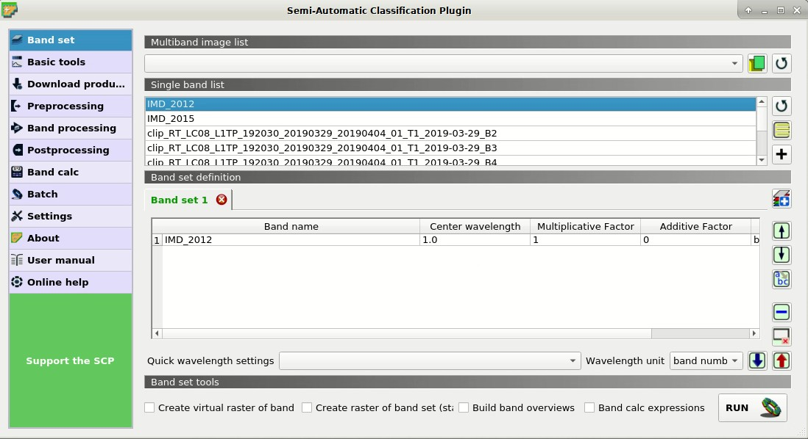
	
	:guilabel:`Band set definition`
	
Optionally, we can create a band set for the satellite image to display a color composite; open the tab :ref:`band_set_tab` and select all the Landsat bands in the list; click |add_bandset| to add a new band set, then click |plus| to add selected rasters to the :guilabel:`Band set 2`.

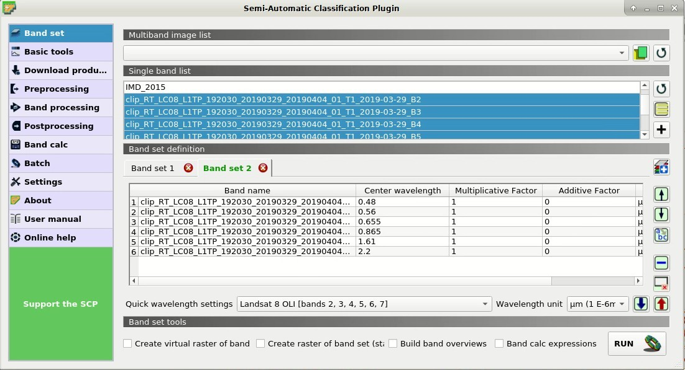
	
	:guilabel:`Band set of the Landsat image`
	
In QGIS zoom to an area where we want to correct the classification.
In this case we are going to manually remove a few pixels pretending they are classification errors.

We need to manually create a ROI, but first check that the :guilabel:`Band set 1` is active.
Now click the button |manual_ROI| in the :ref:`working_toolbar`.
Left click on the map to define the ROI vertices and right click to define the last vertex closing the polygon.
An orange semi-transparent polygon is displayed over the image, which is a temporary polygon (in this case we don't need to define the :guilabel:`Training input`).

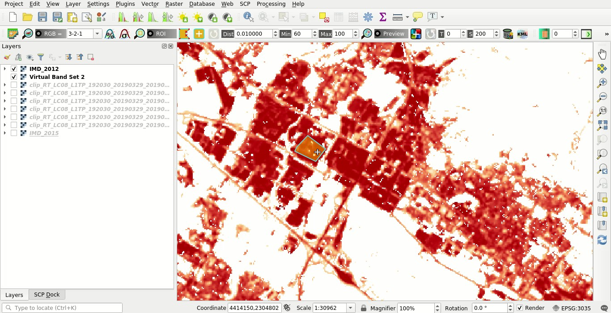
	
	:guilabel:`Manual ROI polygon`
	
Now open the tool |edit_raster| :ref:`edit_raster_tab` opening the :ref:`SCP_menu` and the submenu |tools| ``Postprocessing`` .
Select the :guilabel:`Input raster`, for instance ``IMD_2012``.
According to the legend of Imperviousness Density, in |checkbox| :guilabel:`Use constant value` enter 100 (we want to correct impervious pixels; in case we would like to correct not impervious pixels we would enter the value 0). 
The other options are fine.
Therefore, click :guilabel:`RUN` |run| to edit the raster.

	**Attention**: the input raster is directly edited; it is recommended to create a **backup copy** of the input raster before using this tool in order to prevent data loss.

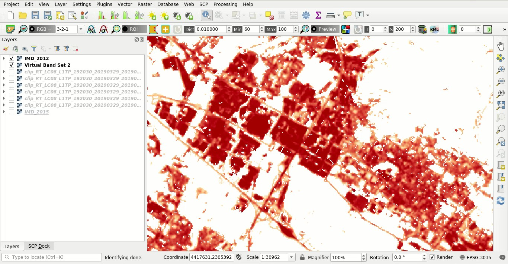
	
	:guilabel:`The raster modified`
	
Of course we could repeat these steps to edit any area of the raster.

	**TIP** : Sometimes changes are not immediately visibile because the raster is not refreshed; try to zoom out and zoom in to refresh the view.

.. _tutorial_4_classification_report:

Classification report
-------------------------------------------------------------------

It could be interesting to know the area of each land cover class.
In order to get the area statistics, open the :ref:`SCP_menu` and click the tab |report_tool| :ref:`classification_report_tab` under the submenu |tools| ``Postprocessing`` .

Click the button |reload| to refresh the layer list, and select the ``IMD_2012`` raster in :guilabel:`Select the classification` |input_list| ; next click :guilabel:`RUN` |run| to start the calculation; the output report is saved in a text file and displayed in the tab :guilabel:`Output`.

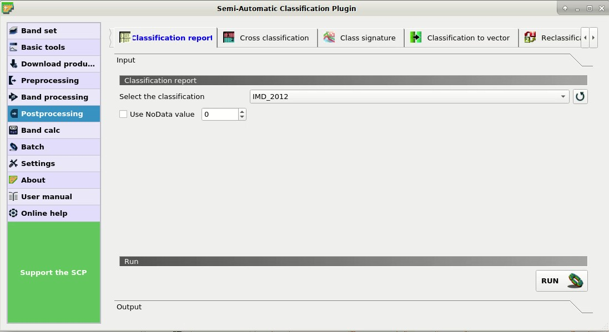
	
	:guilabel:`Report tool`

We can repeat the same steps for the ``IMD_2015`` raster.
Over the 86% of the area is not impervious.

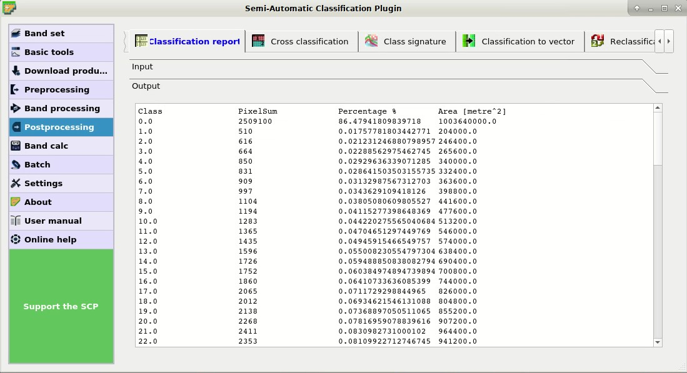
	
	:guilabel:`The classification report`

.. _tutorial_4_reclassification:

Reclassification
-------------------------------------------------------------------

Before calculating land cover change it is convenient to reclassify the imperviousness degree into two classes: built-up and not built-up.
A possible threshold for the distinction between built-up and not built-up is 30% (for further information read `this document <https://land.copernicus.eu/user-corner/technical-library/hrl-imperviousness-technical-document-prod-2015>`_ ).
We can reclassify the raster using the SCP tool, obtaining the simple classification 1 = built-up and 0 = not built-up.

Open the tool |reclassification_tool| :ref:`reclassification_tab`.
In :guilabel:`Select the classification` select the raster ``IMD_2012``.
Click the button |add| twice to add two rows to the table.
We need to enter the expressions illustrated in the following table.
	
	:guilabel:`Reclassification table`
	
+-----------------------------+--------------------------+
| Old value                   | New value                |
+=============================+==========================+
| raster < 30                 |  0                       |
+-----------------------------+--------------------------+
| raster >= 30                |  1                       |
+-----------------------------+--------------------------+

Uncheck the options |checkbox| :guilabel:`Use code from Signature list` and click :guilabel:`RUN` |run| to start the reclassification.
A new raster will be created (e.g. ``BU_2012``).

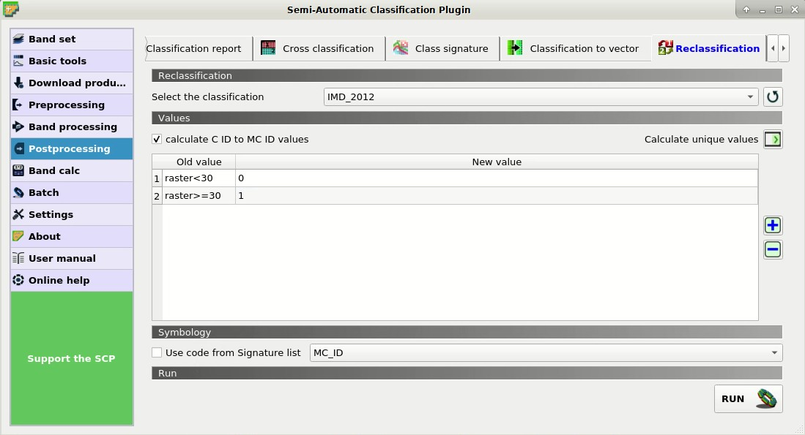
	
	:guilabel:`Reclassification tool`
	
Now select the ``IMD_2015`` (the reclassification table is the same as before) and click :guilabel:`RUN` |run| to reclassify the 2015 raster (e.g. ``BU_2015``).
Now the two reclassified rasters are loaded in the map and we can assing an appropriate symbology.

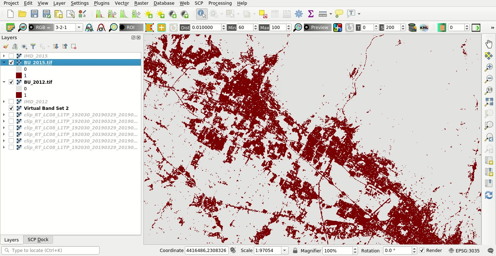
	
	:guilabel:`Reclassified rasters`
	

.. _tutorial_4_remove_isolated_pixels:

Remove isolated pixels
-------------------------------------------------------------------

We are going to compute the land cover change, but first we may want to remove isolated pixels in order to improve the analysis.
In fact, single pixels may not represent real changes between the two classifications, because of geometrical shifts or isolated classification errors.
Of course, this step is not always required, and it should be avoided if the purpose of the analysis is to find also the smallest changes.

We are going to use classification sieve for removing single pixels.
Open the tool |classification_sieve| :ref:`classification_sieve_tab`.

In :guilabel:`Size threshold` leave 2; all patches smaller the the selected number of pixels (i.e. single pixels) will be replaced by the value of the largest neighbour patch.
Of course we could increase this value if we want to remove larger patches.

In :guilabel:`Select the classification` select the raster ``BU_2012``.
The option :guilabel:`4` in :guilabel:`Pixel connection` determines how pixels are considered connected, that is in a 3x3 window diagonal pixels are not considered connected.
If we select the option :guilabel:`8` also diagonal pixels are considered connected.

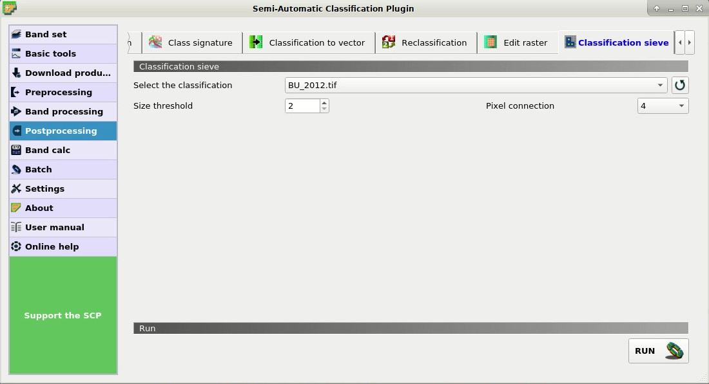
	
	:guilabel:`Tool classification sieve`
	
Now click :guilabel:`RUN` |run| to create the new raster ``BU_2012_sieve``.

Of course, we should repeat these steps also for raster ``BU_2015`` to create the new raster ``BU_2015_sieve``.

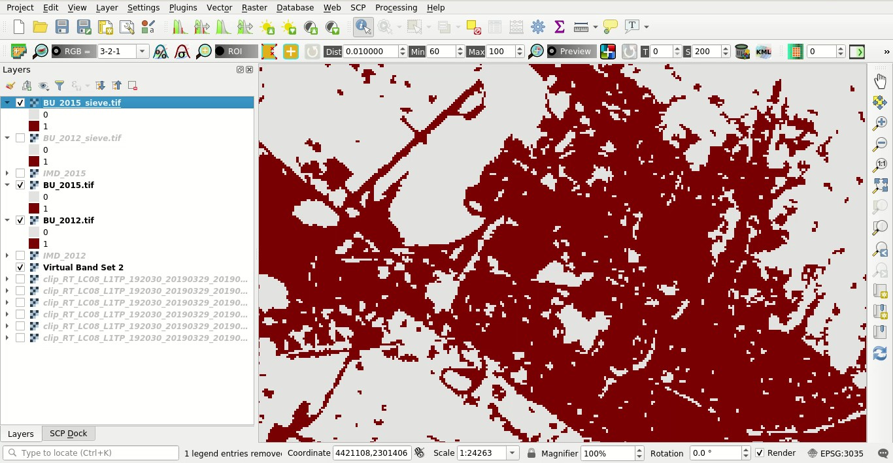
	
	:guilabel:`The rasters after removing isolated pixels`

.. _tutorial_4_land_cover_change:

Assess land cover change
-------------------------------------------------------------------

Now we can use the tool to assess land cover change between the two classifications 2012 and 2015.
Open the tool |land_cover_change| :ref:`land_cover_change_tab`.

This tool is quite straightforward.
Click the button |reload| to refresh the layer list.
In :guilabel:`Select the reference classification` select the ``BU_2012_sieve`` raster, that is the first classification.
In :guilabel:`Select the new classification` select the ``BU_2015_sieve`` raster, that is the latest classification.

Uncheck the option |checkbox| :guilabel:`Report unchanged pixels`, because we want to report only the pixels where the classification changed between 2012 and 2015.
Now click :guilabel:`RUN` |run| to create the new land cover change raster (e.g. ``change``).
Also, a text file is created (i.e. a file .csv separated by tab) containing the land cover change statistics.

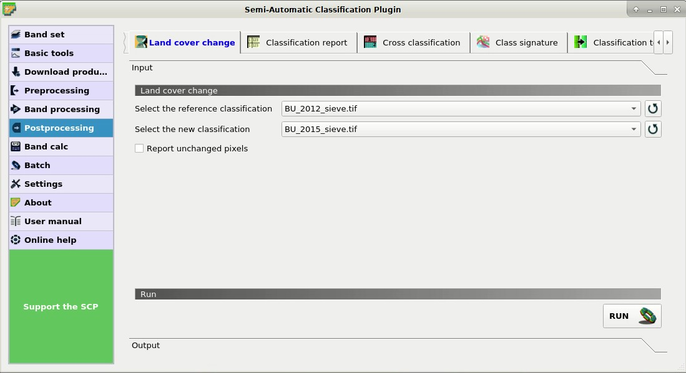
	
	:guilabel:`Land cover change tool`

The values of the land cover change raster represent a combination between reference and new classification, as described in the text file.
In this case, only the value 1 is present that is the condition where ``BU_2012_sieve`` = 0 and ``BU_2015_sieve`` = 1.

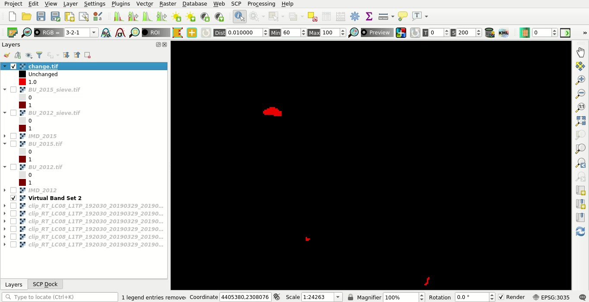
	
	:guilabel:`Land cover change raster`
	
From the report we ca read that 520 pixels changed from 0 to 1, while no pixel changed from 1 to 0 between years 2012 and 2015.

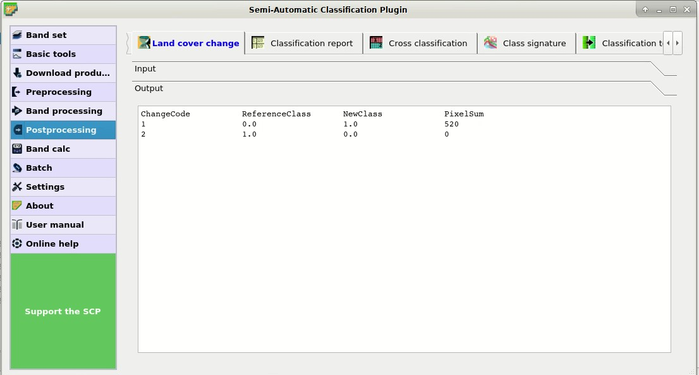
	
	:guilabel:`Land cover change report`
	
.. _tutorial_4_analyze_land_cover_change:

Analyze the context of land cover changes
-------------------------------------------------------------------

Now, it could be interesting to compare land cover change to other data such as land use, in order to analyze the context of new built-up areas.
We are going to cross the land cover changes to the vector of Corine Land Cover; this way we can differentiate the new built-up areas according to Corine Land Cover classification system.

The original Corine Land Cover data were modified by clipping to a small area over Florence (Italy) and adding a field ``Class_1`` filled with the first level of classification.

Load in QGIS the Copernicus Corine Land Cover shapefile ``CLC_2012.shp`` previously downloaded. 
You can see the symbology of the first level Corine Land Cover classes that are:

1. artificial surfaces
2. agricultural areas
3. forests and semi-natural areas
4. wetlands
5. water bodies 

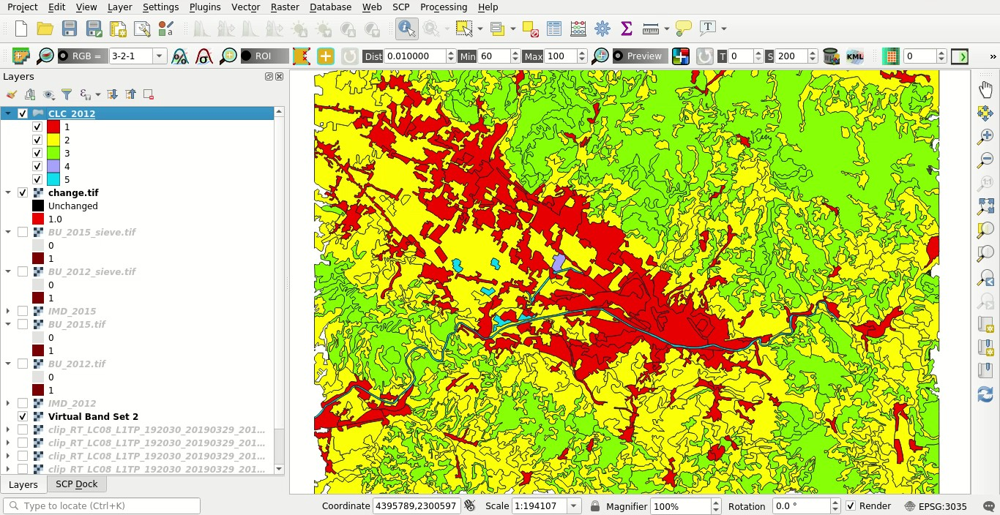
	
	:guilabel:`A subset of Corine Land Cover`

Open the tool |cross_classification| :ref:`cross_classification_tab`.
Click the button |reload| to refresh the layer list.
In :guilabel:`Select the classification` select the ``change`` raster, that is our land cover change.
Check |checkbox| :guilabel:`Use NoData value` and set the value 0, in order to exclude unchanged pixels (having value 0 in the ``change`` raster) from the analysis.

In :guilabel:`Select the reference vector or raster` select the vector ``CLC_2012`` and in :guilabel:`Vector field` select the field ``Class_1``, containing the code of first level classes.

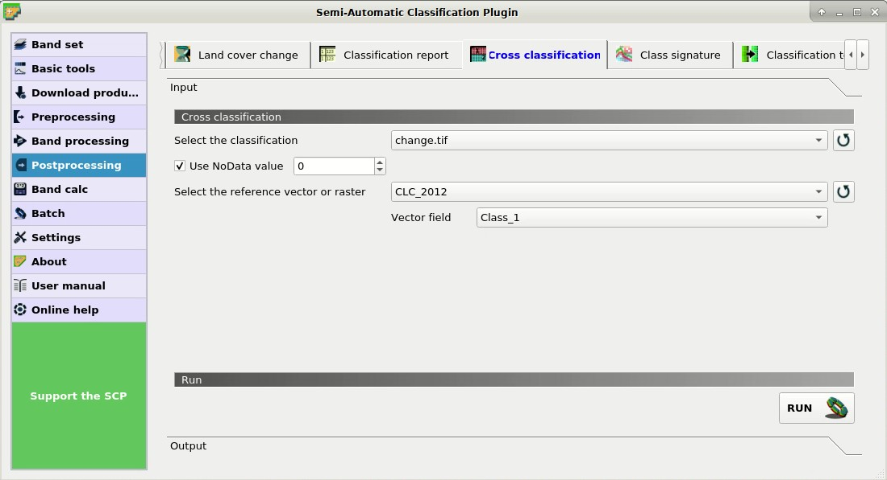
	
	:guilabel:`Cross classification tool`
	
Now click :guilabel:`RUN` |run| to create a new raster of comparison (e.g. ``change_CLC``).
The output will report the area of each combination between ``change`` code and ``CLC_2012`` code.
	
From the cross matrix we can evaluate the area in :math:`m^2` of built-up changes occurrend in the 5 classes of Corine Land Cover classification.
	
	:guilabel:`Cross matrix`
	
+--------+------------------+--------------------------+-------------------+------------------+------------------+---------------+
|                           |    CLC_2012                                                                                        |
+                           +--------------------------+-------------------+------------------+------------------+---------------+
|                           | 1                        |  2                |  3               |  4               |  5            |
+========+==================+==========================+===================+==================+==================+===============+
| Change | 1                |  157600                  | 48400             |  2000            |  0               |  0            |
+--------+------------------+--------------------------+-------------------+------------------+------------------+---------------+

The tool :ref:`cross_classification_tab` can be very useful also for other analyses that involve the comparison with other data, such as population or flood risk, but this could be the subject of other tutorials.

.. _tutorial_4_assess_spectral_signature:

Assess the spectral signature of changes
-------------------------------------------------------------------

An optional step could be the assessment of the spectral signature of changes.
We can download satellite images (see :ref:`tutorial_1` for the details) and calculate spectral signatures for monitoring the changes through time.

We are going to use the Landsat 8 image downloaded at the beginning of this tutorial for calculating the spectral signature of changes.	
First, we need to create a :guilabel:`Training input` to store the spectral signatures calculated from the classes.
In the :ref:`SCP_dock` select the tab :ref:`training_input` and click the button |new_file| to create the :guilabel:`Training input` (define a name such as ``signatures.scp``).
The path of the file is displayed and a vector is added to QGIS layers with the same name as the :guilabel:`Training input` (in order to prevent data loss, you should not edit this layer using QGIS functions).

Now open the tool |class_signature| :ref:`class_signature_tab` opening the :ref:`SCP_menu` and the submenu |tools| ``Postprocessing`` .
In :guilabel:`Select the classification` select the raster ``change_CLC``, thus we can distinguish the spectral signatures of changes.
In :guilabel:`Select input band set` enter the number of the band set containing the Landsat 8 bands (i.e. 2).
Now click :guilabel:`RUN` |run| to start the calculation.

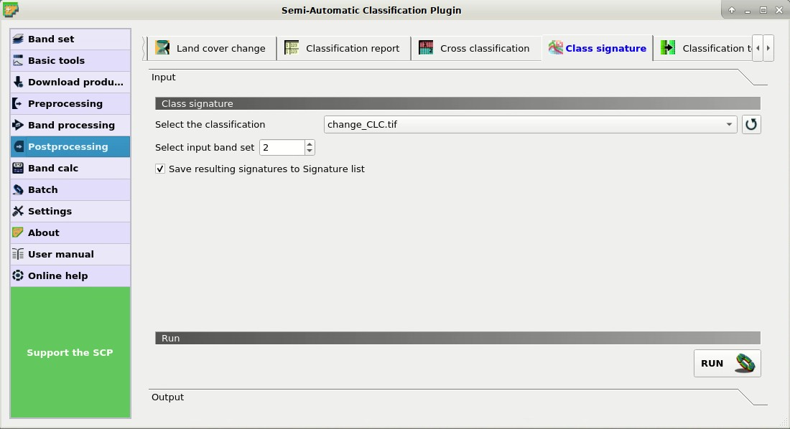
	
	:guilabel:`The tool for extracting spectral signatures from classes`
	
After a while the spectral signatures are loaded in the :guilabel:`Training input`.

If the changes involved vegetation, we could calculate spectral signatures for images acquired in different seasons and assess the phenological variations of vegetation through spectral signatures.
Also, these spectral signatures could be used as training input for further land cover classifications.

In order to display the signature plot, in the :ref:`ROI_list` highlight two or more spectral signatures (with click in the table), then click the button |sign_plot|.
The :ref:`spectral_signature_plot` is displayed in a new window.

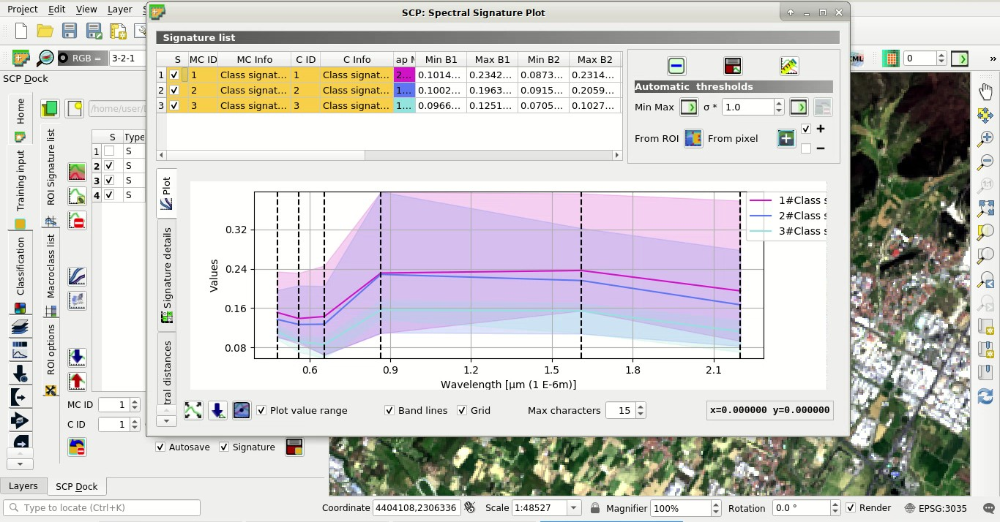
	
	:guilabel:`The calculated spectral signatures`
	
	
.. _tutorial_4_changes_to_vector:

Export the changes to vector format
-------------------------------------------------------------------

This is an optional step that may be useful for further analyses and integration with other data.
We are going to convert the change raster to vector.

Open the tool |class_to_vector_tool| :ref:`classification_vector_tab`.
In :guilabel:`Select the classification` select the ``change_CLC`` raster and uncheck the |checkbox| :guilabel:`Use code from Signature list`.
Now click :guilabel:`RUN` |run| to create a new vector (e.g. ``change_vector``).

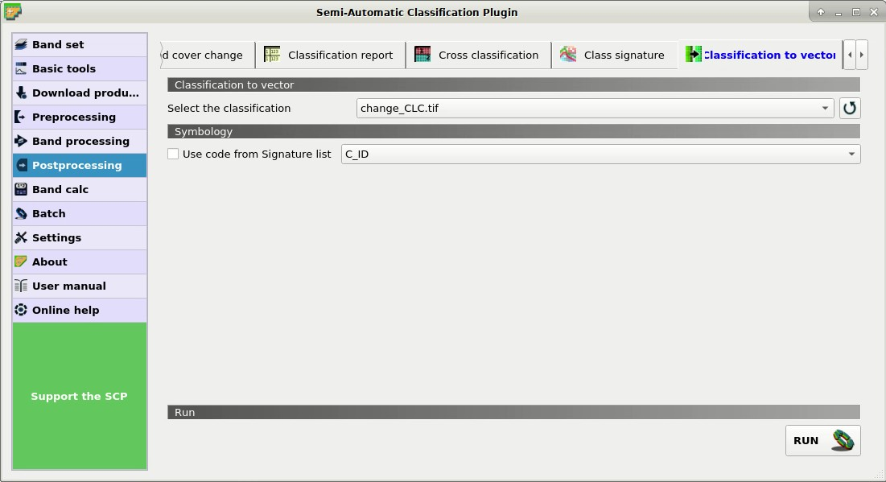
	
	:guilabel:`Raster to vector tool`
	
In the attribute table of this ``change_vector`` you can see the field ``C_ID`` that represents the code of the change raster as described in :ref:`tutorial_4_land_cover_change`.
Of course we could delete the polygons with code 0 (unchanged area), displaying only changes with code 1.

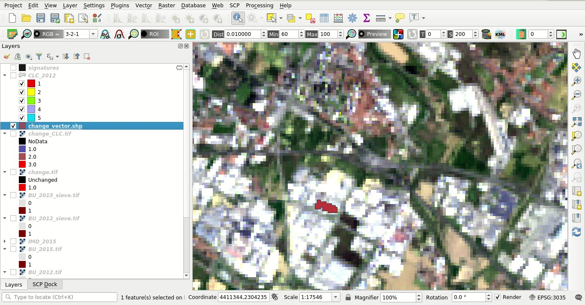
	
	:guilabel:`The vector of changes over the Landsat image`
	
