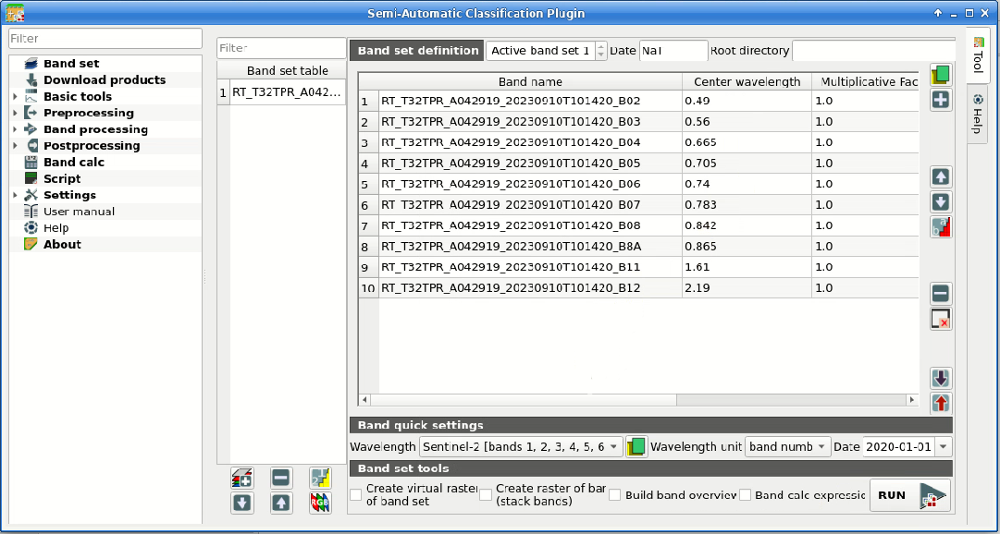
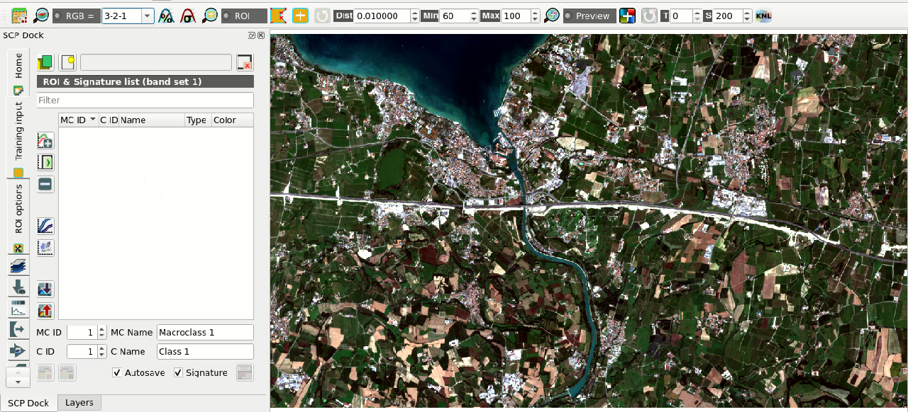
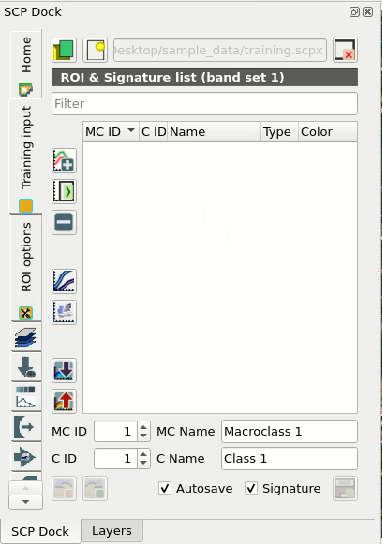
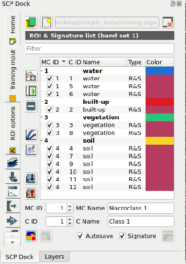
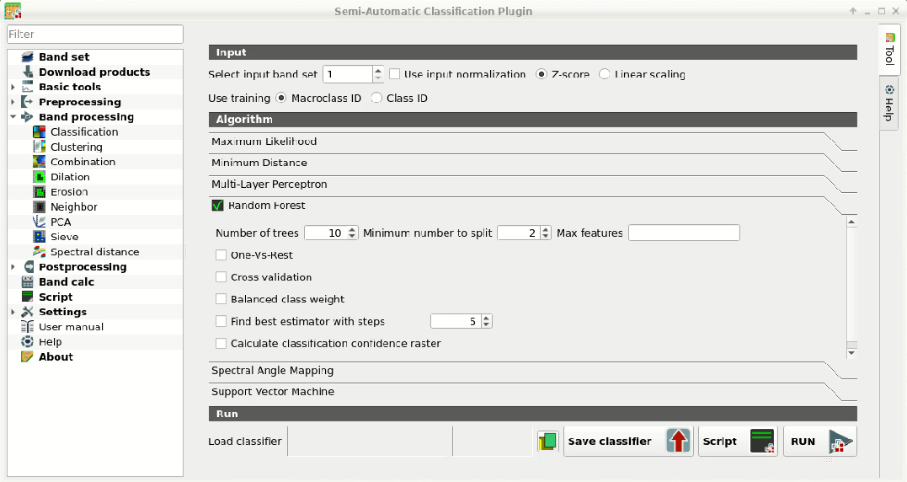
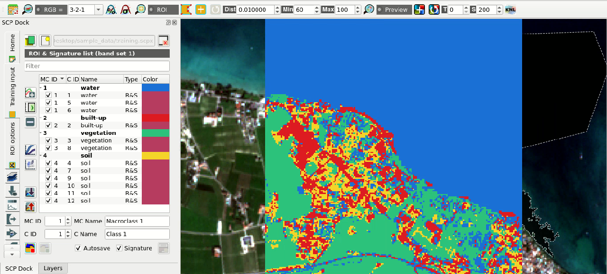
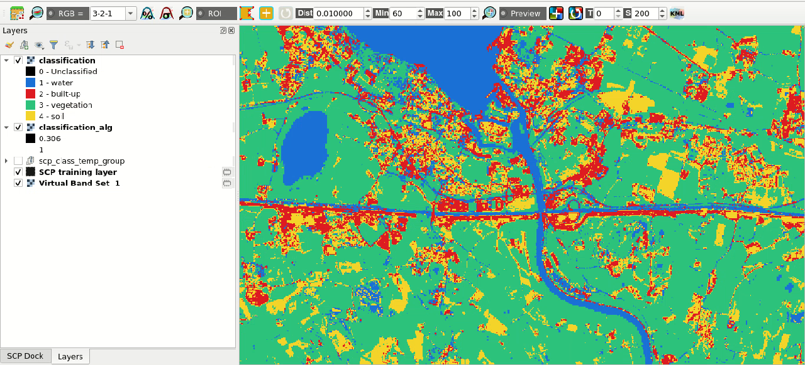
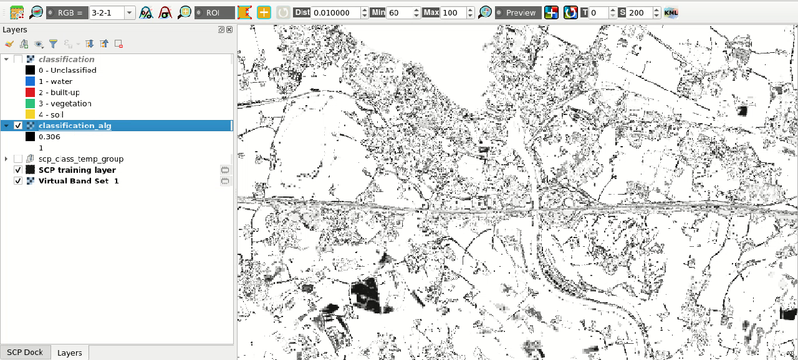

.. _tutorial_rf:

***************************************************************
Tutorial: Random Forest Classification
***************************************************************

.. |checkbox| image:: _static/checkbox.png
    :width: 18pt

.. |pointer| image:: _static/semiautomaticclassificationplugin_pointer_tool.png
    :width: 20pt

.. |run| image:: _static/semiautomaticclassificationplugin_run.png
    :width: 24pt

.. |open_file| image:: _static/semiautomaticclassificationplugin_open_file.png
    :width: 20pt

.. |new_file| image:: _static/semiautomaticclassificationplugin_new_file.png
    :width: 20pt

.. |import_spectral_library| image:: _static/semiautomaticclassificationplugin_import_spectral_library.png
    :width: 20pt

.. |bandset_tool| image:: _static/semiautomaticclassificationplugin_bandset_tool.png
    :width: 20pt

.. |manual_ROI| image:: _static/semiautomaticclassificationplugin_manual_ROI.png
    :width: 20pt

.. |save_roi| image:: _static/semiautomaticclassificationplugin_save_roi.png
    :width: 20pt

.. |roi_single| image:: _static/semiautomaticclassificationplugin_roi_single.png
    :width: 20pt

.. |preview| image:: _static/semiautomaticclassificationplugin_preview.png
    :width: 20pt

.. |preview_redo| image:: _static/semiautomaticclassificationplugin_preview_redo.png
    :width: 20pt

.. |delete_signature| image:: _static/semiautomaticclassificationplugin_delete_signature.png
    :width: 20pt

.. |sign_plot| image:: _static/semiautomaticclassificationplugin_sign_tool.png
    :width: 20pt

.. |enter| image:: _static/semiautomaticclassificationplugin_enter.png
    :width: 20pt

.. |export| image:: _static/semiautomaticclassificationplugin_export.png
    :width: 20pt

The following is a tutorial about the land cover classification using
the Random Forest algorithm in the Semi-Automatic Classification Plugin
(:guilabel:`SCP`).
Please note that the installation of the dependency ``scikit-learn`` is
required (see :ref:`installation`).
It is assumed that you have already read the :ref:`tutorials`.

Following the video of the tutorial.

https://www.youtube.com/watch?v=2JU3XMkWdPo

.. raw:: html

    <iframe allowfullscreen="" frameborder="0" height="360" src="https://www.youtube.com/embed/2JU3XMkWdPo?rel=0" width="100%"></iframe>

.. contents::
    :depth: 2
    :local:

.. _tutorial_rf_1:
 
Introduction
===================================================

This tutorial describes how to perform the land cover classification of a
multispectral image using the Random Forest algorithm.
It is recommended to read the :ref:`tutorial_1` before following
this tutorial.
We are going to identify the following land cover classes:

#. Water;
#. Built-up;
#. Vegetation;
#. Soil.

.. _tutorial_rf_data_download:

Download the Data and prepare the Band set
------------------------------------------

In this tutorial we are going to use a subset of :ref:`Sentinel2_definition`
image, already converted to reflectance and clipped to the study area,
downloading a ``.zip`` file (which contains modified
`Copernicus <http://copernicus.eu/>`_ Sentinel data 2023).
Of course, this tutorial can be applied to any multispectral image.

.. tip::
    For more information about how to download images, please read
    :ref:`basic_tutorial_3`.

Download the ``.zip`` file from this
`link 1 <https://docs.google.com/uc?id=1cWerxZeBY4TJmctKwsvXkfa3No37Pr9a>`_
and extract the directory containing the image bands.

We must define the :guilabel:`Band set` which is the input image for
:guilabel:`SCP` classification.
Open the tab :ref:`band_set_tab` clicking the button |bandset_tool| in the
:ref:`SCP_menu` or the :ref:`SCP_dock`.
Click the button |open_file| to select the ``.tif`` files from the
extracted directory to the :guilabel:`Band set` tab.
Select :guilabel:`Sentinel-2` in the
:guilabel:`Wavelength` list of the :ref:`band_quick_settings`.

    :guilabel:`Definition of the band set`

We can display the image in natural colors.
In the :ref:`working_toolbar`, click the list :guilabel:`RGB=` and select the
item ``3-2-1``.

    :guilabel:`Color composite RGB=3-2-1`

.. _tutorial_rf_rois:

Create the ROIs
------------------------------------------------------

In general, we need to create a :ref:`training_input`
file in order to collect :ref:`ROI_definition` (ROIs) to train the
classification algorithm.
In this tutorial, we are going to import a GeoPackage ``.gpkg`` file
containing polygons that we are going to import in a :guilabel:`Training input`
file.
Download the GeoPackage ``.gpkg`` file from this
`link <https://docs.google.com/uc?id=1onFqHdk1aTN9WYb6ZoUnAkZMiZEUoITd>`_ .

.. tip::
    For more information about how to create the ROIs, please read
    :ref:`tutorial_1`.

This GeoPackage ``.gpkg`` file includes the Macroclass IDs defined in the
following table, which is the classification system.
Of course, classes should be adapted to the classification objective.

+-----------------------------+--------------------------+
| Macroclass name             | Macroclass ID            |
+=============================+==========================+
| Water                       |  1                       |
+-----------------------------+--------------------------+
| Built-up                    |  2                       |
+-----------------------------+--------------------------+
| Vegetation                  |  3                       |
+-----------------------------+--------------------------+
| Soil                        |  4                       |
+-----------------------------+--------------------------+

In the :ref:`SCP_dock` select the tab :ref:`training_input` and click the
button |new_file| to create the :guilabel:`Training input` (define a name such
as ``training.scpx``).
The path of the file is displayed and a vector is added to QGIS layers with the
same name as the :guilabel:`Training input`.

    :guilabel:`Definition of Training input in SCP`

Now open the tool :ref:`import_shapefile_tab` to import the GeoPackage
``.gpkg`` file into the :guilabel:`Training input`.

First, in :guilabel:`Select a vector` |open_file| select the path to the
GeoPackage ``.gpkg`` file.
Now we can select the vector field corresponding to :guilabel:`MC ID field`,
:guilabel:`MC Name field`, :guilabel:`C ID field`, and :guilabel:`C Name field`
which in this vector are ``macroclass_id``, ``macroclass_name``, ``class_id``,
and ``class_name`` respectively.
Finally click :guilabel:`Import vector` |enter| to import all the vector
polygons as ROIs in the :ref:`training_input` (this process can take a while).
Before running a classification (or a preview), set the color of land cover
classes that will be displayed in the classification raster.
In the :ref:`ROI_list`, double click the color (in the column
:guilabel:`Color`) of each ROI to choose a representative color of each class.
Also, we need to set the color for macroclasses in :ref:`ROI_list`.

    :guilabel:`Imported ROIs in Training input`

.. _tutorial_rf_classification_preview:

Create a Classification Preview and Random Forest parameters
------------------------------------------------------------

We can now perform a :ref:`classification_preview` in order to assess the
results before the final classification.

First, we need to select the classification algorithm
:ref:`random_forest_definition`.
Open the tool :ref:`classification_tab` to set the :guilabel:`input band set`
(in this case 1), check :guilabel:`Use` |checkbox| :guilabel:`Macroclass ID`,
and in :ref:`classification_alg` select the :guilabel:`Random forest`.

    :guilabel:`Selecting the algorithm`

.. tip::
    In case you defined the same `Macroclass ID` value for all the ROIs in
    the :guilabel:`Training input`, you should check :guilabel:`Use`
    |checkbox| :guilabel:`Class ID`.

Available parameters for :guilabel:`Random forest` are:

* ``Number of trees`` that sets the number of trees in the forest; this is one
  of the most important parameters because it defines the complexity of the
  forest, the higher the better but with the downside of increasing the
  computation time.
* ``Minimum number to split`` that sets the minimum number of samples
  required to split an internal node; in general it can be leaved 2 as default.
* ``Max features`` that sets the number of features considered in node
  splitting; in general it can be leaved empty to consider all features in node
  splitting.

We can start with ``Number of trees`` set to 10 (the process should be rapid)
and in :ref:`classification_preview` set :guilabel:`Size` = 200; click the
button |preview| and then left click a point of the image in the map.

    :guilabel:`Classification preview displayed over the image`

If we click again the button |preview| and then left click a point of the image
in the map, we should notice that the process is more rapid.
This is because the classifier is already trained, and directly used to
perform the classification.

We can increase ``Number of trees`` to 100, click the
button |preview| and then left click a point of the image in the map.
Now the process should take more time because changing the classification
parameters resets the classifier that needs to train again.

.. tip::
    Generally, ``Number of trees`` should be at least 500 for good results.

Other interesting options are:

* |checkbox| :guilabel:`One-Vs-Rest`: if checked, the algorithm performs
  `One-Vs-Rest classification <https://scikit-learn.org/stable/modules/generated/sklearn.multiclass.OneVsRestClassifier.html>`_
  which basically fits one classifier per class.
* |checkbox| :guilabel:`Cross validation`: if checked, perform cross validation
  that is a function provided by ``scikit-learn`` to avoid overfitting by
  splitting the training set into ``k`` smaller sets
  (`read more <https://scikit-learn.org/stable/modules/cross_validation.html>`_
  .
  In particular, the function ``StratifiedKFold`` (with parameters n_splits=5,
  shuffle=True) is used to create 5 sets, each one containing approximately the
  same percentage of samples for each class as the complete set.
  This option can potentially increase significantly the
  computation time.
* |checkbox| :guilabel:`Balanced class weight`: if checked, gives all classes
  equal weight with a balanced weight that is computed inversely proportional
  to class frequency in the training data.
* |checkbox| :guilabel:`Find best estimator with steps`: if checked, the
  algorithm tries to find the best estimator iteratively with the defined
  number of steps (the more the steps, the slower the process will be),
  by changing the algorithm parameters.

The option |checkbox| :guilabel:`Calculate classification confidence raster`
is useful for the final classification output; if checked, in addition to the
output classification, a confidence raster is produced (each pixel represents
the confidence of the classifier in assigning the output class).

.. _tutorial_rf_classification:

Create the Classification Output
------------------------------------------------------

Assuming that the results of classification previews are satisfactory, we can
perform the actual land cover classification of the whole image.
We can check the option |checkbox|
:guilabel:`Calculate classification confidence raster` to compute also the
confidence raster.

In :ref:`classification_tab` click the button :ref:`classification_run` |run|
and define the path of the classification output file (.tif).

.. tip::
    We can save the classifier for later use by clicking
    :guilabel:`Save classifier` |export| .

    :guilabel:`Result of the land cover classification`

We can also analyze the confidence raster; higher values (i.e., near 1)
represent pixels with high confidence, while lower values (i.e., near 0)
represent pixels where the classifier is not well trained and more uncertain,
therefore classification errors are expected.

    :guilabel:`Confidence raster`

.. tip::
    It is recommended to analyze the pixels that have low confidence, and
    improve the classification by creating new ROIs or editing the existing
    ones.

We have performed a land cover classification using Random Forest algorithm.
Other classification algorithms are described in other tutorials.
