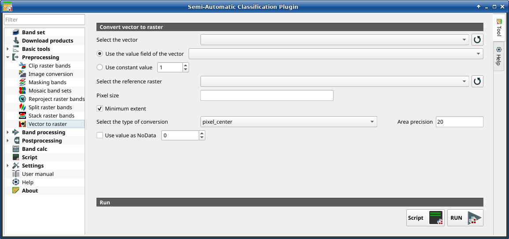

.. _vector_to_raster_tab:

******************************
Vector to raster
******************************

.. |registry_save| image:: _static/registry_save.png
    :width: 20pt

.. |project_save| image:: _static/project_save.png
    :width: 20pt

.. |optional| image:: _static/optional.png
    :width: 20pt

.. |input_list| image:: _static/input_list.jpg
    :width: 20pt

.. |input_text| image:: _static/input_text.jpg
    :width: 20pt

.. |input_date| image:: _static/input_date.jpg
    :width: 20pt

.. |input_number| image:: _static/input_number.jpg
    :width: 20pt

.. |input_table| image:: _static/input_table.jpg
    :width: 20pt

.. |open_file| image:: _static/semiautomaticclassificationplugin_open_file.png
    :width: 20pt

.. |new_file| image:: _static/semiautomaticclassificationplugin_new_file.png
    :width: 20pt

.. |open_dir| image:: _static/semiautomaticclassificationplugin_open_dir.png
    :width: 20pt

.. |remove| image:: _static/semiautomaticclassificationplugin_remove.png
    :width: 20pt

.. |add| image:: _static/semiautomaticclassificationplugin_add.png
    :width: 20pt

.. |reset| image:: _static/semiautomaticclassificationplugin_reset.png
    :width: 20pt

.. |bandset_tool| image:: _static/semiautomaticclassificationplugin_bandset_tool.png
    :width: 20pt

.. |download| image:: _static/semiautomaticclassificationplugin_download_arrow.png
    :width: 20pt

.. |sign_plot| image:: _static/semiautomaticclassificationplugin_sign_tool.png
    :width: 20pt

.. |tools| image:: _static/semiautomaticclassificationplugin_roi_tool.png
    :width: 20pt

.. |preprocessing| image:: _static/semiautomaticclassificationplugin_class_tool.png
    :width: 20pt

.. |band_processing| image:: _static/semiautomaticclassificationplugin_band_processing.png
    :width: 20pt

.. |postprocessing| image:: _static/semiautomaticclassificationplugin_post_process.png
    :width: 20pt

.. |bandcalc| image:: _static/semiautomaticclassificationplugin_bandcalc_tool.png
    :width: 20pt

.. |settings| image:: _static/semiautomaticclassificationplugin_settings_tool.png
    :width: 20pt

.. |script_tool| image:: _static/semiautomaticclassificationplugin_script.png
    :width: 20pt

.. |save_roi| image:: _static/semiautomaticclassificationplugin_save_roi.png
    :width: 20pt

.. |delete_signature| image:: _static/semiautomaticclassificationplugin_delete_signature.png
    :width: 20pt

.. |accuracy_tool| image:: _static/semiautomaticclassificationplugin_accuracy_tool.png
    :width: 20pt

.. |enter| image:: _static/semiautomaticclassificationplugin_enter.png
    :width: 20pt

.. |zoom_to_ROI| image:: _static/semiautomaticclassificationplugin_zoom_to_ROI.png
    :width: 20pt

.. |check| image:: _static/semiautomaticclassificationplugin_batch_check.png
    :width: 20pt

.. |select_all| image:: _static/semiautomaticclassificationplugin_select_all.png
    :width: 20pt

.. |docks| image:: _static/semiautomaticclassificationplugin_docks.png
    :width: 20pt

.. |add_sign_tool| image:: _static/semiautomaticclassificationplugin_add_sign_tool.png
    :width: 20pt

.. |scatter_plot| image:: _static/semiautomaticclassificationplugin_scatter_tool.png
    :width: 20pt

.. |merge_sign| image:: _static/semiautomaticclassificationplugin_merge_sign_tool.png
    :width: 20pt

.. |guide| image:: _static/guide.png
    :width: 20pt

.. |help| image:: _static/help.png
    :width: 20pt

.. |reload| image:: _static/semiautomaticclassificationplugin_reload.png
    :width: 20pt

.. |checkbox| image:: _static/checkbox.png
    :width: 18pt

.. |run| image:: _static/semiautomaticclassificationplugin_run.png
    :width: 24pt

.. |radiobutton| image:: _static/radiobutton.png
    :width: 18pt

.. |vector_to_raster_tool| image:: _static/semiautomaticclassificationplugin_vector_to_raster_tool.png
    :width: 18pt

    :guilabel:`Vector to raster`

This tab allows for the conversion of a vector (polygon) to raster format.

.. tip::
    Information about APIs of this tool in Remotior Sensus at this
    `link <https://remotior-sensus.readthedocs.io/en/latest/remotior_sensus.tools.vector_to_raster.html>`_ .

.. _convert_vector_to_raster:

Convert vector to raster
^^^^^^^^^^^^^^^^^^^^^^^^^^^^^^^^^^^^^^^^^^^^^^^^

.. list-table::
    :widths: auto
    :header-rows: 1

    * - Tool symbol and name
      - Description
    * - :guilabel:`Select the vector` |input_list|
      - select a vector already loaded in QGIS
    * - |reload|
      - refresh layer list
    * - |radiobutton| :guilabel:`Use the value field of the vector` |input_list|
      - if checked, the selected field is used as attribute for the conversion;
        pixels of the output raster have the same values as the vector attribute
    * - |radiobutton| :guilabel:`Use constant value` |input_number|
      - if checked, the polygons are converted to raster using the selected
        constant value
    * - :guilabel:`Select the reference raster` |input_list|
      - select a reference raster; pixels of the output raster have the same
        size and alignment as the reference raster
    * - |reload|
      - refresh layer list
    * - :guilabel:`Pixel size` |input_text|
      - set the size of pixel of output raster
    * - |checkbox| :guilabel:`Minimum extent`
      - if checked, the output raster has the minimum vector extent;
        otherwise, output extent is the same as the
        :guilabel:`Select the reference raster` |input_list|
    * - :guilabel:`Select the type of conversion` |input_list|
      - select the type of conversion among:
            * :guilabel:`pixel_center`: during the conversion, vector is
              compared to the reference raster; output raster pixels are
              attributed to a polygon if pixel center is within that polygon
            * :guilabel:`all_touched`: during the conversion, vector is
              compared to the reference raster; output raster pixels are
              attributed to a polygon if pixel touches that polygon
            * :guilabel:`area_based`: during the conversion, output raster
              pixels are attributed based on area proportion of polygons
    * - :guilabel:`Area precision` |input_text|
      - for :guilabel:`area_based` method, the higher the value, the higher is
        the precision in the calculation of area proportion (and the time
        required for calculation)
    * - |checkbox| :guilabel:`Use value as NoData` |input_number|
      - if checked, set a value for ``NoData`` pixels
    * - :guilabel:`Script` |script_tool|
      - add this function to the :ref:`script_tab`
    * - :guilabel:`RUN` |run|
      - run this function