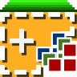
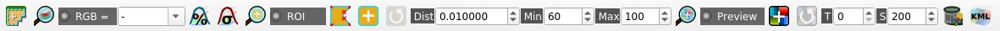

.. _working_toolbar:

******************************
Working toolbar
******************************

.. |br| raw:: html

  
 
.. |registry_save| image:: _static/registry_save.png
	:width: 20pt
	
.. |project_save| image:: _static/project_save.png
	:width: 20pt
	
.. |optional| image:: _static/optional.png
	:width: 20pt
	
.. |input_list| image:: _static/input_list.jpg
	:width: 20pt
	
.. |input_text| image:: _static/input_text.jpg
	:width: 20pt
	
.. |input_date| image:: _static/input_date.jpg
	:width: 20pt
	
.. |input_number| image:: _static/input_number.jpg
	:width: 20pt
	
.. |input_slider| image:: _static/input_slider.jpg
	:width: 20pt
	
.. |input_table| image:: _static/input_table.jpg
	:width: 20pt
	

.. |cumulative_stretch| image:: _static/semiautomaticclassificationplugin_bandset_cumulative_stretch_tool.png
	:width: 20pt

.. |zoom_to_Image| image:: _static/semiautomaticclassificationplugin_zoom_to_Image.png
	:width: 20pt
	
.. |zoom_to_ROI| image:: _static/semiautomaticclassificationplugin_zoom_to_ROI.png
	:width: 20pt
	
.. |zoom_to_preview| image:: _static/semiautomaticclassificationplugin_zoom_to_preview.png
	:width: 20pt
	
.. |std_dev_stretch| image:: _static/semiautomaticclassificationplugin_bandset_std_dev_stretch_tool.png
	:width: 20pt

.. |manual_ROI| image:: _static/semiautomaticclassificationplugin_manual_ROI.png
	:width: 20pt

.. |roi_single| image:: _static/semiautomaticclassificationplugin_roi_single.png
	:width: 20pt
	
.. |roi_redo| image:: _static/semiautomaticclassificationplugin_roi_redo.png
	:width: 20pt

.. |preview| image:: _static/semiautomaticclassificationplugin_preview.png
	:width: 20pt
	
.. |preview_redo| image:: _static/semiautomaticclassificationplugin_preview_redo.png
	:width: 20pt
	
.. |remove_temp| image:: _static/semiautomaticclassificationplugin_remove_temp.png
	:width: 20pt

.. |radiobutton| image:: _static/radiobutton.png
	:width: 18pt
	

	
	:guilabel:`Working toolbar`
		
The :guilabel:`Working toolbar` allows for creating :guilabel:`temporary ROIs` and :guilabel:`classification previews`.

.. contents::
    :depth: 2
    :local:
	
The functions are described in detail in the following paragraphs.

.. _image_control:

Image control
----------------------

* |plugin|: show the :ref:`main_interface_window`;
* |zoom_to_Image|: zoom the map to the extent of the :guilabel:`active band set` in :ref:`band_set_tab`;
* |radiobutton| :guilabel:`RGB=` |input_list| |project_save|: use the button to show/hide the :guilabel:`active band set` in :ref:`band_set_tab` in the map; from the list select a :ref:`color_composite_definition` that is applied to the :ref:`band_set_tab`; new color composites can be entered typing the band numbers separated by ``-`` or ``;`` or ``,`` (e.g. RGB = 4-3-2 or RGB = 4;3;2 or RGB = 4,3,2);
* |cumulative_stretch|: display the input image stretching the minimum and maximum values according to cumulative count of current map extent;
* |std_dev_stretch|: display the input image stretching the minimum and maximum values according to standard deviation of current map extent;

.. raw:: html

	<iframe allowfullscreen="" frameborder="0" height="360" src="http://www.youtube.com/embed/9jA_Rh8YfKQ?rel=0" width="100%"></iframe>

http://www.youtube.com/watch?v=9jA_Rh8YfKQ

.. _temporary_ROI:

Temporary ROI
----------------------

A :guilabel:`temporary ROI` is a temporary polygon displayed in the map, which can be saved permanently in the :ref:`training_input`.
A :guilabel:`temporary ROI` can be drawn manually or using a :ref:`region_growing_algorithm` (i.e. the image is segmented around a pixel seed including spectrally homogeneous pixels).

* |zoom_to_ROI|: zoom the map to the extent of :guilabel:`temporary ROI`;
* |radiobutton| :guilabel:`ROI`: use the button to show/hide the :guilabel:`temporary ROI` and the :guilabel:`Training input` in the map;
* |manual_ROI|: activate the pointer to create a :guilabel:`temporary ROI` by drawing a polygon in the map; left click on the map to define the ROI vertices and right click to define the last vertex closing the polygon; press the keyboard button ``CTRL`` to add a multipart polygon; press the keyboard buttons ``CTRL + Z`` for removing the last multipart polygon;
* |roi_single|: activate the pointer to create a :guilabel:`temporary ROI` using the region growing algorithm; left click on the map for creating the ROI; right click on the map for displaying the spectral signature of a pixel of the :guilabel:`active band set` in the :ref:`spectral_signature_plot`; press the keyboard button ``CTRL`` and left click to add a multipart polygon (new parts are not created if overlapping to other parts); press the keyboard buttons ``CTRL + Z`` for removing the last multipart polygon; press the keyboard button ``CTRL`` and right click to plot spectral signatures of the same pixel for all the :guilabel:`band sets`;
* |roi_redo|: create a :guilabel:`temporary ROI` using the region growing algorithm at the same seed pixel as the previous one; it is useful after changing the :guilabel:`region growing parameters`;

:guilabel:`Region growing parameters`: the following parameters are required for the ROI creation using a region growing algorithm on the :ref:`band_set_tab`:
	* :guilabel:`Dist` |input_number| |project_save|: set the interval which defines the maximum spectral distance between the seed pixel and the surrounding pixels (in radiometry unit);
	* :guilabel:`Min` |input_number| |project_save|: set the minimum area of a ROI (in pixel unit); this setting overrides the ``Range radius`` until the minimum ROI size is reached; if ``Rapid ROI on band`` is checked, then ROI will have at least the size defined ``Min ROI size``; if ``Rapid ROI on band`` is unchecked, then ROI could have a size smaller than ``Min ROI size``;
	* :guilabel:`Max` |input_number| |project_save|: set the maximum width of a ROI (i.e. the side length of a square, centred at the seed pixel, which inscribes the ROI) in pixel unit;
	
.. raw:: html

	<iframe allowfullscreen="" frameborder="0" height="360" src="http://www.youtube.com/embed/CQqNtlOU6mI?rel=0" width="100%"></iframe>

http://www.youtube.com/watch?v=CQqNtlOU6mI

.. _classification_preview:

Classification preview
----------------------
	
:guilabel:`Classification preview` allows for displaying temporary classifications (i.e. classification previews).
Classification previews are useful for testing the algorithm in a small area of the :ref:`band_set_tab`, before classifying the entire image which can be time consuming (see :ref:`classification_output`).

:guilabel:`Classification preview` is performed according to the parameters defined in :ref:`classification_alg`.

In addition to the classification raster, an :ref:`algorithm_raster` can be displayed, which is useful for assessing the distance of a pixel classified as ``class X`` from the corresponding spectral signature `X`.
In :guilabel:`Classification previews`, black pixels are distant from the corresponding spectral signature (i.e. probably a new ROI, or spectral signature, should be collected in that area) and white pixels are closer to the corresponding spectral signature (i.e. probably the spectral signature identifies correctly those pixels).

After the creation of a new preview, old previews are placed in QGIS Layers inside a layer group named ``Class_temp_group`` (custom name can be defined in  :ref:`group_name`) and are deleted when the QGIS session is closed.

	**WARNING**: Classification previews are automatically deleted from disk when the QGIS session is closed; a QGIS message (that can be ignored) could ask for the path of missing layers when opening a previously saved project.
	
* |zoom_to_preview|: zoom the map to the extent of the last :ref:`classification_preview`;
* |radiobutton| :guilabel:`Preview`: use the button to show/hide the last :ref:`classification_preview` in the map;
* |preview|: activate the pointer for the creation of a :ref:`classification_preview`; left click the map to start the classification process and display the classification preview; right click to start the classification process and show the :ref:`algorithm_raster` of the preview;
* |preview_redo|: create a new :ref:`classification_preview` centred at the same pixel as the previous one;
* :guilabel:`T` |input_number|: change dynamically the classification preview transparency, which is useful for comparing  the classification to other layers;
* :guilabel:`S` |input_number| |project_save|: size of the preview in pixel unit (i.e. the side length of a square, centred at the clicked pixel);
* |remove_temp|: remove from QGIS the :guilabel:`classification previews` that are archived in the :guilabel:`Class_temp_group`;
