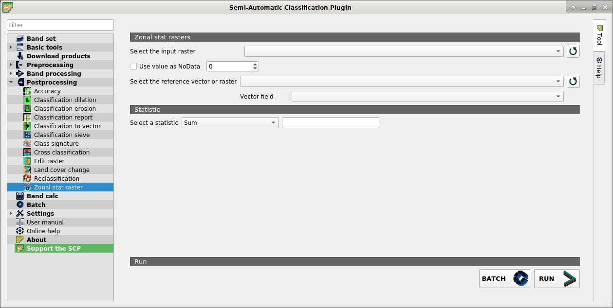

.. _zonal_stat_raster_tab:

******************************
Zonal stat raster
******************************

.. contents::
    :depth: 2
    :local:
	
.. |registry_save| image:: _static/registry_save.png
	:width: 20pt
	
.. |project_save| image:: _static/project_save.png
	:width: 20pt
	
.. |optional| image:: _static/optional.png
	:width: 20pt
	
.. |input_list| image:: _static/input_list.jpg
	:width: 20pt
	
.. |input_text| image:: _static/input_text.jpg
	:width: 20pt
	
.. |input_date| image:: _static/input_date.jpg
	:width: 20pt
	
.. |input_number| image:: _static/input_number.jpg
	:width: 20pt
	
.. |input_slider| image:: _static/input_slider.jpg
	:width: 20pt
	
.. |input_table| image:: _static/input_table.jpg
	:width: 20pt
	
.. |add| image:: _static/semiautomaticclassificationplugin_add.png
	:width: 20pt
	
.. |checkbox| image:: _static/checkbox.png
	:width: 18pt
	
.. |pointer| image:: _static/semiautomaticclassificationplugin_pointer_tool.png
	:width: 20pt
	
.. |radiobutton| image:: _static/radiobutton.png
	:width: 18pt
	
.. |reload| image:: _static/semiautomaticclassificationplugin_reload.png
	:width: 20pt
	
.. |reset| image:: _static/semiautomaticclassificationplugin_reset.png
	:width: 20pt
	
.. |remove| image:: _static/semiautomaticclassificationplugin_remove.png
	:width: 20pt
	
.. |run| image:: _static/semiautomaticclassificationplugin_run.png
	:width: 24pt
	
.. |open_file| image:: _static/semiautomaticclassificationplugin_open_file.png
	:width: 20pt
	
.. |new_file| image:: _static/semiautomaticclassificationplugin_new_file.png
	:width: 20pt
	
.. |open_dir| image:: _static/semiautomaticclassificationplugin_open_dir.png
	:width: 20pt
	
.. |select_all| image:: _static/semiautomaticclassificationplugin_select_all.png
	:width: 20pt
	
.. |move_up| image:: _static/semiautomaticclassificationplugin_move_up.png
	:width: 20pt
	
.. |add_bandset| image:: _static/semiautomaticclassificationplugin_add_bandset_tool.png
	:width: 20pt
	
.. |move_down| image:: _static/semiautomaticclassificationplugin_move_down.png
	:width: 20pt
	
.. |search_images| image:: _static/semiautomaticclassificationplugin_search_images.png
	:width: 20pt

.. |osm_add| image:: _static/semiautomaticclassificationplugin_osm_add.png
	:width: 20pt

.. |image_preview| image:: _static/semiautomaticclassificationplugin_download_image_preview.png
	:width: 20pt

.. |import| image:: _static/semiautomaticclassificationplugin_import.png
	:width: 20pt
	
.. |export| image:: _static/semiautomaticclassificationplugin_export.png
	:width: 20pt

.. |plus| image:: _static/semiautomaticclassificationplugin_plus.png
	:width: 20pt

.. |order_by_name| image:: _static/semiautomaticclassificationplugin_order_by_name.png
	:width: 20pt

.. |image_overview| image:: _static/semiautomaticclassificationplugin_download_image_overview.png
	:width: 20pt
	
.. |enter| image:: _static/semiautomaticclassificationplugin_enter.png
	:width: 20pt

.. |download| image:: _static/semiautomaticclassificationplugin_download_arrow.png
	:width: 20pt
	
.. |login_data| image:: _static/semiautomaticclassificationplugin_download_login.png
	:width: 20pt
	
.. |search_tab| image:: _static/semiautomaticclassificationplugin_download_search.png
	:width: 20pt

.. |download_options_tab| image:: _static/semiautomaticclassificationplugin_download_options.png
	:width: 20pt

.. |tools| image:: _static/semiautomaticclassificationplugin_roi_tool.png
	:width: 20pt
	
.. |roi_multiple| image:: _static/semiautomaticclassificationplugin_roi_multiple.png
	:width: 20pt

.. |import_spectral_library| image:: _static/semiautomaticclassificationplugin_import_spectral_library.png
	:width: 20pt
	
.. |export_spectral_library| image:: _static/semiautomaticclassificationplugin_export_spectral_library.png
	:width: 20pt
	
.. |weight_tool| image:: _static/semiautomaticclassificationplugin_weight_tool.png
	:width: 20pt
	
.. |LCS_threshold_ROI_tool| image:: _static/semiautomaticclassificationplugin_LCS_threshold_ROI_tool.png
	:width: 20pt
	
.. |threshold_tool| image:: _static/semiautomaticclassificationplugin_threshold_tool.png
	:width: 20pt
	
.. |LCS_threshold| image:: _static/semiautomaticclassificationplugin_LCS_threshold_tool.png
	:width: 20pt
	
.. |LCS_threshold_set_tool| image:: _static/semiautomaticclassificationplugin_LCS_threshold_set_tool.png
	:width: 20pt
	
.. |sign_plot| image:: _static/semiautomaticclassificationplugin_sign_tool.png
	:width: 20pt
	
.. |rgb_tool| image:: _static/semiautomaticclassificationplugin_rgb_tool.png
	:width: 20pt
	
.. |preprocessing| image:: _static/semiautomaticclassificationplugin_class_tool.png
	:width: 20pt
	
.. |band_processing| image:: _static/semiautomaticclassificationplugin_band_processing.png
	:width: 20pt
	
.. |band_combination| image:: _static/semiautomaticclassificationplugin_band_combination_tool.png
	:width: 20pt
	
.. |landsat_tool| image:: _static/semiautomaticclassificationplugin_landsat8_tool.png
	:width: 20pt
	
.. |sentinel2_tool| image:: _static/semiautomaticclassificationplugin_sentinel_tool.png
	:width: 20pt
	
.. |sentinel3_tool| image:: _static/semiautomaticclassificationplugin_sentinel3_tool.png
	:width: 20pt
	
.. |aster_tool| image:: _static/semiautomaticclassificationplugin_aster_tool.png
	:width: 20pt
	
.. |modis_tool| image:: _static/semiautomaticclassificationplugin_modis_tool.png
	:width: 20pt
	
.. |split_raster| image:: _static/semiautomaticclassificationplugin_split_raster.png
	:width: 20pt
	
.. |stack_raster| image:: _static/semiautomaticclassificationplugin_stack_raster.png
	:width: 20pt
	
.. |mosaic_tool| image:: _static/semiautomaticclassificationplugin_mosaic_tool.png
	:width: 20pt
	
.. |cloud_masking_tool| image:: _static/semiautomaticclassificationplugin_cloud_masking_tool.png
	:width: 20pt
	
.. |clip_tool| image:: _static/semiautomaticclassificationplugin_clip_tool.png
	:width: 20pt
	
.. |pca_tool| image:: _static/semiautomaticclassificationplugin_pca_tool.png
	:width: 20pt
	
.. |vector_to_raster_tool| image:: _static/semiautomaticclassificationplugin_vector_to_raster_tool.png
	:width: 20pt
	
.. |post_process| image:: _static/semiautomaticclassificationplugin_post_process.png
	:width: 20pt
	
.. |accuracy_tool| image:: _static/semiautomaticclassificationplugin_accuracy_tool.png
	:width: 20pt
	
.. |land_cover_change| image:: _static/semiautomaticclassificationplugin_land_cover_change.png
	:width: 20pt
	
.. |report_tool| image:: _static/semiautomaticclassificationplugin_report_tool.png
	:width: 20pt

.. |cross_classification| image:: _static/semiautomaticclassificationplugin_cross_classification.png
	:width: 20pt

.. |spectral_distance| image:: _static/semiautomaticclassificationplugin_spectral_distance.png
	:width: 20pt

.. |clustering| image:: _static/semiautomaticclassificationplugin_kmeans_tool.png
	:width: 20pt

.. |class_to_vector_tool| image:: _static/semiautomaticclassificationplugin_class_to_vector_tool.png
	:width: 20pt

.. |class_signature| image:: _static/semiautomaticclassificationplugin_class_signature_tool.png
	:width: 20pt

.. |reclassification_tool| image:: _static/semiautomaticclassificationplugin_reclassification_tool.png
	:width: 20pt

.. |edit_raster| image:: _static/semiautomaticclassificationplugin_edit_raster.png
	:width: 20pt

.. |undo_edit_raster| image:: _static/semiautomaticclassificationplugin_undo_edit_raster.png
	:width: 20pt

.. |classification_sieve| image:: _static/semiautomaticclassificationplugin_classification_sieve.png
	:width: 20pt

.. |classification_erosion| image:: _static/semiautomaticclassificationplugin_classification_erosion.png
	:width: 20pt

.. |classification_dilation| image:: _static/semiautomaticclassificationplugin_classification_dilation.png
	:width: 20pt

.. |bandcalc_tool| image:: _static/semiautomaticclassificationplugin_bandcalc_tool.png
	:width: 20pt
	
.. |batch_tool| image:: _static/semiautomaticclassificationplugin_batch.png
	:width: 20pt

.. |bandset_tool| image:: _static/semiautomaticclassificationplugin_bandset_tool.png
	:width: 20pt
	
.. |settings_tool| image:: _static/semiautomaticclassificationplugin_settings_tool.png
	:width: 20pt

.. |close_bandset| image:: _static/close_bandset.jpg
	:width: 20pt

	
	|classification_dilation| :guilabel:`Zonal stat raster`
		
This tab allows for calculating the statistics related to an input raster for every unique value of a reference vector or raster.
For example, if a vector file contains a numeric field ``zone``, this tool allows for calculating the mean value (for each zone) of input raster pixels.

	**Parallel processing is available.**

.. _zonal_stat_raster:

Zonal stat raster
^^^^^^^^^^^^^^^^^^^^^^^^^^^^^^^^^^^^^^^

* :guilabel:`Select the input raster` |input_list|: select a raster (already loaded in QGIS);
* |reload|: refresh layer list;
* |checkbox| :guilabel:`Use value as  NoData` |input_number|: if checked, pixels having ``NoData`` value are excluded from the calculation;
* :guilabel:`Select the reference vector or raster` |input_list|: select a raster or a vector (already loaded in QGIS), used as reference layer for zones;
* |reload|: refresh layer list;
* :guilabel:`Vector field` |input_list|: if a vector is selected as reference, select a vector field containing numeric values;
	
.. _zonal_stat_statistic:

Statistic
^^^^^^^^^^^^^^^^^^^^^^^^^^^^^^^^^^^^^^^

* :guilabel:`Select a statistics` |input_list|: select a statistic; available options are ``Sum``, ``Max``, ``Min``, ``Count``, ``Mean``, ``Median``, ``Percentile``, ``StandardDeviation``;
	
* :guilabel:`BATCH` |batch_tool|: add this function to the :ref:`batch_tab`;
* :guilabel:`RUN` |run|: choose the output destination and start the calculation; 
